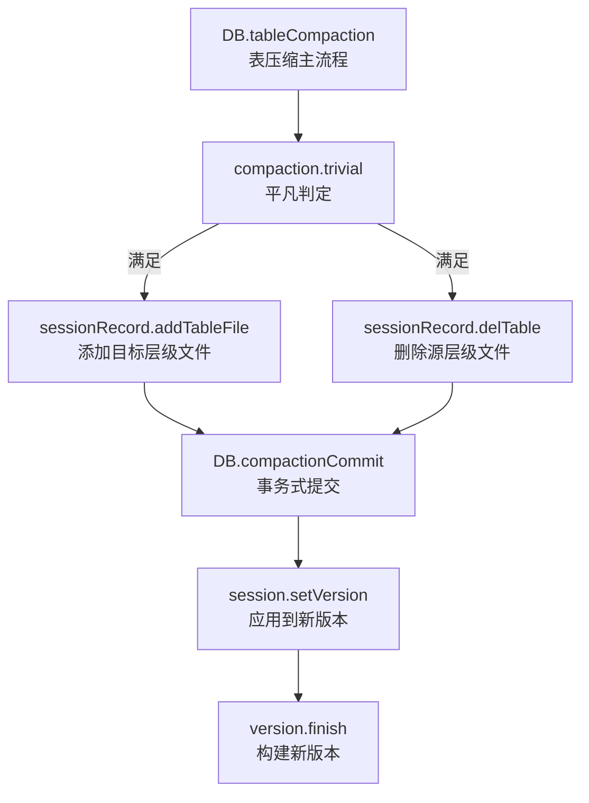
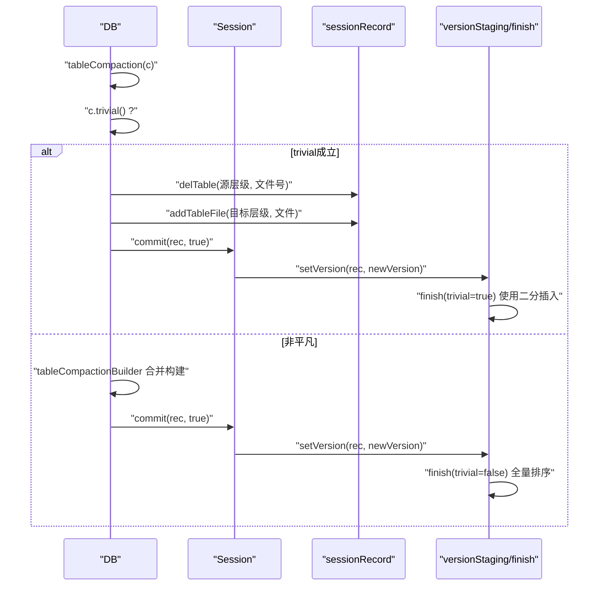
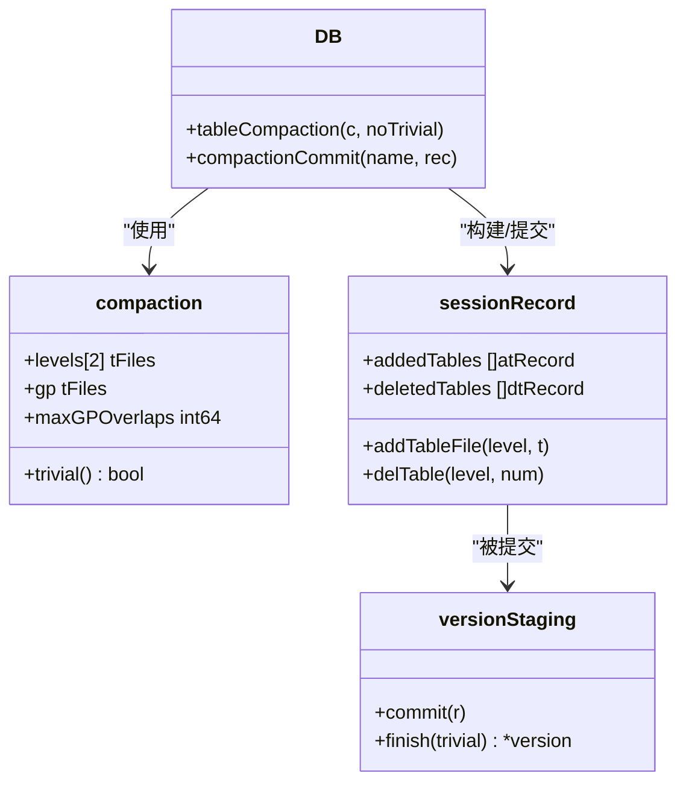
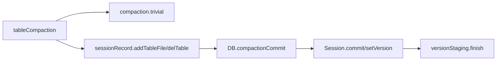

# 平凡压缩

<cite>
**本文引用的文件列表**
- [leveldb/db_compaction.go](file://leveldb/db_compaction.go)
- [leveldb/session_compaction.go](file://leveldb/session_compaction.go)
- [leveldb/session_record.go](file://leveldb/session_record.go)
- [leveldb/version.go](file://leveldb/version.go)
- [leveldb/session_util.go](file://leveldb/session_util.go)
</cite>

## 目录
1. [简介](#简介)
2. [项目结构与定位](#项目结构与定位)
3. [核心组件](#核心组件)
4. [架构总览](#架构总览)
5. [详细组件分析](#详细组件分析)
6. [依赖关系分析](#依赖关系分析)
7. [性能考量](#性能考量)
8. [故障排查指南](#故障排查指南)
9. [结论](#结论)

## 简介
本篇文档聚焦于 avccDB 的“平凡压缩”（trivial compaction）路径：当一次压缩满足特定的 trivial 条件时（单个输入文件且无需实际合并），系统通过直接移动文件层级的方式进行优化，避免读写与排序等昂贵操作，从而显著降低 I/O 和 CPU 开销。本文将详细解释：
- trivial 判断逻辑在 tableCompaction 方法中的实现与触发点
- 文件数量、大小与重叠检查如何共同决定是否走平凡路径
- sessionRecord 中文件指针的转移过程
- 如何通过 addTableFile 与 delTable 实现 O(1) 复杂度的文件移动
- 从源层级到目标层级的文件迁移流程与日志中“table@move”事件的生成
- 这种优化对系统性能的具体影响

## 项目结构与定位
- 平凡压缩的核心逻辑位于表压缩主流程中，入口为 tableCompaction，并在其中调用 trivial 判定与快速提交路径。
- trivial 判定由 compaction.trivial 提供，基于当前待压缩的两层文件集合与 GP（grandparent）重叠阈值。
- 文件指针的增删与版本更新由 sessionRecord 与 versionStaging/finish 协作完成，最终通过 session.commit 提交到新版本。

图表来源
- [leveldb/db_compaction.go](file://leveldb/db_compaction.go#L567-L629)
- [leveldb/session_compaction.go](file://leveldb/session_compaction.go#L248-L251)
- [leveldb/session_record.go](file://leveldb/session_record.go#L109-L131)
- [leveldb/version.go](file://leveldb/version.go#L716-L865)
- [leveldb/session_util.go](file://leveldb/session_util.go#L267-L295)

章节来源
- [leveldb/db_compaction.go](file://leveldb/db_compaction.go#L567-L629)
- [leveldb/session_compaction.go](file://leveldb/session_compaction.go#L248-L251)
- [leveldb/session_record.go](file://leveldb/session_record.go#L109-L131)
- [leveldb/version.go](file://leveldb/version.go#L716-L865)
- [leveldb/session_util.go](file://leveldb/session_util.go#L267-L295)

## 核心组件
- 表压缩主流程：负责选择压缩任务、执行平凡路径或常规合并构建器，并提交结果。
- 平凡判定：基于输入文件数量、目标层是否为空、GP 重叠不超过阈值。
- 会话记录：承载本次压缩涉及的新增/删除文件清单，用于版本变更。
- 版本构建：在平凡路径下，利用二分插入策略直接将新增文件插入目标层，跳过全量排序。

章节来源
- [leveldb/db_compaction.go](file://leveldb/db_compaction.go#L567-L629)
- [leveldb/session_compaction.go](file://leveldb/session_compaction.go#L248-L251)
- [leveldb/session_record.go](file://leveldb/session_record.go#L109-L131)
- [leveldb/version.go](file://leveldb/version.go#L716-L865)

## 架构总览
平凡压缩的端到端流程如下：
- 选择压缩任务并构造 compaction
- 调用 tableCompaction
- 若 trivial 成立：直接在 sessionRecord 中登记删除源层级文件与添加目标层级文件，然后提交
- 提交后通过 session.setVersion 应用到新版本；在平凡路径下，version.finish 使用二分搜索直接插入新增文件，避免全量排序

图表来源
- [leveldb/db_compaction.go](file://leveldb/db_compaction.go#L567-L629)
- [leveldb/session_compaction.go](file://leveldb/session_compaction.go#L248-L251)
- [leveldb/session_record.go](file://leveldb/session_record.go#L109-L131)
- [leveldb/version.go](file://leveldb/version.go#L716-L865)
- [leveldb/session_util.go](file://leveldb/session_util.go#L267-L295)

## 详细组件分析

### trivial 判定逻辑与触发点
- 触发位置：tableCompaction 在构造完 sessionRecord 后立即检查 c.trivial()。
- 判定条件：
  - 源层级仅一个输入文件（levels[0] 长度为 1）
  - 目标层级（sourceLevel+1）当前无任何文件（levels[1] 长度为 0）
  - GP（grandparent）重叠字节数不超过 maxGPOverlaps
- 满足上述三点时，直接走平凡路径，不进行数据扫描与重建。

章节来源
- [leveldb/db_compaction.go](file://leveldb/db_compaction.go#L567-L580)
- [leveldb/session_compaction.go](file://leveldb/session_compaction.go#L248-L251)

### 文件数量、大小与重叠检查
- 文件数量：trivial 的首要约束是源层级仅一个文件，避免多文件合并带来的复杂性。
- 大小：trivial 不直接比较大小，但会统计源层输入总大小用于日志输出与统计。
- 重叠检查：通过 compaction.gp（GP 文件集合）与 maxGPOverlaps 阈值控制，确保目标层不会因过多重叠而需要拆分输出。

章节来源
- [leveldb/db_compaction.go](file://leveldb/db_compaction.go#L582-L592)
- [leveldb/session_compaction.go](file://leveldb/session_compaction.go#L238-L246)

### sessionRecord 中的文件指针转移
- 删除源层级文件：在平凡路径下，先在 sessionRecord 中登记删除源层级的唯一文件。
- 添加目标层级文件：登记该文件进入目标层级。
- 事务式提交：通过 DB.compactionCommit 将 sessionRecord 提交到 Session，随后 setVersion 应用到新版本。

章节来源
- [leveldb/db_compaction.go](file://leveldb/db_compaction.go#L573-L579)
- [leveldb/session_record.go](file://leveldb/session_record.go#L109-L131)
- [leveldb/db_compaction.go](file://leveldb/db_compaction.go#L261-L267)

### O(1) 复杂度的文件移动：addTableFile 与 delTable
- addTableFile：向 sessionRecord 的 addedTables 列表追加一条记录，包含目标层级、文件号、大小与键范围，复杂度 O(1)。
- delTable：向 sessionRecord 的 deletedTables 列表追加一条记录，包含源层级与文件号，复杂度 O(1)。
- 二者均不涉及磁盘读写或排序，仅维护内存中的记录集。

章节来源
- [leveldb/session_record.go](file://leveldb/session_record.go#L109-L131)

### 从源层级到目标层级的文件迁移与日志
- 迁移步骤：
  1) 记录删除源层级文件（delTable）
  2) 记录添加目标层级文件（addTableFile）
  3) 事务式提交（compactionCommit）
  4) 应用到新版本（setVersion）
- 日志事件：在平凡路径下，DB 会在日志中输出“table@move L%d@%d -> L%d”的事件，标记该次移动。

章节来源
- [leveldb/db_compaction.go](file://leveldb/db_compaction.go#L573-L579)

### 平凡路径下的版本构建优化
- 当 trivial 为真且存在新增文件时，version.finish 使用二分搜索直接插入新增文件，避免对整个目标层进行全量排序。
- 对于 level=0 的情形，按文件号顺序插入；对于其他层级，按用户键范围插入。

章节来源
- [leveldb/version.go](file://leveldb/version.go#L780-L865)

### 类图：关键类型与关系

图表来源
- [leveldb/db_compaction.go](file://leveldb/db_compaction.go#L567-L629)
- [leveldb/session_compaction.go](file://leveldb/session_compaction.go#L248-L251)
- [leveldb/session_record.go](file://leveldb/session_record.go#L109-L131)
- [leveldb/version.go](file://leveldb/version.go#L716-L865)

## 依赖关系分析
- tableCompaction 依赖 compaction.trivial 做快速分支
- trivial 分支依赖 sessionRecord 的 addTableFile/delTable 维护文件指针
- 提交阶段依赖 DB.compactionCommit 与 Session.commit
- 版本应用阶段依赖 Session.setVersion 与 versionStaging.finish

图表来源
- [leveldb/db_compaction.go](file://leveldb/db_compaction.go#L567-L629)
- [leveldb/session_compaction.go](file://leveldb/session_compaction.go#L248-L251)
- [leveldb/session_record.go](file://leveldb/session_record.go#L109-L131)
- [leveldb/version.go](file://leveldb/version.go#L716-L865)
- [leveldb/session_util.go](file://leveldb/session_util.go#L267-L295)

章节来源
- [leveldb/db_compaction.go](file://leveldb/db_compaction.go#L567-L629)
- [leveldb/session_compaction.go](file://leveldb/session_compaction.go#L248-L251)
- [leveldb/session_record.go](file://leveldb/session_record.go#L109-L131)
- [leveldb/version.go](file://leveldb/version.go#L716-L865)
- [leveldb/session_util.go](file://leveldb/session_util.go#L267-L295)

## 性能考量
- I/O 优化
  - 平凡路径完全避免了对输入文件的读取与重建，仅在内存中维护新增/删除记录，显著减少磁盘读写。
  - version.finish 在 trivial 场景下采用二分插入，避免全量排序带来的大量 I/O。
- CPU 优化
  - 无需扫描与合并迭代器，也无需构建新的表文件，CPU 计算开销极低。
  - 仅进行必要的元数据更新与日志记录。
- 适用场景
  - 单文件输入、目标层无重叠、GP 重叠阈值允许的情况下，平凡路径收益最大。
  - 对于频繁的小型、非重叠文件提升尤为明显。

[本节提供通用指导，不直接分析具体文件]

## 故障排查指南
- 日志事件
  - 平凡路径会输出“table@move L%d@%d -> L%d”，可据此确认是否命中优化路径。
- 常见问题
  - trivial 未触发：检查源层级是否仅一个文件、目标层是否为空、GP 重叠是否超过阈值。
  - 提交失败：查看 DB.compactionCommit 与 Session.commit 的错误通道与回退逻辑。
  - 版本未生效：确认 Session.setVersion 是否被调用，以及 versionStaging.finish 是否正确应用。

章节来源
- [leveldb/db_compaction.go](file://leveldb/db_compaction.go#L567-L629)
- [leveldb/session_util.go](file://leveldb/session_util.go#L267-L295)

## 结论
平凡压缩通过“只移动文件指针”的方式，在满足 trivial 条件时将压缩成本降至最低：既避免了磁盘读写与排序，又减少了 CPU 计算。其关键在于：
- 精确的 trivial 判定（单文件、目标层空、GP 重叠阈值）
- sessionRecord 的 O(1) 文件指针增删
- version.finish 的二分插入优化
- 事务式提交与版本应用的解耦

这一设计在大规模 LSM 存储中具有显著意义，能够有效降低后台压缩对在线写入与查询的影响。