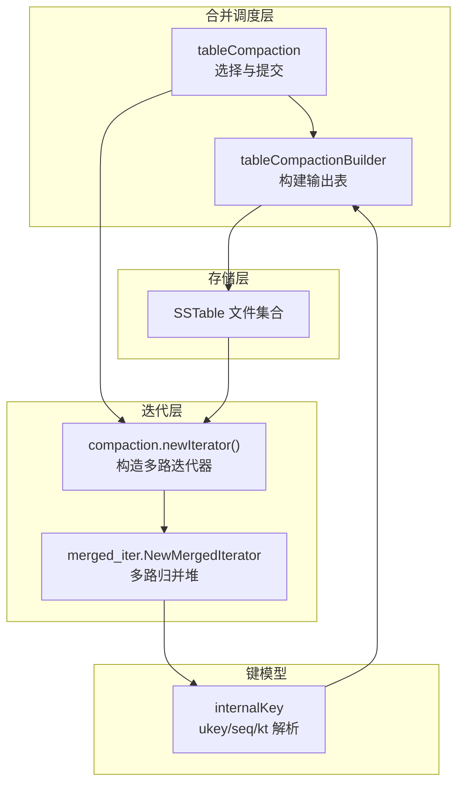
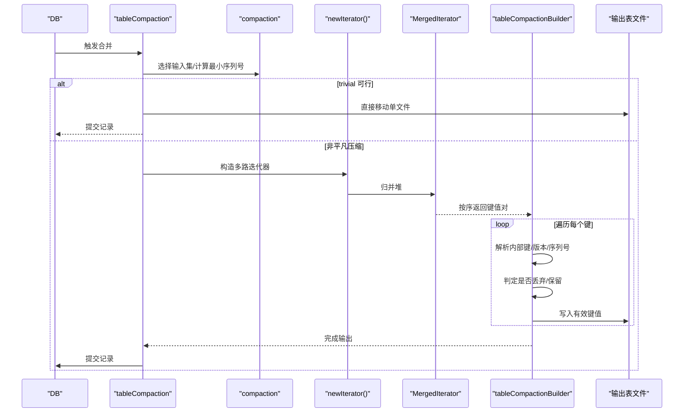
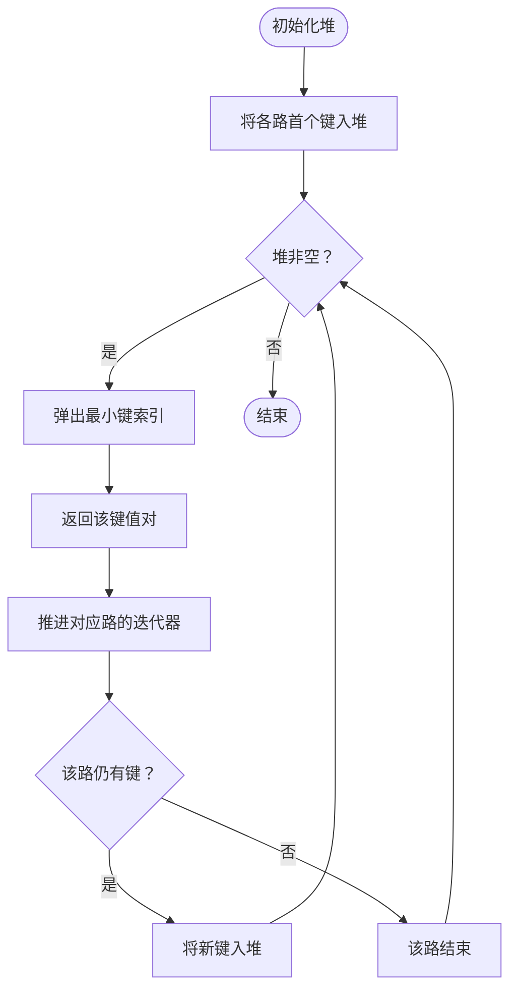
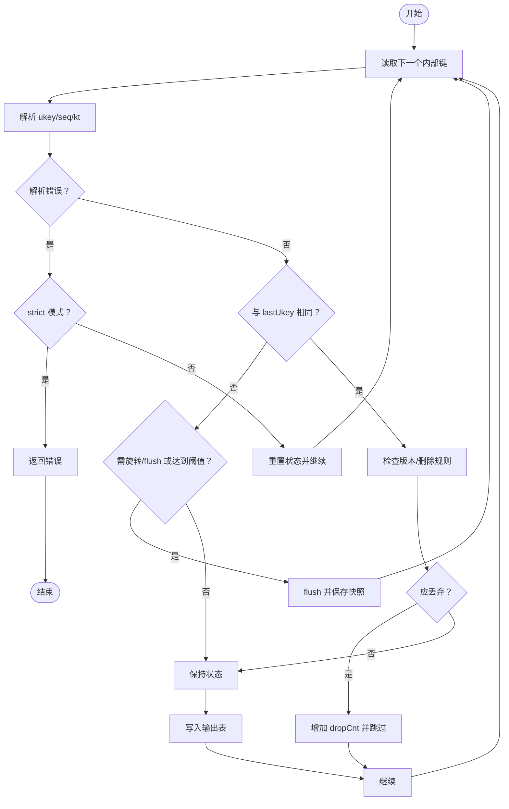
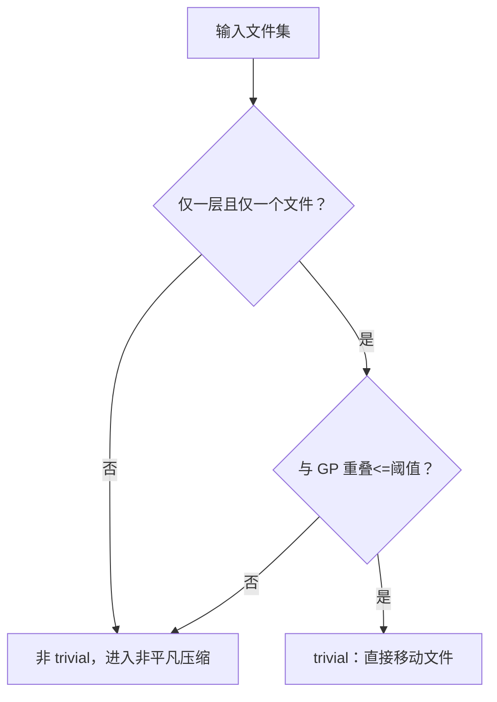
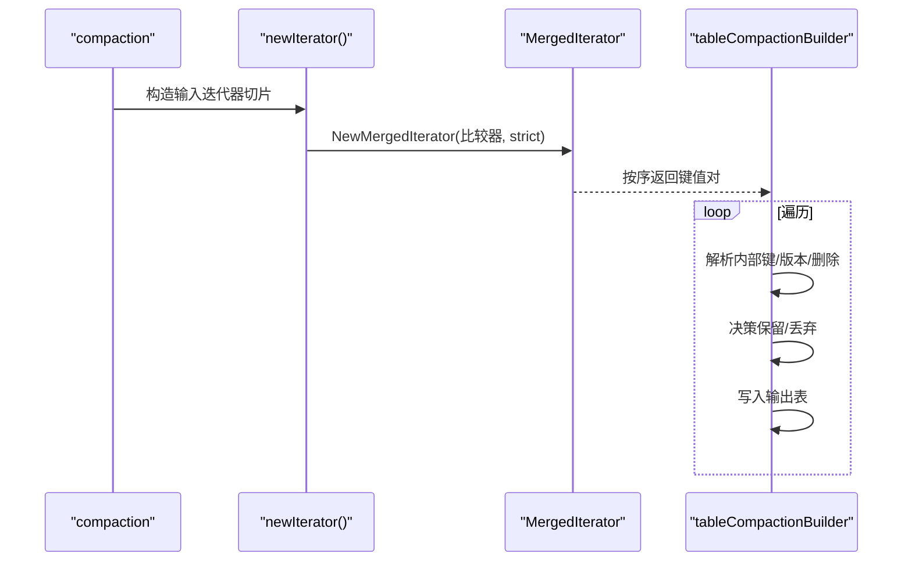
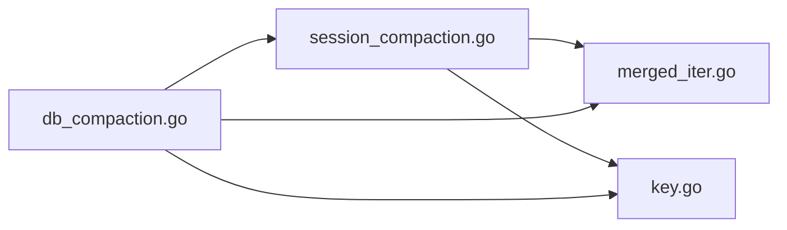

# 数据合并过程

<cite>
**本文引用的文件列表**
- [leveldb/db_compaction.go](file://leveldb/db_compaction.go)
- [leveldb/session_compaction.go](file://leveldb/session_compaction.go)
- [leveldb/iterator/merged_iter.go](file://leveldb/iterator/merged_iter.go)
- [leveldb/key.go](file://leveldb/key.go)
- [leveldb/db_test.go](file://leveldb/db_test.go)
</cite>

## 目录
1. [引言](#引言)
2. [项目结构](#项目结构)
3. [核心组件](#核心组件)
4. [架构总览](#架构总览)
5. [详细组件分析](#详细组件分析)
6. [依赖关系分析](#依赖关系分析)
7. [性能考量](#性能考量)
8. [故障排查指南](#故障排查指南)
9. [结论](#结论)
10. [附录](#附录)

## 引言
本文件围绕 avccDB 的数据合并过程，系统性阐述 tableCompactionBuilder 如何借助合并迭代器（merged_iter）将多个 SSTable 文件的数据有序合并为新的输出文件。重点覆盖以下主题：
- 合并迭代器如何在多路输入上按内部键序进行归并遍历；
- 在合并过程中如何处理相同键的不同版本、删除标记（keyTypeDel）与序列号（seq）的比较规则；
- trivial 判断逻辑如何识别可直接移动的单个文件以提升性能；
- 非平凡压缩中逐条处理键值对的流程；
- 基于 TestDB_TableCompactionBuilder 测试用例，说明重复键、过期数据的处理策略；
- 提供从多个输入文件到单一输出文件的数据流图。

## 项目结构
与数据合并直接相关的模块包括：
- 合并调度与执行：tableCompaction、tableCompactionBuilder
- 合并迭代器：NewMergedIterator 及其内部堆实现
- 键编码与解析：internalKey 编解码、序列号与类型字段
- 合并策略与范围选择：compaction 的 trivial 判定、shouldStopBefore、baseLevelForKey 等

图表来源
- [leveldb/db_compaction.go](file://leveldb/db_compaction.go#L567-L629)
- [leveldb/session_compaction.go](file://leveldb/session_compaction.go#L292-L330)
- [leveldb/iterator/merged_iter.go](file://leveldb/iterator/merged_iter.go#L299-L317)
- [leveldb/key.go](file://leveldb/key.go#L106-L146)

章节来源
- [leveldb/db_compaction.go](file://leveldb/db_compaction.go#L567-L629)
- [leveldb/session_compaction.go](file://leveldb/session_compaction.go#L248-L330)
- [leveldb/iterator/merged_iter.go](file://leveldb/iterator/merged_iter.go#L299-L317)
- [leveldb/key.go](file://leveldb/key.go#L106-L146)

## 核心组件
- tableCompaction：负责挑选待合并的输入集、计算最小序列号、调用 tableCompactionBuilder 构建输出、提交事务。
- tableCompactionBuilder：逐条消费合并迭代器输出，按规则丢弃过期版本或删除标记，写入新表文件。
- compaction.newIterator：根据输入层级构造多路迭代器，必要时使用 NewMergedIterator 进行归并。
- merged_iter：基于堆的多路归并，保证按比较器顺序返回键值对。
- internalKey：包含用户键、版本号、序列号与类型字段，用于排序与语义判定。

章节来源
- [leveldb/db_compaction.go](file://leveldb/db_compaction.go#L567-L629)
- [leveldb/session_compaction.go](file://leveldb/session_compaction.go#L292-L330)
- [leveldb/iterator/merged_iter.go](file://leveldb/iterator/merged_iter.go#L299-L317)
- [leveldb/key.go](file://leveldb/key.go#L106-L146)

## 架构总览
下图展示了从输入文件到输出文件的端到端流程，包括 trivial 移动与非平凡压缩两条路径。

图表来源
- [leveldb/db_compaction.go](file://leveldb/db_compaction.go#L567-L629)
- [leveldb/session_compaction.go](file://leveldb/session_compaction.go#L292-L330)
- [leveldb/iterator/merged_iter.go](file://leveldb/iterator/merged_iter.go#L299-L317)

## 详细组件分析

### 合并迭代器（merged_iter）工作原理
- 多路输入：当源层级为 0 时，可能有多份重叠文件；当源层级 > 0 时，使用索引迭代器聚合。
- 归并堆：以比较器 Compare 为依据，维护一个最小堆，每次弹出当前最小键对应的迭代器索引。
- 方向控制：支持 First/Last/Next/Prev，内部通过堆与方向状态机驱动。
- 错误处理：strict 模式下遇到损坏错误会终止；否则跳过该输入迭代器继续。

图表来源
- [leveldb/iterator/merged_iter.go](file://leveldb/iterator/merged_iter.go#L145-L245)
- [leveldb/iterator/merged_iter.go](file://leveldb/iterator/merged_iter.go#L299-L317)

章节来源
- [leveldb/iterator/merged_iter.go](file://leveldb/iterator/merged_iter.go#L145-L245)
- [leveldb/iterator/merged_iter.go](file://leveldb/iterator/merged_iter.go#L299-L317)

### tableCompactionBuilder 的合并处理逻辑
- 输入来源：通过 compaction.newIterator 获取统一有序的键序列。
- 关键状态：
  - lastUkey：最近处理的用户键
  - lastSeq：当前用户键保留的最高序列号
  - dropCnt/kerrCnt：丢弃计数与键错误计数
- 版本与删除处理：
  - 当 lastSeq <= minSeq 且为版本化键时，保留所有历史版本（mLSM 要求）。
  - 对于非版本化键，若存在更新版本则丢弃旧版本（dropCnt++）。
  - 删除标记（keyTypeDel）在特定条件下（如位于基底层级）被保留以支撑 Merkle 证明。
- 表大小与快照：
  - 当前表达到阈值或需要停止时 flush 输出新表，并保存快照以便可恢复。
- 最终清理：若发生错误，清理未完成的输出表。

图表来源
- [leveldb/db_compaction.go](file://leveldb/db_compaction.go#L432-L555)

章节来源
- [leveldb/db_compaction.go](file://leveldb/db_compaction.go#L432-L555)

### trivial 判定与优化
- trivial 条件：仅输入一层的一个文件，且其与“曾祖父级”（grandparent）重叠不超过阈值。
- 作用：避免不必要的重排序与写放大，直接将该文件移动到下一层。

图表来源
- [leveldb/session_compaction.go](file://leveldb/session_compaction.go#L248-L251)
- [leveldb/db_compaction.go](file://leveldb/db_compaction.go#L567-L580)

章节来源
- [leveldb/session_compaction.go](file://leveldb/session_compaction.go#L248-L251)
- [leveldb/db_compaction.go](file://leveldb/db_compaction.go#L567-L580)

### 非平凡压缩中的逐条处理
- 构造多路迭代器：对于层级 0 使用逐文件迭代器，其他层级使用索引迭代器聚合后归并。
- 归并顺序：由比较器决定，确保全局有序。
- 写入策略：遵循版本与删除规则，丢弃过期项，必要时保留删除标记。

图表来源
- [leveldb/session_compaction.go](file://leveldb/session_compaction.go#L292-L330)
- [leveldb/iterator/merged_iter.go](file://leveldb/iterator/merged_iter.go#L299-L317)
- [leveldb/db_compaction.go](file://leveldb/db_compaction.go#L432-L555)

章节来源
- [leveldb/session_compaction.go](file://leveldb/session_compaction.go#L292-L330)
- [leveldb/iterator/merged_iter.go](file://leveldb/iterator/merged_iter.go#L299-L317)
- [leveldb/db_compaction.go](file://leveldb/db_compaction.go#L432-L555)

### 键编码、序列号与删除标记规则
- internalKey 结构：用户键 + 序列号+类型字段（低 8 位），用于排序与语义判定。
- 排序规则：比较器按用户键排序；当用户键相同时，序列号越大越靠前（降序）。
- 删除标记（keyTypeDel）：当键类型为删除标记时，表示该键已被删除；在某些场景（如基底层级）会被保留以维持一致性证明。
- 版本化键：带版本号的内部键在解析时区分处理，允许保留历史版本以满足 mLSM 的历史状态验证需求。

章节来源
- [leveldb/key.go](file://leveldb/key.go#L106-L146)
- [leveldb/key.go](file://leveldb/key.go#L162-L196)
- [leveldb/db_compaction.go](file://leveldb/db_compaction.go#L502-L528)

### 基于 TestDB_TableCompactionBuilder 的策略验证
- 重复键与多版本：测试通过在单表中写入同一用户键的多个版本，验证合并后仍能正确保留所需版本。
- 过期数据：通过设置最小序列号与 strict 模式，验证过期版本被丢弃，删除标记在基底层级被保留。
- 错误模拟：通过存储层模拟随机 IO 错误，验证可恢复事务机制与回滚行为。

章节来源
- [leveldb/db_test.go](file://leveldb/db_test.go#L2583-L2763)

## 依赖关系分析
- tableCompactionBuilder 依赖 compaction.newIterator 提供统一有序输入。
- compaction.newIterator 依赖 merged_iter.NewMergedIterator 实现多路归并。
- internalKey 的解析与比较贯穿整个合并流程，决定版本保留与删除策略。
- trivial 判定与 shouldStopBefore/baseLevelForKey 共同影响输入集扩展与输出分隔。

图表来源
- [leveldb/db_compaction.go](file://leveldb/db_compaction.go#L567-L629)
- [leveldb/session_compaction.go](file://leveldb/session_compaction.go#L292-L330)
- [leveldb/iterator/merged_iter.go](file://leveldb/iterator/merged_iter.go#L299-L317)
- [leveldb/key.go](file://leveldb/key.go#L106-L146)

章节来源
- [leveldb/db_compaction.go](file://leveldb/db_compaction.go#L567-L629)
- [leveldb/session_compaction.go](file://leveldb/session_compaction.go#L292-L330)
- [leveldb/iterator/merged_iter.go](file://leveldb/iterator/merged_iter.go#L299-L317)
- [leveldb/key.go](file://leveldb/key.go#L106-L146)

## 性能考量
- trivial 移动：避免不必要的重排序与写放大，显著降低 I/O 与 CPU 开销。
- 表大小阈值：当当前输出表达到阈值时 flush，平衡内存占用与写放大。
- 多路归并：堆的插入/弹出复杂度为 O(log k)，k 为输入路数，整体近似线性遍历。
- 严格模式：strict=true 时遇到损坏键会立即失败，减少无效重试；strict=false 时可跳过损坏输入继续。

## 故障排查指南
- 合并失败：检查 compactionTransact 是否捕获并回滚；查看 kerrCnt 与 dropCnt 统计。
- 键解析错误：确认 internalKey 长度与类型字段合法；strict 模式下错误将导致提前退出。
- 删除标记丢失：核对 baseLevelForKey 与 shouldStopBefore 的判定逻辑，确保基底层级删除标记被保留。
- IO 错误：利用存储层模拟错误能力定位问题点，观察可恢复重试与回滚行为。

章节来源
- [leveldb/db_compaction.go](file://leveldb/db_compaction.go#L147-L210)
- [leveldb/db_compaction.go](file://leveldb/db_compaction.go#L432-L555)
- [leveldb/db_test.go](file://leveldb/db_test.go#L2706-L2763)

## 结论
avccDB 的数据合并通过 tableCompactionBuilder 与合并迭代器协同工作，实现了高效、可控的多输入有序合并。trivial 判定在多数情况下避免了不必要的重排序，而非平凡压缩则通过严格的版本与删除规则保障数据一致性与历史状态可验证性。测试用例进一步验证了重复键、过期数据与错误处理等关键行为。

## 附录
- 关键流程参考路径
  - 合并调度与提交：[leveldb/db_compaction.go](file://leveldb/db_compaction.go#L567-L629)
  - 合并迭代器构造：[leveldb/session_compaction.go](file://leveldb/session_compaction.go#L292-L330)
  - 合并迭代器实现：[leveldb/iterator/merged_iter.go](file://leveldb/iterator/merged_iter.go#L299-L317)
  - 键解析与排序：[leveldb/key.go](file://leveldb/key.go#L106-L146)
  - 测试用例验证：[leveldb/db_test.go](file://leveldb/db_test.go#L2583-L2763)