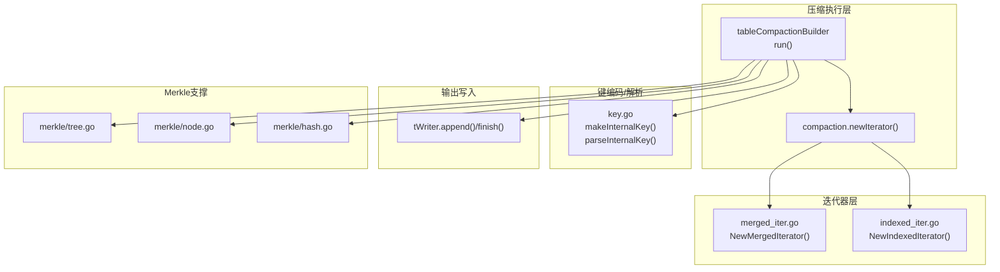
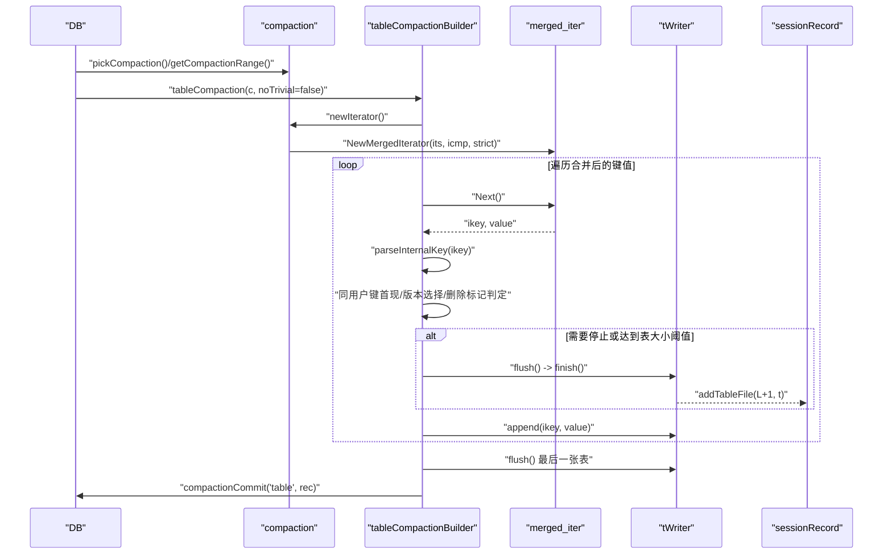
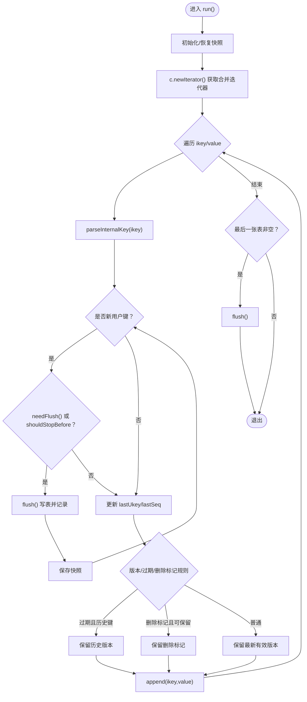
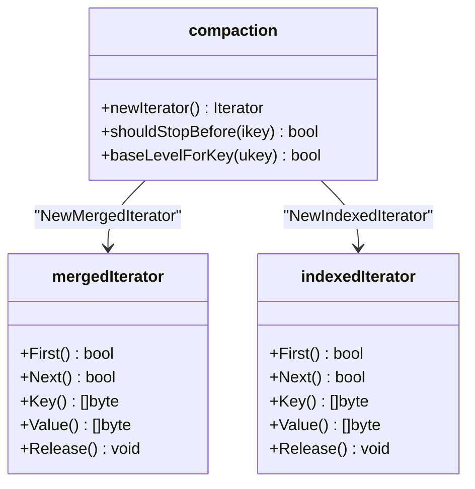
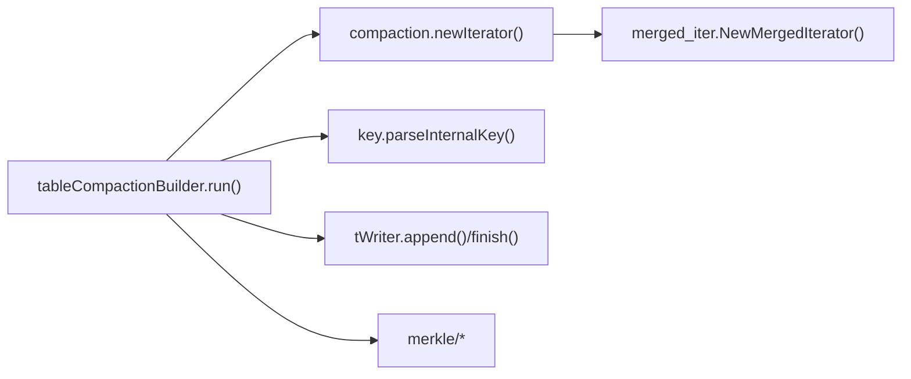

# 非平凡压缩

<cite>
**本文引用的文件**
- [db_compaction.go](file://leveldb/db_compaction.go)
- [session_compaction.go](file://leveldb/session_compaction.go)
- [merged_iter.go](file://leveldb/iterator/merged_iter.go)
- [key.go](file://leveldb/key.go)
- [db_test.go](file://leveldb/db_test.go)
- [tree.go](file://leveldb/merkle/tree.go)
- [node.go](file://leveldb/merkle/node.go)
- [hash.go](file://leveldb/merkle/hash.go)
</cite>

## 目录
1. [简介](#简介)
2. [项目结构](#项目结构)
3. [核心组件](#核心组件)
4. [架构总览](#架构总览)
5. [详细组件分析](#详细组件分析)
6. [依赖关系分析](#依赖关系分析)
7. [性能考量](#性能考量)
8. [故障排查指南](#故障排查指南)
9. [结论](#结论)
10. [附录](#附录)

## 简介
本文件围绕 avccDB 的“非平凡压缩”流程，系统性阐述 tableCompactionBuilder 如何借助 merged_iter 对来自多个 SSTable 文件的键值对进行归并排序，并在 run 方法中逐条处理输入，完成以下关键目标：
- 使用合并迭代器遍历所有输入文件的键值对，按用户键与序列号的规则进行排序；
- 在相同用户键出现多版本时，依据序列号（seq）与类型（keyType）决定保留策略；
- 对删除标记（tombstone）进行特殊处理：在 mLSM 架构下保留以支持 Merkle 证明；
- 在需要时通过 flush 将累积的数据写入新的 SSTable；
- 展示从多个输入文件到有序输出文件的数据流，包含缓冲区管理、文件切分与资源清理。

同时，结合 TestDB_TableCompactionBuilder 测试用例，说明重复键、过期数据的处理逻辑，以及在异常场景下的重试与一致性保障。

## 项目结构
与“非平凡压缩”直接相关的核心模块如下：
- 压缩执行与构建器：leveldb/db_compaction.go 中的 tableCompactionBuilder 及其 run 方法
- 合并迭代器：leveldb/iterator/merged_iter.go 提供多路归并能力
- 迭代器工厂与合并：leveldb/session_compaction.go 中 compaction.newIterator 负责构造合并迭代器
- 内部键解析与序列号常量：leveldb/key.go 定义内部键格式、解析与序列号上限
- Merkle 支持：leveldb/merkle/* 提供树节点、哈希等支撑，用于历史版本与删除标记的证明
- 测试用例：leveldb/db_test.go 中的 TestDB_TableCompactionBuilder 展示了重复键、过期数据与错误恢复的行为

图表来源
- [db_compaction.go](file://leveldb/db_compaction.go#L356-L629)
- [session_compaction.go](file://leveldb/session_compaction.go#L292-L329)
- [merged_iter.go](file://leveldb/iterator/merged_iter.go#L299-L317)
- [key.go](file://leveldb/key.go#L75-L132)
- [tree.go](file://leveldb/merkle/tree.go#L1-L66)
- [node.go](file://leveldb/merkle/node.go#L1-L52)
- [hash.go](file://leveldb/merkle/hash.go#L1-L66)

章节来源
- [db_compaction.go](file://leveldb/db_compaction.go#L356-L629)
- [session_compaction.go](file://leveldb/session_compaction.go#L292-L329)
- [merged_iter.go](file://leveldb/iterator/merged_iter.go#L299-L317)
- [key.go](file://leveldb/key.go#L75-L132)

## 核心组件
- tableCompactionBuilder：负责读取合并后的键值流，按规则过滤与选择，必要时 flush 输出新表。
- compaction.newIterator：根据输入层级与文件集合，构造多路合并迭代器或索引迭代器。
- merged_iter：基于堆的多路归并，保证严格递增顺序。
- key.go：定义内部键格式、序列号上限、删除标记类型、解析函数。
- Merkle 支撑：提供节点、哈希与树结构，用于历史版本与删除标记的证明。

章节来源
- [db_compaction.go](file://leveldb/db_compaction.go#L356-L629)
- [session_compaction.go](file://leveldb/session_compaction.go#L292-L329)
- [merged_iter.go](file://leveldb/iterator/merged_iter.go#L299-L317)
- [key.go](file://leveldb/key.go#L75-L132)
- [tree.go](file://leveldb/merkle/tree.go#L1-L66)
- [node.go](file://leveldb/merkle/node.go#L1-L52)
- [hash.go](file://leveldb/merkle/hash.go#L1-L66)

## 架构总览
下面的时序图展示了非平凡压缩从输入到输出的关键步骤，包括合并迭代器的使用、键解析、规则判断与 flush 写出。

图表来源
- [db_compaction.go](file://leveldb/db_compaction.go#L567-L629)
- [session_compaction.go](file://leveldb/session_compaction.go#L292-L329)
- [merged_iter.go](file://leveldb/iterator/merged_iter.go#L299-L317)
- [db_test.go](file://leveldb/db_test.go#L2583-L2763)

## 详细组件分析

### tableCompactionBuilder.run 的处理流程
- 初始化与状态恢复：从 compaction 恢复快照，确保断点续跑时能从上次位置继续。
- 获取合并迭代器：调用 compaction.newIterator，得到按内部键排序的统一遍历视图。
- 逐条处理键值：
  - 解析内部键，提取用户键、序列号、类型；
  - 若遇到新的用户键，检查是否需要切换输出表（到达大小阈值或 shouldStopBefore 触发）；
  - 版本选择与过期判定：
    - 当前版本小于等于最小可见序列号（minSeq）时，保留历史版本（含版本化键）；
    - 删除标记（tombstone）且满足 baseLevelForKey 条件时，保留以支持 Merkle 证明；
    - 其他情况下按序列号降序保留最新有效版本；
  - 错误处理：strict 模式下，解析失败直接返回；否则记录计数并跳过。
- 输出控制：当累积大小超过阈值或需要停止时，flush 写出当前表并记录到 sessionRecord；最后确保写出最后一张表。

图表来源
- [db_compaction.go](file://leveldb/db_compaction.go#L432-L555)
- [session_compaction.go](file://leveldb/session_compaction.go#L272-L290)

章节来源
- [db_compaction.go](file://leveldb/db_compaction.go#L432-L555)
- [session_compaction.go](file://leveldb/session_compaction.go#L272-L290)

### 合并迭代器与多路归并
- 构造策略：
  - level-0：对每个文件分别创建迭代器，再合并；
  - 其他层级：使用索引迭代器包装多个文件，再合并；
- 归并实现：基于堆的多路归并，保证严格递增顺序；
- 错误传播：strict 模式下，输入迭代器的损坏错误会终止合并迭代器。

图表来源
- [session_compaction.go](file://leveldb/session_compaction.go#L292-L329)
- [merged_iter.go](file://leveldb/iterator/merged_iter.go#L299-L317)

章节来源
- [session_compaction.go](file://leveldb/session_compaction.go#L292-L329)
- [merged_iter.go](file://leveldb/iterator/merged_iter.go#L1-L351)

### 序列号（seq）比较规则与删除标记（tombstone）
- 内部键格式与解析：
  - 非版本化键：ukey + 8 字节（seq<<8 | type）；
  - 版本化键：ukey + 8 字节版本 + 8 字节（seq<<8 | type）；
  - 序列号上限与最大打包值由 keyMaxSeq、keyMaxNum 定义；
- 比较规则：
  - 用户键相等时，按序列号降序排列（更高序列号优先）；
  - 类型为 keyTypeDel 的删除标记在合并迭代器中参与排序；
- 过期与历史版本：
  - 当前版本小于等于 minSeq 时，保留历史版本（含版本化键），以便历史查询与证明；
- 删除标记保留策略（mLSM）：
  - 当删除标记满足 baseLevelForKey 条件时，保留删除标记以支持 Merkle 证明；
  - 该策略不同于传统 LevelDB，后者可能丢弃过期删除标记。

章节来源
- [key.go](file://leveldb/key.go#L75-L132)
- [db_compaction.go](file://leveldb/db_compaction.go#L502-L528)
- [session_compaction.go](file://leveldb/session_compaction.go#L253-L269)

### flush 与输出文件管理
- 缓冲区管理：
  - tableCompactionBuilder 维护一个 tWriter，append 时写入当前表；
  - 当表大小达到阈值或需要停止时，flush 结束当前表并记录到 sessionRecord；
- 文件切分：
  - shouldStopBefore 会根据“祖父级重叠”阈值触发新输出；
  - 达到大小阈值也会触发切分；
- 资源清理：
  - run 结束时若仍有未写出的表，会 flush；
  - 异常路径通过 cleanup 确保临时表被 drop。

章节来源
- [db_compaction.go](file://leveldb/db_compaction.go#L380-L420)
- [db_compaction.go](file://leveldb/db_compaction.go#L432-L555)
- [session_compaction.go](file://leveldb/session_compaction.go#L272-L290)

### mLSM 下的历史版本与删除标记对 Merkle 证明的支持
- 历史版本保留：当版本小于等于 minSeq 且为版本化键时，保留历史版本，便于生成历史 Merkle 证明；
- 删除标记保留：当删除标记满足 baseLevelForKey 条件时，保留删除标记，确保 Merkle 证明能正确证明某键不存在；
- Merkle 树支撑：merkle/node.go、merkle/tree.go、merkle/hash.go 提供节点、树与哈希计算，用于历史版本与删除标记的证明。

章节来源
- [db_compaction.go](file://leveldb/db_compaction.go#L502-L528)
- [session_compaction.go](file://leveldb/session_compaction.go#L253-L269)
- [node.go](file://leveldb/merkle/node.go#L1-L52)
- [tree.go](file://leveldb/merkle/tree.go#L1-L66)
- [hash.go](file://leveldb/merkle/hash.go#L1-L66)

### TestDB_TableCompactionBuilder 测试要点
- 重复键与多版本：构造同一用户键的多个版本（不同序列号），验证合并后仅保留最新有效版本；
- 过期数据：通过设置较小的 minSeq，验证历史版本被保留；
- 删除标记：验证删除标记在满足条件时被保留；
- 错误恢复：模拟存储层瞬时错误，验证 run 在错误后可重试并最终成功；
- 输出一致性：比较不同层级输出表的键范围与顺序，确保无跨表跳跃。

章节来源
- [db_test.go](file://leveldb/db_test.go#L2583-L2763)

## 依赖关系分析
- tableCompactionBuilder 依赖 compaction.newIterator 提供的合并迭代器；
- 合并迭代器依赖 comparer.Comparer 实现键比较；
- 内部键解析依赖 key.go 的解析函数；
- 输出写入依赖 tWriter.finish/append；
- Merkle 证明依赖 merkle/* 提供的树与哈希。

图表来源
- [db_compaction.go](file://leveldb/db_compaction.go#L432-L555)
- [session_compaction.go](file://leveldb/session_compaction.go#L292-L329)
- [merged_iter.go](file://leveldb/iterator/merged_iter.go#L299-L317)
- [key.go](file://leveldb/key.go#L106-L132)
- [tree.go](file://leveldb/merkle/tree.go#L1-L66)
- [node.go](file://leveldb/merkle/node.go#L1-L52)
- [hash.go](file://leveldb/merkle/hash.go#L1-L66)

章节来源
- [db_compaction.go](file://leveldb/db_compaction.go#L432-L555)
- [session_compaction.go](file://leveldb/session_compaction.go#L292-L329)
- [merged_iter.go](file://leveldb/iterator/merged_iter.go#L299-L317)
- [key.go](file://leveldb/key.go#L106-L132)

## 性能考量
- 多路归并复杂度：合并 n 路迭代器，每步比较需 O(log n) 时间，整体近似 O(N log n)，其中 N 为总键数；
- 表大小阈值：合理设置 CompactionTableSize，避免频繁 flush 导致小表碎片；
- Grandparent 重叠限制：shouldStopBefore 基于 gpOverlappedBytes 与 maxGPOverlaps 控制输出大小，减少后续扫描成本；
- 缓存策略：ReadOptions.DontFillCache=true，降低 compaction 对热数据缓存的影响。

[本节为通用性能讨论，不直接分析具体文件]

## 故障排查指南
- 解析错误：strict 模式下，parseInternalKey 返回的错误会直接导致 run 失败；建议检查键编码与存储完整性；
- 存储错误：测试用例演示了瞬时错误模拟与重试，确认 run 在错误后可恢复；
- 资源清理：若 run 异常退出，cleanup 会 drop 未完成的表；确认日志中是否有 cleanup 错误；
- 输出一致性：使用测试中的比较逻辑，核对输出表的键范围与顺序，避免跨表跳跃。

章节来源
- [db_compaction.go](file://leveldb/db_compaction.go#L432-L555)
- [db_test.go](file://leveldb/db_test.go#L2707-L2763)

## 结论
非平凡压缩通过 tableCompactionBuilder 与 merged_iter 协作，实现了对多输入 SSTable 的稳定归并与精细的版本/删除标记处理策略。在 mLSM 架构下，该流程既保证了数据一致性，又为历史版本与删除标记的 Merkle 证明提供了基础。配合严格的错误处理与资源清理机制，系统在复杂场景下仍能保持稳健与可恢复。

[本节为总结性内容，不直接分析具体文件]

## 附录
- 关键路径参考
  - tableCompactionBuilder.run：[db_compaction.go](file://leveldb/db_compaction.go#L432-L555)
  - compaction.newIterator：[session_compaction.go](file://leveldb/session_compaction.go#L292-L329)
  - merged_iter 归并：[merged_iter.go](file://leveldb/iterator/merged_iter.go#L145-L187)
  - 内部键解析：[key.go](file://leveldb/key.go#L106-L132)
  - 测试用例：[db_test.go](file://leveldb/db_test.go#L2583-L2763)
  - Merkle 支撑：[tree.go](file://leveldb/merkle/tree.go#L1-L66)、[node.go](file://leveldb/merkle/node.go#L1-L52)、[hash.go](file://leveldb/merkle/hash.go#L1-L66)