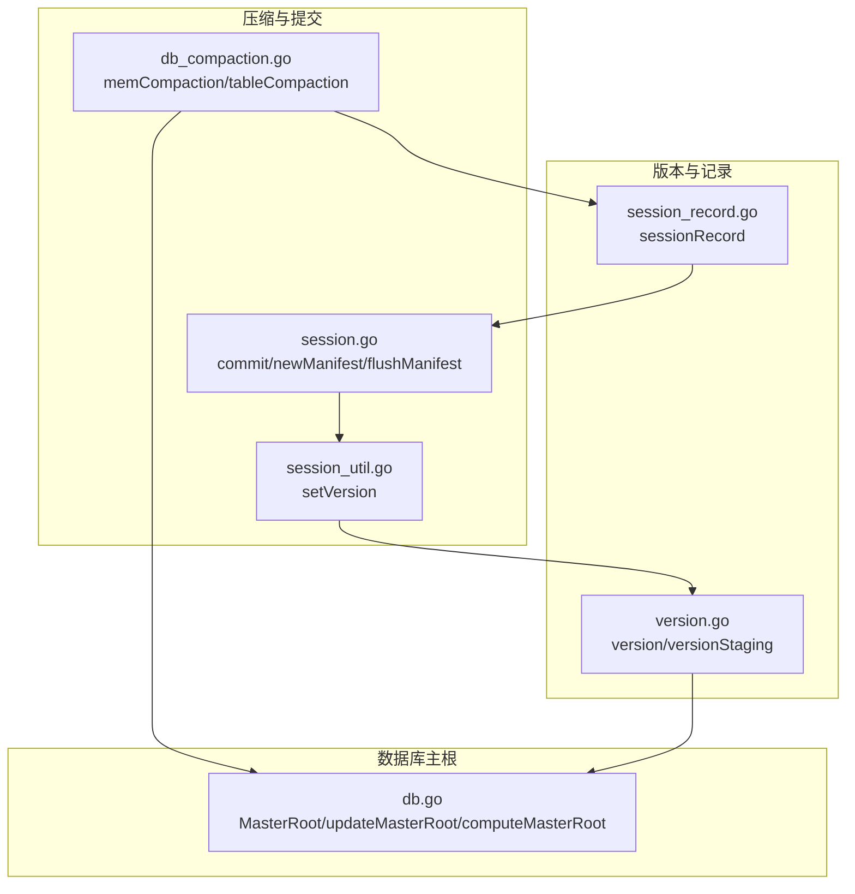
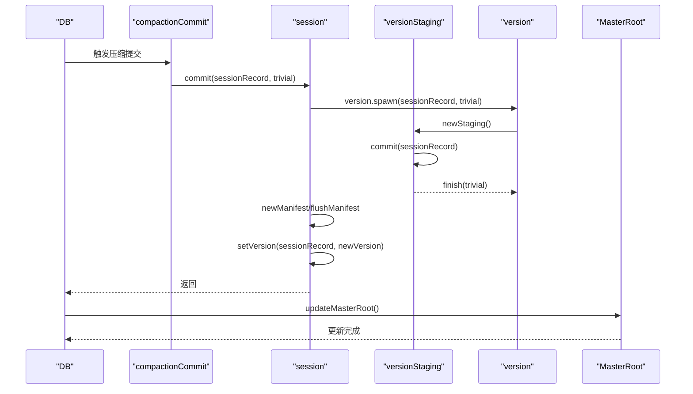
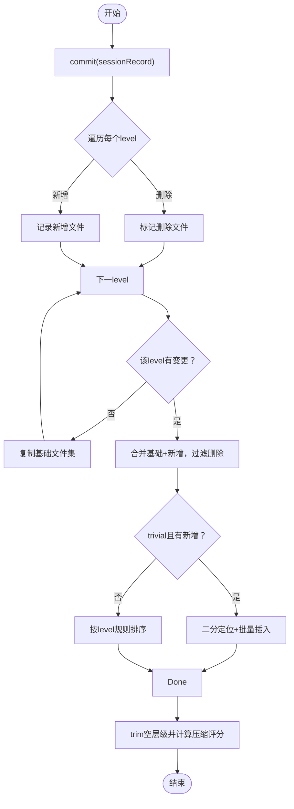
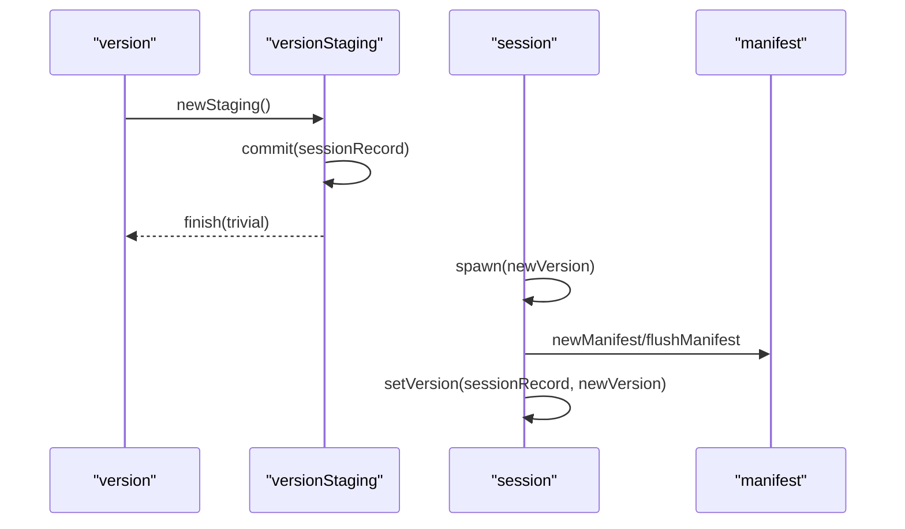
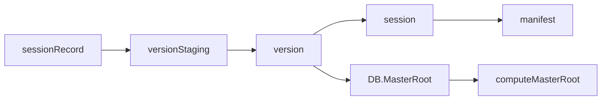

# 版本信息更新

<cite>
**本文引用的文件**
- [version.go](file://leveldb/version.go)
- [session_record.go](file://leveldb/session_record.go)
- [db_compaction.go](file://leveldb/db_compaction.go)
- [session_util.go](file://leveldb/session_util.go)
- [session.go](file://leveldb/session.go)
- [db.go](file://leveldb/db.go)
- [version_test.go](file://leveldb/version_test.go)
</cite>

## 目录
1. [简介](#简介)
2. [项目结构](#项目结构)
3. [核心组件](#核心组件)
4. [架构总览](#架构总览)
5. [详细组件分析](#详细组件分析)
6. [依赖关系分析](#依赖关系分析)
7. [性能考量](#性能考量)
8. [故障排查指南](#故障排查指南)
9. [结论](#结论)

## 简介
本文围绕 avccDB 的版本信息更新流程，系统阐述压缩完成后如何通过 sessionRecord 和 versionStaging 机制原子性地更新数据库版本；解释 addTableFile 与 delTable 如何被记录在 sessionRecord 中，以及 newStaging().commit() 如何将这些变更应用到新版本；说明 trivial 标志如何优化版本更新过程，避免对已排序文件列表进行完整重排序；结合 version_test.go 的测试用例，说明版本更新对读取一致性的影响，以及 MasterRoot 在 tableCompaction 与 memCompaction 后如何被更新以反映数据状态变化，并给出版本更新的原子性保证说明。

## 项目结构
- 版本管理与更新：version.go 定义了 version、versionStaging 及其构建/提交逻辑
- 会话记录：session_record.go 定义了 sessionRecord，用于记录新增/删除的表文件及元信息
- 压缩流程：db_compaction.go 实现 memCompaction 与 tableCompaction，负责生成 sessionRecord 并提交
- 会话提交：session.go 提供 commit 与 setVersion，协调 manifest 写入与版本切换
- 数据库主根：db.go 维护 MasterRoot 并在关键节点更新
- 测试验证：version_test.go 验证版本合并、引用计数与一致性

图表来源
- [version.go](file://leveldb/version.go#L566-L849)
- [session_record.go](file://leveldb/session_record.go#L109-L131)
- [db_compaction.go](file://leveldb/db_compaction.go#L269-L354)
- [session_util.go](file://leveldb/session_util.go#L266-L287)
- [session.go](file://leveldb/session.go#L211-L242)
- [db.go](file://leveldb/db.go#L1491-L1571)

章节来源
- [version.go](file://leveldb/version.go#L566-L849)
- [session_record.go](file://leveldb/session_record.go#L109-L131)
- [db_compaction.go](file://leveldb/db_compaction.go#L269-L354)
- [session_util.go](file://leveldb/session_util.go#L266-L287)
- [session.go](file://leveldb/session.go#L211-L242)
- [db.go](file://leveldb/db.go#L1491-L1571)

## 核心组件
- version：表示当前数据库的版本快照，包含各层的表文件集合，提供 spawn/newStaging/fillRecord 等方法
- versionStaging：版本暂存器，接收 sessionRecord 的变更，按 level 聚合 added/removed，最终生成新版本
- sessionRecord：记录一次压缩或刷新产生的新增/删除表文件，以及序列号、日志编号等元信息
- session.commit：基于当前版本与 sessionRecord 生成新版本，写入 manifest，再 setVersion 切换
- DB.MasterRoot：维护全局聚合 Merkle Root，每次 flush/compaction 后更新

章节来源
- [version.go](file://leveldb/version.go#L26-L43)
- [version.go](file://leveldb/version.go#L566-L575)
- [version.go](file://leveldb/version.go#L577-L583)
- [version.go](file://leveldb/version.go#L702-L742)
- [version.go](file://leveldb/version.go#L744-L849)
- [session_record.go](file://leveldb/session_record.go#L55-L68)
- [session_record.go](file://leveldb/session_record.go#L109-L131)
- [session.go](file://leveldb/session.go#L211-L242)
- [db.go](file://leveldb/db.go#L89-L92)
- [db.go](file://leveldb/db.go#L1491-L1571)

## 架构总览
压缩完成后，DB 通过以下链路更新版本并保证一致性：
- memCompaction/tableCompaction 生成 sessionRecord（记录新增/删除的表文件）
- compactionCommit 调用 session.commit，内部 spawn 新版本并写入 manifest
- setVersion 将新版本设置为当前版本，同时向 deltaCh 发送 added/removed 文件列表
- updateMasterRoot 在 memCompaction/tableCompaction 后更新 MasterRoot

图表来源
- [db_compaction.go](file://leveldb/db_compaction.go#L261-L354)
- [session.go](file://leveldb/session.go#L211-L242)
- [version.go](file://leveldb/version.go#L566-L575)
- [version.go](file://leveldb/version.go#L702-L849)
- [db.go](file://leveldb/db.go#L1562-L1571)

## 详细组件分析

### 1) sessionRecord：记录新增/删除的表文件
- addTableFile(level, t)：将单个表文件记录为新增项（包含 level、文件号、大小、最小/最大内部键）
- delTable(level, num)：记录删除项（level、文件号）
- resetAddedTables/resetDeletedTables：清空对应集合，避免重复记录
- 编码/解码：encode/decode 支持持久化到 manifest

章节来源
- [session_record.go](file://leveldb/session_record.go#L109-L131)
- [session_record.go](file://leveldb/session_record.go#L159-L196)
- [session_record.go](file://leveldb/session_record.go#L258-L324)

### 2) versionStaging：原子性应用变更
- commit(r)：将 sessionRecord 的删除/新增映射到每个 level 的 scratch，去重与消歧
- finish(trivial)：
  - 若某 level 仅删除文件，则直接复制基础文件集，跳过排序
  - 若 trivial 且存在新增文件：使用二分查找定位插入位置，批量拼接新增文件，避免完整排序
  - 否则对新增文件按 level 进行排序后合并
  - 最终 trim 空层级并重新计算压缩评分

图表来源
- [version.go](file://leveldb/version.go#L716-L742)
- [version.go](file://leveldb/version.go#L744-L849)

章节来源
- [version.go](file://leveldb/version.go#L702-L849)

### 3) version.spawn 与 session.commit：原子切换
- version.spawn(r, trivial)：基于当前版本创建 versionStaging，commit 后 finish(trivial) 生成新版本
- session.commit(r, trivial)：
  - spawn 新版本
  - 写入 manifest（newManifest 或 flushManifest）
  - setVersion(r, nv) 原子切换当前版本
  - 异常时通过 abandon 丢弃无用版本 ID

图表来源
- [version.go](file://leveldb/version.go#L566-L575)
- [version.go](file://leveldb/version.go#L702-L849)
- [session.go](file://leveldb/session.go#L211-L242)

章节来源
- [version.go](file://leveldb/version.go#L566-L575)
- [session.go](file://leveldb/session.go#L211-L242)

### 4) addTableFile 与 delTable 的记录与应用
- memCompaction：flushMemdb 生成 sessionRecord，记录新增表文件；提交后 updateMasterRoot
- tableCompaction：根据 trivial 判断是否直接移动（delTable + addTableFile），否则构建新表并记录新增
- setVersion：在切换版本前先持有新版本，再释放旧版本，确保读取一致性

章节来源
- [db_compaction.go](file://leveldb/db_compaction.go#L269-L354)
- [db_compaction.go](file://leveldb/db_compaction.go#L567-L629)
- [session_util.go](file://leveldb/session_util.go#L266-L287)

### 5) trivial 标志的优化与读取一致性
- trivial 优化：当仅删除文件时，直接复制基础文件集；当 trivial 且存在新增文件时，使用二分查找定位插入点，批量拼接新增文件，避免完整排序
- 读取一致性：setVersion 先 incref 新版本，再释放旧版本，确保读取路径始终能访问到旧版本直到切换完成；version.get/getWithProof 等读取逻辑基于当前版本快照，不会看到中间态

章节来源
- [version.go](file://leveldb/version.go#L784-L833)
- [session_util.go](file://leveldb/session_util.go#L266-L287)

### 6) MasterRoot 更新：反映数据状态变化
- 初始化与更新：openDB 后 updateMasterRoot；memCompaction/tableCompaction 后 updateMasterRoot
- 计算策略：遍历所有 level 的 SSTable，收集各自 Merkle Root，逐层聚合，最终得到 MasterRoot
- 读取接口：GetMasterRoot 提供只读访问

章节来源
- [db.go](file://leveldb/db.go#L168-L171)
- [db.go](file://leveldb/db.go#L1562-L1571)
- [db.go](file://leveldb/db.go#L1491-L1561)
- [db_compaction.go](file://leveldb/db_compaction.go#L339-L341)
- [db_compaction.go](file://leveldb/db_compaction.go#L627-L629)

### 7) 版本更新对读取一致性的影响（结合测试）
- version_test.TestVersionReference：并发读取期间执行版本切换，验证文件引用计数正确，未出现悬挂引用
- version_test.TestVersionStaging：覆盖 trivial/非 trivial 场景，验证 level 文件顺序与数量正确
- setVersion 与 abandon：异常时通过 abandon 丢弃新版本 ID，避免阻塞版本处理循环

章节来源
- [version_test.go](file://leveldb/version_test.go#L231-L375)
- [version_test.go](file://leveldb/version_test.go#L21-L229)
- [session_util.go](file://leveldb/session_util.go#L266-L287)
- [session.go](file://leveldb/session.go#L211-L242)

## 依赖关系分析
- version 依赖 comparator、table 操作器、tFiles 排序能力
- versionStaging 依赖 sessionRecord 的记录结构
- session.commit 依赖 manifest 写入与 setVersion
- DB.updateMasterRoot 依赖各层 SSTable 的 Merkle Root

图表来源
- [session_record.go](file://leveldb/session_record.go#L109-L131)
- [version.go](file://leveldb/version.go#L702-L849)
- [session.go](file://leveldb/session.go#L211-L242)
- [db.go](file://leveldb/db.go#L1491-L1571)

章节来源
- [session_record.go](file://leveldb/session_record.go#L109-L131)
- [version.go](file://leveldb/version.go#L702-L849)
- [session.go](file://leveldb/session.go#L211-L242)
- [db.go](file://leveldb/db.go#L1491-L1571)

## 性能考量
- trivial 优化显著减少排序开销：当新增文件来自相邻范围且与现有文件有序时，使用二分插入批量拼接，避免 qsort 对大数组的低效排序
- 删除-only 快路径：直接复制基础文件集，无需排序
- 批量写入 manifest：newManifest/flushManifest 在 commit 时统一落盘，降低频繁 IO
- MasterRoot 计算按层聚合，避免全库扫描

[本节为通用性能讨论，不直接分析具体文件]

## 故障排查指南
- 版本切换失败：检查 session.commit 是否返回错误，确认 abandon 是否被触发
- 读取异常或悬挂引用：确认 setVersion 是否先 incref 再释放旧版本；查看 version_test.TestVersionReference 的并发场景
- Manifest 写入问题：核对 manifest 文件大小阈值与 newManifest/flushManifest 分支
- MasterRoot 不更新：确认 memCompaction/tableCompaction 后是否调用 updateMasterRoot

章节来源
- [session.go](file://leveldb/session.go#L211-L242)
- [session_util.go](file://leveldb/session_util.go#L266-L287)
- [db_compaction.go](file://leveldb/db_compaction.go#L339-L341)
- [db_compaction.go](file://leveldb/db_compaction.go#L627-L629)

## 结论
avccDB 通过 sessionRecord 记录压缩产生的文件变更，借助 versionStaging 的 commit/finish 机制，在 trivial 优化下高效构建新版本；通过 session.commit 与 setVersion 的原子切换，确保读取一致性；在 memCompaction 与 tableCompaction 后及时更新 MasterRoot，使上层可感知数据状态变化。测试用例覆盖了 trivial/非 trivial、并发读取与引用计数等关键场景，验证了版本更新的正确性与稳定性。