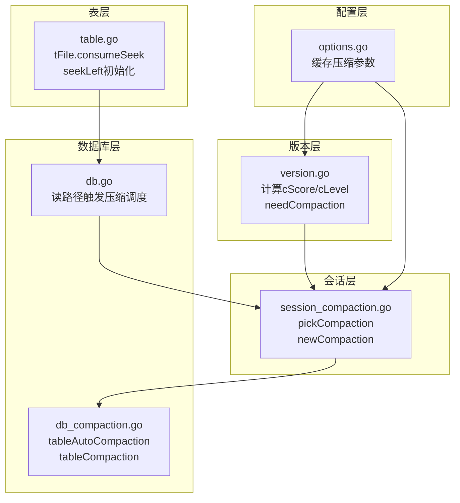
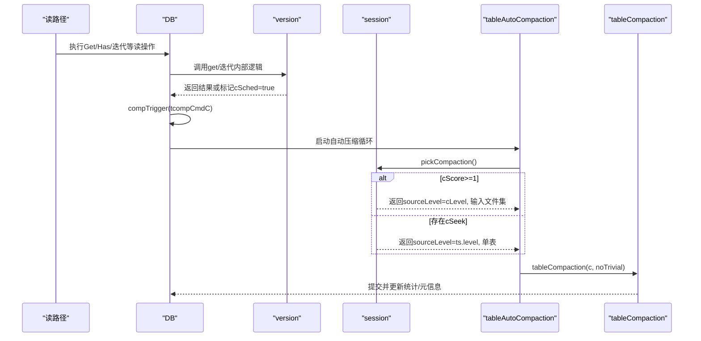
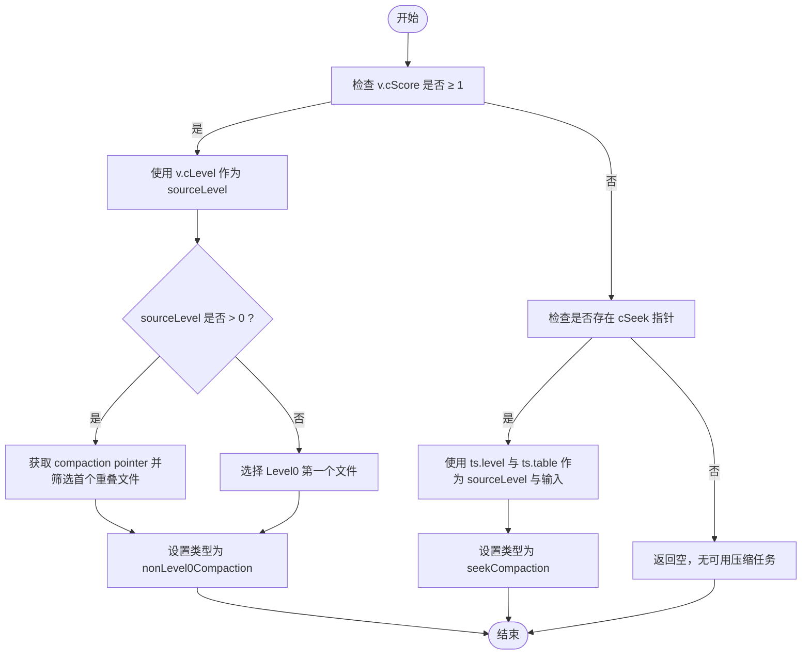
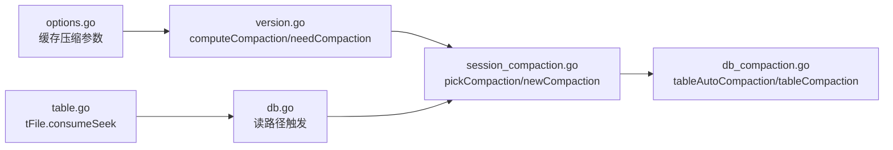

# 自动选择

<cite>
**本文引用的文件**
- [leveldb/db_compaction.go](file://leveldb/db_compaction.go)
- [leveldb/session_compaction.go](file://leveldb/session_compaction.go)
- [leveldb/version.go](file://leveldb/version.go)
- [leveldb/db.go](file://leveldb/db.go)
- [leveldb/table.go](file://leveldb/table.go)
- [leveldb/options.go](file://leveldb/options.go)
</cite>

## 目录
1. [引言](#引言)
2. [项目结构](#项目结构)
3. [核心组件](#核心组件)
4. [架构总览](#架构总览)
5. [详细组件分析](#详细组件分析)
6. [依赖关系分析](#依赖关系分析)
7. [性能考量](#性能考量)
8. [故障排查指南](#故障排查指南)
9. [结论](#结论)
10. [附录](#附录)

## 引言
本文件围绕 avccDB 的压缩输入文件选择过程中的“自动选择策略”展开，聚焦于 pickCompaction 函数如何依据数据库当前状态自动挑选最优压缩任务。文档将详细解释：
- cScore（压缩分数）与 cLevel（压缩层级）的计算机制；
- 基于 cScore 的优先级决策规则：当 cScore≥1 时，选择分数最高的层级进行压缩；
- 当存在大量随机读取（seek）时，cSeek 触发的 seekCompaction 机制；
- computeCompaction 方法如何计算压缩分数，区分 Level0 基于文件数量、非 Level0 基于数据大小的评分标准；
- 自动选择策略的决策流程图与性能影响分析。

## 项目结构
与压缩选择直接相关的模块主要分布在以下文件：
- 版本与压缩分数计算：version.go
- 会话层压缩选择入口：session_compaction.go
- 数据库层自动触发与执行：db_compaction.go、db.go
- 表文件的 seek 计数与阈值：table.go
- 选项缓存与压缩参数：options.go

图表来源
- [leveldb/version.go](file://leveldb/version.go#L646-L695)
- [leveldb/session_compaction.go](file://leveldb/session_compaction.go#L55-L95)
- [leveldb/db_compaction.go](file://leveldb/db_compaction.go#L669-L673)
- [leveldb/db.go](file://leveldb/db.go#L800-L833)
- [leveldb/table.go](file://leveldb/table.go#L47-L80)
- [leveldb/options.go](file://leveldb/options.go#L55-L107)

章节来源
- [leveldb/version.go](file://leveldb/version.go#L646-L695)
- [leveldb/session_compaction.go](file://leveldb/session_compaction.go#L55-L95)
- [leveldb/db_compaction.go](file://leveldb/db_compaction.go#L669-L673)
- [leveldb/db.go](file://leveldb/db.go#L800-L833)
- [leveldb/table.go](file://leveldb/table.go#L47-L80)
- [leveldb/options.go](file://leveldb/options.go#L55-L107)

## 核心组件
- 版本对象 version：维护各层级的表集合，并计算全局压缩分数 cScore 与目标层级 cLevel；同时提供 needCompaction 判定是否需要触发压缩。
- 会话对象 session：在版本之上实现 pickCompaction，依据 cScore 或 cSeek 决定压缩类型与输入文件集。
- 数据库对象 DB：在读路径中检测到需要触发压缩时，通过 compTrigger 发送自动压缩命令；并在压缩完成后更新统计与元信息。
- 表文件 tFile：记录每个 SSTable 的 seekLeft 指标，用于触发 seekCompaction。

章节来源
- [leveldb/version.go](file://leveldb/version.go#L26-L43)
- [leveldb/session_compaction.go](file://leveldb/session_compaction.go#L55-L95)
- [leveldb/db.go](file://leveldb/db.go#L800-L833)
- [leveldb/table.go](file://leveldb/table.go#L47-L80)

## 架构总览
下图展示从读请求到压缩选择与执行的关键调用链路，突出 cScore/cLevel 与 cSeek 的作用点。

图表来源
- [leveldb/db.go](file://leveldb/db.go#L800-L833)
- [leveldb/db_compaction.go](file://leveldb/db_compaction.go#L669-L673)
- [leveldb/session_compaction.go](file://leveldb/session_compaction.go#L55-L95)

## 详细组件分析

### 1) 压缩分数 cScore 与目标层级 cLevel 的计算
- 计算位置：version.computeCompaction
- 计算规则：
  - Level0：以文件数量作为基数，除以配置项“L0 触发阈值”得到分数；
  - 非 Level0：以该层级总字节数作为基数，除以配置项“总大小阈值”得到分数；
  - 全局最佳层级 bestLevel 与 bestScore 由上述分数比较得出；
  - 最终写入版本对象的 cLevel 与 cScore 字段。
- 触发条件：version.needCompaction 返回 cScore≥1 或存在 cSeek 指针。

章节来源
- [leveldb/version.go](file://leveldb/version.go#L646-L695)

### 2) 自动选择策略 pickCompaction
- 入口：session.pickCompaction
- 选择逻辑：
  - 若 v.cScore ≥ 1，则选择 cLevel 作为 sourceLevel；
  - 对于非 Level0，若存在“compaction pointer”，则仅选择第一个与 compaction pointer 重叠的文件，避免跨边界扫描；
  - 若 v.cScore < 1，则检查是否存在 cSeek（原子指针），若有则选择该表所在层级与表作为输入，类型为 seekCompaction；
  - 否则返回空，表示暂无可选压缩任务。
- 输出：newCompaction 创建 compaction 对象，随后由上层执行 tableCompaction。

章节来源
- [leveldb/session_compaction.go](file://leveldb/session_compaction.go#L55-L95)

### 3) seek 触发机制 cSeek 与 tFile.consumeSeek
- cSeek 的产生：在读路径中，当命中多个表（sampleSeeks）时，会记录一个候选表集 tSet，用于后续触发 seekCompaction。
- 表文件的 seekLeft 初始化：按表大小估算允许的随机读次数（保守阈值），随着每次 seek 消耗减少。
- 触发时机：当读路径发现需要触发压缩（cSched=true），DB 层通过 compTrigger 发送自动压缩命令，最终由 pickCompaction 识别 cSeek 并选择对应表进行压缩。

章节来源
- [leveldb/version.go](file://leveldb/version.go#L142-L200)
- [leveldb/table.go](file://leveldb/table.go#L47-L80)
- [leveldb/db.go](file://leveldb/db.go#L800-L833)

### 4) 压缩执行与提交
- 自动触发：db_compaction.tableAutoCompaction 在循环中调用 session.pickCompaction，若返回非空则执行 tableCompaction；
- 执行细节：tableCompaction 会根据是否平凡移动（trivial）决定是直接移动还是构建新表；完成后提交并更新统计计数与 MasterRoot。

章节来源
- [leveldb/db_compaction.go](file://leveldb/db_compaction.go#L669-L673)
- [leveldb/db_compaction.go](file://leveldb/db_compaction.go#L567-L629)

### 5) 决策流程图
下图总结了 pickCompaction 的决策流程，涵盖 cScore≥1 与 cSeek 的两条分支。

图表来源
- [leveldb/session_compaction.go](file://leveldb/session_compaction.go#L55-L95)

### 6) 性能影响分析
- Level0 评分偏向文件数量而非字节数，有助于控制 Level0 文件过多导致的每次读放大（多文件合并）。
- 非 Level0 评分基于总字节数，平衡各层数据膨胀与压缩压力。
- seekCompaction 通过表级 seekLeft 阈值，将热点小表的多次随机访问转化为一次压缩，降低后续读放大。
- 选项缓存（cachedOptions）避免频繁读取配置带来的开销，提升版本变更与压缩计算效率。

章节来源
- [leveldb/version.go](file://leveldb/version.go#L646-L695)
- [leveldb/options.go](file://leveldb/options.go#L55-L107)
- [leveldb/table.go](file://leveldb/table.go#L47-L80)

## 依赖关系分析
- version 依赖 options 缓存压缩阈值（如 L0 触发阈值、总大小阈值、GPOverlaps 等）；
- session 依赖 version 的 cScore/cLevel 与 cSeek 指针，构造 compaction；
- DB 在读路径中根据返回标记触发压缩命令；
- table 层负责表级 seekLeft 的初始化与消耗，间接驱动 seekCompaction。

图表来源
- [leveldb/options.go](file://leveldb/options.go#L55-L107)
- [leveldb/version.go](file://leveldb/version.go#L646-L695)
- [leveldb/session_compaction.go](file://leveldb/session_compaction.go#L55-L95)
- [leveldb/db_compaction.go](file://leveldb/db_compaction.go#L669-L673)
- [leveldb/db.go](file://leveldb/db.go#L800-L833)
- [leveldb/table.go](file://leveldb/table.go#L47-L80)

章节来源
- [leveldb/options.go](file://leveldb/options.go#L55-L107)
- [leveldb/version.go](file://leveldb/version.go#L646-L695)
- [leveldb/session_compaction.go](file://leveldb/session_compaction.go#L55-L95)
- [leveldb/db_compaction.go](file://leveldb/db_compaction.go#L669-L673)
- [leveldb/db.go](file://leveldb/db.go#L800-L833)
- [leveldb/table.go](file://leveldb/table.go#L47-L80)

## 性能考量
- 评分权重差异：Level0 使用文件数量，非 Level0 使用字节数，避免 Level0 过度膨胀与读放大。
- seekCompaction：针对热点小表的随机访问，通过阈值触发压缩，显著降低后续读放大。
- 选项缓存：减少配置读取成本，提高版本变更与压缩计算吞吐。
- 扩展与限制：compaction 的输入扩展与 GPOverlaps 限制确保输出文件不会过度膨胀，维持压缩效率。

## 故障排查指南
- 若压缩未触发：
  - 检查 version.computeCompaction 是否正确更新 cScore/cLevel；
  - 确认 DB 读路径是否返回 cSched=true 并调用 compTrigger；
  - 排查 cSeek 是否被设置且表的 seekLeft 是否被正确消耗。
- 若压缩频繁：
  - 检查 L0 触发阈值与总大小阈值配置是否过低；
  - 关注热点表的 seekLeft 是否过早耗尽，必要时调整阈值或优化访问模式。
- 统计与观测：
  - 通过属性接口查看各层表数量、大小与压缩计数，辅助定位问题。

章节来源
- [leveldb/version.go](file://leveldb/version.go#L646-L695)
- [leveldb/db.go](file://leveldb/db.go#L1270-L1356)
- [leveldb/db_compaction.go](file://leveldb/db_compaction.go#L567-L629)

## 结论
avccDB 的自动压缩选择策略以版本层的 cScore/cLevel 为核心，辅以表级 seekLeft 的 cSeek 机制，实现了对不同层级与访问模式的自适应压缩。Level0 与非 Level0 的评分差异有效平衡了读放大与压缩成本；seekCompaction 将热点小表的随机访问转化为批量压缩，显著改善长期性能。通过选项缓存与精简的决策流程，系统在保证稳定性的同时提升了吞吐与响应性。

## 附录
- 术语说明
  - cScore：压缩分数，衡量当前数据库压缩需求的紧迫程度；
  - cLevel：建议压缩的目标层级；
  - cSeek：随机读取触发的压缩候选表指针；
  - seekCompaction：基于随机读取触发的压缩类型。