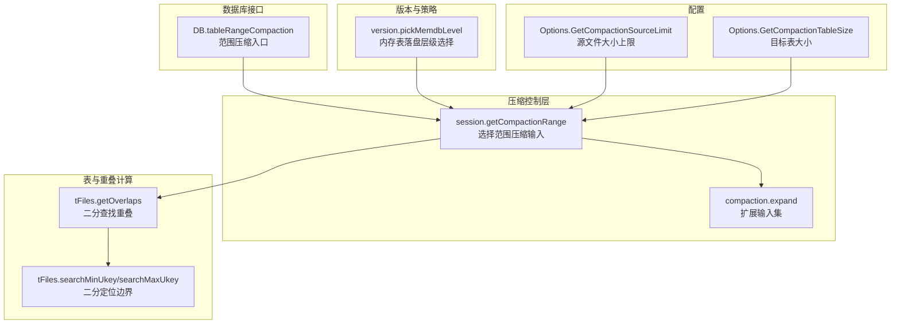
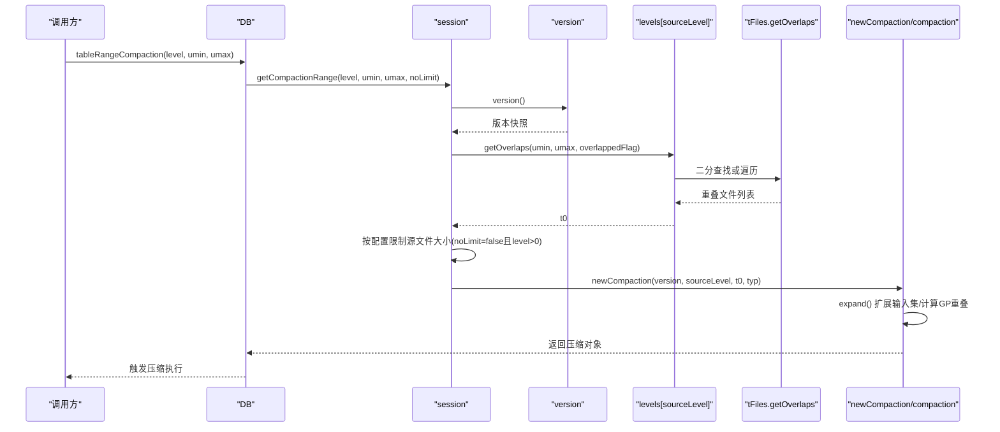
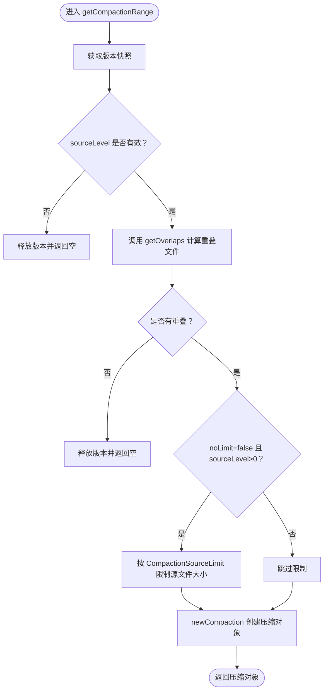
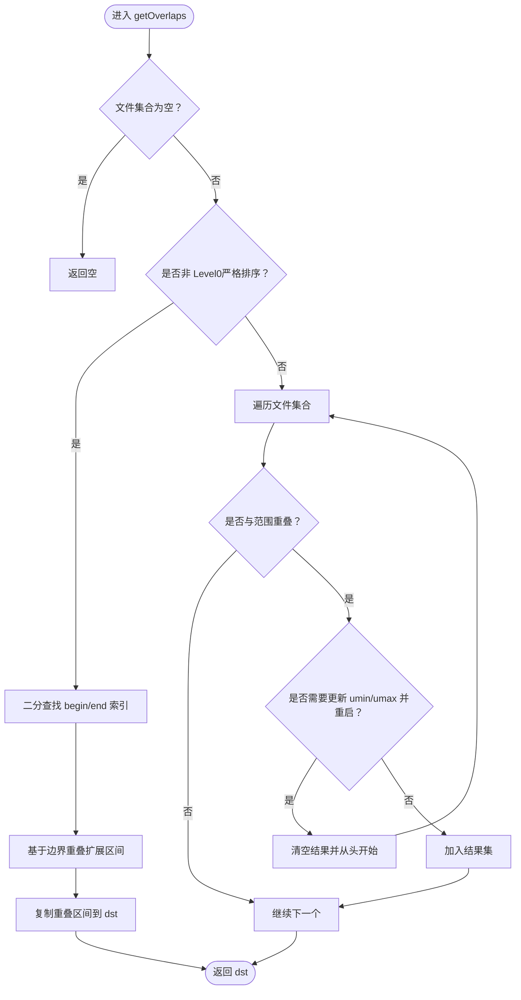
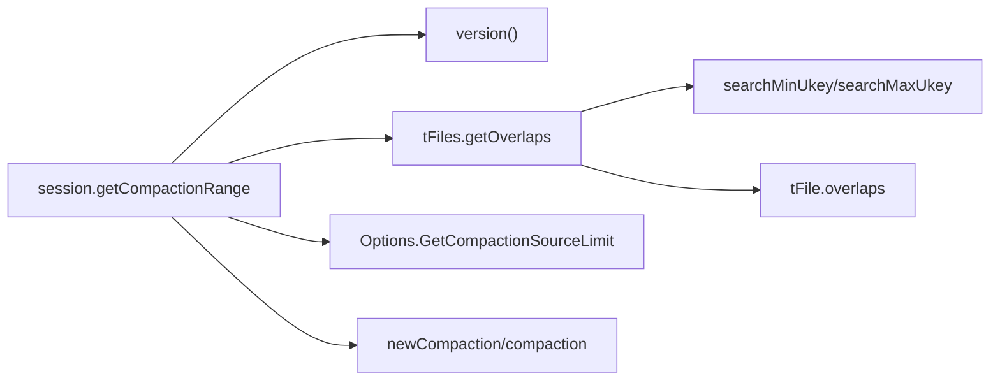

# 范围查询选择

<cite>
**本文引用的文件**
- [session_compaction.go](file://leveldb/session_compaction.go)
- [table.go](file://leveldb/table.go)
- [db_compaction.go](file://leveldb/db_compaction.go)
- [version.go](file://leveldb/version.go)
- [options.go](file://leveldb/options.go)
- [opt/options.go](file://leveldb/opt/options.go)
- [table_test.go](file://leveldb/table_test.go)
</cite>

## 目录
1. [简介](#简介)
2. [项目结构](#项目结构)
3. [核心组件](#核心组件)
4. [架构总览](#架构总览)
5. [详细组件分析](#详细组件分析)
6. [依赖关系分析](#依赖关系分析)
7. [性能考量](#性能考量)
8. [故障排查指南](#故障排查指南)
9. [结论](#结论)
10. [附录](#附录)

## 简介
本文件围绕 avccDB 的压缩输入文件选择过程，聚焦于范围查询选择策略，系统性阐述以下内容：
- getCompactionRange 如何依据源层级与键范围选择重叠的 SSTable 文件；
- Level0 与其他层级在文件选择上的差异：Level0 允许重叠、文件无全局排序；其他层级严格排序；
- getOverlaps 算法如何利用二分查找高效识别非 Level0 层级的重叠文件；
- CompactionSourceLimit 配置项如何限制单次压缩数据量，避免长时间占用资源；
- 结合测试用例与流程图，说明该策略对压缩效率与读取性能的影响。

## 项目结构
与范围查询选择直接相关的核心模块如下：
- 会话与压缩控制：session_compaction.go
- 表集合与重叠计算：table.go
- 数据库压缩入口与范围压缩：db_compaction.go
- 版本与自动选择：version.go
- 选项与配置：options.go、opt/options.go
- 测试验证：table_test.go

图表来源
- [session_compaction.go](file://leveldb/session_compaction.go#L97-L133)
- [table.go](file://leveldb/table.go#L152-L164)
- [table.go](file://leveldb/table.go#L196-L264)
- [db_compaction.go](file://leveldb/db_compaction.go#L630-L666)
- [version.go](file://leveldb/version.go#L621-L644)
- [opt/options.go](file://leveldb/opt/options.go#L493-L499)

章节来源
- [session_compaction.go](file://leveldb/session_compaction.go#L97-L133)
- [table.go](file://leveldb/table.go#L152-L164)
- [table.go](file://leveldb/table.go#L196-L264)
- [db_compaction.go](file://leveldb/db_compaction.go#L630-L666)
- [version.go](file://leveldb/version.go#L621-L644)
- [opt/options.go](file://leveldb/opt/options.go#L493-L499)

## 核心组件
- getCompactionRange：从指定源层级与键范围选择重叠的 SSTable，支持按配置限制单次压缩规模。
- tFiles.getOverlaps：在非 Level0（严格排序）层级使用二分查找快速确定重叠区间；在 Level0（可重叠）层级采用遍历并可能重启搜索的策略。
- newCompaction/compaction.expand：构建压缩对象并扩展输入集，同时计算跨层级重叠（GrandParent）。
- Options.GetCompactionSourceLimit：限制非 Level0 单次压缩的源文件总大小，避免长时间占用资源。
- DB.tableRangeCompaction：范围压缩入口，支持按层级或全量扫描触发。

章节来源
- [session_compaction.go](file://leveldb/session_compaction.go#L97-L133)
- [table.go](file://leveldb/table.go#L196-L264)
- [db_compaction.go](file://leveldb/db_compaction.go#L630-L666)
- [opt/options.go](file://leveldb/opt/options.go#L493-L499)

## 架构总览
范围查询选择贯穿“数据库接口 -> 会话选择 -> 表重叠计算 -> 压缩扩展”的链路，形成从键范围到具体 SSTable 输入集的映射。

图表来源
- [db_compaction.go](file://leveldb/db_compaction.go#L630-L666)
- [session_compaction.go](file://leveldb/session_compaction.go#L97-L133)
- [table.go](file://leveldb/table.go#L196-L264)
- [session_compaction.go](file://leveldb/session_compaction.go#L135-L148)

## 详细组件分析

### 组件A：getCompactionRange 的范围选择策略
- 输入参数：sourceLevel、umin、umax、noLimit
- 关键步骤：
  - 获取当前版本快照；
  - 在 sourceLevel 上调用 getOverlaps 计算重叠文件；
  - 若返回空则放弃；
  - 对非 Level0 且 noLimit 为 false 时，按 CompactionSourceLimit 限制源文件总大小；
  - 创建压缩对象并返回。

图表来源
- [session_compaction.go](file://leveldb/session_compaction.go#L97-L133)
- [opt/options.go](file://leveldb/opt/options.go#L493-L499)

章节来源
- [session_compaction.go](file://leveldb/session_compaction.go#L97-L133)
- [opt/options.go](file://leveldb/opt/options.go#L493-L499)

### 组件B：getOverlaps 的二分查找与重叠判定
- 非 Level0（overlapped=false）：
  - 使用 searchMinUkey/searchMaxUkey 进行二分查找，确定重叠区间的起止索引；
  - 利用相邻文件的边界重叠判断进行扩展，确保包含所有与 umin/umax 有交集的文件；
  - 时间复杂度近似 O(logN + K)，N 为文件数，K 为重叠区间长度。
- Level0（overlapped=true）：
  - 由于文件可重叠且不严格排序，采用遍历方式；
  - 当发现某文件与范围重叠时，可能需要更新 umin/umax 并重启搜索，确保覆盖所有重叠文件；
  - 时间复杂度最坏情况下 O(N^2)，但实际中通过早期短路与边界检查优化。

图表来源
- [table.go](file://leveldb/table.go#L196-L264)
- [table.go](file://leveldb/table.go#L152-L164)

章节来源
- [table.go](file://leveldb/table.go#L196-L264)
- [table.go](file://leveldb/table.go#L152-L164)

### 组件C：Level0 与非 Level0 的差异处理
- Level0 特性：
  - 文件可重叠，不保证全局排序；
  - getOverlaps 使用遍历并可能重启搜索，确保覆盖所有重叠文件；
  - 因此不能简单地按大小限制单次压缩，否则可能遗漏重叠文件。
- 非 Level0 特性：
  - 文件严格排序，可用二分查找快速定位重叠区间；
  - 可安全地按大小限制源文件集合，避免单次压缩过大。

章节来源
- [session_compaction.go](file://leveldb/session_compaction.go#L111-L127)
- [table.go](file://leveldb/table.go#L196-L264)

### 组件D：CompactionSourceLimit 的作用与影响
- 作用：限制非 Level0 单次压缩的源文件总大小，防止一次压缩占用过多资源；
- 计算方式：来源于 Options.GetCompactionSourceLimit，其值为“目标层级表大小 × 来源因子”；
- 影响：
  - 提升系统并发性与稳定性，避免长时间阻塞；
  - 可能导致多次小规模压缩，提高压缩频率但降低单次开销；
  - 对读取性能有利：减少单次合并带来的读放大与写放大峰值。

章节来源
- [opt/options.go](file://leveldb/opt/options.go#L493-L499)
- [options.go](file://leveldb/options.go#L88-L93)
- [session_compaction.go](file://leveldb/session_compaction.go#L111-L127)

### 组件E：范围压缩入口与自动选择
- DB.tableRangeCompaction：
  - 支持按指定层级或全量扫描（level=-1）；
  - 全量扫描时先确定最大重叠层级，再逐层触发范围压缩；
- version.pickMemdbLevel：
  - 内存表落盘时选择合适层级，考虑下一层与隔一层的重叠情况，避免过度重叠。

章节来源
- [db_compaction.go](file://leveldb/db_compaction.go#L630-L666)
- [version.go](file://leveldb/version.go#L621-L644)

## 依赖关系分析
- getCompactionRange 依赖：
  - 版本快照（version）
  - tFiles.getOverlaps（二分查找/遍历）
  - Options.GetCompactionSourceLimit（限制源文件大小）
  - newCompaction/compaction.expand（扩展输入集与计算 GP 重叠）
- getOverlaps 依赖：
  - tFiles.searchMinUkey/searchMaxUkey（二分定位）
  - tFile.overlaps（范围重叠判定）

图表来源
- [session_compaction.go](file://leveldb/session_compaction.go#L97-L133)
- [table.go](file://leveldb/table.go#L152-L164)
- [table.go](file://leveldb/table.go#L196-L264)
- [opt/options.go](file://leveldb/opt/options.go#L493-L499)

章节来源
- [session_compaction.go](file://leveldb/session_compaction.go#L97-L133)
- [table.go](file://leveldb/table.go#L152-L164)
- [table.go](file://leveldb/table.go#L196-L264)
- [opt/options.go](file://leveldb/opt/options.go#L493-L499)

## 性能考量
- 二分查找优势：非 Level0 层级重叠查找为 O(logN + K)，远优于全表扫描；
- Level0 遍历代价：存在重启搜索与多次遍历的风险，应配合较小的单次压缩规模；
- 源文件大小限制：通过 CompactionSourceLimit 控制单次压缩规模，平衡吞吐与延迟；
- 读取性能影响：更频繁的小规模压缩有助于降低单次读放大峰值，提升整体读取稳定性。

## 故障排查指南
- 未产生压缩对象：
  - 检查 sourceLevel 是否越界；
  - 检查 getOverlaps 是否返回空；
  - 确认 noLimit 参数与层级是否符合预期。
- 压缩规模异常：
  - 检查 CompactionSourceLimit 配置是否过小或过大；
  - 核对目标层级表大小与来源因子设置。
- 读取性能下降：
  - 关注压缩频率与单次规模，适当调整因子；
  - 观察 GrandParent 重叠阈值（GPOverlaps）是否触发频繁输出切换。

章节来源
- [session_compaction.go](file://leveldb/session_compaction.go#L97-L133)
- [opt/options.go](file://leveldb/opt/options.go#L493-L499)

## 结论
avccDB 的范围查询选择策略通过“二分查找 + 遍历重启”的组合，在不同层级采用差异化策略：非 Level0 严格排序，使用二分查找高效定位；Level0 可重叠，采用遍历并可能重启搜索确保完整性。通过 CompactionSourceLimit 对非 Level0 单次压缩规模进行限制，既保障系统稳定性，又有利于读取性能的长期维持。测试用例进一步验证了不同层级与范围下的重叠行为，为策略正确性提供了支撑。

## 附录
- 测试用例要点（来自测试文件）：
  - Level0 重叠文件集合与顺序；
  - 非 Level1 文件在不同范围下的重叠集合；
  - 边界条件与无效范围的处理。

章节来源
- [table_test.go](file://leveldb/table_test.go#L19-L104)