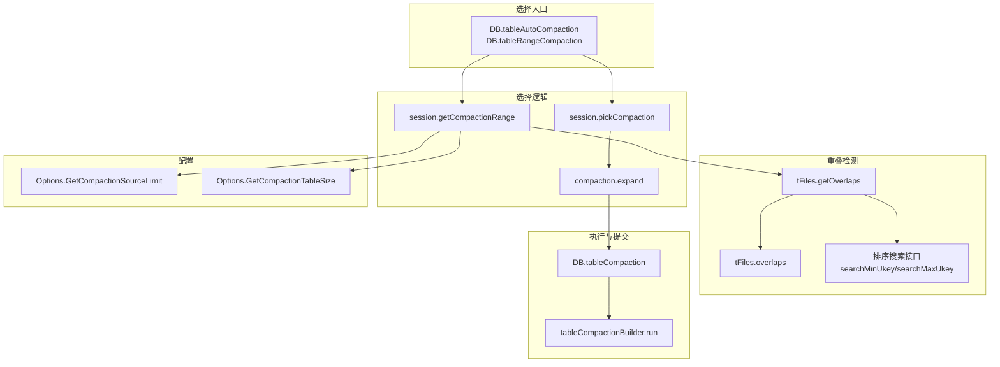
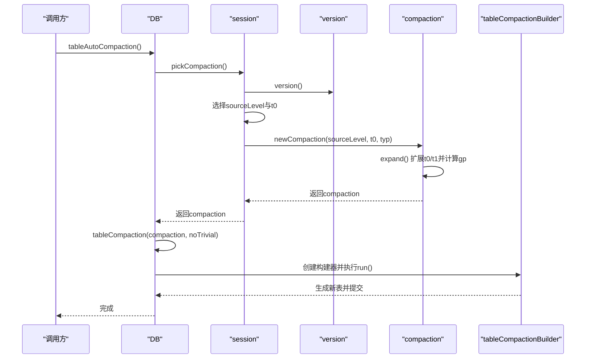
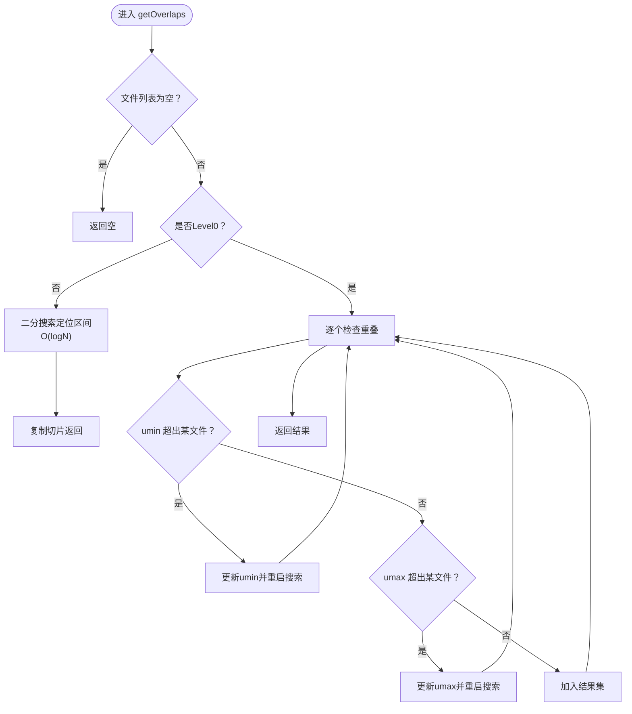
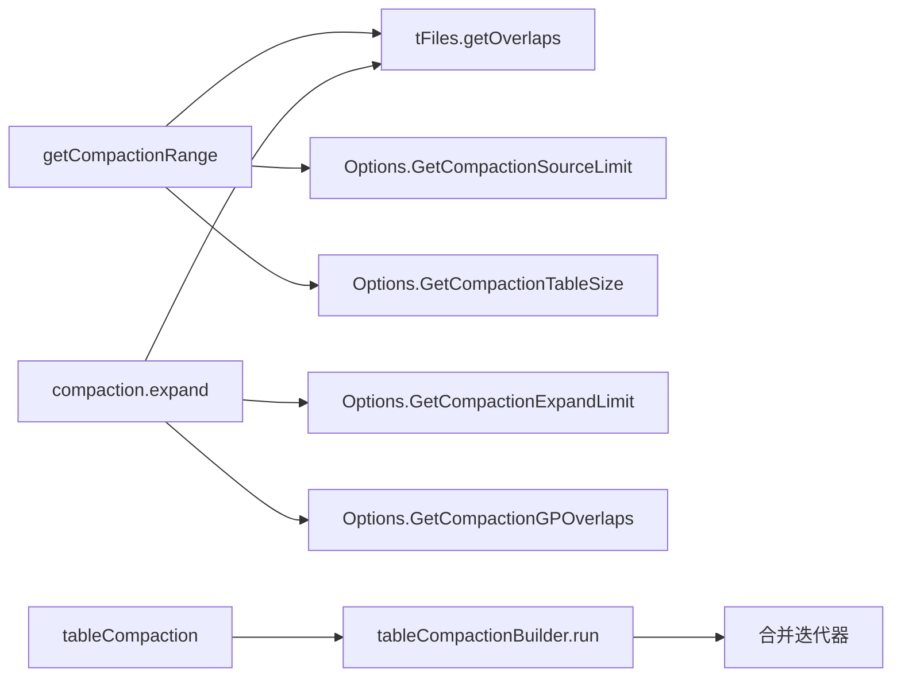

# 输入文件选择

<cite>
**本文引用的文件**
- [db_compaction.go](file://leveldb/db_compaction.go)
- [session_compaction.go](file://leveldb/session_compaction.go)
- [version.go](file://leveldb/version.go)
- [table.go](file://leveldb/table.go)
- [table_test.go](file://leveldb/table_test.go)
- [options.go](file://leveldb/options.go)
- [opt/options.go](file://leveldb/opt/options.go)
- [mlsm_final_comprehensive_test.go](file://leveldb/mlsm_final_comprehensive_test.go)
</cite>

## 目录
1. [简介](#简介)
2. [项目结构](#项目结构)
3. [核心组件](#核心组件)
4. [架构总览](#架构总览)
5. [详细组件分析](#详细组件分析)
6. [依赖关系分析](#依赖关系分析)
7. [性能考量](#性能考量)
8. [故障排查指南](#故障排查指南)
9. [结论](#结论)
10. [附录](#附录)

## 简介
本文聚焦于 avccDB 的压缩输入文件选择过程，围绕两个关键流程展开：
- getCompactionRange：基于给定源层级与用户键范围（umin/umax），选择重叠的 SSTable 文件集合。
- pickCompaction：自动选择下一次压缩的源层级与候选文件，用于后台自动触发的压缩。

文档将深入解释：
- 如何根据源层级（sourceLevel）与键范围（umin/umax）选择重叠的 SSTable 文件；
- Level0 与其他层级在文件选择上的差异处理；
- CompactionSourceLimit 配置项如何限制单次压缩的数据量，避免长时间占用资源；
- getOverlaps 算法如何高效识别重叠文件；
- 结合 mlsm_final_comprehensive_test.go 的综合测试，说明文件选择对压缩效率与读取性能的影响；
- 提供文件选择过程的时序图，帮助理解端到端流程。

## 项目结构
与“输入文件选择”直接相关的代码主要位于以下模块：
- 选择入口与执行：db_compaction.go 中的 getCompactionRange、pickCompaction 调用链
- 选择算法与扩展：session_compaction.go 中的 getCompactionRange、newCompaction、compaction.expand
- 重叠检测算法：table.go 中的 tFiles.getOverlaps、overlaps、searchMinUkey/searchMaxUkey 等
- 选项与限制：opt/options.go 与 options.go 中的 CompactionSourceLimit、CompactionTableSize 等
- 自动触发：db_compaction.go 中的 tableAutoCompaction、tableRangeCompaction
- 综合测试：mlsm_final_comprehensive_test.go 展示了大规模数据下的压缩与读取行为

图表来源
- [db_compaction.go](file://leveldb/db_compaction.go#L631-L667)
- [session_compaction.go](file://leveldb/session_compaction.go#L56-L95)
- [session_compaction.go](file://leveldb/session_compaction.go#L98-L134)
- [session_compaction.go](file://leveldb/session_compaction.go#L196-L246)
- [table.go](file://leveldb/table.go#L168-L190)
- [table.go](file://leveldb/table.go#L196-L264)
- [options.go](file://leveldb/options.go#L55-L107)
- [opt/options.go](file://leveldb/opt/options.go#L470-L520)

章节来源
- [db_compaction.go](file://leveldb/db_compaction.go#L631-L667)
- [session_compaction.go](file://leveldb/session_compaction.go#L56-L95)
- [session_compaction.go](file://leveldb/session_compaction.go#L98-L134)
- [session_compaction.go](file://leveldb/session_compaction.go#L196-L246)
- [table.go](file://leveldb/table.go#L168-L190)
- [table.go](file://leveldb/table.go#L196-L264)
- [options.go](file://leveldb/options.go#L55-L107)
- [opt/options.go](file://leveldb/opt/options.go#L470-L520)

## 核心组件
- getCompactionRange：从指定源层级中，按 umin/umax 用户键范围筛选重叠的 SSTable；对非 Level0 层级应用 CompactionSourceLimit 限制；最终构造 compaction 并调用 expand 扩展。
- pickCompaction：依据版本评分与“seek 触发”的表集，选择下一次压缩的源层级与候选文件；若无自动触发，则返回空。
- compaction.expand：在选定 t0/t1 的基础上，尝试扩大到包含更多重叠文件，同时计算“祖父层”（Level+2）的重叠集合，用于控制输出大小与重叠量。
- tFiles.getOverlaps：核心重叠检测算法，针对非 Level0 使用二分搜索快速定位区间；针对 Level0 使用“可重叠”策略，必要时重启搜索以确保覆盖所有重叠文件。
- Options.GetCompactionSourceLimit：根据目标层级表大小与因子计算单次压缩源文件大小上限，避免一次性压缩过多数据。

章节来源
- [session_compaction.go](file://leveldb/session_compaction.go#L56-L95)
- [session_compaction.go](file://leveldb/session_compaction.go#L98-L134)
- [session_compaction.go](file://leveldb/session_compaction.go#L196-L246)
- [table.go](file://leveldb/table.go#L196-L264)
- [opt/options.go](file://leveldb/opt/options.go#L470-L520)

## 架构总览
下面的时序图展示了从“自动选择”到“执行压缩”的完整流程，以及其中涉及的文件选择步骤：

图表来源
- [db_compaction.go](file://leveldb/db_compaction.go#L669-L673)
- [session_compaction.go](file://leveldb/session_compaction.go#L56-L95)
- [session_compaction.go](file://leveldb/session_compaction.go#L136-L149)
- [session_compaction.go](file://leveldb/session_compaction.go#L196-L246)
- [db_compaction.go](file://leveldb/db_compaction.go#L567-L629)

## 详细组件分析

### getCompactionRange：按层级与键范围选择重叠文件
- 输入：sourceLevel、umin、umax、noLimit
- 步骤：
  1) 获取当前版本 v，检查 sourceLevel 是否有效。
  2) 调用 v.levels[sourceLevel].getOverlaps(...) 选择重叠文件 t0。
  3) 若 t0 为空则释放版本并返回 nil。
  4) 对非 Level0 且 noLimit=false 时，按 CompactionSourceLimit 限制 t0 的总大小，避免单次压缩过大。
  5) 设置 compaction 类型（Level0 或非 Level0），构造 compaction 并调用 expand。
- 关键点：
  - Level0 与非 Level0 的重叠检测策略不同：Level0 允许文件重叠，因此在 getOverlaps 中采用“可重叠”模式，必要时重启搜索以保证覆盖所有重叠文件。
  - 非 Level0 使用二分搜索定位区间，时间复杂度近似 O(logN)，再复制切片，整体高效。
  - CompactionSourceLimit 通过 Options.GetCompactionSourceLimit 计算，限制单次压缩源文件大小，避免长时间占用资源。

章节来源
- [session_compaction.go](file://leveldb/session_compaction.go#L98-L134)
- [opt/options.go](file://leveldb/opt/options.go#L470-L520)
- [options.go](file://leveldb/options.go#L55-L107)

### pickCompaction：自动选择压缩源层级与候选文件
- 输入：无（内部使用版本评分与 seek 触发）
- 步骤：
  1) 获取版本 v，若 cScore≥1，则选择 cLevel 作为 sourceLevel，并从该层级选取一个或多个候选文件（Level0 时考虑 compaction pointer）。
  2) 若无 cScore 触发，检查是否存在 seek 触发的表集，若有则选择该表作为候选。
  3) 构造 compaction 并返回。
- 关键点：
  - 自动选择优先级：评分触发 > seek 触发。
  - Level0 的候选文件选择会考虑 compaction pointer，避免不必要的扫描。

章节来源
- [session_compaction.go](file://leveldb/session_compaction.go#L56-L95)

### compaction.expand：扩展输入集与计算祖父层重叠
- 输入：已选 t0、t1
- 步骤：
  1) 计算 t0/t1 的键范围 amin/amax。
  2) 若 sourceLevel=0，先对 t0 进行扩展，以处理 ukey 跨表的情况。
  3) 对 Level+1 层再次进行重叠检测，得到新的 t1。
  4) 若扩大后总大小仍小于限制，尝试扩大 t0 以保持 Level+1 不变，从而提升压缩效率。
  5) 计算 Level+2 的重叠集合 gp，用于控制输出大小与重叠量。
- 关键点：
  - 扩展策略在保证正确性的前提下尽量增大输入集，减少后续压缩次数。
  - shouldStopBefore 会在遇到过多祖父层重叠时提前停止，开始新的输出。

章节来源
- [session_compaction.go](file://leveldb/session_compaction.go#L196-L246)

### getOverlaps 算法：高效识别重叠文件
- 非 Level0（overlapped=false）：
  - 使用二分搜索定位最小/最大索引，O(logN) 时间内确定重叠区间，然后复制切片返回。
- Level0（overlapped=true）：
  - 逐个检查文件是否与范围重叠；若发现某文件的 ukey 超出范围，会回退或扩展范围并重启搜索，确保覆盖所有重叠文件。
- 辅助搜索：
  - searchMinUkey/searchMaxUkey：基于用户键比较的二分搜索。
  - overlaps：判断单个文件是否与范围重叠。

图表来源
- [table.go](file://leveldb/table.go#L196-L264)

章节来源
- [table.go](file://leveldb/table.go#L168-L190)
- [table.go](file://leveldb/table.go#L196-L264)

### CompactionSourceLimit：限制单次压缩数据量
- 计算方式：GetCompactionSourceLimit(level) = GetCompactionTableSize(level+1) × Factor
- 作用：
  - 对非 Level0 的 getCompactionRange，在 noLimit=false 时按总大小累加，一旦达到上限即截断 t0，避免单次压缩过大。
  - 保障系统资源占用可控，降低长时间 IO 压力。
- 与 Options 的关系：
  - 默认因子由 DefaultCompactionSourceLimitFactor 提供，可通过 Options.CompactionSourceLimitFactor 调整。
  - 表大小由 GetCompactionTableSize(level+1) 决定，支持按层级倍增。

章节来源
- [session_compaction.go](file://leveldb/session_compaction.go#L112-L127)
- [opt/options.go](file://leveldb/opt/options.go#L470-L520)
- [options.go](file://leveldb/options.go#L55-L107)

### Level0 与其他层级的差异处理
- Level0：
  - 文件可能相互重叠，因此在 getOverlaps 中采用“可重叠”模式，必要时重启搜索以确保覆盖所有重叠文件。
  - 在 pickCompaction 中考虑 compaction pointer，避免扫描过多文件。
- 非 Level0：
  - 文件严格有序，使用二分搜索快速定位重叠区间，时间复杂度低。
  - expand 时可安全地扩大 t0 以提升压缩效率，同时保持 Level+1 不变。

章节来源
- [session_compaction.go](file://leveldb/session_compaction.go#L56-L95)
- [session_compaction.go](file://leveldb/session_compaction.go#L98-L134)
- [session_compaction.go](file://leveldb/session_compaction.go#L196-L246)
- [table.go](file://leveldb/table.go#L196-L264)

### 与 mlsm_final_comprehensive_test.go 的关联
- 该测试通过大规模写入与多次版本写入，驱动后台自动压缩与文件分布变化，验证：
  - 压缩后数据完整性与读取正确性；
  - MasterRoot 在压缩前后的一致性（或更新）；
  - 读取性能与迭代器遍历行为。
- 间接说明文件选择策略在真实场景下的有效性：合理的输入文件选择有助于减少后续读放大与压缩次数，维持良好的读写性能。

章节来源
- [mlsm_final_comprehensive_test.go](file://leveldb/mlsm_final_comprehensive_test.go#L1-L479)

## 依赖关系分析
- getCompactionRange 依赖：
  - 版本对象 v 的层级结构与评分；
  - tFiles.getOverlaps 的重叠检测；
  - Options.GetCompactionSourceLimit 与 GetCompactionTableSize 的配置。
- compaction.expand 依赖：
  - tFiles.getOverlaps 与 getRange；
  - Options.GetCompactionExpandLimit 与 GetCompactionGPOverlaps。
- tableCompactionBuilder.run 依赖：
  - compaction.newIterator 的多路合并迭代器；
  - 严格模式与缓存策略。

图表来源
- [session_compaction.go](file://leveldb/session_compaction.go#L98-L134)
- [session_compaction.go](file://leveldb/session_compaction.go#L196-L246)
- [table.go](file://leveldb/table.go#L196-L264)
- [opt/options.go](file://leveldb/opt/options.go#L470-L520)
- [db_compaction.go](file://leveldb/db_compaction.go#L567-L629)

章节来源
- [session_compaction.go](file://leveldb/session_compaction.go#L98-L134)
- [session_compaction.go](file://leveldb/session_compaction.go#L196-L246)
- [table.go](file://leveldb/table.go#L196-L264)
- [opt/options.go](file://leveldb/opt/options.go#L470-L520)
- [db_compaction.go](file://leveldb/db_compaction.go#L567-L629)

## 性能考量
- getOverlaps 的时间复杂度：
  - 非 Level0：O(logN) 区间定位 + O(k) 复制，k 为重叠文件数。
  - Level0：最坏情况下需重启搜索，整体仍优于线性扫描，且通过“重启搜索”确保正确性。
- CompactionSourceLimit 的作用：
  - 控制单次压缩源文件大小，避免长时间 IO 占用，提升系统响应性。
- expand 的收益：
  - 在满足大小限制的前提下扩大输入集，减少后续压缩次数，提高整体吞吐。
- 严格模式与缓存策略：
  - 严格模式下会更严格地处理损坏键，影响压缩稳定性；DontFillCache 可降低缓存污染风险。

[本节为通用性能讨论，无需列出具体文件来源]

## 故障排查指南
- 压缩未触发或触发过少：
  - 检查版本评分与触发条件（cScore、seek 触发）。
  - 查看 Options 中 CompactionL0Trigger、CompactionTotalSize 等参数是否合理。
- 压缩耗时过长：
  - 检查 CompactionSourceLimit 是否设置过小导致频繁截断。
  - 观察 Level0 文件数量是否过高，导致每次读取都要合并。
- 读取性能下降：
  - 检查是否出现过多的祖父层重叠（maxGPOverlaps），这会导致输出分裂。
  - 适当调整 CompactionExpandLimitFactor 与 CompactionGPOverlapsFactor。

章节来源
- [version.go](file://leveldb/version.go#L646-L695)
- [opt/options.go](file://leveldb/opt/options.go#L470-L520)
- [session_compaction.go](file://leveldb/session_compaction.go#L248-L290)

## 结论
- getCompactionRange 与 pickCompaction 共同构成了 avccDB 的输入文件选择体系：前者负责按层级与键范围精准选择重叠文件，后者负责自动决策下一次压缩的源层级与候选集。
- getOverlaps 算法在非 Level0 采用二分搜索，在 Level0 采用“可重叠”重启搜索，兼顾效率与正确性。
- CompactionSourceLimit 通过配置化手段限制单次压缩的数据量，避免长时间占用资源，保障系统稳定性。
- 结合 mlsm_final_comprehensive_test.go 的大规模测试，可见该选择策略在实际场景中有效提升了压缩效率与读取性能。

[本节为总结性内容，无需列出具体文件来源]

## 附录
- 相关测试参考：
  - table_test.go 中的 TestGetOverlaps 与基准测试，验证了 getOverlaps 在不同层级的行为与性能。
- 选项建议：
  - 根据数据特征调整 CompactionSourceLimitFactor、CompactionExpandLimitFactor、CompactionGPOverlapsFactor，以平衡压缩效率与资源占用。

章节来源
- [table_test.go](file://leveldb/table_test.go#L19-L160)