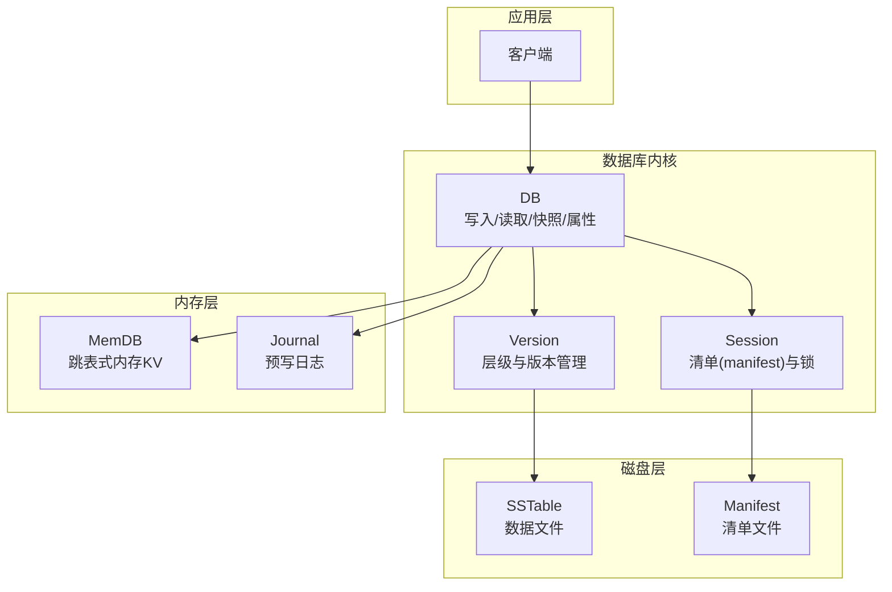
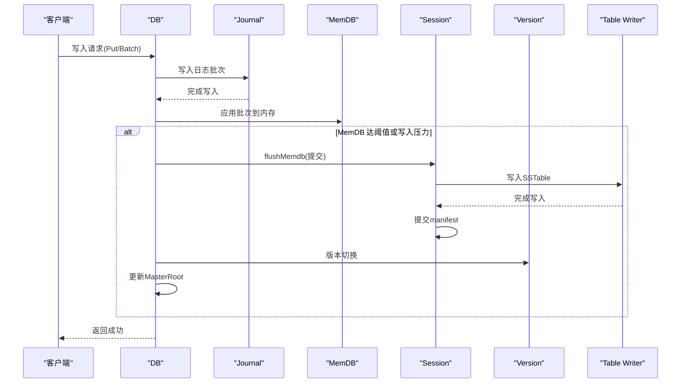
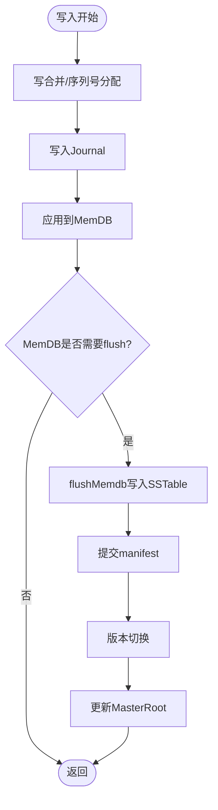
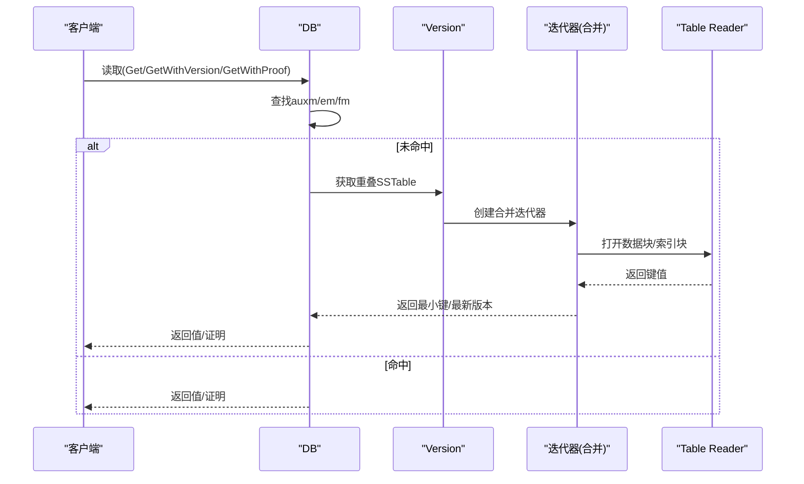
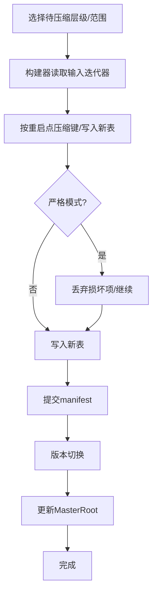
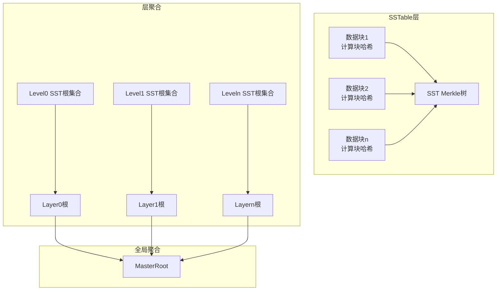
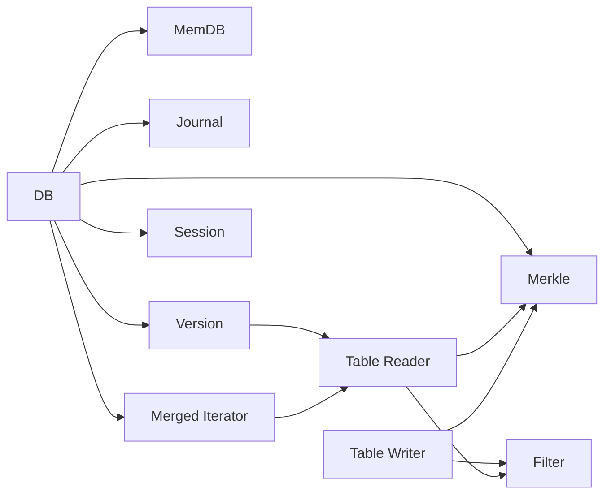

# 数据流

<cite>
**本文引用的文件**
- [README.md](file://README.md)
- [leveldb/db.go](file://leveldb/db.go)
- [leveldb/db_write.go](file://leveldb/db_write.go)
- [leveldb/db_compaction.go](file://leveldb/db_compaction.go)
- [leveldb/memdb/memdb.go](file://leveldb/memdb/memdb.go)
- [leveldb/journal/journal.go](file://leveldb/journal/journal.go)
- [leveldb/table/writer.go](file://leveldb/table/writer.go)
- [leveldb/table/reader.go](file://leveldb/table/reader.go)
- [leveldb/table/table.go](file://leveldb/table/table.go)
- [leveldb/iterator/merged_iter.go](file://leveldb/iterator/merged_iter.go)
- [leveldb/version.go](file://leveldb/version.go)
- [leveldb/session.go](file://leveldb/session.go)
- [leveldb/merkle/tree.go](file://leveldb/merkle/tree.go)
</cite>

## 目录
1. [引言](#引言)
2. [项目结构](#项目结构)
3. [核心组件](#核心组件)
4. [架构总览](#架构总览)
5. [详细组件分析](#详细组件分析)
6. [依赖关系分析](#依赖关系分析)
7. [性能考量](#性能考量)
8. [故障排查指南](#故障排查指南)
9. [结论](#结论)
10. [附录](#附录)

## 引言
本文件面向 avccDB 的 mLSM 架构，系统化梳理其数据流：写入路径（客户端 → DB → MemDB → Journal → SSTable）与读取路径（客户端 → DB → MemDB/SSTable → 返回结果），并深入解释：
- 写入流程如何通过 Journal 保证持久性；
- MemDB 达到阈值时如何触发 flush 到 SSTable；
- 压缩流程如何合并 SSTable；
- 读取流程如何在 MemDB 与多层级 SSTable 中查找数据，并由迭代器合并多个数据源；
- Merkle 树如何在数据流中集成以提供完整性验证，以及 MasterRoot 的更新时机。

## 项目结构
avccDB 采用分层模块组织，核心目录与职责如下：
- leveldb：数据库核心实现，包含 DB、写入、压缩、版本管理、表读写、迭代器、存储等子模块
- leveldb/memdb：内存键值存储实现
- leveldb/journal：预写日志（WAL）读写
- leveldb/table：SSTable 文件格式与读写
- leveldb/iterator：多源迭代器合并
- leveldb/version：版本管理与层级结构
- leveldb/session：会话与清单（manifest）管理
- leveldb/merkle：Merkle 树支持（含树构建、证明生成、序列化）

图表来源
- [leveldb/db.go](file://leveldb/db.go#L33-L120)
- [leveldb/version.go](file://leveldb/version.go#L21-L44)
- [leveldb/session.go](file://leveldb/session.go#L36-L70)

章节来源
- [README.md](file://README.md#L1-L108)

## 核心组件
- DB：对外接口入口，负责写入合并、序列号管理、快照、读取调度、压缩触发与 MasterRoot 更新
- MemDB：内存键值存储，提供 Put/Delete/Get/迭代能力
- Journal：按块记录的预写日志，确保崩溃恢复与顺序一致性
- Table Writer/Reader：SSTable 写入与读取，支持过滤器、索引块、元信息块、校验与压缩
- Version：维护多层级 SSTable，提供范围扫描、版本选择、seek 计数与 compaction 触发
- Session：管理清单（manifest）与文件锁，协调版本切换
- Merkle：Merkle 树构建、证明生成、MasterRoot 聚合

章节来源
- [leveldb/db.go](file://leveldb/db.go#L33-L120)
- [leveldb/memdb/memdb.go](file://leveldb/memdb/memdb.go#L182-L240)
- [leveldb/journal/journal.go](file://leveldb/journal/journal.go#L343-L433)
- [leveldb/table/writer.go](file://leveldb/table/writer.go#L148-L210)
- [leveldb/version.go](file://leveldb/version.go#L21-L44)
- [leveldb/session.go](file://leveldb/session.go#L36-L70)
- [leveldb/merkle/tree.go](file://leveldb/merkle/tree.go#L1-L40)

## 架构总览
mLSM 在 avccDB 中体现为“内存 + 多层级磁盘”的组合：
- 写入先落 Journal，再写入 MemDB；MemDB 达阈值或写入压力大时触发 flush，将 MemDB 内容写入 SSTable 并提交到版本
- 读取优先检查辅助 MemDB（auxm）、有效 MemDB（em/fm），随后通过 Version 遍历重叠的 SSTable 层级，结合迭代器合并与过滤器加速
- Merkle 树在 SSTable 内部构建，最终由 DB 聚合各层根形成 MasterRoot，用于完整性证明

图表来源
- [leveldb/db_write.go](file://leveldb/db_write.go#L18-L33)
- [leveldb/db_write.go](file://leveldb/db_write.go#L155-L266)
- [leveldb/db_compaction.go](file://leveldb/db_compaction.go#L269-L354)
- [leveldb/db.go](file://leveldb/db.go#L1491-L1571)

## 详细组件分析

### 写入路径（客户端 → DB → MemDB → Journal → SSTable）
- 写入合并与序列号
  - DB 使用写合并队列与批量合并策略，减少写放大；写入前计算序列号，写入 Journal 后再写入 MemDB
  - 当 MemDB 空间不足或写入压力过大时，触发 flush 将 MemDB 内容写入 SSTable，并提交到版本
- Journal 持久性
  - Journal 以 32KB 块为单位，采用校验与分片（full/first/middle/last）机制，支持严格模式与校验开关
  - 写入完成后可选择同步刷盘，确保崩溃不丢
- Flush 到 SSTable
  - flushMemdb 将 MemDB 内容写入 SSTable，生成索引块、过滤器块与元信息块，同时构建 SSTable 内部 Merkle 树
  - 提交 manifest，版本切换，随后更新 MasterRoot

图表来源
- [leveldb/db_write.go](file://leveldb/db_write.go#L155-L266)
- [leveldb/journal/journal.go](file://leveldb/journal/journal.go#L343-L433)
- [leveldb/db_compaction.go](file://leveldb/db_compaction.go#L269-L354)
- [leveldb/db.go](file://leveldb/db.go#L1491-L1571)

章节来源
- [leveldb/db_write.go](file://leveldb/db_write.go#L18-L33)
- [leveldb/db_write.go](file://leveldb/db_write.go#L155-L266)
- [leveldb/journal/journal.go](file://leveldb/journal/journal.go#L343-L433)
- [leveldb/table/writer.go](file://leveldb/table/writer.go#L148-L210)

### 读取路径（客户端 → DB → MemDB/SSTable → 返回结果）
- 读取顺序
  - 先查辅助 MemDB（auxm），再查有效/冻结 MemDB（em/fm）
  - 若未命中，通过 Version 遍历重叠的 SSTable 层级，使用表迭代器定位 key
  - 对于最新版本查询，按序列号选择最新值；对于指定版本查询，解析内部键版本字段
- 迭代器合并
  - 对于多源数据（Level-0 可能重叠），使用合并迭代器按比较器排序合并
  - 支持严格模式下对损坏错误进行处理
- 版本历史与证明
  - 支持获取指定键的版本历史，按版本升序返回
  - 支持获取 Merkle 证明，结合 MasterRoot 进行完整性验证

图表来源
- [leveldb/db.go](file://leveldb/db.go#L800-L833)
- [leveldb/version.go](file://leveldb/version.go#L142-L285)
- [leveldb/iterator/merged_iter.go](file://leveldb/iterator/merged_iter.go#L299-L317)
- [leveldb/table/reader.go](file://leveldb/table/reader.go#L789-L800)

章节来源
- [leveldb/db.go](file://leveldb/db.go#L800-L833)
- [leveldb/version.go](file://leveldb/version.go#L142-L285)
- [leveldb/iterator/merged_iter.go](file://leveldb/iterator/merged_iter.go#L1-L120)

### 压缩流程（SSTable 合并）
- 自动挑选与范围压缩
  - Version 维护每层文件数量与大小，计算 compaction 分数；当分数≥1或有 seek 触发时，启动自动压缩
  - 支持范围压缩，针对指定层级与键范围执行
- 表构建器
  - tableCompactionBuilder 逐条读取输入迭代器，按重启点压缩键，写入新表；支持严格模式与错误计数
  - mLSM 特性：保留历史版本与删除标记，确保 Merkle 证明链路完整
- 提交与版本切换
  - 压缩完成后提交 manifest，版本切换，更新 MasterRoot

图表来源
- [leveldb/db_compaction.go](file://leveldb/db_compaction.go#L567-L629)
- [leveldb/db_compaction.go](file://leveldb/db_compaction.go#L356-L555)
- [leveldb/version.go](file://leveldb/version.go#L646-L696)

章节来源
- [leveldb/db_compaction.go](file://leveldb/db_compaction.go#L567-L629)
- [leveldb/db_compaction.go](file://leveldb/db_compaction.go#L356-L555)
- [leveldb/version.go](file://leveldb/version.go#L646-L696)

### Merkle 树与 MasterRoot 集成
- SSTable 内部 Merkle
  - Table Writer 在写入数据块时计算块哈希，构建 Merkle 树并写入“merkle.tree”元信息块
- 层级聚合
  - DB 从当前版本各层收集 SST 根，构建层根 Merkle 树，再聚合为 MasterRoot
  - MasterRoot 在 flush 与 table compaction 后更新，保证全局完整性
- 读取证明
  - GetWithProof 返回值与 Merkle 证明，结合 MasterRoot 验证；Version 层面也支持返回 SST 层证明并与其合并

图表来源
- [leveldb/table/writer.go](file://leveldb/table/writer.go#L243-L384)
- [leveldb/db.go](file://leveldb/db.go#L1491-L1571)
- [leveldb/version.go](file://leveldb/version.go#L287-L429)
- [leveldb/merkle/tree.go](file://leveldb/merkle/tree.go#L1-L40)

章节来源
- [leveldb/table/writer.go](file://leveldb/table/writer.go#L243-L384)
- [leveldb/db.go](file://leveldb/db.go#L1491-L1571)
- [leveldb/version.go](file://leveldb/version.go#L287-L429)
- [leveldb/merkle/tree.go](file://leveldb/merkle/tree.go#L1-L40)

## 依赖关系分析
- DB 依赖 MemDB/Journal/Table Writer/Version/Session/Merkle
- Version 依赖 Table Reader/比较器/选项
- Table Writer/Reader 依赖 Merkle、过滤器、压缩库
- 迭代器依赖比较器与底层迭代器

图表来源
- [leveldb/db.go](file://leveldb/db.go#L33-L120)
- [leveldb/version.go](file://leveldb/version.go#L551-L564)
- [leveldb/table/writer.go](file://leveldb/table/writer.go#L148-L210)
- [leveldb/table/reader.go](file://leveldb/table/reader.go#L789-L800)
- [leveldb/iterator/merged_iter.go](file://leveldb/iterator/merged_iter.go#L299-L317)

章节来源
- [leveldb/db.go](file://leveldb/db.go#L33-L120)
- [leveldb/version.go](file://leveldb/version.go#L551-L564)
- [leveldb/table/writer.go](file://leveldb/table/writer.go#L148-L210)
- [leveldb/table/reader.go](file://leveldb/table/reader.go#L789-L800)
- [leveldb/iterator/merged_iter.go](file://leveldb/iterator/merged_iter.go#L299-L317)

## 性能考量
- 写入合并与批处理：通过写合并队列减少写放大，提高吞吐
- 写入节流与暂停：当 Level-0 文件过多时，DB 会暂停写入并等待压缩，避免级联放大
- 压缩策略：基于层大小与文件数量的分数驱动，避免过度压缩
- 过滤器与索引：SSTable 的过滤器与索引块提升读取效率
- 迭代器缓存：Table Reader 支持块缓存，降低随机读延迟

章节来源
- [leveldb/db_write.go](file://leveldb/db_write.go#L66-L131)
- [leveldb/db_compaction.go](file://leveldb/db_compaction.go#L800-L890)
- [leveldb/table/reader.go](file://leveldb/table/reader.go#L624-L656)

## 故障排查指南
- Journal 错误处理
  - 严格模式下遇到损坏会终止；非严格模式会跳过损坏块并继续
  - Journal Reader/Writer 提供错误类型与原因，便于定位
- 压缩错误与回退
  - 压缩事务支持回退，失败时清理临时文件并重试
- 读取异常
  - 迭代器支持严格模式，损坏错误会被传播；Version 层面也会记录 seek 触发与计数
- MasterRoot 不一致
  - 检查 flush/compaction 后是否正确更新；确认各层 SST 根收集无误

章节来源
- [leveldb/journal/journal.go](file://leveldb/journal/journal.go#L162-L214)
- [leveldb/db_compaction.go](file://leveldb/db_compaction.go#L141-L235)
- [leveldb/version.go](file://leveldb/version.go#L534-L549)
- [leveldb/db.go](file://leveldb/db.go#L1562-L1571)

## 结论
avccDB 的 mLSM 数据流围绕“写入持久化（Journal）→ 内存缓冲（MemDB）→ 磁盘落盘（SSTable）→ 多源合并（Version/迭代器）→ 完整性验证（Merkle/MasterRoot）”展开。通过严格的 Journal 与压缩事务、灵活的写合并与节流策略、以及层级化的版本管理与证明生成，系统在保证一致性的同时兼顾了性能与可验证性。

## 附录
- 关键数据结构与复杂度
  - MemDB：Put/Delete/Get 基于跳表，平均 O(log n)，迭代器 O(n)
  - Table Writer：按块写入，O(1) 入块，最终 O(n log n) 构建索引
  - Table Reader：二分查找重启点，O(log n) 定位，块缓存可显著降低延迟
  - Version：walkOverlapping 对每层扫描，整体 O(N) 遍历
- API 与使用要点
  - 写入：支持批量写入与同步选项；大批次可直接走事务绕过 Journal
  - 读取：支持最新版本与指定版本查询；支持版本历史与 Merkle 证明
  - 快照：读取一致性通过快照序列号保障

章节来源
- [leveldb/memdb/memdb.go](file://leveldb/memdb/memdb.go#L273-L340)
- [leveldb/table/writer.go](file://leveldb/table/writer.go#L262-L294)
- [leveldb/table/reader.go](file://leveldb/table/reader.go#L225-L249)
- [leveldb/version.go](file://leveldb/version.go#L91-L140)
- [leveldb/db.go](file://leveldb/db.go#L1092-L1147)