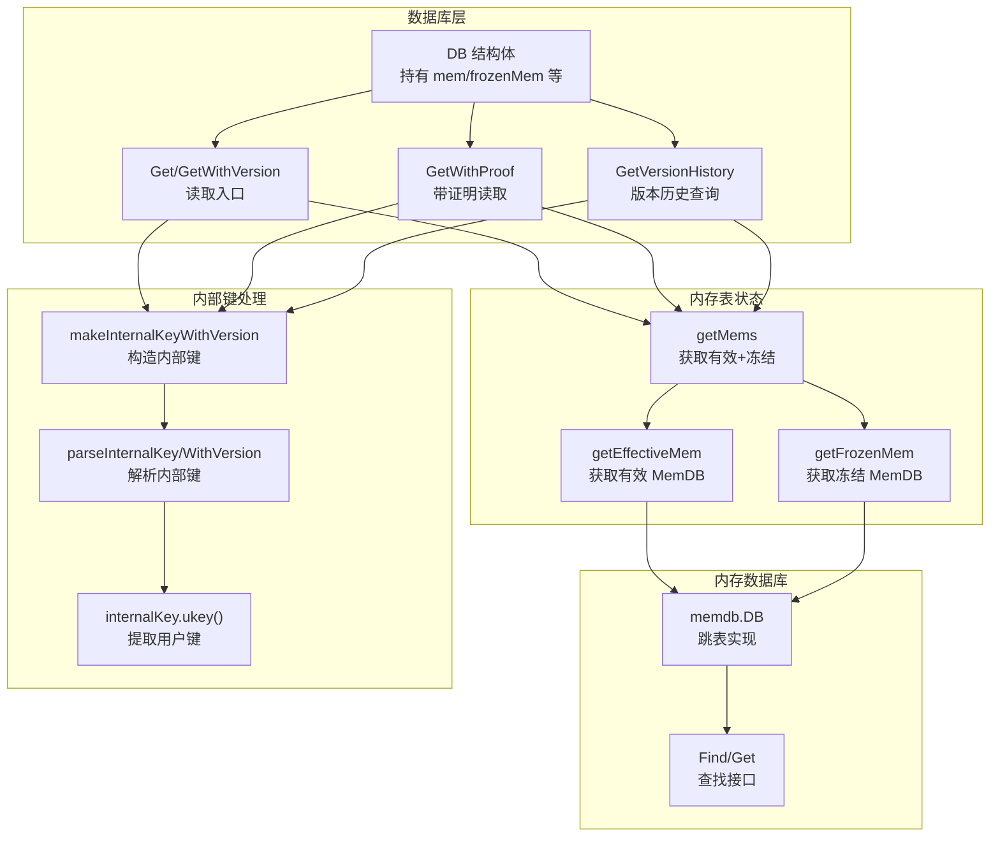
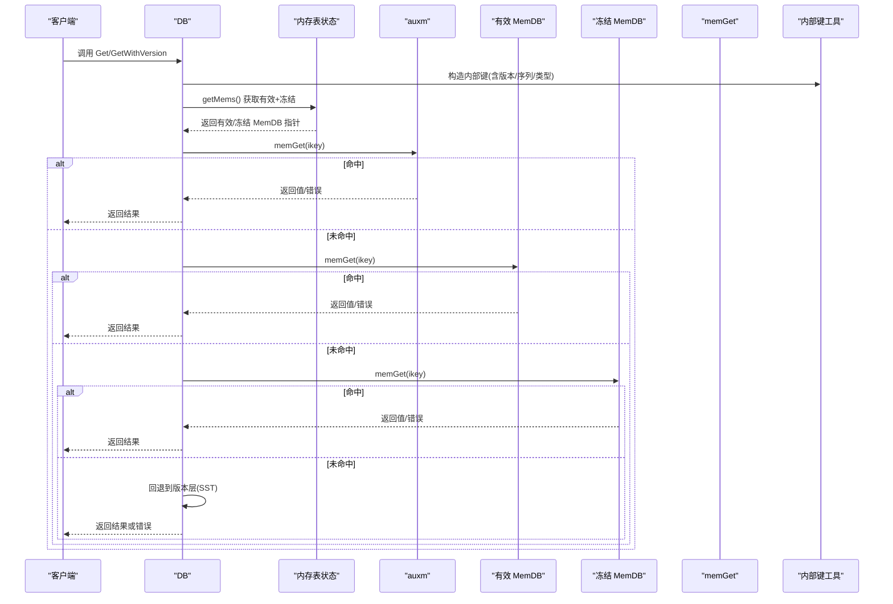
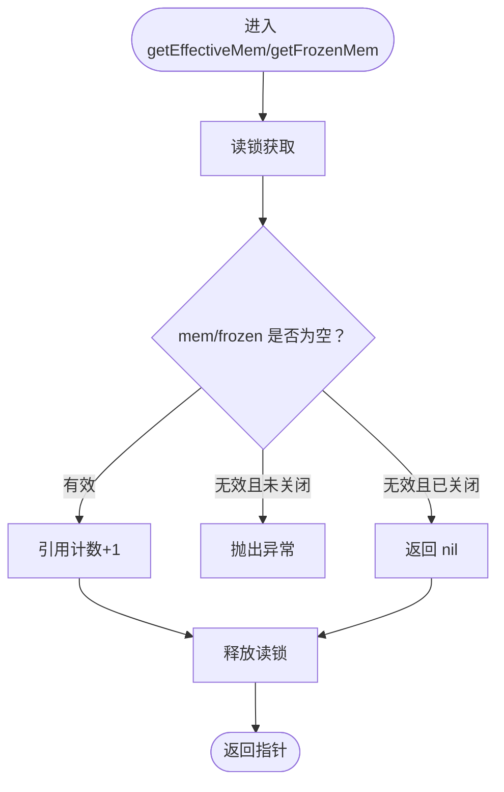
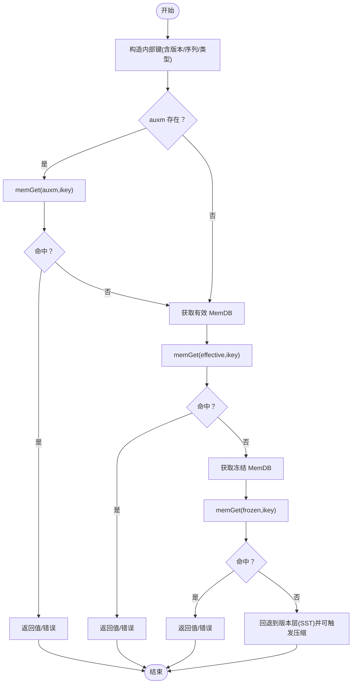
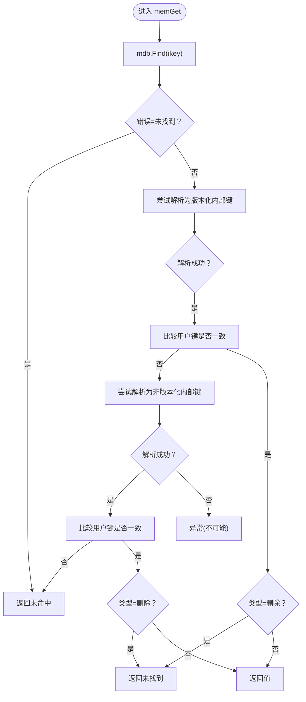
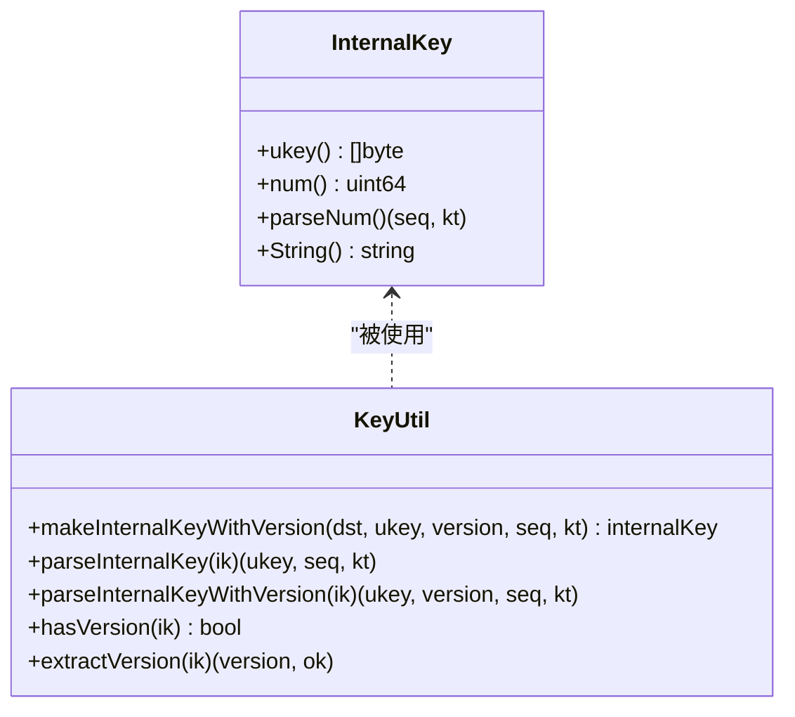
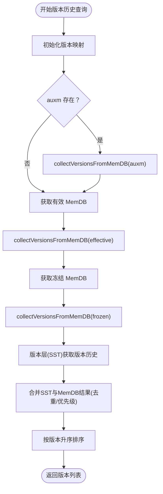
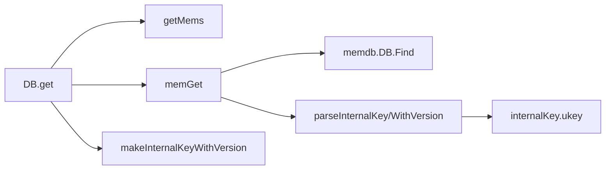

# MemDB查找

<cite>
**本文引用的文件**
- [leveldb/db.go](file://leveldb/db.go)
- [leveldb/db_state.go](file://leveldb/db_state.go)
- [leveldb/key.go](file://leveldb/key.go)
- [leveldb/memdb/memdb.go](file://leveldb/memdb/memdb.go)
</cite>

## 目录
1. [简介](#简介)
2. [项目结构](#项目结构)
3. [核心组件](#核心组件)
4. [架构总览](#架构总览)
5. [详细组件分析](#详细组件分析)
6. [依赖关系分析](#依赖关系分析)
7. [性能考量](#性能考量)
8. [故障排查指南](#故障排查指南)
9. [结论](#结论)

## 简介
本文件聚焦于 avccDB 的 MemDB 查找流程，系统性梳理从客户端发起 Get 请求到在内存数据库中完成查找的完整路径。重点覆盖：
- 如何通过 getEffectiveMem 和 getFrozenMem 获取当前有效的内存表与冻结的内存表
- db.get 方法如何依次查询辅助 MemDB（auxm）、有效 MemDB、冻结 MemDB
- memGet 函数如何解析内部键并处理版本化键与非版本化键，以及如何基于序列号判断数据可见性
- 在多版本查询场景下，如何收集所有匹配版本的数据
- 提供 MemDB 查找流程的序列图，标注关键数据结构访问与版本匹配逻辑

## 项目结构
围绕 MemDB 查找的关键代码分布在以下模块：
- 数据库主入口与读取流程：leveldb/db.go
- 内存表状态管理（有效/冻结）：leveldb/db_state.go
- 内部键编码/解码与用户键提取：leveldb/key.go
- 内存数据库实现（跳表结构、查找接口）：leveldb/memdb/memdb.go

图表来源
- [leveldb/db.go](file://leveldb/db.go#L798-L968)
- [leveldb/db_state.go](file://leveldb/db_state.go#L161-L211)
- [leveldb/key.go](file://leveldb/key.go#L84-L197)
- [leveldb/memdb/memdb.go](file://leveldb/memdb/memdb.go#L351-L386)

章节来源
- [leveldb/db.go](file://leveldb/db.go#L798-L968)
- [leveldb/db_state.go](file://leveldb/db_state.go#L161-L211)
- [leveldb/key.go](file://leveldb/key.go#L84-L197)
- [leveldb/memdb/memdb.go](file://leveldb/memdb/memdb.go#L351-L386)

## 核心组件
- DB.get：统一的读取入口，负责构建内部键、按顺序查询 auxm、有效 MemDB、冻结 MemDB，并回退到版本层（SST 文件）。
- memGet：在单个 MemDB 中执行查找，解析内部键，区分版本化与非版本化键，依据类型判定删除或返回值。
- getEffectiveMem/getFrozenMem/getMems：线程安全地获取有效/冻结内存表指针，用于并发读取。
- makeInternalKeyWithVersion/parseInternalKey/parseInternalKeyWithVersion/internalKey.ukey：内部键编码与解析，支持带版本的键格式。

章节来源
- [leveldb/db.go](file://leveldb/db.go#L769-L833)
- [leveldb/db_state.go](file://leveldb/db_state.go#L161-L211)
- [leveldb/key.go](file://leveldb/key.go#L84-L197)

## 架构总览
MemDB 查找遵循“先 auxm，再有效 MemDB，再冻结 MemDB”的顺序；每个层级均使用内部键进行查找，内部键包含用户键、版本号、序列号与类型字段。版本化键优先匹配，若未命中则尝试非版本化键；删除类型键直接视为不存在。

图表来源
- [leveldb/db.go](file://leveldb/db.go#L798-L833)
- [leveldb/db_state.go](file://leveldb/db_state.go#L161-L211)
- [leveldb/key.go](file://leveldb/key.go#L84-L104)

## 详细组件分析

### 组件A：getEffectiveMem 与 getFrozenMem
- getEffectiveMem：读锁保护下返回当前有效 MemDB 的引用计数加一；若 DB 未关闭但有效 MemDB 为空，则抛出异常。
- getFrozenMem：读锁保护下返回冻结 MemDB 的引用计数加一；若存在则增加引用，否则返回空。
- getMems：同时返回有效与冻结 MemDB 的引用计数加一，便于后续顺序遍历。

图表来源
- [leveldb/db_state.go](file://leveldb/db_state.go#L161-L211)

章节来源
- [leveldb/db_state.go](file://leveldb/db_state.go#L161-L211)

### 组件B：db.get 的查找顺序与回退
- 构造内部键：当 version=0 时使用特殊标记以匹配任意版本；随后将用户键、版本号、序列号与类型组合为内部键。
- 查询顺序：auxm -> 有效 MemDB -> 冻结 MemDB。
- 若所有层级均未命中，则回退到版本层（SST 文件），并在需要时触发表压缩。

图表来源
- [leveldb/db.go](file://leveldb/db.go#L798-L833)

章节来源
- [leveldb/db.go](file://leveldb/db.go#L798-L833)

### 组件C：memGet 的内部键解析与可见性判断
- 使用 MemDB.Find 定位首个大于等于目标内部键的条目。
- 优先尝试解析为版本化内部键（包含版本号字段），比较用户键一致后：
  - 类型为删除则视为未找到；
  - 否则返回该值。
- 若解析失败，尝试解析为非版本化内部键（不含版本号字段），同样比较用户键一致后：
  - 类型为删除则视为未找到；
  - 否则返回该值。
- 其他错误（非“未找到”）直接返回。

图表来源
- [leveldb/db.go](file://leveldb/db.go#L769-L796)
- [leveldb/key.go](file://leveldb/key.go#L106-L146)

章节来源
- [leveldb/db.go](file://leveldb/db.go#L769-L796)
- [leveldb/key.go](file://leveldb/key.go#L106-L146)

### 组件D：内部键格式与用户键提取
- 版本化内部键格式：用户键 + 版本号(8字节) + 序列号+类型(8字节)
- 非版本化内部键格式：用户键 + 序列号+类型(8字节)
- 解析函数：
  - parseInternalKeyWithVersion：解析版本化键，提取用户键、版本号、序列号与类型
  - parseInternalKey：解析非版本化键
  - internalKey.ukey：根据键长度判断是否包含版本字段，提取用户键
- hasVersion/extractVersion：辅助判断与提取版本号

图表来源
- [leveldb/key.go](file://leveldb/key.go#L84-L197)

章节来源
- [leveldb/key.go](file://leveldb/key.go#L84-L197)

### 组件E：多版本查询与版本历史收集
- 多版本查询：db.getVersionHistory 将 auxm、有效/冻结 MemDB 与版本层（SST）的结果合并，去重并按版本升序返回。
- MemDB 版本收集：collectVersionsFromMemDB 使用迭代器从 MemDB 中收集满足范围的版本，跳过删除项；仅保留 MemDB 的优先级值。
- 版本边界：minVersion=0 表示无下界，maxVersion=0 表示无上界。

图表来源
- [leveldb/db.go](file://leveldb/db.go#L934-L1047)
- [leveldb/db.go](file://leveldb/db.go#L995-L1047)

章节来源
- [leveldb/db.go](file://leveldb/db.go#L934-L1047)
- [leveldb/db.go](file://leveldb/db.go#L995-L1047)

## 依赖关系分析
- DB.get 依赖：
  - getMems 获取有效/冻结 MemDB
  - memGet 在单个 MemDB 中执行查找
  - 内部键工具：makeInternalKeyWithVersion、parseInternalKey/WithVersion、internalKey.ukey
- memGet 依赖：
  - memdb.DB.Find 接口
  - 内部键解析工具
- 内部键工具独立于 DB 层，提供通用的键格式处理能力。

图表来源
- [leveldb/db.go](file://leveldb/db.go#L769-L833)
- [leveldb/db_state.go](file://leveldb/db_state.go#L161-L211)
- [leveldb/key.go](file://leveldb/key.go#L84-L197)
- [leveldb/memdb/memdb.go](file://leveldb/memdb/memdb.go#L351-L386)

章节来源
- [leveldb/db.go](file://leveldb/db.go#L769-L833)
- [leveldb/db_state.go](file://leveldb/db_state.go#L161-L211)
- [leveldb/key.go](file://leveldb/key.go#L84-L197)
- [leveldb/memdb/memdb.go](file://leveldb/memdb/memdb.go#L351-L386)

## 性能考量
- 并发安全：getEffectiveMem/getFrozenMem/getMems 使用读写锁保护，避免竞态；返回的 MemDB 指针需在使用后调用 decref 归还引用。
- 查找复杂度：memdb.DB 采用跳表结构，查找近似 O(log n)，Find/Get 均为 O(log n)。
- 内部键开销：版本化键比非版本化键多 8 字节版本号，但带来的查询灵活性与历史追踪收益通常更大。
- 迭代器扫描：版本历史查询在 MemDB 中使用 NewIterator 并 Seek 到目标键，随后线性遍历，注意在大表上可能带来额外成本。

## 故障排查指南
- 未找到（ErrNotFound）：
  - 可能原因：目标键不存在、类型为删除、内部键解析失败
  - 排查要点：确认内部键构造参数（version、seq、kt）正确；检查用户键比较器是否一致
- 引用泄漏：
  - 现象：getMems 返回的 MemDB 指针未调用 decref 导致资源无法回收
  - 排查要点：确保每次使用后调用 decref
- 键格式错误：
  - 现象：parseInternalKey/WithVersion 抛出“长度不足/类型非法”
  - 排查要点：确认内部键生成函数与解析函数一致；检查序列号范围与类型枚举

章节来源
- [leveldb/db.go](file://leveldb/db.go#L769-L833)
- [leveldb/key.go](file://leveldb/key.go#L106-L146)

## 结论
MemDB 查找流程通过严格的内部键格式与解析机制，实现了对版本化与非版本化键的统一处理，并在多层级（auxm、有效 MemDB、冻结 MemDB）间有序回退。getEffectiveMem 与 getFrozenMem 提供了线程安全的内存表访问；memGet 则在单个 MemDB 内完成精确匹配与可见性判断。配合版本历史查询，系统能够满足溯源与多版本一致性需求。