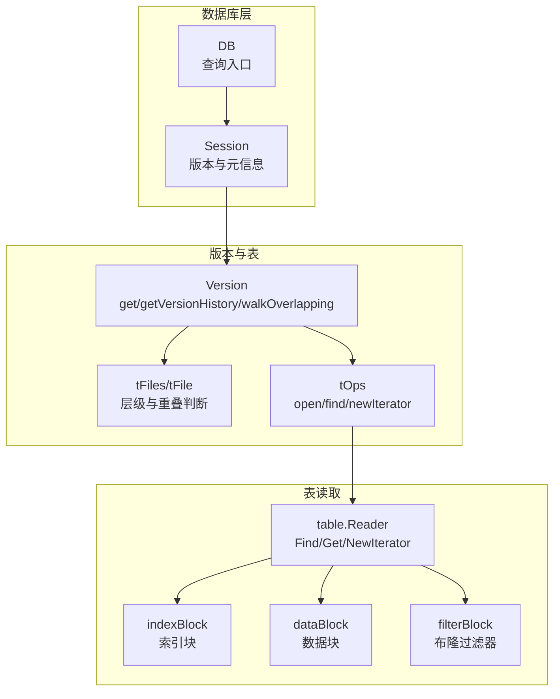
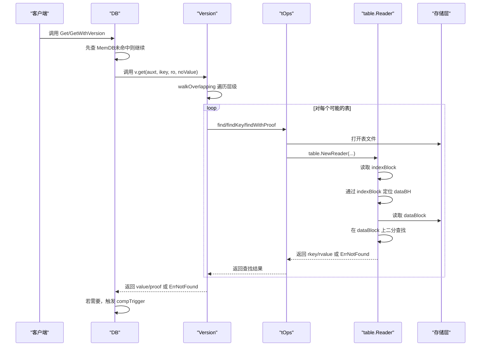
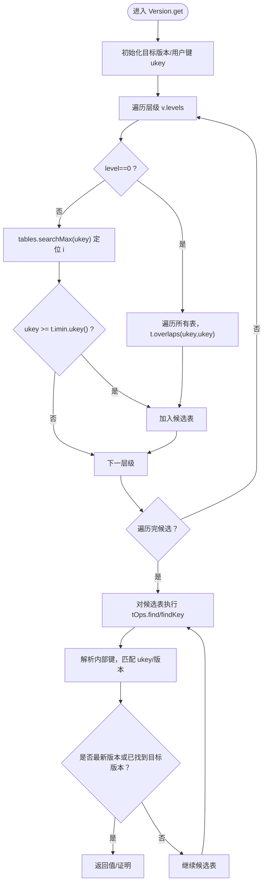
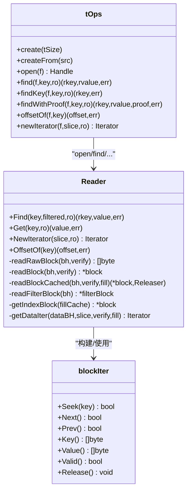
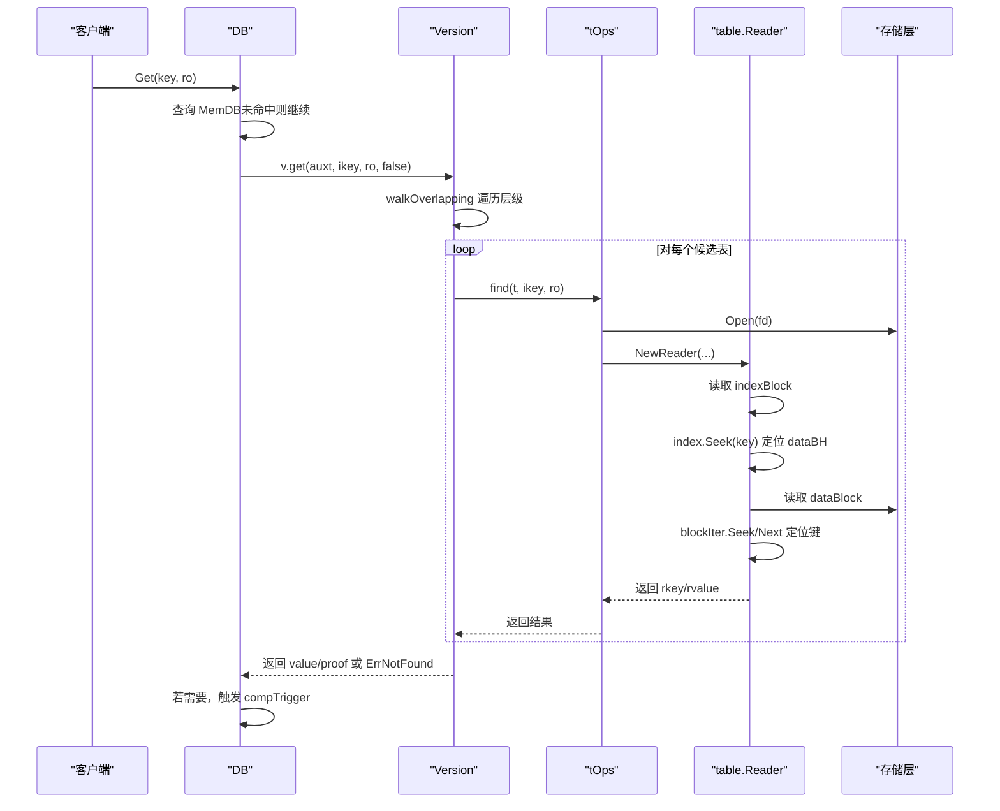
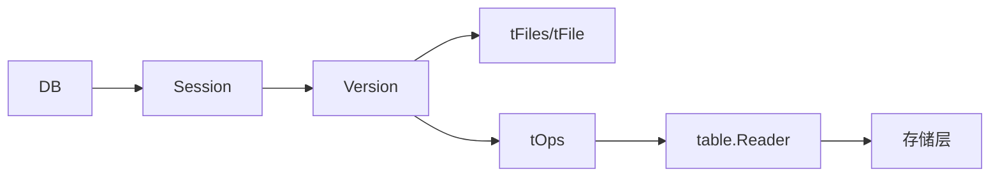

# SSTable查找

<cite>
**本文引用的文件**
- [version.go](file://leveldb/version.go)
- [table.go](file://leveldb/table.go)
- [reader.go](file://leveldb/table/reader.go)
- [db.go](file://leveldb/db.go)
- [db_compaction.go](file://leveldb/db_compaction.go)
- [session.go](file://leveldb/session.go)
</cite>

## 目录
1. [引言](#引言)
2. [项目结构](#项目结构)
3. [核心组件](#核心组件)
4. [架构总览](#架构总览)
5. [详细组件分析](#详细组件分析)
6. [依赖关系分析](#依赖关系分析)
7. [性能考量](#性能考量)
8. [故障排查指南](#故障排查指南)
9. [结论](#结论)

## 引言
本文件围绕 avccDB 的 SSTable 查找流程展开，聚焦于“当 MemDB 未命中时，如何通过版本（Version）与 SSTable Reader 从磁盘文件中定位数据”的完整路径。文档详细解释：
- version.get 与 version.getVersionHistory 如何遍历所有层级的 SSTable 文件；
- walkOverlapping 函数如何筛选出可能包含目标键的文件集合；
- table.NewReader 如何从存储层读取 SSTable 文件，并通过 indexBlock 定位到具体的数据块（data block）；
- Reader.Get 方法如何在数据块内进行二分查找以获取最终值；
- 在查找过程中如何触发压缩（compaction）调度。

## 项目结构
与 SSTable 查找直接相关的模块包括：
- 版本管理：leveldb/version.go
- 表操作封装：leveldb/table.go（tOps、tFile 等）
- 表读取器：leveldb/table/reader.go（Reader、block、blockIter 等）
- 数据库入口：leveldb/db.go（Get、get、getWithProof、getVersionHistory 等）
- 压缩调度：leveldb/db_compaction.go（compTrigger、tableCompaction 等）
- 会话与元信息：leveldb/session.go

图表来源
- [version.go](file://leveldb/version.go#L91-L140)
- [table.go](file://leveldb/table.go#L24-L80)
- [reader.go](file://leveldb/table/reader.go#L511-L566)
- [db.go](file://leveldb/db.go#L800-L833)
- [session.go](file://leveldb/session.go#L36-L66)

章节来源
- [version.go](file://leveldb/version.go#L91-L140)
- [table.go](file://leveldb/table.go#L24-L80)
- [reader.go](file://leveldb/table/reader.go#L511-L566)
- [db.go](file://leveldb/db.go#L800-L833)
- [session.go](file://leveldb/session.go#L36-L66)

## 核心组件
- Version：维护多层级 SSTable 集合，提供 get、getVersionHistory、walkOverlapping 等方法，负责跨层级查找与压缩触发采样。
- tOps：对单个表文件的统一操作接口，负责打开表、查找键值、生成迭代器等。
- table.Reader：SSTable 文件的读取器，负责解析元数据、索引块、数据块，执行查找与迭代。
- DB：对外查询入口，先查 MemDB，未命中则委托 Version 查找；在必要时触发压缩。

章节来源
- [version.go](file://leveldb/version.go#L142-L285)
- [table.go](file://leveldb/table.go#L348-L509)
- [reader.go](file://leveldb/table/reader.go#L917-L1002)
- [db.go](file://leveldb/db.go#L800-L833)

## 架构总览
SSTable 查找从 DB.Get 或 DB.get 开始，若 MemDB 未命中，则由 Version 遍历各层级 SSTable，借助 tOps 打开表并使用 table.Reader 定位数据块，最终在数据块内完成二分查找得到结果。查找过程中的“采样寻道”可触发压缩调度。

图表来源
- [db.go](file://leveldb/db.go#L800-L833)
- [version.go](file://leveldb/version.go#L142-L285)
- [table.go](file://leveldb/table.go#L433-L478)
- [reader.go](file://leveldb/table/reader.go#L826-L943)

## 详细组件分析

### Version.get 与 getVersionHistory：层级遍历与重叠筛选
- walkOverlapping：按层级顺序遍历，对 Level-0 使用全量重叠检查，对非 Level-0 使用二分搜索定位首个可能文件并验证最小键范围，从而快速缩小候选集。
- get：对每个候选表调用 tOps.find/findKey，解析内部键，处理版本匹配与最新版本选择逻辑，支持“采样寻道”以触发压缩调度。
- getVersionHistory：对每个候选表创建迭代器，Seek 到目标键，遍历收集指定版本范围内的所有版本条目，去重后返回。

图表来源
- [version.go](file://leveldb/version.go#L91-L140)
- [version.go](file://leveldb/version.go#L142-L285)
- [version.go](file://leveldb/version.go#L431-L532)

章节来源
- [version.go](file://leveldb/version.go#L91-L140)
- [version.go](file://leveldb/version.go#L142-L285)
- [version.go](file://leveldb/version.go#L431-L532)

### tOps 与 table.Reader：从磁盘读取与块内查找
- tOps.open：打开表文件，构造 table.Reader 并放入文件缓存，后续复用。
- tOps.find/findKey/findWithProof：委托 table.Reader 执行查找或生成证明。
- table.Reader：
  - 构造时解析表尾部元数据，提取 indexBH、filterBH、merkleBH 等，定位数据结束位置。
  - NewIterator：基于 indexBlock 构建索引迭代器，按需加载数据块。
  - Find/Get：通过 indexBlock 的二分查找定位 dataBH，再读取 dataBlock，使用 blockIter 的二分搜索定位目标键。
  - OffsetOf：估算给定键在数据区的偏移，用于统计与定位。

图表来源
- [table.go](file://leveldb/table.go#L348-L509)
- [reader.go](file://leveldb/table/reader.go#L511-L566)
- [reader.go](file://leveldb/table/reader.go#L730-L768)
- [reader.go](file://leveldb/table/reader.go#L826-L943)
- [reader.go](file://leveldb/table/reader.go#L945-L1002)

章节来源
- [table.go](file://leveldb/table.go#L348-L509)
- [reader.go](file://leveldb/table/reader.go#L511-L566)
- [reader.go](file://leveldb/table/reader.go#L730-L768)
- [reader.go](file://leveldb/table/reader.go#L826-L943)
- [reader.go](file://leveldb/table/reader.go#L945-L1002)

### 从版本管理到文件读取再到块内查找的时序图
该时序图展示了 DB.Get 的完整调用链，涵盖 MemDB 未命中后的版本遍历、表打开、索引定位与数据块二分查找。

图表来源
- [db.go](file://leveldb/db.go#L800-L833)
- [version.go](file://leveldb/version.go#L142-L285)
- [table.go](file://leveldb/table.go#L433-L478)
- [reader.go](file://leveldb/table/reader.go#L826-L943)

章节来源
- [db.go](file://leveldb/db.go#L800-L833)
- [version.go](file://leveldb/version.go#L142-L285)
- [table.go](file://leveldb/table.go#L433-L478)
- [reader.go](file://leveldb/table/reader.go#L826-L943)

## 依赖关系分析
- DB 依赖 Session 获取当前版本，并在查询失败时触发压缩命令通道。
- Version 依赖 tOps 访问表文件，依赖 tFiles 判断重叠与排序。
- tOps 依赖存储层打开文件并构造 table.Reader。
- table.Reader 依赖 indexBlock、filterBlock、dataBlock 的解析与缓存策略。

图表来源
- [db.go](file://leveldb/db.go#L800-L833)
- [session.go](file://leveldb/session.go#L36-L66)
- [version.go](file://leveldb/version.go#L142-L285)
- [table.go](file://leveldb/table.go#L348-L509)
- [reader.go](file://leveldb/table/reader.go#L511-L566)

章节来源
- [db.go](file://leveldb/db.go#L800-L833)
- [session.go](file://leveldb/session.go#L36-L66)
- [version.go](file://leveldb/version.go#L142-L285)
- [table.go](file://leveldb/table.go#L348-L509)
- [reader.go](file://leveldb/table/reader.go#L511-L566)

## 性能考量
- 层级遍历优化：非 Level-0 使用二分搜索定位首个可能文件，避免全表扫描。
- 重叠筛选：Level-0 采用全量重叠检查，确保正确性；非 Level-0 仅检查首个可能文件的最小键范围。
- 缓存策略：tOps 使用文件缓存与块缓存，减少重复打开与解码；table.Reader 在无全局缓存时本地缓存 indexBlock 与 filterBlock。
- 压缩触发采样：通过 tFile.consumeSeek 与 cSeek 字段，在多次寻道后触发压缩调度，平衡读放大与写放大。

章节来源
- [version.go](file://leveldb/version.go#L91-L140)
- [table.go](file://leveldb/table.go#L403-L478)
- [reader.go](file://leveldb/table/reader.go#L511-L566)
- [db_compaction.go](file://leveldb/db_compaction.go#L730-L757)

## 故障排查指南
- ErrNotFound：当索引未命中或数据块中无精确匹配键时返回。
- ErrCorrupted：读取块或校验和不一致时包装为损坏错误，建议检查底层存储与文件完整性。
- 迭代器错误：blockIter 在 entries 偏移不一致或重启点异常时设置错误，应检查 SSTable 结构。
- 压缩错误：压缩事务中出现持久性错误时会阻塞写入，需检查日志与磁盘空间。

章节来源
- [reader.go](file://leveldb/table/reader.go#L37-L49)
- [reader.go](file://leveldb/table/reader.go#L550-L566)
- [reader.go](file://leveldb/table/reader.go#L251-L303)
- [db_compaction.go](file://leveldb/db_compaction.go#L87-L139)

## 结论
avccDB 的 SSTable 查找流程通过“版本遍历 + 重叠筛选 + 索引定位 + 块内二分查找”的组合，实现了高效且可控的读路径。Version 的 walkOverlapping 与 tOps 的表访问抽象，配合 table.Reader 的索引与数据块解析，使得查找过程既可扩展又具备良好的性能与可靠性。同时，采样寻道机制在读热点场景下能够及时触发压缩，维持系统长期稳定运行。