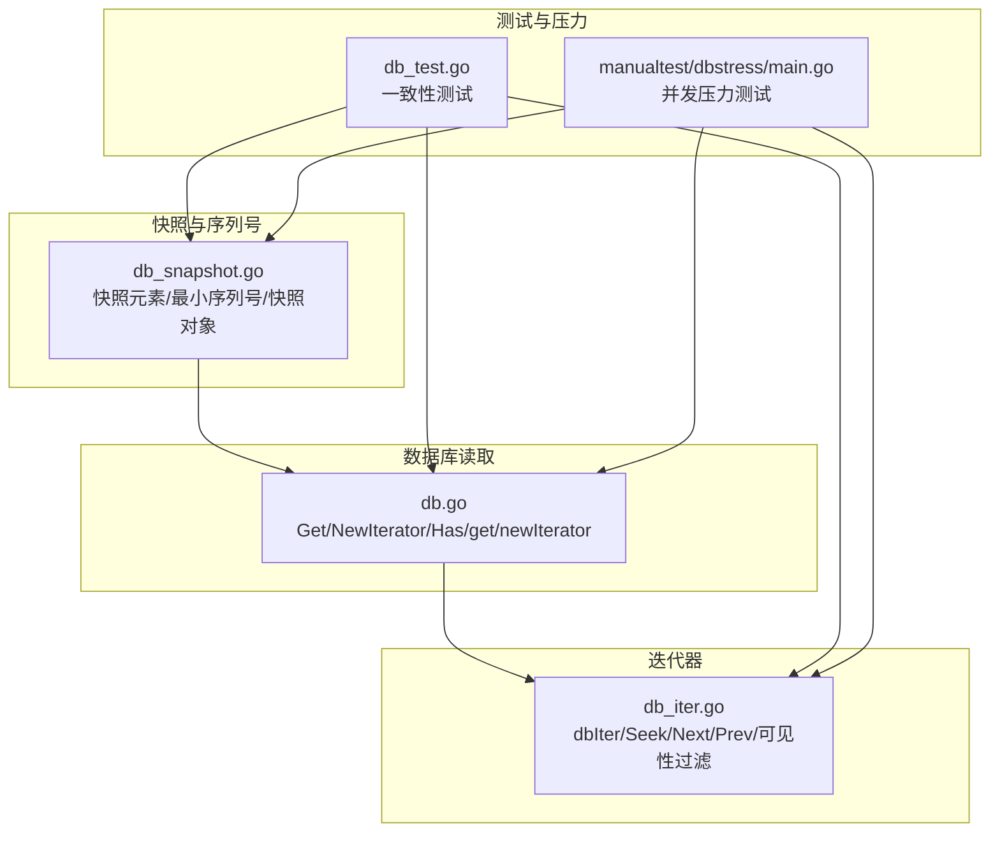
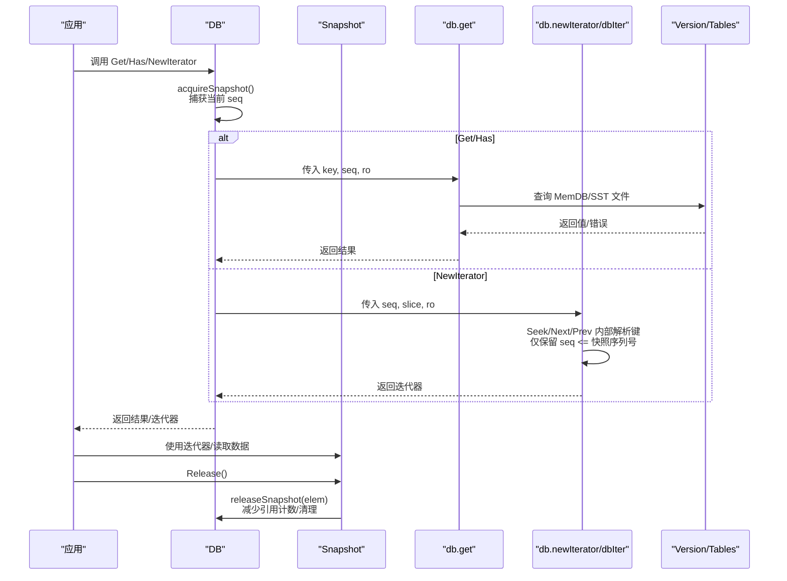
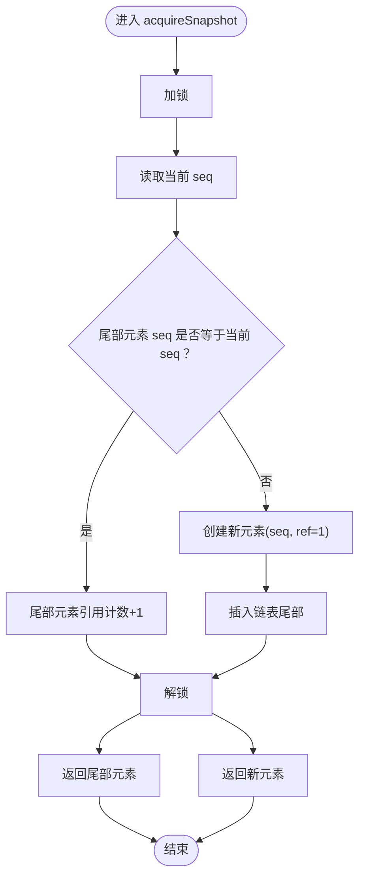
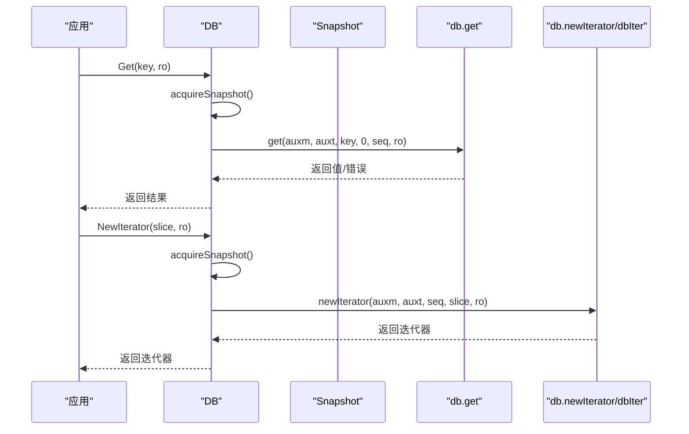
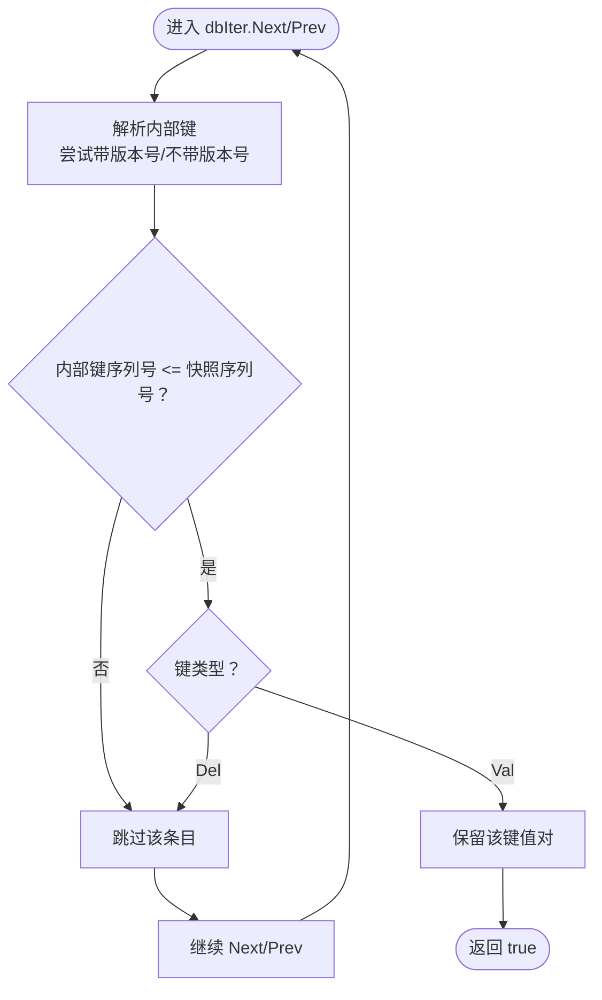
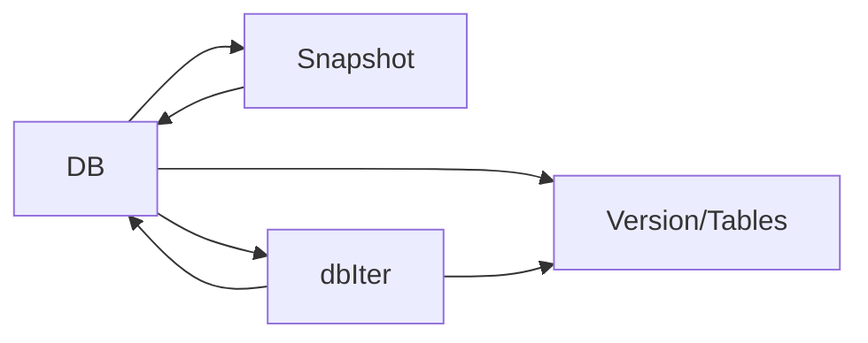
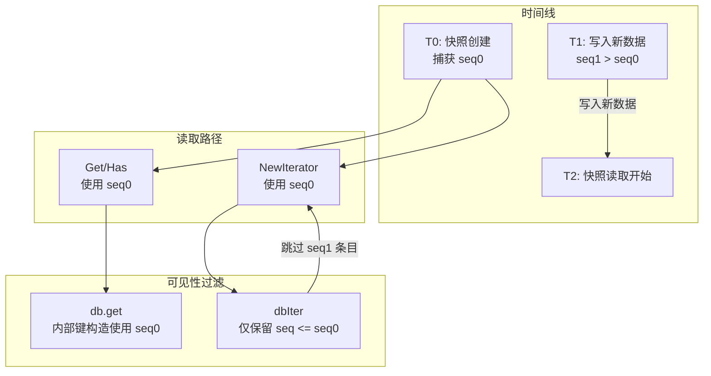

# 快照一致性

<cite>
**本文引用的文件**
- [leveldb/db_snapshot.go](file://leveldb/db_snapshot.go)
- [leveldb/db.go](file://leveldb/db.go)
- [leveldb/db_iter.go](file://leveldb/db_iter.go)
- [leveldb/db_test.go](file://leveldb/db_test.go)
- [manualtest/dbstress/main.go](file://manualtest/dbstress/main.go)
</cite>

## 目录
1. [引言](#引言)
2. [项目结构](#项目结构)
3. [核心组件](#核心组件)
4. [架构总览](#架构总览)
5. [详细组件分析](#详细组件分析)
6. [依赖关系分析](#依赖关系分析)
7. [性能考量](#性能考量)
8. [故障排查指南](#故障排查指南)
9. [结论](#结论)
10. [附录](#附录)

## 引言
本文件围绕 avccDB 的快照一致性机制进行系统化说明，重点阐述在存在多个快照的情况下，如何通过“序列号（seq）”作为可见性边界，保证读取操作的一致性视图。内容涵盖：
- Get、NewIterator 等读取方法如何通过 acquireSnapshot 获取快照实例并捕获调用时刻的数据库序列号；
- 数据库层的 db.get 和 db.newIterator 如何将该序列号传递给底层查询与迭代器，确保所有读取基于同一时间点的数据状态；
- 快照对象的生命周期管理与释放流程；
- 多版本查询中，序列号如何作为可见性边界，避免读取到快照创建之后写入的数据；
- 提供快照一致性机制的示意与流程图，帮助读者直观理解。

## 项目结构
与快照一致性相关的核心代码分布在以下模块：
- 快照与序列号管理：leveldb/db_snapshot.go
- 数据库读取入口与序列号传递：leveldb/db.go
- 迭代器内部对序列号的使用与可见性过滤：leveldb/db_iter.go
- 行为验证与并发压力测试：leveldb/db_test.go、manualtest/dbstress/main.go

图表来源
- [leveldb/db_snapshot.go](file://leveldb/db_snapshot.go#L1-L188)
- [leveldb/db.go](file://leveldb/db.go#L798-L1230)
- [leveldb/db_iter.go](file://leveldb/db_iter.go#L63-L120)
- [leveldb/db_test.go](file://leveldb/db_test.go#L2061-L2485)
- [manualtest/dbstress/main.go](file://manualtest/dbstress/main.go#L505-L587)

章节来源
- [leveldb/db_snapshot.go](file://leveldb/db_snapshot.go#L1-L188)
- [leveldb/db.go](file://leveldb/db.go#L798-L1230)
- [leveldb/db_iter.go](file://leveldb/db_iter.go#L63-L120)
- [leveldb/db_test.go](file://leveldb/db_test.go#L2061-L2485)
- [manualtest/dbstress/main.go](file://manualtest/dbstress/main.go#L505-L587)

## 核心组件
- 快照元素（snapshotElement）：记录某时刻的序列号与引用计数，并挂载于双端链表尾部；当最新序列号与尾部元素相同时，会复用尾部元素并增加引用计数。
- 最小序列号（minSeq）：返回未被任何快照占用的最小序列号，用于清理与可见性判断。
- 快照对象（Snapshot）：封装 DB 指针与 snapshotElement，提供 Get、Has、NewIterator、Release 等方法；内部通过互斥锁保护释放状态。
- 数据库读取入口：
  - Get/Has：内部先 acquireSnapshot，再调用 db.get/db.has 并传入快照序列号。
  - NewIterator：内部先 acquireSnapshot，再调用 db.newIterator 并传入快照序列号。
- 迭代器（dbIter）：在 Seek/Next/Prev 中对内部键进行解析，仅保留“序列号 ≤ 快照序列号”的条目，从而实现可见性过滤。

章节来源
- [leveldb/db_snapshot.go](file://leveldb/db_snapshot.go#L21-L72)
- [leveldb/db_snapshot.go](file://leveldb/db_snapshot.go#L74-L188)
- [leveldb/db.go](file://leveldb/db.go#L1092-L1198)
- [leveldb/db.go](file://leveldb/db.go#L1200-L1230)
- [leveldb/db_iter.go](file://leveldb/db_iter.go#L186-L244)

## 架构总览
下图展示了从应用调用到底层查询与可见性过滤的整体流程，强调“序列号作为可见性边界”的关键作用。

图表来源
- [leveldb/db.go](file://leveldb/db.go#L1092-L1198)
- [leveldb/db.go](file://leveldb/db.go#L1200-L1230)
- [leveldb/db_snapshot.go](file://leveldb/db_snapshot.go#L28-L60)
- [leveldb/db_iter.go](file://leveldb/db_iter.go#L186-L244)

## 详细组件分析

### 快照获取与生命周期
- 获取快照：
  - DB.acquireSnapshot：在临界区内读取当前序列号，若与尾部元素相同则复用并增加引用计数；否则新建元素并插入尾部。
  - DB.newSnapshot：创建 Snapshot 对象并设置终结器，原子性增加存活快照计数。
- 释放快照：
  - Snapshot.Release：清除终结器、标记已释放、调用 DB.releaseSnapshot 减少引用计数；当引用计数归零时从链表移除。
  - DB.releaseSnapshot：校验引用计数非负，归零则从链表移除元素。
- 最小序列号：
  - DB.minSeq：返回链表头部元素的序列号，即“未被任何快照占用的最小序列号”，用于清理与可见性判断。

图表来源
- [leveldb/db_snapshot.go](file://leveldb/db_snapshot.go#L28-L46)

章节来源
- [leveldb/db_snapshot.go](file://leveldb/db_snapshot.go#L21-L72)
- [leveldb/db_snapshot.go](file://leveldb/db_snapshot.go#L74-L188)

### 读取方法与序列号传递
- Get/Has：
  - DB.Get/Has 先 acquireSnapshot，再调用 db.get/db.has 并传入快照序列号；db.get 在构造内部键时使用该序列号，确保只看到该时刻之前或同时写入的数据。
- NewIterator：
  - DB.NewIterator 同样先 acquireSnapshot，再调用 db.newIterator 并传入快照序列号；dbIter 在 Seek/Next/Prev 中对内部键进行解析，仅保留“序列号 ≤ 快照序列号”的条目，从而保证迭代一致性。

图表来源
- [leveldb/db.go](file://leveldb/db.go#L1092-L1198)
- [leveldb/db.go](file://leveldb/db.go#L1200-L1230)
- [leveldb/db_iter.go](file://leveldb/db_iter.go#L63-L91)

章节来源
- [leveldb/db.go](file://leveldb/db.go#L1092-L1198)
- [leveldb/db.go](file://leveldb/db.go#L1200-L1230)

### 迭代器的可见性过滤
- dbIter.Seek/Next/Prev：
  - 在遍历过程中解析内部键，区分带版本号与不带版本号两种情况；仅当内部键的序列号小于等于快照序列号时才视为可见。
  - 对于删除类型键（keyTypeDel），跳过该条目；对于有效值（keyTypeVal），保留最近一次可见版本。
- 内部键构造：
  - dbIter.Seek 将用户键转换为内部键时，使用快照序列号作为可见性边界；db.get 在构造内部键时同样使用快照序列号。

图表来源
- [leveldb/db_iter.go](file://leveldb/db_iter.go#L186-L244)
- [leveldb/db_iter.go](file://leveldb/db_iter.go#L246-L304)

章节来源
- [leveldb/db_iter.go](file://leveldb/db_iter.go#L186-L244)
- [leveldb/db_iter.go](file://leveldb/db_iter.go#L246-L304)

### 多版本查询与序列号边界
- 版本历史查询：
  - DB.getVersionHistory 会从 MemDB 与 SST 文件收集指定范围内的版本条目，并以“序列号 ≤ 快照序列号”作为可见性边界，最终按版本升序返回。
- 可见性边界的作用：
  - 快照序列号作为“时间戳”，确保读取不会看到快照创建之后写入的新版本数据，从而保证一致性视图。

章节来源
- [leveldb/db.go](file://leveldb/db.go#L934-L1047)

### 并发与一致性验证
- 测试覆盖：
  - 多个并发读写场景下，使用快照读取与普通迭代器读取并存，验证读取一致性与可见性边界。
  - 压力测试中，迭代器与 Get 方法在快照上下文中协同工作，确保跨 goroutine 的一致性。
- 关键断言：
  - 快照读取的键值与预期一致；
  - 迭代器遍历顺序与可见性边界一致；
  - 迭代器内部键解析正确，删除键被跳过。

章节来源
- [leveldb/db_test.go](file://leveldb/db_test.go#L2061-L2485)
- [manualtest/dbstress/main.go](file://manualtest/dbstress/main.go#L505-L587)

## 依赖关系分析
- 组件耦合：
  - DB 与 Snapshot：DB 提供 acquireSnapshot/newSnapshot/releaseSnapshot；Snapshot 持有 DB 指针并在释放时回调 DB。
  - DB 与 dbIter：DB.newIterator 创建 dbIter，并将快照序列号传递给 dbIter；dbIter 在内部遍历时使用该序列号进行可见性过滤。
  - DB 与 Version/Tables：读取路径最终落到 Version 层，结合快照序列号完成可见性判断。
- 外部依赖：
  - 迭代器合并器（iterator.MergedIterator）与比较器（iComparer）参与多源合并与排序。
  - 严格模式（StrictReader）影响解析失败时的行为。

图表来源
- [leveldb/db.go](file://leveldb/db.go#L1092-L1230)
- [leveldb/db_iter.go](file://leveldb/db_iter.go#L63-L120)

章节来源
- [leveldb/db.go](file://leveldb/db.go#L1092-L1230)
- [leveldb/db_iter.go](file://leveldb/db_iter.go#L63-L120)

## 性能考量
- 快照开销：
  - 每个快照会持有版本引用，且存活快照数量受 aliveSnaps 计数跟踪；过多快照可能影响清理与可见性判断。
- 迭代器采样：
  - dbIter 支持采样率控制，避免频繁采样带来的额外开销。
- 清理策略：
  - minSeq 用于确定“未被任何快照占用的最小序列号”，有助于清理不再需要的历史数据。

章节来源
- [leveldb/db_iter.go](file://leveldb/db_iter.go#L93-L120)
- [leveldb/db_snapshot.go](file://leveldb/db_snapshot.go#L62-L72)

## 故障排查指南
- 常见问题与定位：
  - 快照未释放：检查是否调用了 Snapshot.Release；可通过 aliveSnaps 计数观察存活快照数量。
  - 迭代器释放后继续使用：dbIter 对已释放状态进行保护，若继续使用会返回错误。
  - 可见性异常：确认快照序列号是否正确传递至 dbIter；检查内部键解析逻辑与删除键处理。
- 定位手段：
  - 利用测试用例中的断言与日志输出，复现并发场景下的可见性问题。
  - 在压力测试中观察迭代器与 Get 的延迟统计，辅助定位性能瓶颈。

章节来源
- [leveldb/db_iter.go](file://leveldb/db_iter.go#L360-L393)
- [leveldb/db_test.go](file://leveldb/db_test.go#L2061-L2485)
- [manualtest/dbstress/main.go](file://manualtest/dbstress/main.go#L505-L587)

## 结论
avccDB 的快照一致性机制通过“序列号（seq）作为可见性边界”实现多快照场景下的强一致读取视图：
- 读取入口（Get/Has/NewIterator）在调用前捕获当前序列号，并将其传递给底层查询与迭代器；
- 底层查询与迭代器在解析内部键时仅保留“序列号 ≤ 快照序列号”的条目，避免读取到快照创建之后写入的数据；
- 快照对象负责生命周期管理，释放时通知数据库回收资源；
- 多版本查询与压力测试进一步验证了该机制在并发场景下的正确性与稳定性。

## 附录
- 快照一致性机制示意图（概念图）
