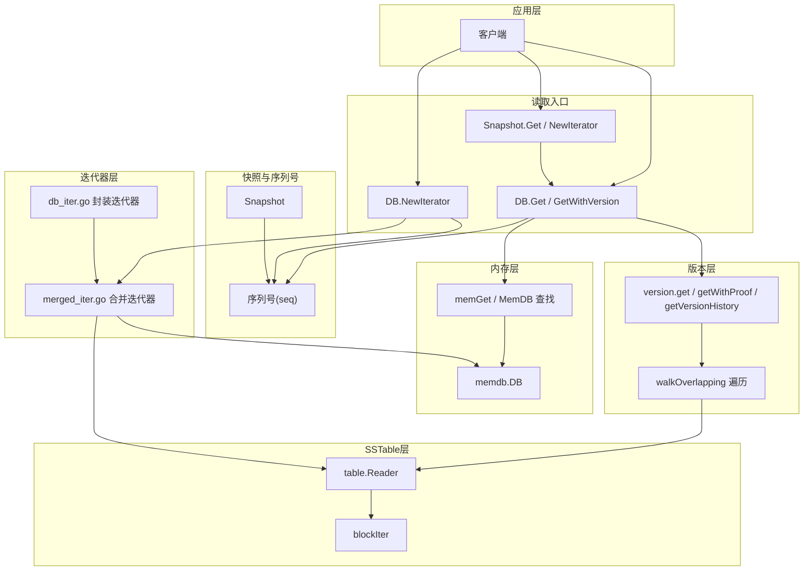
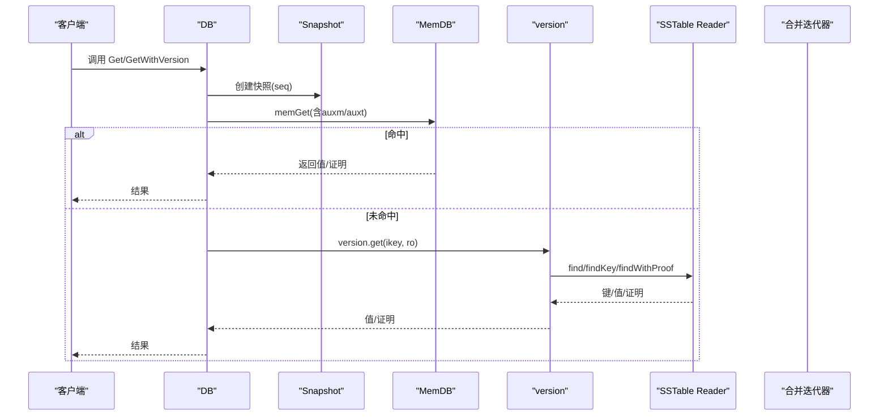
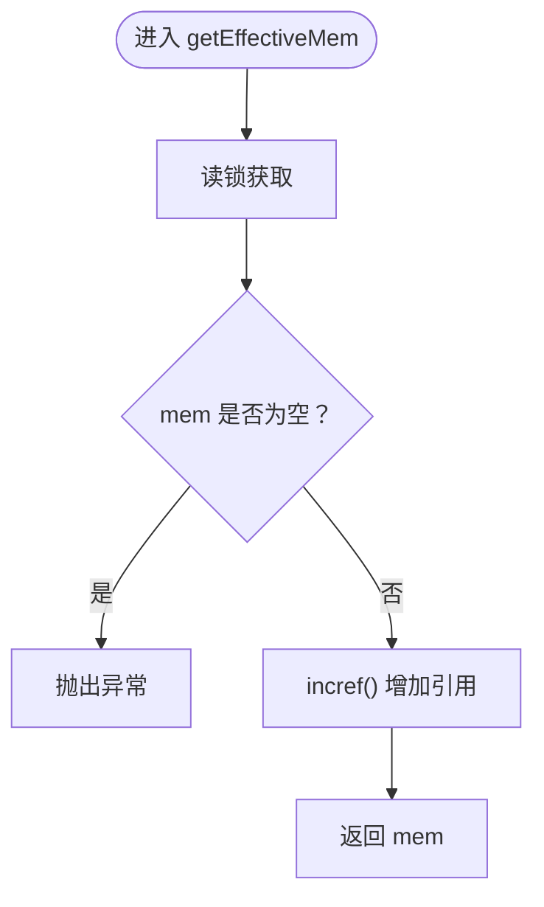
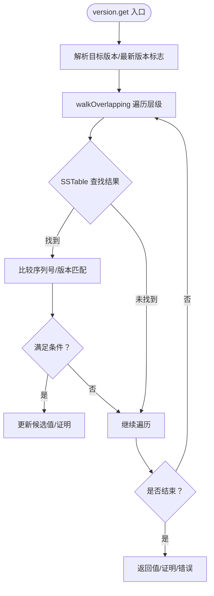
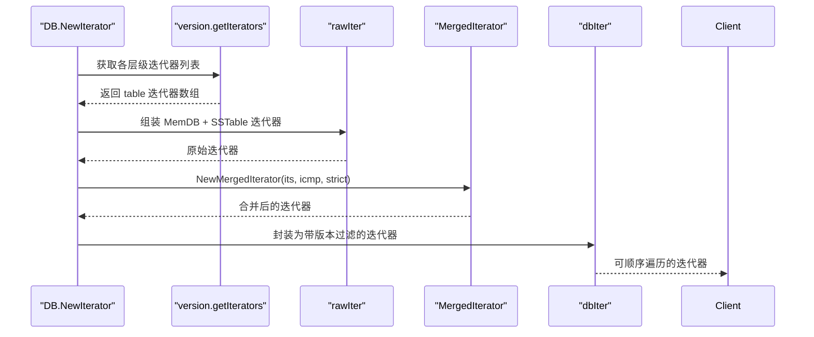
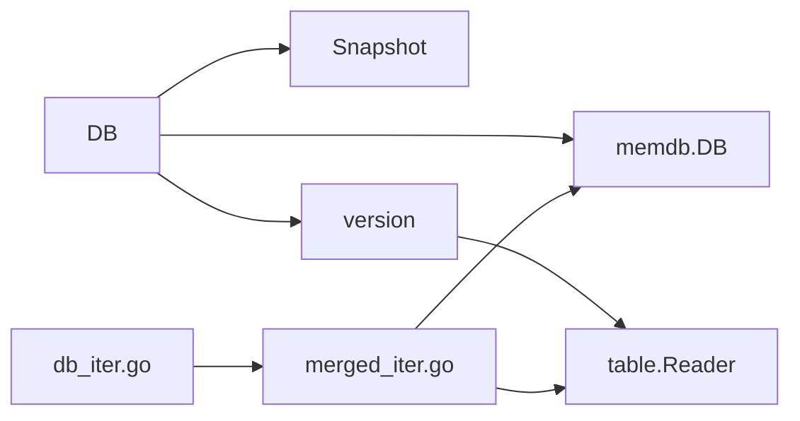

# 读取流程

<cite>
**本文引用的文件**
- [leveldb/db.go](file://leveldb/db.go)
- [leveldb/version.go](file://leveldb/version.go)
- [leveldb/memdb/memdb.go](file://leveldb/memdb/memdb.go)
- [leveldb/table/reader.go](file://leveldb/table/reader.go)
- [leveldb/iterator/merged_iter.go](file://leveldb/iterator/merged_iter.go)
- [leveldb/db_iter.go](file://leveldb/db_iter.go)
- [leveldb/db_snapshot.go](file://leveldb/db_snapshot.go)
- [leveldb/db_state.go](file://leveldb/db_state.go)
</cite>

## 目录
1. [引言](#引言)
2. [项目结构](#项目结构)
3. [核心组件](#核心组件)
4. [架构总览](#架构总览)
5. [详细组件分析](#详细组件分析)
6. [依赖关系分析](#依赖关系分析)
7. [性能考虑](#性能考虑)
8. [故障排查指南](#故障排查指南)
9. [结论](#结论)

## 引言
本文件围绕 avccDB 的读取流程，系统性梳理从客户端发起 Get/NewIterator 操作到最终返回结果的完整路径。重点覆盖：
- 通过 getEffectiveMem 获取当前有效 MemDB 并在其中查找数据；
- 版本机制与多版本查询（含最新版本、指定版本、版本历史）；
- 当 MemDB 未命中时，如何借助 version.go 中的版本遍历策略与 table.go 的 SSTable Reader 在多层级 SSTable 中定位数据；
- 迭代器（Iterator）如何使用 merged_iter.go 的合并迭代器模式，将 MemDB 与多个 SSTable 数据源有序合并，实现高效范围查询；
- 多快照（Snapshot）场景下，读取操作如何保证一致性视图。

## 项目结构
与读取流程直接相关的模块包括：
- 数据库入口与读写控制：leveldb/db.go
- 版本管理与层级遍历：leveldb/version.go
- 内存数据库（MemDB）：leveldb/memdb/memdb.go
- SSTable 文件读取与块迭代：leveldb/table/reader.go
- 合并迭代器：leveldb/iterator/merged_iter.go
- 数据库迭代器封装：leveldb/db_iter.go
- 快照与一致性：leveldb/db_snapshot.go
- 内存数据库生命周期与引用计数：leveldb/db_state.go

图表来源
- [leveldb/db.go](file://leveldb/db.go#L1092-L1146)
- [leveldb/db_iter.go](file://leveldb/db_iter.go#L63-L91)
- [leveldb/db_snapshot.go](file://leveldb/db_snapshot.go#L27-L60)
- [leveldb/version.go](file://leveldb/version.go#L142-L285)
- [leveldb/memdb/memdb.go](file://leveldb/memdb/memdb.go#L351-L386)
- [leveldb/table/reader.go](file://leveldb/table/reader.go#L789-L800)
- [leveldb/iterator/merged_iter.go](file://leveldb/iterator/merged_iter.go#L299-L317)

章节来源
- [leveldb/db.go](file://leveldb/db.go#L1092-L1146)
- [leveldb/db_iter.go](file://leveldb/db_iter.go#L63-L91)
- [leveldb/db_snapshot.go](file://leveldb/db_snapshot.go#L27-L60)

## 核心组件
- DB.Get / GetWithVersion：对外提供的读取接口，内部通过快照序列号与版本层协作完成查找。
- DB.NewIterator：返回基于快照的一致性迭代器，内部通过合并迭代器整合 MemDB 与 SSTable。
- version.get / getWithProof / getVersionHistory：版本层负责跨层级查找、版本解析与合并。
- memGet / memdb.DB：在当前有效 MemDB 与冻结 MemDB 中查找键值。
- table.Reader / blockIter：对 SSTable 文件进行块级读取与迭代。
- merged_iter.go：多路有序合并迭代器，统一输出一致、去重、按序的结果流。
- Snapshot：维护序列号，确保读取一致性；DB.NewIterator 与 DB.Get 均会创建快照。

章节来源
- [leveldb/db.go](file://leveldb/db.go#L1092-L1146)
- [leveldb/version.go](file://leveldb/version.go#L142-L285)
- [leveldb/memdb/memdb.go](file://leveldb/memdb/memdb.go#L351-L386)
- [leveldb/table/reader.go](file://leveldb/table/reader.go#L789-L800)
- [leveldb/iterator/merged_iter.go](file://leveldb/iterator/merged_iter.go#L299-L317)
- [leveldb/db_iter.go](file://leveldb/db_iter.go#L63-L91)
- [leveldb/db_snapshot.go](file://leveldb/db_snapshot.go#L27-L60)

## 架构总览
读取流程的关键路径如下：
- 客户端调用 DB.Get / GetWithVersion 或 DB.NewIterator；
- 系统创建快照，记录当前序列号；
- 先在 MemDB（含辅助 MemDB 与有效/冻结 MemDB）查找；
- 若未命中，则进入版本层，按层级遍历（含 Level-0 重叠处理）；
- 对命中层级的 SSTable 使用 table.Reader 与 blockIter 定位具体键；
- 对于迭代器，使用 merged_iter.go 将 MemDB 与 SSTable 的迭代器合并；
- 返回结果或迭代器。

图表来源
- [leveldb/db.go](file://leveldb/db.go#L1092-L1146)
- [leveldb/version.go](file://leveldb/version.go#L142-L285)
- [leveldb/memdb/memdb.go](file://leveldb/memdb/memdb.go#L351-L386)
- [leveldb/table/reader.go](file://leveldb/table/reader.go#L789-L800)

## 详细组件分析

### Get/NewIterator 入口与快照一致性
- DB.Get / GetWithVersion：创建快照并传入序列号 seq，确保读取视图为该时刻的一致快照。
- DB.NewIterator：同样创建快照，随后构造原始迭代器，再由 db_iter.go 封装为带版本过滤的迭代器。
- Snapshot.acquireSnapshot：记录当前序列号，作为后续读取的“时间点”。

章节来源
- [leveldb/db.go](file://leveldb/db.go#L1092-L1146)
- [leveldb/db_iter.go](file://leveldb/db_iter.go#L63-L91)
- [leveldb/db_snapshot.go](file://leveldb/db_snapshot.go#L27-L60)

### MemDB 查找与 getEffectiveMem
- getEffectiveMem：返回当前有效 MemDB，并增加引用计数，避免并发释放。
- getMems：同时获取有效与冻结 MemDB，用于读取阶段的双重查找。
- memGet：在给定 MemDB 中查找内部键，支持带版本与非版本键解析，处理删除标记。

图表来源
- [leveldb/db_state.go](file://leveldb/db_state.go#L176-L186)

章节来源
- [leveldb/db_state.go](file://leveldb/db_state.go#L161-L186)
- [leveldb/db.go](file://leveldb/db.go#L769-L796)

### 版本机制与多版本查询
- 版本层核心方法：version.get / getWithProof / getVersionHistory。
- 解析内部键：优先尝试带版本键解析，若失败回退到非版本键；根据目标版本与最新版本策略决定是否接受更高序列号。
- 层级遍历：walkOverlapping 对 Level-0 采用全重叠扫描，其他层级使用二分查找定位可能包含键的表。
- 证明生成：getWithProof 支持返回 Merkle 证明并与 MasterRoot 组合。

图表来源
- [leveldb/version.go](file://leveldb/version.go#L142-L285)

章节来源
- [leveldb/version.go](file://leveldb/version.go#L142-L285)

### SSTable Reader 与块迭代
- table.Reader 提供块缓存、校验与索引块访问能力；blockIter 实现块内有序遍历与二分查找。
- 读取路径：version.get 调用 tops.find/findKey/findWithProof，底层使用 table.Reader 与 blockIter 定位键。

章节来源
- [leveldb/table/reader.go](file://leveldb/table/reader.go#L789-L800)

### 迭代器合并与范围查询
- db_iter.go：将原始迭代器（来自 MemDB 与 SSTable）封装为带版本过滤的迭代器，仅返回小于等于当前序列号的有效键。
- merged_iter.go：多路有序合并，使用堆维护当前最小键，逐个推进，实现高效范围扫描。

图表来源
- [leveldb/db_iter.go](file://leveldb/db_iter.go#L31-L61)
- [leveldb/version.go](file://leveldb/version.go#L551-L564)
- [leveldb/iterator/merged_iter.go](file://leveldb/iterator/merged_iter.go#L299-L317)

章节来源
- [leveldb/db_iter.go](file://leveldb/db_iter.go#L31-L61)
- [leveldb/version.go](file://leveldb/version.go#L551-L564)
- [leveldb/iterator/merged_iter.go](file://leveldb/iterator/merged_iter.go#L299-L317)

### 多快照一致性视图
- 快照序列号：acquireSnapshot 记录当前序列号，作为读取的“时间点”。
- 读取一致性：DB.Get/GetWithVersion/NewIterator 均使用该序列号，确保只看到在此之前已提交的变更。
- Snapshot.NewIterator：与 DB.NewIterator 类似，但持有独立的快照对象，释放快照不影响迭代器有效性。

章节来源
- [leveldb/db_snapshot.go](file://leveldb/db_snapshot.go#L27-L60)
- [leveldb/db.go](file://leveldb/db.go#L1200-L1230)

## 依赖关系分析
- DB 依赖快照与序列号以保证一致性；
- DB 依赖 MemDB 与版本层；版本层依赖 SSTable Reader；
- 迭代器链路：db_iter.go 依赖 merged_iter.go；merged_iter.go 依赖各数据源迭代器（MemDB/SSTable）；
- 版本层依赖比较器与层级结构，walkOverlapping 依赖重叠判断与二分查找。

图表来源
- [leveldb/db.go](file://leveldb/db.go#L1092-L1146)
- [leveldb/db_iter.go](file://leveldb/db_iter.go#L63-L91)
- [leveldb/version.go](file://leveldb/version.go#L142-L285)
- [leveldb/table/reader.go](file://leveldb/table/reader.go#L789-L800)
- [leveldb/iterator/merged_iter.go](file://leveldb/iterator/merged_iter.go#L299-L317)

章节来源
- [leveldb/db.go](file://leveldb/db.go#L1092-L1146)
- [leveldb/db_iter.go](file://leveldb/db_iter.go#L63-L91)
- [leveldb/version.go](file://leveldb/version.go#L142-L285)

## 性能考虑
- 层级遍历优化：Level-0 采用全重叠扫描，其他层级使用二分查找定位，减少不必要的 IO。
- 块内查找：blockIter 使用重启点与二分查找快速定位键，降低块内扫描成本。
- 合并迭代器：使用堆维护最小键，避免全量排序，适合范围扫描场景。
- 缓存与池化：table.Reader 支持块缓存；memdb 与内存池复用，降低分配开销。
- 采样触发压缩：版本层在命中后可触发采样，必要时调度 SSTable 压缩。

## 故障排查指南
- 未找到键：ErrNotFound 是常见返回；检查内部键构造（含版本/序列号）与比较器配置。
- 版本不匹配：确认目标版本参数与内部键版本字段是否一致；最新版本查询需使用特殊标记。
- 迭代器错误：严格模式下，遇到损坏块会中断；可切换为非严格模式以跳过损坏区域。
- 快照释放：确保在使用完毕后释放快照与迭代器，避免资源泄漏。

章节来源
- [leveldb/db.go](file://leveldb/db.go#L1092-L1146)
- [leveldb/db_iter.go](file://leveldb/db_iter.go#L143-L167)
- [leveldb/table/reader.go](file://leveldb/table/reader.go#L568-L606)

## 结论
avccDB 的读取流程通过“快照 + 版本层 + MemDB/SSTable”的协同，实现了高效且一致的多版本查询与范围扫描。MemDB 优先命中、SSTable 分层遍历、块内二分查找与合并迭代器共同构成了高性能读取路径。多快照场景下，序列号确保了读取视图的一致性，满足复杂业务对数据溯源与一致性要求。