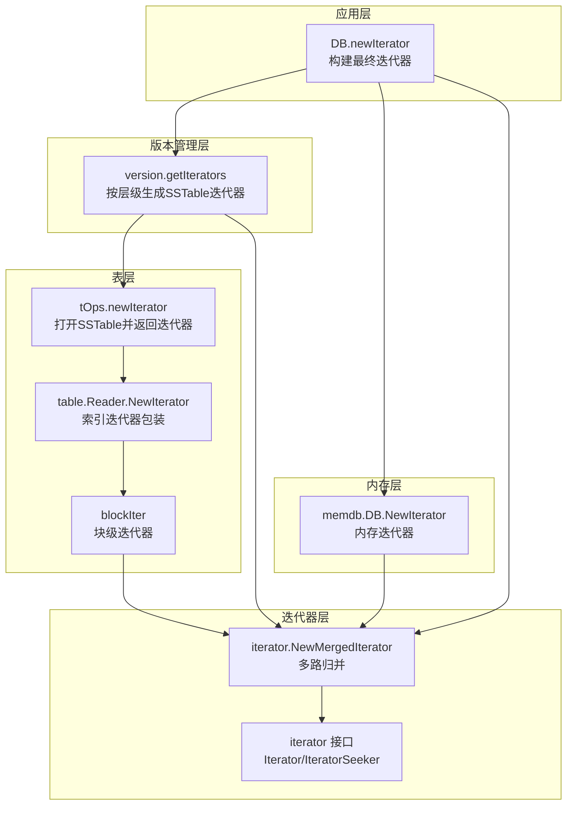
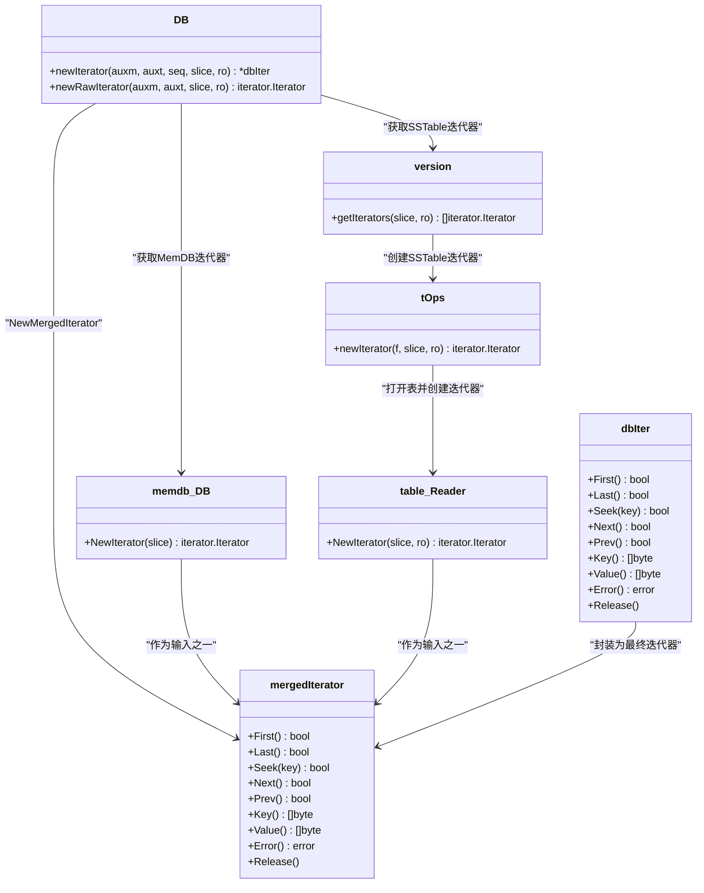
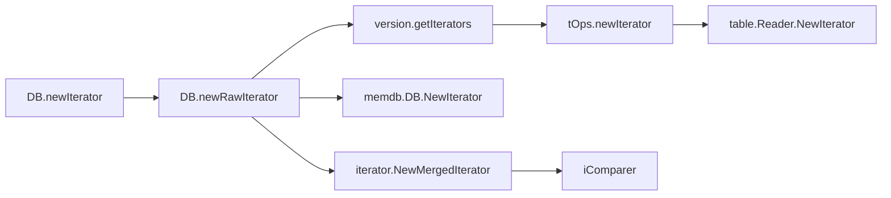

# 迭代器合并

<cite>
**本文引用的文件列表**
- [leveldb/db_iter.go](file://leveldb/db_iter.go)
- [leveldb/iterator/merged_iter.go](file://leveldb/iterator/merged_iter.go)
- [leveldb/memdb/memdb.go](file://leveldb/memdb/memdb.go)
- [leveldb/version.go](file://leveldb/version.go)
- [leveldb/table.go](file://leveldb/table.go)
- [leveldb/table/reader.go](file://leveldb/table/reader.go)
- [leveldb/comparer.go](file://leveldb/comparer.go)
- [leveldb/iterator/iter.go](file://leveldb/iterator/iter.go)
</cite>

## 目录
1. [简介](#简介)
2. [项目结构](#项目结构)
3. [核心组件](#核心组件)
4. [架构总览](#架构总览)
5. [详细组件分析](#详细组件分析)
6. [依赖关系分析](#依赖关系分析)
7. [性能考量](#性能考量)
8. [故障排查指南](#故障排查指南)
9. [结论](#结论)

## 简介
本文件围绕 avccDB 的迭代器合并流程展开，系统性阐述 NewIterator 如何将 MemDB 与多个 SSTable 数据源有序合并，形成统一的、可高效范围查询的迭代视图。重点覆盖：
- newRawIterator 如何创建并初始化所有数据源迭代器：auxm（辅助 MemDB）、auxt（辅助 SSTable）、有效 MemDB、冻结 MemDB，以及各层级的 SSTable 迭代器。
- iterator.NewMergedIterator 如何以比较器（Comparer）为依据，通过最小堆管理多个子迭代器，实现多路归并。
- mergedIterator 的 First、Seek、Next 等方法如何协调内部多个迭代器状态，保证输出顺序与一致性。
- 提供组件图与序列图，直观展示数据源组织方式与查询请求分发合并过程。

## 项目结构
与迭代器合并直接相关的模块与文件如下：
- 数据源层：MemDB（内存）、SSTable（磁盘）
- 版本管理层：version 负责组织各层级的 SSTable，并生成对应迭代器
- 表层：table/tOps 提供打开与迭代器创建能力
- 迭代器层：iterator 包含合并迭代器与通用接口
- 比较器层：iComparer 实现内部键排序规则

图表来源
- [leveldb/db_iter.go](file://leveldb/db_iter.go#L31-L61)
- [leveldb/version.go](file://leveldb/version.go#L551-L564)
- [leveldb/table.go](file://leveldb/table.go#L500-L509)
- [leveldb/table/reader.go](file://leveldb/table/reader.go#L804-L824)
- [leveldb/memdb/memdb.go](file://leveldb/memdb/memdb.go#L408-L410)
- [leveldb/iterator/merged_iter.go](file://leveldb/iterator/merged_iter.go#L299-L317)
- [leveldb/iterator/iter.go](file://leveldb/iterator/iter.go#L72-L95)

章节来源
- [leveldb/db_iter.go](file://leveldb/db_iter.go#L31-L61)
- [leveldb/version.go](file://leveldb/version.go#L551-L564)
- [leveldb/table.go](file://leveldb/table.go#L500-L509)
- [leveldb/table/reader.go](file://leveldb/table/reader.go#L804-L824)
- [leveldb/memdb/memdb.go](file://leveldb/memdb/memdb.go#L408-L410)
- [leveldb/iterator/merged_iter.go](file://leveldb/iterator/merged_iter.go#L299-L317)
- [leveldb/iterator/iter.go](file://leveldb/iterator/iter.go#L72-L95)

## 核心组件
- DB.newIterator：对外暴露的迭代器入口，负责将内部键范围转换为内部键范围，调用 newRawIterator 获取底层合并迭代器，并封装为 dbIter。
- DB.newRawIterator：组装所有数据源迭代器，构造合并迭代器，并设置版本释放器。
- version.getIterators：按层级生成 SSTable 迭代器；Level 0 合并所有重叠文件；非 0 级使用索引迭代器。
- tOps.newIterator：打开 SSTable 并返回迭代器，设置释放器。
- table.Reader.NewIterator：返回索引迭代器，内部由 indexIter 和 blockIter 组合。
- memdb.DB.NewIterator：返回内存迭代器。
- iterator.NewMergedIterator：多路归并迭代器，使用最小堆维护当前最小键。
- iComparer：内部键比较器，支持带版本/序列号的排序规则。

章节来源
- [leveldb/db_iter.go](file://leveldb/db_iter.go#L63-L91)
- [leveldb/db_iter.go](file://leveldb/db_iter.go#L31-L61)
- [leveldb/version.go](file://leveldb/version.go#L551-L564)
- [leveldb/table.go](file://leveldb/table.go#L500-L509)
- [leveldb/table/reader.go](file://leveldb/table/reader.go#L804-L824)
- [leveldb/memdb/memdb.go](file://leveldb/memdb/memdb.go#L408-L410)
- [leveldb/iterator/merged_iter.go](file://leveldb/iterator/merged_iter.go#L299-L317)
- [leveldb/comparer.go](file://leveldb/comparer.go#L33-L101)

## 架构总览
下面的类图展示了迭代器合并的关键对象及其关系。

图表来源
- [leveldb/db_iter.go](file://leveldb/db_iter.go#L31-L61)
- [leveldb/db_iter.go](file://leveldb/db_iter.go#L63-L91)
- [leveldb/version.go](file://leveldb/version.go#L551-L564)
- [leveldb/table.go](file://leveldb/table.go#L500-L509)
- [leveldb/table/reader.go](file://leveldb/table/reader.go#L804-L824)
- [leveldb/memdb/memdb.go](file://leveldb/memdb/memdb.go#L408-L410)
- [leveldb/iterator/merged_iter.go](file://leveldb/iterator/merged_iter.go#L299-L317)

## 详细组件分析

### newRawIterator：数据源迭代器的创建与初始化
- 输入参数
  - auxm：辅助 MemDB（可能为空）
  - auxt：辅助 SSTable 列表
  - slice：内部键范围（Start/Limit 均已转换为内部键）
  - ro：读选项
- 关键步骤
  - 获取有效 MemDB 与冻结 MemDB（fm 可能为 nil）
  - 从当前版本 v 中调用 getIterators 生成各层级 SSTable 的迭代器
  - 将 auxm、auxt 中的每个 SSTable 通过 tOps.newIterator 创建迭代器
  - 对每个数据源迭代器设置 Releaser（memdbReleaser 或 versionReleaser），确保资源释放
  - 使用 iterator.NewMergedIterator 将所有迭代器合并，并传入比较器与严格模式
- 返回值
  - 返回合并后的迭代器，并设置版本释放器

章节来源
- [leveldb/db_iter.go](file://leveldb/db_iter.go#L31-L61)
- [leveldb/version.go](file://leveldb/version.go#L551-L564)
- [leveldb/table.go](file://leveldb/table.go#L500-L509)
- [leveldb/memdb/memdb.go](file://leveldb/memdb/memdb.go#L408-L410)

### DB.newIterator：对外迭代器封装
- 将用户提供的范围 slice 转换为内部键范围（内部键包含版本/序列信息）
- 调用 newRawIterator 获取底层合并迭代器
- 封装为 dbIter，设置序列号、比较器、严格模式、采样策略等
- 记录存活迭代器计数，设置 Finalizer

章节来源
- [leveldb/db_iter.go](file://leveldb/db_iter.go#L63-L91)

### version.getIterators：层级化 SSTable 迭代器生成
- Level 0：由于文件可能重叠，直接将该层所有文件的迭代器加入结果集
- 非 0 级：使用索引迭代器（NewIndexedIterator）包装，避免逐个文件扫描
- 严格模式由读选项决定

章节来源
- [leveldb/version.go](file://leveldb/version.go#L551-L564)

### tOps.newIterator：SSTable 打开与迭代器创建
- 通过缓存打开表文件，返回 table.Reader
- 调用 Reader.NewIterator 获取索引迭代器
- 设置 Releaser（缓存句柄），确保迭代器释放时回收资源

章节来源
- [leveldb/table.go](file://leveldb/table.go#L500-L509)
- [leveldb/table/reader.go](file://leveldb/table/reader.go#L804-L824)

### memdb.DB.NewIterator：内存迭代器
- 返回内存数据库的迭代器，支持 First/Last/Seek/Next/Prev
- 支持切片范围

章节来源
- [leveldb/memdb/memdb.go](file://leveldb/memdb/memdb.go#L408-L410)

### iterator.NewMergedIterator：多路归并迭代器
- 输入：若干个已按序排列的迭代器
- 比较器：使用 iComparer，支持内部键排序（含版本/序列号）
- 结构：维护 keys 数组记录各迭代器当前位置键，indexes 作为最小堆索引
- 严格模式：当某个子迭代器报错且非“损坏”错误时，整体停止；否则跳过该子迭代器

章节来源
- [leveldb/iterator/merged_iter.go](file://leveldb/iterator/merged_iter.go#L299-L317)
- [leveldb/comparer.go](file://leveldb/comparer.go#L33-L101)

### mergedIterator 方法语义与状态协调
- First/Last/Seek：初始化最小堆，将各子迭代器当前位置键入堆；随后通过 next/prev 弹出堆顶，推进对应子迭代器
- Next/Prev：根据当前方向推进堆顶迭代器，必要时重新构建堆
- Key/Value：返回堆顶迭代器当前位置的键值
- 错误处理：通过 iterErr 检查子迭代器错误，结合严格模式决定是否中断或跳过

章节来源
- [leveldb/iterator/merged_iter.go](file://leveldb/iterator/merged_iter.go#L63-L117)
- [leveldb/iterator/merged_iter.go](file://leveldb/iterator/merged_iter.go#L119-L174)
- [leveldb/iterator/merged_iter.go](file://leveldb/iterator/merged_iter.go#L175-L245)
- [leveldb/iterator/merged_iter.go](file://leveldb/iterator/merged_iter.go#L247-L289)

### dbIter 对外迭代器行为
- 将内部键转换为用户可见键值，过滤删除项，按序列号与版本选择最新可见值
- 支持采样机制（采样间隔随机），用于触发潜在的 compaction

章节来源
- [leveldb/db_iter.go](file://leveldb/db_iter.go#L149-L244)
- [leveldb/db_iter.go](file://leveldb/db_iter.go#L246-L344)

### 内部键比较器 iComparer
- 先比较用户键，再比较版本（降序），最后比较序列号（降序）
- 特殊处理 keyMaxSeq（通配符）：在 Seek 场景下保证正确排序与定位

章节来源
- [leveldb/comparer.go](file://leveldb/comparer.go#L33-L101)

## 依赖关系分析
- DB.newIterator 依赖：version.getIterators、memdb.DB.NewIterator、tOps.newIterator、iterator.NewMergedIterator
- version.getIterators 依赖：tOps.newIterator、table.Reader.NewIterator
- tOps.newIterator 依赖：table.Reader.NewIterator、缓存与释放器
- mergedIterator 依赖：comparer.Comparer、errors.IsCorrupted、container/heap

图表来源
- [leveldb/db_iter.go](file://leveldb/db_iter.go#L31-L61)
- [leveldb/db_iter.go](file://leveldb/db_iter.go#L63-L91)
- [leveldb/version.go](file://leveldb/version.go#L551-L564)
- [leveldb/table.go](file://leveldb/table.go#L500-L509)
- [leveldb/table/reader.go](file://leveldb/table/reader.go#L804-L824)
- [leveldb/memdb/memdb.go](file://leveldb/memdb/memdb.go#L408-L410)
- [leveldb/iterator/merged_iter.go](file://leveldb/iterator/merged_iter.go#L299-L317)
- [leveldb/comparer.go](file://leveldb/comparer.go#L33-L101)

## 性能考量
- 多路归并复杂度：每次推进涉及堆操作，时间复杂度 O(log k)，k 为子迭代器数量
- Level 0 合并：由于文件可能重叠，需合并全部文件，代价较高；建议写入缓冲区足够大以减少频繁 flush
- 索引迭代器：非 0 级使用索引迭代器，避免逐块扫描，显著降低开销
- 缓存与释放：SSTable 打开与块读取使用缓存；迭代器释放时及时回收，避免内存泄漏
- 严格模式：严格模式下遇到损坏错误会提前终止，有利于快速失败；非严格模式可跳过部分损坏文件

## 故障排查指南
- 迭代器释放错误
  - 现象：调用 First/Last/Seek/Next/Prev 抛出“迭代器已释放”
  - 排查：确认未重复释放；检查 dbIter.Release 是否被调用
- 子迭代器错误传播
  - 现象：合并迭代器 Error 返回非空错误
  - 排查：检查子迭代器（SSTable/内存）是否存在损坏；严格模式下错误不会被忽略
- 键解析错误
  - 现象：解析内部键失败导致跳过或中断
  - 排查：确认键格式正确；严格模式下会直接中断
- 范围切片无效
  - 现象：table 层抛出“无效切片范围”错误
  - 排查：Start/Limit 应满足 Start ≤ Limit；确保内部键范围正确

章节来源
- [leveldb/db_iter.go](file://leveldb/db_iter.go#L137-L147)
- [leveldb/iterator/merged_iter.go](file://leveldb/iterator/merged_iter.go#L50-L61)
- [leveldb/table/reader.go](file://leveldb/table/reader.go#L763-L766)

## 结论
avccDB 的迭代器合并通过“数据源收集 + 多路归并”的架构，实现了 MemDB 与多层级 SSTable 的统一有序访问。关键点在于：
- newRawIterator 明确地将 auxm/auxt/有效 MemDB/冻结 MemDB 与各层级 SSTable 迭代器纳入合并
- mergedIterator 基于最小堆与比较器，稳定地输出全局有序序列
- dbIter 在外部层面对内部键进行解析与过滤，保证用户视角的一致性
- 严格的错误处理与资源释放保障了系统的健壮性与性能