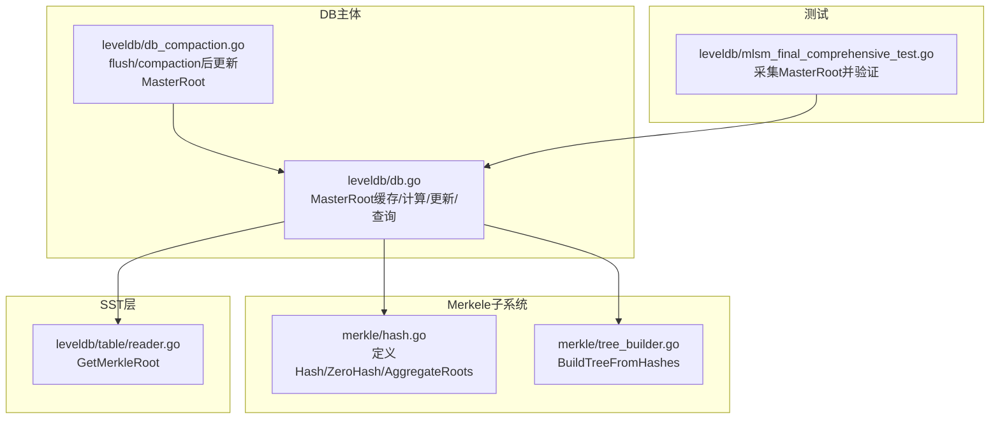
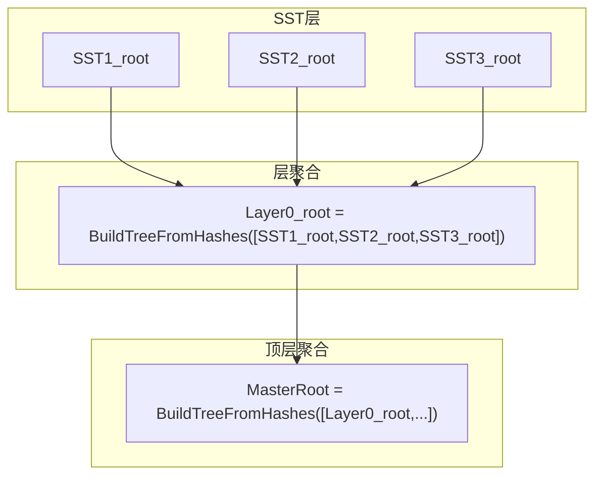
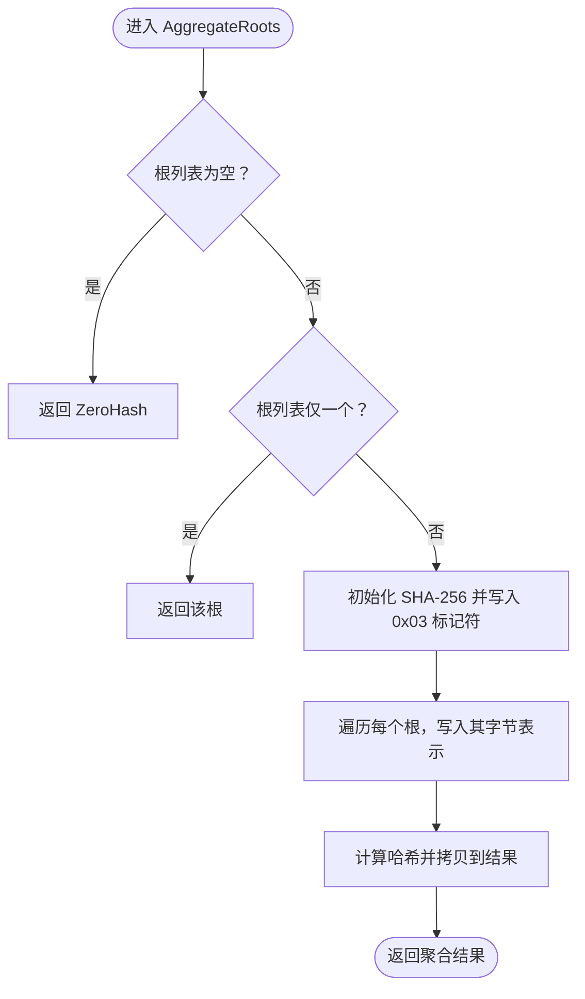
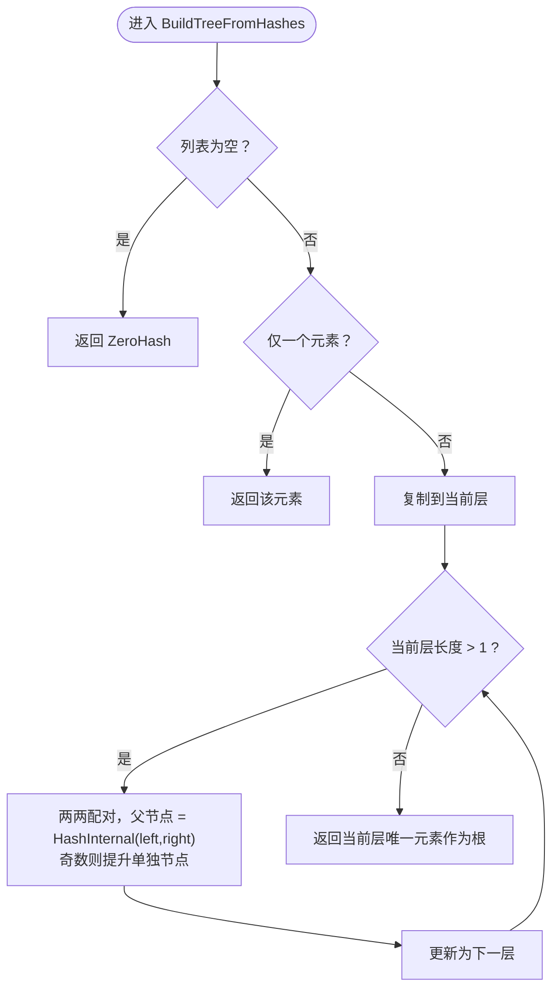
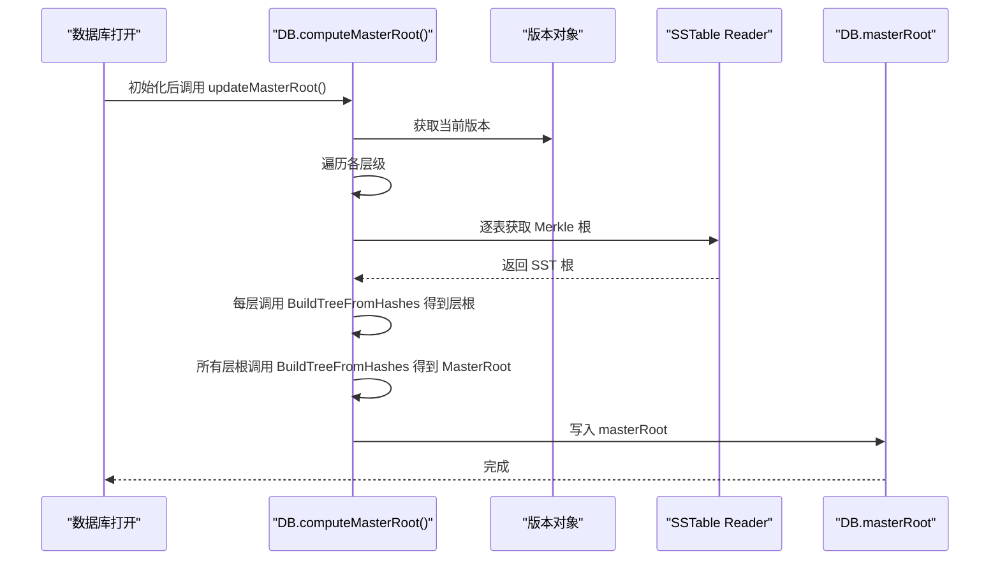
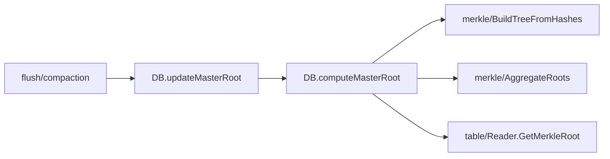
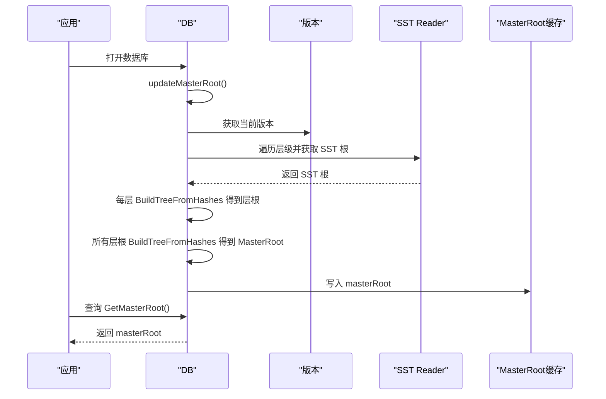

# MasterRoot聚合计算

<cite>
**本文引用的文件**
- [leveldb/merkle/hash.go](file://leveldb/merkle/hash.go)
- [leveldb/merkle/tree_builder.go](file://leveldb/merkle/tree_builder.go)
- [leveldb/db.go](file://leveldb/db.go)
- [leveldb/db_compaction.go](file://leveldb/db_compaction.go)
- [leveldb/table/reader.go](file://leveldb/table/reader.go)
- [leveldb/mlsm_final_comprehensive_test.go](file://leveldb/mlsm_final_comprehensive_test.go)
</cite>

## 目录
1. [简介](#简介)
2. [项目结构](#项目结构)
3. [核心组件](#核心组件)
4. [架构总览](#架构总览)
5. [详细组件分析](#详细组件分析)
6. [依赖关系分析](#依赖关系分析)
7. [性能考量](#性能考量)
8. [故障排查指南](#故障排查指南)
9. [结论](#结论)
10. [附录](#附录)

## 简介
本文件围绕 avccDB 的 MasterRoot 聚合机制进行系统化文档化，重点阐述如何将内存数据库与各级 SSTable 的 Merkle 根哈希聚合成最终的 MasterRoot。文档聚焦以下内容：
- AggregateRoots 函数的确定性聚合过程：使用 0x03 标记符与 SHA-256 哈希算法，按顺序连接多个 Merkle 根并输出统一的 MasterRoot。
- 边界条件处理：空根列表返回零哈希、单根直接返回、多根按序连接。
- 在数据库启动与状态变更（如 flush/compaction）时的 MasterRoot 更新流程。
- MasterRoot 在数据库整体状态一致性验证中的关键作用，以及如何与 SST 层、层间树构建、以及上层查询路径协同工作。

## 项目结构
与 MasterRoot 聚合直接相关的模块主要分布在 merkle 子系统与 DB 主体逻辑中：
- merkle/hash.go：定义 Hash 类型、常量、基础哈希工具与 AggregateRoots 聚合函数。
- merkle/tree_builder.go：提供从哈希列表构建平衡二叉 Merkle 树的工具函数 BuildTreeFromHashes。
- leveldb/db.go：DB 的 MasterRoot 缓存、计算与更新逻辑，以及对外暴露的 GetMasterRoot 接口。
- leveldb/db_compaction.go：在 flush/compaction 后触发 MasterRoot 更新。
- leveldb/table/reader.go：SSTable 层的 Merkle 根获取接口，用于收集各层 SST 的根。
- leveldb/mlsm_final_comprehensive_test.go：端到端测试中对 MasterRoot 的采集与一致性校验。

图表来源
- [leveldb/merkle/hash.go](file://leveldb/merkle/hash.go#L1-L152)
- [leveldb/merkle/tree_builder.go](file://leveldb/merkle/tree_builder.go#L144-L201)
- [leveldb/db.go](file://leveldb/db.go#L1479-L1571)
- [leveldb/db_compaction.go](file://leveldb/db_compaction.go#L327-L340)
- [leveldb/table/reader.go](file://leveldb/table/reader.go#L1106-L1126)
- [leveldb/mlsm_final_comprehensive_test.go](file://leveldb/mlsm_final_comprehensive_test.go#L118-L234)

章节来源
- [leveldb/merkle/hash.go](file://leveldb/merkle/hash.go#L1-L152)
- [leveldb/merkle/tree_builder.go](file://leveldb/merkle/tree_builder.go#L144-L201)
- [leveldb/db.go](file://leveldb/db.go#L1479-L1571)
- [leveldb/db_compaction.go](file://leveldb/db_compaction.go#L327-L340)
- [leveldb/table/reader.go](file://leveldb/table/reader.go#L1106-L1126)
- [leveldb/mlsm_final_comprehensive_test.go](file://leveldb/mlsm_final_comprehensive_test.go#L118-L234)

## 核心组件
- Hash 与 ZeroHash：定义 32 字节哈希类型与全零哈希常量，作为聚合与边界条件的基础。
- AggregateRoots：对多个 Merkle 根进行确定性聚合，格式为 Hash(0x03 || root1 || ... || rootN)，用于顶层 MasterRoot 的直接聚合。
- BuildTreeFromHashes：从哈希列表构建平衡二叉 Merkle 树，用于层内（SST 根到层根）与顶层（层根到 MasterRoot）的树形聚合。
- DB.MasterRoot 缓存与计算：维护全局 MasterRoot，提供只读查询接口；在数据库打开、flush、compaction 后更新。
- SST 层根获取：通过 Reader.GetMerkleRoot 获取各 SST 的 Merkle 根，供层聚合使用。

章节来源
- [leveldb/merkle/hash.go](file://leveldb/merkle/hash.go#L1-L152)
- [leveldb/merkle/tree_builder.go](file://leveldb/merkle/tree_builder.go#L144-L201)
- [leveldb/db.go](file://leveldb/db.go#L89-L98)
- [leveldb/db.go](file://leveldb/db.go#L1479-L1571)
- [leveldb/table/reader.go](file://leveldb/table/reader.go#L1106-L1126)

## 架构总览
MasterRoot 的生成遵循三层聚合模型：
- SST 层：每个 SST 文件拥有独立的 Merkle 树，其根为 SST 根。
- 层层聚合：同一层级内的所有 SST 根组成一个列表，使用 BuildTreeFromHashes 构建该层的层根。
- 顶层聚合：所有层根组成列表，再次使用 BuildTreeFromHashes 构建最终的 MasterRoot。

图表来源
- [leveldb/db.go](file://leveldb/db.go#L1494-L1560)
- [leveldb/merkle/tree_builder.go](file://leveldb/merkle/tree_builder.go#L144-L201)

## 详细组件分析

### AggregateRoots 函数：确定性聚合与边界条件
- 算法要点
  - 使用 SHA-256 哈希算法。
  - 采用 0x03 标记符作为聚合前缀，确保聚合输入与普通叶子/内部节点哈希格式可区分。
  - 对传入的 Merkle 根按顺序拼接，形成确定性的输入序列，保证相同输入顺序产生相同输出。
- 边界条件
  - 空根列表：返回 ZeroHash。
  - 单根：直接返回该根。
  - 多根：按顺序写入每个根，最后输出聚合结果。
- 复杂度
  - 时间复杂度 O(N)，N 为根数量。
  - 空间复杂度 O(1)（除输入外）。

图表来源
- [leveldb/merkle/hash.go](file://leveldb/merkle/hash.go#L127-L152)

章节来源
- [leveldb/merkle/hash.go](file://leveldb/merkle/hash.go#L127-L152)

### BuildTreeFromHashes：树形聚合（层内与顶层）
- 用途
  - 将一组哈希（SST 根或层根）作为叶节点，自底向上构建平衡二叉树，得到该层或顶层的根。
- 行为
  - 空列表：返回 ZeroHash。
  - 单元素：直接返回该元素。
  - 多元素：两两配对，内部节点哈希使用 HashInternal(left, right) 格式，奇数个时将最后一个提升到上一层。
- 复杂度
  - 时间复杂度 O(N)（仅需线性次合并），空间复杂度 O(N)（当前层临时数组）。

图表来源
- [leveldb/merkle/tree_builder.go](file://leveldb/merkle/tree_builder.go#L153-L187)

章节来源
- [leveldb/merkle/tree_builder.go](file://leveldb/merkle/tree_builder.go#L153-L187)

### DB.MasterRoot：缓存、计算与更新
- 缓存字段
  - masterRoot：全局 MasterRoot 哈希。
  - masterRootMu：读写锁，保护并发访问。
- 计算流程
  - 遍历当前版本的所有层级，收集每层的 SST 根，若某层无 SST，则跳过。
  - 对每层的 SST 根列表调用 BuildTreeFromHashes 得到层根。
  - 将所有层根列表再次调用 BuildTreeFromHashes，得到最终 MasterRoot。
- 更新时机
  - 数据库打开后立即计算一次。
  - flush 或 compaction 完成后调用 updateMasterRoot 触发重新计算。
- 查询接口
  - GetMasterRoot 提供只读访问，内部加读锁返回缓存值。

图表来源
- [leveldb/db.go](file://leveldb/db.go#L168-L171)
- [leveldb/db.go](file://leveldb/db.go#L1479-L1571)
- [leveldb/table/reader.go](file://leveldb/table/reader.go#L1106-L1126)

章节来源
- [leveldb/db.go](file://leveldb/db.go#L89-L98)
- [leveldb/db.go](file://leveldb/db.go#L1479-L1571)
- [leveldb/db_compaction.go](file://leveldb/db_compaction.go#L327-L340)
- [leveldb/table/reader.go](file://leveldb/table/reader.go#L1106-L1126)

### MasterRoot 在查询与证明中的作用
- 查询增强：当从 SST 层获取到的证明存在时，会结合当前 MasterRoot 生成更高层的组合证明，确保跨层一致性。
- 一致性验证：客户端可使用 MasterRoot 与查询返回的证明共同验证数据完整性与一致性。

章节来源
- [leveldb/db.go](file://leveldb/db.go#L884-L932)

## 依赖关系分析
- DB 依赖 merkle/hash.go 与 merkle/tree_builder.go 进行聚合与树构建。
- DB 通过 table/reader.go 获取 SST 的 Merkle 根，再进行层聚合与顶层聚合。
- flush/compaction 后由 DB 主动调用 updateMasterRoot 更新缓存，避免后续查询使用过期 MasterRoot。

图表来源
- [leveldb/db.go](file://leveldb/db.go#L1494-L1571)
- [leveldb/merkle/tree_builder.go](file://leveldb/merkle/tree_builder.go#L153-L187)
- [leveldb/merkle/hash.go](file://leveldb/merkle/hash.go#L127-L152)
- [leveldb/table/reader.go](file://leveldb/table/reader.go#L1106-L1126)
- [leveldb/db_compaction.go](file://leveldb/db_compaction.go#L327-L340)

章节来源
- [leveldb/db.go](file://leveldb/db.go#L1494-L1571)
- [leveldb/merkle/tree_builder.go](file://leveldb/merkle/tree_builder.go#L153-L187)
- [leveldb/merkle/hash.go](file://leveldb/merkle/hash.go#L127-L152)
- [leveldb/table/reader.go](file://leveldb/table/reader.go#L1106-L1126)
- [leveldb/db_compaction.go](file://leveldb/db_compaction.go#L327-L340)

## 性能考量
- 聚合复杂度
  - AggregateRoots：O(N) 时间，O(1) 额外空间。
  - BuildTreeFromHashes：O(N) 时间，O(N) 额外空间（当前层临时数组）。
- 并发与缓存
  - MasterRoot 使用读写锁保护，读操作无需阻塞其他读；写操作仅在更新时持有写锁。
- 更新频率
  - flush/compaction 后才更新，避免频繁重算；数据库打开时一次性计算，后续复用。

## 故障排查指南
- MasterRoot 未更新
  - 确认是否在 flush/compaction 后调用了 updateMasterRoot。
  - 检查 DB 是否处于关闭状态导致无法更新。
- 查询到的 MasterRoot 与预期不一致
  - 核对版本切换与 compaction 是否发生，确认 DB 已完成 updateMasterRoot。
  - 检查 SST 层是否启用 Merkle 树，确保 Reader.GetMerkleRoot 可返回有效根。
- 一致性验证失败
  - 使用 GetMasterRoot 获取当前 MasterRoot，结合查询返回的证明进行验证。
  - 若使用组合证明，确认上层证明与 MasterRoot 的组合逻辑正确。

章节来源
- [leveldb/db_compaction.go](file://leveldb/db_compaction.go#L327-L340)
- [leveldb/db.go](file://leveldb/db.go#L1479-L1571)
- [leveldb/table/reader.go](file://leveldb/table/reader.go#L1106-L1126)

## 结论
MasterRoot 聚合机制通过分层树形聚合与确定性哈希策略，实现了对数据库整体状态的一致性摘要。AggregateRoots 提供了顶层直接聚合能力，而 BuildTreeFromHashes 则承担了层内与顶层的树形聚合职责。DB 在关键状态变更点自动更新 MasterRoot，配合查询路径上的证明增强，为上层应用提供了可靠的状态一致性保障。

## 附录

### 如何调用聚合函数
- 直接聚合多个 Merkle 根（顶层）
  - 调用位置参考：[leveldb/merkle/hash.go](file://leveldb/merkle/hash.go#L127-L152)
- 从哈希列表构建层根或顶层根
  - 调用位置参考：[leveldb/merkle/tree_builder.go](file://leveldb/merkle/tree_builder.go#L153-L187)
- 获取当前 MasterRoot
  - 调用位置参考：[leveldb/db.go](file://leveldb/db.go#L1479-L1489)

### 时序图：数据库启动与状态变更时的聚合流程

图表来源
- [leveldb/db.go](file://leveldb/db.go#L168-L171)
- [leveldb/db.go](file://leveldb/db.go#L1479-L1571)
- [leveldb/table/reader.go](file://leveldb/table/reader.go#L1106-L1126)