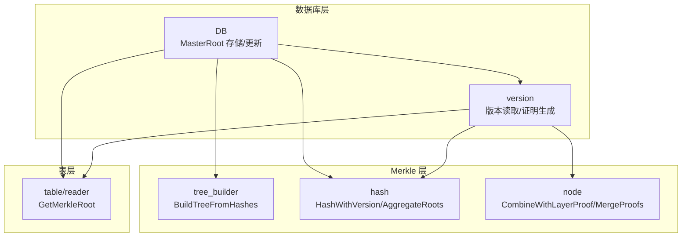
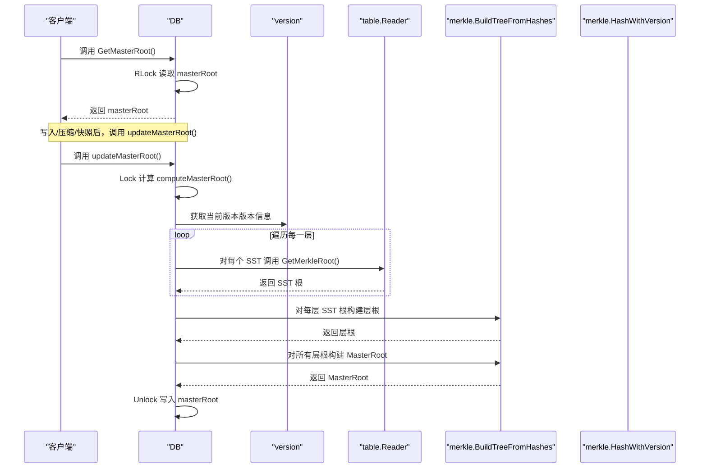
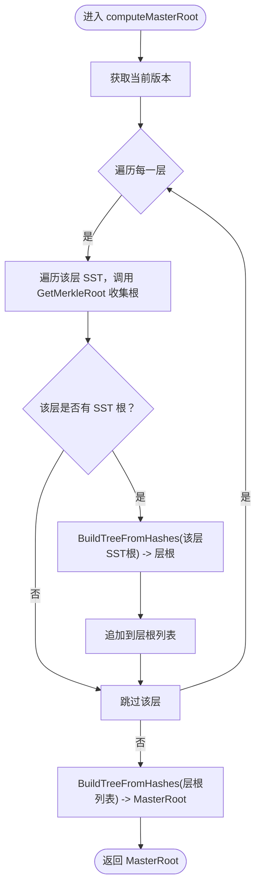
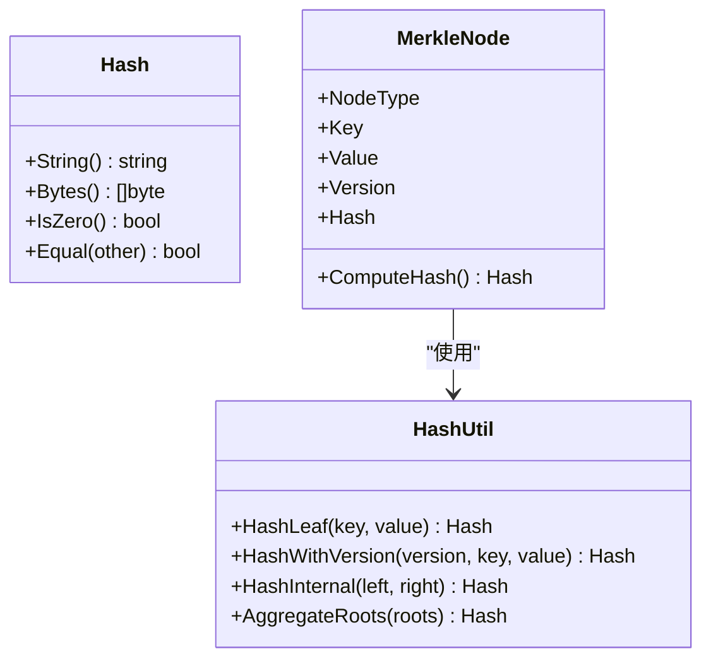
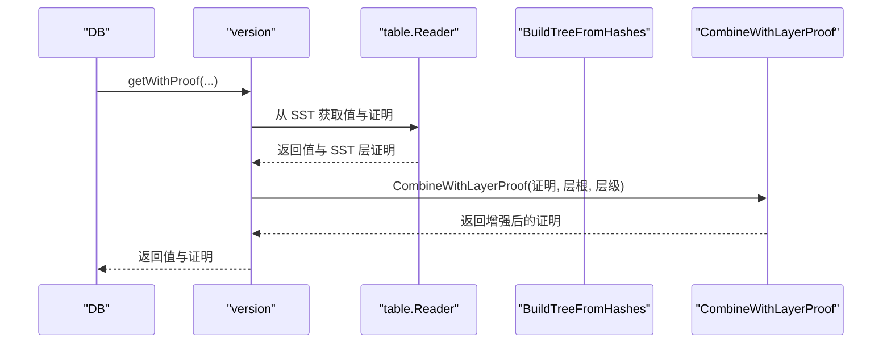
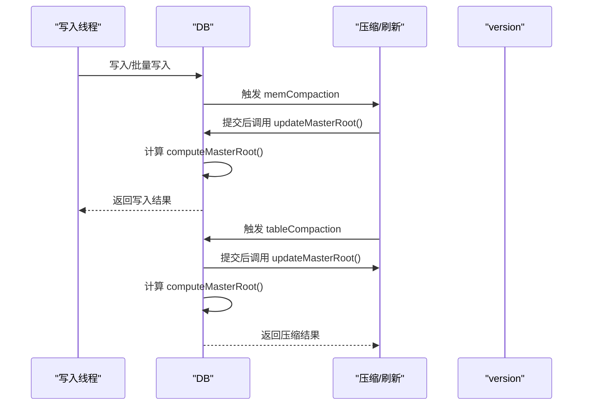
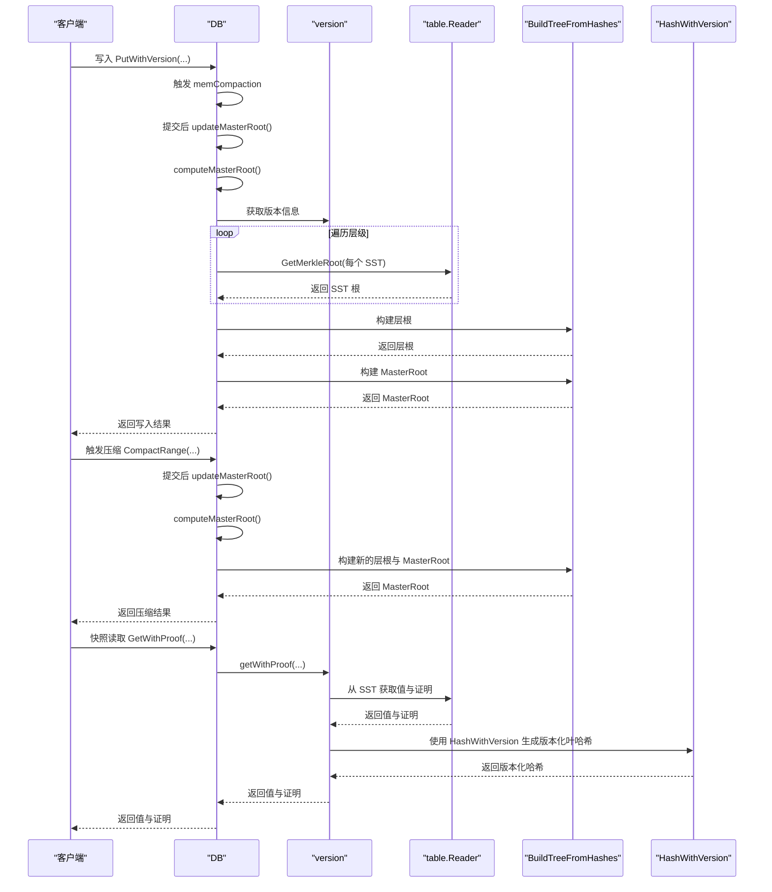
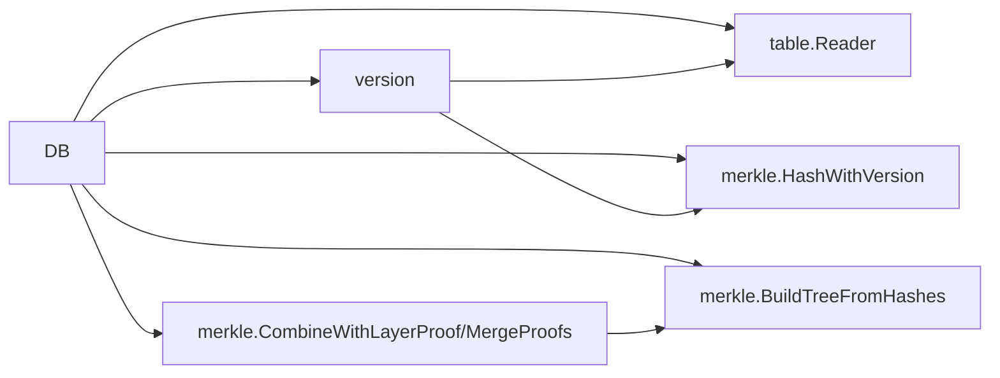

# MasterRoot计算

<cite>
**本文引用的文件**
- [leveldb/db.go](file://leveldb/db.go)
- [leveldb/db_compaction.go](file://leveldb/db_compaction.go)
- [leveldb/version.go](file://leveldb/version.go)
- [leveldb/table/reader.go](file://leveldb/table/reader.go)
- [leveldb/merkle/hash.go](file://leveldb/merkle/hash.go)
- [leveldb/merkle/tree_builder.go](file://leveldb/merkle/tree_builder.go)
- [leveldb/merkle/node.go](file://leveldb/merkle/node.go)
- [leveldb/mlsm_final_comprehensive_test.go](file://leveldb/mlsm_final_comprehensive_test.go)
</cite>

## 目录
1. [引言](#引言)
2. [项目结构](#项目结构)
3. [核心组件](#核心组件)
4. [架构总览](#架构总览)
5. [详细组件分析](#详细组件分析)
6. [依赖关系分析](#依赖关系分析)
7. [性能考虑](#性能考虑)
8. [故障排查指南](#故障排查指南)
9. [结论](#结论)
10. [附录](#附录)

## 引言
本文件围绕 avccDB 的 MasterRoot 计算机制展开，系统阐述如何从内存数据库与各级 SSTable 的 Merkle 根出发，通过分层聚合构建出全局的 MasterRoot，并说明在写入、压缩与快照等关键操作后的更新时机与一致性保障。同时，结合 HashWithVersion 函数对版本信息的处理，解释 MasterRoot 如何准确反映数据库的版本化状态。

## 项目结构
- 数据库核心位于 leveldb/db.go，包含 MasterRoot 的存储、读取与更新逻辑。
- 分层聚合算法位于 leveldb/merkle/tree_builder.go，提供从一组叶子哈希构建平衡二叉树的方法。
- 表级 Merkle 根获取位于 leveldb/table/reader.go，提供从 SSTable 中读取 Merkle 根的能力。
- 版本化哈希与证明合并位于 leveldb/merkle/hash.go 与 leveldb/merkle/node.go，分别负责哈希格式与跨层证明组合。
- 版本管理与读取路径位于 leveldb/version.go，体现版本化查询与证明生成的协作。
- 综合测试位于 leveldb/mlsm_final_comprehensive_test.go，验证 MasterRoot 在写入、压缩与证明生成过程中的行为。

图表来源
- [leveldb/db.go](file://leveldb/db.go#L1479-L1560)
- [leveldb/version.go](file://leveldb/version.go#L287-L429)
- [leveldb/merkle/tree_builder.go](file://leveldb/merkle/tree_builder.go#L153-L187)
- [leveldb/merkle/hash.go](file://leveldb/merkle/hash.go#L92-L105)
- [leveldb/merkle/node.go](file://leveldb/merkle/node.go#L299-L369)
- [leveldb/table/reader.go](file://leveldb/table/reader.go#L1106-L1126)

章节来源
- [leveldb/db.go](file://leveldb/db.go#L1479-L1560)
- [leveldb/version.go](file://leveldb/version.go#L287-L429)
- [leveldb/merkle/tree_builder.go](file://leveldb/merkle/tree_builder.go#L153-L187)
- [leveldb/merkle/hash.go](file://leveldb/merkle/hash.go#L92-L105)
- [leveldb/merkle/node.go](file://leveldb/merkle/node.go#L299-L369)
- [leveldb/table/reader.go](file://leveldb/table/reader.go#L1106-L1126)

## 核心组件
- MasterRoot 字段与锁
  - DB 结构体中包含 masterRoot 与 masterRootMu，用于并发安全地保存与读取全局 Merkle 根。
- MasterRoot 读取接口
  - GetMasterRoot 提供只读访问，内部使用 RWMutex 保护。
- MasterRoot 更新接口
  - updateMasterRoot 在持有互斥锁的情况下调用 computeMasterRoot 并写入新值。
- MasterRoot 计算
  - computeMasterRoot 从当前版本的多级 SSTable 收集每层的 SST 根，先按层构建层根，再将所有层根作为叶子构建 MasterRoot。
- 表级 Merkle 根获取
  - table/reader 提供 GetMerkleRoot，从 SSTable 中加载 Merkle 树元数据并返回根哈希。
- 分层聚合
  - tree_builder.BuildTreeFromHashes 将一组哈希作为叶子节点，自底向上构建平衡二叉树，得到层根或 MasterRoot。
- 版本化哈希
  - hash.HashWithVersion 在叶子哈希中嵌入版本号，确保不同版本的数据产生不同的叶哈希，从而影响上层聚合结果。
- 跨层证明组合
  - node.CombineWithLayerProof 将下层证明与层根聚合，形成更高层的证明；MergeProofs 支持多层证明合并。

章节来源
- [leveldb/db.go](file://leveldb/db.go#L89-L98)
- [leveldb/db.go](file://leveldb/db.go#L1479-L1560)
- [leveldb/table/reader.go](file://leveldb/table/reader.go#L1106-L1126)
- [leveldb/merkle/tree_builder.go](file://leveldb/merkle/tree_builder.go#L153-L187)
- [leveldb/merkle/hash.go](file://leveldb/merkle/hash.go#L92-L105)
- [leveldb/merkle/node.go](file://leveldb/merkle/node.go#L299-L369)

## 架构总览
MasterRoot 的计算遵循三层结构：
- SST 层：每个 SSTable 拥有自己的 Merkle 树根。
- 层层聚合：同一层级的所有 SST 根组成一个列表，通过 BuildTreeFromHashes 构建该层的层根。
- 主聚合：将所有层根作为叶子，再次通过 BuildTreeFromHashes 构建 MasterRoot。

图表来源
- [leveldb/db.go](file://leveldb/db.go#L1479-L1560)
- [leveldb/version.go](file://leveldb/version.go#L287-L429)
- [leveldb/table/reader.go](file://leveldb/table/reader.go#L1106-L1126)
- [leveldb/merkle/tree_builder.go](file://leveldb/merkle/tree_builder.go#L153-L187)

## 详细组件分析

### computeMasterRoot 与 updateMasterRoot
- computeMasterRoot
  - 从当前版本对象遍历各层级，收集每层 SST 的 Merkle 根。
  - 对每层的 SST 根调用 BuildTreeFromHashes 得到层根。
  - 将所有层根作为叶子，再次调用 BuildTreeFromHashes 得到 MasterRoot。
  - 当前实现注释指出：MemDB 根暂未集成，因此 MasterRoot 由 SST 层聚合构成。
- updateMasterRoot
  - 在互斥锁保护下调用 computeMasterRoot 并写入新值，随后记录日志。

图表来源
- [leveldb/db.go](file://leveldb/db.go#L1491-L1560)
- [leveldb/table/reader.go](file://leveldb/table/reader.go#L1106-L1126)
- [leveldb/merkle/tree_builder.go](file://leveldb/merkle/tree_builder.go#L153-L187)

章节来源
- [leveldb/db.go](file://leveldb/db.go#L1491-L1560)

### HashWithVersion 与版本化哈希
- HashWithVersion
  - 在叶子哈希中加入版本号字段，确保相同键的不同版本产生不同的叶哈希。
  - 这直接影响上层内部节点与层根、MasterRoot 的计算结果，使 MasterRoot 能够准确反映版本化状态。
- MerkleNode.ComputeHash
  - 当节点版本大于 0 时，使用 HashWithVersion；否则使用普通 HashLeaf。
- 版本化查询与证明
  - version.getWithProof 与 version.getVersionHistory 在读取时会考虑版本范围，配合 HashWithVersion 保证查询与证明的正确性。

图表来源
- [leveldb/merkle/hash.go](file://leveldb/merkle/hash.go#L92-L105)
- [leveldb/merkle/hash.go](file://leveldb/merkle/hash.go#L127-L152)
- [leveldb/merkle/node.go](file://leveldb/merkle/node.go#L49-L64)

章节来源
- [leveldb/merkle/hash.go](file://leveldb/merkle/hash.go#L92-L105)
- [leveldb/merkle/node.go](file://leveldb/merkle/node.go#L49-L64)
- [leveldb/version.go](file://leveldb/version.go#L287-L429)

### 分层聚合与跨层证明
- BuildTreeFromHashes
  - 将一组哈希作为叶子，自底向上两两聚合，构造平衡二叉树，得到上层根。
- CombineWithLayerProof
  - 将下层证明与层根聚合，形成更高层的证明结构，便于跨层验证。
- MergeProofs
  - 将来自不同层的证明合并为单一证明，支持多层数据源的联合校验。

图表来源
- [leveldb/version.go](file://leveldb/version.go#L287-L429)
- [leveldb/merkle/node.go](file://leveldb/merkle/node.go#L347-L369)
- [leveldb/table/reader.go](file://leveldb/table/reader.go#L1106-L1126)

章节来源
- [leveldb/merkle/tree_builder.go](file://leveldb/merkle/tree_builder.go#L153-L187)
- [leveldb/merkle/node.go](file://leveldb/merkle/node.go#L299-L369)

### 写入、压缩与快照后的更新时机与一致性
- 写入与刷新
  - memCompaction 在提交后调用 updateMasterRoot，确保 MemDB 刷新到磁盘后 MasterRoot 更新。
- 压缩
  - tableCompaction 在提交后调用 updateMasterRoot，保证压缩完成后 MasterRoot 反映新的层级分布。
- 快照
  - 快照期间读取的是某一时刻的版本，MasterRoot 本身不随快照改变；但快照读取路径会结合 MasterRoot 生成跨层证明。
- 一致性保障
  - updateMasterRoot 使用互斥锁保护，避免并发更新导致的中间态。
  - GetMasterRoot 使用读锁，保证读取时不会被更新中断。

图表来源
- [leveldb/db_compaction.go](file://leveldb/db_compaction.go#L339-L341)
- [leveldb/db_compaction.go](file://leveldb/db_compaction.go#L627-L629)
- [leveldb/db.go](file://leveldb/db.go#L1562-L1571)

章节来源
- [leveldb/db_compaction.go](file://leveldb/db_compaction.go#L339-L341)
- [leveldb/db_compaction.go](file://leveldb/db_compaction.go#L627-L629)
- [leveldb/db.go](file://leveldb/db.go#L1562-L1571)

### MasterRoot 计算时序图（综合场景）
以下时序图展示了写入、压缩与快照等关键操作后 MasterRoot 的更新流程，以及版本化哈希对最终结果的影响。

图表来源
- [leveldb/db.go](file://leveldb/db.go#L1479-L1560)
- [leveldb/db_compaction.go](file://leveldb/db_compaction.go#L339-L341)
- [leveldb/db_compaction.go](file://leveldb/db_compaction.go#L627-L629)
- [leveldb/version.go](file://leveldb/version.go#L287-L429)
- [leveldb/table/reader.go](file://leveldb/table/reader.go#L1106-L1126)
- [leveldb/merkle/hash.go](file://leveldb/merkle/hash.go#L92-L105)

## 依赖关系分析
- DB 依赖
  - version：提供当前版本的层级结构与读取路径。
  - table.Reader：提供 SST 根哈希获取能力。
  - merkle.BuildTreeFromHashes：构建层根与 MasterRoot。
  - merkle.HashWithVersion：版本化哈希计算。
  - merkle.CombineWithLayerProof/MergeProofs：跨层证明组合。
- 版本读取与证明
  - version.getWithProof 与 version.getVersionHistory 协作，结合 HashWithVersion 与 SST 根，生成或验证版本化证明。
- 测试验证
  - mlsm_final_comprehensive_test 通过多次 GetMasterRoot 比较，验证写入与压缩后 MasterRoot 的一致性变化。

图表来源
- [leveldb/db.go](file://leveldb/db.go#L1479-L1560)
- [leveldb/version.go](file://leveldb/version.go#L287-L429)
- [leveldb/table/reader.go](file://leveldb/table/reader.go#L1106-L1126)
- [leveldb/merkle/tree_builder.go](file://leveldb/merkle/tree_builder.go#L153-L187)
- [leveldb/merkle/hash.go](file://leveldb/merkle/hash.go#L92-L105)
- [leveldb/merkle/node.go](file://leveldb/merkle/node.go#L299-L369)

章节来源
- [leveldb/db.go](file://leveldb/db.go#L1479-L1560)
- [leveldb/version.go](file://leveldb/version.go#L287-L429)
- [leveldb/mlsm_final_comprehensive_test.go](file://leveldb/mlsm_final_comprehensive_test.go#L150-L234)

## 性能考虑
- 分层聚合复杂度
  - BuildTreeFromHashes 对 n 个叶子的聚合复杂度为 O(n)，每层构建与顶层聚合均为线性级。
- 并发控制
  - updateMasterRoot 使用互斥锁，GetMasterRoot 使用读锁，避免频繁更新带来的锁竞争。
- SST 根获取
  - table.Reader.GetMerkleRoot 仅在启用 Merkle 时返回根，未启用时返回空值，避免无效计算。
- 版本化哈希
  - HashWithVersion 在叶哈希中加入版本号，增加少量开销，但确保 MasterRoot 能准确反映版本状态。

## 故障排查指南
- MasterRoot 未更新
  - 检查是否在压缩或刷新后调用了 updateMasterRoot。
  - 确认 DB.masterRootMu 锁未被长时间占用。
- 版本化查询异常
  - 确认 HashWithVersion 正确参与叶哈希计算。
  - 检查 version.getWithProof 与 version.getVersionHistory 的版本解析逻辑。
- 证明不一致
  - 确认 CombineWithLayerProof 与 MergeProofs 的使用是否正确。
  - 核对 SST 根哈希是否正确加载。

章节来源
- [leveldb/db.go](file://leveldb/db.go#L1562-L1571)
- [leveldb/version.go](file://leveldb/version.go#L287-L429)
- [leveldb/merkle/node.go](file://leveldb/merkle/node.go#L299-L369)

## 结论
avccDB 的 MasterRoot 计算通过“SST 根 → 层根 → MasterRoot”的三层聚合策略，结合版本化哈希 HashWithVersion，实现了对数据库整体状态的可验证摘要。写入、压缩与快照等关键操作均在提交后触发 MasterRoot 更新，配合读锁与互斥锁保障了并发安全性与一致性。测试用例进一步验证了 MasterRoot 在不同操作场景下的稳定性与正确性。

## 附录
- 关键接口与路径
  - GetMasterRoot：读取 MasterRoot
  - updateMasterRoot：更新 MasterRoot
  - computeMasterRoot：计算 MasterRoot
  - GetMerkleRoot：获取 SST 根
  - BuildTreeFromHashes：分层聚合
  - HashWithVersion：版本化哈希
  - CombineWithLayerProof/MergeProofs：跨层证明组合