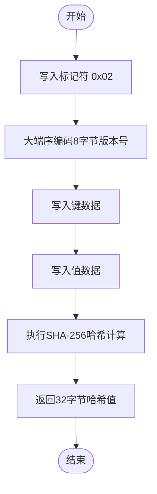
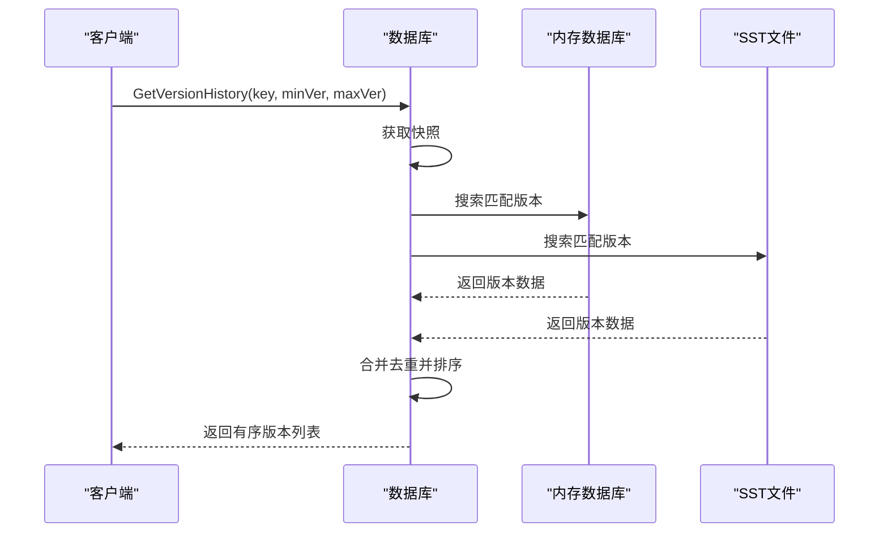
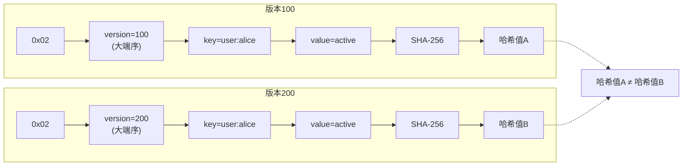

# 版本化哈希计算

<cite>
**本文档引用的文件**   
- [hash.go](file://leveldb/merkle/hash.go#L91-L105)
- [node.go](file://leveldb/merkle/node.go#L57)
- [db_write.go](file://leveldb/db_write.go#L386-L432)
- [batch.go](file://leveldb/batch.go#L145-L148)
- [db.go](file://leveldb/db.go#L1175-L1184)
</cite>

## 目录
1. [简介](#简介)
2. [版本化哈希计算机制](#版本化哈希计算机制)
3. [核心函数分析](#核心函数分析)
4. [版本化哈希的应用](#版本化哈希的应用)
5. [代码示例与对比](#代码示例与对比)
6. [结论](#结论)

## 简介
avccDB的版本化哈希计算机制是一种创新的数据完整性验证方案，通过将版本信息整合到哈希计算过程中，实现了对数据历史状态的精确溯源和防篡改验证。该机制在传统的键值哈希基础上，引入了版本号作为计算因子，确保相同键值在不同版本下产生不同的哈希值，从而为区块链、审计日志等需要版本控制的应用场景提供了强大的技术支持。

## 版本化哈希计算机制
版本化哈希计算机制的核心思想是将数据的版本信息作为哈希计算的输入参数之一，从而生成与特定版本绑定的唯一哈希值。这种设计打破了传统哈希函数仅基于键值数据计算的局限性，实现了版本感知的完整性验证。

该机制采用SHA-256作为基础哈希算法，通过特定的数据编码格式将版本信息无缝集成到哈希计算流程中。具体而言，版本化哈希的计算过程遵循以下格式：`Hash(0x02 || version || key || value)`，其中：
- `0x02` 是版本化哈希的标记符，用于区分不同类型的哈希计算
- `version` 是8字节的大端序编码版本号
- `key` 和 `value` 分别是键和值的原始数据

这种设计确保了即使键值数据完全相同，只要版本号不同，生成的哈希值也会完全不同，从而实现了版本隔离和精确溯源。

## 核心函数分析
### HashWithVersion函数
`HashWithVersion`函数是版本化哈希计算的核心实现，负责将版本信息整合到数据完整性验证过程中。该函数的实现细节体现了精心设计的数据编码策略和安全考量。

函数首先写入`0x02`标记符，标识这是一个版本化哈希计算。随后，将8字节的版本号以大端序格式编码并写入哈希上下文。大端序编码的选择确保了跨平台的一致性，避免了字节序差异导致的哈希值不一致问题。最后，函数将键值数据按顺序写入，完成完整的哈希计算流程。

这种分层的编码结构不仅保证了数据的完整性，还提供了清晰的语义区分。不同的标记符（如`0x00`用于普通叶节点，`0x01`用于内部节点，`0x02`用于版本化节点）形成了一个类型安全的哈希计算体系，防止了不同数据类型的哈希值冲突。

**图表来源**
- [hash.go](file://leveldb/merkle/hash.go#L91-L105)

**本节来源**
- [hash.go](file://leveldb/merkle/hash.go#L91-L105)

## 版本化哈希的应用
### PutWithVersion操作
`PutWithVersion`操作是版本化哈希机制在数据写入层面的具体应用。该操作允许为相同的键设置不同版本的值，实现了多版本并发控制（MVCC）的核心功能。当调用`PutWithVersion`时，系统会创建一个包含版本信息的内部键，确保不同版本的数据能够被正确存储和检索。

在实现层面，`PutWithVersion`不仅处理数据的持久化，还负责维护版本化哈希的一致性。每次写入操作都会触发相应的哈希计算，更新Merkle树的结构，确保数据库的整体完整性状态得到及时反映。

### 历史版本查询
历史版本查询功能是版本化哈希机制的重要应用场景。通过`GetVersionHistory`接口，用户可以查询指定键在特定版本范围内的所有历史记录。该功能依赖于版本化哈希提供的精确版本标识，能够高效地检索和验证数据的历史状态。

查询过程首先获取数据库的快照，然后在快照上下文中搜索指定版本范围内的所有匹配项。系统会收集来自内存数据库（MemDB）和SST文件的所有版本数据，合并去重后按版本号升序排列返回。这种设计确保了查询结果的完整性和一致性，为数据溯源提供了可靠的基础。

**图表来源**
- [db.go](file://leveldb/db.go#L1175-L1184)
- [db_write.go](file://leveldb/db_write.go#L386-L432)

**本节来源**
- [db.go](file://leveldb/db.go#L1175-L1184)
- [db_write.go](file://leveldb/db_write.go#L386-L432)

## 代码示例与对比
### 版本化哈希计算示例
以下示例展示了版本化哈希的计算过程。假设有相同的键值对`("user:alice", "active")`，在不同版本下的哈希计算会产生完全不同的结果：

### 普通哈希与版本化哈希对比
普通哈希仅基于键值数据计算，而版本化哈希将版本信息作为计算因子，这一根本差异导致了两者在应用场景上的显著区别。普通哈希适用于静态数据的完整性验证，而版本化哈希则专为动态、多版本的数据环境设计。

| 特性 | 普通哈希 | 版本化哈希 |
|------|---------|-----------|
| **输入参数** | 键、值 | 标记符、版本、键、值 |
| **版本支持** | 无 | 完整支持 |
| **溯源能力** | 有限 | 精确 |
| **防篡改** | 基础 | 增强 |
| **应用场景** | 静态数据验证 | 动态数据审计 |

**图表来源**
- [hash.go](file://leveldb/merkle/hash.go#L91-L105)

**本节来源**
- [hash.go](file://leveldb/merkle/hash.go#L91-L105)
- [batch.go](file://leveldb/batch.go#L145-L148)

## 结论
avccDB的版本化哈希计算机制通过创新地将版本信息整合到哈希计算过程中，为数据完整性验证提供了强大的技术支持。该机制不仅确保了相同键值在不同版本下产生不同的哈希值，还支持精确的版本溯源和防篡改验证。`HashWithVersion`函数的精心设计，结合`PutWithVersion`操作和`GetVersionHistory`查询功能，构建了一个完整的版本化数据管理生态系统。这一机制在区块链、金融交易、审计日志等需要严格数据完整性和历史追溯的应用场景中具有重要价值。