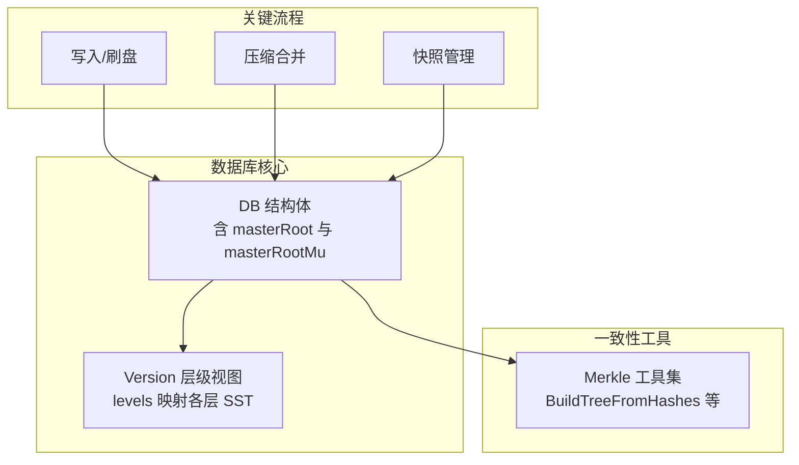
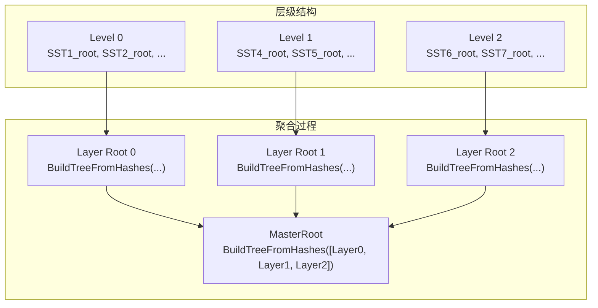
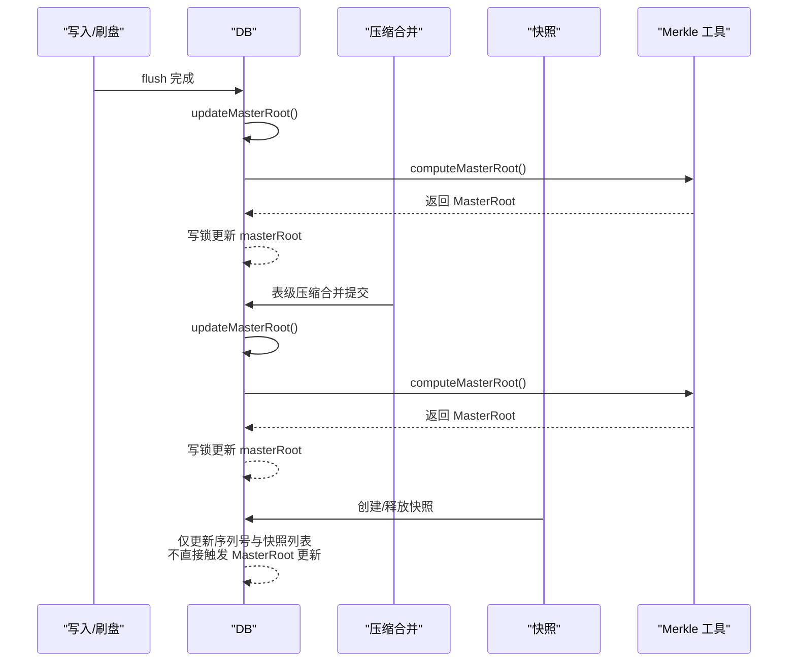
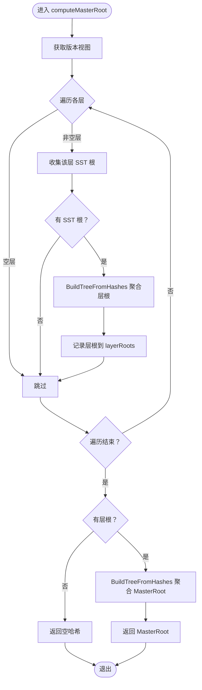
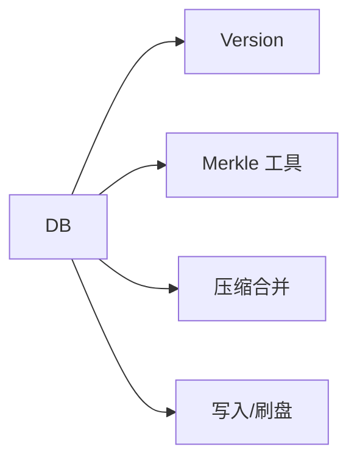
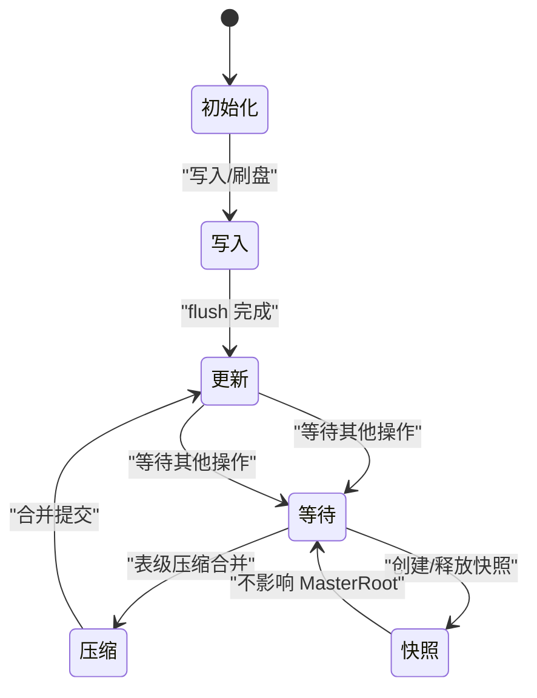

# 跨层级一致性维护

<cite>
**本文引用的文件**
- [leveldb/db.go](file://leveldb/db.go)
- [leveldb/db_compaction.go](file://leveldb/db_compaction.go)
- [leveldb/db_write.go](file://leveldb/db_write.go)
- [leveldb/db_snapshot.go](file://leveldb/db_snapshot.go)
- [leveldb/version.go](file://leveldb/version.go)
- [leveldb/merkle/hash.go](file://leveldb/merkle/hash.go)
- [leveldb/merkle/tree_builder.go](file://leveldb/merkle/tree_builder.go)
- [leveldb/mlsm_final_comprehensive_test.go](file://leveldb/mlsm_final_comprehensive_test.go)
</cite>

## 目录
1. [引言](#引言)
2. [项目结构](#项目结构)
3. [核心组件](#核心组件)
4. [架构总览](#架构总览)
5. [详细组件分析](#详细组件分析)
6. [依赖关系分析](#依赖关系分析)
7. [性能考量](#性能考量)
8. [故障排查指南](#故障排查指南)
9. [结论](#结论)
10. [附录](#附录)

## 引言
本文件围绕 avccDB 的跨层级一致性维护机制，系统阐述 MasterRoot 的生成与更新策略，重点解析 updateMasterRoot 方法在并发环境中的线程安全保障、computeMasterRoot 的分层聚合流程，以及在写入、压缩合并、快照创建等关键事件后的触发时机与一致性保证。同时提供状态转换图，帮助理解 MasterRoot 在不同数据库操作下的变更过程，并讨论其在分布式场景下的可验证性与一致性保障。

## 项目结构
本项目采用分层组织：核心数据库逻辑位于 leveldb 包，Merkle 树工具位于 merkle 子包，测试覆盖了跨层级一致性验证。与 MasterRoot 维护直接相关的模块包括：
- 数据库主入口与并发控制：leveldb/db.go
- 压缩合并流程：leveldb/db_compaction.go
- 写入与刷盘流程：leveldb/db_write.go
- 快照管理：leveldb/db_snapshot.go
- 版本与层级视图：leveldb/version.go
- Merkle 树构建与聚合：leveldb/merkle/*

图表来源
- [leveldb/db.go](file://leveldb/db.go#L89-L98)
- [leveldb/version.go](file://leveldb/version.go#L26-L43)
- [leveldb/merkle/tree_builder.go](file://leveldb/merkle/tree_builder.go#L153-L201)
- [leveldb/db_compaction.go](file://leveldb/db_compaction.go#L339-L341)
- [leveldb/db_write.go](file://leveldb/db_write.go#L66-L131)

章节来源
- [leveldb/db.go](file://leveldb/db.go#L89-L98)
- [leveldb/version.go](file://leveldb/version.go#L26-L43)

## 核心组件
- MasterRoot 字段与锁
  - DB 结构体中包含 masterRoot 与 masterRootMu（读写锁），用于保护 MasterRoot 的并发访问与更新。
- MasterRoot 获取接口
  - 提供 GetMasterRoot 方法，使用读锁安全返回当前 MasterRoot。
- MasterRoot 更新与计算
  - updateMasterRoot 使用写锁保护，内部调用 computeMasterRoot 重新聚合全库层级 Merkle 根。
  - computeMasterRoot 从版本视图遍历各层，收集每层 SST 的 Merkle 根，再逐层向上聚合，最终得到 MasterRoot。

章节来源
- [leveldb/db.go](file://leveldb/db.go#L89-L98)
- [leveldb/db.go](file://leveldb/db.go#L1480-L1571)
- [leveldb/db.go](file://leveldb/db.go#L1491-L1560)

## 架构总览
MasterRoot 的生成遵循“分层聚合”的三层结构：
- 层级一：每个 SST 文件拥有独立 Merkle 根（由表层操作获取）。
- 层级二：同一层内多个 SST 根组成 Merkle 树，形成层根。
- 层级三：所有层根组成 Merkle 树，形成 MasterRoot。

图表来源
- [leveldb/db.go](file://leveldb/db.go#L1491-L1560)
- [leveldb/merkle/tree_builder.go](file://leveldb/merkle/tree_builder.go#L153-L201)

## 详细组件分析

### updateMasterRoot 并发安全与调用时机
- 线程安全
  - updateMasterRoot 使用 masterRootMu 写锁保护，确保同一时刻仅有一个 goroutine 可以更新 MasterRoot，避免竞态。
- 触发时机
  - 写入路径：当内存表刷盘（flush）完成后，立即调用 updateMasterRoot，保证写入后的一致性。
  - 压缩合并路径：表级压缩合并提交后调用 updateMasterRoot，确保合并导致的数据结构变化反映到 MasterRoot。
  - 快照管理：快照创建与释放涉及序列号与存活快照列表的管理，但 MasterRoot 的更新并不直接在此处触发；MasterRoot 的更新主要由写入与压缩合并驱动。
- 初始化
  - 数据库打开时会调用一次 updateMasterRoot，确保初始状态一致。

图表来源
- [leveldb/db.go](file://leveldb/db.go#L168-L170)
- [leveldb/db.go](file://leveldb/db.go#L1562-L1571)
- [leveldb/db_compaction.go](file://leveldb/db_compaction.go#L339-L341)
- [leveldb/db_compaction.go](file://leveldb/db_compaction.go#L627-L629)
- [leveldb/db_write.go](file://leveldb/db_write.go#L66-L131)

章节来源
- [leveldb/db.go](file://leveldb/db.go#L168-L170)
- [leveldb/db.go](file://leveldb/db.go#L1562-L1571)
- [leveldb/db_compaction.go](file://leveldb/db_compaction.go#L339-L341)
- [leveldb/db_compaction.go](file://leveldb/db_compaction.go#L627-L629)
- [leveldb/db_write.go](file://leveldb/db_write.go#L66-L131)

### computeMasterRoot 分层聚合流程
- 版本视图与层级遍历
  - 通过 session.version() 获取只读版本视图，遍历 levels 中的每一层。
- 层内聚合
  - 对于非空层，遍历该层的所有 SST 文件，尝试从表层操作获取其 Merkle 根；若成功则加入 sstRoots。
  - 使用 BuildTreeFromHashes 将该层所有 SST 根聚合为层根，并记录到 layerRoots。
- 全库聚合
  - 若存在层根，则使用 BuildTreeFromHashes 将所有层根聚合为 MasterRoot。
- 内存表处理
  - 当前实现对内存表的 Merkle 根暂不参与聚合（注释提示未来集成）。

图表来源
- [leveldb/db.go](file://leveldb/db.go#L1491-L1560)
- [leveldb/merkle/tree_builder.go](file://leveldb/merkle/tree_builder.go#L153-L201)

章节来源
- [leveldb/db.go](file://leveldb/db.go#L1491-L1560)
- [leveldb/merkle/tree_builder.go](file://leveldb/merkle/tree_builder.go#L153-L201)

### Merkle 树构建与聚合
- BuildTreeFromHashes
  - 以平衡二叉树方式从叶子哈希列表构建 Merkle 根，支持单节点与奇数节点的正确处理。
- AggregateRoots
  - 提供另一种聚合方案（带标记的顺序拼接），但在 computeMasterRoot 中采用 BuildTreeFromHashes 进行分层聚合。

章节来源
- [leveldb/merkle/tree_builder.go](file://leveldb/merkle/tree_builder.go#L153-L201)
- [leveldb/merkle/hash.go](file://leveldb/merkle/hash.go#L127-L152)

### 写入与刷盘对 MasterRoot 的影响
- 写入路径
  - flush 函数负责在写入压力过大或需要触发合并时进行内存表刷盘。
- 刷盘后更新
  - flush 完成后调用 updateMasterRoot，确保新生成的 SST 文件被纳入 MasterRoot 聚合。

章节来源
- [leveldb/db_write.go](file://leveldb/db_write.go#L66-L131)
- [leveldb/db_compaction.go](file://leveldb/db_compaction.go#L339-L341)

### 压缩合并对 MasterRoot 的影响
- 表级压缩
  - tableCompaction 执行完成后，提交记录并调用 updateMasterRoot，使合并产生的新 SST 文件反映到 MasterRoot。
- 自动合并触发
  - 合并完成后可能再次触发自动合并，但 MasterRoot 的更新点集中在提交阶段。

章节来源
- [leveldb/db_compaction.go](file://leveldb/db_compaction.go#L600-L630)

### 快照对 MasterRoot 的影响
- 快照机制
  - 快照通过序列号与存活列表管理，确保读取一致性。
- MasterRoot 更新
  - 快照创建与释放不直接触发 MasterRoot 更新；MasterRoot 的更新由写入与压缩合并驱动。

章节来源
- [leveldb/db_snapshot.go](file://leveldb/db_snapshot.go#L21-L72)
- [leveldb/db_snapshot.go](file://leveldb/db_snapshot.go#L74-L188)

### 测试验证：MasterRoot 一致性
- 综合测试覆盖
  - 写入后获取初始 MasterRoot，执行压缩合并后再次获取，验证 MasterRoot 是否更新。
- 验证要点
  - 写入后验证最新版本值正确；
  - 压缩合并后再次验证最新版本值；
  - 比较两次 MasterRoot，确认合并导致的状态变化已体现在 MasterRoot 上。

章节来源
- [leveldb/mlsm_final_comprehensive_test.go](file://leveldb/mlsm_final_comprehensive_test.go#L118-L159)
- [leveldb/mlsm_final_comprehensive_test.go](file://leveldb/mlsm_final_comprehensive_test.go#L197-L234)

## 依赖关系分析
- DB 与 Merkle
  - DB 依赖 merkle 工具进行分层聚合（BuildTreeFromHashes）。
- DB 与版本视图
  - DB 通过版本视图获取层级信息与 SST 文件集合。
- DB 与压缩合并
  - 压缩合并完成后回调 DB.updateMasterRoot，确保一致性。
- DB 与写入
  - 写入触发 flush，flush 完成后回调 DB.updateMasterRoot。

图表来源
- [leveldb/db.go](file://leveldb/db.go#L1491-L1560)
- [leveldb/version.go](file://leveldb/version.go#L26-L43)
- [leveldb/db_compaction.go](file://leveldb/db_compaction.go#L339-L341)
- [leveldb/db_write.go](file://leveldb/db_write.go#L66-L131)

章节来源
- [leveldb/db.go](file://leveldb/db.go#L1491-L1560)
- [leveldb/version.go](file://leveldb/version.go#L26-L43)
- [leveldb/db_compaction.go](file://leveldb/db_compaction.go#L339-L341)
- [leveldb/db_write.go](file://leveldb/db_write.go#L66-L131)

## 性能考量
- 并发控制
  - masterRootMu 写锁保护 MasterRoot 更新，避免频繁重算带来的竞争开销；建议在高并发写入场景下尽量减少不必要的合并触发，以降低 updateMasterRoot 的频率。
- 聚合复杂度
  - computeMasterRoot 对每层 SST 根进行一次 BuildTreeFromHashes，时间复杂度近似 O(N log N)，其中 N 为层内 SST 数量；全库聚合为 O(L log L)，L 为层数。整体复杂度可控。
- I/O 与缓存
  - Merkle 根获取依赖表层操作，需关注磁盘 I/O；建议在批量写入与合并期间合理配置写缓冲与合并策略，以减少 MasterRoot 更新次数。

## 故障排查指南
- MasterRoot 不更新
  - 检查是否在写入或压缩合并后调用了 updateMasterRoot；确认 DB 实例未关闭且未处于只读模式。
- 并发冲突
  - 若出现读写冲突，检查是否存在长时间持有 masterRootMu 写锁的操作；必要时优化合并策略或降低更新频率。
- 值验证失败
  - 使用测试用例思路进行自测：写入后验证最新版本值，压缩合并后再验证；对比两次 MasterRoot，确认一致性。

章节来源
- [leveldb/db.go](file://leveldb/db.go#L1562-L1571)
- [leveldb/db_compaction.go](file://leveldb/db_compaction.go#L339-L341)
- [leveldb/db_compaction.go](file://leveldb/db_compaction.go#L627-L629)
- [leveldb/mlsm_final_comprehensive_test.go](file://leveldb/mlsm_final_comprehensive_test.go#L118-L159)
- [leveldb/mlsm_final_comprehensive_test.go](file://leveldb/mlsm_final_comprehensive_test.go#L197-L234)

## 结论
avccDB 通过 masterRootMu 读写锁与 computeMasterRoot 的分层聚合机制，在并发环境下安全地维护了跨层级的一致性。写入与压缩合并作为关键触发点，确保 MasterRoot 能及时反映数据库状态变化。测试用例进一步验证了 MasterRoot 在写入与合并后的正确更新，为分布式场景下的状态可验证性提供了基础。

## 附录
- 状态转换图（MasterRoot 在不同数据库操作下的变更）

图表来源
- [leveldb/db.go](file://leveldb/db.go#L168-L170)
- [leveldb/db.go](file://leveldb/db.go#L1562-L1571)
- [leveldb/db_compaction.go](file://leveldb/db_compaction.go#L339-L341)
- [leveldb/db_compaction.go](file://leveldb/db_compaction.go#L627-L629)
- [leveldb/db_write.go](file://leveldb/db_write.go#L66-L131)
- [leveldb/db_snapshot.go](file://leveldb/db_snapshot.go#L21-L72)