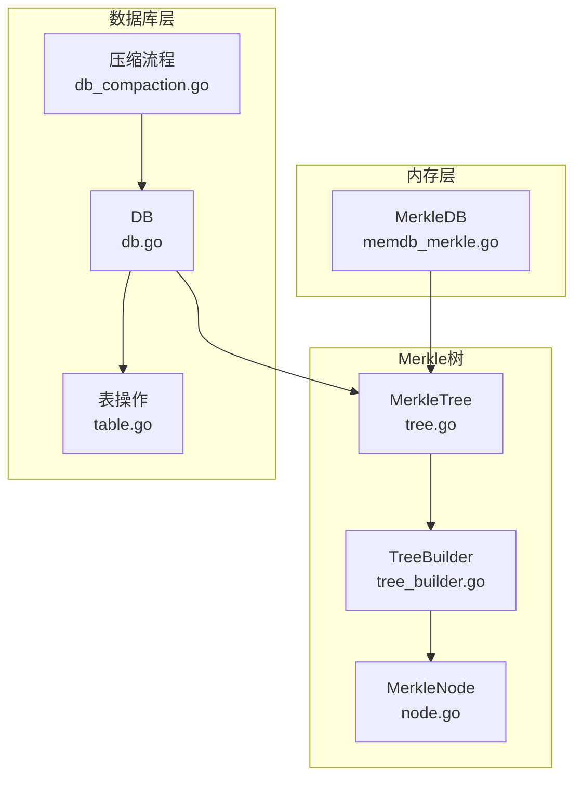
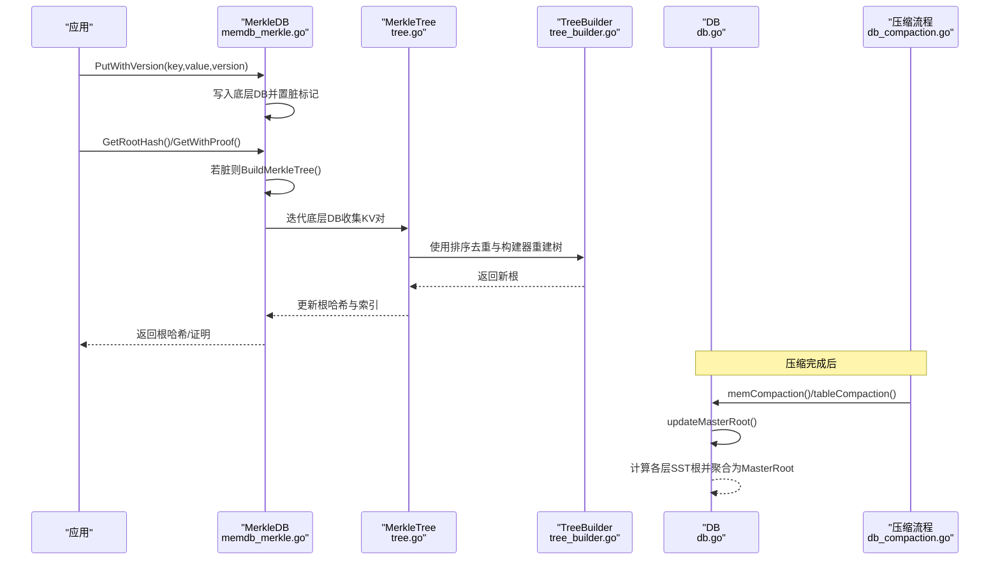
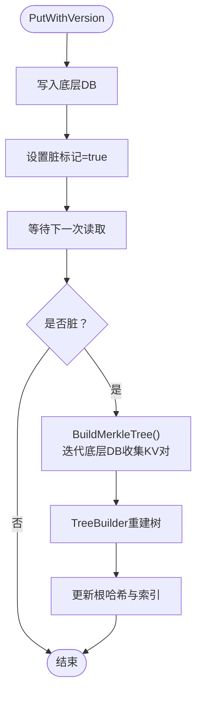
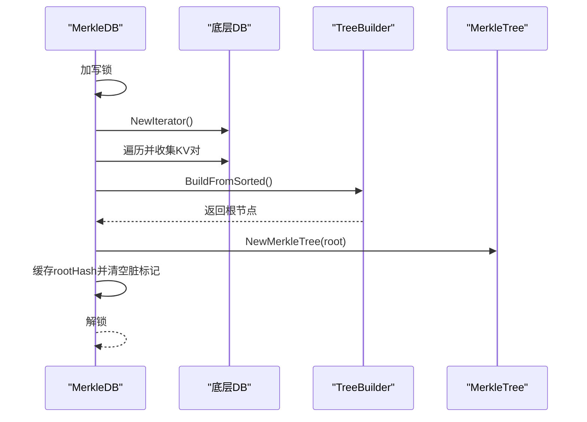
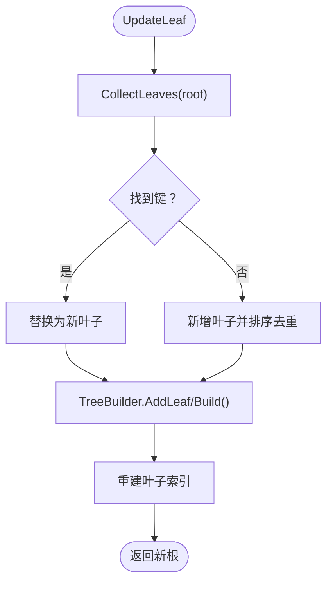
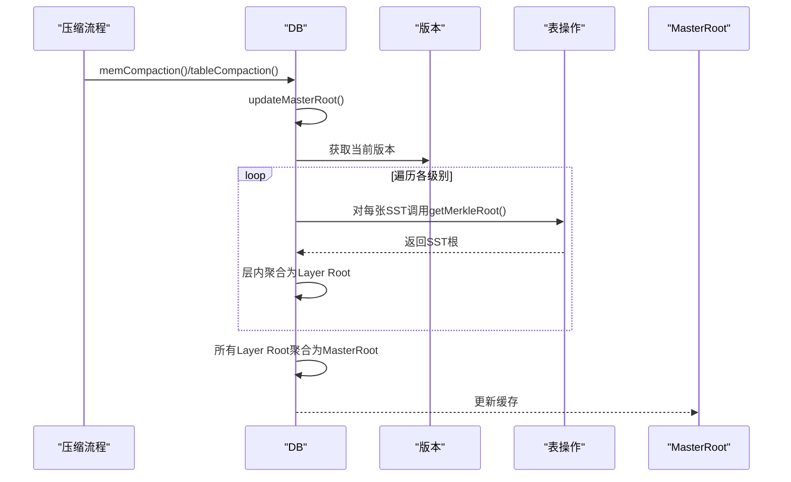
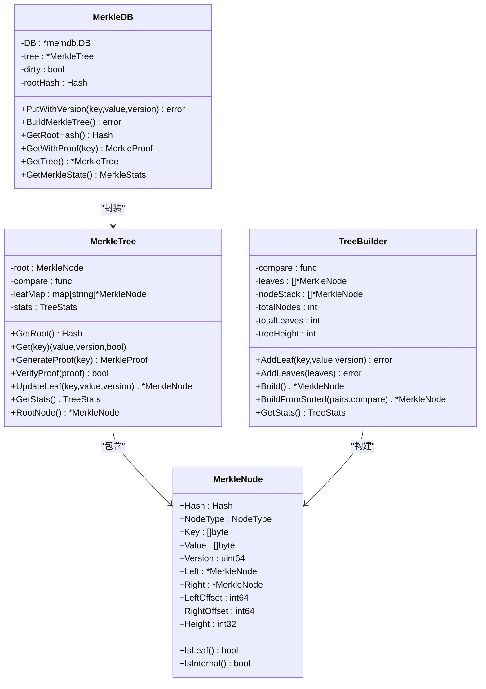
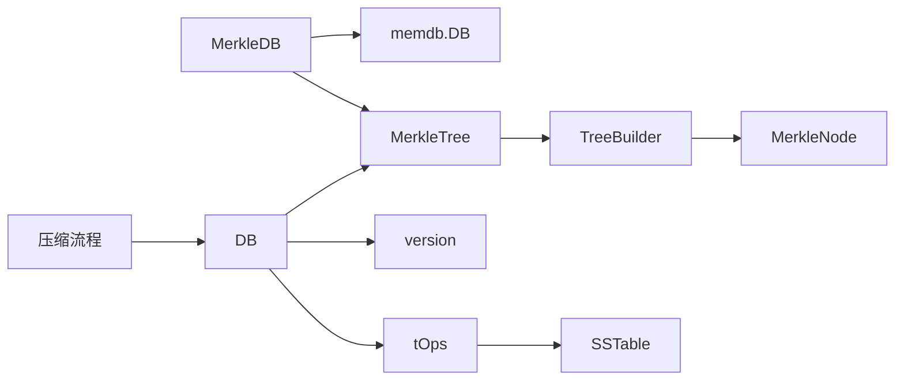

# Merkle树更新

<cite>
**本文引用的文件**
- [leveldb/merkle/tree.go](file://leveldb/merkle/tree.go)
- [leveldb/merkle/tree_builder.go](file://leveldb/merkle/tree_builder.go)
- [leveldb/merkle/node.go](file://leveldb/merkle/node.go)
- [leveldb/memdb/memdb_merkle.go](file://leveldb/memdb/memdb_merkle.go)
- [leveldb/db.go](file://leveldb/db.go)
- [leveldb/db_compaction.go](file://leveldb/db_compaction.go)
- [leveldb/table.go](file://leveldb/table.go)
</cite>

## 目录
1. [引言](#引言)
2. [项目结构](#项目结构)
3. [核心组件](#核心组件)
4. [架构总览](#架构总览)
5. [详细组件分析](#详细组件分析)
6. [依赖关系分析](#依赖关系分析)
7. [性能考量](#性能考量)
8. [故障排查指南](#故障排查指南)
9. [结论](#结论)

## 引言
本文件围绕 avccDB 的 Merkle 树更新流程展开，聚焦于 PutWithVersion 操作后的 Merkle 树更新路径：从内存数据库收集键值对、构建新 Merkle 树、通过 UpdateLeaf 方法实现不可变性维护、压缩操作触发树重算，以及脏标记（dirty flag）对重建时机的控制。同时提供数据流图与性能优化建议（延迟构建、缓存）。

## 项目结构
- Merkle 核心位于 leveldb/merkle，包含节点、树、构建器、序列化等模块。
- 内存数据库 leveldb/memdb 提供带 Merkle 支持的封装，包含脏标记与根哈希缓存。
- 数据库层 leveldb/db 负责 MasterRoot（全库聚合根）的计算与更新，贯穿 flush/compaction 等关键事件。
- 压缩流程 leveldb/db_compaction 在 mem flush 与 table compaction 后调用 MasterRoot 更新。
- 表层 leveldb/table 提供从 SST 获取 Merkle 根的能力，支撑层级聚合。

图表来源
- [leveldb/memdb/memdb_merkle.go](file://leveldb/memdb/memdb_merkle.go#L1-L181)
- [leveldb/merkle/tree.go](file://leveldb/merkle/tree.go#L1-L286)
- [leveldb/merkle/tree_builder.go](file://leveldb/merkle/tree_builder.go#L1-L430)
- [leveldb/merkle/node.go](file://leveldb/merkle/node.go#L1-L52)
- [leveldb/db.go](file://leveldb/db.go#L1480-L1571)
- [leveldb/db_compaction.go](file://leveldb/db_compaction.go#L336-L354)
- [leveldb/table.go](file://leveldb/table.go#L444-L478)

章节来源
- [leveldb/memdb/memdb_merkle.go](file://leveldb/memdb/memdb_merkle.go#L1-L181)
- [leveldb/merkle/tree.go](file://leveldb/merkle/tree.go#L1-L286)
- [leveldb/merkle/tree_builder.go](file://leveldb/merkle/tree_builder.go#L1-L430)
- [leveldb/db.go](file://leveldb/db.go#L1480-L1571)
- [leveldb/db_compaction.go](file://leveldb/db_compaction.go#L336-L354)
- [leveldb/table.go](file://leveldb/table.go#L444-L478)

## 核心组件
- MerkleTree：维护根节点、叶子映射、统计信息；提供获取根、查询、生成证明、校验证明、更新叶子等能力。
- TreeBuilder：自底向上构建平衡二叉 Merkle 树，支持批量添加叶子、排序去重、流式构建等。
- MerkleDB：在内存数据库之上封装 Merkle 能力，维护脏标记与根哈希缓存，提供 BuildMerkleTree 与 GetRootHash 等接口。
- DB：负责 MasterRoot 的计算与更新，贯穿 mem flush 与 table compaction。
- 表层 tOps：从 SST 获取 Merkle 根，支撑层级聚合。

章节来源
- [leveldb/merkle/tree.go](file://leveldb/merkle/tree.go#L1-L286)
- [leveldb/merkle/tree_builder.go](file://leveldb/merkle/tree_builder.go#L1-L430)
- [leveldb/memdb/memdb_merkle.go](file://leveldb/memdb/memdb_merkle.go#L1-L181)
- [leveldb/db.go](file://leveldb/db.go#L1480-L1571)
- [leveldb/table.go](file://leveldb/table.go#L444-L478)

## 架构总览
Merkle 树更新的关键路径：
- 写入 PutWithVersion：仅写入底层内存数据库，设置脏标记，不立即重建树。
- 读取 GetRootHash/GetWithProof：若脏则触发 BuildMerkleTree，从内存数据库迭代收集键值对，按排序构建树，更新根哈希与脏标记。
- 压缩触发：mem flush 与 table compaction 后调用 updateMasterRoot，基于各层 SST 的 Merkle 根聚合出 MasterRoot。

图表来源
- [leveldb/memdb/memdb_merkle.go](file://leveldb/memdb/memdb_merkle.go#L42-L124)
- [leveldb/merkle/tree.go](file://leveldb/merkle/tree.go#L53-L120)
- [leveldb/merkle/tree_builder.go](file://leveldb/merkle/tree_builder.go#L82-L131)
- [leveldb/db_compaction.go](file://leveldb/db_compaction.go#L336-L354)
- [leveldb/db.go](file://leveldb/db.go#L1562-L1571)

## 详细组件分析

### PutWithVersion 后的树更新
- PutWithVersion 仅写入底层内存数据库，随后将脏标记置为 true，表示树需要重建。
- 下次读取（GetRootHash 或 GetWithProof）时，若发现脏标记为真，则执行 BuildMerkleTree。

图表来源
- [leveldb/memdb/memdb_merkle.go](file://leveldb/memdb/memdb_merkle.go#L42-L124)
- [leveldb/merkle/tree.go](file://leveldb/merkle/tree.go#L53-L120)
- [leveldb/merkle/tree_builder.go](file://leveldb/merkle/tree_builder.go#L82-L131)

章节来源
- [leveldb/memdb/memdb_merkle.go](file://leveldb/memdb/memdb_merkle.go#L42-L124)

### BuildMerkleTree：从内存数据库收集并重建
- BuildMerkleTree 在持有写锁时执行，避免并发冲突。
- 通过底层 DB 的迭代器遍历当前状态，收集键值对（版本提取逻辑在注释中提示需从内部键解析）。
- 使用 BuildFromSorted 与 TreeBuilder 构建平衡树，返回 MerkleTree 并缓存根哈希，清除脏标记。

图表来源
- [leveldb/memdb/memdb_merkle.go](file://leveldb/memdb/memdb_merkle.go#L58-L106)
- [leveldb/merkle/tree_builder.go](file://leveldb/merkle/tree_builder.go#L140-L151)
- [leveldb/merkle/tree.go](file://leveldb/merkle/tree.go#L21-L38)

章节来源
- [leveldb/memdb/memdb_merkle.go](file://leveldb/memdb/memdb_merkle.go#L58-L106)
- [leveldb/merkle/tree_builder.go](file://leveldb/merkle/tree_builder.go#L140-L151)
- [leveldb/merkle/tree.go](file://leveldb/merkle/tree.go#L21-L38)

### UpdateLeaf：通过重建整棵树维护不可变性
- UpdateLeaf 会收集现有叶子，定位目标键并更新或插入，随后使用 TreeBuilder 重新构建整棵树，保证不可变性。
- 重建后更新根节点、重建叶子索引，返回新根。

图表来源
- [leveldb/merkle/tree.go](file://leveldb/merkle/tree.go#L227-L275)
- [leveldb/merkle/tree_builder.go](file://leveldb/merkle/tree_builder.go#L45-L80)
- [leveldb/merkle/tree_builder.go](file://leveldb/merkle/tree_builder.go#L82-L131)
- [leveldb/merkle/tree_builder.go](file://leveldb/merkle/tree_builder.go#L402-L430)

章节来源
- [leveldb/merkle/tree.go](file://leveldb/merkle/tree.go#L227-L275)
- [leveldb/merkle/tree_builder.go](file://leveldb/merkle/tree_builder.go#L45-L80)
- [leveldb/merkle/tree_builder.go](file://leveldb/merkle/tree_builder.go#L402-L430)

### 压缩操作后触发树重算与 MasterRoot 更新
- mem flush 与 table compaction 完成后，调用 updateMasterRoot。
- computeMasterRoot 遍历版本层次，从每个 SST 获取 Merkle 根，先按层聚合为 Layer Root，再将所有 Layer Root 聚合为 MasterRoot。
- DB 层提供 GetMasterRoot 接口以供上层使用。

图表来源
- [leveldb/db_compaction.go](file://leveldb/db_compaction.go#L336-L354)
- [leveldb/db_compaction.go](file://leveldb/db_compaction.go#L627-L629)
- [leveldb/db.go](file://leveldb/db.go#L1491-L1561)
- [leveldb/table.go](file://leveldb/table.go#L444-L478)

章节来源
- [leveldb/db_compaction.go](file://leveldb/db_compaction.go#L336-L354)
- [leveldb/db_compaction.go](file://leveldb/db_compaction.go#L627-L629)
- [leveldb/db.go](file://leveldb/db.go#L1491-L1561)
- [leveldb/table.go](file://leveldb/table.go#L444-L478)

### 脏标记（dirty flag）与重建时机
- MerkleDB 维护 dirty 字段与 rootHash 缓存。
- 读取路径（GetRootHash/GetWithProof）在发现脏标记为真时，释放读锁并获取写锁，执行 BuildMerkleTree，完成后恢复读锁。
- 写入路径（PutWithVersion）仅置脏标记，不阻塞写入，从而实现延迟构建。

章节来源
- [leveldb/memdb/memdb_merkle.go](file://leveldb/memdb/memdb_merkle.go#L14-L56)
- [leveldb/memdb/memdb_merkle.go](file://leveldb/memdb/memdb_merkle.go#L108-L148)

### 数据模型与类关系

图表来源
- [leveldb/merkle/tree.go](file://leveldb/merkle/tree.go#L1-L286)
- [leveldb/merkle/tree_builder.go](file://leveldb/merkle/tree_builder.go#L1-L430)
- [leveldb/merkle/node.go](file://leveldb/merkle/node.go#L1-L52)
- [leveldb/memdb/memdb_merkle.go](file://leveldb/memdb/memdb_merkle.go#L1-L181)

## 依赖关系分析
- MerkleDB 依赖 memdb.DB 与 merkle 包；读取时在必要时重建树。
- DB 依赖版本系统与表操作，用于计算 MasterRoot。
- TreeBuilder 依赖 MerkleNode 与排序工具，提供自底向上的平衡树构建。
- 压缩流程在 mem flush 与 table compaction 后更新 MasterRoot。

图表来源
- [leveldb/memdb/memdb_merkle.go](file://leveldb/memdb/memdb_merkle.go#L1-L181)
- [leveldb/merkle/tree.go](file://leveldb/merkle/tree.go#L1-L286)
- [leveldb/merkle/tree_builder.go](file://leveldb/merkle/tree_builder.go#L1-L430)
- [leveldb/db.go](file://leveldb/db.go#L1480-L1571)
- [leveldb/db_compaction.go](file://leveldb/db_compaction.go#L336-L354)
- [leveldb/table.go](file://leveldb/table.go#L444-L478)

章节来源
- [leveldb/memdb/memdb_merkle.go](file://leveldb/memdb/memdb_merkle.go#L1-L181)
- [leveldb/merkle/tree.go](file://leveldb/merkle/tree.go#L1-L286)
- [leveldb/merkle/tree_builder.go](file://leveldb/merkle/tree_builder.go#L1-L430)
- [leveldb/db.go](file://leveldb/db.go#L1480-L1571)
- [leveldb/db_compaction.go](file://leveldb/db_compaction.go#L336-L354)
- [leveldb/table.go](file://leveldb/table.go#L444-L478)

## 性能考量
- 延迟构建：PutWithVersion 不重建树，仅置脏标记；首次读取时才重建，降低写放大。
- 缓存：MerkleDB 缓存 rootHash，避免重复计算；DB 层缓存 MasterRoot，减少聚合开销。
- 自底向上构建：TreeBuilder 使用栈式自底向上构建，内存友好且保持平衡。
- 流式构建：StreamingTreeBuilder 支持分批构建子树并合并，适合大规模数据。
- 排序去重：SortAndDeduplicate 在重建前确保同一用户键保留最高版本，减少冗余。
- 压缩后聚合：mem flush 与 table compaction 后统一更新 MasterRoot，避免频繁小粒度重算。

章节来源
- [leveldb/memdb/memdb_merkle.go](file://leveldb/memdb/memdb_merkle.go#L14-L56)
- [leveldb/merkle/tree_builder.go](file://leveldb/merkle/tree_builder.go#L190-L295)
- [leveldb/merkle/tree_builder.go](file://leveldb/merkle/tree_builder.go#L402-L430)
- [leveldb/db.go](file://leveldb/db.go#L1491-L1561)

## 故障排查指南
- 版本顺序错误：TreeBuilder 在 AddLeaf 时要求键有序且同键高版本优先，违反将报错。检查写入键编码与版本号生成逻辑。
- 空树错误：当底层数据库为空时，BuildMerkleTree 将返回空树状态；确认写入是否成功。
- 证明校验失败：VerifyProof 先比对证明根与当前树根，再验证路径；若失败，检查树是否被重建或版本是否匹配。
- MasterRoot 不更新：确认 mem flush 与 table compaction 是否触发 updateMasterRoot；检查表层是否正确返回 SST 根。

章节来源
- [leveldb/merkle/tree_builder.go](file://leveldb/merkle/tree_builder.go#L45-L80)
- [leveldb/merkle/tree.go](file://leveldb/merkle/tree.go#L213-L225)
- [leveldb/db_compaction.go](file://leveldb/db_compaction.go#L336-L354)
- [leveldb/table.go](file://leveldb/table.go#L444-L478)

## 结论
avccDB 的 Merkle 树更新采用“写延迟、读重建”的策略，结合脏标记与缓存，既保证了写入性能又确保读取一致性。压缩流程后统一更新 MasterRoot，形成从 SST 根到层根再到全库根的三层聚合结构。UpdateLeaf 通过重建整棵树维护不可变性，配合排序去重与流式构建，满足大规模数据场景下的可扩展性与正确性。