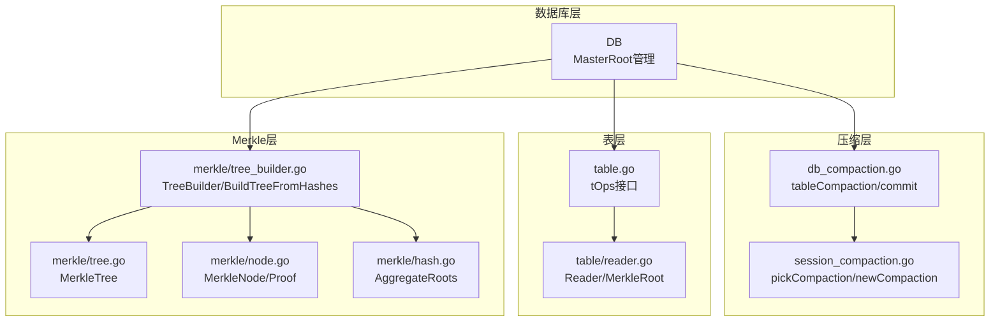
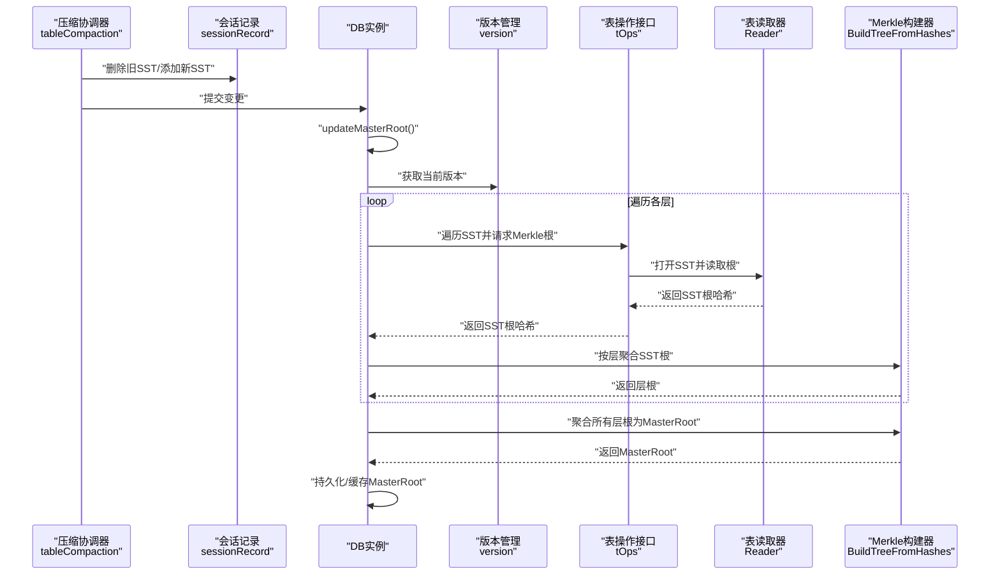
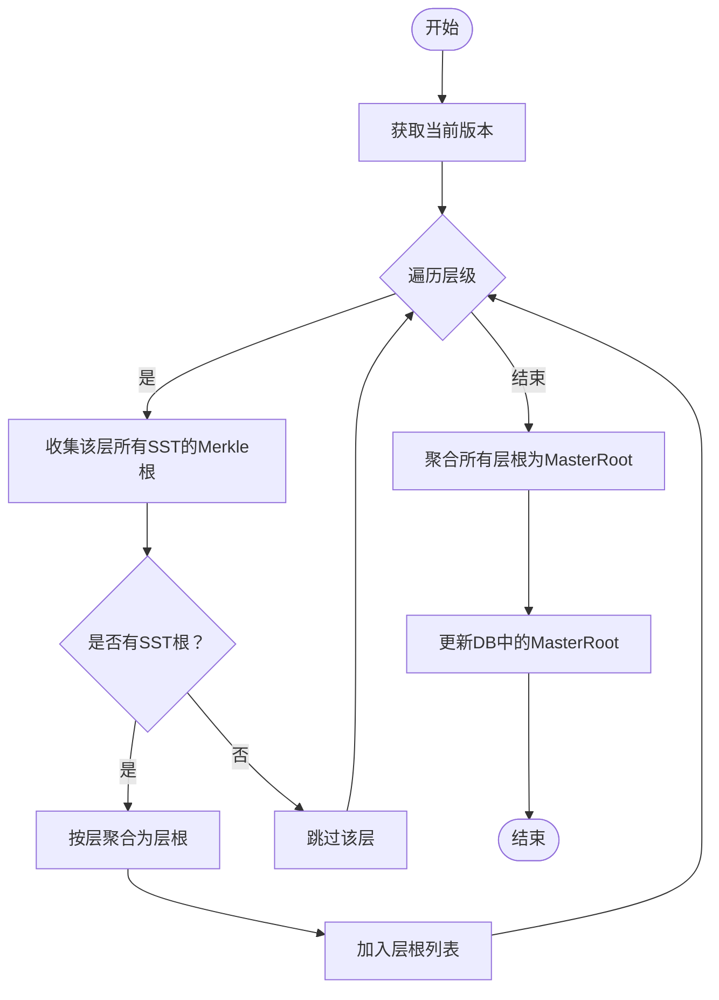
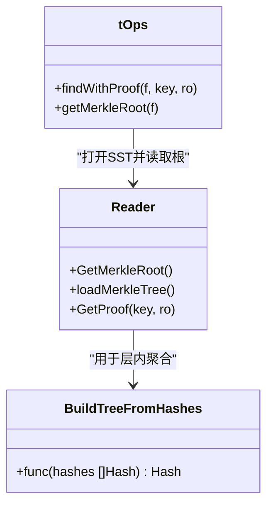
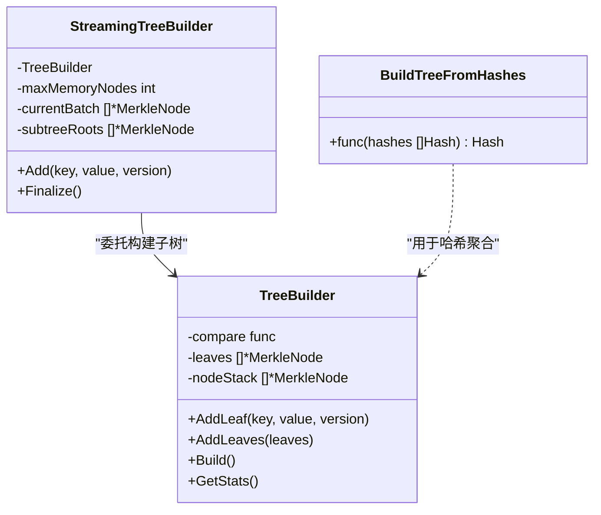
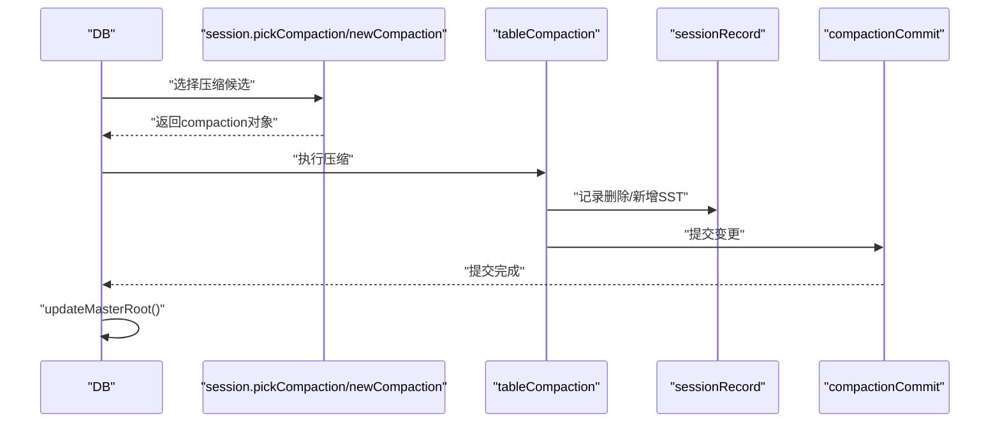
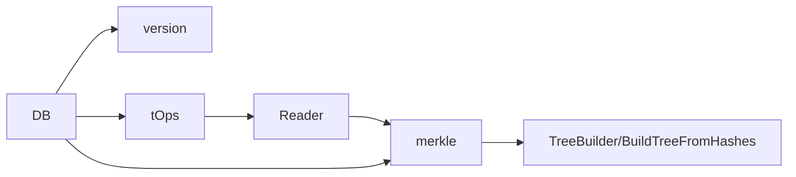

# SSTable压缩后的Merkle树重建

<cite>
**本文引用的文件**
- [db_compaction.go](file://leveldb/db_compaction.go)
- [session_compaction.go](file://leveldb/session_compaction.go)
- [db.go](file://leveldb/db.go)
- [tree_builder.go](file://leveldb/merkle/tree_builder.go)
- [tree.go](file://leveldb/merkle/tree.go)
- [node.go](file://leveldb/merkle/node.go)
- [hash.go](file://leveldb/merkle/hash.go)
- [table.go](file://leveldb/table/table.go)
- [reader.go](file://leveldb/table/reader.go)
- [table_reader_merkle_test.go](file://leveldb/table/reader_merkle_test.go)
</cite>

## 目录
1. [简介](#简介)
2. [项目结构](#项目结构)
3. [核心组件](#核心组件)
4. [架构总览](#架构总览)
5. [详细组件分析](#详细组件分析)
6. [依赖关系分析](#依赖关系分析)
7. [性能考量](#性能考量)
8. [故障排查指南](#故障排查指南)
9. [结论](#结论)

## 简介
本文件聚焦于LevelDB在SSTable层级压缩操作完成后，如何触发并执行Merkle树的重建流程，以确保数据库整体一致性哈希MasterRoot能够正确反映最新的数据布局。文档详细说明：
- 压缩完成后，系统通过回调与控制流触发MasterRoot的重建；
- Merkle模块的tree_builder如何整合来自多个SSTable的根哈希，生成跨文件的一致性Merkle结构；
- 为什么压缩后必须重建树以保证哈希完整性；
- 增量更新与全量重建之间的权衡；
- 结合db_compaction.go中的回调机制，展示压缩完成事件如何通知Merkle模块进行更新。

## 项目结构
围绕“SSTable压缩后Merkle树重建”的主题，涉及以下关键目录与文件：
- 数据库层：db.go负责MasterRoot的计算与更新、读取路径上的证明增强；
- 压缩层：db_compaction.go与session_compaction.go定义压缩流程与提交；
- 表层：table.go与table/reader.go提供SSTable的Merkele根哈希读取能力；
- Merkle层：merkle包提供树节点、树构建器、哈希聚合等能力。

图表来源
- [db.go](file://leveldb/db.go#L1491-L1569)
- [db_compaction.go](file://leveldb/db_compaction.go#L567-L629)
- [session_compaction.go](file://leveldb/session_compaction.go#L56-L134)
- [table.go](file://leveldb/table/table.go#L444-L478)
- [reader.go](file://leveldb/table/reader.go#L1106-L1146)
- [tree_builder.go](file://leveldb/merkle/tree_builder.go#L153-L187)
- [tree.go](file://leveldb/merkle/tree.go#L1-L286)
- [node.go](file://leveldb/merkle/node.go#L1-L370)
- [hash.go](file://leveldb/merkle/hash.go#L127-L152)

章节来源
- [db.go](file://leveldb/db.go#L1491-L1569)
- [db_compaction.go](file://leveldb/db_compaction.go#L567-L629)
- [session_compaction.go](file://leveldb/session_compaction.go#L56-L134)
- [table.go](file://leveldb/table/table.go#L444-L478)
- [reader.go](file://leveldb/table/reader.go#L1106-L1146)
- [tree_builder.go](file://leveldb/merkle/tree_builder.go#L153-L187)
- [tree.go](file://leveldb/merkle/tree.go#L1-L286)
- [node.go](file://leveldb/merkle/node.go#L1-L370)
- [hash.go](file://leveldb/merkle/hash.go#L127-L152)

## 核心组件
- MasterRoot计算与更新：数据库层维护全局一致性哈希，压缩完成后调用updateMasterRoot触发全量重建。
- 压缩流程与提交：压缩完成后通过commit阶段提交变更，随后触发MasterRoot更新。
- SSTable Merkle根：每个SSTable可包含独立的Merkle树根，供上层聚合使用。
- Merkle树构建器：从SST根哈希或键值对构建平衡二叉树，支持从哈希列表直接建树。

章节来源
- [db.go](file://leveldb/db.go#L1491-L1569)
- [db_compaction.go](file://leveldb/db_compaction.go#L567-L629)
- [table.go](file://leveldb/table/table.go#L444-L478)
- [reader.go](file://leveldb/table/reader.go#L1106-L1146)
- [tree_builder.go](file://leveldb/merkle/tree_builder.go#L153-L187)

## 架构总览
下图展示了压缩完成后，系统如何触发Merkle树重建并更新MasterRoot的整体流程。

图表来源
- [db_compaction.go](file://leveldb/db_compaction.go#L567-L629)
- [db.go](file://leveldb/db.go#L1491-L1569)
- [table.go](file://leveldb/table/table.go#L444-L478)
- [reader.go](file://leveldb/table/reader.go#L1106-L1146)
- [tree_builder.go](file://leveldb/merkle/tree_builder.go#L153-L187)

## 详细组件分析

### 组件A：压缩完成后的MasterRoot重建
- 触发点：tableCompaction在提交阶段完成后，调用updateMasterRoot以全量重建MasterRoot。
- 全量重建策略：computeMasterRoot遍历当前版本的所有层级，收集每个SSTable的Merkle根，先按层聚合为层根，再将所有层根聚合为最终MasterRoot。
- 层聚合算法：使用BuildTreeFromHashes对同一层内的SST根进行平衡二叉树聚合，保证顺序无关且可重复。

图表来源
- [db.go](file://leveldb/db.go#L1491-L1569)
- [tree_builder.go](file://leveldb/merkle/tree_builder.go#L153-L187)

章节来源
- [db_compaction.go](file://leveldb/db_compaction.go#L627-L629)
- [db.go](file://leveldb/db.go#L1491-L1569)
- [tree_builder.go](file://leveldb/merkle/tree_builder.go#L153-L187)

### 组件B：SSTable根哈希的采集与聚合
- 采集入口：tOps.getMerkleRoot通过Reader.GetMerkleRoot读取单个SST的根哈希；Reader内部在启用Merkle时加载树并返回根。
- 聚合策略：同一层内使用BuildTreeFromHashes进行平衡树聚合；最终将所有层根再次使用BuildTreeFromHashes聚合得到MasterRoot。
- 一致性保障：由于采用平衡树聚合，聚合结果与输入顺序无关，保证不同时间点重建的一致性。

图表来源
- [table.go](file://leveldb/table/table.go#L444-L478)
- [reader.go](file://leveldb/table/reader.go#L1106-L1146)
- [tree_builder.go](file://leveldb/merkle/tree_builder.go#L153-L187)

章节来源
- [table.go](file://leveldb/table/table.go#L444-L478)
- [reader.go](file://leveldb/table/reader.go#L1106-L1146)
- [tree_builder.go](file://leveldb/merkle/tree_builder.go#L153-L187)

### 组件C：TreeBuilder在Merkle树重建中的作用
- TreeBuilder用于从键值对或叶子节点序列构建平衡二叉树，支持AddLeaf/AddLeaves/Build等方法。
- 在SST级重建场景中，TreeBuilder并非直接使用，而是通过BuildTreeFromHashes对SST根哈希进行聚合，从而避免对底层键值数据的二次扫描。
- StreamingTreeBuilder支持分批构建与合并，适用于大规模数据的内存友好型增量构建。

图表来源
- [tree_builder.go](file://leveldb/merkle/tree_builder.go#L1-L187)
- [tree.go](file://leveldb/merkle/tree.go#L1-L286)
- [node.go](file://leveldb/merkle/node.go#L1-L370)

章节来源
- [tree_builder.go](file://leveldb/merkle/tree_builder.go#L1-L187)
- [tree.go](file://leveldb/merkle/tree.go#L1-L286)
- [node.go](file://leveldb/merkle/node.go#L1-L370)

### 组件D：压缩流程与回调机制
- tableCompaction负责选择待压缩的SST集合、生成输出SST、提交变更；提交成功后调用updateMasterRoot。
- 会话层pickCompaction/newCompaction定义了压缩候选的选择逻辑与迭代器构造，确保压缩过程中能正确合并与去重历史版本。
- 压缩完成后，系统通过updateMasterRoot触发全量重建，确保MasterRoot与当前数据布局一致。

图表来源
- [session_compaction.go](file://leveldb/session_compaction.go#L56-L134)
- [db_compaction.go](file://leveldb/db_compaction.go#L567-L629)
- [db.go](file://leveldb/db.go#L1562-L1569)

章节来源
- [session_compaction.go](file://leveldb/session_compaction.go#L56-L134)
- [db_compaction.go](file://leveldb/db_compaction.go#L567-L629)
- [db.go](file://leveldb/db.go#L1562-L1569)

## 依赖关系分析
- DB依赖版本管理获取当前层级布局，依赖tOps访问SST根哈希，依赖merkle模块进行聚合。
- tOps依赖Reader读取SST根，Reader依赖merkle模块的树结构与哈希计算。
- TreeBuilder与BuildTreeFromHashes共同承担从哈希到树根的聚合职责，避免对键值数据的直接依赖。

图表来源
- [db.go](file://leveldb/db.go#L1491-L1569)
- [table.go](file://leveldb/table/table.go#L444-L478)
- [reader.go](file://leveldb/table/reader.go#L1106-L1146)
- [tree_builder.go](file://leveldb/merkle/tree_builder.go#L153-L187)

章节来源
- [db.go](file://leveldb/db.go#L1491-L1569)
- [table.go](file://leveldb/table/table.go#L444-L478)
- [reader.go](file://leveldb/table/reader.go#L1106-L1146)
- [tree_builder.go](file://leveldb/merkle/tree_builder.go#L153-L187)

## 性能考量
- 全量重建成本：每次压缩后全量遍历版本并聚合所有SST根，时间复杂度与SST数量线性相关；空间复杂度与层级数和每层SST数量有关。
- 平衡树聚合：BuildTreeFromHashes采用自底向上的平衡树聚合，避免深度倾斜，提升后续校验效率。
- 内存友好：StreamingTreeBuilder支持分批构建与合并，适合大规模数据的增量式处理。
- 读取路径优化：在GetWithProof中，若存在SST证明则将其与MasterRoot组合，减少额外计算开销。

章节来源
- [tree_builder.go](file://leveldb/merkle/tree_builder.go#L190-L295)
- [tree.go](file://leveldb/merkle/tree.go#L227-L286)
- [db.go](file://leveldb/db.go#L884-L932)

## 故障排查指南
- 压缩后MasterRoot未更新：检查tableCompaction是否成功提交，以及updateMasterRoot是否被调用。
- SST根为空：确认Reader已启用Merkle且SST确实包含Merkle树；可通过table_reader_merkle_test验证。
- 聚合异常：核对BuildTreeFromHashes输入是否为空或仅一个元素，以及聚合顺序是否稳定。
- 版本一致性：若出现非预期的MasterRoot变化，检查压缩过程中是否正确删除旧SST并添加新SST。

章节来源
- [db_compaction.go](file://leveldb/db_compaction.go#L567-L629)
- [db.go](file://leveldb/db.go#L1562-L1569)
- [reader.go](file://leveldb/table/reader.go#L1106-L1146)
- [table_reader_merkle_test.go](file://leveldb/table/reader_merkle_test.go#L1-L209)

## 结论
- 压缩完成后，系统通过tableCompaction提交变更并触发updateMasterRoot，实现对MasterRoot的全量重建。
- Merkle模块通过BuildTreeFromHashes对SST根进行平衡树聚合，既保证哈希完整性，又避免对底层键值数据的重复扫描。
- 全量重建虽然成本较高，但能确保MasterRoot与当前数据布局严格一致；对于大规模场景，可结合StreamingTreeBuilder进行内存友好的增量处理。
- 在读取路径上，系统将SST证明与MasterRoot组合，形成跨层的一致性证明，满足mLSM对历史版本与存在性证明的需求。