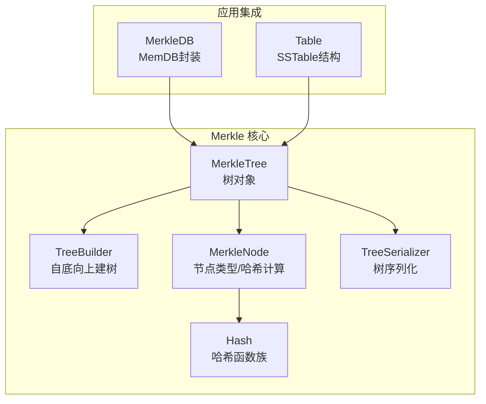
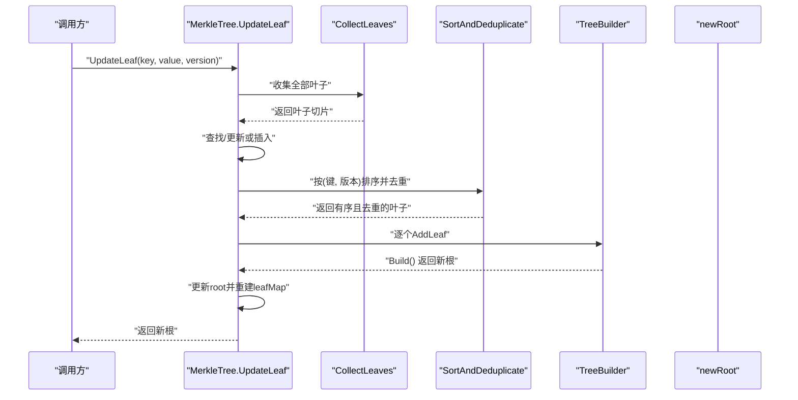
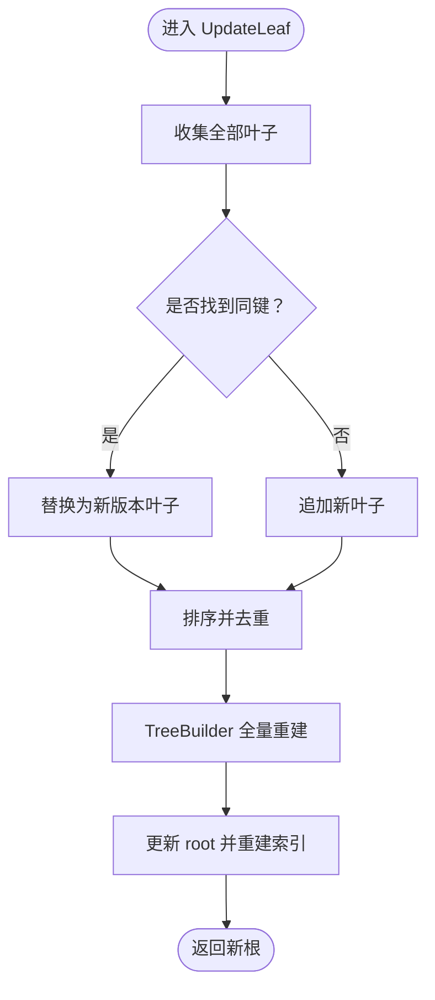
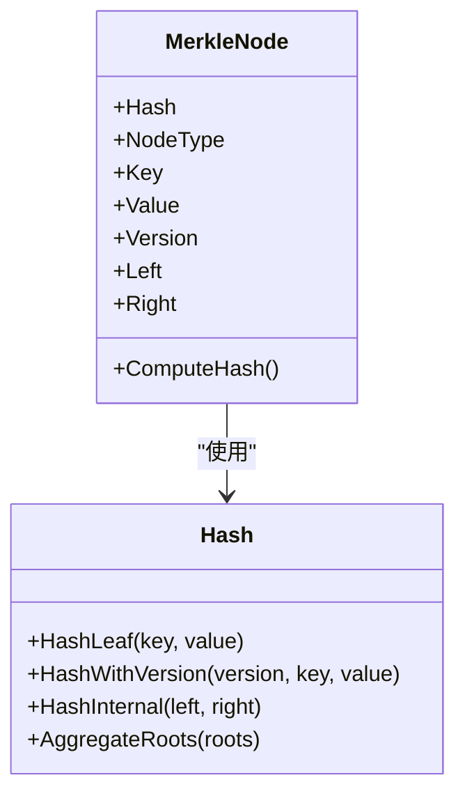
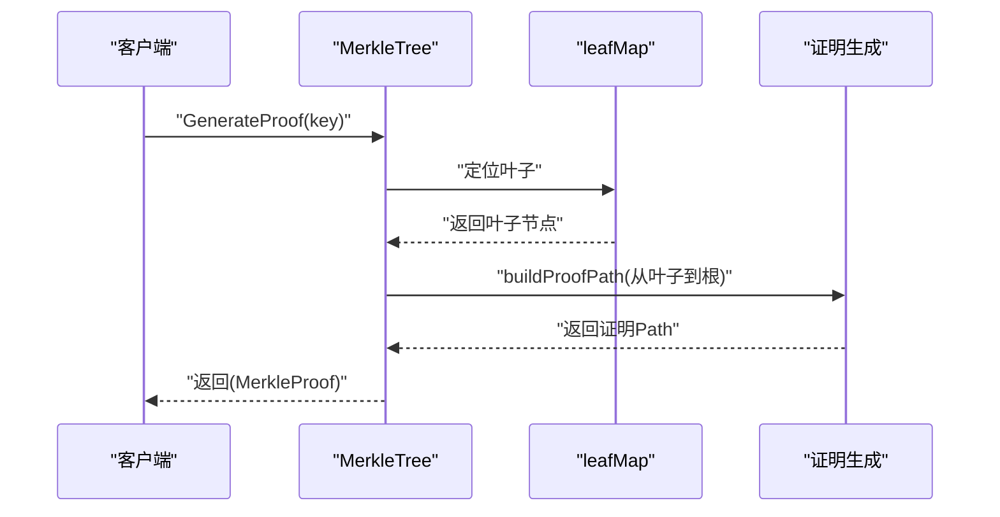
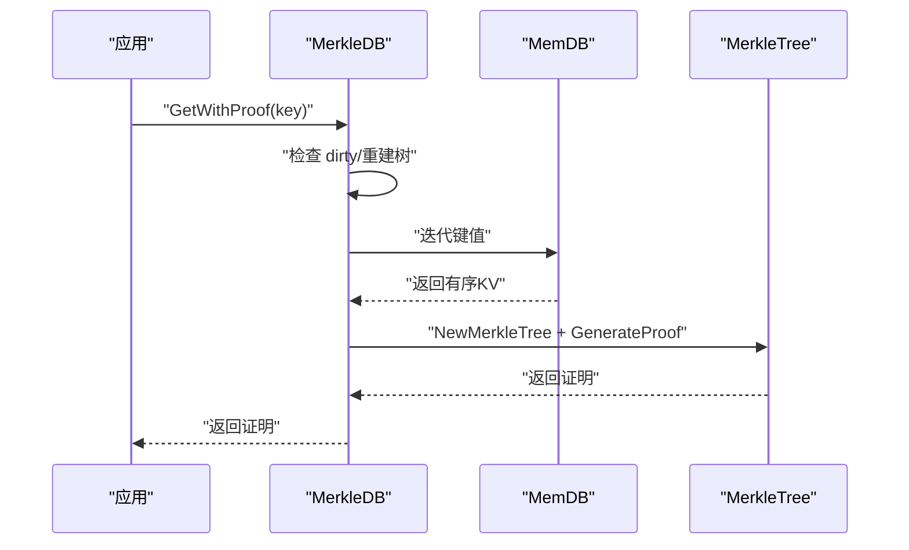
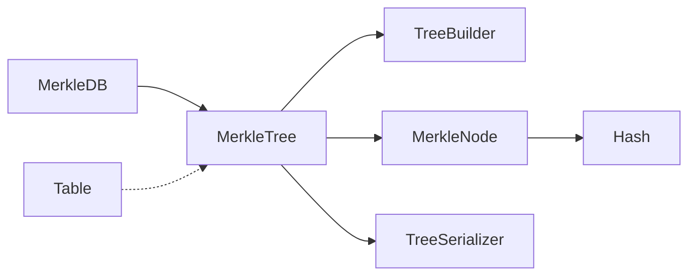

# 不可变Merkle树的维护机制

<cite>
**本文引用的文件**
- [leveldb/merkle/tree.go](file://leveldb/merkle/tree.go)
- [leveldb/merkle/tree_builder.go](file://leveldb/merkle/tree_builder.go)
- [leveldb/merkle/node.go](file://leveldb/merkle/node.go)
- [leveldb/merkle/hash.go](file://leveldb/merkle/hash.go)
- [leveldb/merkle/tree_serializer.go](file://leveldb/merkle/tree_serializer.go)
- [leveldb/merkle/merkle_test.go](file://leveldb/merkle/merkle_test.go)
- [leveldb/memdb/memdb_merkle.go](file://leveldb/memdb/memdb_merkle.go)
- [leveldb/table/table.go](file://leveldb/table/table.go)
</cite>

## 目录
1. [简介](#简介)
2. [项目结构](#项目结构)
3. [核心组件](#核心组件)
4. [架构总览](#架构总览)
5. [详细组件分析](#详细组件分析)
6. [依赖关系分析](#依赖关系分析)
7. [性能考量](#性能考量)
8. [故障排查指南](#故障排查指南)
9. [结论](#结论)
10. [附录](#附录)

## 简介
本文件围绕 avccDB 中 Merkle 树的不可变性（immutability）实现进行系统化剖析，重点回答以下问题：
- 为什么 UpdateLeaf 方法不采用原地更新，而通过“收集叶子、重排并调用 TreeBuilder 全量重建整棵树”的方式？
- 这种设计如何保障历史版本数据的可验证性与防篡改特性？
- 性能影响评估：时间复杂度、空间复杂度与内存开销；并与路径复制（path copying）策略对比。
- leafMap 索引重建过程及其在快速查找中的作用。

本分析以代码为依据，结合 Mermaid 图表与分层讲解，帮助读者从原理到实践全面理解不可变 Merkle 树的维护机制。

## 项目结构
与不可变 Merkle 树直接相关的模块主要集中在 leveldb/merkle 子目录，以及与之协作的 memdb 层与 table 层：
- merkle 层：定义 MerkleNode、MerkleTree、TreeBuilder、证明生成与校验、序列化等核心逻辑
- memdb 层：在内存数据库上封装 Merkle 支持，提供构建树、获取根哈希、生成证明等接口
- table 层：SSTable 的结构文档，用于理解分层存储与根聚合场景

图表来源
- [leveldb/merkle/tree.go](file://leveldb/merkle/tree.go#L1-L286)
- [leveldb/merkle/tree_builder.go](file://leveldb/merkle/tree_builder.go#L1-L430)
- [leveldb/merkle/node.go](file://leveldb/merkle/node.go#L1-L370)
- [leveldb/merkle/hash.go](file://leveldb/merkle/hash.go#L1-L153)
- [leveldb/merkle/tree_serializer.go](file://leveldb/merkle/tree_serializer.go#L1-L377)
- [leveldb/memdb/memdb_merkle.go](file://leveldb/memdb/memdb_merkle.go#L1-L181)
- [leveldb/table/table.go](file://leveldb/table/table.go#L1-L174)

章节来源
- [leveldb/merkle/tree.go](file://leveldb/merkle/tree.go#L1-L286)
- [leveldb/merkle/tree_builder.go](file://leveldb/merkle/tree_builder.go#L1-L430)
- [leveldb/merkle/node.go](file://leveldb/merkle/node.go#L1-L370)
- [leveldb/merkle/hash.go](file://leveldb/merkle/hash.go#L1-L153)
- [leveldb/merkle/tree_serializer.go](file://leveldb/merkle/tree_serializer.go#L1-L377)
- [leveldb/memdb/memdb_merkle.go](file://leveldb/memdb/memdb_merkle.go#L1-L181)
- [leveldb/table/table.go](file://leveldb/table/table.go#L1-L174)

## 核心组件
- MerkleTree：封装根节点、比较器、叶子索引、统计信息；提供 Get、GenerateProof、VerifyProof、UpdateLeaf 等接口
- TreeBuilder：自底向上的平衡树构建器，支持批量添加叶子、构建树、流式构建等
- MerkleNode：节点类型（叶/内部）、哈希计算、序列化/反序列化
- Hash：统一的哈希函数族，包含带版本的叶节点哈希
- TreeSerializer：树的持久化序列化与反序列化
- MerkleDB：在 MemDB 上封装 Merkle 能力，提供根哈希、证明生成、树重建等

章节来源
- [leveldb/merkle/tree.go](file://leveldb/merkle/tree.go#L1-L286)
- [leveldb/merkle/tree_builder.go](file://leveldb/merkle/tree_builder.go#L1-L430)
- [leveldb/merkle/node.go](file://leveldb/merkle/node.go#L1-L370)
- [leveldb/merkle/hash.go](file://leveldb/merkle/hash.go#L1-L153)
- [leveldb/merkle/tree_serializer.go](file://leveldb/merkle/tree_serializer.go#L1-L377)
- [leveldb/memdb/memdb_merkle.go](file://leveldb/memdb/memdb_merkle.go#L1-L181)

## 架构总览
不可变性通过“全量重建”保证：每次更新都基于当前所有叶子集合，插入或替换目标键后，重新排序去重并全量重建树，从而确保：
- 历史版本数据可被独立验证（每个版本对应一棵新树）
- 任一节点的哈希变化都会导致根哈希变化，天然防篡改
- 叶子索引与统计信息随重建同步更新，保持一致性

图表来源
- [leveldb/merkle/tree.go](file://leveldb/merkle/tree.go#L227-L275)
- [leveldb/merkle/tree_builder.go](file://leveldb/merkle/tree_builder.go#L383-L429)

## 详细组件分析

### UpdateLeaf 不采用原地更新的原因与机制
- 设计动机
  - 不可变性：每次更新产生一棵新树，旧树仍可通过历史根哈希验证，避免并发读写冲突与状态漂移
  - 防篡改：任一叶子变更都会改变其祖先节点哈希，最终导致根哈希变化，篡改可被立即发现
  - 证明链路清晰：历史版本的证明可直接由对应版本树生成与验证，无需追踪中间状态
- 实现流程
  - 收集现有叶子：遍历整棵树，提取所有叶子节点
  - 查找/更新或插入：若存在同键则替换为新版本叶子，否则追加新叶子
  - 排序与去重：按键升序、键相同时按版本降序；去重保留最高版本
  - 全量重建：使用 TreeBuilder 自底向上构建平衡树，得到新根
  - 更新索引：清空并重建叶子映射，确保后续查询与证明生成正确
- 与路径复制（Path Copying）的对比
  - 路径复制：仅复制从根到叶子的路径节点，其余共享不变；优点是局部更新成本低；缺点是需要额外的“路径标记/克隆策略”，且共享节点的生命周期管理复杂，难以保证完全不可变性与历史证明的独立性
  - 本实现选择全量重建：虽然成本更高，但天然满足不可变性与历史可验证性，简化了并发与审计场景下的复杂度

图表来源
- [leveldb/merkle/tree.go](file://leveldb/merkle/tree.go#L227-L275)
- [leveldb/merkle/tree_builder.go](file://leveldb/merkle/tree_builder.go#L383-L429)

章节来源
- [leveldb/merkle/tree.go](file://leveldb/merkle/tree.go#L227-L275)
- [leveldb/merkle/tree_builder.go](file://leveldb/merkle/tree_builder.go#L383-L429)

### 哈希与版本化设计
- 哈希函数族
  - 叶节点哈希：区分无版本与带版本两种格式，确保同一键不同版本产生不同哈希
  - 内部节点哈希：对左右子节点哈希进行确定性组合
  - 聚合根：多层根聚合为 MasterRoot，便于跨层验证
- 版本化语义
  - 同键多版本时，高版本优先；去重策略保留最高版本，保证查询与证明的确定性
  - 版本参与哈希计算，使得历史版本可被独立验证，且篡改可被检测

图表来源
- [leveldb/merkle/node.go](file://leveldb/merkle/node.go#L1-L152)
- [leveldb/merkle/hash.go](file://leveldb/merkle/hash.go#L1-L153)

章节来源
- [leveldb/merkle/node.go](file://leveldb/merkle/node.go#L1-L152)
- [leveldb/merkle/hash.go](file://leveldb/merkle/hash.go#L1-L153)

### 叶子索引与快速查找
- leafMap 索引
  - 在 MerkleTree 构造时即建立键到叶子节点的映射，O(1) 快速定位
  - 每次全量重建后重建索引，保证查询与证明生成的正确性
- 查询与证明
  - Get：通过 leafMap 直接返回值与版本
  - GenerateProof：基于从叶子到根的兄弟节点路径构造证明
  - VerifyProof：先比对根哈希，再按路径回算验证

图表来源
- [leveldb/merkle/tree.go](file://leveldb/merkle/tree.go#L76-L120)
- [leveldb/merkle/tree.go](file://leveldb/merkle/tree.go#L122-L166)

章节来源
- [leveldb/merkle/tree.go](file://leveldb/merkle/tree.go#L40-L51)
- [leveldb/merkle/tree.go](file://leveldb/merkle/tree.go#L76-L120)
- [leveldb/merkle/tree.go](file://leveldb/merkle/tree.go#L122-L166)

### 与 MemDB 的集成
- MerkleDB 封装了 MemDB，并在需要时构建 Merkle 树，提供：
  - GetRootHash：返回当前树根哈希
  - GetWithProof：生成针对指定键的 Merkle 证明
  - BuildMerkleTree：从当前 MemDB 状态构建有序 KV 对并重建树
- 版本化能力：通过 enableVersioning 控制版本参与哈希计算

图表来源
- [leveldb/memdb/memdb_merkle.go](file://leveldb/memdb/memdb_merkle.go#L1-L181)

章节来源
- [leveldb/memdb/memdb_merkle.go](file://leveldb/memdb/memdb_merkle.go#L1-L181)

### 流式构建与内存控制
- StreamingTreeBuilder：支持分批构建，限制内存中节点数量，适合大规模数据增量构建
- Finalize：将多个子树根合并为最终树，保持平衡性

章节来源
- [leveldb/merkle/tree_builder.go](file://leveldb/merkle/tree_builder.go#L190-L295)

## 依赖关系分析
- MerkleTree 依赖 TreeBuilder 完成全量重建
- MerkleNode 依赖 Hash 计算哈希
- TreeSerializer 提供树的持久化能力，便于跨层聚合（如 Layer Root -> Master Root）
- MerkleDB 依赖 MerkleTree 提供根哈希与证明

图表来源
- [leveldb/merkle/tree.go](file://leveldb/merkle/tree.go#L1-L286)
- [leveldb/merkle/tree_builder.go](file://leveldb/merkle/tree_builder.go#L1-L430)
- [leveldb/merkle/node.go](file://leveldb/merkle/node.go#L1-L370)
- [leveldb/merkle/hash.go](file://leveldb/merkle/hash.go#L1-L153)
- [leveldb/merkle/tree_serializer.go](file://leveldb/merkle/tree_serializer.go#L1-L377)
- [leveldb/memdb/memdb_merkle.go](file://leveldb/memdb/memdb_merkle.go#L1-L181)

## 性能考量

### 时间复杂度
- UpdateLeaf 主要步骤
  - 收集叶子：O(N)
  - 查找/更新或插入：O(N)
  - 排序与去重：O(N log N)，去重线性扫描 O(N)
  - 全量重建：自底向上构建平衡树，O(N)
  - 索引重建：O(N)
- 综合复杂度：O(N log N)
- 与路径复制对比
  - 路径复制通常为 O(log N) 到 O(h)（h 为树高），但需维护共享节点与路径克隆策略，实现复杂度较高
  - 本实现以“全量重建”换取简单性与强不可变性，适合历史可验证与审计场景

### 空间复杂度
- UpdateLeaf 需要临时持有全部叶子切片与重建过程中的中间结构
- 空间峰值约为 O(N)（叶子切片 + 构建栈/队列）
- StreamingTreeBuilder 通过分批与子树聚合，将内存占用控制在阈值内，适合大体量数据

### 内存开销
- MerkleNode 序列化紧凑，包含类型、高度、哈希、偏移等字段
- TreeSerializer 支持延迟加载与缓存，降低重复加载成本

章节来源
- [leveldb/merkle/tree_builder.go](file://leveldb/merkle/tree_builder.go#L101-L131)
- [leveldb/merkle/tree_serializer.go](file://leveldb/merkle/tree_serializer.go#L1-L217)
- [leveldb/merkle/node.go](file://leveldb/merkle/node.go#L154-L231)

## 故障排查指南
- 常见错误
  - 空树操作：EmptyTree 错误
  - 键不存在：KeyNotFound 错误
  - 无效证明：InvalidProof 错误
  - 节点/哈希损坏：InvalidNode/InvalidHashSize 错误
- 排查建议
  - 生成证明前确认树非空且根哈希一致
  - 使用 VerifyProof 前先比对根哈希
  - 若频繁更新导致重建成本高，考虑批量更新或引入流式构建
  - 检查版本号与键排序约束，避免违反 TreeBuilder 的有序性要求

章节来源
- [leveldb/merkle/tree.go](file://leveldb/merkle/tree.go#L213-L225)
- [leveldb/merkle/tree_builder.go](file://leveldb/merkle/tree_builder.go#L45-L67)
- [leveldb/merkle/hash.go](file://leveldb/merkle/hash.go#L1-L66)

## 结论
- 不可变性通过“全量重建”实现，确保历史版本可独立验证、防篡改特性强、并发与审计友好
- UpdateLeaf 采用收集叶子、排序去重、TreeBuilder 全量重建的策略，兼顾正确性与可维护性
- leafMap 索引在每次重建后同步更新，保障查询与证明生成的准确性
- 相比路径复制，本方案在复杂度与可靠性上更优，适合对历史可验证性要求高的场景；若对更新吞吐有极致要求，可结合流式构建与批量更新策略进一步优化

## 附录
- 单元测试覆盖
  - 哈希函数正确性、节点序列化、基础树构建、证明生成与验证、流式构建、紧凑格式序列化等
- 分层聚合
  - 通过 BuildTreeFromHashes 将多层根聚合为 MasterRoot，支撑跨层验证与整体一致性

章节来源
- [leveldb/merkle/merkle_test.go](file://leveldb/merkle/merkle_test.go#L1-L317)
- [leveldb/merkle/tree_builder.go](file://leveldb/merkle/tree_builder.go#L153-L187)
- [leveldb/merkle/tree_serializer.go](file://leveldb/merkle/tree_serializer.go#L261-L377)