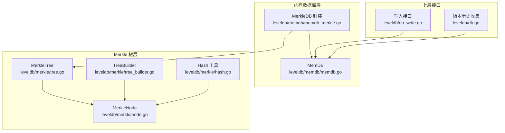
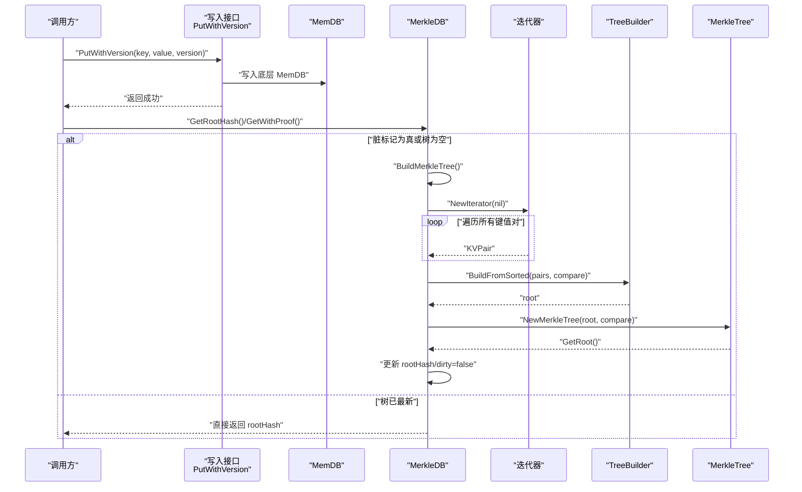
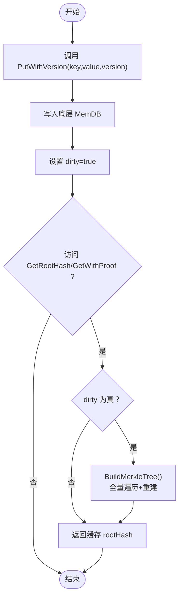
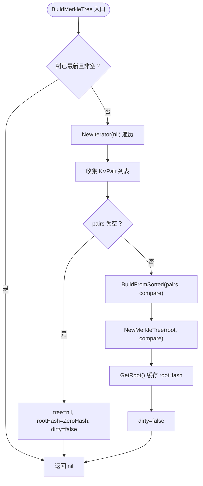
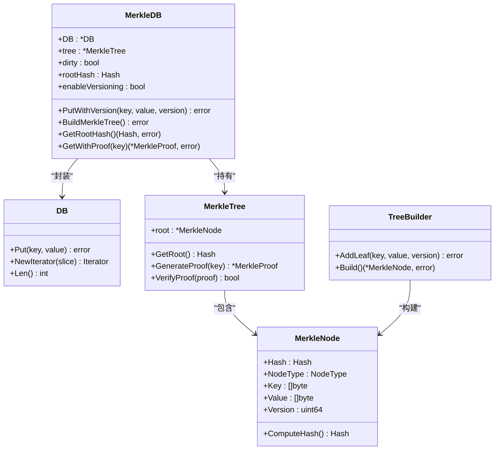

# 内存数据库中的Merkle树更新

<cite>
**本文引用的文件**
- [memdb_merkle.go](file://leveldb/memdb/memdb_merkle.go)
- [memdb.go](file://leveldb/memdb/memdb.go)
- [tree.go](file://leveldb/merkle/tree.go)
- [tree_builder.go](file://leveldb/merkle/tree_builder.go)
- [node.go](file://leveldb/merkle/node.go)
- [hash.go](file://leveldb/merkle/hash.go)
- [db_write.go](file://leveldb/db_write.go)
- [db.go](file://leveldb/db.go)
</cite>

## 目录
1. [引言](#引言)
2. [项目结构](#项目结构)
3. [核心组件](#核心组件)
4. [架构总览](#架构总览)
5. [详细组件分析](#详细组件分析)
6. [依赖关系分析](#依赖关系分析)
7. [性能考量](#性能考量)
8. [故障排查指南](#故障排查指南)
9. [结论](#结论)

## 引言
本文件围绕 avccDB 在内存数据库（MemDB）中实现的 Merkle 树更新机制进行系统化说明。重点阐述：
- MerkleDB.BuildMerkleTree 方法在脏标记（dirty flag）为 true 时，如何从内存中收集所有键值对并重新构建完整 Merkle 树；
- 脏标记的设置时机：每次 PutWithVersion 操作后如何触发树的重建需求；
- 如何通过迭代器遍历 MemDB 获取 KVPair 列表；
- BuildFromSorted 函数如何基于排序后的键值对生成新的 Merkle 根；
- 该机制对写入性能的影响以及适用场景。

## 项目结构
本节聚焦与 Merkle 树更新直接相关的模块：
- 内存数据库封装：leveldb/memdb/memdb_merkle.go 提供带 Merkle 支持的 MemDB；
- 原始 MemDB：leveldb/memdb/memdb.go 提供无版本控制的内存键值存储；
- Merkle 树实现：leveldb/merkle 下包含节点、树、构建器、哈希等；
- 版本化写入入口：leveldb/db_write.go 提供 PutWithVersion 接口；
- 版本历史收集：leveldb/db.go 中包含从 MemDB 收集版本历史的逻辑。

图表来源
- [memdb_merkle.go](file://leveldb/memdb/memdb_merkle.go#L1-L181)
- [memdb.go](file://leveldb/memdb/memdb.go#L1-L480)
- [tree.go](file://leveldb/merkle/tree.go#L1-L286)
- [tree_builder.go](file://leveldb/merkle/tree_builder.go#L1-L430)
- [node.go](file://leveldb/merkle/node.go#L1-L370)
- [hash.go](file://leveldb/merkle/hash.go#L1-L153)
- [db_write.go](file://leveldb/db_write.go#L387-L438)
- [db.go](file://leveldb/db.go#L995-L1017)

章节来源
- [memdb_merkle.go](file://leveldb/memdb/memdb_merkle.go#L1-L181)
- [memdb.go](file://leveldb/memdb/memdb.go#L1-L480)
- [tree.go](file://leveldb/merkle/tree.go#L1-L286)
- [tree_builder.go](file://leveldb/merkle/tree_builder.go#L1-L430)
- [node.go](file://leveldb/merkle/node.go#L1-L370)
- [hash.go](file://leveldb/merkle/hash.go#L1-L153)
- [db_write.go](file://leveldb/db_write.go#L387-L438)
- [db.go](file://leveldb/db.go#L995-L1017)

## 核心组件
- MerkleDB：在 MemDB 基础上增加 Merkle 树缓存、脏标记和版本化能力；提供 GetRootHash、GetWithProof 等接口。
- MerkleTree：维护树根、叶子索引、统计信息；支持存在/不存在证明生成与校验。
- TreeBuilder：自底向上构建平衡二叉 Merkle 树，支持从已排序 KV 对集合构建。
- MerkleNode/Hash：定义节点类型、哈希计算规则与序列化格式。
- MemDB：无版本控制的内存键值存储，提供迭代器用于全量遍历。
- 上层写入：PutWithVersion 通过批处理写入底层 MemDB，并触发 MerkleDB 的脏标记。

章节来源
- [memdb_merkle.go](file://leveldb/memdb/memdb_merkle.go#L1-L181)
- [tree.go](file://leveldb/merkle/tree.go#L1-L286)
- [tree_builder.go](file://leveldb/merkle/tree_builder.go#L1-L430)
- [node.go](file://leveldb/merkle/node.go#L1-L370)
- [hash.go](file://leveldb/merkle/hash.go#L1-L153)
- [memdb.go](file://leveldb/memdb/memdb.go#L1-L480)
- [db_write.go](file://leveldb/db_write.go#L387-L438)

## 架构总览
下图展示了写入到 Merkle 根生成的关键流程与组件交互。

图表来源
- [db_write.go](file://leveldb/db_write.go#L387-L438)
- [memdb_merkle.go](file://leveldb/memdb/memdb_merkle.go#L42-L124)
- [memdb.go](file://leveldb/memdb/memdb.go#L388-L409)
- [tree_builder.go](file://leveldb/merkle/tree_builder.go#L140-L151)
- [tree.go](file://leveldb/merkle/tree.go#L21-L38)

## 详细组件分析

### 1) 脏标记与重建触发
- 脏标记（dirty）初始为 true，确保首次访问时会构建树。
- 每次 PutWithVersion 成功写入底层 MemDB 后，立即设置 dirty=true，表示当前树不再反映最新状态。
- 当需要读取根哈希或生成证明时，若 dirty 为真，则执行 BuildMerkleTree 完成重建。

图表来源
- [memdb_merkle.go](file://leveldb/memdb/memdb_merkle.go#L42-L56)
- [memdb_merkle.go](file://leveldb/memdb/memdb_merkle.go#L58-L124)
- [db_write.go](file://leveldb/db_write.go#L387-L438)

章节来源
- [memdb_merkle.go](file://leveldb/memdb/memdb_merkle.go#L1-L181)
- [db_write.go](file://leveldb/db_write.go#L387-L438)

### 2) BuildMerkleTree 的工作流
- 若树已是最新的且非空，直接返回。
- 使用 MemDB.NewIterator 全量遍历，收集 KVPair（当前实现简化了版本提取，实际可从内部键解析）。
- 若无条目，清空树并置零根哈希。
- 否则调用 BuildFromSorted 将 KVPair 构建为平衡树，创建 MerkleTree 并缓存根哈希，最后将 dirty 置为 false。

图表来源
- [memdb_merkle.go](file://leveldb/memdb/memdb_merkle.go#L58-L124)
- [tree_builder.go](file://leveldb/merkle/tree_builder.go#L140-L151)
- [tree.go](file://leveldb/merkle/tree.go#L21-L38)

章节来源
- [memdb_merkle.go](file://leveldb/memdb/memdb_merkle.go#L58-L124)
- [tree_builder.go](file://leveldb/merkle/tree_builder.go#L140-L151)
- [tree.go](file://leveldb/merkle/tree.go#L21-L38)

### 3) 迭代器遍历与 KVPair 收集
- 通过 MemDB.NewIterator 创建迭代器，遍历所有键值对。
- 将每个键值复制到 KVPair 中；版本字段当前为简化实现（注释提示应从内部键解析）。
- 该过程的时间复杂度近似 O(N)，空间复杂度 O(N)。

章节来源
- [memdb_merkle.go](file://leveldb/memdb/memdb_merkle.go#L68-L86)
- [memdb.go](file://leveldb/memdb/memdb.go#L388-L409)

### 4) BuildFromSorted 与树重建
- BuildFromSorted 接收已排序的 KVPair 列表，交由 TreeBuilder 自底向上构建平衡树。
- TreeBuilder.Build 采用配对向上法，保证树高度平衡，时间复杂度 O(N)。
- MerkleTree.NewMerkleTree 构造后建立叶子映射，便于后续证明生成。

章节来源
- [tree_builder.go](file://leveldb/merkle/tree_builder.go#L140-L151)
- [tree_builder.go](file://leveldb/merkle/tree_builder.go#L82-L131)
- [tree.go](file://leveldb/merkle/tree.go#L21-L38)

### 5) Merkle 树节点与哈希
- MerkleNode 定义叶子与内部节点，支持按版本计算哈希（HashWithVersion）。
- HashLeaf/HashInternal/HashWithVersion 统一哈希格式，保证跨层聚合时的确定性。
- MerkleTree.GenerateProof 支持存在/不存在证明生成，Verify 用于校验。

章节来源
- [node.go](file://leveldb/merkle/node.go#L1-L120)
- [hash.go](file://leveldb/merkle/hash.go#L68-L105)
- [tree.go](file://leveldb/merkle/tree.go#L85-L121)

### 6) 版本化写入与内部键编码
- PutWithVersion 通过批处理写入底层 MemDB，内部键编码包含用户键与版本号，便于后续版本历史收集与去重。
- 版本历史收集函数会解析内部键，按版本降序排列，保留最新版本。

章节来源
- [db_write.go](file://leveldb/db_write.go#L387-L438)
- [db.go](file://leveldb/db.go#L995-L1017)

## 依赖关系分析
- MerkleDB 依赖 MemDB 进行数据存储与全量遍历；
- MerkleDB 依赖 MerkleTree/TreeBuilder/Node/Hash 实现树构建与证明；
- 上层写入接口通过批处理写入 MemDB，触发脏标记；
- 版本历史收集依赖内部键解析，确保同一用户键的多版本有序。

图表来源
- [memdb_merkle.go](file://leveldb/memdb/memdb_merkle.go#L1-L181)
- [memdb.go](file://leveldb/memdb/memdb.go#L1-L480)
- [tree.go](file://leveldb/merkle/tree.go#L1-L286)
- [tree_builder.go](file://leveldb/merkle/tree_builder.go#L1-L430)
- [node.go](file://leveldb/merkle/node.go#L1-L370)

章节来源
- [memdb_merkle.go](file://leveldb/memdb/memdb_merkle.go#L1-L181)
- [memdb.go](file://leveldb/memdb/memdb.go#L1-L480)
- [tree.go](file://leveldb/merkle/tree.go#L1-L286)
- [tree_builder.go](file://leveldb/merkle/tree_builder.go#L1-L430)
- [node.go](file://leveldb/merkle/node.go#L1-L370)

## 性能考量
- 写入路径
  - PutWithVersion 仅写入底层 MemDB，时间复杂度近似 O(1)（忽略锁开销）。
  - 设置 dirty=true 为常数时间。
- 读取路径
  - GetRootHash/GetWithProof 在 dirty 为真时触发全量重建，时间复杂度 O(N)。
  - MerkleTree.GenerateProof 为 O(h)，h 为树高，平衡树高度约为 O(log N)。
- 内存占用
  - 全量遍历与 KVPair 列表占用 O(N) 额外内存。
  - TreeBuilder 自底向上构建，栈与中间节点占用 O(N)。
- 优化建议
  - 若写入频繁而读取较少，可考虑批量写入后再触发一次重建，减少 dirty 触发次数。
  - 对于超大 MemDB，可评估分片或增量更新策略（当前实现为全量重建）。
  - 证明生成与校验为轻量级操作，适合在线验证场景。

[本节为通用性能讨论，不直接分析具体文件]

## 故障排查指南
- 症状：GetRootHash 返回零哈希
  - 可能原因：MemDB 为空或 BuildMerkleTree 未被调用。
  - 排查步骤：确认是否执行过 PutWithVersion；检查 dirty 状态；调用 GetRootHash 触发重建。
- 症状：GetWithProof 报错“空树”
  - 可能原因：树尚未构建或底层 MemDB 为空。
  - 排查步骤：先写入数据再请求证明；确认 BuildMerkleTree 成功。
- 症状：版本历史不正确
  - 可能原因：内部键编码或版本排序逻辑异常。
  - 排查步骤：核对 PutWithVersion 的内部键构造；检查版本历史收集函数的解析顺序。

章节来源
- [memdb_merkle.go](file://leveldb/memdb/memdb_merkle.go#L108-L147)
- [tree.go](file://leveldb/merkle/tree.go#L85-L121)
- [db.go](file://leveldb/db.go#L995-L1017)

## 结论
- avccDB 的 MemDB+MerkleDB 通过脏标记实现了“懒重建”策略：只有在读取根哈希或生成证明时才全量重建 Merkle 树，避免每次写入都产生昂贵的树更新。
- PutWithVersion 操作后立即设置脏标记，确保后续读取得到最新状态；迭代器遍历 MemDB 收集 KVPair，BuildFromSorted 以 O(N) 时间构建平衡树。
- 该机制在写入性能与读取可用性之间取得平衡，适用于需要在线证明与状态快照的场景；对于极高写入吞吐的场景，可结合批量写入与延迟重建策略进一步优化。