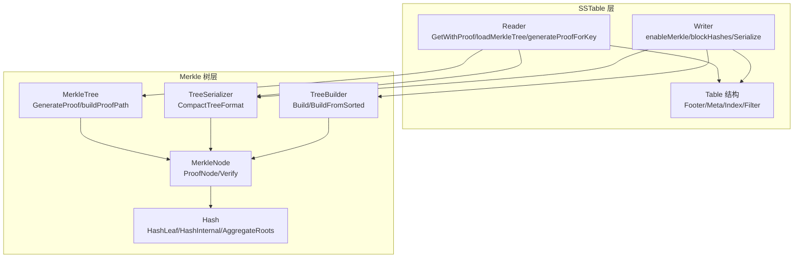
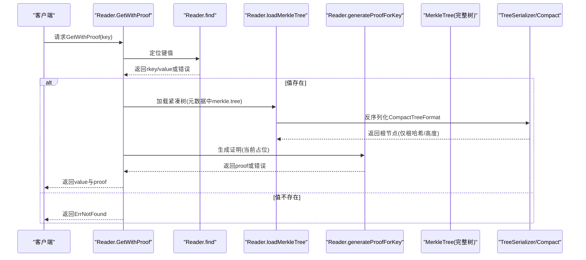
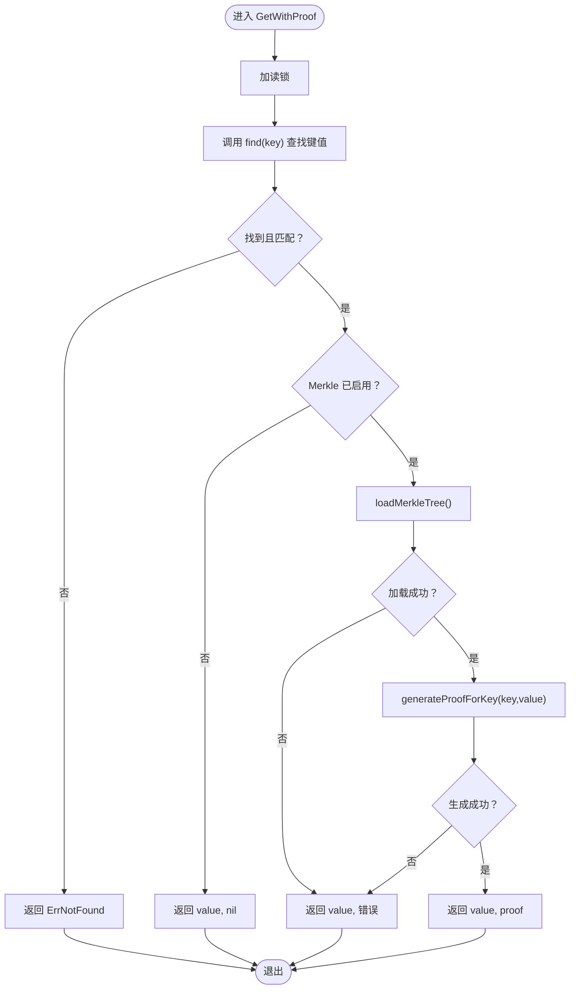
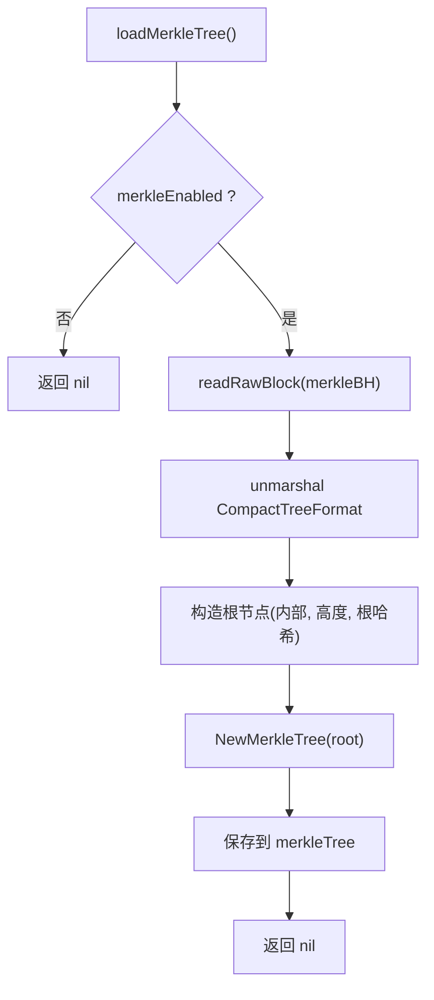
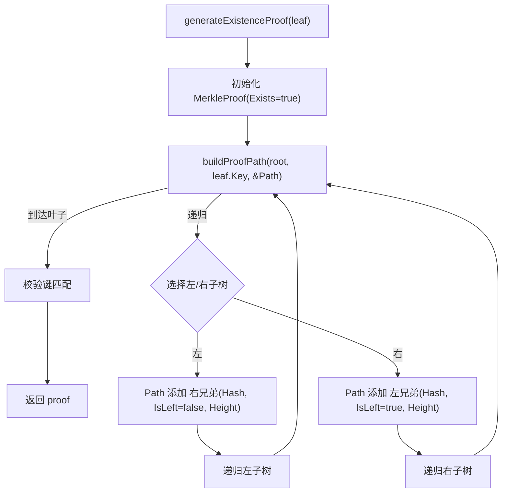
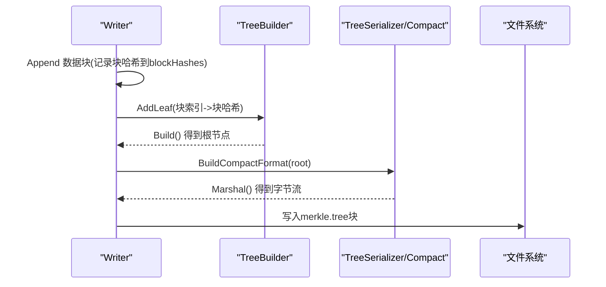
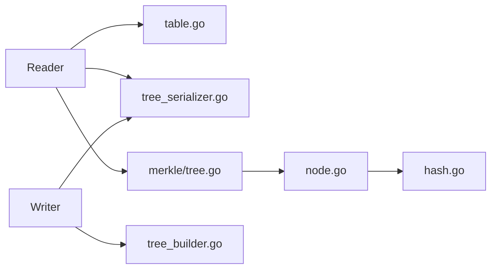

# SSTable证明生成

<cite>
**本文引用的文件**
- [leveldb/table/reader.go](file://leveldb/table/reader.go)
- [leveldb/table/writer.go](file://leveldb/table/writer.go)
- [leveldb/table/table.go](file://leveldb/table/table.go)
- [leveldb/merkle/tree.go](file://leveldb/merkle/tree.go)
- [leveldb/merkle/node.go](file://leveldb/merkle/node.go)
- [leveldb/merkle/hash.go](file://leveldb/merkle/hash.go)
- [leveldb/merkle/tree_serializer.go](file://leveldb/merkle/tree_serializer.go)
- [leveldb/merkle/tree_builder.go](file://leveldb/merkle/tree_builder.go)
- [leveldb/table/reader_merkle_test.go](file://leveldb/table/reader_merkle_test.go)
</cite>

## 目录
1. [引言](#引言)
2. [项目结构](#项目结构)
3. [核心组件](#核心组件)
4. [架构总览](#架构总览)
5. [详细组件分析](#详细组件分析)
6. [依赖关系分析](#依赖关系分析)
7. [性能考量](#性能考量)
8. [故障排查指南](#故障排查指南)
9. [结论](#结论)
10. [附录](#附录)

## 引言
本文件面向avccDB中SSTable层级的“证明生成”流程，聚焦于Reader.GetWithProof方法在成功读取值后如何加载预计算的Merkle树，并通过generateProofForKey构建从叶节点到根节点的路径证明；解释findWithProof函数在表层如何协调值查找与证明获取；当Merkle功能未启用时的降级策略；generateExistenceProof与buildProofPath如何协作构建证明路径（包含兄弟节点哈希、方向标志与高度信息）；SSTable Merkle树的序列化结构说明；以及证明路径在跨层验证中的作用。

## 项目结构
围绕SSTable Merkle证明生成的关键代码分布在以下模块：
- 表读取：leveldb/table/reader.go（含GetWithProof、loadMerkleTree、generateProofForKey等）
- 表写入：leveldb/table/writer.go（含enableMerkle、blockHashes、Merkele树序列化与落盘）
- Merkle树模型与算法：leveldb/merkle/*.go（树节点、证明结构、序列化、哈希、树构建器）
- 表格式与元数据：leveldb/table/table.go（SST结构、块句柄、尾部布局）
- 单元测试：leveldb/table/reader_merkle_test.go（覆盖GetWithProof、无Merkle降级）

图表来源
- [leveldb/table/reader.go](file://leveldb/table/reader.go#L1004-L1157)
- [leveldb/table/writer.go](file://leveldb/table/writer.go#L346-L396)
- [leveldb/table/table.go](file://leveldb/table/table.go#L144-L174)
- [leveldb/merkle/tree.go](file://leveldb/merkle/tree.go#L103-L166)
- [leveldb/merkle/node.go](file://leveldb/merkle/node.go#L98-L153)
- [leveldb/merkle/hash.go](file://leveldb/merkle/hash.go#L68-L112)
- [leveldb/merkle/tree_serializer.go](file://leveldb/merkle/tree_serializer.go#L261-L377)
- [leveldb/merkle/tree_builder.go](file://leveldb/merkle/tree_builder.go#L82-L131)

章节来源
- [leveldb/table/reader.go](file://leveldb/table/reader.go#L1004-L1157)
- [leveldb/table/writer.go](file://leveldb/table/writer.go#L346-L396)
- [leveldb/table/table.go](file://leveldb/table/table.go#L144-L174)

## 核心组件
- Reader.GetWithProof：在成功定位键值后，若启用Merkle，则加载紧凑格式的树并生成证明；否则仅返回值。
- Reader.loadMerkleTree：从元数据块中解析出Merkle树元数据（紧凑格式），构造只包含根哈希与高度的轻量树以支持证明生成。
- Reader.generateProofForKey：基于已知的根哈希与目标键值，生成证明（当前实现为占位，后续可扩展为扫描数据块定位叶位置并重建路径）。
- MerkleTree.GenerateProof/buildProofPath：在完整树上生成存在性证明，收集兄弟节点哈希、方向标志与高度信息。
- Writer.enableMerkle/blockHashes：按数据块哈希构建平衡二叉树，序列化为紧凑格式并写入SST元数据。
- Table元数据与块句柄：元数据块记录“merkle.tree”的块句柄，索引块用于定位数据块，过滤块可选。

章节来源
- [leveldb/table/reader.go](file://leveldb/table/reader.go#L1041-L1157)
- [leveldb/merkle/tree.go](file://leveldb/merkle/tree.go#L85-L166)
- [leveldb/table/writer.go](file://leveldb/table/writer.go#L346-L396)
- [leveldb/table/table.go](file://leveldb/table/table.go#L144-L174)

## 架构总览
SSTable Merkle证明生成的整体流程如下：
- 写入阶段：Writer收集每个数据块的哈希，使用TreeBuilder构建平衡二叉树，序列化为CompactTreeFormat并写入“merkle.tree”元数据块。
- 读取阶段：Reader初始化时解析元数据，发现“merkle.tree”后标记启用Merkle；GetWithProof先执行标准查找，再加载紧凑树，最后生成证明（当前占位，后续扩展）。
- 证明结构：MerkleProof包含Key、Value、Version、Root与Path；Path由兄弟节点哈希、方向标志(IsLeft)与高度组成，用于向上回推至根。

图表来源
- [leveldb/table/reader.go](file://leveldb/table/reader.go#L1041-L1157)
- [leveldb/merkle/tree_serializer.go](file://leveldb/merkle/tree_serializer.go#L261-L377)

## 详细组件分析

### Reader.GetWithProof：值查找与证明生成
- 控制流要点
  - 先调用find进行标准查找，确保键存在且匹配。
  - 若未启用Merkle，直接返回值，不生成证明。
  - 启用Merkle时，先loadMerkleTree加载紧凑树；随后调用generateProofForKey生成证明（当前实现为占位，返回带根哈希的基本证明）。
  - 若加载失败，仍返回值但携带错误。
- 降级策略
  - 当merkleEnabled=false或加载失败时，GetWithProof仅返回值，proof为nil或错误，保证兼容性。

图表来源
- [leveldb/table/reader.go](file://leveldb/table/reader.go#L1041-L1157)

章节来源
- [leveldb/table/reader.go](file://leveldb/table/reader.go#L1041-L1157)

### Reader.loadMerkleTree：紧凑树加载
- 元数据解析：Reader初始化时扫描元数据块，若存在“merkle.tree”，则记录其块句柄并标记merkleEnabled=true。
- 紧凑格式反序列化：读取该块，使用CompactTreeFormat.Unmarshal解析根哈希、高度与内部节点哈希数组。
- 轻量树构造：仅保留根节点（内部类型），高度与根哈希来自紧凑格式，用于后续证明生成。

图表来源
- [leveldb/table/reader.go](file://leveldb/table/reader.go#L1004-L1039)
- [leveldb/merkle/tree_serializer.go](file://leveldb/merkle/tree_serializer.go#L261-L377)

章节来源
- [leveldb/table/reader.go](file://leveldb/table/reader.go#L1004-L1039)
- [leveldb/merkle/tree_serializer.go](file://leveldb/merkle/tree_serializer.go#L261-L377)

### generateExistenceProof 与 buildProofPath：证明路径构建
- generateExistenceProof
  - 输入：叶子节点
  - 输出：MerkleProof（Key/Value/Version/Root/Exists=true，Path为空）
  - 调用buildProofPath自底向上收集路径节点
- buildProofPath
  - 递归遍历树，比较目标键与左右子树边界，决定进入哪一侧
  - 每次移动前，将另一侧的兄弟节点哈希、方向标志(IsLeft)与高度加入Path
  - 到达叶子时校验键是否匹配，否则返回“键不存在”错误
- 证明验证
  - ProofNode包含Hash、IsLeft、Height
  - MerkleProof.Verify从叶哈希开始，逐层用兄弟节点哈希与当前节点哈希组合计算父哈希，最终与Root比对

图表来源
- [leveldb/merkle/tree.go](file://leveldb/merkle/tree.go#L103-L166)
- [leveldb/merkle/node.go](file://leveldb/merkle/node.go#L98-L153)

章节来源
- [leveldb/merkle/tree.go](file://leveldb/merkle/tree.go#L103-L166)
- [leveldb/merkle/node.go](file://leveldb/merkle/node.go#L98-L153)

### Writer端：Merkle树构建与序列化
- enableMerkle：Writer在关闭时根据配置决定是否构建Merkle树
- blockHashes：Writer在写入每个数据块后计算块哈希并收集
- TreeBuilder：按平衡二叉树方式构建，确保树高最小化
- 序列化：使用TreeBuilder.Build生成根节点，再用BuildCompactFormat.Marshal输出紧凑格式，写入“merkle.tree”元数据块
- 写入顺序：先写入数据块与索引块，再写入过滤块（可选），最后写入merkle.tree

图表来源
- [leveldb/table/writer.go](file://leveldb/table/writer.go#L346-L396)
- [leveldb/merkle/tree_builder.go](file://leveldb/merkle/tree_builder.go#L82-L131)
- [leveldb/merkle/tree_serializer.go](file://leveldb/merkle/tree_serializer.go#L261-L377)

章节来源
- [leveldb/table/writer.go](file://leveldb/table/writer.go#L346-L396)
- [leveldb/merkle/tree_builder.go](file://leveldb/merkle/tree_builder.go#L82-L131)
- [leveldb/merkle/tree_serializer.go](file://leveldb/merkle/tree_serializer.go#L261-L377)

### Merkle树序列化结构说明
- 文件头：魔数与版本号
- 节点编码：节点头（类型、哈希、高度），叶子节点额外包含版本、键长、值长与数据；内部节点额外包含左右偏移
- 紧凑格式：仅存储根哈希、树高与内部节点哈希数组，便于Reader端快速加载并生成证明
- 反序列化：TreeDeserializer按偏移读取节点头，再读取完整节点，缓存以复用

章节来源
- [leveldb/merkle/tree_serializer.go](file://leveldb/merkle/tree_serializer.go#L1-L120)
- [leveldb/merkle/node.go](file://leveldb/merkle/node.go#L154-L231)
- [leveldb/merkle/tree_serializer.go](file://leveldb/merkle/tree_serializer.go#L121-L217)

### 跨层验证中的证明路径
- CombineWithLayerProof：将某一层（如SST）的证明与该层根哈希合并，形成更高层的聚合证明
- AggregateRoots：对多个层根哈希进行确定性聚合，得到上层的MasterRoot
- 多层证明合并：MergeProofs将来自不同层的证明路径拼接，Root聚合为上层根，用于跨层验证

章节来源
- [leveldb/merkle/node.go](file://leveldb/merkle/node.go#L299-L369)
- [leveldb/merkle/hash.go](file://leveldb/merkle/hash.go#L127-L153)

## 依赖关系分析
- Reader依赖
  - table/table.go：块句柄、尾部布局、元数据块解析
  - merkle/tree_serializer.go：紧凑格式反序列化
  - merkle/tree.go：MerkleTree接口（当前Reader仅使用根哈希）
- Writer依赖
  - merkle/tree_builder.go：平衡树构建
  - merkle/tree_serializer.go：紧凑格式序列化
- Merkle层内部
  - node.go定义节点与证明结构
  - hash.go提供哈希工具与聚合

图表来源
- [leveldb/table/reader.go](file://leveldb/table/reader.go#L1004-L1157)
- [leveldb/table/writer.go](file://leveldb/table/writer.go#L346-L396)
- [leveldb/table/table.go](file://leveldb/table/table.go#L144-L174)
- [leveldb/merkle/tree_serializer.go](file://leveldb/merkle/tree_serializer.go#L261-L377)
- [leveldb/merkle/tree.go](file://leveldb/merkle/tree.go#L103-L166)
- [leveldb/merkle/node.go](file://leveldb/merkle/node.go#L98-L153)
- [leveldb/merkle/hash.go](file://leveldb/merkle/hash.go#L68-L112)

章节来源
- [leveldb/table/reader.go](file://leveldb/table/reader.go#L1004-L1157)
- [leveldb/table/writer.go](file://leveldb/table/writer.go#L346-L396)
- [leveldb/table/table.go](file://leveldb/table/table.go#L144-L174)
- [leveldb/merkle/tree_serializer.go](file://leveldb/merkle/tree_serializer.go#L261-L377)
- [leveldb/merkle/tree.go](file://leveldb/merkle/tree.go#L103-L166)
- [leveldb/merkle/node.go](file://leveldb/merkle/node.go#L98-L153)
- [leveldb/merkle/hash.go](file://leveldb/merkle/hash.go#L68-L112)

## 性能考量
- 紧凑树加载：Reader仅加载根哈希与高度，避免全树反序列化，降低内存占用与I/O开销
- 平衡树构建：TreeBuilder采用自底向上的配对方式，时间复杂度O(n)，空间开销可控
- 证明生成：当前Reader.generateProofForKey为占位实现，建议在后续优化中结合数据块索引与叶位置定位，减少扫描范围
- 跨层聚合：CombineWithLayerProof与AggregateRoots采用线性聚合，适合多层合并场景

## 故障排查指南
- GetWithProof返回ErrNotFound
  - 可能原因：键不存在或find阶段未命中
  - 排查：确认key与比较器一致，检查索引块与数据块边界
- GetWithProof返回值但proof为nil
  - 可能原因：merkleEnabled=false或loadMerkleTree失败
  - 排查：确认元数据中存在“merkle.tree”条目，检查merkleBH与紧凑格式解析
- Merkle树加载失败
  - 可能原因：紧凑格式损坏、块句柄无效、校验失败
  - 排查：查看ErrCorrupted错误上下文，核对块类型与校验和

章节来源
- [leveldb/table/reader.go](file://leveldb/table/reader.go#L1004-L1157)
- [leveldb/table/reader_merkle_test.go](file://leveldb/table/reader_merkle_test.go#L1-L181)

## 结论
- Reader.GetWithProof在成功定位键值后，优先加载紧凑格式的Merkle树，随后生成证明；若未启用Merkle或加载失败，仍返回值并携带错误，确保兼容性。
- MerkleTree.GenerateProof与buildProofPath提供了存在性证明的完整路径，包含兄弟节点哈希、方向标志与高度，可用于向上回推至根。
- Writer端通过TreeBuilder与TreeSerializer将数据块哈希映射为平衡二叉树，并以紧凑格式持久化，支撑SSTable层级的证明生成。
- 跨层验证可通过CombineWithLayerProof与AggregateRoots实现，将多层证明与根哈希聚合为更高层的MasterRoot，满足数据库级一致性验证需求。

## 附录
- 关键API与路径
  - Reader.GetWithProof：[leveldb/table/reader.go](file://leveldb/table/reader.go#L1041-L1157)
  - Reader.loadMerkleTree：[leveldb/table/reader.go](file://leveldb/table/reader.go#L1004-L1039)
  - Reader.generateProofForKey：[leveldb/table/reader.go](file://leveldb/table/reader.go#L1128-L1157)
  - MerkleTree.GenerateProof/buildProofPath：[leveldb/merkle/tree.go](file://leveldb/merkle/tree.go#L85-L166)
  - Writer.enableMerkle/blockHashes：[leveldb/table/writer.go](file://leveldb/table/writer.go#L346-L396)
  - 紧凑格式序列化/反序列化：[leveldb/merkle/tree_serializer.go](file://leveldb/merkle/tree_serializer.go#L261-L377)
  - Merkle证明结构与验证：[leveldb/merkle/node.go](file://leveldb/merkle/node.go#L98-L153)
  - 哈希工具与聚合：[leveldb/merkle/hash.go](file://leveldb/merkle/hash.go#L68-L112)