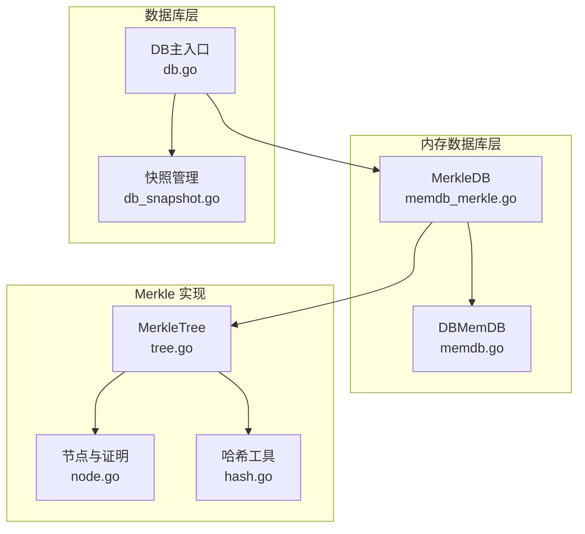
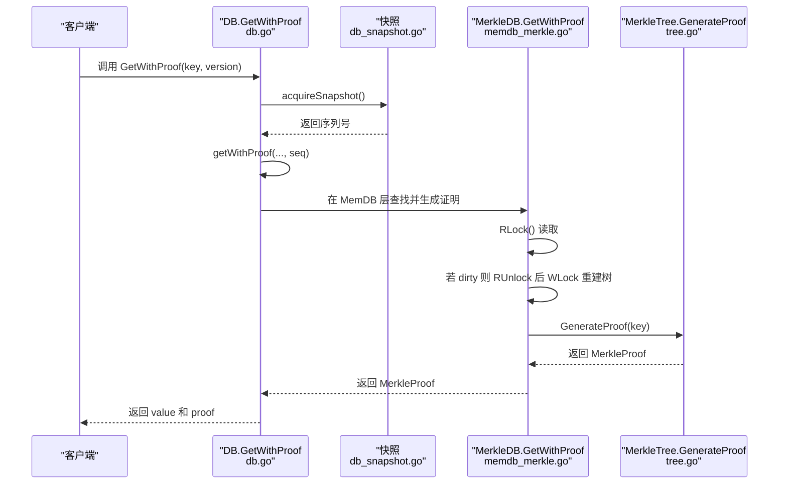
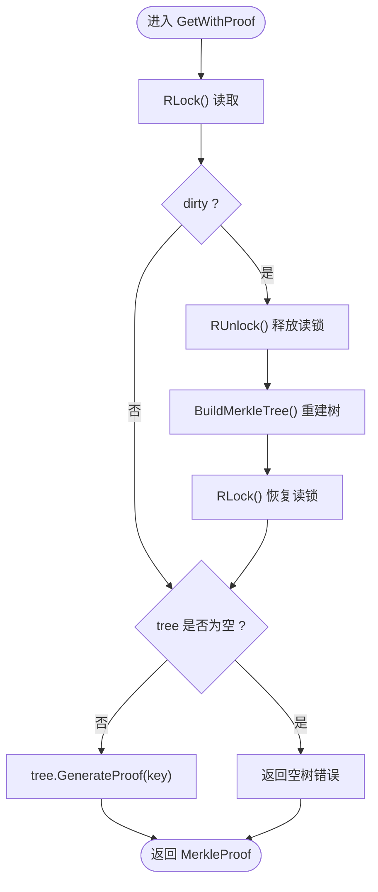
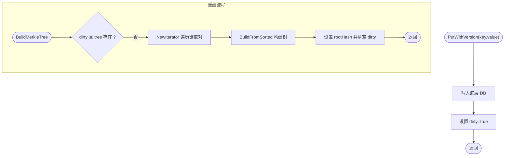
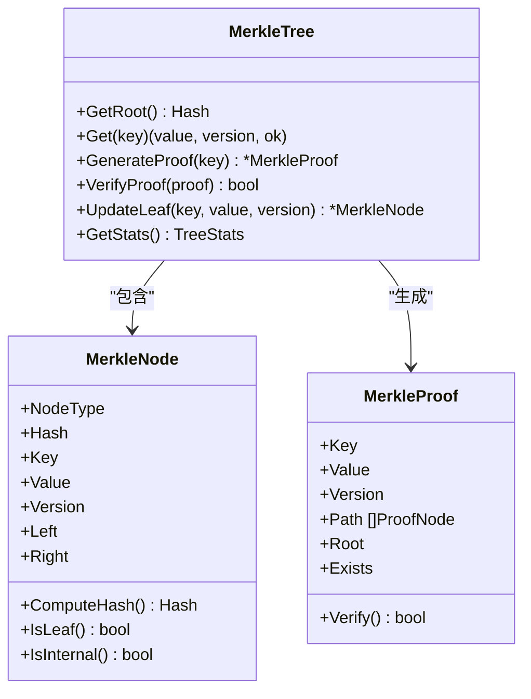
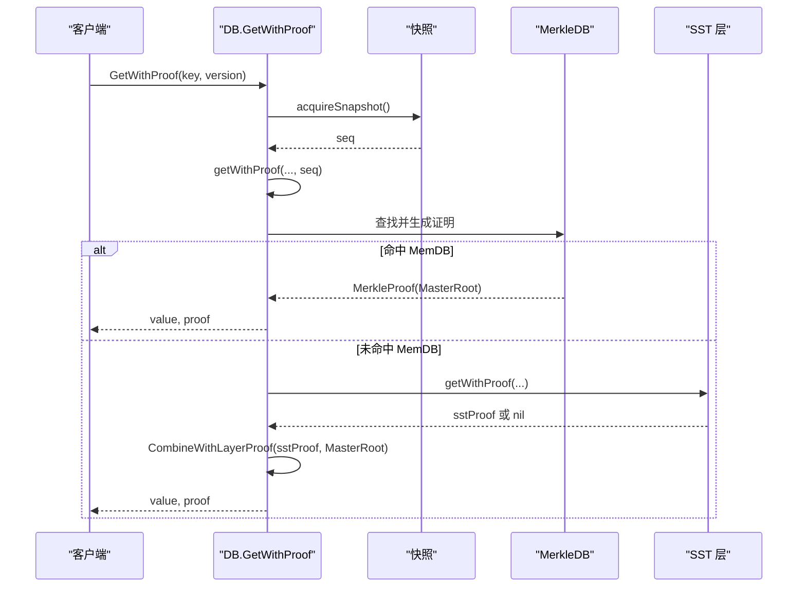
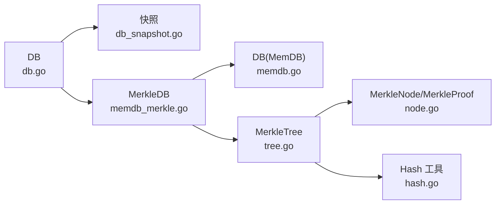

# 内存数据库证明生成

<cite>
**本文引用的文件**
- [memdb_merkle.go](file://leveldb/memdb/memdb_merkle.go)
- [memdb.go](file://leveldb/memdb/memdb.go)
- [db.go](file://leveldb/db.go)
- [db_snapshot.go](file://leveldb/db_snapshot.go)
- [tree.go](file://leveldb/merkle/tree.go)
- [node.go](file://leveldb/merkle/node.go)
- [hash.go](file://leveldb/merkle/hash.go)
- [mlsm_final_comprehensive_test.go](file://leveldb/mlsm_final_comprehensive_test.go)
</cite>

## 目录
1. [简介](#简介)
2. [项目结构](#项目结构)
3. [核心组件](#核心组件)
4. [架构总览](#架构总览)
5. [详细组件分析](#详细组件分析)
6. [依赖关系分析](#依赖关系分析)
7. [性能考量](#性能考量)
8. [故障排查指南](#故障排查指南)
9. [结论](#结论)

## 简介
本文件围绕 avccDB 中内存数据库（MemDB）的 Merkle 证明生成机制进行系统化说明，重点覆盖：
- MerkleDB.GetWithProof 在读取锁保护下生成 Merkle 证明的流程；
- 脏状态（dirty）触发 BuildMerkleTree 自动重建树结构的机制；
- 内存中数据变化时，通过 dirty 标志控制树重建的策略；
- GetWithProof 在调用 GenerateProof 前确保树已构建的同步机制；
- 从 DB.GetWithProof 到 MemDB 层的调用链路，以及快照隔离与证明生成的协作关系。

## 项目结构
本主题涉及的关键模块包括：
- 内存数据库与 Merkle 支持：leveldb/memdb/memdb_merkle.go、leveldb/memdb/memdb.go
- 数据库主入口与快照：leveldb/db.go、leveldb/db_snapshot.go
- Merkle 树实现与证明：leveldb/merkle/tree.go、leveldb/merkle/node.go、leveldb/merkle/hash.go
- 综合测试与使用示例：leveldb/mlsm_final_comprehensive_test.go

图表来源
- [memdb_merkle.go](file://leveldb/memdb/memdb_merkle.go#L1-L181)
- [memdb.go](file://leveldb/memdb/memdb.go#L1-L480)
- [db.go](file://leveldb/db.go#L1127-L1146)
- [db_snapshot.go](file://leveldb/db_snapshot.go#L1-L188)
- [tree.go](file://leveldb/merkle/tree.go#L1-L286)
- [node.go](file://leveldb/merkle/node.go#L1-L370)
- [hash.go](file://leveldb/merkle/hash.go#L1-L153)

章节来源
- [memdb_merkle.go](file://leveldb/memdb/memdb_merkle.go#L1-L181)
- [memdb.go](file://leveldb/memdb/memdb.go#L1-L480)
- [db.go](file://leveldb/db.go#L1127-L1146)
- [db_snapshot.go](file://leveldb/db_snapshot.go#L1-L188)
- [tree.go](file://leveldb/merkle/tree.go#L1-L286)
- [node.go](file://leveldb/merkle/node.go#L1-L370)
- [hash.go](file://leveldb/merkle/hash.go#L1-L153)

## 核心组件
- MerkleDB：在 MemDB 基础上增加 Merkle 树支持，包含读写锁、树对象、脏标记和根哈希缓存。
- MerkleTree：提供生成存在/不存在证明、校验证明、统计信息等能力。
- DB.GetWithProof：对外提供带证明的读取接口，内部结合快照与各层数据源（含 MemDB）生成跨层证明。
- 快照：保证读取期间的数据一致性，避免并发写入对证明生成的影响。

章节来源
- [memdb_merkle.go](file://leveldb/memdb/memdb_merkle.go#L1-L181)
- [tree.go](file://leveldb/merkle/tree.go#L1-L286)
- [db.go](file://leveldb/db.go#L1127-L1146)
- [db_snapshot.go](file://leveldb/db_snapshot.go#L1-L188)

## 架构总览
从应用调用到最终返回证明的整体流程如下：

图表来源
- [db.go](file://leveldb/db.go#L1127-L1146)
- [db_snapshot.go](file://leveldb/db_snapshot.go#L1-L188)
- [memdb_merkle.go](file://leveldb/memdb/memdb_merkle.go#L126-L147)
- [tree.go](file://leveldb/merkle/tree.go#L85-L121)

## 详细组件分析

### MerkleDB：读取锁保护下的证明生成
- 读取路径要点
  - 使用 RWMutex 保护读取，先加读锁，再检查 dirty 标记。
  - 若 dirty 为真，先释放读锁，再获取写锁重建树；重建完成后恢复读锁继续后续流程。
  - 生成证明前确保树非空，否则返回“空树”错误。
- 脏状态与重建
  - dirty 由写操作（如 PutWithVersion）置位，表示当前树与内存状态不一致。
  - BuildMerkleTree 会遍历 MemDB 的所有键值对，构建 Merkle 树并更新 rootHash。
- 证明生成
  - 调用 MerkleTree.GenerateProof(key)，内部根据是否存在目标键生成存在或不存在证明。

图表来源
- [memdb_merkle.go](file://leveldb/memdb/memdb_merkle.go#L126-L147)
- [tree.go](file://leveldb/merkle/tree.go#L85-L121)

章节来源
- [memdb_merkle.go](file://leveldb/memdb/memdb_merkle.go#L126-L147)

### 脏状态与自动重建：PutWithVersion 与 BuildMerkleTree
- 写入触发
  - PutWithVersion 在写入底层 MemDB 成功后，设置 dirty=true，标记树需要重建。
- 重建策略
  - BuildMerkleTree 在写锁下执行，收集当前 MemDB 所有键值对，按比较器排序后构建 Merkle 树。
  - 若无条目，清空树并重置 rootHash。
  - 更新 rootHash 并清除 dirty 标志。
- 版本处理
  - 当前实现对版本字段的提取为简化逻辑，实际内部键编码会在更高层处理。

图表来源
- [memdb_merkle.go](file://leveldb/memdb/memdb_merkle.go#L42-L106)
- [memdb.go](file://leveldb/memdb/memdb.go#L273-L315)

章节来源
- [memdb_merkle.go](file://leveldb/memdb/memdb_merkle.go#L42-L106)
- [memdb.go](file://leveldb/memdb/memdb.go#L273-L315)

### MerkleTree：证明生成与校验
- 生成证明
  - GenerateProof 根据键是否存在，分别调用存在或不存在证明生成函数。
  - 存在证明：沿从叶到根的路径收集兄弟节点哈希，形成路径证明。
  - 不存在证明：当前实现返回基础结构（完整实现可基于相邻键边界）。
- 校验证明
  - Verify 将叶子哈希逐层与路径中的兄弟节点哈希重组，最终与根哈希比对。
- 节点与哈希
  - 节点类型区分叶子与内部节点，哈希计算包含不同标记字节以确保安全性。
  - 叶子哈希支持带版本号的变体，便于版本化场景。

图表来源
- [tree.go](file://leveldb/merkle/tree.go#L1-L286)
- [node.go](file://leveldb/merkle/node.go#L1-L370)
- [hash.go](file://leveldb/merkle/hash.go#L1-L153)

章节来源
- [tree.go](file://leveldb/merkle/tree.go#L85-L121)
- [node.go](file://leveldb/merkle/node.go#L98-L153)
- [hash.go](file://leveldb/merkle/hash.go#L68-L105)

### 从 DB.GetWithProof 到 MemDB 的调用链与快照协作
- 快照隔离
  - DB.GetWithProof 先获取快照，使用快照序列号作为读取基准，保证读取期间的全局一致性。
- 层级查找与证明合成
  - getWithProof 依次尝试辅助 MemDB、有效/冻结 MemDB，若命中则直接返回值与证明（当前实现返回包含 MasterRoot 的简单证明）。
  - 若未命中 MemDB，则从 SST 层获取证明并结合 MasterRoot 进行合并。
- MemDB 层证明
  - MemDB.GetWithProof 在读锁保护下生成证明，必要时重建树，确保证明基于一致的状态。

图表来源
- [db.go](file://leveldb/db.go#L1127-L1146)
- [db.go](file://leveldb/db.go#L835-L932)
- [db_snapshot.go](file://leveldb/db_snapshot.go#L1-L188)
- [memdb_merkle.go](file://leveldb/memdb/memdb_merkle.go#L126-L147)
- [node.go](file://leveldb/merkle/node.go#L347-L369)

章节来源
- [db.go](file://leveldb/db.go#L1127-L1146)
- [db.go](file://leveldb/db.go#L835-L932)
- [db_snapshot.go](file://leveldb/db_snapshot.go#L1-L188)
- [memdb_merkle.go](file://leveldb/memdb/memdb_merkle.go#L126-L147)
- [node.go](file://leveldb/merkle/node.go#L347-L369)

## 依赖关系分析
- 组件耦合
  - MerkleDB 依赖 MemDB（DB）与 MerkleTree，通过读写锁协调并发访问。
  - DB 层通过快照隔离读取，再在各层（MemDB/SST）查找并合成证明。
- 外部依赖
  - MerkleTree 依赖哈希工具与节点定义，提供证明生成与校验。
- 潜在循环依赖
  - 当前结构清晰，未见循环导入；MerkleTree 与 DB 层通过接口参数传递，避免直接循环引用。

图表来源
- [db.go](file://leveldb/db.go#L1127-L1146)
- [db_snapshot.go](file://leveldb/db_snapshot.go#L1-L188)
- [memdb_merkle.go](file://leveldb/memdb/memdb_merkle.go#L1-L181)
- [memdb.go](file://leveldb/memdb/memdb.go#L1-L480)
- [tree.go](file://leveldb/merkle/tree.go#L1-L286)
- [node.go](file://leveldb/merkle/node.go#L1-L370)
- [hash.go](file://leveldb/merkle/hash.go#L1-L153)

章节来源
- [db.go](file://leveldb/db.go#L1127-L1146)
- [memdb_merkle.go](file://leveldb/memdb/memdb_merkle.go#L1-L181)
- [tree.go](file://leveldb/merkle/tree.go#L1-L286)

## 性能考量
- 锁竞争
  - 读多写少场景下，RLock 提升并发度；当 dirty 为真时需降级为 WLock 重建树，可能带来短暂阻塞。
- 重建成本
  - BuildMerkleTree 需要遍历 MemDB 全量键值对并排序后重建，复杂度与条目数相关；建议批量写入减少重建次数。
- 缓存与索引
  - MerkleTree 内部维护叶节点映射，加速定位；GetRootHash 与 GetMerkleStats 提供缓存与统计信息，有助于监控与优化。
- 证明生成
  - GenerateProof 仅在已构建树的情况下进行，路径长度与树高相关；保持树平衡可降低证明路径长度。

[本节为通用指导，无需列出具体文件来源]

## 故障排查指南
- 常见问题
  - 空树错误：当 MemDB 为空且未重建时，GetWithProof 返回空树错误。确认是否已写入数据或触发过重建。
  - 重建失败：BuildMerkleTree 返回错误时，GetWithProof 会传播该错误。检查底层 MemDB 的迭代与键值编码。
  - 证明校验失败：Verify 返回 false 通常意味着根哈希不匹配或路径哈希不一致。核对生成证明时使用的根哈希来源。
- 定位手段
  - 使用 GetMerkleStats 观察 dirty 标志与条目数量，判断是否需要重建。
  - 在测试中参考综合测试用例，验证 GetWithProof 的行为与 MasterRoot 协作。

章节来源
- [memdb_merkle.go](file://leveldb/memdb/memdb_merkle.go#L126-L147)
- [tree.go](file://leveldb/merkle/tree.go#L213-L225)
- [mlsm_final_comprehensive_test.go](file://leveldb/mlsm_final_comprehensive_test.go#L236-L288)

## 结论
- MerkleDB 在读取路径上通过 RWMutex 与 dirty 标志实现了“懒重建”的树结构管理，既保证了并发安全，又避免了不必要的重建开销。
- GetWithProof 在调用 GenerateProof 前确保树已构建，通过先读锁后在必要时降级重建的机制，确保证明基于一致状态。
- DB.GetWithProof 与快照协作，结合 MemDB 与 SST 层的证明，最终输出跨层证明，满足审计与验证需求。
- 建议在高频写入场景下合理规划批量写入与重建频率，以平衡一致性与性能。