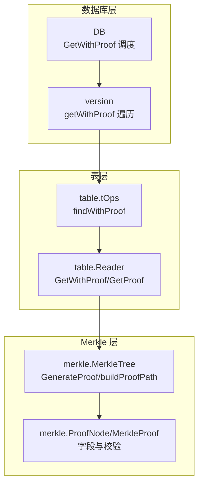
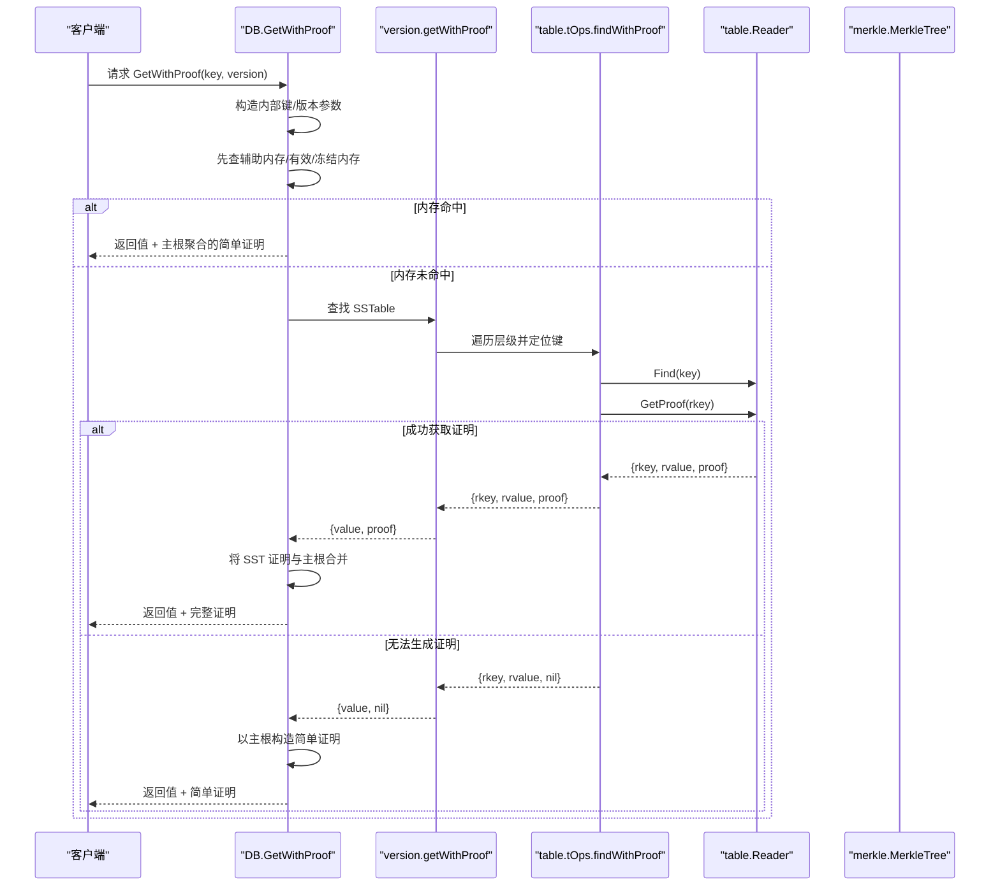
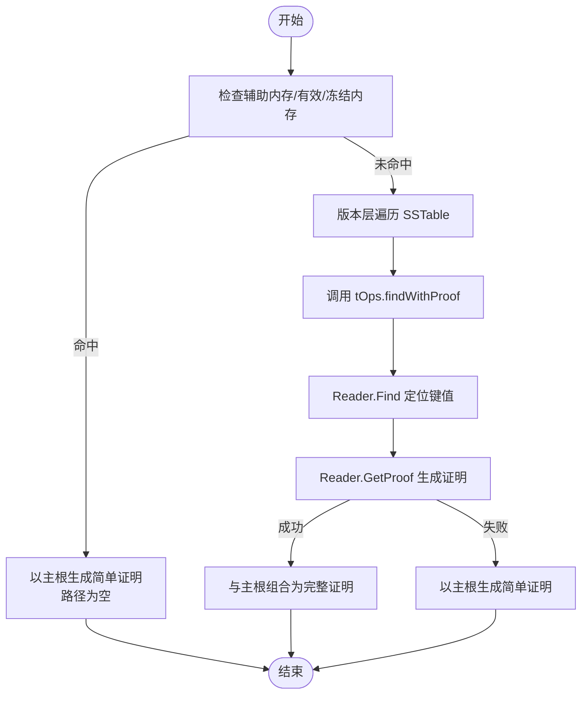
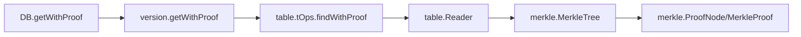

# 证明生成

<cite>
**本文引用的文件**
- [leveldb/db.go](file://leveldb/db.go)
- [leveldb/version.go](file://leveldb/version.go)
- [leveldb/table/table.go](file://leveldb/table/table.go)
- [leveldb/table/reader.go](file://leveldb/table/reader.go)
- [leveldb/table.go](file://leveldb/table.go)
- [leveldb/merkle/tree.go](file://leveldb/merkle/tree.go)
- [leveldb/merkle/node.go](file://leveldb/merkle/node.go)
- [leveldb/mlsm_final_comprehensive_test.go](file://leveldb/mlsm_final_comprehensive_test.go)
</cite>

## 目录
1. [简介](#简介)
2. [项目结构](#项目结构)
3. [核心组件](#核心组件)
4. [架构总览](#架构总览)
5. [详细组件分析](#详细组件分析)
6. [依赖关系分析](#依赖关系分析)
7. [性能考量](#性能考量)
8. [故障排查指南](#故障排查指南)
9. [结论](#结论)
10. [附录](#附录)

## 简介
本文件围绕 avccDB 的“证明生成”能力，系统梳理 GetWithProof 方法如何在不同存储层级（内存数据库与 SSTable）生成 Merkle 证明。重点说明：
- 从内存数据库与 SSTable 中获取数据时的证明生成机制
- generateExistenceProof 与 buildProofPath 如何构建从叶节点到根节点的路径
- 在 SSTable 级别通过 loadMerkleTree 加载预计算的 Merkle 树，并生成紧凑证明
- 证明结构中各字段的含义：路径节点、兄弟哈希与方向标志
- 不同存储层级的证明生成路径流程图

## 项目结构
与“证明生成”直接相关的核心模块与文件如下：
- 数据库入口与查询链路：leveldb/db.go
- 版本层遍历与 SSTable 查询：leveldb/version.go
- 表级读取与证明生成：leveldb/table/reader.go、leveldb/table.go
- Merkle 树与证明结构：leveldb/merkle/tree.go、leveldb/merkle/node.go
- 表格元数据与块布局：leveldb/table/table.go
- 综合测试用例（包含 GetWithProof 使用示例）：leveldb/mlsm_final_comprehensive_test.go

图表来源
- [leveldb/db.go](file://leveldb/db.go#L835-L932)
- [leveldb/version.go](file://leveldb/version.go#L287-L429)
- [leveldb/table.go](file://leveldb/table.go#L444-L467)
- [leveldb/table/reader.go](file://leveldb/table/reader.go#L1040-L1157)
- [leveldb/merkle/tree.go](file://leveldb/merkle/tree.go#L85-L166)
- [leveldb/merkle/node.go](file://leveldb/merkle/node.go#L100-L152)

章节来源
- [leveldb/db.go](file://leveldb/db.go#L835-L932)
- [leveldb/version.go](file://leveldb/version.go#L287-L429)
- [leveldb/table/reader.go](file://leveldb/table/reader.go#L1040-L1157)
- [leveldb/table.go](file://leveldb/table.go#L444-L467)
- [leveldb/merkle/tree.go](file://leveldb/merkle/tree.go#L85-L166)
- [leveldb/merkle/node.go](file://leveldb/merkle/node.go#L100-L152)
- [leveldb/table/table.go](file://leveldb/table/table.go#L1-L174)

## 核心组件
- DB.getWithProof：统一调度入口，按顺序尝试辅助内存、有效/冻结内存、SSTable，并最终将结果与主根聚合为完整证明。
- version.getWithProof：在多级 SSTable 中查找键值与证明，支持版本匹配与最新版本策略。
- table.tOps.findWithProof：先定位键值，再调用 Reader 获取证明；若失败则返回值但不带证明。
- table.Reader.GetWithProof/GetProof：根据 Merkle 树或紧凑格式生成证明；当未启用 Merkle 或加载失败时返回值但无证明。
- merkle.MerkleTree.GenerateProof/buildProofPath：生成存在性证明，递归收集兄弟节点哈希与方向，形成从叶到根的路径。
- merkle.ProofNode/MerkleProof：定义证明结构，包含键、值、版本、根哈希、存在性标记以及路径节点数组。

章节来源
- [leveldb/db.go](file://leveldb/db.go#L835-L932)
- [leveldb/version.go](file://leveldb/version.go#L287-L429)
- [leveldb/table.go](file://leveldb/table.go#L444-L467)
- [leveldb/table/reader.go](file://leveldb/table/reader.go#L1040-L1157)
- [leveldb/merkle/tree.go](file://leveldb/merkle/tree.go#L85-L166)
- [leveldb/merkle/node.go](file://leveldb/merkle/node.go#L100-L152)

## 架构总览
下图展示了 GetWithProof 的端到端调用链，从 DB 到版本层再到表层，最终回到 DB 进行证明聚合。

图表来源
- [leveldb/db.go](file://leveldb/db.go#L835-L932)
- [leveldb/version.go](file://leveldb/version.go#L287-L429)
- [leveldb/table.go](file://leveldb/table.go#L444-L467)
- [leveldb/table/reader.go](file://leveldb/table/reader.go#L1040-L1157)

## 详细组件分析

### DB.getWithProof：跨层级证明生成与聚合
- 优先检查辅助内存与有效/冻结内存，命中后直接以主根生成简单证明（路径为空）。
- 若未命中，则进入版本层查找；成功后将 SST 层证明与主根进行组合，得到全局证明。
- 当 SST 层无法生成证明时，回退为仅包含主根的简单证明。

关键要点
- 版本参数处理：version=0 表示“最新版本”，内部转换为特殊标记参与比较。
- 内部键构造：使用内部键格式携带版本与序列号，确保版本匹配逻辑正确。
- 证明修正：将表层返回的内部键修正为用户键，保证对外接口一致性。

章节来源
- [leveldb/db.go](file://leveldb/db.go#L835-L932)

### version.getWithProof：SSTable 层级遍历与证明提取
- 按层级遍历 overlapping 的表，尝试解析内部键并匹配目标版本。
- 对每个候选表调用 tOps.findWithProof 获取键值与证明；若失败则继续搜索。
- 支持最新版本策略：在 level<=0 或未指定版本时，比较序列号选择最新版本。

章节来源
- [leveldb/version.go](file://leveldb/version.go#L287-L429)

### table.tOps.findWithProof：定位键值与证明
- 先通过 Reader.Find 定位键值，再调用 Reader.GetProof 获取证明。
- 若 GetProof 失败（例如未启用 Merkle 或加载失败），仍返回值，但证明为 nil。

章节来源
- [leveldb/table.go](file://leveldb/table.go#L444-L467)

### table.Reader.GetWithProof/GetProof：SSTable 级别证明生成
- GetWithProof：先定位键值，再加载 Merkle 树并生成证明；若未启用 Merkle 或加载失败，返回值但无证明。
- GetProof：在已知键的情况下，基于 Merkle 树生成证明；当前实现注释表明会扫描数据块并重建路径，当前返回基础证明。
- loadMerkleTree：从元数据块加载紧凑格式 Merkle 树，保存根哈希与高度，便于后续证明生成。

章节来源
- [leveldb/table/reader.go](file://leveldb/table/reader.go#L1040-L1157)

### merkle.MerkleTree：存在性证明与路径构建
- GenerateProof：根据是否存在目标键生成存在性或不存在性证明。
- generateExistenceProof：初始化证明结构，设置根哈希、存在性标记等。
- buildProofPath：自顶向下递归，依据目标键所在子树决定方向，收集兄弟节点哈希与高度，形成从叶到根的路径。

复杂度与行为
- 时间复杂度：O(h)，h 为 Merkle 树高度；路径长度等于树高。
- 方向判断：通过比较目标键与左右子树边界确定下一步方向，同时记录对应兄弟节点作为路径节点。

章节来源
- [leveldb/merkle/tree.go](file://leveldb/merkle/tree.go#L85-L166)

### merkle.ProofNode 与 MerkleProof：证明结构与校验
- MerkleProof 字段
  - Key/Value/Version：被证明的数据项
  - Root：树根哈希
  - Exists：键是否存在
  - Path：从叶到根的路径节点数组
- ProofNode 字段
  - Hash：兄弟节点哈希
  - IsLeft：兄弟节点是否位于左侧（用于确定内部节点哈希拼接顺序）
  - Height：兄弟节点高度（可用于紧凑表示或调试）
- Verify：从叶哈希开始，逐层与兄弟节点拼接，最终与 Root 比较一致即认为证明有效。

章节来源
- [leveldb/merkle/node.go](file://leveldb/merkle/node.go#L100-L152)

### 从内存数据库到 SSTable 的证明生成差异
- 内存数据库：命中后直接以主根生成简单证明（路径为空），无需树结构。
- SSTable：需要加载 Merkle 树或通过紧凑格式重建路径，生成包含兄弟节点哈希的路径证明。

章节来源
- [leveldb/db.go](file://leveldb/db.go#L835-L932)
- [leveldb/table/reader.go](file://leveldb/table/reader.go#L1040-L1157)

### 证明结构字段详解
- Key：被证明的用户键
- Value：对应值（不存在时为 nil）
- Version：版本号（0 表示最新）
- Root：Merkle 根哈希
- Exists：键是否存在
- Path：兄弟节点列表，按从叶到根顺序排列
  - 每个节点包含：兄弟哈希、方向标志（IsLeft）、高度
  - 方向标志决定内部哈希拼接顺序：IsLeft=true 表示“兄弟在左，我在右”，反之亦然

章节来源
- [leveldb/merkle/node.go](file://leveldb/merkle/node.go#L100-L152)
- [leveldb/merkle/tree.go](file://leveldb/merkle/tree.go#L85-L166)

### 流程图：不同存储层级的证明生成路径

图表来源
- [leveldb/db.go](file://leveldb/db.go#L835-L932)
- [leveldb/version.go](file://leveldb/version.go#L287-L429)
- [leveldb/table.go](file://leveldb/table.go#L444-L467)
- [leveldb/table/reader.go](file://leveldb/table/reader.go#L1040-L1157)

## 依赖关系分析
- DB 依赖 version 进行 SSTable 层级遍历
- version 依赖 table.tOps 定位键值并提取证明
- table.tOps 依赖 table.Reader 执行具体读取与证明生成
- table.Reader 依赖 merkle.MerkleTree 生成存在性证明
- merkle.MerkleTree 依赖 merkle.ProofNode/MerkleProof 结构完成路径与校验

图表来源
- [leveldb/db.go](file://leveldb/db.go#L835-L932)
- [leveldb/version.go](file://leveldb/version.go#L287-L429)
- [leveldb/table.go](file://leveldb/table.go#L444-L467)
- [leveldb/table/reader.go](file://leveldb/table/reader.go#L1040-L1157)
- [leveldb/merkle/tree.go](file://leveldb/merkle/tree.go#L85-L166)
- [leveldb/merkle/node.go](file://leveldb/merkle/node.go#L100-L152)

## 性能考量
- 内存层命中：O(1) 哈希查找，证明生成开销极低（仅主根聚合）。
- SSTable 层：Reader.Find 通常 O(log n) 级别（基于索引块），GetProof 为 O(h)（树高）。
- Merkle 树加载：loadMerkleTree 仅加载紧凑格式根信息，避免全树重建，降低 IO 与 CPU 开销。
- 合并证明：CombineWithLayerProof 仅对根进行聚合，常数时间开销。

[本节为通用指导，不直接分析具体文件]

## 故障排查指南
- 未启用 Merkle：Reader.GetWithProof 返回值但无证明；确认表写入时已启用 Merkle。
- Merkle 树加载失败：Reader.loadMerkleTree 可能因损坏或缺失导致错误；检查元数据块完整性。
- 证明校验失败：Verify 返回 false，检查 Root 是否来自主根聚合，以及 Path 是否与实际树结构一致。
- 最新版本查询：version 层面会比较序列号选择最新版本；若未命中，确认 level<=0 的重叠情况。

章节来源
- [leveldb/table/reader.go](file://leveldb/table/reader.go#L1040-L1157)
- [leveldb/version.go](file://leveldb/version.go#L287-L429)
- [leveldb/merkle/node.go](file://leveldb/merkle/node.go#L122-L152)

## 结论
- GetWithProof 在内存与 SSTable 两层分别采用不同的证明策略：内存层以主根快速生成简单证明，SSTable 层通过 Merkle 树或紧凑格式生成完整路径证明。
- generateExistenceProof 与 buildProofPath 提供了从叶到根的路径构建机制，ProofNode 的方向标志确保哈希拼接顺序正确。
- loadMerkleTree 在 SSTable 层加载预计算的 Merkle 树，结合紧凑格式实现高效证明生成。
- 通过 CombineWithLayerProof 将各层证明与主根聚合，形成全局可验证的证明结构。

[本节为总结性内容，不直接分析具体文件]

## 附录
- 表格元数据与块布局参考：了解 SSTable 的索引块、数据块与元数据块组织方式，有助于理解证明生成的底层数据来源。
  
章节来源
- [leveldb/table/table.go](file://leveldb/table/table.go#L1-L174)