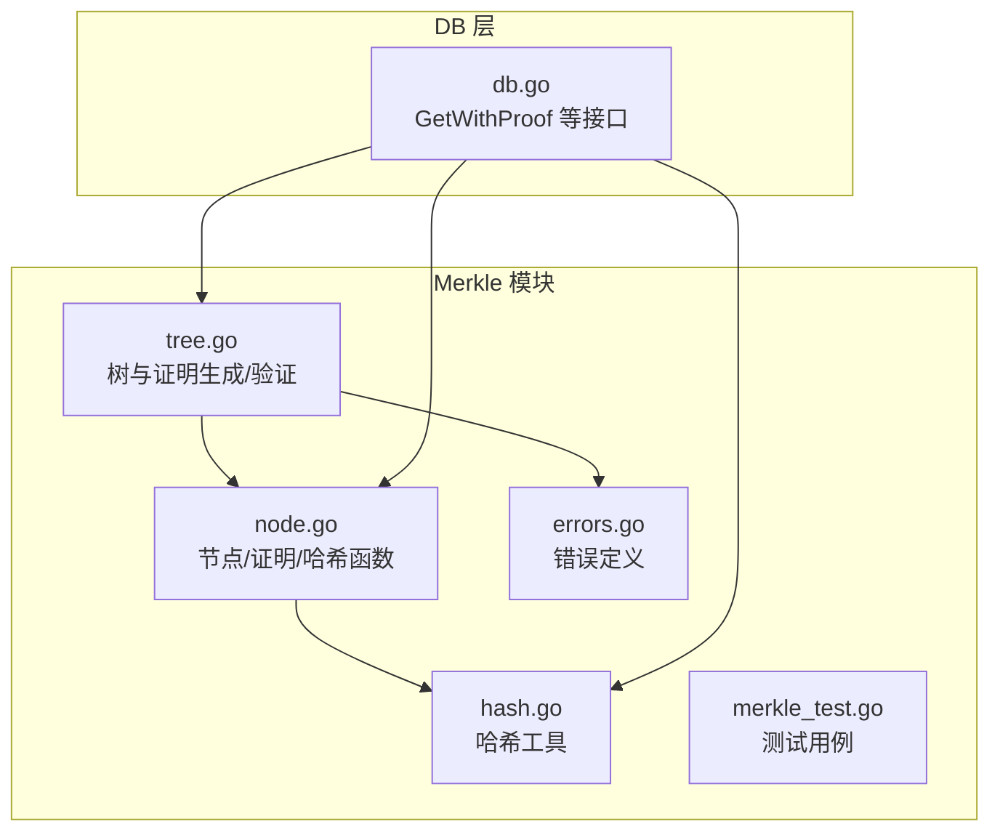
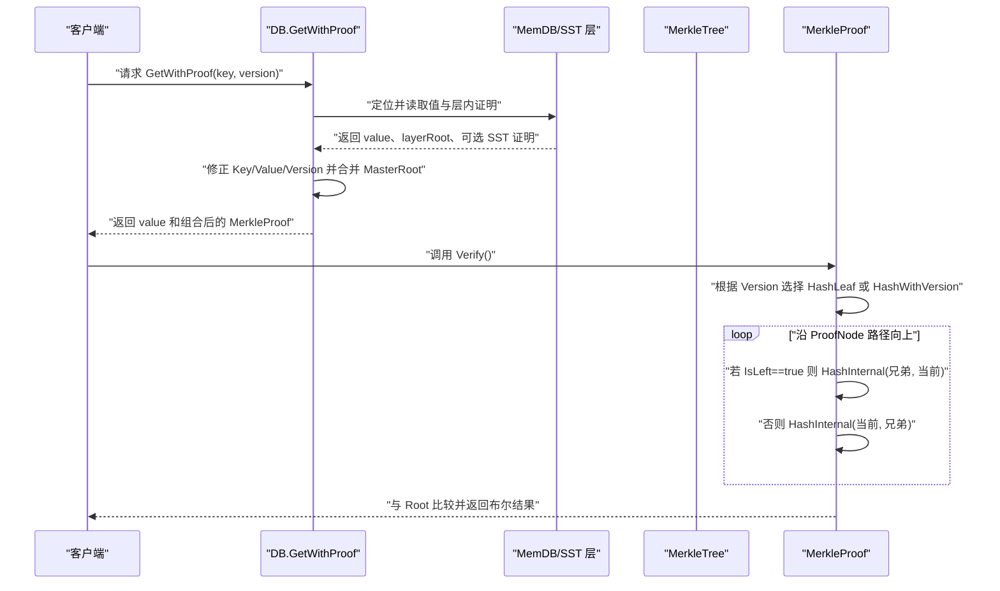
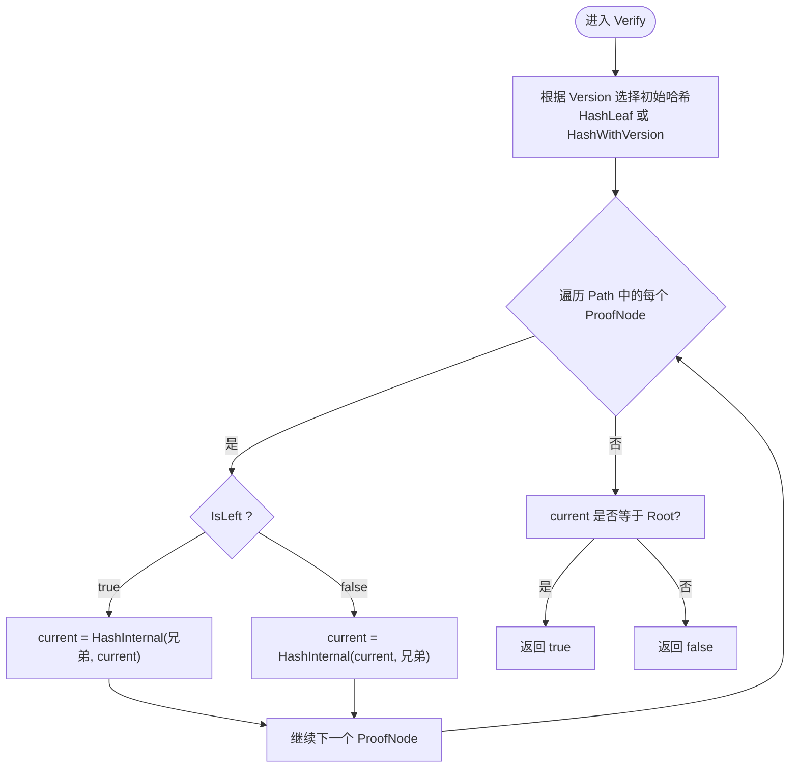
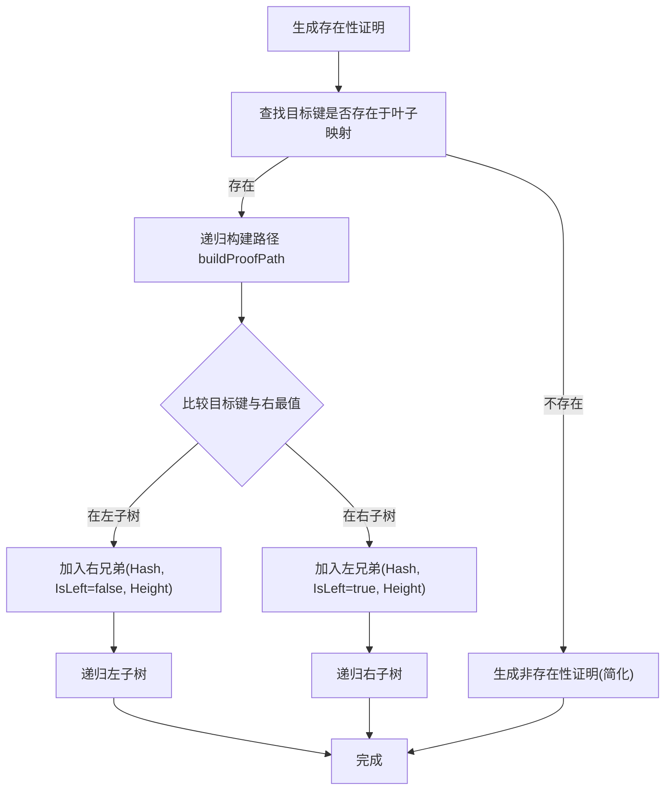
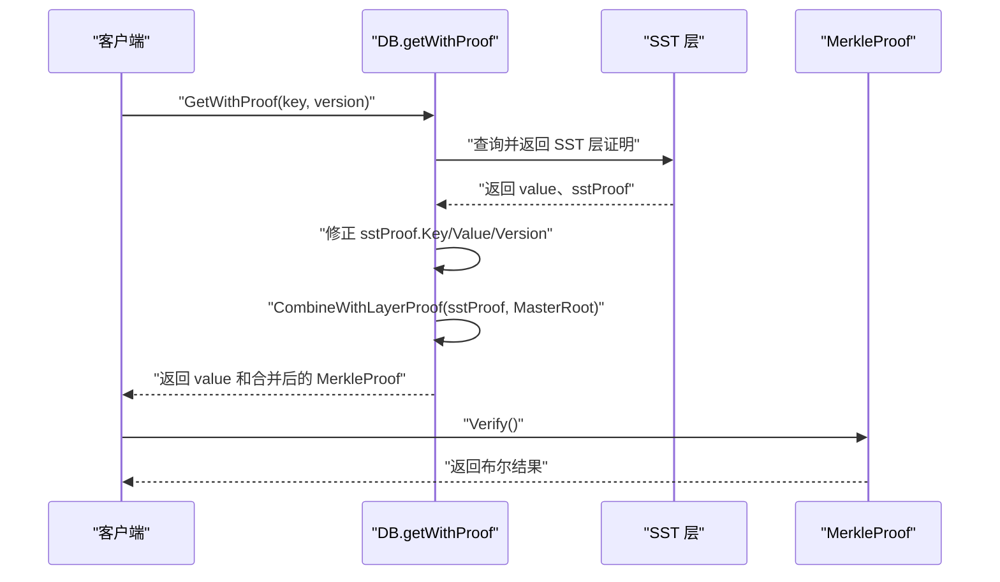
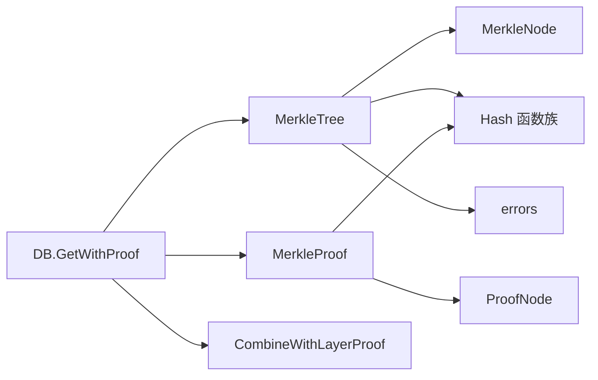

# 存在性证明验证

<cite>
**本文引用的文件**
- [leveldb/merkle/tree.go](file://leveldb/merkle/tree.go)
- [leveldb/merkle/node.go](file://leveldb/merkle/node.go)
- [leveldb/merkle/hash.go](file://leveldb/merkle/hash.go)
- [leveldb/merkle/merkle_test.go](file://leveldb/merkle/merkle_test.go)
- [leveldb/merkle/errors.go](file://leveldb/merkle/errors.go)
- [leveldb/db.go](file://leveldb/db.go)
- [leveldb/mlsm_final_comprehensive_test.go](file://leveldb/mlsm_final_comprehensive_test.go)
</cite>

## 目录
1. [引言](#引言)
2. [项目结构](#项目结构)
3. [核心组件](#核心组件)
4. [架构总览](#架构总览)
5. [详细组件分析](#详细组件分析)
6. [依赖关系分析](#依赖关系分析)
7. [性能考量](#性能考量)
8. [故障排查指南](#故障排查指南)
9. [结论](#结论)
10. [附录](#附录)

## 引言
本文件围绕 avccDB 中的 Merkle 证明验证机制，系统阐述 MerkleProof.Verify 方法如何验证键值对的真实性，特别是当 Exists 字段为 true 时的完整验证流程：从叶节点哈希开始，通过 HashWithVersion 或 HashLeaf 计算初始哈希值，沿 ProofNode 路径逐层重新计算内部节点哈希，最终与证明中的 Root 哈希进行比对。文档还解释 IsLeft 标志如何决定左右顺序，Height 字段在验证过程中的作用，并给出成功与失败场景的时序图与代码示例路径，最后总结验证失败的常见原因及排查建议。

## 项目结构
与存在性证明验证直接相关的模块主要位于 leveldb/merkle 目录，包含 Merkle 树构建、节点与证明数据结构、哈希函数定义，以及与上层数据库接口的集成点。此外，DB 层提供 GetWithProof 接口，用于跨层聚合生成可验证的证明。

图表来源
- [leveldb/merkle/tree.go](file://leveldb/merkle/tree.go#L1-L286)
- [leveldb/merkle/node.go](file://leveldb/merkle/node.go#L1-L370)
- [leveldb/merkle/hash.go](file://leveldb/merkle/hash.go#L1-L153)
- [leveldb/merkle/errors.go](file://leveldb/merkle/errors.go#L1-L32)
- [leveldb/db.go](file://leveldb/db.go#L835-L1182)

章节来源
- [leveldb/merkle/tree.go](file://leveldb/merkle/tree.go#L1-L286)
- [leveldb/merkle/node.go](file://leveldb/merkle/node.go#L1-L370)
- [leveldb/merkle/hash.go](file://leveldb/merkle/hash.go#L1-L153)
- [leveldb/db.go](file://leveldb/db.go#L835-L1182)

## 核心组件
- MerkleNode：树节点，区分叶节点与内部节点，支持哈希计算与序列化。
- MerkleProof：证明对象，包含 Key、Value、Version、Root、Exists 以及按层级排列的 ProofNode 列表。
- ProofNode：证明路径上的单个节点，包含兄弟节点哈希、IsLeft 标志与 Height。
- Hash 函数族：HashLeaf、HashWithVersion、HashInternal、AggregateRoots 等。
- MerkleTree：树构建与证明生成/验证入口，负责生成存在性证明并校验。

章节来源
- [leveldb/merkle/node.go](file://leveldb/merkle/node.go#L21-L121)
- [leveldb/merkle/hash.go](file://leveldb/merkle/hash.go#L68-L105)
- [leveldb/merkle/tree.go](file://leveldb/merkle/tree.go#L85-L120)

## 架构总览
下图展示了从上层调用到底层哈希计算的端到端流程，包括 DB 层的 GetWithProof 如何整合各层证明并最终交由 MerkleProof.Verify 完成验证。

图表来源
- [leveldb/db.go](file://leveldb/db.go#L835-L932)
- [leveldb/merkle/node.go](file://leveldb/merkle/node.go#L122-L152)
- [leveldb/merkle/hash.go](file://leveldb/merkle/hash.go#L68-L105)

## 详细组件分析

### MerkleProof.Verify 验证流程
- 输入条件：Exists 为 true；证明包含叶节点的 Key、Value、Version、Root 与按层级排列的 Path。
- 初始哈希：
  - 若 Version > 0：使用 HashWithVersion(Version, Key, Value)
  - 否则：使用 HashLeaf(Key, Value)
- 迭代重组：
  - 从 Path[0] 开始，逐层向上，依据 IsLeft 决定左右顺序：
    - IsLeft==true：父节点哈希 = HashInternal(兄弟哈希, 当前哈希)
    - IsLeft==false：父节点哈希 = HashInternal(当前哈希, 兄弟哈希)
- 终止条件：一路向上直至根，最终哈希应等于证明中的 Root。
- 返回值：两者相等则验证通过，否则失败。

图表来源
- [leveldb/merkle/node.go](file://leveldb/merkle/node.go#L122-L152)
- [leveldb/merkle/hash.go](file://leveldb/merkle/hash.go#L68-L105)

章节来源
- [leveldb/merkle/node.go](file://leveldb/merkle/node.go#L122-L152)
- [leveldb/merkle/hash.go](file://leveldb/merkle/hash.go#L68-L105)

### 生成存在性证明（MerkleTree.GenerateProof）
- 若目标键存在于树中，则生成存在性证明：
  - Key、Value、Version、Root、Exists=true
  - Path 由 buildProofPath 递归生成，每一步记录“兄弟节点哈希”与“兄弟节点高度”
- buildProofPath 通过比较目标键与子树边界确定下一步方向：
  - 若在左子树：将右兄弟加入 Path（IsLeft=false），Height=右兄弟高度
  - 若在右子树：将左兄弟加入 Path（IsLeft=true），Height=左兄弟高度
- Height 字段的作用：
  - 在生成阶段记录兄弟节点的高度，便于后续验证时重建内部节点哈希
  - 验证阶段虽然未直接使用 Height 进行计算，但确保了兄弟节点哈希与高度的一致性，避免构造错误的内部节点

图表来源
- [leveldb/merkle/tree.go](file://leveldb/merkle/tree.go#L85-L120)
- [leveldb/merkle/tree.go](file://leveldb/merkle/tree.go#L122-L166)

章节来源
- [leveldb/merkle/tree.go](file://leveldb/merkle/tree.go#L85-L120)
- [leveldb/merkle/tree.go](file://leveldb/merkle/tree.go#L122-L166)

### 上层集成：DB.GetWithProof 与证明合并
- DB.GetWithProof 会从 MemDB/SST 层获取值与层内证明，随后结合 MasterRoot（通过 CombineWithLayerProof 或直接设置 Root）形成可验证的整体证明。
- 对于 SST 层返回的内部键，DB 会修正为用户键并填充 Value/Version，再与 MasterRoot 合并。

图表来源
- [leveldb/db.go](file://leveldb/db.go#L835-L932)
- [leveldb/merkle/node.go](file://leveldb/merkle/node.go#L347-L369)

章节来源
- [leveldb/db.go](file://leveldb/db.go#L835-L932)
- [leveldb/merkle/node.go](file://leveldb/merkle/node.go#L347-L369)

### 成功与失败场景示例（代码示例路径）
- 成功验证（存在性）：
  - 生成证明与验证流程参考测试用例路径：[leveldb/merkle/merkle_test.go](file://leveldb/merkle/merkle_test.go#L108-L151)
  - 性能基准参考：[leveldb/merkle/merkle_test.go](file://leveldb/merkle/merkle_test.go#L263-L316)
- 失败验证（哈希不匹配/路径篡改/版本不一致）：
  - 可通过修改证明中的 Root、Key、Value、Version 或 Path 中的兄弟哈希/IsLeft 标志，使最终哈希不等于 Root，从而导致验证失败。
  - 错误类型参考：[leveldb/merkle/errors.go](file://leveldb/merkle/errors.go#L10-L31)

章节来源
- [leveldb/merkle/merkle_test.go](file://leveldb/merkle/merkle_test.go#L108-L151)
- [leveldb/merkle/merkle_test.go](file://leveldb/merkle/merkle_test.go#L263-L316)
- [leveldb/merkle/errors.go](file://leveldb/merkle/errors.go#L10-L31)

## 依赖关系分析
- MerkleTree 依赖：
  - MerkleNode：节点结构与哈希计算
  - Hash 函数族：HashLeaf、HashWithVersion、HashInternal
  - errors：空树、键不存在等错误
- MerkleProof 依赖：
  - Hash 函数族：初始化叶哈希与内部哈希重组
  - ProofNode：路径节点
- DB 层依赖：
  - MerkleTree/MerkleProof：生成与验证
  - CombineWithLayerProof：与 MasterRoot 合并

图表来源
- [leveldb/merkle/tree.go](file://leveldb/merkle/tree.go#L1-L286)
- [leveldb/merkle/node.go](file://leveldb/merkle/node.go#L1-L370)
- [leveldb/merkle/hash.go](file://leveldb/merkle/hash.go#L1-L153)
- [leveldb/db.go](file://leveldb/db.go#L835-L932)

章节来源
- [leveldb/merkle/tree.go](file://leveldb/merkle/tree.go#L1-L286)
- [leveldb/merkle/node.go](file://leveldb/merkle/node.go#L1-L370)
- [leveldb/merkle/hash.go](file://leveldb/merkle/hash.go#L1-L153)
- [leveldb/db.go](file://leveldb/db.go#L835-L932)

## 性能考量
- 验证复杂度：O(h)，h 为树高，每次迭代仅做一次哈希计算与常数次内存访问。
- 生成证明：O(h)，递归遍历路径收集兄弟节点信息。
- 内存占用：证明 Path 长度与树高成正比；对于平衡树，h≈log N。
- 实践建议：
  - 尽量保持树平衡，减少 h
  - 对于大规模数据，优先使用 StreamingTreeBuilder 分批构建，降低峰值内存
  - 使用 Benchmark 评估生成与验证开销：[leveldb/merkle/merkle_test.go](file://leveldb/merkle/merkle_test.go#L263-L316)

[本节为通用性能讨论，无需列出具体文件来源]

## 故障排查指南
- 常见失败原因
  - 哈希不匹配：证明中的 Root 与实际树根不一致；或路径中兄弟哈希被篡改
  - 路径篡改：IsLeft 标志错误导致左右顺序颠倒，或缺失/多加兄弟节点
  - 版本不一致：Version 与实际存储版本不符，导致初始哈希不匹配
  - 数据损坏：Key/Value/Root 序列化错误或长度不合法
- 定位步骤
  - 确认 Exists=true 且证明包含叶节点信息
  - 检查 Version 是否为 0 或与预期一致
  - 核对 Path 长度与树高是否一致
  - 逐步重算内部哈希，定位第一个不匹配的层级
- 相关错误类型
  - ErrInvalidHashSize、ErrInvalidProof、ErrEmptyTree、ErrKeyNotFound、ErrInvalidNode、ErrInvalidVersion

章节来源
- [leveldb/merkle/errors.go](file://leveldb/merkle/errors.go#L10-L31)
- [leveldb/merkle/node.go](file://leveldb/merkle/node.go#L122-L152)

## 结论
MerkleProof.Verify 通过从叶节点哈希出发，严格遵循 IsLeft 标志与兄弟节点顺序，逐层向上重组内部节点哈希，最终与 Root 比对，从而可靠地验证键值对的真实性。Height 字段虽不直接参与哈希计算，但有助于保证路径完整性与一致性。DB 层通过 CombineWithLayerProof 将多层证明与 MasterRoot 合并，形成可跨层验证的整体证明。实践中应关注版本一致性、路径完整性与树平衡性，以获得稳定高效的验证体验。

[本节为总结性内容，无需列出具体文件来源]

## 附录

### 关键 API 与数据结构一览
- MerkleNode：叶/内部节点，含哈希、高度、键值与版本
- MerkleProof：包含 Key/Value/Version/Root/Exists/Path
- ProofNode：兄弟哈希、IsLeft、Height
- Hash 函数族：HashLeaf、HashWithVersion、HashInternal、AggregateRoots

章节来源
- [leveldb/merkle/node.go](file://leveldb/merkle/node.go#L21-L121)
- [leveldb/merkle/hash.go](file://leveldb/merkle/hash.go#L68-L105)