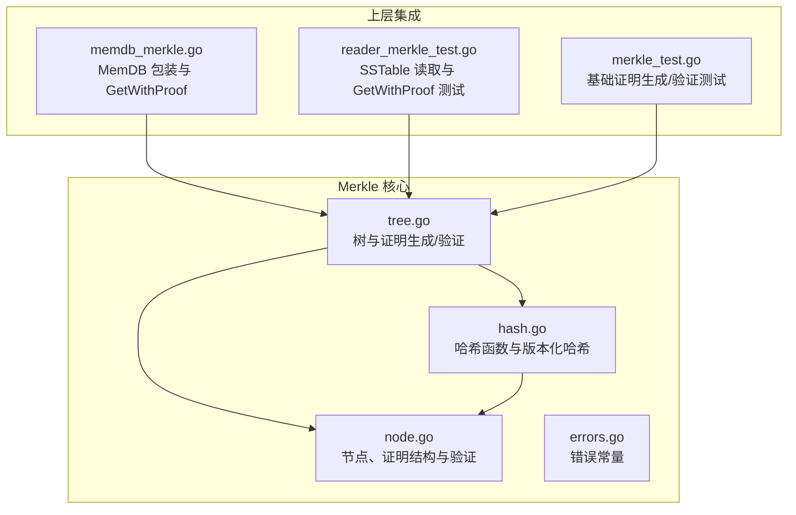
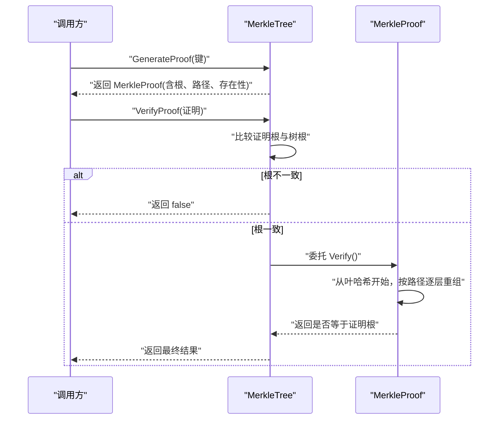
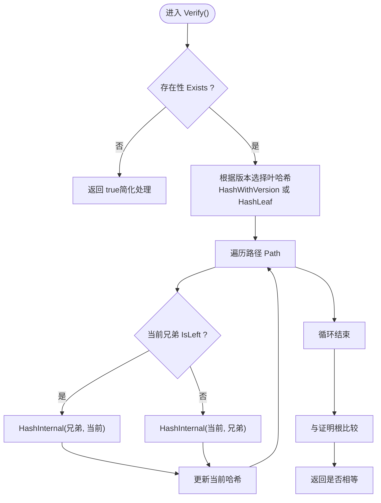
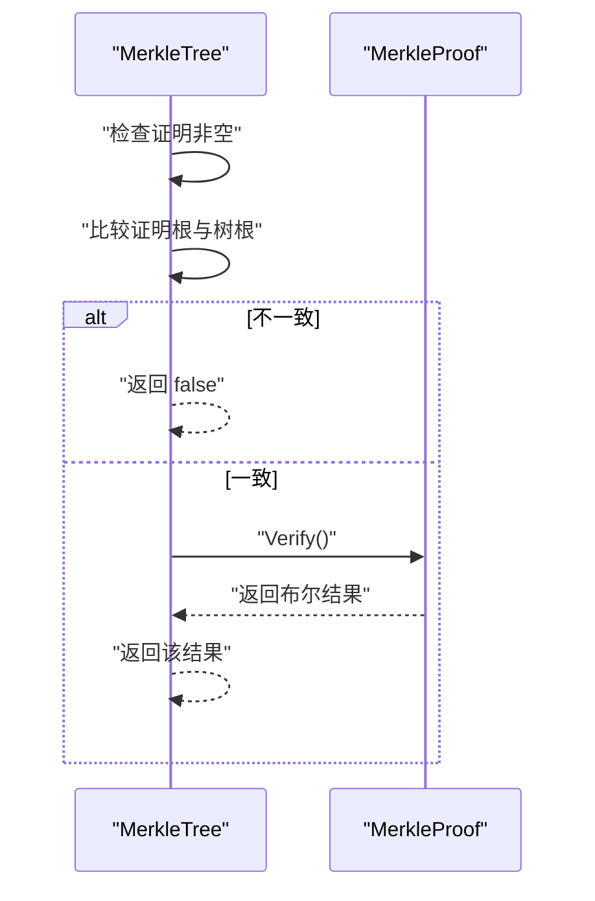
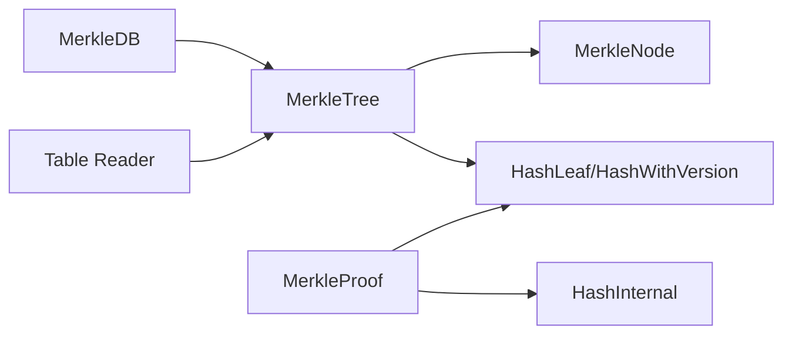

# 证明验证

<cite>
**本文引用的文件**
- [leveldb/merkle/tree.go](file://leveldb/merkle/tree.go)
- [leveldb/merkle/hash.go](file://leveldb/merkle/hash.go)
- [leveldb/merkle/node.go](file://leveldb/merkle/node.go)
- [leveldb/merkle/errors.go](file://leveldb/merkle/errors.go)
- [leveldb/merkle/merkle_test.go](file://leveldb/merkle/merkle_test.go)
- [leveldb/memdb/memdb_merkle.go](file://leveldb/memdb/memdb_merkle.go)
- [leveldb/table/reader_merkle_test.go](file://leveldb/table/reader_merkle_test.go)
- [leveldb/mlsm_final_comprehensive_test.go](file://leveldb/mlsm_final_comprehensive_test.go)
</cite>

## 目录
1. [引言](#引言)
2. [项目结构](#项目结构)
3. [核心组件](#核心组件)
4. [架构总览](#架构总览)
5. [详细组件分析](#详细组件分析)
6. [依赖关系分析](#依赖关系分析)
7. [性能考量](#性能考量)
8. [故障排查指南](#故障排查指南)
9. [结论](#结论)

## 引言
本文件面向 avccDB 的 Merkle 证明验证流程，系统性阐述以下内容：
- MerkleProof.Verify 方法如何从叶哈希开始，沿证明路径逐层重新计算哈希，最终与根哈希比对一致。
- MerkleTree.VerifyProof 方法如何先校验证明的根哈希与当前 Merkle 树根一致，再委托证明对象执行路径验证。
- 在版本化数据场景下，HashWithVersion 如何将版本号纳入哈希计算，确保版本信息参与验证。
- 提供证明验证的步骤分解图，展示哈希重算的完整过程。
- 总结验证失败的常见原因与错误处理策略。

## 项目结构
围绕 Merkle 证明验证的核心代码位于 leveldb/merkle 子模块，同时 memdb 与 table 层提供生成与使用证明的入口。测试用例覆盖了证明生成、验证与跨层合并等关键行为。

图表来源
- [leveldb/merkle/tree.go](file://leveldb/merkle/tree.go#L1-L286)
- [leveldb/merkle/hash.go](file://leveldb/merkle/hash.go#L1-L153)
- [leveldb/merkle/node.go](file://leveldb/merkle/node.go#L1-L370)
- [leveldb/merkle/errors.go](file://leveldb/merkle/errors.go#L1-L32)
- [leveldb/memdb/memdb_merkle.go](file://leveldb/memdb/memdb_merkle.go#L1-L181)
- [leveldb/table/reader_merkle_test.go](file://leveldb/table/reader_merkle_test.go#L1-L275)
- [leveldb/merkle/merkle_test.go](file://leveldb/merkle/merkle_test.go#L1-L317)

章节来源
- [leveldb/merkle/tree.go](file://leveldb/merkle/tree.go#L1-L286)
- [leveldb/merkle/hash.go](file://leveldb/merkle/hash.go#L1-L153)
- [leveldb/merkle/node.go](file://leveldb/merkle/node.go#L1-L370)
- [leveldb/merkle/errors.go](file://leveldb/merkle/errors.go#L1-L32)
- [leveldb/memdb/memdb_merkle.go](file://leveldb/memdb/memdb_merkle.go#L1-L181)
- [leveldb/table/reader_merkle_test.go](file://leveldb/table/reader_merkle_test.go#L1-L275)
- [leveldb/merkle/merkle_test.go](file://leveldb/merkle/merkle_test.go#L1-L317)

## 核心组件
- MerkleTree：维护 Merkle 根、叶子索引、生成证明、校验证明。
- MerkleProof：包含目标键值、版本、根哈希、存在性标记与路径（兄弟节点哈希序列）。
- MerkleNode：节点类型、叶/内部节点哈希计算、序列化。
- HashWithVersion：版本化叶哈希格式，确保版本信息参与验证。
- 错误常量：统一的错误语义，便于定位问题。

章节来源
- [leveldb/merkle/tree.go](file://leveldb/merkle/tree.go#L1-L286)
- [leveldb/merkle/node.go](file://leveldb/merkle/node.go#L1-L370)
- [leveldb/merkle/hash.go](file://leveldb/merkle/hash.go#L1-L153)
- [leveldb/merkle/errors.go](file://leveldb/merkle/errors.go#L1-L32)

## 架构总览
Merkle 证明验证由“树层”和“证明层”协作完成：
- 树层负责生成证明（包含兄弟节点哈希路径）与整体一致性校验。
- 证明层负责从叶哈希开始，按路径逐层重组内部哈希，最终与证明根对比。

图表来源
- [leveldb/merkle/tree.go](file://leveldb/merkle/tree.go#L213-L225)
- [leveldb/merkle/node.go](file://leveldb/merkle/node.go#L122-L152)

## 详细组件分析

### MerkleTree 与证明生成
- 叶子索引：通过遍历构建 key 到叶子节点的映射，加速查找与证明生成。
- 证明生成：
  - 对存在的键：收集从叶到根的兄弟节点哈希序列（Path），并记录根哈希与存在性。
  - 对不存在的键：生成非存在证明（示例实现中以简化形式返回）。
- 路径构建：基于比较边界判断进入左/右子树，沿途记录对应兄弟节点哈希与高度。

章节来源
- [leveldb/merkle/tree.go](file://leveldb/merkle/tree.go#L40-L120)
- [leveldb/merkle/tree.go](file://leveldb/merkle/tree.go#L122-L192)
- [leveldb/merkle/tree.go](file://leveldb/merkle/tree.go#L194-L211)

### MerkleProof 验证流程
- 叶哈希选择：
  - 若版本大于 0：使用 HashWithVersion 计算叶哈希。
  - 否则：使用 HashLeaf 计算叶哈希。
- 逐层重组：
  - 按路径顺序，依据兄弟节点位置（IsLeft）决定左右顺序，调用 HashInternal 组合父节点哈希。
- 最终比对：
  - 将重组得到的最终哈希与证明根相等性比较，一致则验证通过。

图表来源
- [leveldb/merkle/node.go](file://leveldb/merkle/node.go#L122-L152)
- [leveldb/merkle/hash.go](file://leveldb/merkle/hash.go#L68-L105)

章节来源
- [leveldb/merkle/node.go](file://leveldb/merkle/node.go#L122-L152)
- [leveldb/merkle/hash.go](file://leveldb/merkle/hash.go#L68-L105)

### MerkleTree.VerifyProof 的两阶段校验
- 第一阶段：直接比较证明根与树根是否一致。
- 第二阶段：若根一致，则委托证明对象执行路径验证。
- 返回布尔值作为最终结果。

图表来源
- [leveldb/merkle/tree.go](file://leveldb/merkle/tree.go#L213-L225)

章节来源
- [leveldb/merkle/tree.go](file://leveldb/merkle/tree.go#L213-L225)

### 版本化数据下的哈希与验证
- 叶节点哈希：
  - 无版本：HashLeaf(key, value)
  - 有版本：HashWithVersion(version, key, value)
- 节点计算：
  - MerkleNode.ComputeHash 在叶节点优先使用 HashWithVersion，否则使用 HashLeaf。
- 证明验证：
  - MerkleProof.Verify 会根据版本字段选择对应的叶哈希计算方式，从而确保版本信息参与路径重组与最终比对。

章节来源
- [leveldb/merkle/hash.go](file://leveldb/merkle/hash.go#L68-L105)
- [leveldb/merkle/node.go](file://leveldb/merkle/node.go#L54-L64)
- [leveldb/merkle/node.go](file://leveldb/merkle/node.go#L122-L152)

### 上层集成：MemDB 与 SSTable 的证明生成
- MemDB：
  - 提供 GetWithProof 接口，内部构建 Merkle 树并生成证明。
- SSTable Reader：
  - 支持启用 Merkle 树，提供 GetWithProof 返回值与证明。
- 测试验证：
  - 通过测试用例确认 GetWithProof 成功返回值与证明，且可被验证。

章节来源
- [leveldb/memdb/memdb_merkle.go](file://leveldb/memdb/memdb_merkle.go#L126-L147)
- [leveldb/table/reader_merkle_test.go](file://leveldb/table/reader_merkle_test.go#L88-L111)
- [leveldb/table/reader_merkle_test.go](file://leveldb/table/reader_merkle_test.go#L193-L275)
- [leveldb/merkle/merkle_test.go](file://leveldb/merkle/merkle_test.go#L108-L151)

## 依赖关系分析
- MerkleTree 依赖：
  - MerkleNode：节点结构与哈希计算。
  - HashLeaf/HashWithVersion：叶哈希与版本化哈希。
  - 比较器：用于键排序与边界判断。
- MerkleProof 依赖：
  - HashLeaf/HashWithVersion：叶哈希计算。
  - HashInternal：内部节点哈希组合。
- 上层依赖：
  - MemDB：封装 MerkleTree 并暴露 GetWithProof。
  - SSTable Reader：在启用 Merkle 时生成并返回证明。

图表来源
- [leveldb/merkle/tree.go](file://leveldb/merkle/tree.go#L1-L286)
- [leveldb/merkle/node.go](file://leveldb/merkle/node.go#L1-L370)
- [leveldb/merkle/hash.go](file://leveldb/merkle/hash.go#L1-L153)
- [leveldb/memdb/memdb_merkle.go](file://leveldb/memdb/memdb_merkle.go#L1-L181)
- [leveldb/table/reader_merkle_test.go](file://leveldb/table/reader_merkle_test.go#L1-L275)

## 性能考量
- 证明生成：
  - 生成证明需要遍历从叶到根的路径，复杂度与树高相关。
  - 通过叶子索引快速定位目标叶，避免全树扫描。
- 证明验证：
  - 验证过程仅需线性遍历路径长度，复杂度 O(h)。
  - 使用等值比较而非哈希库二次计算，避免额外开销。
- 内存占用：
  - MerkleTree 保存叶子映射，空间换时间；适合频繁查询场景。
- 批量操作：
  - 测试用例包含大量条目构建与验证的基准测试，可用于评估实际性能。

章节来源
- [leveldb/merkle/tree.go](file://leveldb/merkle/tree.go#L40-L66)
- [leveldb/merkle/merkle_test.go](file://leveldb/merkle/merkle_test.go#L241-L316)

## 故障排查指南
- 常见错误与原因
  - 空证明或空树：VerifyProof 会在输入为空时直接返回 false；GenerateProof 在空树时报错。
  - 根哈希不一致：VerifyProof 会先比较证明根与树根，不一致即失败。
  - 键不存在：非存在证明在当前实现中为简化返回，验证逻辑可能不会触发路径重组。
  - 数据损坏/序列化错误：节点反序列化失败或数据长度不匹配会导致错误。
  - 版本不匹配：若版本信息未正确写入或解析，将导致叶哈希不一致。
- 定位策略
  - 检查证明根与树根是否一致。
  - 核对路径长度与兄弟节点顺序是否与树结构一致。
  - 确认版本号与键值是否与生成证明时一致。
  - 使用测试用例中的基准与断言辅助定位问题。
- 相关错误常量
  - 空树、键不存在、无效哈希大小、无效节点、损坏数据、无效版本等。

章节来源
- [leveldb/merkle/tree.go](file://leveldb/merkle/tree.go#L213-L225)
- [leveldb/merkle/errors.go](file://leveldb/merkle/errors.go#L1-L32)
- [leveldb/merkle/merkle_test.go](file://leveldb/merkle/merkle_test.go#L108-L151)

## 结论
- MerkleProof.Verify 采用自底向上的哈希重组策略，确保从叶哈希出发，按路径逐层组合，最终与证明根一致。
- MerkleTree.VerifyProof 提供两阶段校验：先根后路径，保证整体一致性与局部正确性。
- 版本化场景通过 HashWithVersion 将版本纳入哈希，使验证天然包含版本约束。
- 上层集成（MemDB 与 SSTable）提供了完整的证明生成与验证闭环，测试用例覆盖关键路径，便于回归与性能评估。