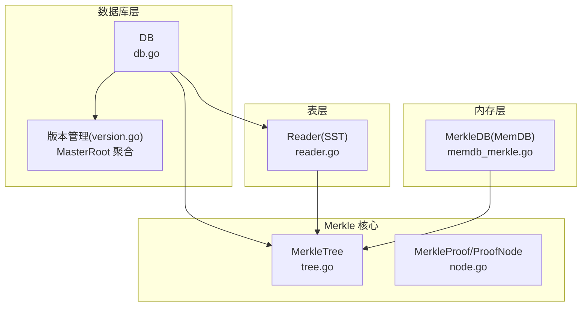
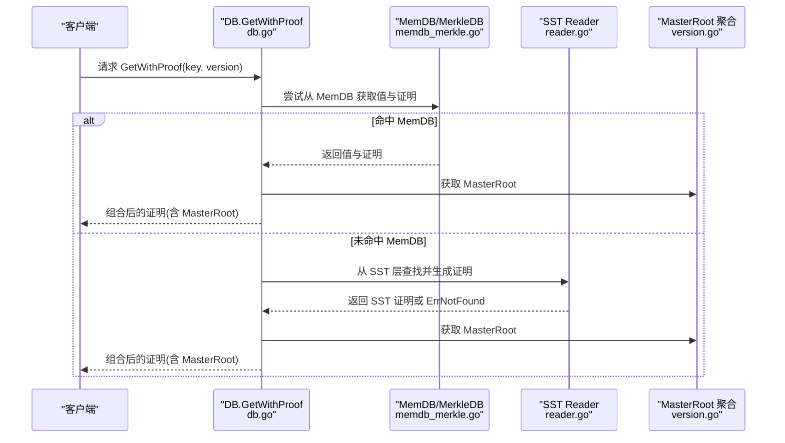
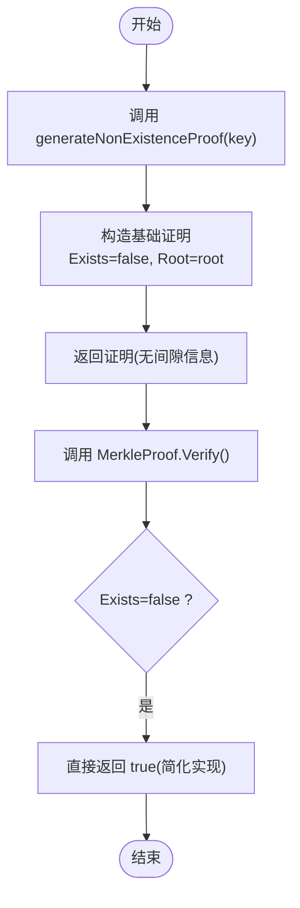
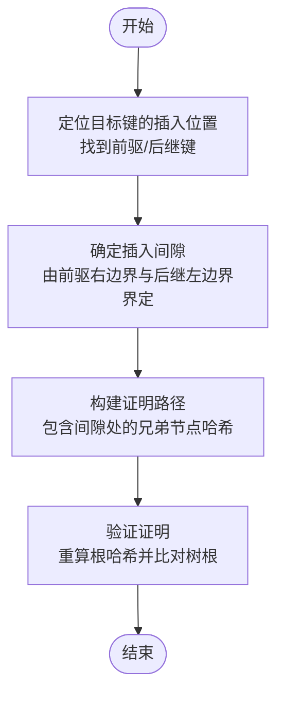
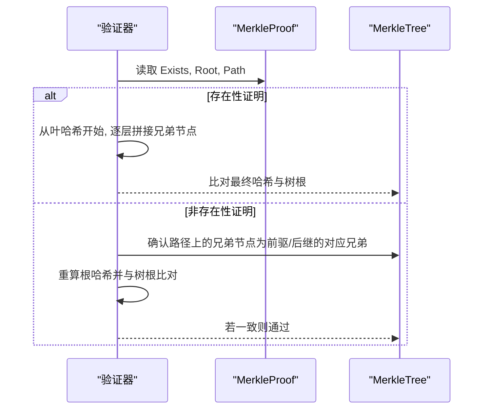
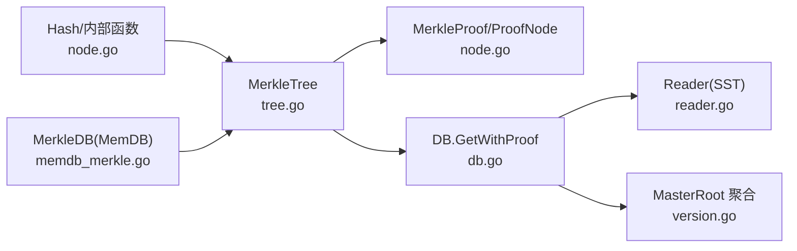

# 非存在性证明验证

<cite>
**本文引用的文件**
- [leveldb/merkle/tree.go](file://leveldb/merkle/tree.go)
- [leveldb/merkle/node.go](file://leveldb/merkle/node.go)
- [leveldb/db.go](file://leveldb/db.go)
- [leveldb/table/reader.go](file://leveldb/table/reader.go)
- [leveldb/memdb/memdb_merkle.go](file://leveldb/memdb/memdb_merkle.go)
- [leveldb/mlsm_final_comprehensive_test.go](file://leveldb/mlsm_final_comprehensive_test.go)
- [leveldb/version.go](file://leveldb/version.go)
</cite>

## 目录
1. [引言](#引言)
2. [项目结构](#项目结构)
3. [核心组件](#核心组件)
4. [架构总览](#架构总览)
5. [详细组件分析](#详细组件分析)
6. [依赖关系分析](#依赖关系分析)
7. [性能考量](#性能考量)
8. [故障排查指南](#故障排查指南)
9. [结论](#结论)

## 引言
本文件聚焦 avccDB 中基于 Merkle 树的“非存在性证明”验证机制，特别是当 MerkleProof.Exists 字段为 false 时的验证流程。当前实现采用简化策略：当生成非存在性证明时，直接返回一个包含目标键、空值、根哈希且 Exists=false 的证明对象；同时，验证器对非存在性证明的处理也返回 true，这在安全性上存在明显缺陷。本文将系统阐述：
- 当前简化实现为何不安全
- 完整实现应如何通过“前驱/后继键”来证明某键在 Merkle 树中不存在
- generateNonExistenceProof 如何构建非存在性证明
- 验证器如何检查证明路径是否正确展示键的插入间隙
- 非存在性证明在防止数据伪造与确保完整性方面的重要性
- 在 mLSM 架构中实现非存在性证明的潜在挑战与优化策略

## 项目结构
围绕非存在性证明验证的关键模块包括：
- Merkle 树与证明生成/验证：位于 leveldb/merkle
- 数据库层的 GetWithProof 与 MasterRoot 聚合：位于 leveldb/db.go
- 表层 Reader 的 SST 层 Merkle 支持：位于 leveldb/table/reader.go
- 内存层 MerkleDB 的集成：位于 leveldb/memdb/memdb_merkle.go
- mLSM 测试用例与 MasterRoot 更新逻辑：位于 leveldb/mlsm_final_comprehensive_test.go 与 leveldb/version.go

图表来源
- [leveldb/merkle/tree.go](file://leveldb/merkle/tree.go#L85-L120)
- [leveldb/merkle/node.go](file://leveldb/merkle/node.go#L98-L152)
- [leveldb/db.go](file://leveldb/db.go#L835-L932)
- [leveldb/table/reader.go](file://leveldb/table/reader.go#L1128-L1157)
- [leveldb/version.go](file://leveldb/version.go#L1491-L1560)
- [leveldb/memdb/memdb_merkle.go](file://leveldb/memdb/memdb_merkle.go#L126-L147)

章节来源
- [leveldb/merkle/tree.go](file://leveldb/merkle/tree.go#L85-L120)
- [leveldb/merkle/node.go](file://leveldb/merkle/node.go#L98-L152)
- [leveldb/db.go](file://leveldb/db.go#L835-L932)
- [leveldb/table/reader.go](file://leveldb/table/reader.go#L1128-L1157)
- [leveldb/version.go](file://leveldb/version.go#L1491-L1560)
- [leveldb/memdb/memdb_merkle.go](file://leveldb/memdb/memdb_merkle.go#L126-L147)

## 核心组件
- MerkleTree.GenerateProof：根据键是否存在，分别生成存在性或非存在性证明
- MerkleTree.generateNonExistenceProof：当前仅构造基础证明，未实现完整非存在性证明
- MerkleProof.Verify：当前对 Exists=false 的情况直接返回 true
- DB.GetWithProof：跨层聚合（MemDB/SST/MasterRoot），返回可验证的证明
- Reader.generateProofForKey：SST 层的简化证明生成
- MerkleDB.GetWithProof：MemDB 层的证明生成（与 MerkleTree 一致）

章节来源
- [leveldb/merkle/tree.go](file://leveldb/merkle/tree.go#L85-L120)
- [leveldb/merkle/tree.go](file://leveldb/merkle/tree.go#L194-L211)
- [leveldb/merkle/node.go](file://leveldb/merkle/node.go#L122-L152)
- [leveldb/db.go](file://leveldb/db.go#L835-L932)
- [leveldb/table/reader.go](file://leveldb/table/reader.go#L1128-L1157)
- [leveldb/memdb/memdb_merkle.go](file://leveldb/memdb/memdb_merkle.go#L126-L147)

## 架构总览
mLSM 架构下，MasterRoot 是所有层级（含 MemDB 与各 SST 层）Merke 根的聚合。GetWithProof 会优先从 MemDB/SST 层获取值与证明，再结合 MasterRoot 形成最终可验证的证明。当前非存在性证明在验证阶段被简化为总是通过，这使得攻击者可以伪造不存在键的证明。

图表来源
- [leveldb/db.go](file://leveldb/db.go#L835-L932)
- [leveldb/table/reader.go](file://leveldb/table/reader.go#L1041-L1104)
- [leveldb/version.go](file://leveldb/version.go#L1491-L1560)
- [leveldb/memdb/memdb_merkle.go](file://leveldb/memdb/memdb_merkle.go#L126-L147)

## 详细组件分析

### 非存在性证明的当前实现与问题
- generateNonExistenceProof：当前仅构造一个 Exists=false 的基础证明，未提供任何关于“插入间隙”的兄弟节点信息，导致无法证明该键确实不在树中。
- MerkleProof.Verify：当 Exists=false 时直接返回 true，这完全绕过了对“间隙证明”的校验，存在严重安全风险。

图表来源
- [leveldb/merkle/tree.go](file://leveldb/merkle/tree.go#L194-L211)
- [leveldb/merkle/node.go](file://leveldb/merkle/node.go#L122-L152)

章节来源
- [leveldb/merkle/tree.go](file://leveldb/merkle/tree.go#L194-L211)
- [leveldb/merkle/node.go](file://leveldb/merkle/node.go#L122-L152)

### 完整实现：通过相邻键证明非存在性
完整实现应基于“键序关系”与“兄弟节点哈希”来证明某键不存在于树中。具体思路如下：
- 找到目标键在树中的“插入位置”，即其前驱键与后继键（若存在）
- 证明该位置由“前驱的右边界”与“后继的左边界”共同界定
- 证明路径应包含从叶子到根的兄弟节点哈希序列，且这些兄弟节点构成“插入间隙”
- 验证时，先计算目标键的叶哈希，再按路径逐层还原根哈希并与树根对比；同时，必须确认路径上的兄弟节点确为“前驱/后继”的对应兄弟，从而证明该间隙确实存在

图表来源
- [leveldb/merkle/tree.go](file://leveldb/merkle/tree.go#L122-L166)
- [leveldb/merkle/tree.go](file://leveldb/merkle/tree.go#L168-L192)
- [leveldb/merkle/node.go](file://leveldb/merkle/node.go#L122-L152)

章节来源
- [leveldb/merkle/tree.go](file://leveldb/merkle/tree.go#L122-L166)
- [leveldb/merkle/tree.go](file://leveldb/merkle/tree.go#L168-L192)
- [leveldb/merkle/node.go](file://leveldb/merkle/node.go#L122-L152)

### generateNonExistenceProof 的实现要点
- 输入：目标键
- 输出：MerkleProof.Exists=false 的证明对象
- 当前行为：构造基础证明并返回
- 完整行为（建议）：在证明中包含“前驱/后继兄弟节点哈希”及“插入间隙”的兄弟节点链路，使验证器能够复原根哈希并确认间隙存在

章节来源
- [leveldb/merkle/tree.go](file://leveldb/merkle/tree.go#L194-L211)

### 验证器如何检查证明路径
- 对于存在性证明：从叶哈希出发，按路径逐层拼接兄弟节点哈希，最终与树根一致
- 对于非存在性证明：除上述步骤外，还需验证“兄弟节点确为前驱/后继的对应兄弟”，从而确认目标键确实不在树中

图表来源
- [leveldb/merkle/node.go](file://leveldb/merkle/node.go#L122-L152)
- [leveldb/merkle/tree.go](file://leveldb/merkle/tree.go#L213-L225)

章节来源
- [leveldb/merkle/node.go](file://leveldb/merkle/node.go#L122-L152)
- [leveldb/merkle/tree.go](file://leveldb/merkle/tree.go#L213-L225)

### 在 mLSM 架构中的集成与挑战
- 层级结构：SST 层每个表有独立 Merkle 根；MemDB 层可选；最终由 MasterRoot 聚合
- GetWithProof：跨层获取值与证明，再与 MasterRoot 合并形成最终证明
- 挑战：
  - 非存在性证明需在各层分别生成并合并，保证“间隙”在各层的一致性
  - MemDB 与 SST 的证明格式差异需要统一
  - MasterRoot 的更新与一致性校验
- 优化策略：
  - 在 Reader.generateProofForKey 中完善间隙证明的生成
  - 在 DB.getWithProof 中统一修正内部键与用户键，确保证明语义正确
  - 在 MemDB 层启用 MerkleDB 并在更新时重建树，保证非存在性证明的准确性

章节来源
- [leveldb/db.go](file://leveldb/db.go#L835-L932)
- [leveldb/table/reader.go](file://leveldb/table/reader.go#L1128-L1157)
- [leveldb/version.go](file://leveldb/version.go#L1491-L1560)
- [leveldb/memdb/memdb_merkle.go](file://leveldb/memdb/memdb_merkle.go#L126-L147)

## 依赖关系分析
- MerkleTree 依赖 MerkleNode 与 Hash 函数族，负责证明路径的构建与验证
- DB 层依赖 MerkleTree 与 Reader/SST 层，负责跨层聚合与 MasterRoot 更新
- MemDB 层提供独立 Merkle 树，便于在内存层进行非存在性证明验证
- 版本管理负责 MasterRoot 的分层聚合

图表来源
- [leveldb/merkle/node.go](file://leveldb/merkle/node.go#L98-L152)
- [leveldb/merkle/tree.go](file://leveldb/merkle/tree.go#L85-L120)
- [leveldb/db.go](file://leveldb/db.go#L835-L932)
- [leveldb/table/reader.go](file://leveldb/table/reader.go#L1128-L1157)
- [leveldb/version.go](file://leveldb/version.go#L1491-L1560)
- [leveldb/memdb/memdb_merkle.go](file://leveldb/memdb/memdb_merkle.go#L126-L147)

章节来源
- [leveldb/merkle/node.go](file://leveldb/merkle/node.go#L98-L152)
- [leveldb/merkle/tree.go](file://leveldb/merkle/tree.go#L85-L120)
- [leveldb/db.go](file://leveldb/db.go#L835-L932)
- [leveldb/table/reader.go](file://leveldb/table/reader.go#L1128-L1157)
- [leveldb/version.go](file://leveldb/version.go#L1491-L1560)
- [leveldb/memdb/memdb_merkle.go](file://leveldb/memdb/memdb_merkle.go#L126-L147)

## 性能考量
- 非存在性证明的生成与验证涉及路径遍历与哈希计算，复杂度与树高相关
- 在 SST 层，可通过索引快速定位插入位置，减少扫描成本
- MemDB 层的 Merkle 树重建成本较高，建议在批量写入后统一重建
- MasterRoot 聚合在 flush/compaction 后更新，避免频繁计算

## 故障排查指南
- 非存在性证明总是通过：检查 MerkleProof.Verify 对 Exists=false 的处理逻辑
- 证明 Key 不匹配：确认 DB.getWithProof 中对内部键与用户键的修正
- SST 层证明为空：检查 Reader.generateProofForKey 是否已完善
- MasterRoot 不一致：核对 computeMasterRoot 的分层聚合逻辑与更新时机

章节来源
- [leveldb/merkle/node.go](file://leveldb/merkle/node.go#L122-L152)
- [leveldb/db.go](file://leveldb/db.go#L835-L932)
- [leveldb/table/reader.go](file://leveldb/table/reader.go#L1128-L1157)
- [leveldb/version.go](file://leveldb/version.go#L1491-L1560)

## 结论
当前实现对非存在性证明的简化处理在安全性上存在重大缺陷。完整实现应通过“前驱/后继兄弟节点”严格证明目标键的插入间隙，并在验证器中严格执行路径校验。在 mLSM 架构中，MemDB 与 SST 层的非存在性证明需协同工作，并通过 MasterRoot 进行全局一致性校验。建议尽快完善 generateNonExistenceProof 与 MerkleProof.Verify 的实现，以满足生产环境的安全需求。