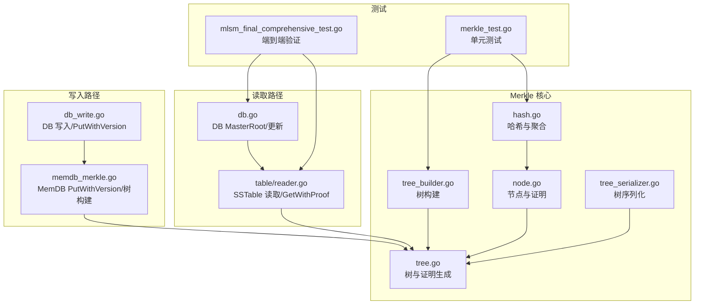
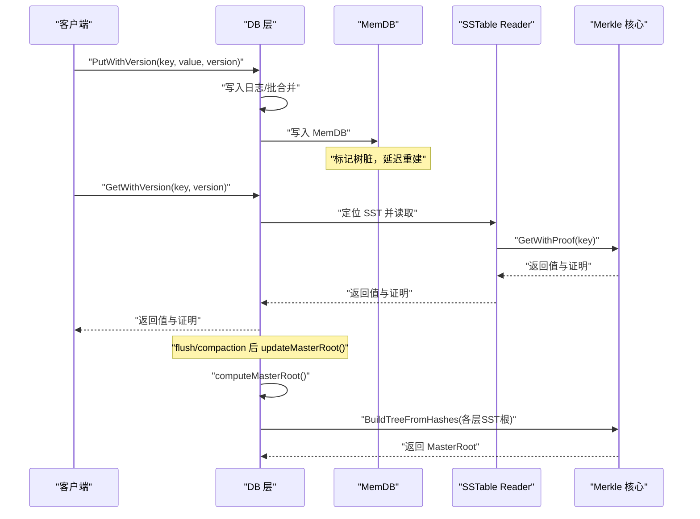
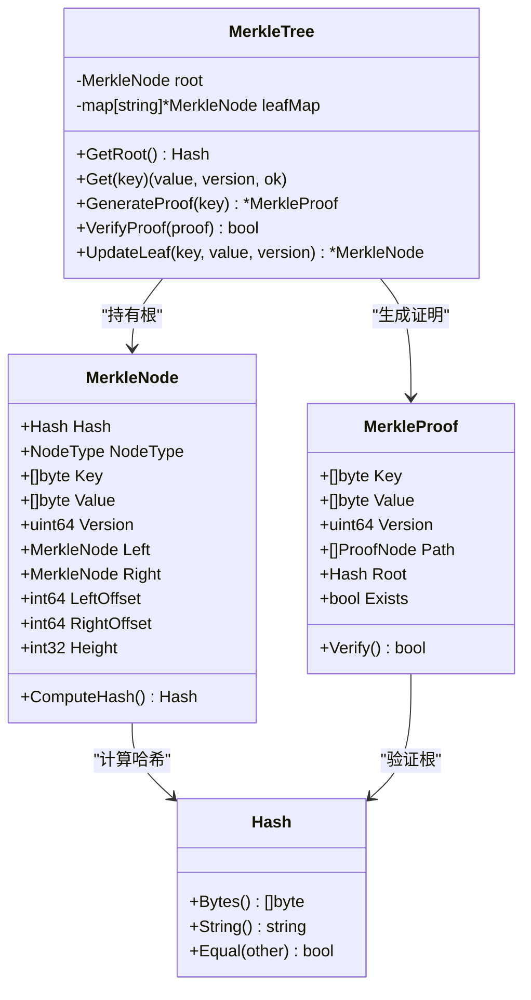
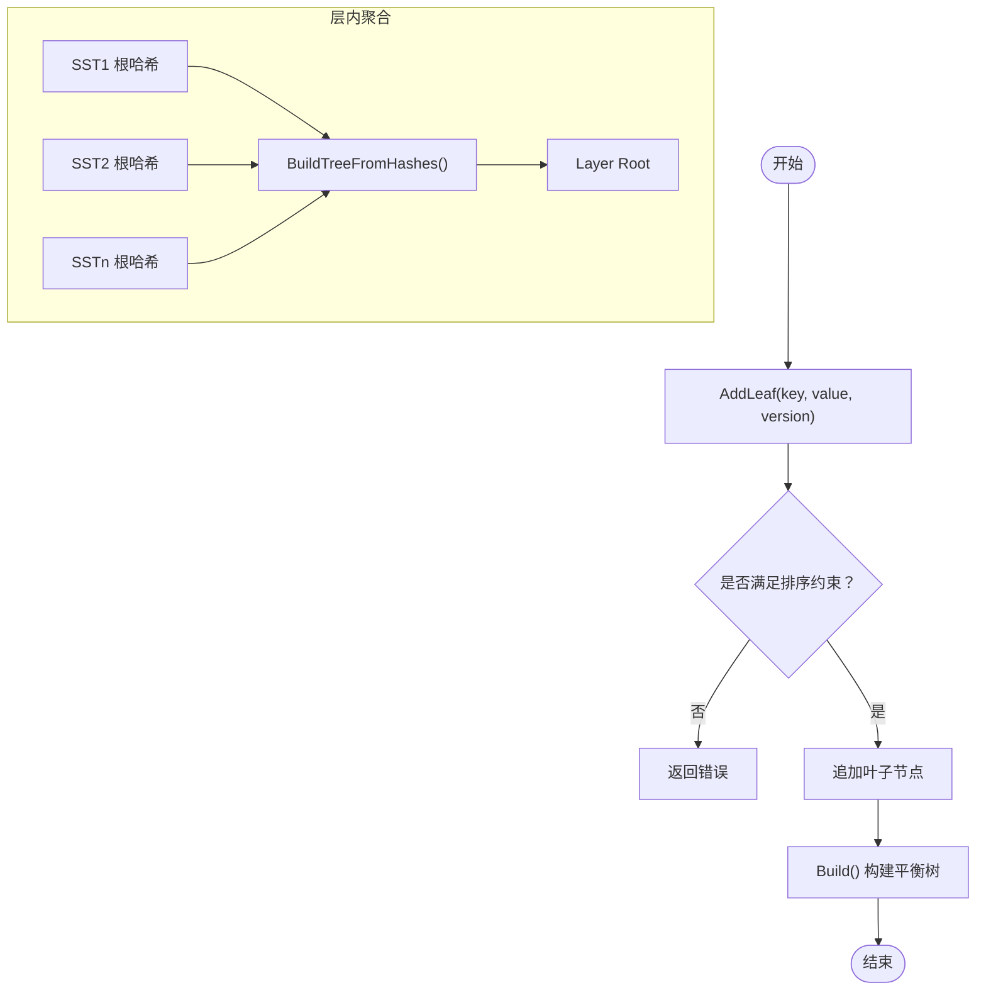
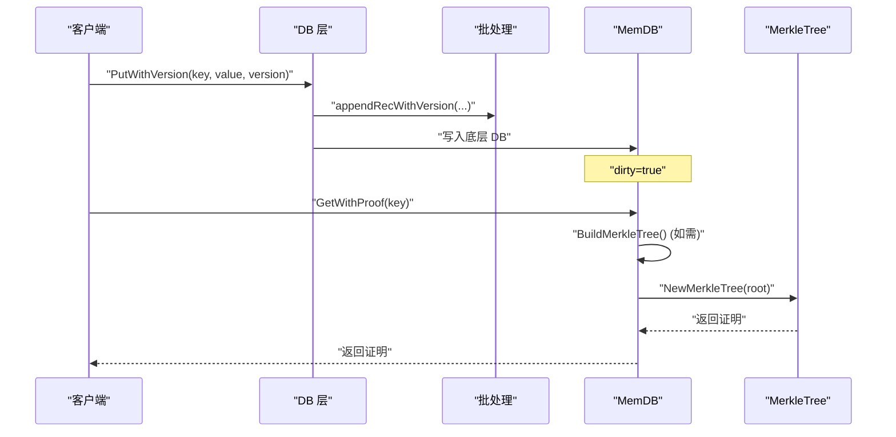
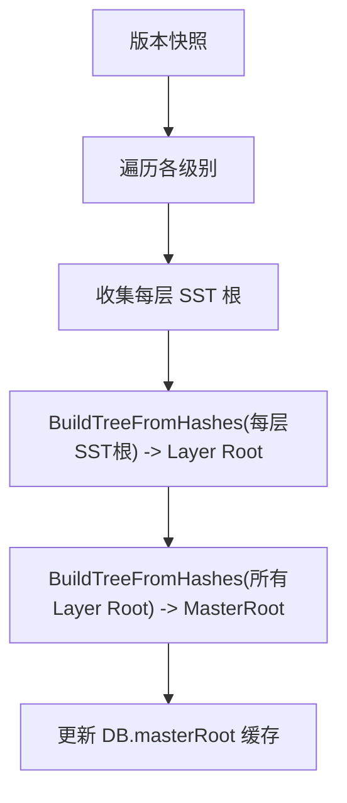
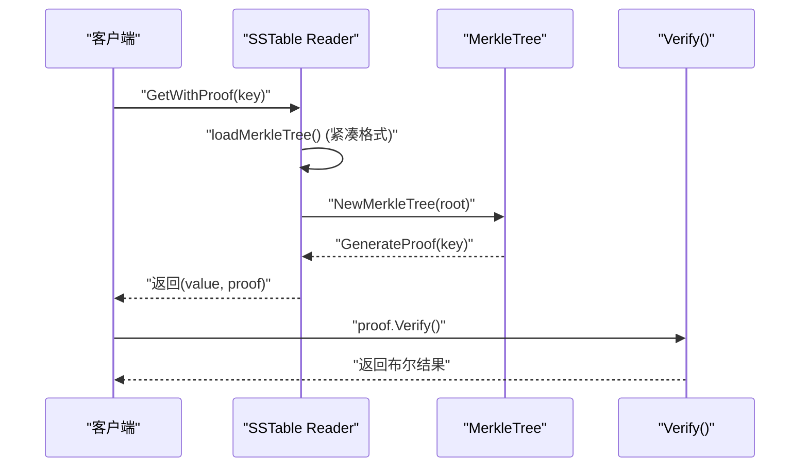
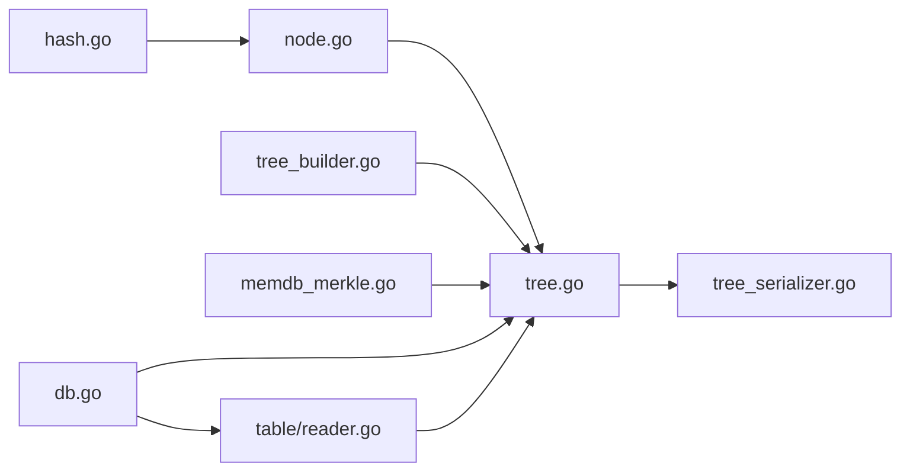
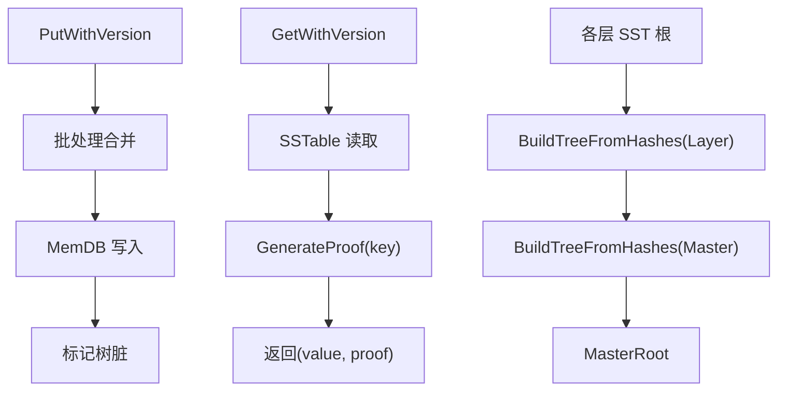

# 验证流程

<cite>
**本文引用的文件**
- [leveldb/merkle/tree.go](file://leveldb/merkle/tree.go)
- [leveldb/merkle/hash.go](file://leveldb/merkle/hash.go)
- [leveldb/merkle/node.go](file://leveldb/merkle/node.go)
- [leveldb/merkle/tree_serializer.go](file://leveldb/merkle/tree_serializer.go)
- [leveldb/merkle/tree_builder.go](file://leveldb/merkle/tree_builder.go)
- [leveldb/merkle/merkle_test.go](file://leveldb/merkle/merkle_test.go)
- [leveldb/memdb/memdb_merkle.go](file://leveldb/memdb/memdb_merkle.go)
- [leveldb/db_write.go](file://leveldb/db_write.go)
- [leveldb/db.go](file://leveldb/db.go)
- [leveldb/table/reader.go](file://leveldb/table/reader.go)
- [leveldb/mlsm_final_comprehensive_test.go](file://leveldb/mlsm_final_comprehensive_test.go)
</cite>

## 目录
1. [引言](#引言)
2. [项目结构](#项目结构)
3. [核心组件](#核心组件)
4. [架构总览](#架构总览)
5. [详细组件分析](#详细组件分析)
6. [依赖关系分析](#依赖关系分析)
7. [性能考量](#性能考量)
8. [故障排查指南](#故障排查指南)
9. [结论](#结论)
10. [附录](#附录)

## 引言
本文件面向 avccDB 的验证流程，系统性阐述 Merkle 树在数据流中的集成方式，重点覆盖以下主题：
- 在每次 PutWithVersion 操作后，如何通过 HashWithVersion 函数计算包含版本信息的数据哈希，并更新 Merkle 树结构。
- MasterRoot 如何在写入、压缩等关键操作后被重新计算和更新，确保聚合了所有层级的数据状态。
- GetWithProof 方法如何生成包含 Merkle 路径的证明，以及 Verify 方法如何使用该证明独立验证数据的真实性。
- 对 merkle_test.go 中测试用例的分析，说明不同版本数据的哈希计算和节点序列化机制。
- 提供验证流程的数据流图，标注 Merkle 树更新和证明生成的关键节点。

## 项目结构
围绕验证流程的核心代码主要位于 leveldb/merkle 子模块，以及与之交互的 memdb、table、db 层：
- Merkle 核心：树构建、节点与哈希、序列化、证明生成与校验。
- 写入路径：DB 层 Put/PutWithVersion 与批处理合并；MemDB 层 PutWithVersion。
- 读取路径：SSTable Reader 的 GetWithProof；DB 层 GetMasterRoot 与 MasterRoot 更新。
- 测试：merkle_test.go 验证哈希、序列化、树构建与证明；mlsm_final_comprehensive_test.go 验证 MasterRoot 与跨层一致性。

图表来源
- [leveldb/merkle/hash.go](file://leveldb/merkle/hash.go#L1-L153)
- [leveldb/merkle/node.go](file://leveldb/merkle/node.go#L1-L370)
- [leveldb/merkle/tree.go](file://leveldb/merkle/tree.go#L1-L286)
- [leveldb/merkle/tree_serializer.go](file://leveldb/merkle/tree_serializer.go#L1-L377)
- [leveldb/merkle/tree_builder.go](file://leveldb/merkle/tree_builder.go#L1-L430)
- [leveldb/memdb/memdb_merkle.go](file://leveldb/memdb/memdb_merkle.go#L1-L181)
- [leveldb/db_write.go](file://leveldb/db_write.go#L380-L438)
- [leveldb/db.go](file://leveldb/db.go#L1480-L1560)
- [leveldb/table/reader.go](file://leveldb/table/reader.go#L1004-L1146)
- [leveldb/mlsm_final_comprehensive_test.go](file://leveldb/mlsm_final_comprehensive_test.go#L150-L349)

章节来源
- [leveldb/merkle/tree.go](file://leveldb/merkle/tree.go#L1-L286)
- [leveldb/merkle/hash.go](file://leveldb/merkle/hash.go#L1-L153)
- [leveldb/merkle/node.go](file://leveldb/merkle/node.go#L1-L370)
- [leveldb/merkle/tree_serializer.go](file://leveldb/merkle/tree_serializer.go#L1-L377)
- [leveldb/merkle/tree_builder.go](file://leveldb/merkle/tree_builder.go#L1-L430)
- [leveldb/memdb/memdb_merkle.go](file://leveldb/memdb/memdb_merkle.go#L1-L181)
- [leveldb/db_write.go](file://leveldb/db_write.go#L380-L438)
- [leveldb/db.go](file://leveldb/db.go#L1480-L1560)
- [leveldb/table/reader.go](file://leveldb/table/reader.go#L1004-L1146)
- [leveldb/mlsm_final_comprehensive_test.go](file://leveldb/mlsm_final_comprehensive_test.go#L150-L349)

## 核心组件
- MerkleNode/MerkleTree：定义节点类型、叶子与内部节点的哈希计算、树的构建与证明生成。
- HashWithVersion：带版本号的叶子哈希计算，确保同一 key 的多版本可区分。
- MerkleProof/ProofNode：证明结构与逐层兄弟节点哈希，支持 Verify 自验证。
- TreeBuilder/StreamingTreeBuilder：自排序 KV 对构建平衡树，支持内存受限的流式构建。
- TreeSerializer/TreeDeserializer：树的二进制序列化与反序列化，支持紧凑格式。
- MemDB 与 DB：MemDB 提供 PutWithVersion 并延迟重建 Merkle 树；DB 在 flush/compaction 后更新 MasterRoot。

章节来源
- [leveldb/merkle/node.go](file://leveldb/merkle/node.go#L1-L152)
- [leveldb/merkle/tree.go](file://leveldb/merkle/tree.go#L1-L120)
- [leveldb/merkle/hash.go](file://leveldb/merkle/hash.go#L92-L152)
- [leveldb/merkle/tree_builder.go](file://leveldb/merkle/tree_builder.go#L1-L120)
- [leveldb/merkle/tree_serializer.go](file://leveldb/merkle/tree_serializer.go#L1-L120)
- [leveldb/memdb/memdb_merkle.go](file://leveldb/memdb/memdb_merkle.go#L42-L155)
- [leveldb/db.go](file://leveldb/db.go#L1480-L1560)

## 架构总览
下图展示从写入到读取、再到 MasterRoot 聚合的整体数据流与职责边界。

图表来源
- [leveldb/db_write.go](file://leveldb/db_write.go#L380-L438)
- [leveldb/memdb/memdb_merkle.go](file://leveldb/memdb/memdb_merkle.go#L42-L155)
- [leveldb/table/reader.go](file://leveldb/table/reader.go#L1041-L1146)
- [leveldb/db.go](file://leveldb/db.go#L1491-L1560)
- [leveldb/merkle/tree_builder.go](file://leveldb/merkle/tree_builder.go#L153-L187)

## 详细组件分析

### 组件A：Merkle 树与证明生成
- 节点与哈希
  - 叶子节点：根据是否带版本，采用 HashLeaf 或 HashWithVersion 计算。
  - 内部节点：HashInternal(left, right)。
- 证明生成
  - GenerateProof：存在性证明通过 buildProofPath 收集兄弟节点哈希；不存在性证明占位。
  - VerifyProof：先比对证明根与树根，再调用 MerkleProof.Verify。
- 更新策略
  - UpdateLeaf：收集现有叶子，更新或插入新叶子，去重并重排后重建树，更新索引。

图表来源
- [leveldb/merkle/node.go](file://leveldb/merkle/node.go#L1-L152)
- [leveldb/merkle/tree.go](file://leveldb/merkle/tree.go#L68-L120)
- [leveldb/merkle/hash.go](file://leveldb/merkle/hash.go#L1-L91)

章节来源
- [leveldb/merkle/node.go](file://leveldb/merkle/node.go#L49-L152)
- [leveldb/merkle/tree.go](file://leveldb/merkle/tree.go#L68-L120)
- [leveldb/merkle/hash.go](file://leveldb/merkle/hash.go#L68-L105)

### 组件B：版本化哈希与树构建
- HashWithVersion：在叶子哈希中加入版本字段，保证同一 key 的不同版本产生不同哈希，便于后续去重与选择最新版本。
- TreeBuilder：AddLeaf 要求按排序添加，且同 key 的高版本优先；Build 构建平衡树；BuildFromHashes 将多个哈希组合为树根，用于层内聚合。
- StreamingTreeBuilder：内存受限的增量构建，批量 flush 后再合并为最终树。

图表来源
- [leveldb/merkle/tree_builder.go](file://leveldb/merkle/tree_builder.go#L45-L120)
- [leveldb/merkle/tree_builder.go](file://leveldb/merkle/tree_builder.go#L153-L187)
- [leveldb/merkle/hash.go](file://leveldb/merkle/hash.go#L92-L105)

章节来源
- [leveldb/merkle/tree_builder.go](file://leveldb/merkle/tree_builder.go#L45-L120)
- [leveldb/merkle/tree_builder.go](file://leveldb/merkle/tree_builder.go#L153-L187)
- [leveldb/merkle/hash.go](file://leveldb/merkle/hash.go#L92-L105)

### 组件C：写入与树更新（PutWithVersion）
- DB 层 PutWithVersion：将带版本的记录写入批处理并落盘，随后触发 MemDB 写入。
- MemDB 层 PutWithVersion：仅写入底层 DB，标记树为“脏”，延迟重建。
- MemDB.BuildMerkleTree：从当前状态收集 KV 对，调用 BuildFromSorted 构建树并缓存根哈希。

图表来源
- [leveldb/db_write.go](file://leveldb/db_write.go#L387-L438)
- [leveldb/memdb/memdb_merkle.go](file://leveldb/memdb/memdb_merkle.go#L42-L155)

章节来源
- [leveldb/db_write.go](file://leveldb/db_write.go#L387-L438)
- [leveldb/memdb/memdb_merkle.go](file://leveldb/memdb/memdb_merkle.go#L42-L155)

### 组件D：MasterRoot 计算与更新
- computeMasterRoot：遍历版本中的各层 SST，提取每张表的 Merkle 根，先层内 BuildTreeFromHashes 得到 Layer Root，再对所有 Layer Root 调用 BuildTreeFromHashes 得到 MasterRoot。
- updateMasterRoot：在 flush/compaction 后调用 computeMasterRoot 并更新缓存。
- GetMasterRoot：并发安全地返回当前 MasterRoot。

图表来源
- [leveldb/db.go](file://leveldb/db.go#L1491-L1560)

章节来源
- [leveldb/db.go](file://leveldb/db.go#L1491-L1560)

### 组件E：读取与证明（GetWithProof）
- SSTable Reader.GetWithProof：加载 Merkle 树元数据（紧凑格式），构造证明结构，返回值与证明。
- MerkleTree.GenerateProof：针对 MemDB 的树生成证明；SST 层可通过直接计算叶子哈希与路径生成证明。
- MerkleProof.Verify：从叶子哈希开始，逐层用兄弟节点哈希拼接，最终与证明根比较。

图表来源
- [leveldb/table/reader.go](file://leveldb/table/reader.go#L1004-L1146)
- [leveldb/merkle/tree.go](file://leveldb/merkle/tree.go#L85-L120)
- [leveldb/merkle/node.go](file://leveldb/merkle/node.go#L122-L152)

章节来源
- [leveldb/table/reader.go](file://leveldb/table/reader.go#L1004-L1146)
- [leveldb/merkle/tree.go](file://leveldb/merkle/tree.go#L85-L120)
- [leveldb/merkle/node.go](file://leveldb/merkle/node.go#L122-L152)

### 组件F：测试用例解析（merkle_test.go）
- 哈希函数测试：验证 HashLeaf、HashWithVersion、HashInternal 的输出非零，不同版本产生不同哈希。
- 节点序列化测试：叶子节点二进制编解码正确性，包括 key/value/version/hash 的一致性。
- 树构建测试：从有序 KV 对构建树，统计节点数、叶子数与高度。
- 证明生成与验证：针对存在性证明，Verify 返回真；与树根 VerifyProof 也返回真。
- 流式构建测试：大批量数据分批构建，最终可正确检索。
- 紧凑格式测试：紧凑树格式的编解码正确性。

章节来源
- [leveldb/merkle/merkle_test.go](file://leveldb/merkle/merkle_test.go#L1-L317)

## 依赖关系分析
- MerkleNode/Hash：被 MerkleTree、MerkleProof 使用，是哈希与树结构的基础。
- TreeBuilder：依赖 Compare 函数与 KVPair 排序规则，构建平衡树。
- TreeSerializer：依赖 MerkleNode 的二进制格式，支持树的持久化与加载。
- MemDB：依赖 MerkleTree 构建与证明生成，提供延迟重建策略。
- DB：依赖 SSTable Reader 的 Merkle 根，进行层内与跨层聚合，维护 MasterRoot。

图表来源
- [leveldb/merkle/hash.go](file://leveldb/merkle/hash.go#L1-L153)
- [leveldb/merkle/node.go](file://leveldb/merkle/node.go#L1-L370)
- [leveldb/merkle/tree.go](file://leveldb/merkle/tree.go#L1-L286)
- [leveldb/merkle/tree_serializer.go](file://leveldb/merkle/tree_serializer.go#L1-L377)
- [leveldb/merkle/tree_builder.go](file://leveldb/merkle/tree_builder.go#L1-L430)
- [leveldb/memdb/memdb_merkle.go](file://leveldb/memdb/memdb_merkle.go#L1-L181)
- [leveldb/db.go](file://leveldb/db.go#L1480-L1560)
- [leveldb/table/reader.go](file://leveldb/table/reader.go#L1004-L1146)

## 性能考量
- 哈希计算：HashWithVersion/HashLeaf/HashInternal 均基于 SHA-256，复杂度 O(1) 每次；树高约 log n，证明验证 O(log n)。
- 树构建：TreeBuilder 自底向上构建平衡树，时间复杂度 O(n)；StreamingTreeBuilder 控制内存占用，适合大表。
- 证明生成：按树高收集兄弟节点，O(log n)；Verify 亦为 O(log n)。
- MasterRoot：每层 SST 根聚合为 Layer Root，再聚合为 MasterRoot，整体 O(N)，N 为 SST 数量。

[本节为通用指导，无需列出具体文件来源]

## 故障排查指南
- 证明验证失败
  - 检查证明根与树根是否一致（VerifyProof 先比对根）。
  - 确认证明路径长度与树高一致，兄弟节点顺序正确。
- 版本冲突或排序错误
  - AddLeaf 要求同 key 高版本优先；违反会返回错误。
- 序列化问题
  - 节点二进制格式包含类型、哈希、高度、叶子字段或内部偏移；反序列化失败通常由长度或偏移不匹配导致。
- MasterRoot 不更新
  - 确认在 flush/compaction 后调用了 updateMasterRoot；检查 computeMasterRoot 是否正确遍历各层并聚合。

章节来源
- [leveldb/merkle/tree.go](file://leveldb/merkle/tree.go#L213-L225)
- [leveldb/merkle/tree_builder.go](file://leveldb/merkle/tree_builder.go#L45-L67)
- [leveldb/merkle/tree_serializer.go](file://leveldb/merkle/tree_serializer.go#L233-L297)
- [leveldb/db.go](file://leveldb/db.go#L1562-L1571)

## 结论
avccDB 的验证流程通过 Merkle 树在多层级上提供完整性保障：
- 写入路径：PutWithVersion 与批处理合并后，MemDB 标记树脏，延迟重建；SST 层通过 Reader 加载紧凑树元数据生成证明。
- Merkle 核心：HashWithVersion 确保版本隔离；TreeBuilder/StreamingTreeBuilder 支持高效构建；TreeSerializer 实现树的持久化。
- 聚合路径：computeMasterRoot 将各层 SST 根聚合为 Layer Root，再聚合为 MasterRoot，形成全局状态摘要。
- 读取路径：GetWithProof 返回值与证明，Verify 独立验证数据真实性，结合 MasterRoot 实现跨层一致性校验。

[本节为总结性内容，无需列出具体文件来源]

## 附录
- 数据流图（含关键节点标注）
  - 写入：PutWithVersion -> 批处理 -> MemDB -> 标记树脏
  - 读取：GetWithVersion -> SSTable -> MerkleTree.GenerateProof -> 返回证明
  - 聚合：各层 SST 根 -> BuildTreeFromHashes -> Layer Root -> MasterRoot

图表来源
- [leveldb/db_write.go](file://leveldb/db_write.go#L387-L438)
- [leveldb/memdb/memdb_merkle.go](file://leveldb/memdb/memdb_merkle.go#L42-L155)
- [leveldb/table/reader.go](file://leveldb/table/reader.go#L1041-L1146)
- [leveldb/db.go](file://leveldb/db.go#L1491-L1560)
- [leveldb/merkle/tree_builder.go](file://leveldb/merkle/tree_builder.go#L153-L187)