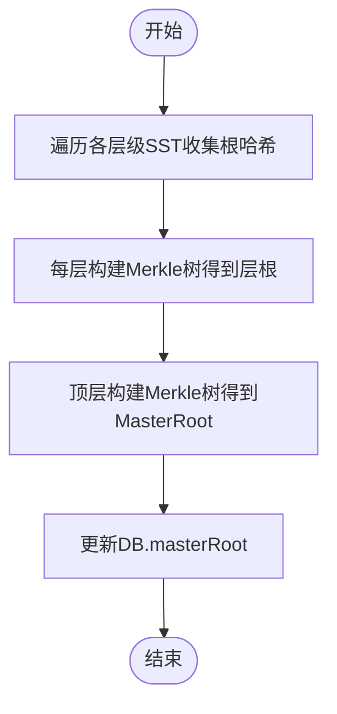

# DB组件

<cite>
**本文引用的文件**
- [leveldb/db.go](file://leveldb/db.go)
- [leveldb/db_write.go](file://leveldb/db_write.go)
- [leveldb/db_compaction.go](file://leveldb/db_compaction.go)
- [leveldb/db_snapshot.go](file://leveldb/db_snapshot.go)
- [leveldb/db_state.go](file://leveldb/db_state.go)
- [leveldb/session.go](file://leveldb/session.go)
- [leveldb/version.go](file://leveldb/version.go)
- [leveldb/memdb/memdb.go](file://leveldb/memdb/memdb.go)
- [leveldb/journal/journal.go](file://leveldb/journal/journal.go)
</cite>

## 目录
1. [引言](#引言)
2. [项目结构](#项目结构)
3. [核心组件](#核心组件)
4. [架构总览](#架构总览)
5. [详细组件分析](#详细组件分析)
6. [依赖关系分析](#依赖关系分析)
7. [性能考量](#性能考量)
8. [故障排查指南](#故障排查指南)
9. [结论](#结论)

## 引言
本文件面向 avccDB 的 DB 组件，系统性阐述其作为数据库主入口的设计与实现。重点覆盖以下方面：
- DB 结构体的核心字段及其职责：序列号、内存数据库、日志写入器、压缩统计、快照管理、写入锁机制、mLSM MasterRoot 等
- DB 如何协调 Session、MemDB、Storage 等子系统协同工作
- 核心方法（Put、Get、Delete、Write、Close）的调用流程与并发控制
- 类图与状态转换图，帮助理解生命周期与交互关系
- 线程安全设计（RWMutex、channel 并发控制）、错误处理与资源清理策略

## 项目结构
DB 组件位于 leveldb 子目录中，围绕 DB 结构体形成“入口-协调-调度”的核心层，向上承接应用层读写请求，向下协调内存数据库、磁盘表与日志持久化，并通过会话（Session）与版本（Version）管理元数据与压缩调度。

图表来源
- [leveldb/db.go](file://leveldb/db.go#L33-L126)
- [leveldb/db_write.go](file://leveldb/db_write.go#L1-L120)
- [leveldb/db_compaction.go](file://leveldb/db_compaction.go#L1-L120)
- [leveldb/db_snapshot.go](file://leveldb/db_snapshot.go#L1-L120)
- [leveldb/session.go](file://leveldb/session.go#L36-L120)
- [leveldb/version.go](file://leveldb/version.go#L21-L60)
- [leveldb/memdb/memdb.go](file://leveldb/memdb/memdb.go#L180-L220)
- [leveldb/journal/journal.go](file://leveldb/journal/journal.go#L340-L420)

章节来源
- [leveldb/db.go](file://leveldb/db.go#L33-L126)
- [leveldb/session.go](file://leveldb/session.go#L36-L120)

## 核心组件
- DB 结构体：数据库主入口，聚合序列号、内存数据库、日志写入器、快照链表、写入合并通道、压缩命令通道、MasterRoot 等
- Session：持久化会话，负责元数据（manifest）、版本管理、存储锁与后台任务
- MemDB：内存键值存储，支持并发读写与迭代
- Journal：预写日志（WAL），保障写入原子性与崩溃恢复
- Version：不可变的层级表视图，提供读取与压缩触发
- 快照（Snapshot）：一致性读取视图，基于序列号隔离

章节来源
- [leveldb/db.go](file://leveldb/db.go#L33-L126)
- [leveldb/session.go](file://leveldb/session.go#L36-L120)
- [leveldb/memdb/memdb.go](file://leveldb/memdb/memdb.go#L180-L220)
- [leveldb/journal/journal.go](file://leveldb/journal/journal.go#L340-L420)
- [leveldb/version.go](file://leveldb/version.go#L21-L60)
- [leveldb/db_snapshot.go](file://leveldb/db_snapshot.go#L1-L120)

## 架构总览
DB 通过 openDB 初始化，恢复或创建会话与日志，启动压缩错误处理与内存池回收协程；对外提供读写接口，内部通过快照、内存数据库、版本与存储协作完成数据读写与压缩。

图表来源
- [leveldb/db.go](file://leveldb/db.go#L100-L175)
- [leveldb/db_write.go](file://leveldb/db_write.go#L1-L120)
- [leveldb/db_compaction.go](file://leveldb/db_compaction.go#L1-L120)
- [leveldb/version.go](file://leveldb/version.go#L140-L220)

## 详细组件分析

### DB 结构体与核心字段
- 序列号 seq：全局单调递增，用于标识写入顺序与快照隔离
- 统计与写入节流：cWriteDelay、cWriteDelayN、inWritePaused、aliveSnaps、aliveIters
- 压缩统计：memComp、level0Comp、nonLevel0Comp、seekComp
- Session：s
- 内存数据库：memMu、memPool、mem、frozenMem、journal、journalWriter、journalFd、frozenJournalFd、frozenSeq
- 快照：snapsMu、snapsList
- 写入：batchPool、writeMergeC、writeMergedC、writeLockC、writeAckC、writeDelay、writeDelayN、tr
- 压缩：compCommitLk、tcompCmdC、tcompPauseC、mcompCmdC、compErrC、compPerErrC、compErrSetC、compWriteLocking、compStats、memdbMaxLevel
- mLSM MasterRoot：masterRootMu、masterRoot
- 关闭：closeW、closeC、closed、closer

章节来源
- [leveldb/db.go](file://leveldb/db.go#L33-L126)
- [leveldb/db_state.go](file://leveldb/db_state.go#L23-L120)

### 写入流程（Put/Write/Delete）
- 写入合并：通过 writeMergeC 尝试合并小批次，减少日志写入与内存更新次数
- 节流与旋转：根据 L0 文件数量与内存可用空间决定是否延迟、暂停或旋转 MemDB
- 日志写入：使用 journal.Writer 将批次写入 WAL，并可选择同步刷盘
- 应用到内存：将批次记录写入当前 MemDB，更新序列号
- 触发压缩：必要时触发 mem/tbl 压缩

图表来源
- [leveldb/db_write.go](file://leveldb/db_write.go#L1-L120)
- [leveldb/db_write.go](file://leveldb/db_write.go#L120-L330)
- [leveldb/journal/journal.go](file://leveldb/journal/journal.go#L340-L420)
- [leveldb/memdb/memdb.go](file://leveldb/memdb/memdb.go#L270-L340)

章节来源
- [leveldb/db_write.go](file://leveldb/db_write.go#L1-L120)
- [leveldb/db_write.go](file://leveldb/db_write.go#L120-L330)
- [leveldb/journal/journal.go](file://leveldb/journal/journal.go#L340-L420)
- [leveldb/memdb/memdb.go](file://leveldb/memdb/memdb.go#L270-L340)

### 读取流程（Get/Has/NewIterator/快照）
- 快照：acquireSnapshot() 基于最新序列号生成快照元素，minSeq() 提供最小未被快照占用的序列号
- 读取顺序：辅助 MemDB → 当前/冻结 MemDB → 版本（Version）层级表
- 迭代器：NewIterator 返回基于快照的一致性视图
- 版本查询：walkOverlapping 遍历重叠表，解析内部键，按版本规则返回最新或指定版本

图表来源
- [leveldb/db.go](file://leveldb/db.go#L798-L890)
- [leveldb/version.go](file://leveldb/version.go#L140-L220)
- [leveldb/db_snapshot.go](file://leveldb/db_snapshot.go#L1-L120)

章节来源
- [leveldb/db.go](file://leveldb/db.go#L798-L890)
- [leveldb/version.go](file://leveldb/version.go#L140-L220)
- [leveldb/db_snapshot.go](file://leveldb/db_snapshot.go#L1-L120)

### 压缩与版本管理
- 压缩错误传播：compactionError() 协程维护瞬时/持久错误通道，必要时持有写锁阻塞写入
- 内存压缩：memCompaction() 将冻结 MemDB 刷写到 SST，提交会话记录，更新 MasterRoot
- 表压缩：tableCompaction() 构建 tableCompactionBuilder，遍历源层级表，按严格模式与最小版本策略输出新表，提交并更新 MasterRoot
- 自动/范围压缩：compTrigger/compTriggerWait/compTriggerRange 触发压缩命令并等待完成
- 版本：Version 不可变视图，提供迭代器、偏移估算、压缩评分与触发

图表来源
- [leveldb/db_compaction.go](file://leveldb/db_compaction.go#L1-L120)
- [leveldb/db_compaction.go](file://leveldb/db_compaction.go#L260-L360)
- [leveldb/db_compaction.go](file://leveldb/db_compaction.go#L560-L640)
- [leveldb/version.go](file://leveldb/version.go#L620-L700)

章节来源
- [leveldb/db_compaction.go](file://leveldb/db_compaction.go#L1-L120)
- [leveldb/db_compaction.go](file://leveldb/db_compaction.go#L260-L360)
- [leveldb/db_compaction.go](file://leveldb/db_compaction.go#L560-L640)
- [leveldb/version.go](file://leveldb/version.go#L620-L700)

### mLSM MasterRoot 与 Merkle 证明
- MasterRoot：聚合所有层级的 SST 根哈希，形成分层 Merkle 树的顶层根
- 更新时机：mem 刷写与表压缩完成后调用 updateMasterRoot() 重新计算
- 读取接口：GetMasterRoot() 返回当前聚合根
- 读取证明：GetWithProof() 在 MemDB/SST 层分别生成证明，最终与 MasterRoot 组合增强证明

图表来源
- [leveldb/db.go](file://leveldb/db.go#L1479-L1571)
- [leveldb/db.go](file://leveldb/db.go#L835-L932)

章节来源
- [leveldb/db.go](file://leveldb/db.go#L1479-L1571)
- [leveldb/db.go](file://leveldb/db.go#L835-L932)

### 关闭流程与资源清理
- 关闭顺序：关闭写锁、等待后台协程退出、关闭日志与存储、释放 MemDB、关闭会话
- 错误处理：从压缩错误通道取回持久错误，若只读则忽略
- 清理：清空快照列表、关闭存储、释放 closer

图表来源
- [leveldb/db_state.go](file://leveldb/db_state.go#L220-L237)
- [leveldb/db.go](file://leveldb/db.go#L1573-L1642)

章节来源
- [leveldb/db_state.go](file://leveldb/db_state.go#L220-L237)
- [leveldb/db.go](file://leveldb/db.go#L1573-L1642)

## 依赖关系分析
- DB 依赖 Session 管理元数据与版本；依赖 MemDB 提供内存读写；依赖 Journal 提供 WAL；依赖 Version 提供只读视图
- 写入路径：DB → Journal → MemDB；读取路径：DB → MemDB → Version
- 压缩路径：DB → Session/Version → Storage；MasterRoot 更新贯穿刷写与压缩

图表来源
- [leveldb/db.go](file://leveldb/db.go#L33-L126)
- [leveldb/session.go](file://leveldb/session.go#L36-L120)
- [leveldb/version.go](file://leveldb/version.go#L21-L60)
- [leveldb/memdb/memdb.go](file://leveldb/memdb/memdb.go#L180-L220)
- [leveldb/journal/journal.go](file://leveldb/journal/journal.go#L340-L420)

章节来源
- [leveldb/db.go](file://leveldb/db.go#L33-L126)
- [leveldb/session.go](file://leveldb/session.go#L36-L120)
- [leveldb/version.go](file://leveldb/version.go#L21-L60)
- [leveldb/memdb/memdb.go](file://leveldb/memdb/memdb.go#L180-L220)
- [leveldb/journal/journal.go](file://leveldb/journal/journal.go#L340-L420)

## 性能考量
- 写入合并：通过 writeMergeC 降低日志写入频率，提升吞吐
- 写入节流：依据 L0 文件数与 MemDB 可用空间动态延时/暂停，避免级联放大
- 迭代器与快照：快照隔离确保一致性读取，避免并发写入导致的不一致
- 压缩统计：cStats 记录各级别读写耗时与大小，便于监控与优化
- MasterRoot：仅在刷写与压缩后更新，避免频繁计算

章节来源
- [leveldb/db_write.go](file://leveldb/db_write.go#L60-L120)
- [leveldb/db_compaction.go](file://leveldb/db_compaction.go#L1-L120)
- [leveldb/db.go](file://leveldb/db.go#L1358-L1441)

## 故障排查指南
- 压缩错误处理：compactionError() 协程负责错误状态机，瞬时错误与持久错误区分处理
- 只读模式：SetReadOnly() 通过 compWriteLocking 阻止写入并设置只读状态
- 关闭阻塞：Close() 会等待后台协程退出，若存在持久错误可能阻塞，需检查压缩错误通道
- 日志损坏：Journal Reader 支持严格模式与校验，发现损坏块/块头会丢弃并可选择跳过

章节来源
- [leveldb/db_compaction.go](file://leveldb/db_compaction.go#L80-L140)
- [leveldb/db_write.go](file://leveldb/db_write.go#L499-L530)
- [leveldb/journal/journal.go](file://leveldb/journal/journal.go#L140-L220)

## 结论
DB 组件以结构化字段与清晰的协程模型实现了对内存、磁盘与日志的统一编排。通过快照隔离、写入合并与节流、压缩错误传播与 MasterRoot 聚合，DB 在保证一致性与可验证性的前提下，提供了高吞吐与可扩展的读写能力。建议在生产环境中关注压缩统计、MasterRoot 更新时机与只读模式下的写入阻塞行为，以获得更优的稳定性与可观测性。