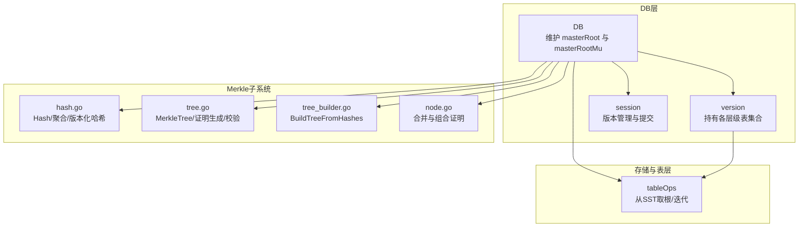
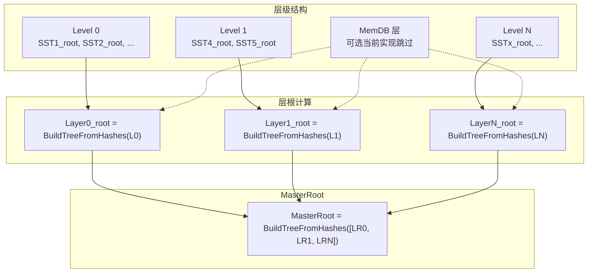
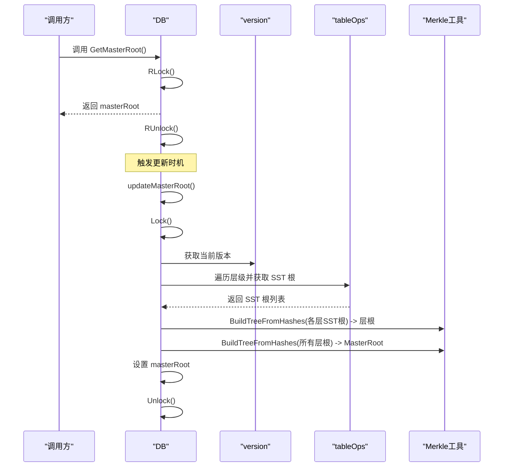
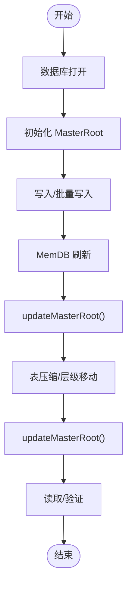
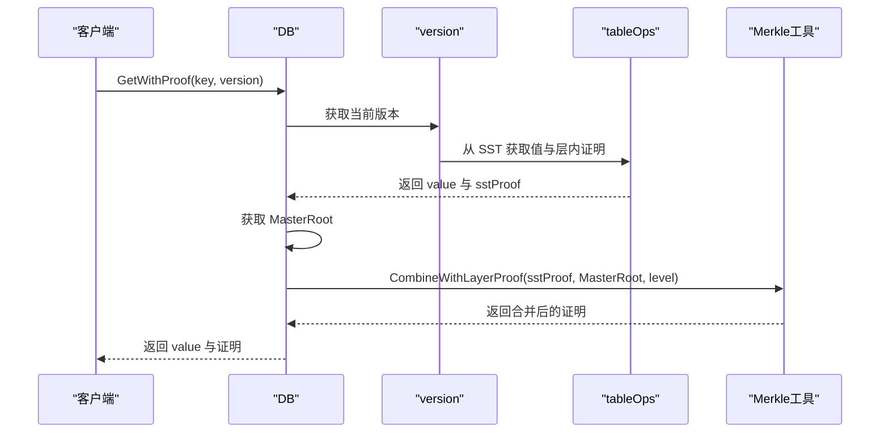
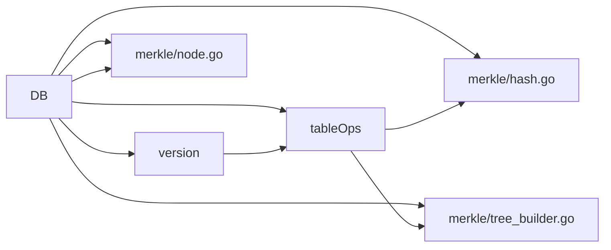

# MasterRoot管理

<cite>
**本文引用的文件**
- [leveldb/db.go](file://leveldb/db.go)
- [leveldb/db_compaction.go](file://leveldb/db_compaction.go)
- [leveldb/version.go](file://leveldb/version.go)
- [leveldb/session.go](file://leveldb/session.go)
- [leveldb/merkle/hash.go](file://leveldb/merkle/hash.go)
- [leveldb/merkle/tree.go](file://leveldb/merkle/tree.go)
- [leveldb/merkle/tree_builder.go](file://leveldb/merkle/tree_builder.go)
- [leveldb/merkle/node.go](file://leveldb/merkle/node.go)
- [leveldb/mlsm_final_comprehensive_test.go](file://leveldb/mlsm_final_comprehensive_test.go)
</cite>

## 目录
1. [引言](#引言)
2. [项目结构](#项目结构)
3. [核心组件](#核心组件)
4. [架构总览](#架构总览)
5. [详细组件分析](#详细组件分析)
6. [依赖关系分析](#依赖关系分析)
7. [性能考量](#性能考量)
8. [故障排查指南](#故障排查指南)
9. [结论](#结论)
10. [附录](#附录)

## 引言
本文件面向 avccDB 的 DB 组件，系统化阐述 mLSM 场景下的 MasterRoot 管理机制。MasterRoot 作为数据库全局状态的 Merkle 根摘要，聚合了所有层级（含 Level 0~N 与 MemDB 层）的 Merkle 根，用于提供全局数据完整性验证、防篡改与数据溯源能力。本文将从计算、更新、验证三方面深入解析，并给出更新与验证流程图，说明在数据库打开、写入、压缩等关键节点的更新时机与一致性保障，以及并发访问控制（sync.RWMutex）带来的性能影响。

## 项目结构
围绕 MasterRoot 的实现，涉及以下关键模块：
- DB 层：维护 masterRoot 与 masterRootMu；提供 GetMasterRoot、computeMasterRoot、updateMasterRoot；在打开、写入、压缩等关键路径触发更新。
- 版本与层级：version 提供各层级表集合；tableOps 提供从 SST 获取 Merkle 根的能力。
- Merkle 子系统：定义 Hash、节点、树构建与序列化工具；提供 BuildTreeFromHashes 与 AggregateRoots 等聚合函数。
- 测试：mlsm_final_comprehensive_test 对 MasterRoot 的计算、一致性与 Proof 验证进行端到端验证。

图表来源
- [leveldb/db.go](file://leveldb/db.go#L89-L98)
- [leveldb/db.go](file://leveldb/db.go#L1480-L1571)
- [leveldb/version.go](file://leveldb/version.go#L1-L120)
- [leveldb/session.go](file://leveldb/session.go#L1-L120)
- [leveldb/merkle/hash.go](file://leveldb/merkle/hash.go#L1-L153)
- [leveldb/merkle/tree.go](file://leveldb/merkle/tree.go#L1-L120)
- [leveldb/merkle/tree_builder.go](file://leveldb/merkle/tree_builder.go#L153-L187)
- [leveldb/merkle/node.go](file://leveldb/merkle/node.go#L299-L369)

章节来源
- [leveldb/db.go](file://leveldb/db.go#L89-L98)
- [leveldb/version.go](file://leveldb/version.go#L1-L120)
- [leveldb/session.go](file://leveldb/session.go#L1-L120)
- [leveldb/merkle/hash.go](file://leveldb/merkle/hash.go#L1-L153)
- [leveldb/merkle/tree.go](file://leveldb/merkle/tree.go#L1-L120)
- [leveldb/merkle/tree_builder.go](file://leveldb/merkle/tree_builder.go#L153-L187)
- [leveldb/merkle/node.go](file://leveldb/merkle/node.go#L299-L369)

## 核心组件
- DB.masterRoot 与 masterRootMu
  - DB 在内部字段中维护 masterRoot（类型为 merkle.Hash），并以 sync.RWMutex 控制并发读写。
  - 提供 GetMasterRoot 读取接口与 updateMasterRoot 内部更新接口。
- MasterRoot 计算
  - computeMasterRoot 会遍历当前版本的所有层级，收集每层 SST 的 Merkle 根，先对每层的 SST 根构建“层根”（BuildTreeFromHashes），再对所有层根构建“全局 MasterRoot”。
- 更新时机
  - 数据库打开后立即调用 updateMasterRoot 初始化。
  - memdb 刷新（memCompaction）与表压缩（tableCompaction）完成后调用 updateMasterRoot。
- 并发与一致性
  - 读取：GetMasterRoot 使用 RLock，允许多读。
  - 更新：updateMasterRoot 使用 Lock，串行化更新，确保读取始终看到一致的全局根。
- 验证与溯源
  - GetWithProof 返回包含 Merkle 路径的证明；在 mLSM 下，可通过 CombineWithLayerProof 将层根与 MasterRoot 联动，形成跨层证明结构。
  - 测试用例覆盖 MasterRoot 的计算、一致性与 Proof 验证。

章节来源
- [leveldb/db.go](file://leveldb/db.go#L89-L98)
- [leveldb/db.go](file://leveldb/db.go#L1480-L1571)
- [leveldb/db_compaction.go](file://leveldb/db_compaction.go#L339-L341)
- [leveldb/db_compaction.go](file://leveldb/db_compaction.go#L627-L629)
- [leveldb/mlsm_final_comprehensive_test.go](file://leveldb/mlsm_final_comprehensive_test.go#L150-L210)

## 架构总览
MasterRoot 的计算采用三层聚合结构：
- 层级一：SST 层（每个 SST 表拥有自己的 Merkle 根）
- 层级二：层根（同一层级内，将该层所有 SST 根按顺序构建 Merkle 树，得到层根）
- 层级三：MasterRoot（将所有层根按顺序构建 Merkle 树，得到全局 MasterRoot）

图表来源
- [leveldb/db.go](file://leveldb/db.go#L1494-L1505)
- [leveldb/db.go](file://leveldb/db.go#L1506-L1560)
- [leveldb/merkle/tree_builder.go](file://leveldb/merkle/tree_builder.go#L153-L187)

## 详细组件分析

### MasterRoot 计算与更新流程
- 计算入口：computeMasterRoot
  - 获取当前版本（version），遍历各层级表集合。
  - 对每个层级，收集 SST 的 Merkle 根；若存在则构建层根（BuildTreeFromHashes）。
  - 收集所有层根后，构建最终 MasterRoot（BuildTreeFromHashes）。
- 更新入口：updateMasterRoot
  - 加写锁，调用 computeMasterRoot，设置 masterRoot，并记录日志。
- 读取入口：GetMasterRoot
  - 加读锁，返回 masterRoot。

图表来源
- [leveldb/db.go](file://leveldb/db.go#L1480-L1571)
- [leveldb/version.go](file://leveldb/version.go#L1-L120)
- [leveldb/merkle/tree_builder.go](file://leveldb/merkle/tree_builder.go#L153-L187)

章节来源
- [leveldb/db.go](file://leveldb/db.go#L1480-L1571)
- [leveldb/version.go](file://leveldb/version.go#L1-L120)
- [leveldb/merkle/tree_builder.go](file://leveldb/merkle/tree_builder.go#L153-L187)

### MasterRoot 在数据库生命周期中的更新时机
- 数据库打开
  - openDB 中在恢复完成后调用 updateMasterRoot 初始化 MasterRoot。
- 写入与刷新
  - memCompaction 在提交后调用 updateMasterRoot，确保 MemDB 刷新后的全局状态一致。
- 压缩与移动
  - tableCompaction 在提交后调用 updateMasterRoot，确保层级调整后的全局状态一致。
- 其他场景
  - 任何导致版本变更或表集合变化的操作，均应触发 MasterRoot 更新，以保证全局完整性。

图表来源
- [leveldb/db.go](file://leveldb/db.go#L168-L171)
- [leveldb/db_compaction.go](file://leveldb/db_compaction.go#L339-L341)
- [leveldb/db_compaction.go](file://leveldb/db_compaction.go#L627-L629)

章节来源
- [leveldb/db.go](file://leveldb/db.go#L168-L171)
- [leveldb/db_compaction.go](file://leveldb/db_compaction.go#L339-L341)
- [leveldb/db_compaction.go](file://leveldb/db_compaction.go#L627-L629)

### MasterRoot 验证与跨层证明
- 层内验证
  - 从 SST 获取 Merkle 证明（GetWithProof），证明包含从叶子到该层根的路径。
- 跨层聚合
  - 当前实现中，GetWithProof 返回的证明 Root 通常为局部层根；通过 CombineWithLayerProof 将层根与 MasterRoot 聚合，形成跨层证明结构。
- 测试验证
  - 测试用例对 MasterRoot 的计算、一致性与 Proof 验证进行端到端覆盖，包括最新版本与历史版本的查询、MasterRoot 变化检测与 Proof 结构校验。

图表来源
- [leveldb/db.go](file://leveldb/db.go#L835-L932)
- [leveldb/merkle/node.go](file://leveldb/merkle/node.go#L347-L369)
- [leveldb/mlsm_final_comprehensive_test.go](file://leveldb/mlsm_final_comprehensive_test.go#L236-L324)

章节来源
- [leveldb/db.go](file://leveldb/db.go#L835-L932)
- [leveldb/merkle/node.go](file://leveldb/merkle/node.go#L347-L369)
- [leveldb/mlsm_final_comprehensive_test.go](file://leveldb/mlsm_final_comprehensive_test.go#L236-L324)

### 并发访问控制与性能影响
- 并发模型
  - 读多写少：GetMasterRoot 使用 RWMutex.RLock，允许多个读取并发执行。
  - 写少且关键：updateMasterRoot 使用 RWMutex.Lock，串行化更新，避免读取到中间态。
- 性能影响
  - 读取开销极低（仅锁竞争），适合高频查询。
  - 更新成本取决于层级数量与 SST 数量，但仅在关键路径触发，整体开销可控。
  - 若读取频繁而更新稀少，MasterRoot 的读写分离可显著提升吞吐。

章节来源
- [leveldb/db.go](file://leveldb/db.go#L1480-L1571)

## 依赖关系分析
- DB 依赖
  - version：获取层级表集合，驱动 MasterRoot 的层级遍历。
  - tableOps：从 SST 获取 Merkle 根，作为层根输入。
  - merkle/hash.go 与 merkle/tree_builder.go：提供 Hash、BuildTreeFromHashes 等聚合与树构建能力。
  - merkle/node.go：提供 CombineWithLayerProof 等跨层证明组合工具。
- 更新链路
  - openDB -> updateMasterRoot -> computeMasterRoot -> BuildTreeFromHashes -> AggregateRoots（间接）
  - memCompaction -> updateMasterRoot
  - tableCompaction -> updateMasterRoot

图表来源
- [leveldb/db.go](file://leveldb/db.go#L1480-L1571)
- [leveldb/version.go](file://leveldb/version.go#L1-L120)
- [leveldb/merkle/hash.go](file://leveldb/merkle/hash.go#L1-L153)
- [leveldb/merkle/tree_builder.go](file://leveldb/merkle/tree_builder.go#L153-L187)
- [leveldb/merkle/node.go](file://leveldb/merkle/node.go#L347-L369)

章节来源
- [leveldb/db.go](file://leveldb/db.go#L1480-L1571)
- [leveldb/version.go](file://leveldb/version.go#L1-L120)
- [leveldb/merkle/hash.go](file://leveldb/merkle/hash.go#L1-L153)
- [leveldb/merkle/tree_builder.go](file://leveldb/merkle/tree_builder.go#L153-L187)
- [leveldb/merkle/node.go](file://leveldb/merkle/node.go#L347-L369)

## 性能考量
- 计算复杂度
  - 每次更新需遍历所有层级与 SST，时间复杂度近似 O(Σ 层级SST数)；空间复杂度与树高相关。
- 缓存与优化
  - 读取使用 RWMutex，避免热点竞争。
  - MasterRoot 更新仅在关键路径触发，避免频繁重算。
- 实践建议
  - 控制层级数量与 SST 数量，减少更新成本。
  - 在高并发读场景下，尽量降低更新频率，结合业务特性安排压缩窗口。

## 故障排查指南
- MasterRoot 未更新
  - 检查是否在 memCompaction 与 tableCompaction 后调用了 updateMasterRoot。
  - 确认版本提交成功（commit）后再更新。
- 读取到旧 MasterRoot
  - 确保 GetMasterRoot 使用 RLock，且在更新期间未被其他写操作阻塞。
- Proof 验证失败
  - 确认 CombineWithLayerProof 的使用是否正确，Root 是否为聚合后的 MasterRoot。
  - 检查版本号与键的解析是否一致（版本化键格式）。

章节来源
- [leveldb/db_compaction.go](file://leveldb/db_compaction.go#L339-L341)
- [leveldb/db_compaction.go](file://leveldb/db_compaction.go#L627-L629)
- [leveldb/db.go](file://leveldb/db.go#L1480-L1571)
- [leveldb/merkle/node.go](file://leveldb/merkle/node.go#L347-L369)

## 结论
MasterRoot 为 avccDB 的全局数据完整性提供了坚实基础。通过分层聚合与跨层证明组合，实现了对历史版本与当前状态的统一验证与溯源。在数据库打开、写入、压缩等关键节点的更新策略，配合 RWMutex 的读写分离，既保证了强一致性，又兼顾了高并发读取的性能。建议在生产环境中合理规划压缩窗口与层级分布，以进一步降低 MasterRoot 更新成本并提升整体稳定性。

## 附录
- 关键 API 与路径
  - GetMasterRoot：读取 MasterRoot
  - updateMasterRoot：串行更新 MasterRoot
  - computeMasterRoot：计算 MasterRoot
  - CombineWithLayerProof：跨层证明组合
  - BuildTreeFromHashes：从哈希列表构建 Merkle 根
  - AggregateRoots：聚合多个根为单一根

章节来源
- [leveldb/db.go](file://leveldb/db.go#L1480-L1571)
- [leveldb/merkle/node.go](file://leveldb/merkle/node.go#L347-L369)
- [leveldb/merkle/tree_builder.go](file://leveldb/merkle/tree_builder.go#L153-L187)
- [leveldb/merkle/hash.go](file://leveldb/merkle/hash.go#L127-L153)