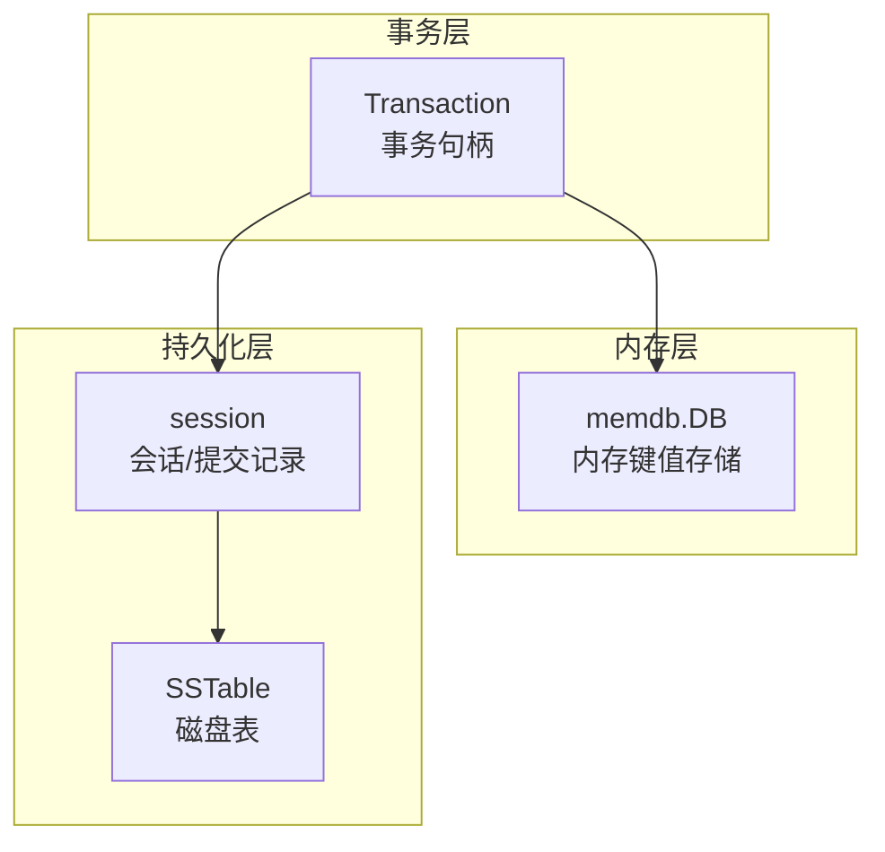
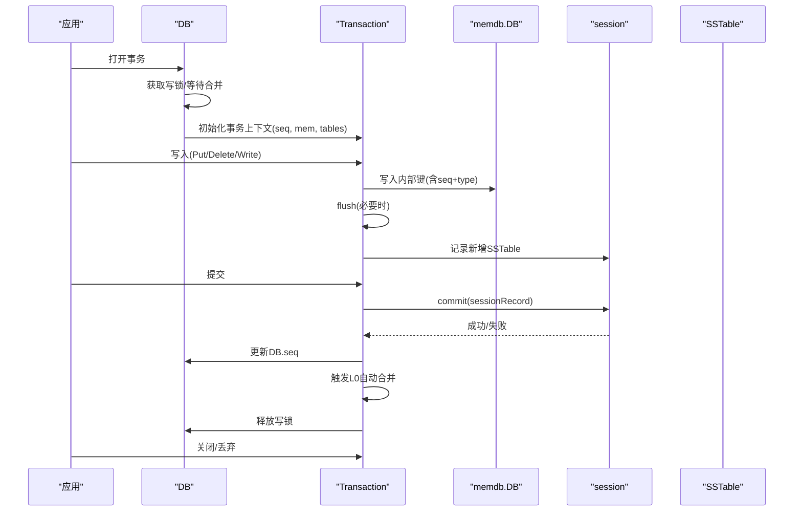
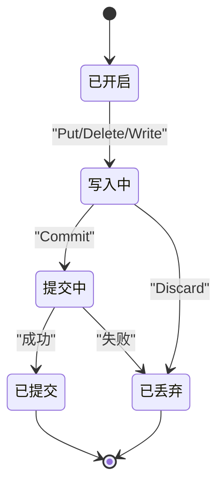
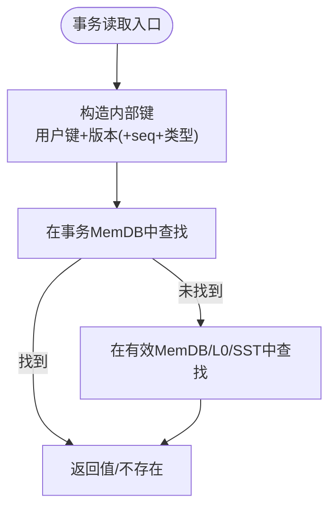
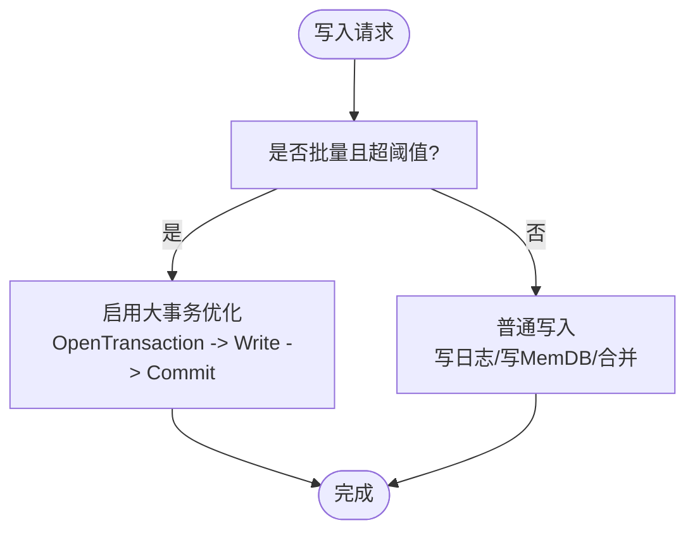
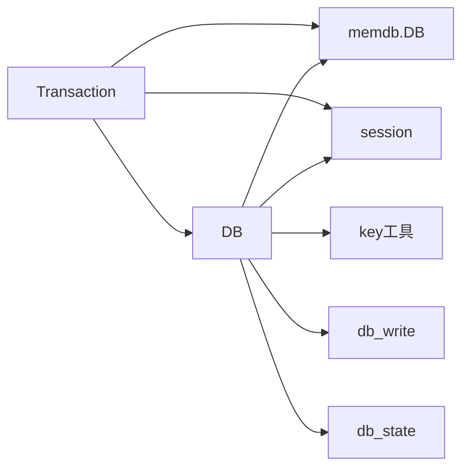

# 事务管理

<cite>
**本文引用的文件**
- [db_transaction.go](file://leveldb/db_transaction.go)
- [memdb.go](file://leveldb/memdb/memdb.go)
- [db.go](file://leveldb/db.go)
- [key.go](file://leveldb/key.go)
- [db_write.go](file://leveldb/db_write.go)
- [session.go](file://leveldb/session.go)
- [dbstress/main.go](file://manualtest/dbstress/main.go)
</cite>

## 目录
1. [简介](#简介)
2. [项目结构](#项目结构)
3. [核心组件](#核心组件)
4. [架构总览](#架构总览)
5. [详细组件分析](#详细组件分析)
6. [依赖关系分析](#依赖关系分析)
7. [性能考量](#性能考量)
8. [故障排查指南](#故障排查指南)
9. [结论](#结论)
10. [附录](#附录)

## 简介
本文件面向 avccDB 的 DB 组件，系统化阐述事务（Transaction）的生命周期与实现机制，重点覆盖：
- 事务的开启、提交与回滚流程
- 基于内存数据库（MemDB）与序列号（seq）的 ACID 实现要点（尤其是原子性与隔离性）
- 事务写入与普通写入的差异，以及大事务的优化策略（直接写入 SSTable）
- 事务冲突处理与超时重试机制
- 性能监控与调试方法
- 事务生命周期图与并发控制图

## 项目结构
围绕事务管理的关键代码主要分布在以下模块：
- 事务句柄与生命周期：leveldb/db_transaction.go
- 内存数据库（MemDB）：leveldb/memdb/memdb.go
- 数据库核心读写与序列号管理：leveldb/db.go、leveldb/key.go、leveldb/db_write.go
- 会话与提交记录：leveldb/session.go
- 性能监控与压力测试：manualtest/dbstress/main.go

图表来源
- [db_transaction.go](file://leveldb/db_transaction.go#L1-L120)
- [memdb.go](file://leveldb/memdb/memdb.go#L180-L240)
- [session.go](file://leveldb/session.go#L36-L70)

章节来源
- [db_transaction.go](file://leveldb/db_transaction.go#L1-L120)
- [memdb.go](file://leveldb/memdb/memdb.go#L180-L240)
- [session.go](file://leveldb/session.go#L36-L70)

## 核心组件
- 事务句柄（Transaction）：封装事务上下文（DB 引用、MemDB、已生成的 SSTable 列表、序列号、读写锁等），提供 Get/Has/NewIterator/Put/Delete/Write/Commit/Discard 等方法。
- 内存数据库（memdb.DB）：基于跳表的内存键值存储，支持并发读写、迭代器、容量与空闲空间查询。
- 序列号（seq）：全局单调递增的序列号，用于内部键打包（用户键 + 版本/类型 + 序列号），保证写入顺序与可见性。
- 提交记录（sessionRecord）：记录事务提交所需的状态（如新增的 SSTable、序列号等），通过 session.commit 完成原子落盘。
- 大事务优化：当批量写入超过阈值时，直接绕过日志与 MemDB，转而创建 SSTable 并直接加入 L0，减少写放大。

章节来源
- [db_transaction.go](file://leveldb/db_transaction.go#L21-L120)
- [memdb.go](file://leveldb/memdb/memdb.go#L180-L240)
- [key.go](file://leveldb/key.go#L75-L120)
- [db_write.go](file://leveldb/db_write.go#L276-L330)
- [session.go](file://leveldb/session.go#L36-L70)

## 架构总览
事务在 avccDB 中的执行路径如下：
- 开启事务：DB.OpenTransaction 获取独占写锁，初始化事务上下文（复制当前 seq、分配 MemDB 池对象）。
- 写入阶段：事务写入（Put/Delete/Write）将记录编码为内部键（含 seq+type），写入事务的 MemDB；当 MemDB 空间不足时触发 flush，将 MemDB 转换为 SSTable 并登记到事务记录中。
- 提交阶段：若存在变更，设置事务记录的最终 seq，加锁调用 session.commit 提交；成功后更新 DB 的全局 seq，并触发一次 L0 自动合并；最后释放事务资源。
- 回滚阶段：Discard 将已生成的临时 SSTable 从会话中移除，释放事务资源。

图表来源
- [db_transaction.go](file://leveldb/db_transaction.go#L284-L336)
- [db_transaction.go](file://leveldb/db_transaction.go#L92-L116)
- [db_transaction.go](file://leveldb/db_transaction.go#L189-L251)
- [session.go](file://leveldb/session.go#L36-L70)

## 详细组件分析

### 事务生命周期与并发控制
- 并发控制：DB 使用一个写锁通道（writeLockC）确保同一时刻仅有一个事务处于活跃状态；同时 DB 在打开事务前会等待必要的合并完成，避免事务写入导致 L0 压力过大。
- 生命周期：
  - 开启：OpenTransaction 获取写锁，复制当前 seq，分配 MemDB，设置 DB.tr 指向当前事务。
  - 写入：Put/Delete/Write 将记录写入事务的 MemDB；当 MemDB 空间不足时 flush，将 MemDB 转为 SSTable 并登记到事务记录。
  - 提交：Commit 先 flush，再设置事务记录的最终 seq，加锁调用 session.commit；成功后更新 DB.seq，触发 L0 合并；最后 setDone 释放资源并归还写锁。
  - 回滚：Discard 清理已生成的临时 SSTable，setDone 释放资源并归还写锁。

图表来源
- [db_transaction.go](file://leveldb/db_transaction.go#L284-L336)
- [db_transaction.go](file://leveldb/db_transaction.go#L189-L251)
- [db_transaction.go](file://leveldb/db_transaction.go#L254-L275)

章节来源
- [db_transaction.go](file://leveldb/db_transaction.go#L284-L336)
- [db_transaction.go](file://leveldb/db_transaction.go#L189-L251)
- [db_transaction.go](file://leveldb/db_transaction.go#L254-L275)

### 原子性与隔离性：MemDB 与序列号（seq）
- 原子性：
  - 事务提交通过 session.commit 完成，该过程以“一次性”方式将事务记录写入 Manifest 并登记新增 SSTable，从而保证要么全部生效，要么不生效。
  - 事务提交过程中有最多三次重试与短暂等待，避免瞬时错误导致提交失败。
- 隔离性：
  - 事务使用独立的 MemDB 与序列号快照（seq），读取时通过内部键的 seq 与版本信息进行匹配，确保读到的是事务开始时或之前的可见版本。
  - 事务内的迭代器持有自身资源，可存活于事务之外，但读取结果在事务提交前保持一致视图。
- 内部键与版本：
  - 内部键由用户键 + 版本（可选）+ 序列号 + 类型组成，解析时区分版本键与非版本键，从而支持多版本查询与证明。

图表来源
- [key.go](file://leveldb/key.go#L75-L120)
- [db.go](file://leveldb/db.go#L798-L833)
- [db.go](file://leveldb/db.go#L1056-L1090)

章节来源
- [key.go](file://leveldb/key.go#L75-L120)
- [db.go](file://leveldb/db.go#L798-L833)
- [db.go](file://leveldb/db.go#L1056-L1090)

### 事务写入与普通写入的区别
- 事务写入：
  - 写入目标是事务的 MemDB；当 MemDB 空间不足时 flush，生成 SSTable 并登记到事务记录。
  - 事务提交时才真正对外可见，期间读取通过事务快照保证一致性。
- 普通写入：
  - 直接写入当前 MemDB，必要时写入日志并按阈值触发旋转与合并。
  - 大批量写入可能触发“大事务优化”：当单次批量大小超过阈值且允许时，直接创建事务并写入 SSTable，跳过日志，降低写放大。

图表来源
- [db_write.go](file://leveldb/db_write.go#L276-L330)
- [db_transaction.go](file://leveldb/db_transaction.go#L92-L116)

章节来源
- [db_write.go](file://leveldb/db_write.go#L276-L330)
- [db_transaction.go](file://leveldb/db_transaction.go#L92-L116)

### 大事务优化：直接写入 SSTable
- 触发条件：批量写入长度超过写缓冲阈值，且未禁用大事务优化。
- 优化策略：直接开启事务，将批量写入转换为 SSTable 并加入 L0，避免日志与中间 MemDB，显著降低写放大。
- 注意事项：该路径下事务仍遵循提交/回滚语义，只是写入路径不同。

章节来源
- [db_write.go](file://leveldb/db_write.go#L276-L330)
- [db_transaction.go](file://leveldb/db_transaction.go#L92-L116)

### 事务冲突处理与超时重试
- 冲突检测：事务通过独占写锁与 DB 的写入节流（flush）机制，避免与其他写入竞争导致的不可预期状态。
- 超时与重试：事务提交时对 session.commit 进行最多三次重试，每次重试前等待固定时间；若 DB 关闭则提前退出。
- 合并阻塞：OpenTransaction 会等待必要的合并完成，防止事务写入造成 L0 压力过大。

章节来源
- [db_transaction.go](file://leveldb/db_transaction.go#L189-L251)
- [db_transaction.go](file://leveldb/db_transaction.go#L277-L282)
- [db_write.go](file://leveldb/db_write.go#L66-L131)

### 事务读取与迭代器
- 读取：事务的 Get/Has 通过内部键（含 seq）在事务 MemDB 与已生成的 SSTable 中查找，保证一致性。
- 迭代器：NewIterator 返回的迭代器持有自身资源，可在事务外存活，读取结果为事务快照视图。

章节来源
- [db_transaction.go](file://leveldb/db_transaction.go#L41-L90)
- [db.go](file://leveldb/db.go#L1200-L1230)

## 依赖关系分析
- Transaction 依赖 DB 的序列号、MemDB 池、写锁、合并触发器与 session.commit。
- MemDB 作为事务写入的目标，提供 Put/Delete/Get/NewIterator 等能力。
- Key 工具负责内部键的构造与解析，支撑事务读取与版本匹配。
- DB_write 负责普通写入路径与大事务优化；DB_state 提供序列号原子更新与 MemDB 引用计数管理。

图表来源
- [db_transaction.go](file://leveldb/db_transaction.go#L21-L120)
- [db.go](file://leveldb/db.go#L33-L99)
- [key.go](file://leveldb/key.go#L75-L120)
- [db_write.go](file://leveldb/db_write.go#L276-L330)

章节来源
- [db_transaction.go](file://leveldb/db_transaction.go#L21-L120)
- [db.go](file://leveldb/db.go#L33-L99)
- [key.go](file://leveldb/key.go#L75-L120)
- [db_write.go](file://leveldb/db_write.go#L276-L330)

## 性能考量
- 写放大与延迟：
  - 事务写入在 flush 时会产生 SSTable，可能触发 L0 合并；DB 提供写延迟统计与暂停标志，便于观察写入压力。
  - 大事务优化可显著降低写放大，适合大批量写入场景。
- 监控指标：
  - 可通过 GetProperty 查询“writedelay”、“compcount”、“iostats”、“openedtables”、“alivesnaps”、“aliveiters”等指标。
  - 手工压力测试程序展示了事务吞吐与延迟统计，可用于对比不同写入策略的性能表现。

章节来源
- [db.go](file://leveldb/db.go#L1245-L1356)
- [db.go](file://leveldb/db.go#L1358-L1441)
- [dbstress/main.go](file://manualtest/dbstress/main.go#L392-L467)

## 故障排查指南
- 常见问题
  - 事务未提交即关闭：检查是否在 Commit/Discard 后正确释放资源。
  - 提交失败重试：关注日志中的重试次数与等待时间，确认 DB 是否被关闭或出现合并错误。
  - 写入阻塞：检查 L0 表数量与写延迟统计，确认是否存在持续合并阻塞。
- 调试建议
  - 使用 GetProperty 获取实时统计，定位写入瓶颈。
  - 在压力测试中对比“普通写入”与“大事务优化”的吞吐与延迟，选择合适策略。
  - 关注事务提交前后的 MemDB 引用计数与 SSTable 生命周期，避免资源泄漏。

章节来源
- [db_transaction.go](file://leveldb/db_transaction.go#L189-L251)
- [db.go](file://leveldb/db.go#L1245-L1356)
- [dbstress/main.go](file://manualtest/dbstress/main.go#L392-L467)

## 结论
avccDB 的事务管理通过“事务专用 MemDB + 序列号 + 会话提交记录”的组合，实现了强一致的事务语义。事务在提交阶段采用幂等式重试与 L0 自动合并，兼顾了可靠性与性能。对于大批量写入，大事务优化可显著降低写放大。配合完善的监控接口与压力测试工具，用户可以有效评估与调优事务写入的性能与稳定性。

## 附录
- 事务 API 路径参考
  - 开启事务：[OpenTransaction](file://leveldb/db_transaction.go#L284-L336)
  - 写入：[Put](file://leveldb/db_transaction.go#L132-L160)、[Delete](file://leveldb/db_transaction.go#L147-L160)、[Write](file://leveldb/db_transaction.go#L161-L180)
  - 提交：[Commit](file://leveldb/db_transaction.go#L189-L251)
  - 回滚：[Discard](file://leveldb/db_transaction.go#L263-L275)
  - flush：[flush](file://leveldb/db_transaction.go#L92-L116)
  - 内部键构造/解析：[makeInternalKey](file://leveldb/key.go#L75-L88)、[parseInternalKey](file://leveldb/key.go#L106-L117)
  - 大事务优化：[Write(批量)](file://leveldb/db_write.go#L276-L330)
  - 监控接口：[GetProperty](file://leveldb/db.go#L1245-L1356)