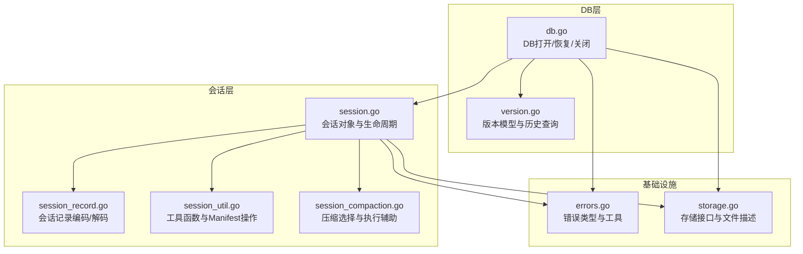
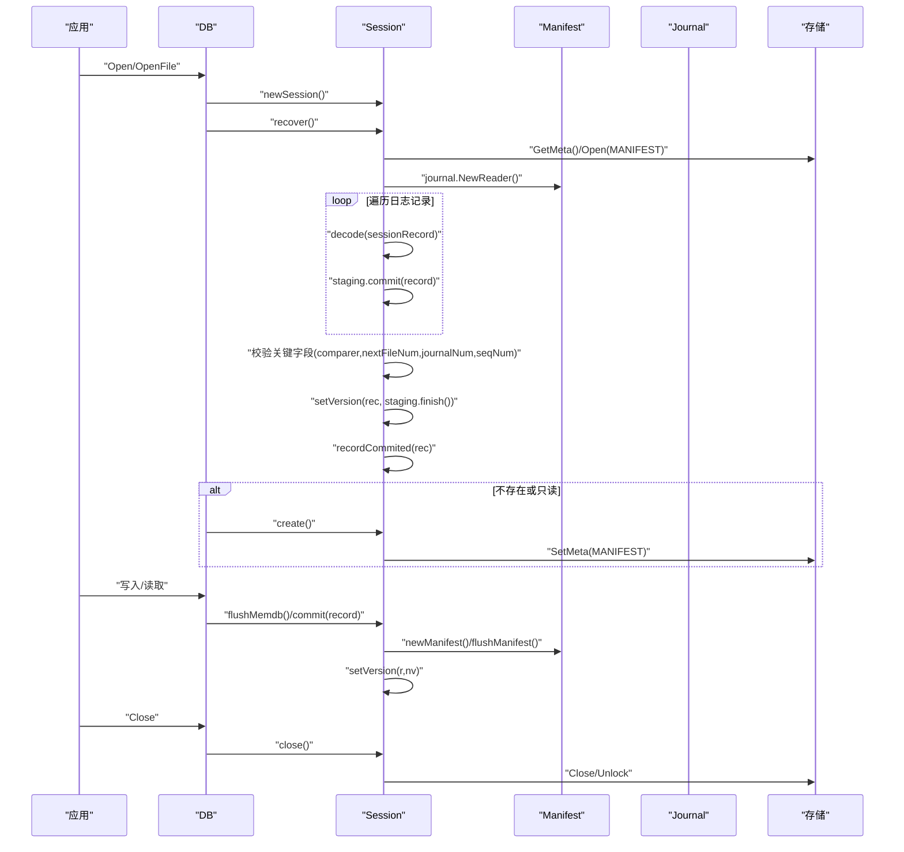
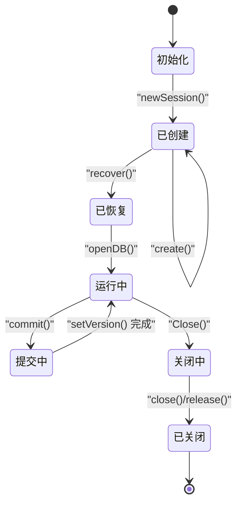
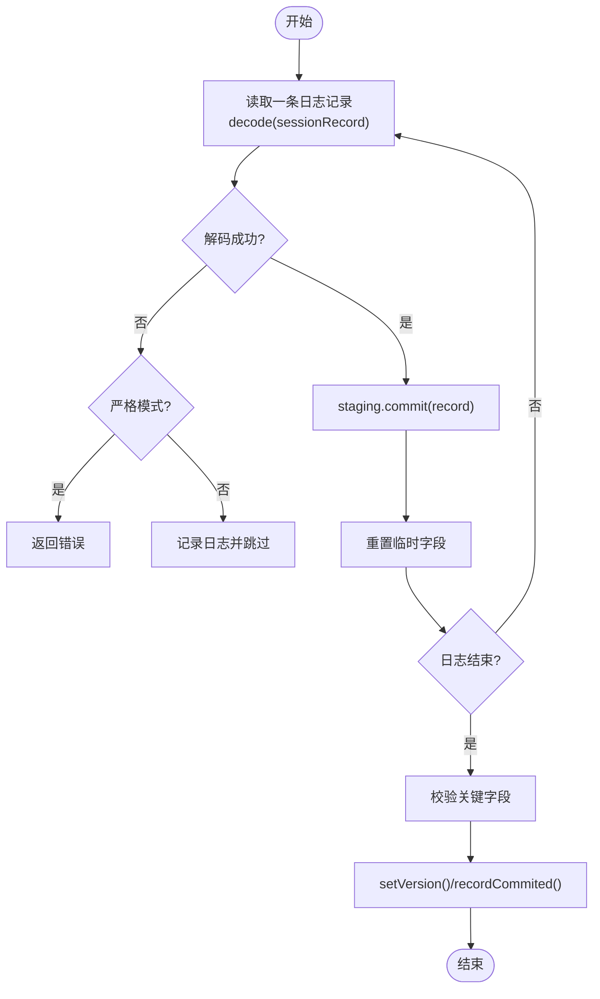
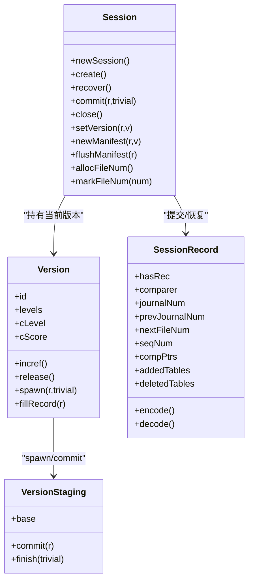
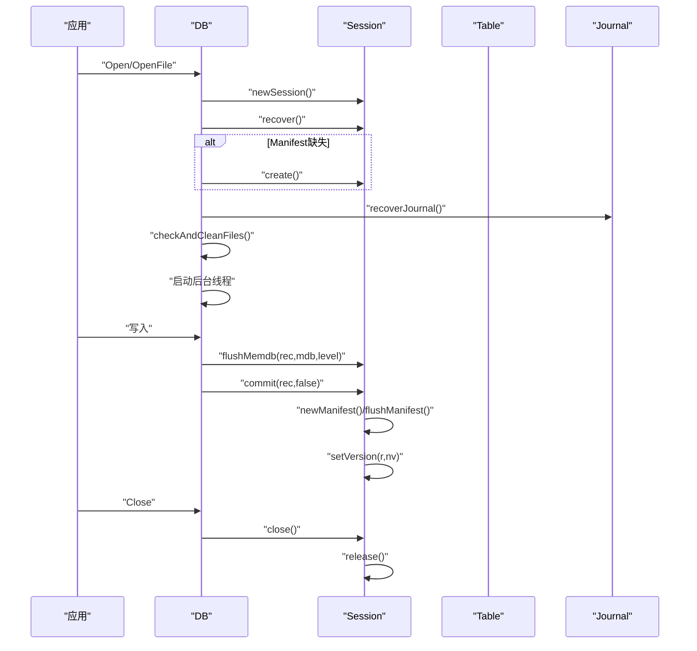
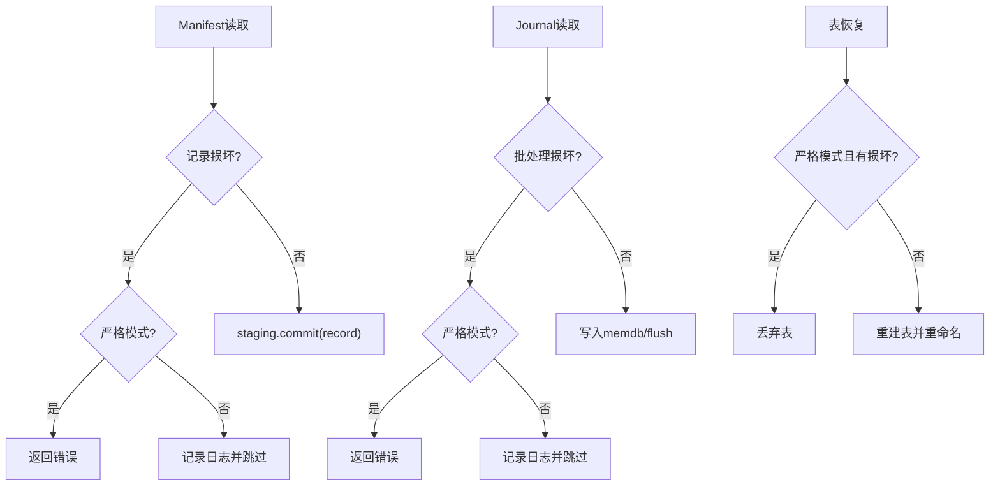
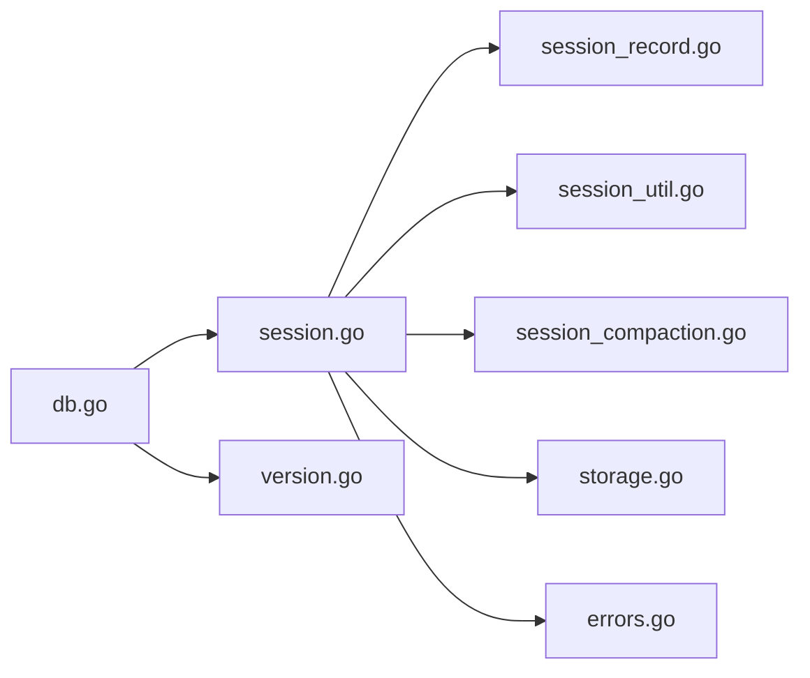

# 会话管理

<cite>
**本文引用的文件**
- [session.go](file://leveldb/session.go)
- [session_record.go](file://leveldb/session_record.go)
- [session_util.go](file://leveldb/session_util.go)
- [session_compaction.go](file://leveldb/session_compaction.go)
- [db.go](file://leveldb/db.go)
- [version.go](file://leveldb/version.go)
- [errors.go](file://leveldb/errors/errors.go)
- [storage.go](file://leveldb/storage/storage.go)
</cite>

## 目录
1. [简介](#简介)
2. [项目结构](#项目结构)
3. [核心组件](#核心组件)
4. [架构总览](#架构总览)
5. [详细组件分析](#详细组件分析)
6. [依赖关系分析](#依赖关系分析)
7. [性能考量](#性能考量)
8. [故障排查指南](#故障排查指南)
9. [结论](#结论)

## 简介
本文件面向 avccDB 的 DB 组件，系统化阐述会话（Session）与 DB 的协作机制，重点覆盖以下方面：
- Session 如何管理数据库的元数据、文件列表、版本控制与配置选项
- 会话在数据库打开、恢复、提交与关闭过程中的角色
- 通过会话记录（sessionRecord）实现原子性元数据更新的流程
- 错误处理与故障恢复机制，特别是损坏元数据文件的处理策略
- 提供会话状态机与组件交互图，帮助理解其在数据库生命周期中的作用

## 项目结构
围绕会话管理的关键代码位于 leveldb 子目录中，主要文件如下：
- session.go：会话对象定义、创建、恢复、提交、关闭等核心逻辑
- session_record.go：会话记录的编码/解码、字段类型与校验
- session_util.go：会话工具函数、版本引用计数循环、文件号分配与回收、Manifest 写入与刷新
- session_compaction.go：基于会话进行的压缩选择与执行辅助
- db.go：DB 打开、恢复、关闭流程，以及与 Journal 和 Manifest 的交互
- version.go：版本模型、版本生成与引用计数、版本历史查询等
- errors.go、storage.go：错误类型与存储抽象，支撑会话的错误传播与文件元信息

图表来源
- [session.go](file://leveldb/session.go#L1-L243)
- [session_record.go](file://leveldb/session_record.go#L1-L324)
- [session_util.go](file://leveldb/session_util.go#L1-L492)
- [session_compaction.go](file://leveldb/session_compaction.go#L1-L330)
- [db.go](file://leveldb/db.go#L1-L800)
- [version.go](file://leveldb/version.go#L1-L200)
- [errors.go](file://leveldb/errors/errors.go#L50-L79)
- [storage.go](file://leveldb/storage/storage.go#L54-L118)

章节来源
- [session.go](file://leveldb/session.go#L1-L243)
- [session_record.go](file://leveldb/session_record.go#L1-L324)
- [session_util.go](file://leveldb/session_util.go#L1-L492)
- [session_compaction.go](file://leveldb/session_compaction.go#L1-L330)
- [db.go](file://leveldb/db.go#L1-L800)
- [version.go](file://leveldb/version.go#L1-L200)
- [errors.go](file://leveldb/errors/errors.go#L50-L79)
- [storage.go](file://leveldb/storage/storage.go#L54-L118)

## 核心组件
- 会话（session）：持久化数据库会话，负责维护当前版本、Manifest 文件、文件号、序列号、比较器、压缩指针等；提供创建、恢复、提交、关闭等能力
- 会话记录（sessionRecord）：以日志形式记录元数据变更，包含比较器、下一个文件号、日志文件号、序列号、压缩指针、新增/删除表等字段，并支持编码/解码
- 版本（version）：不可变的数据结构，描述各层级的表集合、下一次压缩的层级与评分、引用计数等；通过 spawn/newStaging/fillRecord 等方法参与元数据变更的原子化应用
- DB：对外暴露的数据库实例，负责打开/恢复/关闭流程，协调 Journal 恢复、Manifest 创建与提交、清理过期文件等

章节来源
- [session.go](file://leveldb/session.go#L36-L121)
- [session_record.go](file://leveldb/session_record.go#L55-L132)
- [version.go](file://leveldb/version.go#L26-L84)
- [db.go](file://leveldb/db.go#L100-L175)

## 架构总览
会话管理贯穿数据库生命周期，核心交互如下：
- 打开阶段：DB 调用 newSession 创建会话，随后调用 s.recover 恢复 Manifest 并重建当前版本；若不存在则 s.create 创建新 Manifest
- 运行阶段：DB 从 Journal 恢复写入状态，必要时 flushMemdb 到表并生成新的 sessionRecord，通过 s.commit 将变更原子化应用到新版本
- 关闭阶段：DB 调用 s.close 关闭 Manifest/写入器，释放锁，等待后台 goroutine 结束

图表来源
- [db.go](file://leveldb/db.go#L177-L243)
- [session.go](file://leveldb/session.go#L122-L208)
- [session_util.go](file://leveldb/session_util.go#L403-L492)
- [session_record.go](file://leveldb/session_record.go#L198-L324)

## 详细组件分析

### 会话对象与生命周期
- 初始化与锁：newSession 创建会话并获取存储锁，初始化版本、表操作器、通道与后台循环
- 创建与恢复：create 建立新 Manifest；recover 从 Manifest 日志读取记录，构建版本快照，校验关键字段后应用
- 提交与版本切换：commit 基于当前版本生成新版本，必要时新建或刷新 Manifest，最终 setVersion 应用新版本
- 关闭：close 关闭 Manifest/写入器，终止后台 goroutine，释放锁

图表来源
- [session.go](file://leveldb/session.go#L70-L121)
- [session.go](file://leveldb/session.go#L122-L208)
- [session.go](file://leveldb/session.go#L210-L242)
- [db.go](file://leveldb/db.go#L100-L175)

章节来源
- [session.go](file://leveldb/session.go#L70-L121)
- [session.go](file://leveldb/session.go#L122-L208)
- [session.go](file://leveldb/session.go#L210-L242)

### 会话记录（sessionRecord）与原子性元数据更新
- 字段与编码：sessionRecord 支持比较器、日志文件号、下一个文件号、序列号、压缩指针、新增/删除表等字段的编码/解码
- 解码与容错：recover 中逐条读取日志记录，遇到损坏记录可按严格模式决定是否跳过或报错
- 原子性应用：commit 通过 spawn 新版本、newManifest 或 flushManifest 将记录写入 Manifest，再 setVersion 应用新版本，确保元数据一致性

图表来源
- [session.go](file://leveldb/session.go#L130-L208)
- [session_record.go](file://leveldb/session_record.go#L198-L324)
- [session_util.go](file://leveldb/session_util.go#L359-L492)

章节来源
- [session_record.go](file://leveldb/session_record.go#L55-L132)
- [session_record.go](file://leveldb/session_record.go#L198-L324)
- [session.go](file://leveldb/session.go#L130-L208)
- [session_util.go](file://leveldb/session_util.go#L359-L492)

### 版本管理与文件引用计数循环
- 版本模型：version 描述各层级表集合、压缩评分与目标层级、引用计数等；通过 incref/release 控制引用
- 引用计数循环：refLoop 保证版本任务严格有序处理，使用 delta 记录文件增删，避免并发删除导致的竞态
- 文件号管理：allocFileNum/markFileNum/reuseFileNum 确保文件号唯一且不回退

图表来源
- [session.go](file://leveldb/session.go#L36-L121)
- [version.go](file://leveldb/version.go#L26-L84)
- [version.go](file://leveldb/version.go#L566-L584)
- [session_record.go](file://leveldb/session_record.go#L55-L132)
- [session_util.go](file://leveldb/session_util.go#L70-L249)

章节来源
- [version.go](file://leveldb/version.go#L26-L84)
- [version.go](file://leveldb/version.go#L566-L584)
- [session_util.go](file://leveldb/session_util.go#L70-L249)
- [session_util.go](file://leveldb/session_util.go#L251-L357)

### 数据库打开、恢复、提交与关闭流程
- 打开：Open/OpenFile -> newSession -> s.recover（不存在则 s.create）-> openDB（恢复 Journal、清理过期文件、启动后台）
- 恢复：Recover/RecoverFile -> newSession -> recoverTable（扫描表、重建/丢弃损坏表）-> create -> commit
- 提交：flushMemdb -> commit(record) -> newManifest/flushManifest -> setVersion
- 关闭：Close -> 关闭 Journal -> s.close() -> s.release()

图表来源
- [db.go](file://leveldb/db.go#L177-L243)
- [db.go](file://leveldb/db.go#L245-L293)
- [db.go](file://leveldb/db.go#L295-L497)
- [db.go](file://leveldb/db.go#L499-L666)
- [session_util.go](file://leveldb/session_util.go#L403-L492)

章节来源
- [db.go](file://leveldb/db.go#L177-L243)
- [db.go](file://leveldb/db.go#L295-L497)
- [db.go](file://leveldb/db.go#L499-L666)
- [session_util.go](file://leveldb/session_util.go#L403-L492)

### 错误处理与故障恢复
- 元数据损坏：recover 中对损坏记录按严格模式处理；Manifest 关键字段缺失或不匹配时返回 ErrManifestCorrupted
- Journal 恢复：recoverJournal 中对损坏批处理按严格模式决定跳过或报错；最后创建新 Journal 并提交
- 恢复表：recoverTable 对损坏块设置回调，严格模式下丢弃整表；否则重建表并重命名
- 错误传播：errors.IsCorrupted 用于判断错误是否为损坏；errors.SetFd 为错误附加文件信息

图表来源
- [session.go](file://leveldb/session.go#L130-L208)
- [db.go](file://leveldb/db.go#L499-L666)
- [db.go](file://leveldb/db.go#L295-L497)
- [errors.go](file://leveldb/errors/errors.go#L50-L79)
- [storage.go](file://leveldb/storage/storage.go#L54-L118)

章节来源
- [session.go](file://leveldb/session.go#L130-L208)
- [db.go](file://leveldb/db.go#L499-L666)
- [db.go](file://leveldb/db.go#L295-L497)
- [errors.go](file://leveldb/errors/errors.go#L50-L79)
- [storage.go](file://leveldb/storage/storage.go#L54-L118)

## 依赖关系分析
- 会话依赖存储接口（storage）进行文件枚举、打开、创建、删除、设置元文件等
- 会话依赖 Journal 读写器进行 Manifest 与 Journal 的读写
- 会话依赖版本模型进行不可变快照与引用计数管理
- DB 层在打开/恢复/关闭过程中协调会话与 Journal/Manifest

图表来源
- [db.go](file://leveldb/db.go#L1-L800)
- [session.go](file://leveldb/session.go#L1-L243)
- [version.go](file://leveldb/version.go#L1-L200)
- [session_record.go](file://leveldb/session_record.go#L1-L324)
- [session_util.go](file://leveldb/session_util.go#L1-L492)
- [session_compaction.go](file://leveldb/session_compaction.go#L1-L330)
- [storage.go](file://leveldb/storage/storage.go#L54-L118)
- [errors.go](file://leveldb/errors/errors.go#L50-L79)

章节来源
- [db.go](file://leveldb/db.go#L1-L800)
- [session.go](file://leveldb/session.go#L1-L243)
- [version.go](file://leveldb/version.go#L1-L200)
- [session_record.go](file://leveldb/session_record.go#L1-L324)
- [session_util.go](file://leveldb/session_util.go#L1-L492)
- [session_compaction.go](file://leveldb/session_compaction.go#L1-L330)
- [storage.go](file://leveldb/storage/storage.go#L54-L118)
- [errors.go](file://leveldb/errors/errors.go#L50-L79)

## 性能考量
- Manifest 刷新策略：当 Manifest 大小超过阈值时触发新建，减少单个 Manifest 文件过大带来的读写压力
- 版本引用计数循环：通过 delta 与定时批量转换为全量引用，降低频繁文件引用/释放的开销
- Journal 恢复批处理：达到写缓冲阈值时 flush，平衡内存占用与磁盘写入频率
- 压缩选择：根据层级评分与 seek 采样触发压缩，避免不必要的全表扫描

## 故障排查指南
- Manifest 缺失或损坏
  - 现象：打开时报“入口点缺失或损坏”
  - 处理：使用 Recover 流程，忽略现有 Manifest，扫描所有表并重建
  - 参考路径：[db.go](file://leveldb/db.go#L245-L293)，[db.go](file://leveldb/db.go#L295-L497)
- Journal 损坏
  - 现象：Journal 读取到损坏批处理
  - 处理：严格模式下返回错误；非严格模式下跳过并继续恢复
  - 参考路径：[db.go](file://leveldb/db.go#L499-L666)
- 表损坏
  - 现象：表块损坏或键解析失败
  - 处理：严格模式丢弃；非严格模式重建并重命名
  - 参考路径：[db.go](file://leveldb/db.go#L368-L469)
- 元数据字段缺失
  - 现象：Manifest 关键字段缺失或不匹配
  - 处理：返回 ErrManifestCorrupted，需通过 Recover 修复
  - 参考路径：[session.go](file://leveldb/session.go#L190-L208)

章节来源
- [db.go](file://leveldb/db.go#L245-L293)
- [db.go](file://leveldb/db.go#L295-L497)
- [db.go](file://leveldb/db.go#L499-L666)
- [session.go](file://leveldb/session.go#L190-L208)

## 结论
会话（Session）作为 avccDB 的核心协调者，通过会话记录（sessionRecord）与版本（version）模型实现了数据库元数据的原子性更新；结合 Manifest 与 Journal 的恢复机制，确保了数据库在异常情况下的可恢复性。通过严格的错误处理与容错策略，系统能够在损坏发生时尽可能地保留可用数据并引导用户完成修复。建议在生产环境中：
- 合理配置 Manifest 大小阈值与 Journal 写缓冲
- 在出现损坏时优先使用 Recover 流程进行修复
- 监控 Journal 与 Manifest 的写入与清理行为，及时发现潜在问题