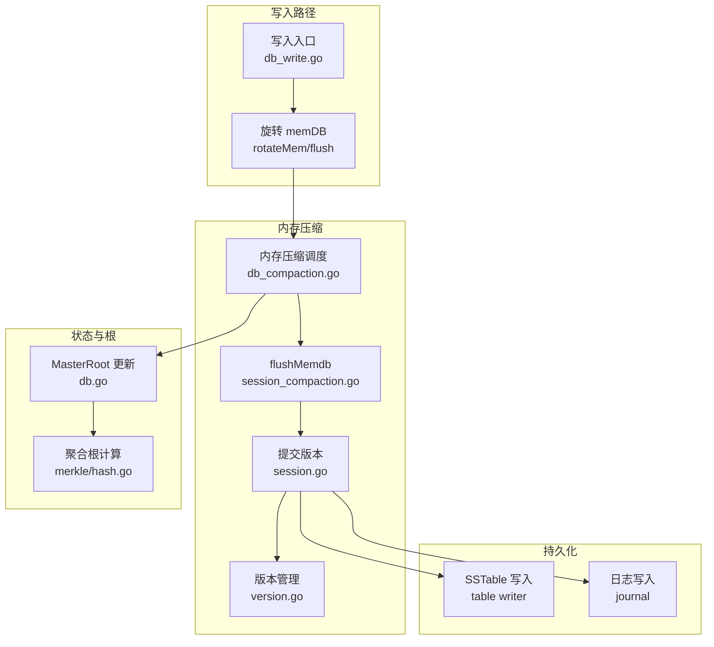
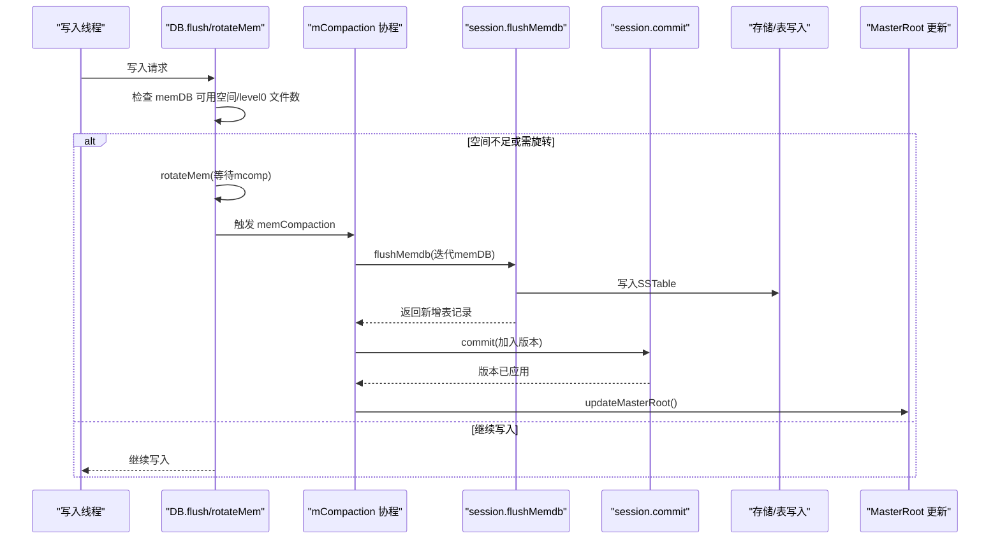
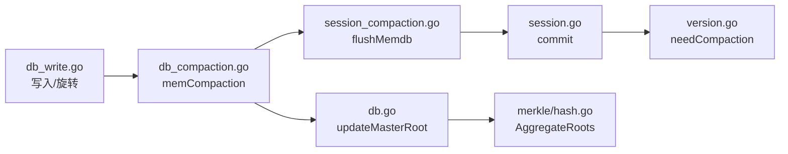
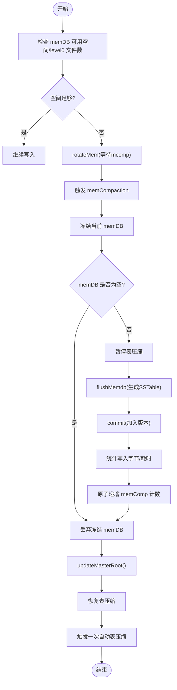

# 内存压缩

<cite>
**本文引用的文件**
- [leveldb/db.go](file://leveldb/db.go)
- [leveldb/db_write.go](file://leveldb/db_write.go)
- [leveldb/db_compaction.go](file://leveldb/db_compaction.go)
- [leveldb/session_compaction.go](file://leveldb/session_compaction.go)
- [leveldb/session.go](file://leveldb/session.go)
- [leveldb/version.go](file://leveldb/version.go)
- [leveldb/memdb/memdb.go](file://leveldb/memdb/memdb.go)
- [leveldb/merkle/hash.go](file://leveldb/merkle/hash.go)
- [leveldb/mlsm_final_comprehensive_test.go](file://leveldb/mlsm_final_comprehensive_test.go)
</cite>

## 目录
1. [简介](#简介)
2. [项目结构](#项目结构)
3. [核心组件](#核心组件)
4. [架构总览](#架构总览)
5. [详细组件分析](#详细组件分析)
6. [依赖关系分析](#依赖关系分析)
7. [性能考量](#性能考量)
8. [故障排查指南](#故障排查指南)
9. [结论](#结论)
10. [附录](#附录)

## 简介
本文件围绕 avccDB 的内存压缩（memCompaction）功能进行系统化说明，聚焦以下目标：
- 当内存数据库（memDB）达到阈值时，如何将数据从内存刷新到 SSTable 文件；
- 触发条件（如写入缓冲区满、写入合并策略导致的空间不足等）；
- 压缩流程（冻结当前 memDB、创建新 memDB、生成 SSTable 文件、更新版本信息、更新 MasterRoot）；
- 与 MasterRoot 的更新机制；
- 对写入性能的影响及通过配置参数（如 WriteBuffer）进行调优；
- 提供内存压缩流程图，并讨论其在 LSM 树维护中的作用，特别是为后续表压缩（tableCompaction）做准备。

## 项目结构
与内存压缩直接相关的模块主要分布在以下文件中：
- 写入与旋转：leveldb/db_write.go
- 内存压缩调度与执行：leveldb/db_compaction.go
- 会话层 flush 与 compaction 选择：leveldb/session_compaction.go
- 版本管理与 compaction 触发：leveldb/version.go
- 内存数据库实现：leveldb/memdb/memdb.go
- MasterRoot 计算与更新：leveldb/db.go、leveldb/merkle/hash.go
- 测试用例（含 MasterRoot 行为验证）：leveldb/mlsm_final_comprehensive_test.go

图表来源
- [leveldb/db_write.go](file://leveldb/db_write.go#L35-L120)
- [leveldb/db_compaction.go](file://leveldb/db_compaction.go#L269-L354)
- [leveldb/session_compaction.go](file://leveldb/session_compaction.go#L31-L53)
- [leveldb/session.go](file://leveldb/session.go#L210-L242)
- [leveldb/version.go](file://leveldb/version.go#L646-L695)
- [leveldb/db.go](file://leveldb/db.go#L1480-L1569)
- [leveldb/merkle/hash.go](file://leveldb/merkle/hash.go#L127-L152)

章节来源
- [leveldb/db_write.go](file://leveldb/db_write.go#L35-L120)
- [leveldb/db_compaction.go](file://leveldb/db_compaction.go#L269-L354)
- [leveldb/session_compaction.go](file://leveldb/session_compaction.go#L31-L53)
- [leveldb/session.go](file://leveldb/session.go#L210-L242)
- [leveldb/version.go](file://leveldb/version.go#L646-L695)
- [leveldb/db.go](file://leveldb/db.go#L1480-L1569)
- [leveldb/merkle/hash.go](file://leveldb/merkle/hash.go#L127-L152)

## 核心组件
- 写入与空间检查：在写入前通过 flush 检查 memDB 可用空间与 level0 文件数量，必要时触发表压缩或旋转 memDB。
- 内存压缩调度：mCompaction 协程监听命令队列，调用 memCompaction 执行冻结 memDB 到 SSTable 的流程。
- flushMemdb：将 memDB 迭代器内容写入 SSTable，并选择落盘层级。
- 版本提交：通过 session.commit 将新增的 SSTable 加入版本并持久化 manifest。
- MasterRoot 更新：在 memCompaction 完成后更新聚合根，确保全局一致性。

章节来源
- [leveldb/db_write.go](file://leveldb/db_write.go#L66-L120)
- [leveldb/db_compaction.go](file://leveldb/db_compaction.go#L269-L354)
- [leveldb/session_compaction.go](file://leveldb/session_compaction.go#L31-L53)
- [leveldb/session.go](file://leveldb/session.go#L210-L242)
- [leveldb/db.go](file://leveldb/db.go#L1480-L1569)

## 架构总览
内存压缩是 LSM-Tree 写入路径的关键环节，负责将易失的内存层（memDB）稳定化为持久的磁盘层（SSTable），并更新版本与 MasterRoot，为后续的表压缩与查询提供基础。

图表来源
- [leveldb/db_write.go](file://leveldb/db_write.go#L66-L120)
- [leveldb/db_compaction.go](file://leveldb/db_compaction.go#L269-L354)
- [leveldb/session_compaction.go](file://leveldb/session_compaction.go#L31-L53)
- [leveldb/session.go](file://leveldb/session.go#L210-L242)
- [leveldb/db.go](file://leveldb/db.go#L1480-L1569)

## 详细组件分析

### 写入与旋转（触发条件与节流）
- 写入前的 flush 逻辑会检查：
  - level0 文件数量是否超过“慢速触发”阈值，若超过则短暂延迟；
  - memDB 剩余可用空间是否满足本次写入；
  - 若仍不足且 level0 超过“暂停触发”阈值，则阻塞等待表压缩完成后再继续。
- 当写入量接近 memDB 可用空间上限时，会调用 rotateMem 创建新 memDB 并触发内存压缩命令队列，以避免写入阻塞。

章节来源
- [leveldb/db_write.go](file://leveldb/db_write.go#L66-L120)
- [leveldb/db_write.go](file://leveldb/db_write.go#L155-L266)

### 内存压缩调度与执行（memCompaction）
- mCompaction 协程监听 mcompCmdC，收到命令后调用 memCompaction。
- memCompaction 的关键步骤：
  - 获取冻结的 memDB（getFrozenMem），若为空则跳过；
  - 暂停表压缩（tcompPauseC），避免并发冲突；
  - 调用 session.flushMemdb 将 memDB 内容写入 SSTable；
  - 设置 journal 编号与序列号，提交版本（commit）；
  - 统计写入字节数与耗时，原子递增 memComp 计数；
  - 丢弃冻结的 memDB；
  - 更新 MasterRoot；
  - 恢复表压缩并触发一次自动表压缩。

章节来源
- [leveldb/db_compaction.go](file://leveldb/db_compaction.go#L269-L354)
- [leveldb/db_compaction.go](file://leveldb/db_compaction.go#L800-L811)

### flushMemdb（生成 SSTable）
- 通过 memDB.NewIterator 顺序遍历键值；
- 使用 tOps.createFrom 将迭代结果写入新的 SSTable；
- 选择落盘层级：根据版本中 level0 是否与目标范围重叠，决定从 level0 开始的最合适的层级；
- 将新增表记录加入 sessionRecord，供后续版本提交使用。

章节来源
- [leveldb/session_compaction.go](file://leveldb/session_compaction.go#L31-L53)
- [leveldb/version.go](file://leveldb/version.go#L621-L644)

### 版本提交与 Manifest 更新
- session.commit 将新增表加入当前版本，必要时新建 manifest 或刷新现有 manifest；
- 该过程保证了持久化的一致性与可恢复性。

章节来源
- [leveldb/session.go](file://leveldb/session.go#L210-L242)

### MasterRoot 更新机制
- 在 memCompaction 完成后，调用 updateMasterRoot；
- computeMasterRoot 会：
  - 遍历当前版本的所有层级，收集每个 SSTable 的 Merkle 根；
  - 对每层的 SST 根构建“层根”（Layer Root）；
  - 将所有层根聚合为最终的 MasterRoot；
- GetMasterRoot 提供只读访问接口，用于外部校验与审计。

章节来源
- [leveldb/db.go](file://leveldb/db.go#L1480-L1569)
- [leveldb/merkle/hash.go](file://leveldb/merkle/hash.go#L127-L152)
- [leveldb/mlsm_final_comprehensive_test.go](file://leveldb/mlsm_final_comprehensive_test.go#L118-L234)

### 内存数据库（memDB）特性
- memDB 是基于跳表的内存键值存储，支持并发读写；
- 提供 Size/Capacity/Free/Len 等容量与大小查询方法；
- 作为内存压缩的输入源，其迭代器被用于生成 SSTable。

章节来源
- [leveldb/memdb/memdb.go](file://leveldb/memdb/memdb.go#L411-L480)

## 依赖关系分析
- 写入路径依赖 memDB 的可用空间与 level0 文件数量，通过 flush 控制写入节奏；
- 内存压缩依赖 session.flushMemdb 生成 SSTable，并通过 session.commit 更新版本；
- MasterRoot 更新依赖版本中各层 SSTable 的 Merkle 根聚合；
- 表压缩在内存压缩完成后被触发，进一步优化 LSM 结构。

图表来源
- [leveldb/db_write.go](file://leveldb/db_write.go#L66-L120)
- [leveldb/db_compaction.go](file://leveldb/db_compaction.go#L269-L354)
- [leveldb/session_compaction.go](file://leveldb/session_compaction.go#L31-L53)
- [leveldb/session.go](file://leveldb/session.go#L210-L242)
- [leveldb/version.go](file://leveldb/version.go#L646-L695)
- [leveldb/db.go](file://leveldb/db.go#L1480-L1569)
- [leveldb/merkle/hash.go](file://leveldb/merkle/hash.go#L127-L152)

## 性能考量
- 写入节流：当 level0 文件过多时，写入会被延时或暂停，直到表压缩缓解堆积；
- 内存压缩频率：频繁的内存压缩会带来额外的磁盘写入与版本提交开销；
- WriteBuffer 参数：直接影响 memDB 的容量与写入合并策略，过大可能导致更少的内存压缩次数，但增加内存占用；过小会增加压缩频率与磁盘写放大；
- MasterRoot 计算：每次内存压缩后重新聚合所有层根，可能带来一定 CPU 开销，但在测试中可用于验证一致性。

章节来源
- [leveldb/db_write.go](file://leveldb/db_write.go#L66-L120)
- [leveldb/db.go](file://leveldb/db.go#L1480-L1569)
- [leveldb/mlsm_final_comprehensive_test.go](file://leveldb/mlsm_final_comprehensive_test.go#L118-L234)

## 故障排查指南
- 内存压缩卡住：检查 mcompCmdC 是否有积压，确认是否有持久化错误（compPerErrC）导致退出；
- 写入长时间延迟：检查 level0 文件数量是否超过慢速/暂停阈值，确认表压缩是否及时恢复；
- MasterRoot 不变：确认是否在内存压缩后调用了 updateMasterRoot，以及版本中是否存在有效 SSTable 根；
- 日志定位：利用日志中的“memdb@flush”、“table@compaction”等标记快速定位阶段。

章节来源
- [leveldb/db_compaction.go](file://leveldb/db_compaction.go#L87-L139)
- [leveldb/db_compaction.go](file://leveldb/db_compaction.go#L813-L890)
- [leveldb/db.go](file://leveldb/db.go#L1480-L1569)

## 结论
内存压缩（memCompaction）是 avccDB 写入路径与 LSM 维护的关键环节。它通过冻结 memDB、生成 SSTable、提交版本与更新 MasterRoot，将易失数据稳定化，并为后续表压缩提供基础。合理的 WriteBuffer 与阈值配置能够平衡写入吞吐与压缩频率，从而在性能与一致性之间取得良好折中。

## 附录

### 内存压缩流程图（代码级映射）

图表来源
- [leveldb/db_write.go](file://leveldb/db_write.go#L66-L120)
- [leveldb/db_compaction.go](file://leveldb/db_compaction.go#L269-L354)
- [leveldb/session_compaction.go](file://leveldb/session_compaction.go#L31-L53)
- [leveldb/session.go](file://leveldb/session.go#L210-L242)
- [leveldb/db.go](file://leveldb/db.go#L1480-L1569)