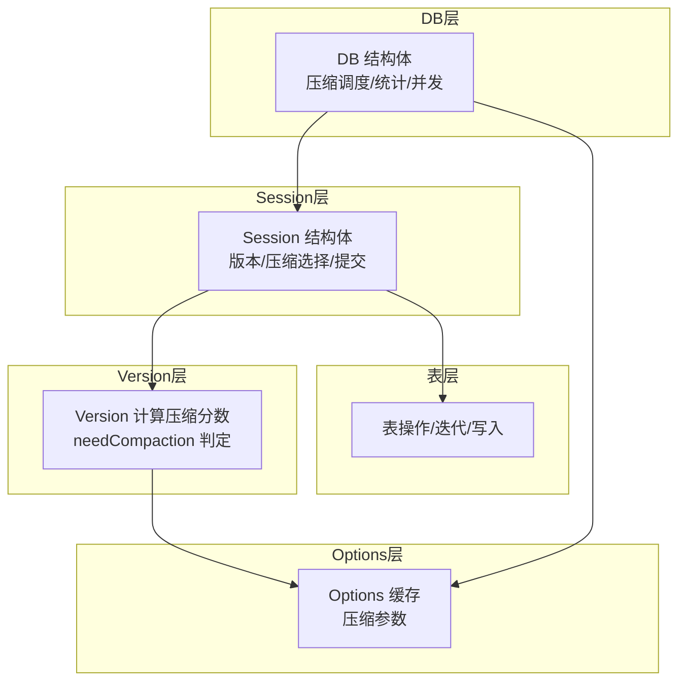
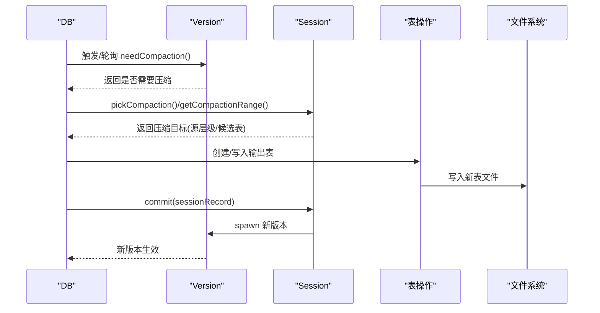
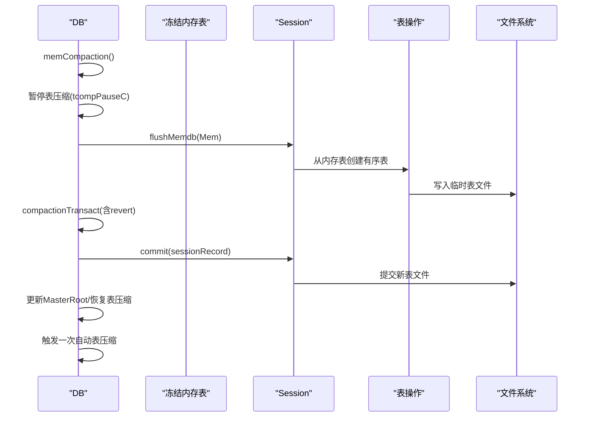
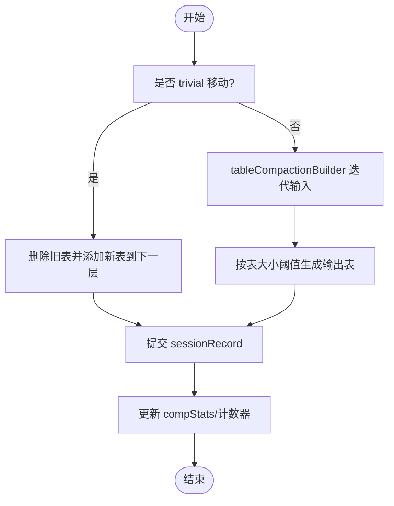
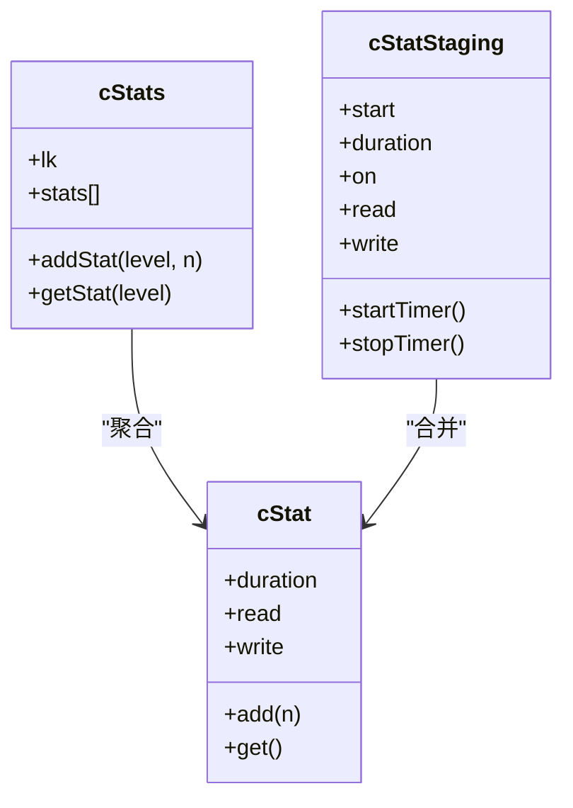
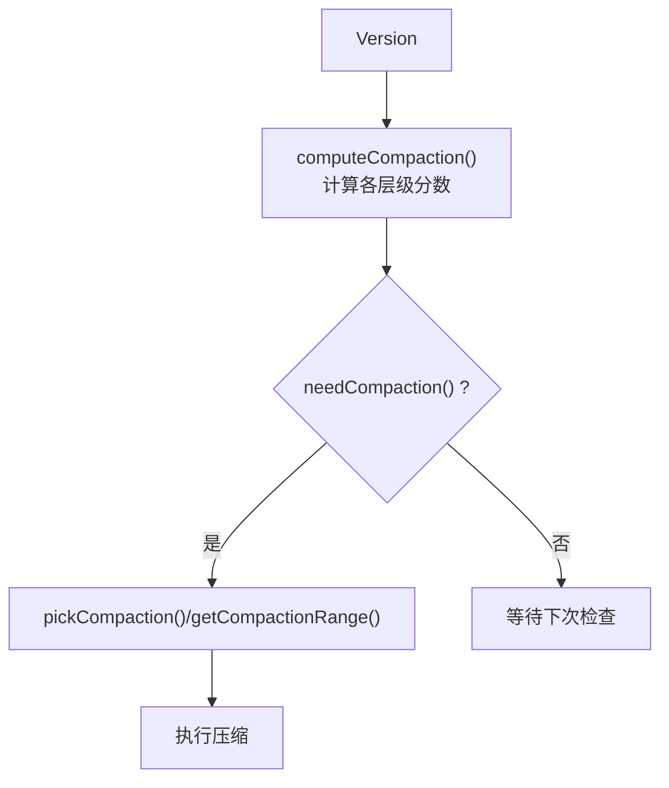
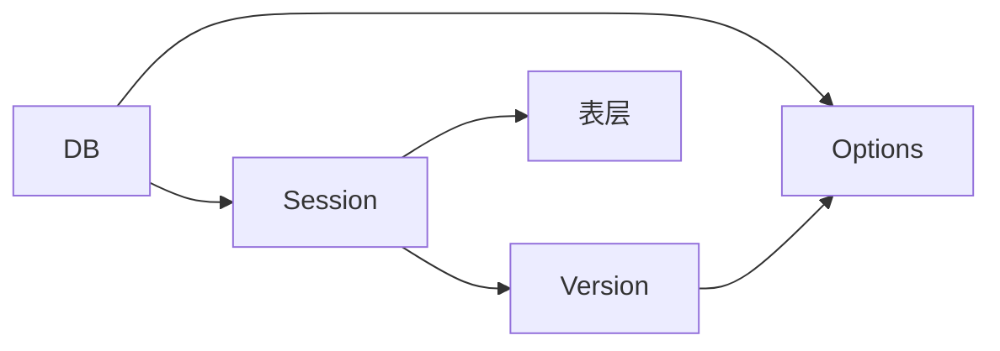

# 压缩管理

<cite>
**本文引用的文件**
- [db_compaction.go](file://leveldb/db_compaction.go)
- [session_compaction.go](file://leveldb/session_compaction.go)
- [version.go](file://leveldb/version.go)
- [session.go](file://leveldb/session.go)
- [db.go](file://leveldb/db.go)
- [options.go](file://leveldb/options.go)
- [opt/options.go](file://leveldb/opt/options.go)
- [table.go](file://leveldb/table.go)
</cite>

## 目录
1. [简介](#简介)
2. [项目结构](#项目结构)
3. [核心组件](#核心组件)
4. [架构总览](#架构总览)
5. [详细组件分析](#详细组件分析)
6. [依赖关系分析](#依赖关系分析)
7. [性能考量](#性能考量)
8. [故障排查指南](#故障排查指南)
9. [结论](#结论)
10. [附录](#附录)

## 简介
本文件面向 avccDB 的 DB 组件，系统性阐述压缩管理机制，重点覆盖：
- 内存压缩（memCompaction）与表压缩（tableCompaction）的触发条件、策略与执行流程
- 压缩过程中的数据迁移与文件管理
- 压缩统计信息（compStats）的采集与使用
- 并发控制与资源管理
- 对性能的影响与调优建议
- 压缩流程图与性能分析图，说明压缩在 LSM 树维护中的关键作用

## 项目结构
围绕压缩管理的关键代码主要分布在以下模块：
- DB 层：负责压缩调度、错误处理、统计与并发控制
- Session 层：负责版本管理、压缩选择与提交
- Version 层：负责计算压缩分数、判断是否需要压缩
- Options 层：提供压缩相关的配置项与缓存
- 表层：负责表的迭代、读取与写入

图表来源
- [db.go](file://leveldb/db.go#L33-L120)
- [session.go](file://leveldb/session.go#L36-L68)
- [version.go](file://leveldb/version.go#L646-L695)
- [options.go](file://leveldb/options.go#L48-L108)
- [opt/options.go](file://leveldb/opt/options.go#L207-L591)

章节来源
- [db.go](file://leveldb/db.go#L33-L120)
- [session.go](file://leveldb/session.go#L36-L68)
- [version.go](file://leveldb/version.go#L646-L695)
- [options.go](file://leveldb/options.go#L48-L108)
- [opt/options.go](file://leveldb/opt/options.go#L207-L591)

## 核心组件
- 压缩统计与计时器
  - cStat/cStatStaging：记录压缩耗时、读写字节数
  - cStats：线程安全地聚合各层级统计
- 压缩事务与回滚
  - compactionTransact 接口与实现，支持重试、退避、持久化错误处理
  - revert 语义用于失败时清理临时生成的表文件
- 内存压缩（memCompaction）
  - 将冻结的内存表刷写到磁盘，生成有序表并提交版本
  - 暂停表压缩，避免冲突；完成后恢复并触发表压缩
- 表压缩（tableCompaction）
  - 选择源层级与候选表，构建输出表，处理删除标记与版本键
  - 支持平凡移动（trivial move）与普通合并
- 版本与压缩选择
  - computeCompaction 计算各层级压缩分数，needCompaction 判定是否需要压缩
  - pickCompaction 基于分数与“按需触发”选择压缩目标
- 配置与缓存
  - Options 提供压缩阈值、表大小、扩展限制等参数
  - cachedOptions 缓存参数以降低访问开销

章节来源
- [db_compaction.go](file://leveldb/db_compaction.go#L24-L118)
- [db_compaction.go](file://leveldb/db_compaction.go#L141-L255)
- [db_compaction.go](file://leveldb/db_compaction.go#L269-L354)
- [db_compaction.go](file://leveldb/db_compaction.go#L567-L629)
- [session_compaction.go](file://leveldb/session_compaction.go#L18-L53)
- [session_compaction.go](file://leveldb/session_compaction.go#L55-L134)
- [version.go](file://leveldb/version.go#L646-L695)
- [options.go](file://leveldb/options.go#L48-L108)
- [opt/options.go](file://leveldb/opt/options.go#L207-L591)

## 架构总览
压缩管理贯穿 DB、Session、Version、Options 与表层，形成如下交互链路：
- DB 启动后台协程分别驱动内存压缩与表压缩
- Version 计算压缩分数并判定是否需要压缩
- Session 依据分数与范围选择压缩目标，并构建压缩状态
- DB 执行压缩事务，期间暂停/恢复表压缩，记录统计并提交版本
- Options 提供压缩阈值与表大小等参数，cachedOptions 缓存以提升性能

图表来源
- [db_compaction.go](file://leveldb/db_compaction.go#L669-L706)
- [session_compaction.go](file://leveldb/session_compaction.go#L55-L134)
- [version.go](file://leveldb/version.go#L646-L695)
- [session.go](file://leveldb/session.go#L210-L242)

## 详细组件分析

### 内存压缩（memCompaction）
- 触发条件
  - 冻结内存表存在且非空
  - DB 在 memCompaction 中暂停表压缩，避免竞争
- 执行流程
  - 通过 session.flushMemdb 将内存表转为有序表
  - 使用 compactionTransact 包裹，失败时 revert 删除临时表文件
  - 提交 sessionRecord，更新序列号与日志编号
  - 记录压缩统计（写入字节、耗时），递增 memComp 计数
  - 清理冻结内存表，更新 MasterRoot
  - 恢复表压缩并触发一次自动表压缩
- 数据迁移与文件管理
  - 临时表文件在 revert 时被删除，确保幂等与一致性
  - 新表文件通过 session.commit 提交至版本
- 并发控制
  - 通过 tcompPauseC 与 pauseCompaction 实现表压缩暂停/恢复
  - compCommitLk 保护提交阶段
- 性能影响
  - 大批量写入后会触发 memCompaction，带来一次性写放大
  - 可通过 WriteBuffer 与 CompactionTableSize 调整刷写频率与输出表大小

图表来源
- [db_compaction.go](file://leveldb/db_compaction.go#L269-L354)
- [session_compaction.go](file://leveldb/session_compaction.go#L31-L53)
- [session.go](file://leveldb/session.go#L210-L242)

章节来源
- [db_compaction.go](file://leveldb/db_compaction.go#L269-L354)
- [session_compaction.go](file://leveldb/session_compaction.go#L31-L53)
- [session.go](file://leveldb/session.go#L210-L242)

### 表压缩（tableCompaction）
- 触发条件
  - Version.computeCompaction 计算各层级压缩分数，needCompaction 返回 true
  - 或者由“按需触发”（seek 触发）导致
- 选择策略
  - pickCompaction：优先选择分数最高的层级；若为 level-0，选择首个重叠文件；否则选择最小重叠集合
  - getCompactionRange：按用户指定范围选择候选表，受 SourceLimit 限制
- 执行流程
  - trivial 移动：单文件且无 GP 超标，直接移动到下一层
  - 否则使用 tableCompactionBuilder 迭代源层级与可能的下一层级，按 key 去重与删除标记策略生成输出表
  - 输出表大小受 CompactionTableSize 与层级倍率控制
  - 使用 compactionTransact 包裹，失败时 revert 删除临时表文件
  - 提交 sessionRecord，更新 compStats 与各类 compaction 计数
- 数据迁移与文件管理
  - 删除旧表，新增新表；revert 时删除临时表
  - 输出表文件通过 session.commit 提交
- 并发控制
  - 通过 tcompPauseC 与 pauseCompaction 实现暂停/恢复
  - compCommitLk 保护提交阶段
- mLSM 特性
  - 版本键与删除标记保留策略：保留历史版本键与墓碑标记，以支撑 Merkle 证明与历史查询

图表来源
- [db_compaction.go](file://leveldb/db_compaction.go#L567-L629)
- [session_compaction.go](file://leveldb/session_compaction.go#L55-L134)
- [session_compaction.go](file://leveldb/session_compaction.go#L136-L206)

章节来源
- [db_compaction.go](file://leveldb/db_compaction.go#L567-L629)
- [session_compaction.go](file://leveldb/session_compaction.go#L55-L134)
- [session_compaction.go](file://leveldb/session_compaction.go#L136-L206)

### 压缩统计（compStats）与并发控制
- 统计结构
  - cStat/cStatStaging：累计耗时、读取/写入字节数
  - cStats：加锁聚合各层级统计，提供 addStat/getStat
- 使用方式
  - memCompaction：记录刷写阶段的读写与耗时，累加到 flushLevel
  - tableCompaction：记录构建阶段的读写与耗时，累加到目标层级
- 并发控制
  - compactionTransact：带重试、退避、持久化错误锁定写路径
  - compCommitLk：保护提交阶段
  - tcompPauseC/pauseCompaction：暂停/恢复表压缩，避免冲突
  - compError 通道：统一处理瞬时/持久化错误，必要时持有写锁

图表来源
- [db_compaction.go](file://leveldb/db_compaction.go#L24-L118)

章节来源
- [db_compaction.go](file://leveldb/db_compaction.go#L24-L118)
- [db_compaction.go](file://leveldb/db_compaction.go#L87-L139)
- [db_compaction.go](file://leveldb/db_compaction.go#L261-L268)

### 版本与压缩选择
- computeCompaction：按 level-0 文件数量与其它层级总大小计算压缩分数，记录最佳层级与分数
- needCompaction：当分数≥1或存在按需触发时返回 true
- pickCompaction：根据分数与按需触发选择压缩目标
- getCompactionRange：按用户范围选择候选表，受 SourceLimit 限制

图表来源
- [version.go](file://leveldb/version.go#L646-L695)
- [session_compaction.go](file://leveldb/session_compaction.go#L55-L134)

章节来源
- [version.go](file://leveldb/version.go#L646-L695)
- [session_compaction.go](file://leveldb/session_compaction.go#L55-L134)

## 依赖关系分析
- DB 依赖 Session 提供版本与压缩选择，依赖 Options 提供压缩参数
- Session 依赖 Version 计算压缩分数，依赖表层进行读写
- Options 通过 cachedOptions 缓存压缩参数，减少重复计算
- 表层依赖存储接口进行文件读写

图表来源
- [db.go](file://leveldb/db.go#L33-L120)
- [session.go](file://leveldb/session.go#L36-L68)
- [version.go](file://leveldb/version.go#L646-L695)
- [options.go](file://leveldb/options.go#L48-L108)

章节来源
- [db.go](file://leveldb/db.go#L33-L120)
- [session.go](file://leveldb/session.go#L36-L68)
- [version.go](file://leveldb/version.go#L646-L695)
- [options.go](file://leveldb/options.go#L48-L108)

## 性能考量
- 压缩触发与频率
  - level-0：基于文件数量阈值（CompactionL0Trigger）
  - 其它层级：基于总大小与阈值（CompactionTotalSize 及倍率）
  - 按需触发：通过“seek 触发”优化热点范围，减少后续读放大
- 输出表大小与写放大
  - CompactionTableSize 与每层倍率控制输出表大小
  - 扩展限制（CompactionExpandLimitFactor）与 GP 超标限制（CompactionGPOverlapsFactor）控制单次压缩规模
- 并发与退避
  - compactionTransact 支持重试与指数退避，避免频繁失败造成抖动
  - DisableCompactionBackoff 可关闭退避，适合特定场景
- 读性能与 I/O
  - tableCompactionBuilder 在迭代过程中按表大小阈值分批输出，减少单次 I/O
  - 严格模式（StrictCompaction）可提升健壮性但可能增加开销
- mLSM 影响
  - 保留历史版本键与墓碑标记，有助于历史查询与 Merkle 证明，但会增加存储与压缩成本

章节来源
- [version.go](file://leveldb/version.go#L646-L695)
- [opt/options.go](file://leveldb/opt/options.go#L207-L591)
- [db_compaction.go](file://leveldb/db_compaction.go#L141-L255)

## 故障排查指南
- 常见错误类型
  - 瞬时错误：通过 compactionError 通道传播，DB 侧重试
  - 持久化错误：持有写锁，阻止写入，防止进一步损坏
  - 一致性错误：通过 revert 清理临时文件，保证幂等
- 排查要点
  - 检查 compErrC/compPerErrC 是否有持续错误
  - 关注 compactionTransact 的重试次数与 backoff 状态
  - 确认 tcompPauseC 是否被正确使用，避免长时间阻塞
  - 核对 compStats 是否异常增长，定位热点层级
- 修复建议
  - 适当增大 CompactionTableSize 与 TotalSize，降低压缩频率
  - 调整 CompactionL0Trigger 与 SourceLimit，平衡写放大与读放大
  - 在高写负载场景启用 DisableCompactionBackoff，减少重试开销

章节来源
- [db_compaction.go](file://leveldb/db_compaction.go#L87-L139)
- [db_compaction.go](file://leveldb/db_compaction.go#L141-L255)
- [opt/options.go](file://leveldb/opt/options.go#L571-L591)

## 结论
avccDB 的压缩管理以 DB/Session/Version/Options 分层协作为核心，通过分数驱动与按需触发实现高效压缩。memCompaction 与 tableCompaction 协同工作，配合严格的统计与并发控制，既保障了数据一致性，又能在不同负载下平衡写放大、读放大与存储占用。通过合理配置压缩参数，可在生产环境中获得稳定且可预测的性能表现。

## 附录
- 压缩参数与默认值参考
  - CompactionL0Trigger：level-0 触发阈值
  - CompactionTableSize/CompactionTableSizeMultiplier：输出表大小与层级倍率
  - CompactionTotalSize/CompactionTotalSizeMultiplier：层级总大小阈值与倍率
  - CompactionExpandLimitFactor/CompactionGPOverlapsFactor：扩展限制与 GP 超标限制
  - DisableCompactionBackoff：是否禁用压缩退避
  - DisableSeeksCompaction：是否禁用按需触发
- LSM 树维护中的关键作用
  - 通过压缩维持层级有序性与稀疏性，降低读放大
  - memCompaction 将高频写入快速下沉至低层，缓解 level-0 压力
  - tableCompaction 通过去重与删除标记清理，提升查询效率

章节来源
- [opt/options.go](file://leveldb/opt/options.go#L207-L591)
- [table.go](file://leveldb/table.go#L72-L72)