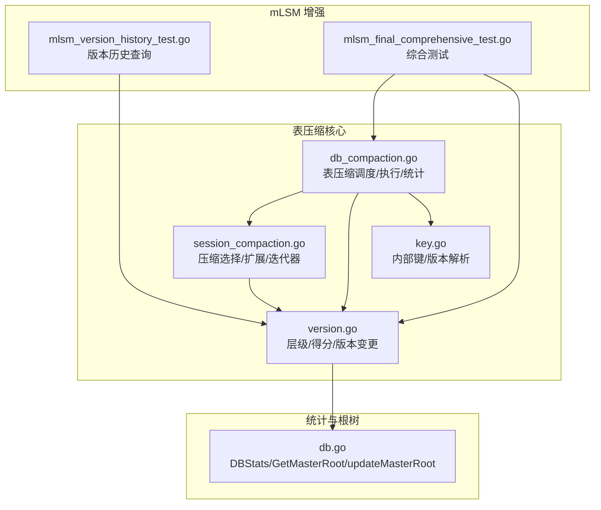
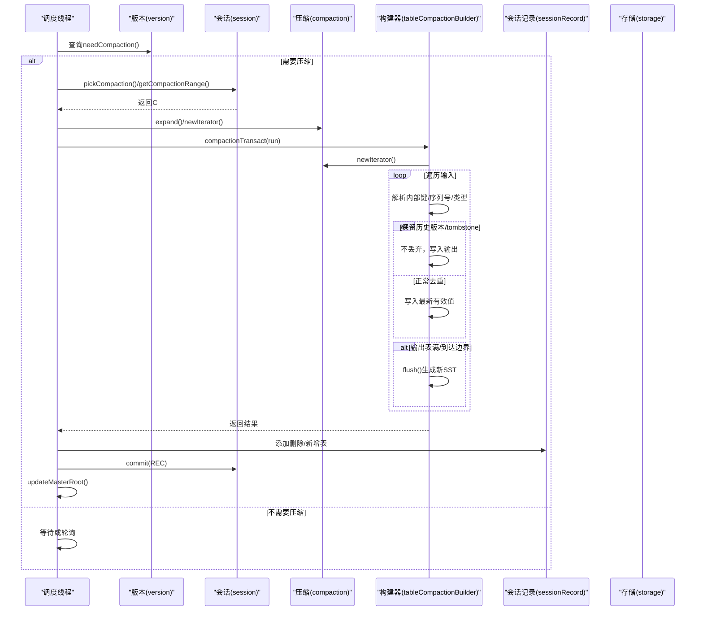
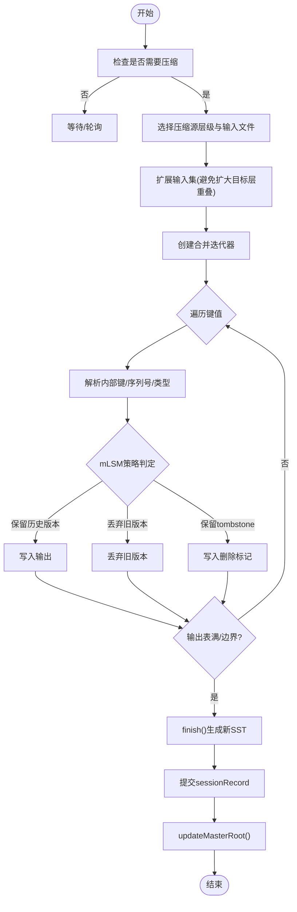
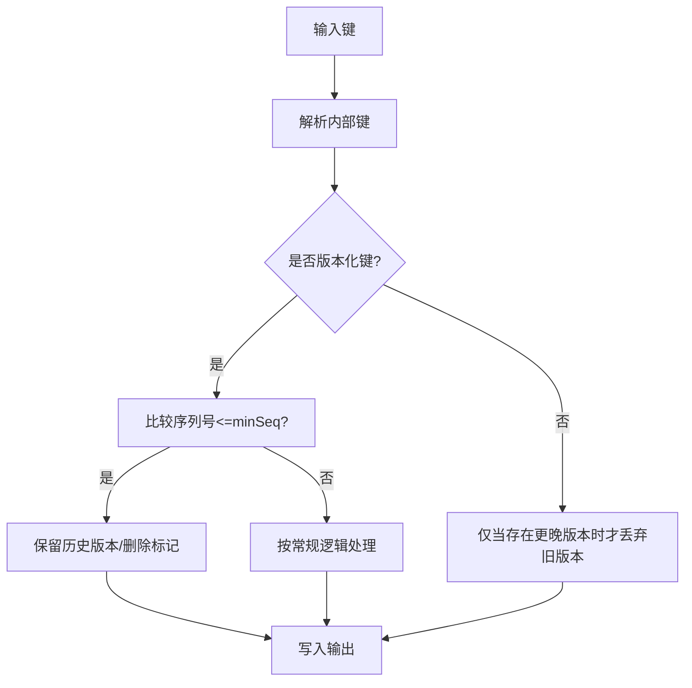
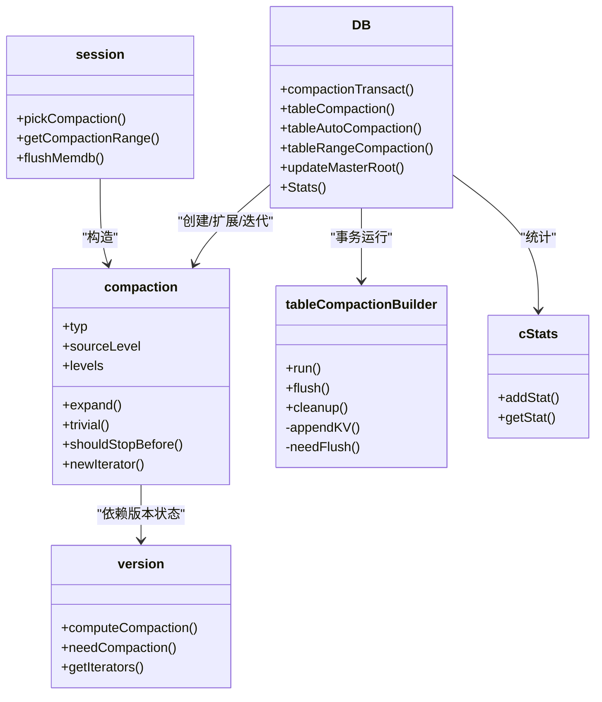
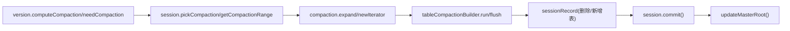
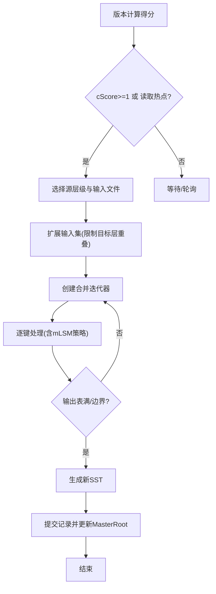

# 表压缩

<cite>
**本文引用的文件**
- [db_compaction.go](file://leveldb/db_compaction.go)
- [session_compaction.go](file://leveldb/session_compaction.go)
- [version.go](file://leveldb/version.go)
- [key.go](file://leveldb/key.go)
- [mlsm_final_comprehensive_test.go](file://leveldb/mlsm_final_comprehensive_test.go)
- [mlsm_version_history_test.go](file://leveldb/mlsm_version_history_test.go)
- [db.go](file://leveldb/db.go)
</cite>

## 目录
1. [简介](#简介)
2. [项目结构](#项目结构)
3. [核心组件](#核心组件)
4. [架构总览](#架构总览)
5. [详细组件分析](#详细组件分析)
6. [依赖关系分析](#依赖关系分析)
7. [性能考量](#性能考量)
8. [故障排查指南](#故障排查指南)
9. [结论](#结论)
10. [附录](#附录)

## 简介
本文件围绕 avccDB 的表压缩（tableCompaction）功能展开，系统阐述 SSTable 在不同层级之间的合并与压缩机制，覆盖以下要点：
- 触发条件：如 Level 0 文件过多、需要按范围触发或基于读取热点触发
- 压缩策略：选择压缩层级、输入文件集合、扩展策略与停止条件
- 压缩过程：读取输入文件、合并数据、生成新文件、删除旧文件、提交事务
- 压缩统计：compStats 的收集与导出
- mLSM 增强特性：在压缩过程中保留历史版本数据与删除标记（tombstones），支撑数据溯源与防篡改验证
- 对读取性能与存储空间的影响及调优建议
- 提供流程图与性能分析图

## 项目结构
与表压缩直接相关的关键模块：
- 表压缩调度与执行：db_compaction.go
- 压缩选择与迭代器：session_compaction.go
- 版本与层级管理：version.go
- 内部键格式与版本解析：key.go
- mLSM 版本历史与证明：mlsm_version_history_test.go、mlsm_final_comprehensive_test.go
- 统计导出与 MasterRoot 更新：db.go

图表来源
- [db_compaction.go](file://leveldb/db_compaction.go#L567-L629)
- [session_compaction.go](file://leveldb/session_compaction.go#L55-L134)
- [version.go](file://leveldb/version.go#L646-L696)
- [key.go](file://leveldb/key.go#L90-L146)
- [mlsm_version_history_test.go](file://leveldb/mlsm_version_history_test.go#L1-L139)
- [mlsm_final_comprehensive_test.go](file://leveldb/mlsm_final_comprehensive_test.go#L1-L120)
- [db.go](file://leveldb/db.go#L1359-L1441)

章节来源
- [db_compaction.go](file://leveldb/db_compaction.go#L567-L629)
- [session_compaction.go](file://leveldb/session_compaction.go#L55-L134)
- [version.go](file://leveldb/version.go#L646-L696)
- [key.go](file://leveldb/key.go#L90-L146)
- [mlsm_version_history_test.go](file://leveldb/mlsm_version_history_test.go#L1-L139)
- [mlsm_final_comprehensive_test.go](file://leveldb/mlsm_final_comprehensive_test.go#L1-L120)
- [db.go](file://leveldb/db.go#L1359-L1441)

## 核心组件
- 表压缩构建器（tableCompactionBuilder）：负责从输入迭代器读取键值，按规则合并输出，控制表大小与刷新时机，维护错误计数与丢弃计数
- 压缩选择器（compaction）：根据版本状态计算得分、选择源层级与输入文件、扩展输入集、判断是否平凡移动、设置停止条件
- 版本（version）：维护层级结构、计算下一次压缩层级与得分、生成版本变更记录
- 内部键（internalKey）：支持带版本号的键格式，用于 mLSM 历史版本保留与溯源
- 统计（cStats/DBStats）：记录各层级压缩耗时、读写字节数，导出到 DBStats
- MasterRoot：压缩后更新聚合 Merkle 根，支撑防篡改验证

章节来源
- [db_compaction.go](file://leveldb/db_compaction.go#L361-L629)
- [session_compaction.go](file://leveldb/session_compaction.go#L136-L330)
- [version.go](file://leveldb/version.go#L26-L86)
- [key.go](file://leveldb/key.go#L90-L146)
- [db.go](file://leveldb/db.go#L1359-L1441)

## 架构总览
表压缩在 avccDB 中由“调度线程”驱动，依据版本状态与配置决定何时、何处进行压缩；压缩过程采用事务式构建与提交，确保原子性与可回滚。

图表来源
- [db_compaction.go](file://leveldb/db_compaction.go#L567-L629)
- [session_compaction.go](file://leveldb/session_compaction.go#L55-L134)
- [version.go](file://leveldb/version.go#L693-L696)

## 详细组件分析

### 触发条件与策略
- 自动触发：版本计算得分，若某层级得分≥1或存在读取热点（seek compaction）则触发
- Level 0 触发：当 L0 文件数量超过阈值时优先触发
- 范围触发：按用户指定层级与范围选择重叠文件
- 选择策略：
  - pickCompaction：基于 cScore/cLevel 选择源层级与首个输入文件
  - getCompactionRange：按范围选择重叠文件，限制单次输入总量
  - expand：在不增加目标层文件数量的前提下扩大源层输入，避免过度扩大目标层重叠
  - shouldStopBefore：基于“曾祖父层”（grandparent）重叠字节阈值决定是否切换输出文件

章节来源
- [version.go](file://leveldb/version.go#L646-L696)
- [session_compaction.go](file://leveldb/session_compaction.go#L55-L134)
- [session_compaction.go](file://leveldb/session_compaction.go#L196-L330)

### 压缩过程与事务
- 事务构建：compactionTransact 提供重试、退避、持久化错误与可回滚能力
- 输入迭代：newIterator 将源层与目标层文件合并为有序迭代器，Level 0 特殊处理重叠
- 输出生成：tableCompactionBuilder 按表大小阈值 flush，生成新的 SST 文件
- 提交：使用 sessionRecord 记录删除/新增表，提交后更新 MasterRoot

图表来源
- [db_compaction.go](file://leveldb/db_compaction.go#L567-L629)
- [session_compaction.go](file://leveldb/session_compaction.go#L292-L330)
- [db.go](file://leveldb/db.go#L1562-L1571)

章节来源
- [db_compaction.go](file://leveldb/db_compaction.go#L567-L629)
- [session_compaction.go](file://leveldb/session_compaction.go#L292-L330)
- [db.go](file://leveldb/db.go#L1562-L1571)

### mLSM 增强：历史版本与删除标记
- 历史版本保留：当 minSeq（来自冻结序列）存在且键为版本化键时，保留所有历史版本，不丢弃旧版本
- 删除标记保留：当删除标记的序列号不超过 minSeq 且位于“基础层级”之外时，保留该删除标记，用于 Merkle 证明中的非存在性证明
- 版本键格式：内部键包含版本字段，便于溯源查询与历史版本检索
- 读取路径：版本历史查询与带证明读取均依赖内部键解析与层级遍历

图表来源
- [db_compaction.go](file://leveldb/db_compaction.go#L502-L528)
- [key.go](file://leveldb/key.go#L90-L146)
- [version.go](file://leveldb/version.go#L142-L285)

章节来源
- [db_compaction.go](file://leveldb/db_compaction.go#L502-L528)
- [key.go](file://leveldb/key.go#L90-L146)
- [version.go](file://leveldb/version.go#L142-L285)
- [mlsm_version_history_test.go](file://leveldb/mlsm_version_history_test.go#L1-L139)
- [mlsm_final_comprehensive_test.go](file://leveldb/mlsm_final_comprehensive_test.go#L1-L120)

### 压缩统计与导出
- 统计结构：cStat/cStatStaging/cStats 记录每层级压缩耗时、读取/写入字节数
- 导出：DBStats 汇总各层级的读写、大小、持续时间、压缩次数等
- 采集点：压缩构建阶段与提交阶段分别计时，最终累加到 compStats

章节来源
- [db_compaction.go](file://leveldb/db_compaction.go#L24-L86)
- [db_compaction.go](file://leveldb/db_compaction.go#L614-L617)
- [db.go](file://leveldb/db.go#L1359-L1441)

### 类关系与交互

图表来源
- [db_compaction.go](file://leveldb/db_compaction.go#L567-L629)
- [session_compaction.go](file://leveldb/session_compaction.go#L136-L330)
- [version.go](file://leveldb/version.go#L646-L696)

## 依赖关系分析
- 版本与层级：版本计算得分与选择压缩层级，压缩扩展依赖层级间重叠关系
- 压缩选择：基于比较器与层级范围，限制单次输入总量，避免过度扩大目标层
- 事务与回滚：压缩构建器支持快照与回滚，保证提交前后资源清理
- mLSM 依赖：内部键格式与 minSeq 控制历史版本与删除标记保留策略

图表来源
- [version.go](file://leveldb/version.go#L646-L696)
- [session_compaction.go](file://leveldb/session_compaction.go#L55-L134)
- [db_compaction.go](file://leveldb/db_compaction.go#L567-L629)
- [db.go](file://leveldb/db.go#L1562-L1571)

章节来源
- [version.go](file://leveldb/version.go#L646-L696)
- [session_compaction.go](file://leveldb/session_compaction.go#L55-L134)
- [db_compaction.go](file://leveldb/db_compaction.go#L567-L629)
- [db.go](file://leveldb/db.go#L1562-L1571)

## 性能考量
- 读取性能
  - 压缩减少目标层文件数量与重叠，提升读取合并效率
  - Level 0 过多会显著影响每次读取的合并成本，应通过阈值与触发策略控制
- 存储空间
  - 压缩降低冗余与重复版本，减少存储占用
  - mLSM 保留历史版本与删除标记会增加存储开销，但换取更强的溯源与验证能力
- 并发与延迟
  - 事务重试与退避避免频繁失败导致写入延迟
  - 压缩暂停/恢复机制配合写入暂停阈值，平衡吞吐与延迟

[本节为通用指导，无需特定文件引用]

## 故障排查指南
- 压缩错误传播：compactionError 通道区分瞬时与持久错误，必要时持有写锁阻塞写入
- 回滚与清理：构建器在失败时清理临时输出文件，避免残留
- 统计定位：通过 DBStats 的层级耗时与读写字节定位热点与瓶颈

章节来源
- [db_compaction.go](file://leveldb/db_compaction.go#L87-L139)
- [db_compaction.go](file://leveldb/db_compaction.go#L422-L430)
- [db.go](file://leveldb/db.go#L1359-L1441)

## 结论
avccDB 的表压缩在传统 LSM 算法基础上引入 mLSM 增强：在压缩过程中保留历史版本与删除标记，满足溯源与防篡改需求；通过严格的压缩选择与扩展策略、事务式构建与提交、完善的统计与 MasterRoot 更新，实现了高效、可靠且可审计的数据管理。

[本节为总结性内容，无需特定文件引用]

## 附录

### 表压缩流程图（概念示意）

[本图为概念示意，不对应具体代码文件]