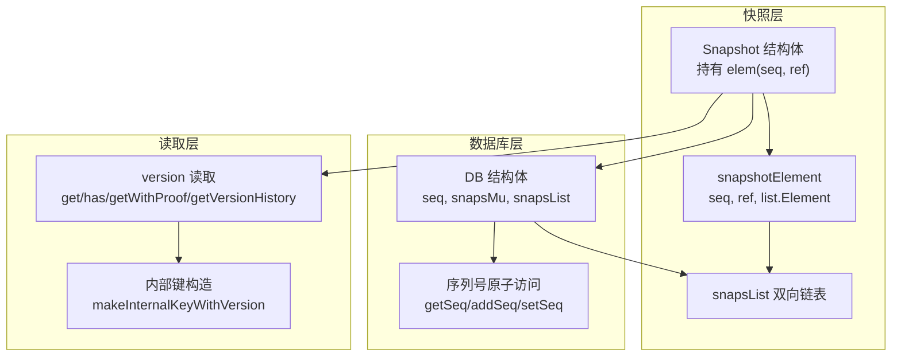
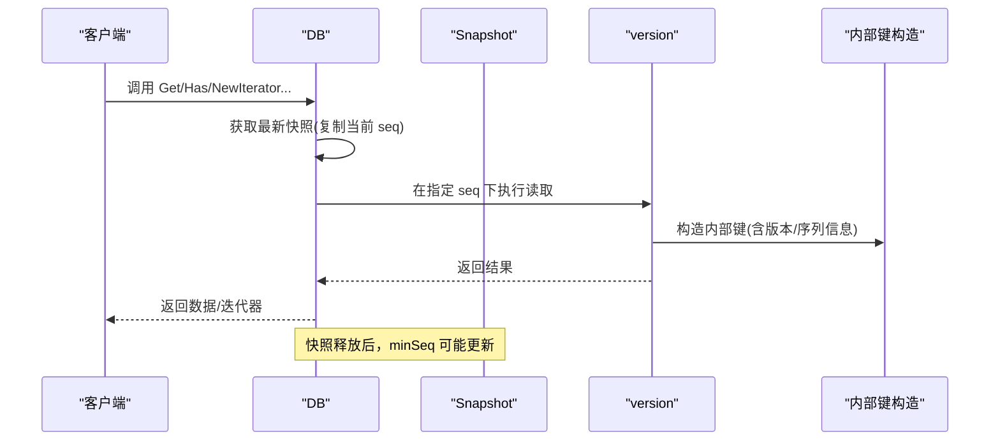
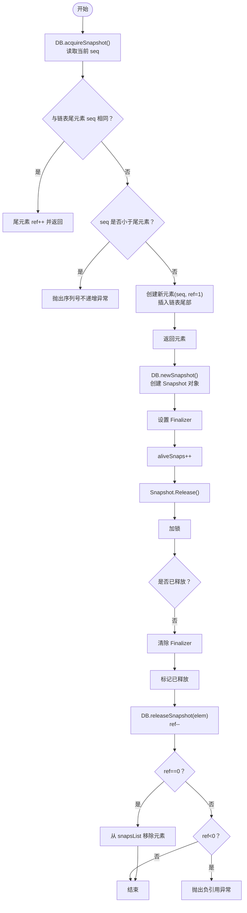
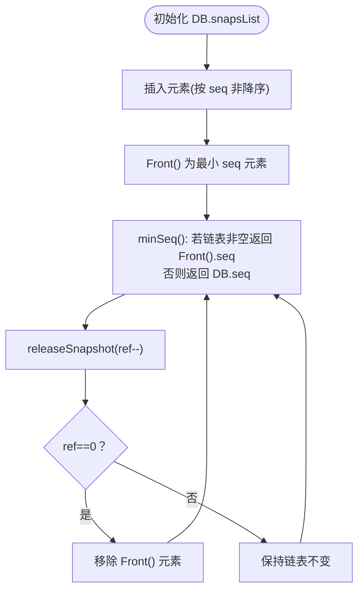
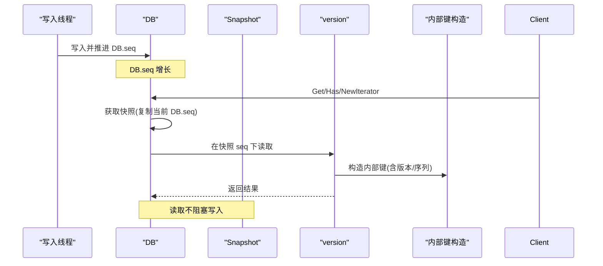
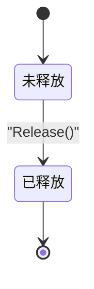
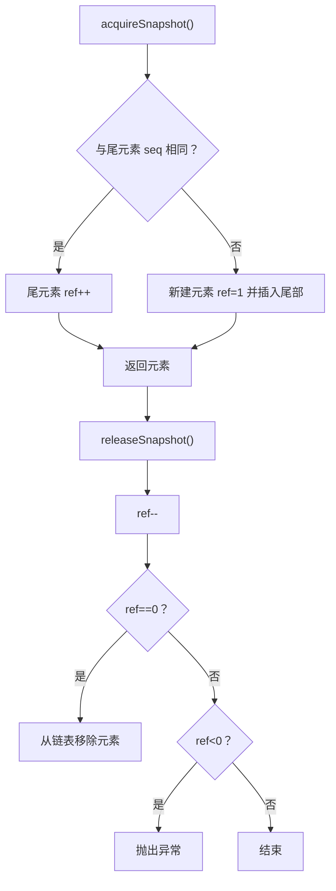
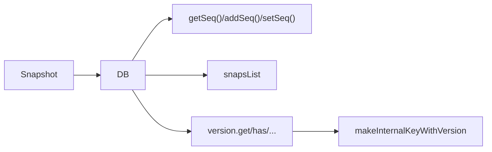

# 快照管理

<cite>
**本文引用的文件**
- [leveldb/db_snapshot.go](file://leveldb/db_snapshot.go)
- [leveldb/db.go](file://leveldb/db.go)
- [leveldb/db_state.go](file://leveldb/db_state.go)
- [leveldb/version.go](file://leveldb/version.go)
- [leveldb/key.go](file://leveldb/key.go)
- [leveldb/db_test.go](file://leveldb/db_test.go)
</cite>

## 目录
1. [简介](#简介)
2. [项目结构](#项目结构)
3. [核心组件](#核心组件)
4. [架构总览](#架构总览)
5. [详细组件分析](#详细组件分析)
6. [依赖关系分析](#依赖关系分析)
7. [性能考量](#性能考量)
8. [故障排查指南](#故障排查指南)
9. [结论](#结论)
10. [附录](#附录)

## 简介
本文件面向 avccDB 的 DB 组件，系统化阐述快照（Snapshot）的创建、使用与生命周期管理，解释快照如何提供一致的数据视图以实现 MVCC（多版本并发控制）与读写分离，并给出快照列表（snapsList）的管理机制、序列号（seq）的分配与最小序列号（minSeq）的计算策略。同时，结合代码实现说明快照对内存与存储资源的影响，以及如何避免快照导致的资源泄漏；最后提供快照状态图与引用计数管理图，帮助理解其在保证数据一致性与隔离性方面的作用。

## 项目结构
围绕快照管理的关键文件与职责如下：
- 快照定义与生命周期：leveldb/db_snapshot.go
- 数据库核心状态与序列号：leveldb/db.go、leveldb/db_state.go
- 版本读取与 MVCC 查询路径：leveldb/version.go、leveldb/key.go
- 行为验证与测试用例：leveldb/db_test.go

图表来源
- [leveldb/db_snapshot.go](file://leveldb/db_snapshot.go#L21-L69)
- [leveldb/db.go](file://leveldb/db.go#L33-L111)
- [leveldb/db_state.go](file://leveldb/db_state.go#L51-L63)
- [leveldb/version.go](file://leveldb/version.go#L142-L285)
- [leveldb/key.go](file://leveldb/key.go#L50-L88)

章节来源
- [leveldb/db_snapshot.go](file://leveldb/db_snapshot.go#L21-L69)
- [leveldb/db.go](file://leveldb/db.go#L33-L111)
- [leveldb/db_state.go](file://leveldb/db_state.go#L51-L63)
- [leveldb/version.go](file://leveldb/version.go#L142-L285)
- [leveldb/key.go](file://leveldb/key.go#L50-L88)

## 核心组件
- 快照元素 snapshotElement：包含当前快照所绑定的序列号 seq、引用计数 ref，以及在 snapsList 中的节点指针 e。
- 快照对象 Snapshot：封装 DB 指针与 snapshotElement，提供 Get/Has/NewIterator/Release 等方法，并通过互斥锁保护释放状态。
- DB 的快照管理：维护 snapsList（双向链表）与 snapsMu（互斥锁），提供 acquireSnapshot/releaseSnapshot/minSeq 等操作。
- 序列号管理：DB 内部以原子变量保存 seq，提供 getSeq/addSeq/setSeq 访问接口；快照创建时复制当前 seq，作为读取的“时间点”。

章节来源
- [leveldb/db_snapshot.go](file://leveldb/db_snapshot.go#L21-L69)
- [leveldb/db.go](file://leveldb/db.go#L33-L111)
- [leveldb/db_state.go](file://leveldb/db_state.go#L51-L63)

## 架构总览
快照通过“读取时冻结序列号”的方式，将读操作限定在一个稳定的全局状态上，从而实现 MVCC 与读写分离：
- 读取路径：调用 DB 的 Get/Has/NewIterator/GetWithVersion/GetVersionHistory 等方法时，内部先获取最新快照（复制当前 seq），再在该 seq 下进行查询。
- 写入路径：写入线程负责推进 DB.seq；当新快照被创建时，其 seq 不会回退，确保读取不会看到未来的写入。
- 最小序列号：minSeq 返回“尚未被任何快照占用的最小 seq”，用于判断哪些旧数据可以安全清理或回收。

图表来源
- [leveldb/db.go](file://leveldb/db.go#L1092-L1198)
- [leveldb/db_snapshot.go](file://leveldb/db_snapshot.go#L27-L69)
- [leveldb/version.go](file://leveldb/version.go#L142-L285)
- [leveldb/key.go](file://leveldb/key.go#L50-L88)

## 详细组件分析

### 快照创建与释放流程
- 创建快照
  - DB.acquireSnapshot：加锁，读取当前 seq，若与链表尾部相同则复用并增加 ref；否则新建元素并插入链表尾部。
  - DB.newSnapshot：创建 Snapshot 对象，记录 elem，并递增 aliveSnaps 计数；设置 Finalizer 以防泄漏。
- 释放快照
  - Snapshot.Release：加锁，清除 Finalizer，标记已释放，调用 DB.releaseSnapshot 降低 ref；当 ref 归零时从链表移除元素并置空指针；递减 aliveSnaps。
  - DB.releaseSnapshot：加锁，ref--；当 ref==0 时从 snapsList 移除元素；若 ref<0 则抛出异常。

图表来源
- [leveldb/db_snapshot.go](file://leveldb/db_snapshot.go#L27-L69)
- [leveldb/db_snapshot.go](file://leveldb/db_snapshot.go#L168-L187)

章节来源
- [leveldb/db_snapshot.go](file://leveldb/db_snapshot.go#L27-L69)
- [leveldb/db_snapshot.go](file://leveldb/db_snapshot.go#L168-L187)

### 快照列表（snapsList）与最小序列号（minSeq）
- snapsList：以双向链表维护所有活跃快照元素，按 seq 非降序排列（链表头为最小 seq，尾为最大 seq）。
- minSeq：返回“尚未被任何快照占用的最小 seq”。当链表非空时，返回链表头元素的 seq；否则返回当前 DB.seq。
- 测试验证：db_test 中的 TestDB_SnapshotList 展示了不同 seq 下快照的 acquire/release 行为与 minSeq 的变化。

图表来源
- [leveldb/db_snapshot.go](file://leveldb/db_snapshot.go#L62-L72)
- [leveldb/db_test.go](file://leveldb/db_test.go#L1204-L1240)

章节来源
- [leveldb/db_snapshot.go](file://leveldb/db_snapshot.go#L62-L72)
- [leveldb/db_test.go](file://leveldb/db_test.go#L1204-L1240)

### MVCC 与读写分离
- MVCC 实现要点
  - 读取时以快照 seq 作为“可见性边界”：内部键构造时将目标版本/序列信息编码到内部键，查询时仅匹配小于等于该 seq 的条目，从而实现“只读取到创建快照时已存在的数据”。
  - 版本读取：version.get/has/getWithProof/getVersionHistory 支持按版本或范围查询，内部通过遍历 MemDB/SST 文件并在指定 seq 下解析内部键完成。
- 读写分离
  - 写入线程推进 DB.seq；读取线程通过快照固定 seq，避免读取到正在进行的写入，从而实现读写并发。
  - 迭代器在创建时持有“版本引用”，但快照释放后仍可继续使用，直到迭代器自身释放或 DB 关闭。

图表来源
- [leveldb/db.go](file://leveldb/db.go#L1092-L1198)
- [leveldb/version.go](file://leveldb/version.go#L142-L285)
- [leveldb/key.go](file://leveldb/key.go#L50-L88)

章节来源
- [leveldb/db.go](file://leveldb/db.go#L1092-L1198)
- [leveldb/version.go](file://leveldb/version.go#L142-L285)
- [leveldb/key.go](file://leveldb/key.go#L50-L88)

### 快照状态图与引用计数管理图
- 快照状态图
  - 未释放：持有 elem，aliveSnaps++，Finalizer 设置。
  - 已释放：Finalizer 清除，标记 released=true，调用 releaseSnapshot(ref--)；当 ref==0 时从链表移除。
- 引用计数管理
  - acquireSnapshot：当与链表尾元素 seq 相同则 ref++；否则新建元素 ref=1。
  - releaseSnapshot：ref--；ref==0 时移除元素；ref<0 抛异常。
  - minSeq：链表头元素的 seq 即为“未被占用的最小 seq”。

图表来源
- [leveldb/db_snapshot.go](file://leveldb/db_snapshot.go#L168-L187)

图表来源
- [leveldb/db_snapshot.go](file://leveldb/db_snapshot.go#L27-L69)
- [leveldb/db_snapshot.go](file://leveldb/db_snapshot.go#L168-L187)

## 依赖关系分析
- Snapshot 依赖 DB 的快照管理接口（acquireSnapshot/releaseSnapshot/newSnapshot）与序列号（getSeq）。
- DB 的读取路径依赖 version 的 get/has/getWithProof/getVersionHistory，这些方法内部使用内部键构造与比较器完成 MVCC 查询。
- DB 内部通过原子变量管理 seq，确保多线程安全；快照通过复制 seq 实现一致性视图。

图表来源
- [leveldb/db_snapshot.go](file://leveldb/db_snapshot.go#L27-L69)
- [leveldb/db.go](file://leveldb/db.go#L1092-L1198)
- [leveldb/version.go](file://leveldb/version.go#L142-L285)
- [leveldb/key.go](file://leveldb/key.go#L50-L88)

章节来源
- [leveldb/db_snapshot.go](file://leveldb/db_snapshot.go#L27-L69)
- [leveldb/db.go](file://leveldb/db.go#L1092-L1198)
- [leveldb/version.go](file://leveldb/version.go#L142-L285)
- [leveldb/key.go](file://leveldb/key.go#L50-L88)

## 性能考量
- 内存占用
  - 每个快照持有 DB 的一个稳定视图，读取时可能需要访问 MemDB/SST 文件，且迭代器持有版本引用；因此快照数量越多，潜在的内存占用越高。
  - aliveSnaps 与 aliveIters 提供运行时统计，可用于监控快照/迭代器数量。
- 存储与清理
  - minSeq 用于确定“尚未被任何快照占用的最小 seq”，有助于判断哪些旧数据可以安全回收或清理，避免过早删除仍被快照依赖的数据。
- 并发与延迟
  - 读取路径通过快照固定 seq，避免与写入竞争；但过多快照可能导致 minSeq 上升，影响清理效率。

章节来源
- [leveldb/db.go](file://leveldb/db.go#L1266-L1269)
- [leveldb/db.go](file://leveldb/db.go#L1348-L1350)
- [leveldb/db.go](file://leveldb/db.go#L1415-L1416)
- [leveldb/db_snapshot.go](file://leveldb/db_snapshot.go#L62-L72)

## 故障排查指南
- 常见问题与定位
  - 快照泄漏：若未调用 Snapshot.Release 或未释放迭代器，Finalizer 将尝试清理；但建议显式释放以避免潜在延迟。
  - 负引用异常：releaseSnapshot(ref<0) 会触发异常，检查是否存在重复释放或错误的引用管理。
  - 序列号异常：acquireSnapshot 发现 seq 回退会抛出异常，检查写入线程是否正确推进 DB.seq。
- 监控手段
  - 使用 GetProperty("alivesnaps") 与 GetProperty("aliveiters") 获取当前存活快照与迭代器数量。
  - 使用 Stats 接口获取 AliveSnapshots/AliveIterators 等指标。
- 行为验证
  - 参考 TestDB_SnapshotList 验证 minSeq 的行为与快照列表的正确性。

章节来源
- [leveldb/db_snapshot.go](file://leveldb/db_snapshot.go#L168-L187)
- [leveldb/db.go](file://leveldb/db.go#L1266-L1269)
- [leveldb/db.go](file://leveldb/db.go#L1348-L1350)
- [leveldb/db_test.go](file://leveldb/db_test.go#L1204-L1240)

## 结论
快照通过“冻结序列号”的方式，为读取提供一致的数据视图，天然支持 MVCC 与读写分离。DB 的 snapsList 以链表维护活跃快照，minSeq 用于确定可清理的最小序列号，从而平衡一致性与资源回收。配合原子序列号管理与 Finalizer 保障，快照在保证数据隔离性的同时，也需注意显式释放以避免资源泄漏与性能退化。

## 附录
- 快照 API 与使用要点
  - 获取快照：DB.GetSnapshot() 返回 Snapshot，使用完毕必须调用 Release。
  - 读取接口：Get/Has/NewIterator/GetWithVersion/GetVersionHistory 均会在内部自动创建临时快照并释放，适合一次性读取场景。
  - 迭代器：NewIterator 返回的迭代器在快照释放后仍有效，直至迭代器自身释放或 DB 关闭。

章节来源
- [leveldb/db.go](file://leveldb/db.go#L1232-L1243)
- [leveldb/db.go](file://leveldb/db.go#L1200-L1230)