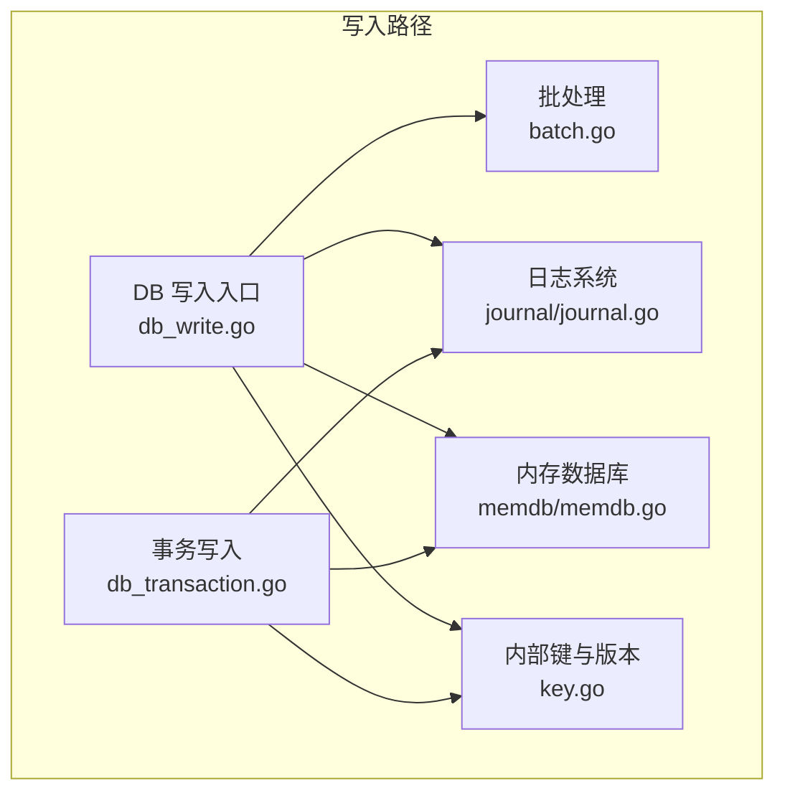
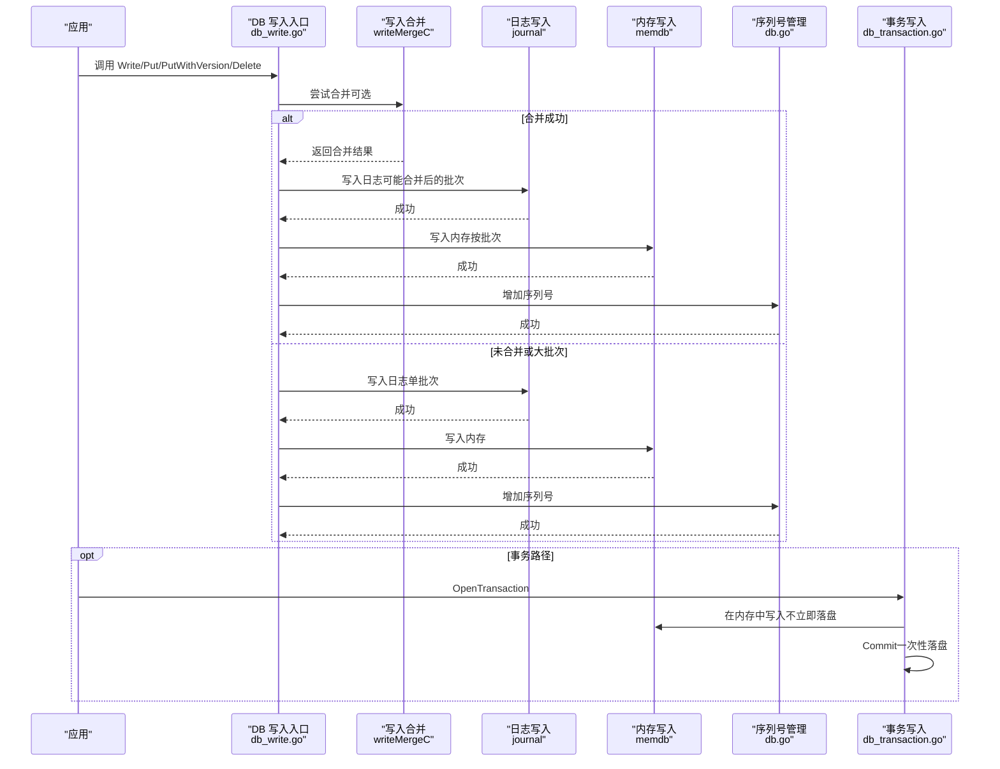
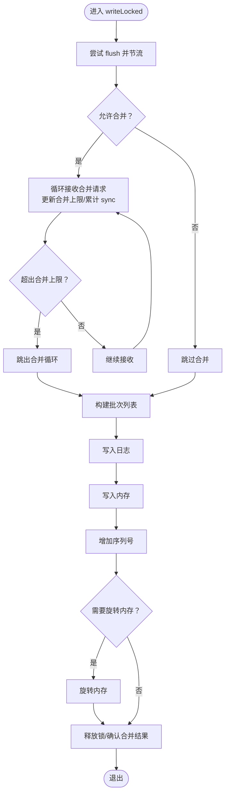
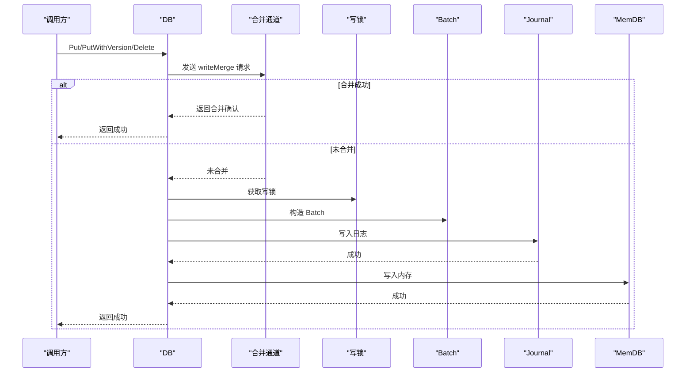
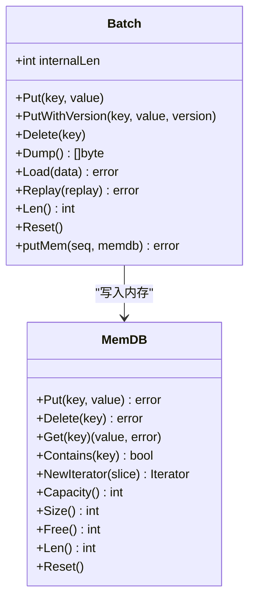
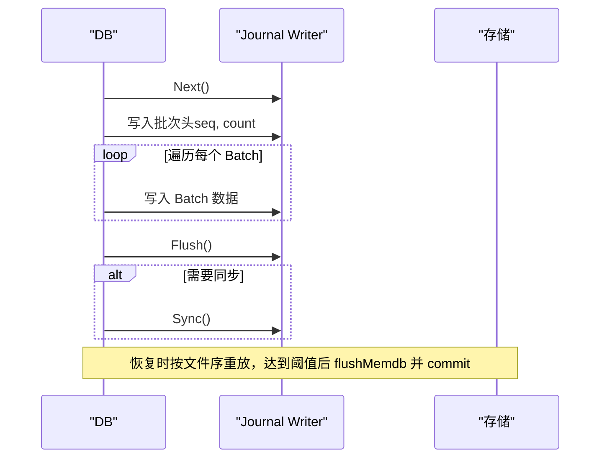
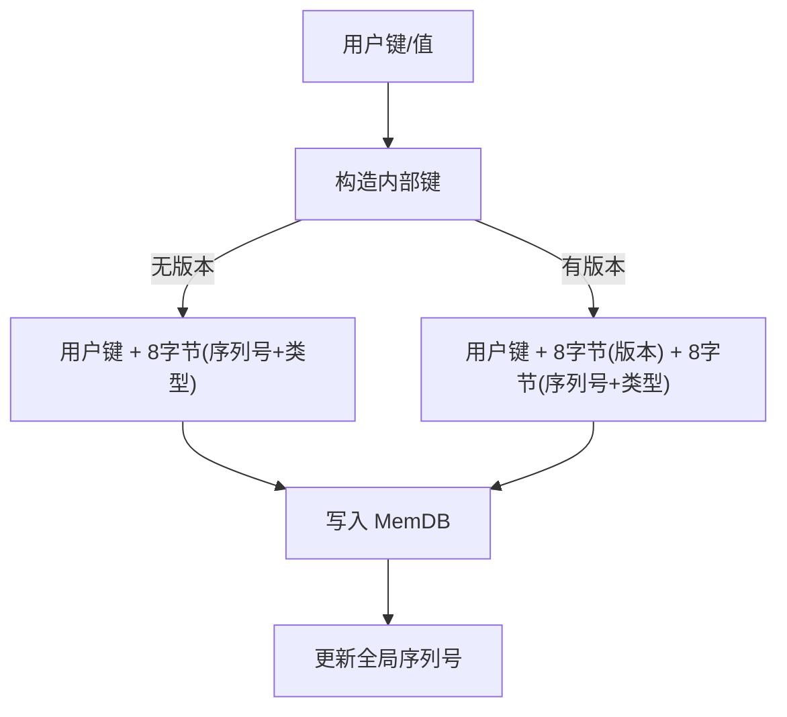
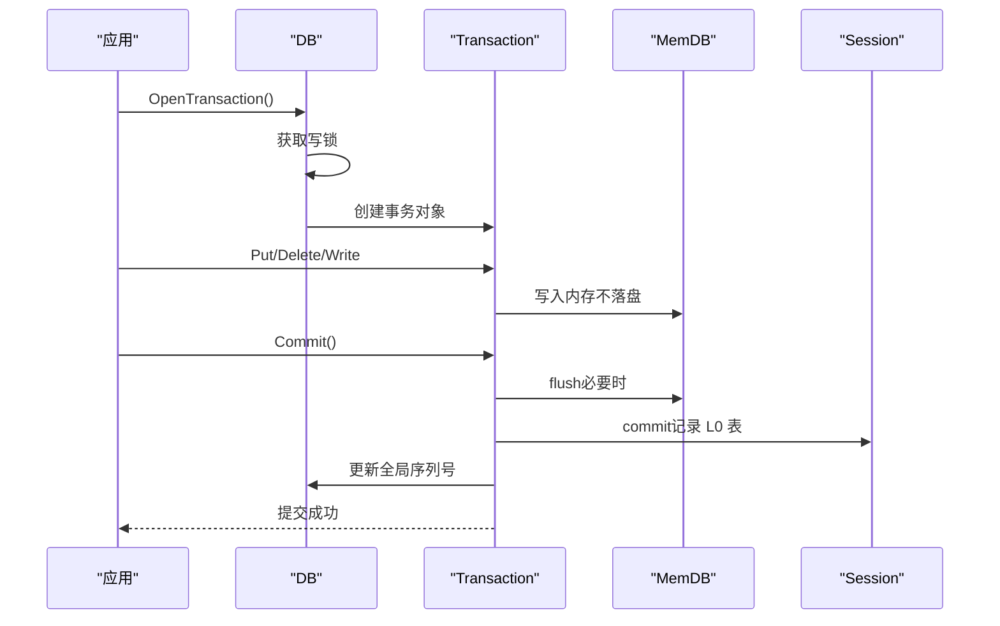
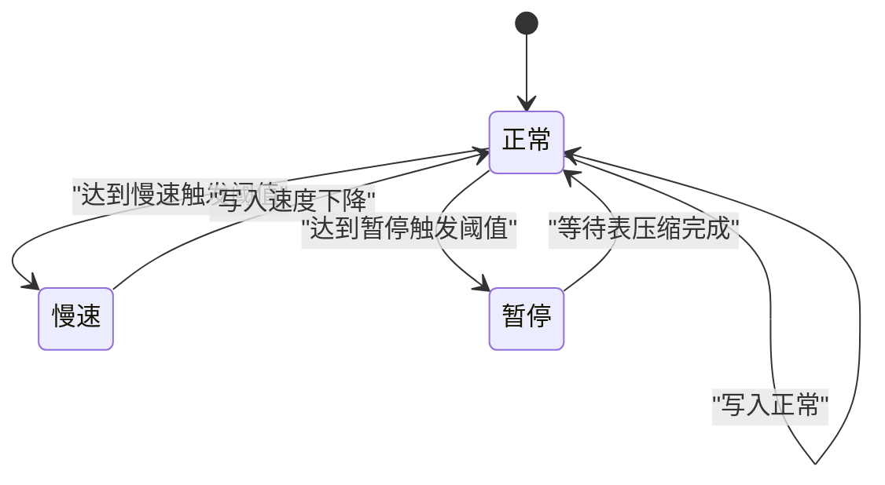
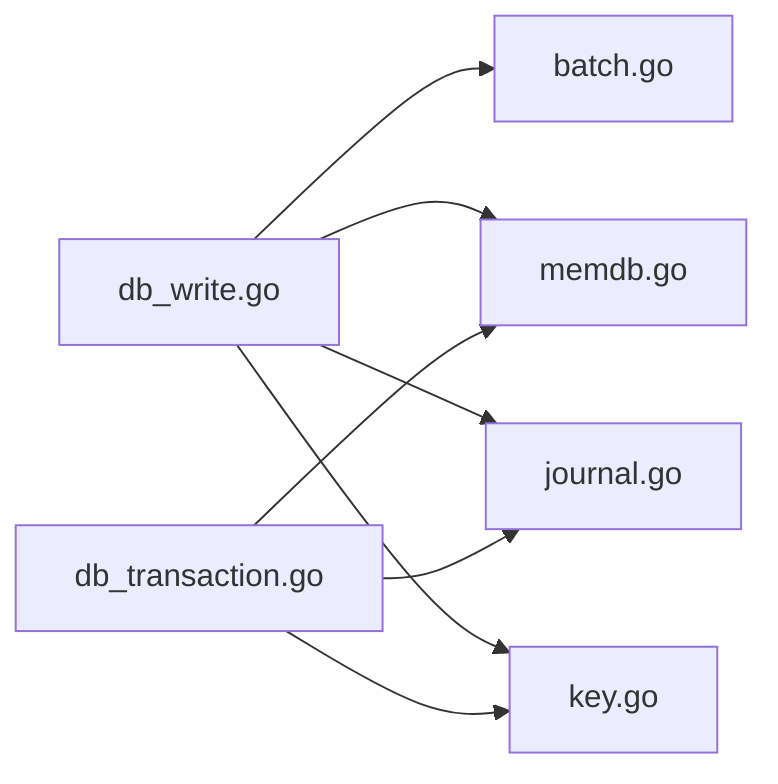

# 写入操作

<cite>
**本文引用的文件**
- [leveldb/db_write.go](file://leveldb/db_write.go)
- [leveldb/db.go](file://leveldb/db.go)
- [leveldb/batch.go](file://leveldb/batch.go)
- [leveldb/memdb/memdb.go](file://leveldb/memdb/memdb.go)
- [leveldb/journal/journal.go](file://leveldb/journal/journal.go)
- [leveldb/db_transaction.go](file://leveldb/db_transaction.go)
- [leveldb/key.go](file://leveldb/key.go)
</cite>

## 目录
1. [简介](#简介)
2. [项目结构](#项目结构)
3. [核心组件](#核心组件)
4. [架构总览](#架构总览)
5. [详细组件分析](#详细组件分析)
6. [依赖关系分析](#依赖关系分析)
7. [性能考量](#性能考量)
8. [故障排查指南](#故障排查指南)
9. [结论](#结论)

## 简介
本章节聚焦于 avccDB 的写入操作，系统性阐述 Put、PutWithVersion、Delete 和 Write 方法的实现细节与行为特征，覆盖以下关键主题：
- 与内存数据库（MemDB）的交互：写入如何落地到内存层
- 与日志（Journal）的交互：写入顺序、持久化与恢复路径
- 写入合并（write merge）机制：如何在高并发下聚合小写入以提升吞吐
- 序列号管理：全局单调递增序列号的生成与应用
- 写入延迟处理：基于 L0 层阈值的节流与暂停策略
- 批量写入（Batch Write）的原子性与事务处理机制
- 高并发场景下的线程安全设计与状态转换
- 常见问题与性能优化建议

## 项目结构
围绕写入路径的关键模块如下：
- 数据库入口与控制流：leveldb/db_write.go 提供 Write/Put/PutWithVersion/Delete 的主流程
- 批处理与编码：leveldb/batch.go 定义 Batch 结构、记录编码/解码、写入内存的 putMem
- 内存数据库：leveldb/memdb/memdb.go 提供 Put/Delete 等内存 KV 操作
- 日志系统：leveldb/journal/journal.go 提供日志块、校验与读写接口
- 版本键支持：leveldb/key.go 定义内部键格式（含版本字段）
- 事务写入：leveldb/db_transaction.go 提供事务级写入与提交

图表来源
- [leveldb/db_write.go](file://leveldb/db_write.go#L268-L438)
- [leveldb/batch.go](file://leveldb/batch.go#L244-L257)
- [leveldb/memdb/memdb.go](file://leveldb/memdb/memdb.go#L273-L340)
- [leveldb/journal/journal.go](file://leveldb/journal/journal.go#L343-L537)
- [leveldb/key.go](file://leveldb/key.go#L75-L104)
- [leveldb/db_transaction.go](file://leveldb/db_transaction.go#L118-L159)

章节来源
- [leveldb/db_write.go](file://leveldb/db_write.go#L268-L438)
- [leveldb/batch.go](file://leveldb/batch.go#L244-L257)
- [leveldb/memdb/memdb.go](file://leveldb/memdb/memdb.go#L273-L340)
- [leveldb/journal/journal.go](file://leveldb/journal/journal.go#L343-L537)
- [leveldb/key.go](file://leveldb/key.go#L75-L104)
- [leveldb/db_transaction.go](file://leveldb/db_transaction.go#L118-L159)

## 核心组件
- 写入入口与合并
  - Write/Put/PutWithVersion/Delete 共用统一的写入通道与合并逻辑
  - 合并通过 writeMergeC 实现“写入合并”，减少日志写入次数与内存写入开销
- 批处理（Batch）
  - 记录编码/解码、内部长度统计、putMem 写入内存
- 内存数据库（MemDB）
  - Put/Delete 基于跳表结构的并发安全写入
- 日志（Journal）
  - 分块写入、校验、Flush/Sync 控制持久化
- 版本键（Internal Key）
  - 支持带版本号的键，用于区块链等场景的多版本共存
- 事务（Transaction）
  - 大批量写入的原子性封装，避免频繁落盘到磁盘表

章节来源
- [leveldb/db_write.go](file://leveldb/db_write.go#L268-L438)
- [leveldb/batch.go](file://leveldb/batch.go#L62-L136)
- [leveldb/memdb/memdb.go](file://leveldb/memdb/memdb.go#L273-L340)
- [leveldb/journal/journal.go](file://leveldb/journal/journal.go#L343-L537)
- [leveldb/key.go](file://leveldb/key.go#L75-L104)
- [leveldb/db_transaction.go](file://leveldb/db_transaction.go#L118-L159)

## 架构总览
写入从应用层调用开始，经过合并、日志、内存、序列号更新与可能的内存旋转，最终完成一次写入。事务写入则绕过磁盘表，直接在内存中累积并在提交时一次性落盘。

图表来源
- [leveldb/db_write.go](file://leveldb/db_write.go#L268-L438)
- [leveldb/journal/journal.go](file://leveldb/journal/journal.go#L343-L537)
- [leveldb/memdb/memdb.go](file://leveldb/memdb/memdb.go#L273-L340)
- [leveldb/db_transaction.go](file://leveldb/db_transaction.go#L284-L336)

## 详细组件分析

### 写入合并（write merge）与写入锁
- 合并机制
  - 通过 writeMergeC 接收待合并的写入请求；当合并窗口内有足够空间时，将多个小写入聚合为一个批次
  - 合并限制由 batch.internalLen 与 memdb.Free() 共同决定，避免内存溢出
  - 合并过程中会累加 sync 标志，确保必要时触发同步刷盘
- 锁与确认
  - 使用 writeLockC 保证同一时刻只有一个写入在执行
  - 使用 writeMergedC 与 writeAckC 协作，通知等待者合并是否成功及错误返回
- 大批次优化
  - 当单个批次超过阈值时，自动切换到事务路径，避免频繁落盘到磁盘表

图表来源
- [leveldb/db_write.go](file://leveldb/db_write.go#L133-L266)

章节来源
- [leveldb/db_write.go](file://leveldb/db_write.go#L133-L266)

### Put、PutWithVersion、Delete 与 Write 的实现要点
- Put/PutWithVersion/Delete
  - 三者共享 putRec 流程：先尝试合并，若未合并则获取写锁，构造 Batch 后调用 writeLocked
  - PutWithVersion 会在记录中携带版本号，用于后续版本键解析
- Write
  - 对传入 Batch 进行大小判断：若超过写缓冲阈值且允许大批次事务，则转为事务写入路径
  - 否则走常规合并/锁路径，最终写入日志与内存

图表来源
- [leveldb/db_write.go](file://leveldb/db_write.go#L332-L438)

章节来源
- [leveldb/db_write.go](file://leveldb/db_write.go#L332-L438)

### 批量写入（Batch）与内存写入
- Batch 编码/解码
  - 记录包含类型、键长、键、可选值长/值、可选版本号
  - 内部长度 internalLen 用于合并上限计算与内存增长策略
- 写入内存
  - putMem 逐条将记录转换为内部键（含序列号与类型），写入 MemDB
  - 版本键支持：当记录带有版本号时，使用带版本的内部键格式

图表来源
- [leveldb/batch.go](file://leveldb/batch.go#L62-L136)
- [leveldb/batch.go](file://leveldb/batch.go#L244-L257)
- [leveldb/memdb/memdb.go](file://leveldb/memdb/memdb.go#L273-L340)

章节来源
- [leveldb/batch.go](file://leveldb/batch.go#L62-L136)
- [leveldb/batch.go](file://leveldb/batch.go#L244-L257)
- [leveldb/memdb/memdb.go](file://leveldb/memdb/memdb.go#L273-L340)

### 日志（Journal）写入与恢复
- 写入
  - writeJournal 通过 journal.Next() 获取当前日志写入器，写入批次头（包含起始序列号与记录数），随后写入每个 Batch 的原始数据
  - Flush/Sync 可按需触发，确保持久化
- 恢复
  - recoverJournal 会打开所有日志文件，按顺序重放，将记录写入内存，并在达到阈值时触发 flushMemdb，最后提交会话记录

图表来源
- [leveldb/db_write.go](file://leveldb/db_write.go#L18-L33)
- [leveldb/journal/journal.go](file://leveldb/journal/journal.go#L343-L537)
- [leveldb/db.go](file://leveldb/db.go#L499-L666)

章节来源
- [leveldb/db_write.go](file://leveldb/db_write.go#L18-L33)
- [leveldb/journal/journal.go](file://leveldb/journal/journal.go#L343-L537)
- [leveldb/db.go](file://leveldb/db.go#L499-L666)

### 版本键与序列号管理
- 内部键格式
  - 非版本键：用户键 + 8 字节（序列号+类型）
  - 版本键：用户键 + 8 字节版本 + 8 字节（序列号+类型）
- 序列号
  - 全局自增 seq，写入时从 seq+1 开始分配，每个 Batch 的记录依次递增
  - 写入完成后通过 addSeq 增量更新

图表来源
- [leveldb/key.go](file://leveldb/key.go#L75-L104)
- [leveldb/db_write.go](file://leveldb/db_write.go#L236-L255)

章节来源
- [leveldb/key.go](file://leveldb/key.go#L75-L104)
- [leveldb/db_write.go](file://leveldb/db_write.go#L236-L255)

### 事务写入（原子性与提交）
- 事务写入
  - OpenTransaction 获取全局写锁，确保事务期间无其他写入
  - 事务内的写入仅写入内存，不立即落盘到磁盘表
- 提交
  - Commit 时 flush 内存，将累积的记录写入 L0 表，提交会话记录，更新全局序列号
  - 若提交失败，事务可重试或丢弃

图表来源
- [leveldb/db_transaction.go](file://leveldb/db_transaction.go#L118-L159)
- [leveldb/db_transaction.go](file://leveldb/db_transaction.go#L190-L252)
- [leveldb/db_transaction.go](file://leveldb/db_transaction.go#L284-L336)

章节来源
- [leveldb/db_transaction.go](file://leveldb/db_transaction.go#L118-L159)
- [leveldb/db_transaction.go](file://leveldb/db_transaction.go#L190-L252)
- [leveldb/db_transaction.go](file://leveldb/db_transaction.go#L284-L336)

### 写入延迟与节流（高并发下的线程安全）
- 写入节流
  - flush 方法根据 L0 层阈值（慢速触发、暂停触发）动态调整写入节奏
  - 当达到暂停阈值时，设置写暂停标志并等待表压缩完成，再清除暂停标志
- 写入延迟统计
  - 统计延迟次数与总时长，周期性输出日志，便于监控与调优

图表来源
- [leveldb/db_write.go](file://leveldb/db_write.go#L66-L131)

章节来源
- [leveldb/db_write.go](file://leveldb/db_write.go#L66-L131)

## 依赖关系分析
- 写入路径依赖
  - DB 写入入口依赖 Batch、MemDB、Journal、Key
  - 事务写入额外依赖 Session 的 commit 能力
- 并发与锁
  - writeLockC 保护写入临界区
  - writeMergeC 作为合并通道，writeMergedC/writeAckC 用于合并确认与错误传播
  - MemDB 自身提供读写锁，保证并发安全

图表来源
- [leveldb/db_write.go](file://leveldb/db_write.go#L268-L438)
- [leveldb/db_transaction.go](file://leveldb/db_transaction.go#L118-L159)

章节来源
- [leveldb/db_write.go](file://leveldb/db_write.go#L268-L438)
- [leveldb/db_transaction.go](file://leveldb/db_transaction.go#L118-L159)

## 性能考量
- 写入合并
  - 合并窗口大小与 memdb 可用空间共同决定合并上限，合理配置可显著降低日志写入与内存写入次数
- 批处理
  - 使用 Batch 预分配与 growLimit，减少扩容开销
- 事务写入
  - 大批量写入建议使用事务，避免频繁落盘到磁盘表，提高吞吐
- 写入节流
  - 根据 L0 层阈值动态节流，防止写放大与压缩压力过大
- 内存与日志
  - 合理设置写缓冲与日志同步策略，在可靠性与性能间取得平衡

[本节为通用指导，无需特定文件引用]

## 故障排查指南
- 写入合并失败
  - 检查合并上限是否被 memdb.Free() 或 batch.internalLen 限制
  - 确认 writeMergeC 是否被阻塞或未正确返回合并结果
- 写入延迟
  - 观察慢速/暂停阈值触发日志，必要时增大写缓冲或降低写入速率
  - 关注表压缩是否滞后导致写暂停
- 日志写入异常
  - 检查 Journal Writer 的 Flush/Sync 行为与底层存储错误
  - 恢复路径中注意严格模式与校验开关的影响
- 事务提交失败
  - 查看 commit 重试与关闭通道的处理，必要时丢弃事务并重试

章节来源
- [leveldb/db_write.go](file://leveldb/db_write.go#L66-L131)
- [leveldb/journal/journal.go](file://leveldb/journal/journal.go#L343-L537)
- [leveldb/db_transaction.go](file://leveldb/db_transaction.go#L190-L252)

## 结论
avccDB 的写入路径通过“写入合并 + 日志 + 内存 + 序列号”的协同，实现了高吞吐、可恢复、可扩展的写入能力。在高并发场景下，写入锁与合并通道保障了线程安全；L0 层阈值驱动的节流与暂停机制有效缓解了写放大；事务写入提供了大批量写入的原子性与性能优势。结合合理的参数配置与监控，可在可靠性与性能之间取得良好平衡。