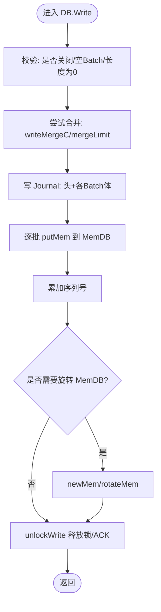

# 批量操作

<cite>
**本文引用的文件**
- [batch.go](file://leveldb/batch.go)
- [db_write.go](file://leveldb/db_write.go)
- [memdb.go](file://leveldb/memdb/memdb.go)
- [journal.go](file://leveldb/journal/journal.go)
- [db.go](file://leveldb/db.go)
- [db_state.go](file://leveldb/db_state.go)
- [batch_test.go](file://leveldb/batch_test.go)
- [db_test.go](file://leveldb/db_test.go)
</cite>

## 目录
1. [引言](#引言)
2. [项目结构](#项目结构)
3. [核心组件](#核心组件)
4. [架构总览](#架构总览)
5. [详细组件分析](#详细组件分析)
6. [依赖关系分析](#依赖关系分析)
7. [性能考量](#性能考量)
8. [故障排查指南](#故障排查指南)
9. [结论](#结论)
10. [附录](#附录)

## 引言
本篇文档围绕 avccDB 的批量写入能力展开，系统阐述 Batch 结构的设计与实现，重点说明 Write 方法中批量写入的执行流程、原子性保障机制、与内存数据库（MemDB）及日志（Journal）的交互方式，以及在高并发场景下的线程安全设计。同时给出批量写入与单个写入的性能差异、批量大小限制与常见问题的解决方案，并提供关键时序图与状态转换图帮助理解。

## 项目结构
- 批量写入核心位于 leveldb/batch.go，定义了 Batch 数据结构、编码/解码、内存写入等。
- 写入主流程位于 leveldb/db_write.go，包含写入合并、序列号分配、写 Journal、写 MemDB 等。
- 内存数据库接口位于 leveldb/memdb/memdb.go，提供 Put/Delete 等操作。
- 日志子系统位于 leveldb/journal/journal.go，负责日志块、校验、读写。
- 恢复与新 MemDB 创建逻辑位于 leveldb/db.go 和 leveldb/db_state.go。
- 测试覆盖了批量写入、并发写入、序列一致性等。

图表来源
- [batch.go](file://leveldb/batch.go#L62-L136)
- [db_write.go](file://leveldb/db_write.go#L18-L33)
- [journal.go](file://leveldb/journal/journal.go#L343-L537)
- [memdb.go](file://leveldb/memdb/memdb.go#L273-L315)

章节来源
- [batch.go](file://leveldb/batch.go#L62-L136)
- [db_write.go](file://leveldb/db_write.go#L18-L33)
- [journal.go](file://leveldb/journal/journal.go#L343-L537)
- [memdb.go](file://leveldb/memdb/memdb.go#L273-L315)

## 核心组件
- Batch：批量记录的容器，内部以紧凑二进制格式存储多条 Put/Delete 记录，并维护索引与内部长度，支持追加、加载、回放、合并等。
- DB.Write：对外暴露的批量写入口，负责合并小批量、写 Journal、写 MemDB、更新序列号、必要时旋转 MemDB。
- MemDB：内存键值数据库，提供 Put/Delete 等操作，是批量写入的最终落点之一。
- Journal：日志子系统，按块写入多条 Journal，提供严格/宽松模式下的容错与恢复。

章节来源
- [batch.go](file://leveldb/batch.go#L62-L136)
- [db_write.go](file://leveldb/db_write.go#L18-L33)
- [memdb.go](file://leveldb/memdb/memdb.go#L273-L315)
- [journal.go](file://leveldb/journal/journal.go#L343-L537)

## 架构总览
批量写入的关键路径：
- DB.Write 接收 Batch 或单条 Put/Delete 请求，尝试合并多个写入。
- 合并后先写 Journal，再写 MemDB，最后更新全局序列号。
- 若 MemDB 已满或达到阈值，触发旋转（newMem），并安排压缩。

图表来源
- [db_write.go](file://leveldb/db_write.go#L18-L33)
- [db_write.go](file://leveldb/db_write.go#L155-L266)
- [batch.go](file://leveldb/batch.go#L244-L257)
- [journal.go](file://leveldb/journal/journal.go#L343-L537)

## 详细组件分析

### Batch 结构与实现
- 数据布局
  - data：紧凑二进制缓冲区，顺序存放多条记录。
  - index：每条记录的元信息（类型、键/值偏移与长度、版本号等），用于解析与回放。
  - internalLen：估算内部长度（含内部键开销），用于合并与内存控制。
  - growLimit：增长阈值，控制扩容策略，避免频繁大步扩容。
- 关键方法
  - Put/Delete/PutWithVersion：追加记录，自动扩容与更新 internalLen。
  - appendRec/appendRecWithVersion：编码记录到 data，并更新 index。
  - Replay/ReplayInternal：将 Batch 回放到外部回调或另一个 Batch。
  - Load/Dump：从二进制载入/导出 Batch。
  - append：合并另一个 Batch，维护偏移一致性。
  - putMem：将 Batch 应用到 MemDB，生成内部键并逐条 Put。
  - decode/decodeBatch：解析二进制为索引，支持校验与长度检查。
  - encodeBatchHeader/decodeBatchHeader：批次头（起始序列号、记录数）编解码。
  - writeBatchesWithHeader：将多个 Batch 连续写入 Journal 头部与体。
- 扩容策略
  - grow：当剩余容量不足时，根据 growLimit 动态扩大容量，避免每次倍增导致峰值内存过高。

图表来源
- [batch.go](file://leveldb/batch.go#L44-L61)
- [batch.go](file://leveldb/batch.go#L62-L136)
- [batch.go](file://leveldb/batch.go#L191-L224)
- [batch.go](file://leveldb/batch.go#L244-L257)
- [batch.go](file://leveldb/batch.go#L304-L344)
- [batch.go](file://leveldb/batch.go#L346-L392)
- [batch.go](file://leveldb/batch.go#L394-L413)

章节来源
- [batch.go](file://leveldb/batch.go#L62-L136)
- [batch.go](file://leveldb/batch.go#L191-L224)
- [batch.go](file://leveldb/batch.go#L244-L257)
- [batch.go](file://leveldb/batch.go#L304-L344)
- [batch.go](file://leveldb/batch.go#L346-L392)
- [batch.go](file://leveldb/batch.go#L394-L413)

### DB.Write 与批量写入流程
- 参数与前置校验：空 Batch、关闭状态直接返回错误。
- 合并策略：通过通道收集并发写入的小批量/单条，计算合并上限（基于 internalLen 与 MemDB 可用空间），支持版本化写入合并。
- 写 Journal：使用 journal.Writer 写入批次头（起始序列号、记录数），随后写入每个 Batch 的二进制体；可选同步刷盘。
- 写 MemDB：逐批调用 Batch.putMem，生成内部键并 Put 到 MemDB；按批次长度推进序列号。
- 更新序列号：累加所有批次记录数，更新全局 seq。
- 旋转 MemDB：若当前批次大小达到 MemDB 可用空间阈值，触发 newMem 并安排压缩。
- 锁与 ACK：通过 writeLockC/writeMergeC/writeMergedC/writeAckC 协调合并与锁传递，确保线程安全。

图表来源
- [db_write.go](file://leveldb/db_write.go#L268-L330)
- [db_write.go](file://leveldb/db_write.go#L155-L266)
- [db_state.go](file://leveldb/db_state.go#L120-L159)

章节来源
- [db_write.go](file://leveldb/db_write.go#L155-L266)
- [db_write.go](file://leveldb/db_write.go#L268-L330)
- [db_state.go](file://leveldb/db_state.go#L120-L159)

### 原子性保障
- 单次写入原子性：DB.Write 在一次调用内完成“写 Journal -> 写 MemDB -> 更新序列号”，任一步骤失败会回滚（Journal 不完整、MemDB 不回滚，但通过后续恢复与序列号一致来保证最终一致性）。
- 批次内原子性：Batch 内部记录按顺序写入，Batch.putMem 逐条 Put，若某条失败则上层捕获错误。
- 恢复阶段原子性：恢复时按 Journal 顺序解码批次，对每条记录生成内部键并 Put 到 MemDB，成功后更新序列号；严格模式下遇到损坏会跳过并继续，非严格模式下记录日志后继续。
- 版本化写入：Batch.putMem 支持带版本号的记录，内部键包含版本字段，确保同一键的多版本有序。

章节来源
- [db_write.go](file://leveldb/db_write.go#L155-L266)
- [batch.go](file://leveldb/batch.go#L244-L257)
- [db.go](file://leveldb/db.go#L580-L666)
- [db.go](file://leveldb/db.go#L668-L767)

### 与 MemDB 的交互
- 写入路径：Batch.putMem 逐条将记录转换为内部键并写入 MemDB。
- 并发访问：MemDB 内部使用读写锁保护，Put/Delete 互不阻塞，但写入时持有写锁。
- 容量与回收：MemDB 提供 Capacity/Size/Free/Len 等接口，DB.flush 会根据写入压力与 L0 触发条件进行节流与暂停，必要时触发 newMem 旋转。

章节来源
- [batch.go](file://leveldb/batch.go#L244-L257)
- [memdb.go](file://leveldb/memdb/memdb.go#L273-L315)
- [memdb.go](file://leveldb/memdb/memdb.go#L411-L439)
- [db_write.go](file://leveldb/db_write.go#L66-L131)

### 与 Journal 的交互
- 写入：DB.writeJournal 使用 journal.Writer 写入批次头与批次体，支持 Flush/Sync。
- 读取：恢复时使用 journal.Reader 顺序读取 Journal，将批次解码并写入 MemDB。
- 容错：journal.Reader 支持严格/宽松模式，遇到损坏块/块头错误时可选择跳过或报错。

章节来源
- [db_write.go](file://leveldb/db_write.go#L18-L33)
- [journal.go](file://leveldb/journal/journal.go#L343-L537)
- [db.go](file://leveldb/db.go#L580-L666)

### 批量合并机制与序列号管理
- 合并：通过 writeMergeC 通道收集并发写入，计算 mergeLimit（受批次大小与 MemDB 可用空间约束），将多个 Batch 合并为一个写入批次。
- 序列号：DB.Write 在写 Journal 前分配 seq，Batch.putMem 逐条递增，最终累加到全局 seq。
- 版本化：Batch.putMem 支持带版本号的记录，内部键包含版本字段，确保多版本有序。

章节来源
- [db_write.go](file://leveldb/db_write.go#L155-L266)
- [batch.go](file://leveldb/batch.go#L244-L257)
- [batch.go](file://leveldb/batch.go#L346-L392)

### 高并发与线程安全
- 写锁：writeLockC 保证同一时刻只有一个写入在执行；writeMergeC 用于尝试合并，若无法合并则接管写锁。
- ACK 与合并确认：writeMergedC 与 writeAckC 用于通知合并结果与写入完成，避免竞争条件。
- 并发 Put/Delete：通过 writeMergeC 通道将单条写入合并到 Batch，减少锁竞争。
- 恢复与只读模式：恢复时按 Journal 顺序解码并写入 MemDB，严格模式下遇到损坏会跳过并继续。

章节来源
- [db_write.go](file://leveldb/db_write.go#L133-L154)
- [db_write.go](file://leveldb/db_write.go#L295-L330)
- [db.go](file://leveldb/db.go#L580-L666)

### 性能差异与优化
- 批量写入优势：减少系统调用次数（Journal 写入）、降低锁竞争、提升吞吐；适合大量小写入聚合。
- 单个写入劣势：频繁写 Journal、频繁获取/释放锁，系统开销较大。
- 批量大小限制：当 Batch.internalLen 超过写缓冲阈值且未禁用大批次事务时，DB.Write 会转而使用事务直接写表，绕过 Journal，避免 Journal 带来的额外成本。
- 扩容策略：Batch.grow 根据 growLimit 控制扩容速度，避免内存峰值过高。
- 合并上限：mergeLimit 基于批次大小与 MemDB 可用空间动态计算，防止过度合并导致内存压力。

章节来源
- [db_write.go](file://leveldb/db_write.go#L276-L293)
- [batch.go](file://leveldb/batch.go#L77-L92)
- [db_write.go](file://leveldb/db_write.go#L171-L182)

### 时序图与状态转换图

#### 写入时序图（批量）

图表来源
- [db_write.go](file://leveldb/db_write.go#L268-L330)
- [db_write.go](file://leveldb/db_write.go#L155-L266)
- [batch.go](file://leveldb/batch.go#L244-L257)
- [journal.go](file://leveldb/journal/journal.go#L343-L537)

#### 写入状态转换图

图表来源
- [db_write.go](file://leveldb/db_write.go#L155-L266)
- [db_write.go](file://leveldb/db_write.go#L133-L154)

## 依赖关系分析
- Batch 依赖 MemDB 的 Put/Delete 接口，用于批量写入。
- DB.Write 依赖 Journal Writer/Reader，负责持久化与恢复。
- DB.State/newMem 与 Journal Writer 生命周期耦合，newMem 会切换 Journal 文件并重置 writer。
- 批量写入与序列号管理紧密相关，Batch.putMem 与 DB.addSeq 共同保证顺序一致性。

图表来源
- [batch.go](file://leveldb/batch.go#L244-L257)
- [db_write.go](file://leveldb/db_write.go#L18-L33)
- [db_state.go](file://leveldb/db_state.go#L120-L159)

章节来源
- [batch.go](file://leveldb/batch.go#L244-L257)
- [db_write.go](file://leveldb/db_write.go#L18-L33)
- [db_state.go](file://leveldb/db_state.go#L120-L159)

## 性能考量
- 批量写入吞吐更高：合并写入减少 Journal 开销与锁竞争。
- 大批量事务：当 Batch.internalLen 超过写缓冲阈值时，DB.Write 会启用事务直接写表，绕过 Journal，显著降低延迟与 IO。
- 扩容与内存：合理设置 BatchConfig.GrowLimit，避免频繁大步扩容；结合批量大小与写缓冲配置，平衡内存占用与吞吐。
- 合并上限：mergeLimit 由批次大小与 MemDB 可用空间共同决定，避免过度合并导致内存压力。

章节来源
- [db_write.go](file://leveldb/db_write.go#L276-L293)
- [batch.go](file://leveldb/batch.go#L77-L92)
- [db_write.go](file://leveldb/db_write.go#L171-L182)

## 故障排查指南
- 批量写入失败
  - 检查 Journal 写入是否成功（Flush/Sync），失败时会回滚。
  - 检查 MemDB Put 是否返回错误（例如并发删除导致的 NotFound）。
  - 检查 Batch 内容是否被提前修改（Write 不修改 Batch 内容，但外部修改会影响一致性）。
- 批量大小限制
  - 当 Batch.internalLen 超过写缓冲阈值时，DB.Write 会转为事务写表；可通过选项禁用该行为。
- 恢复与损坏
  - Journal Reader 支持严格/宽松模式；严格模式下损坏会报错，宽松模式会跳过并继续。
  - 恢复完成后会更新序列号，确保后续写入顺序正确。
- 并发一致性
  - 确保通过 writeMergeC/lock 通道进行写入，避免直接并发写入造成竞争。
  - 使用 Snapshot 获取一致视图，避免读写竞争导致的数据不一致。

章节来源
- [db_write.go](file://leveldb/db_write.go#L155-L266)
- [journal.go](file://leveldb/journal/journal.go#L149-L214)
- [db.go](file://leveldb/db.go#L580-L666)
- [db_test.go](file://leveldb/db_test.go#L2239-L2295)

## 结论
Batch 结构提供了高效的批量写入能力，DB.Write 通过合并、Journal 与 MemDB 的协同，实现了高吞吐与强一致性的平衡。在高并发场景下，通过写锁与合并通道协调，既保证了线程安全，又降低了锁竞争。合理配置批量大小与合并策略，可在不同负载下获得最佳性能。

## 附录
- 批量写入测试覆盖：批量编码/解码、回放、合并、并发写入与序列一致性验证。
- 性能基准：提供默认与快速扩容两种配置的批量写入基准测试，便于对比不同配置下的内存与吞吐表现。

章节来源
- [batch_test.go](file://leveldb/batch_test.go#L1-L179)
- [db_test.go](file://leveldb/db_test.go#L2239-L2295)