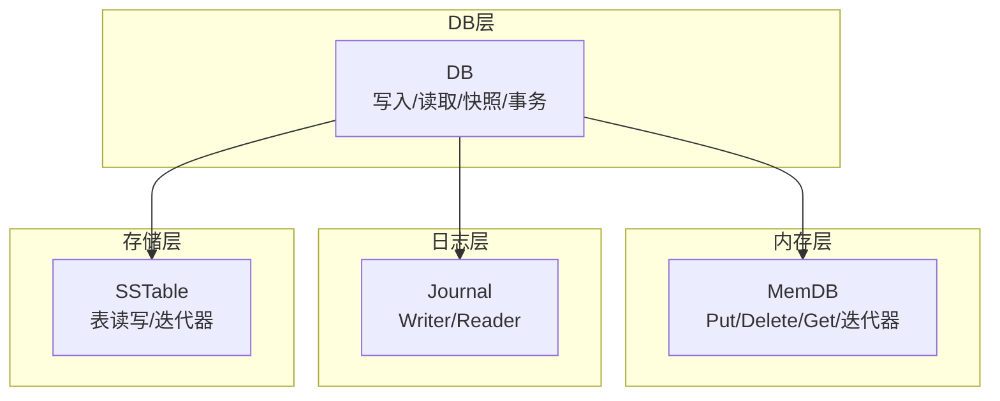
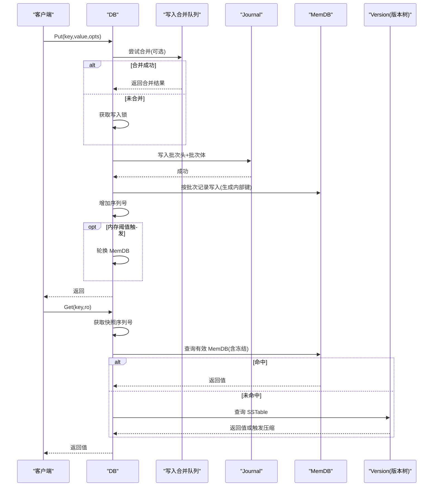
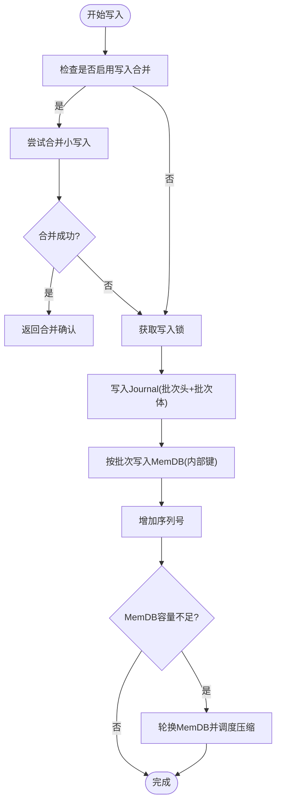
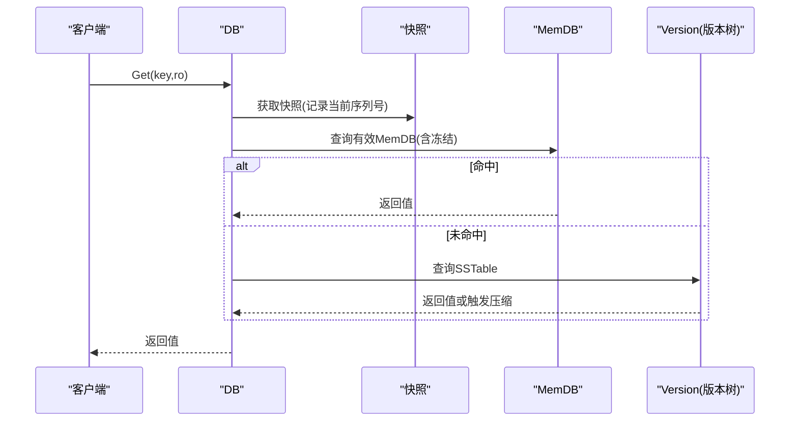
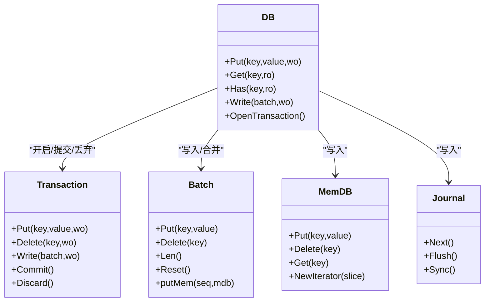
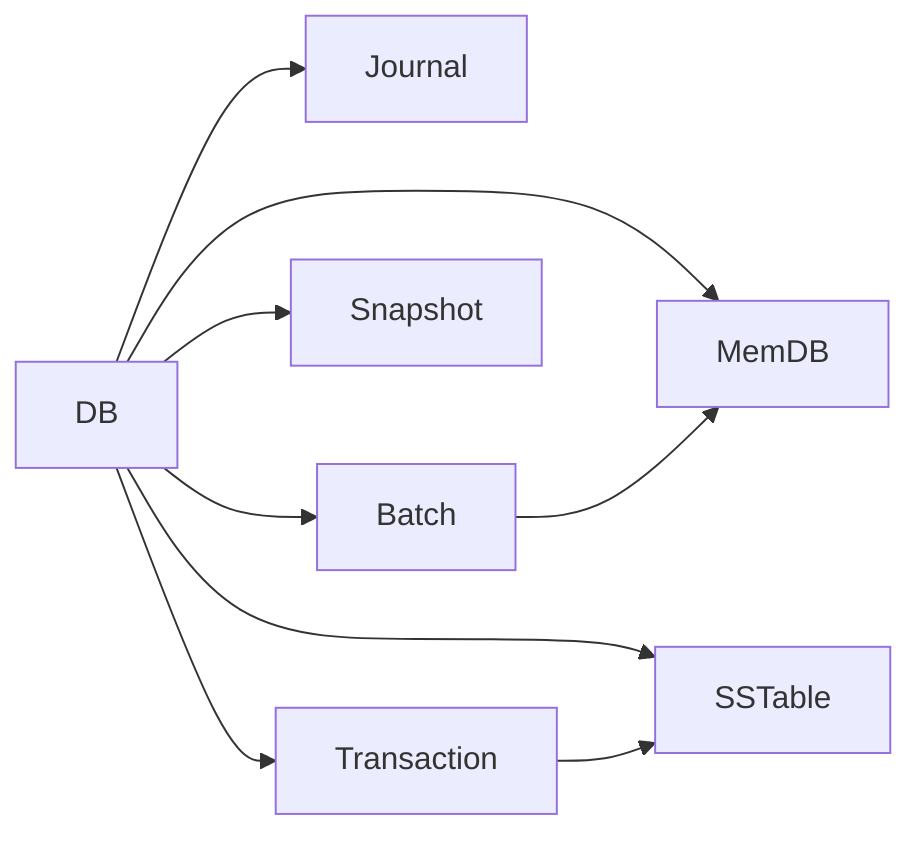

# 数据操作

<cite>
**本文引用的文件**
- [leveldb/db.go](file://leveldb/db.go)
- [leveldb/db_write.go](file://leveldb/db_write.go)
- [leveldb/memdb/memdb.go](file://leveldb/memdb/memdb.go)
- [leveldb/journal/journal.go](file://leveldb/journal/journal.go)
- [leveldb/batch.go](file://leveldb/batch.go)
- [leveldb/db_snapshot.go](file://leveldb/db_snapshot.go)
- [leveldb/db_transaction.go](file://leveldb/db_transaction.go)
- [leveldb/key.go](file://leveldb/key.go)
</cite>

## 目录
1. [简介](#简介)
2. [项目结构](#项目结构)
3. [核心组件](#核心组件)
4. [架构总览](#架构总览)
5. [详细组件分析](#详细组件分析)
6. [依赖关系分析](#依赖关系分析)
7. [性能考量](#性能考量)
8. [故障排查指南](#故障排查指南)
9. [结论](#结论)

## 简介
本文件聚焦 avccDB 的 DB 组件数据操作能力，系统化阐述 Put、Get、Delete、Has、Write 等核心方法的实现细节与交互机制，覆盖与内存数据库（MemDB）、日志（Journal）及 SSTable 的协作流程；解释写入合并（write merge）、序列号管理、读取快照隔离与版本控制；剖析批量写入（Batch Write）的原子性与事务处理；并提供时序图与状态转换图，说明高并发下的线程安全设计，最后给出常见问题与性能优化建议。

## 项目结构
- DB 核心位于 leveldb/db.go，封装了写入、读取、快照、事务、版本历史、主根 Merkle 根等能力。
- 写入路径由 leveldb/db_write.go 提供，包含写入合并、日志写入、内存轮换与刷新等。
- 内存数据库实现位于 leveldb/memdb/memdb.go，提供 Put/Delete/Get/迭代器等。
- 日志系统位于 leveldb/journal/journal.go，负责记录批量写入批次与恢复。
- 批处理位于 leveldb/batch.go，定义批次编码/解码、内部键生成、写入内存等。
- 快照与事务分别在 leveldb/db_snapshot.go 与 leveldb/db_transaction.go 中实现。

图表来源
- [leveldb/db.go](file://leveldb/db.go#L1-L120)
- [leveldb/db_write.go](file://leveldb/db_write.go#L1-L120)
- [leveldb/memdb/memdb.go](file://leveldb/memdb/memdb.go#L1-L120)
- [leveldb/journal/journal.go](file://leveldb/journal/journal.go#L1-L120)

章节来源
- [leveldb/db.go](file://leveldb/db.go#L1-L120)
- [leveldb/db_write.go](file://leveldb/db_write.go#L1-L120)
- [leveldb/memdb/memdb.go](file://leveldb/memdb/memdb.go#L1-L120)
- [leveldb/journal/journal.go](file://leveldb/journal/journal.go#L1-L120)

## 核心组件
- DB：对外暴露 Put/Get/Delete/Has/Write/GetVersionHistory/GetWithProof 等接口；维护序列号、快照链表、写入合并通道、写入锁、压缩命令通道等。
- MemDB：基于跳表的内存键值存储，支持并发读写（读写锁），提供 Put/Delete/Get/迭代器。
- Journal：按块记录的多条目日志，支持严格校验与恢复，写入时以批次头+批次体形式持久化。
- Batch：批处理对象，编码/解码记录，生成内部键并写入 MemDB。
- Snapshot：快照句柄，持有某一时刻的序列号，确保读取一致性。
- Transaction：事务句柄，直接写入 SSTable，绕过 Journal，提交时合并到版本并触发自动压缩。

章节来源
- [leveldb/db.go](file://leveldb/db.go#L33-L120)
- [leveldb/memdb/memdb.go](file://leveldb/memdb/memdb.go#L180-L260)
- [leveldb/journal/journal.go](file://leveldb/journal/journal.go#L340-L420)
- [leveldb/batch.go](file://leveldb/batch.go#L60-L120)
- [leveldb/db_snapshot.go](file://leveldb/db_snapshot.go#L21-L90)
- [leveldb/db_transaction.go](file://leveldb/db_transaction.go#L21-L60)

## 架构总览
DB 的数据操作遵循“写入合并—日志持久化—内存写入—序列号推进—必要时旋转 MemDB”的路径；读取通过快照隔离，优先命中 MemDB，再回退到版本树（SSTable）。

图表来源
- [leveldb/db_write.go](file://leveldb/db_write.go#L274-L375)
- [leveldb/db_write.go](file://leveldb/db_write.go#L18-L33)
- [leveldb/db.go](file://leveldb/db.go#L1092-L1125)
- [leveldb/db.go](file://leveldb/db.go#L800-L833)

## 详细组件分析

### 写入路径：Put/Write/PutWithVersion/Delete
- 写入入口：
  - Put/Delete：构造单条记录，走写入合并路径。
  - PutWithVersion：带版本号写入，内部键包含版本字段。
  - Write：批量写入，若批次过大且允许，转为事务写入（绕过 Journal）。
- 写入合并（write merge）：
  - 使用 writeMergeC 通道尝试合并多个小写入；合并上限受 MemDB 可用空间与阈值限制；合并成功则直接返回。
  - 合并失败时获取写入锁，进入 writeLocked。
- 日志写入：
  - writeJournal 将批次头（起始序列号、记录数）与批次体写入 Journal，并可选择同步刷盘。
- 内存写入：
  - batch.putMem 将每条记录转换为内部键后写入 MemDB。
- 序列号推进：
  - addSeq 增量推进全局序列号；rotateMem 在阈值触发时轮换 MemDB 并调度压缩。
- 大批次优化：
  - 若批次大小超过写缓冲阈值且未禁用大批次事务，则使用事务写入，直接生成 SSTable，避免 Journal。

图表来源
- [leveldb/db_write.go](file://leveldb/db_write.go#L274-L375)
- [leveldb/db_write.go](file://leveldb/db_write.go#L18-L33)
- [leveldb/db_write.go](file://leveldb/db_write.go#L133-L266)
- [leveldb/batch.go](file://leveldb/batch.go#L244-L257)

章节来源
- [leveldb/db_write.go](file://leveldb/db_write.go#L274-L375)
- [leveldb/db_write.go](file://leveldb/db_write.go#L133-L266)
- [leveldb/batch.go](file://leveldb/batch.go#L244-L257)

### 读取路径：Get/Has/GetWithVersion/GetVersionHistory/GetWithProof
- Get/GetWithVersion：
  - 先构建内部键（GetWithVersion 支持指定版本，0 表示最新），按快照序列号获取视图。
  - 依次查询辅助 MemDB、有效 MemDB（含冻结）；未命中则查询版本树（SSTable），命中返回值，未命中返回 ErrNotFound。
- Has：
  - 逻辑与 Get 类似，但只关心是否存在，不返回值。
- GetVersionHistory：
  - 收集 MemDB 与 SSTable 中指定范围内的所有版本条目，去重并按版本升序返回。
- GetWithProof：
  - 在 Get 的基础上，结合 MemDB/SSTable 的证明与 MasterRoot，生成可验证的 Merkle 证明。
- 快照隔离：
  - 通过 acquireSnapshot/releaseSnapshot 维护快照链表，最小未被快照持有的序列号用于判定可见性。

图表来源
- [leveldb/db.go](file://leveldb/db.go#L1092-L1125)
- [leveldb/db.go](file://leveldb/db.go#L1056-L1090)
- [leveldb/db_snapshot.go](file://leveldb/db_snapshot.go#L21-L90)

章节来源
- [leveldb/db.go](file://leveldb/db.go#L1056-L1125)
- [leveldb/db.go](file://leveldb/db.go#L1127-L1198)
- [leveldb/db_snapshot.go](file://leveldb/db_snapshot.go#L21-L90)

### 版本与内部键
- 内部键格式：
  - 非版本键：用户键 + 8 字节（序列号+类型）。
  - 版本键：用户键 + 8 字节版本 + 8 字节（序列号+类型）。
- 排序规则：
  - 用户键相同时，按序列号降序排序；版本键按版本降序排序。
- 解析与比较：
  - parseInternalKey/parseInternalKeyWithVersion 提供解析；comparer 实现对内部键的比较，确保 Seek/迭代行为符合预期。

章节来源
- [leveldb/key.go](file://leveldb/key.go#L75-L147)
- [leveldb/key.go](file://leveldb/key.go#L148-L196)

### 批量写入与事务
- Batch：
  - 编码/解码批次头（序列号、记录数）与记录体；putMem 将记录转换为内部键写入 MemDB。
- 事务（Transaction）：
  - 直接写入 SSTable，绕过 Journal；提交时将表加入版本并触发自动压缩；失败可 Discard。
  - OpenTransaction 会阻塞后续写入直到事务结束；当 L0 表数量达到阈值时等待压缩。

图表来源
- [leveldb/db.go](file://leveldb/db.go#L1092-L1198)
- [leveldb/db_transaction.go](file://leveldb/db_transaction.go#L120-L200)
- [leveldb/batch.go](file://leveldb/batch.go#L244-L257)
- [leveldb/memdb/memdb.go](file://leveldb/memdb/memdb.go#L273-L339)
- [leveldb/journal/journal.go](file://leveldb/journal/journal.go#L470-L537)

章节来源
- [leveldb/db_transaction.go](file://leveldb/db_transaction.go#L120-L200)
- [leveldb/batch.go](file://leveldb/batch.go#L244-L257)

### 线程安全与并发控制
- 写入锁：
  - writeLockC 保证同一时间只有一个写入在执行；写入合并失败时才获取锁。
- 写入合并：
  - writeMergeC 与 writeMergedC 协作，合并成功即返回；否则将锁传递给下一个写入。
- 快照：
  - snapsList 保护快照链表；minSeq 计算最小未被快照持有的序列号，影响可见性与清理策略。
- 读写并发：
  - MemDB 使用读写锁；DB 层通过快照序列号隔离读取；迭代器持有版本引用，释放后不影响快照有效性。

章节来源
- [leveldb/db_write.go](file://leveldb/db_write.go#L133-L266)
- [leveldb/db.go](file://leveldb/db.go#L1-L120)
- [leveldb/db_snapshot.go](file://leveldb/db_snapshot.go#L21-L90)
- [leveldb/memdb/memdb.go](file://leveldb/memdb/memdb.go#L180-L260)

## 依赖关系分析
- DB 依赖 MemDB 进行内存写入与读取；依赖 Journal 进行持久化；依赖 Version（SSTable）进行磁盘层读取与压缩。
- Batch 依赖内部键生成与 MemDB 写入；Transaction 依赖 SSTable 创建与版本提交。
- Journal 与 Storage 层配合，提供块级记录与校验。

图表来源
- [leveldb/db.go](file://leveldb/db.go#L1-L120)
- [leveldb/db_write.go](file://leveldb/db_write.go#L1-L120)
- [leveldb/batch.go](file://leveldb/batch.go#L1-L120)
- [leveldb/db_transaction.go](file://leveldb/db_transaction.go#L1-L120)

章节来源
- [leveldb/db.go](file://leveldb/db.go#L1-L120)
- [leveldb/db_write.go](file://leveldb/db_write.go#L1-L120)
- [leveldb/batch.go](file://leveldb/batch.go#L1-L120)
- [leveldb/db_transaction.go](file://leveldb/db_transaction.go#L1-L120)

## 性能考量
- 写入合并：
  - 合并阈值与 MemDB 可用空间动态调整，减少日志写入次数与内存碎片。
- 写入节流与暂停：
  - flush 根据 L0 表数量触发写入延时或暂停，等待压缩完成，避免写放大。
- 大批次事务：
  - 对超阈值批次直接走事务写入，绕过 Journal，降低日志开销。
- 快照与迭代器：
  - 读取使用快照隔离，避免长迭代器导致的可见性问题；注意及时释放快照与迭代器。
- 版本查询：
  - GetVersionHistory 会汇总 MemDB 与 SSTable 的版本，注意范围过大时的内存占用。

[本节为通用指导，无需列出具体文件来源]

## 故障排查指南
- 写入延迟与暂停：
  - 观察写入延迟计数与累计时长；当 L0 表数量达到暂停阈值时会触发暂停等待压缩。
- 日志损坏：
  - Journal Reader 支持严格模式与校验，损坏时会跳过错误块并可选择抛错；可通过 Recover 流程重建。
- 读写冲突：
  - 确保读取使用快照；避免长时间持有快照导致不可见旧数据；迭代器释放后不会影响快照有效性。
- 事务提交失败：
  - 事务提交包含重试与统计；失败时可 Discard 后重试或回滚。

章节来源
- [leveldb/db_write.go](file://leveldb/db_write.go#L66-L131)
- [leveldb/journal/journal.go](file://leveldb/journal/journal.go#L148-L248)
- [leveldb/db_transaction.go](file://leveldb/db_transaction.go#L190-L252)
- [leveldb/db_snapshot.go](file://leveldb/db_snapshot.go#L120-L188)

## 结论
avccDB 的数据操作围绕“写入合并—日志持久化—内存写入—序列号推进—版本查询”展开，通过快照隔离与版本控制保障读取一致性；通过事务与大批次优化降低写入开销；通过压缩与节流控制写放大。理解内部键格式、写入合并与快照机制，有助于在高并发场景下获得稳定与高性能的数据操作体验。