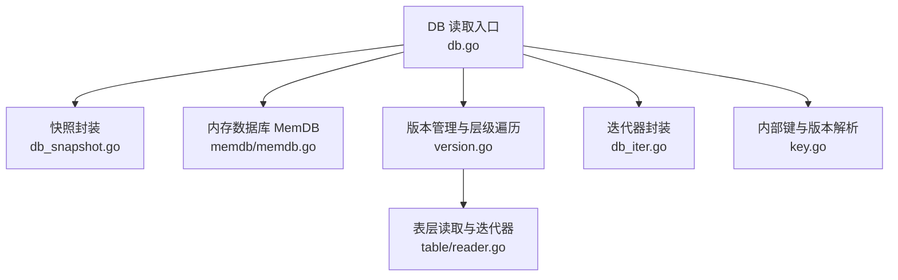
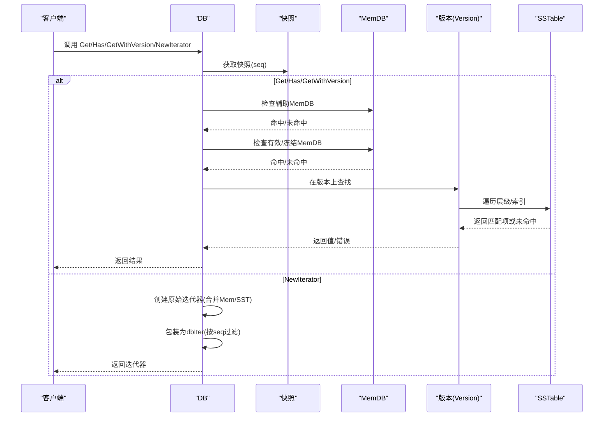
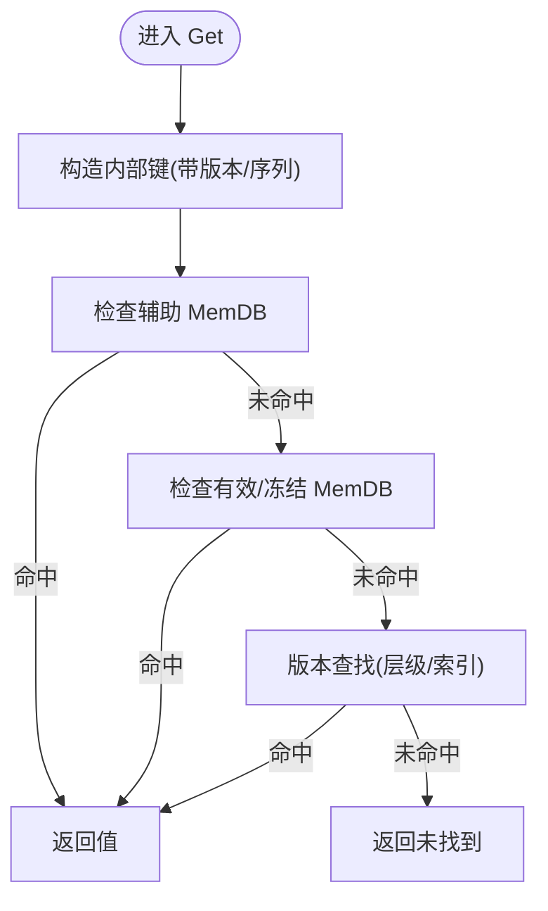
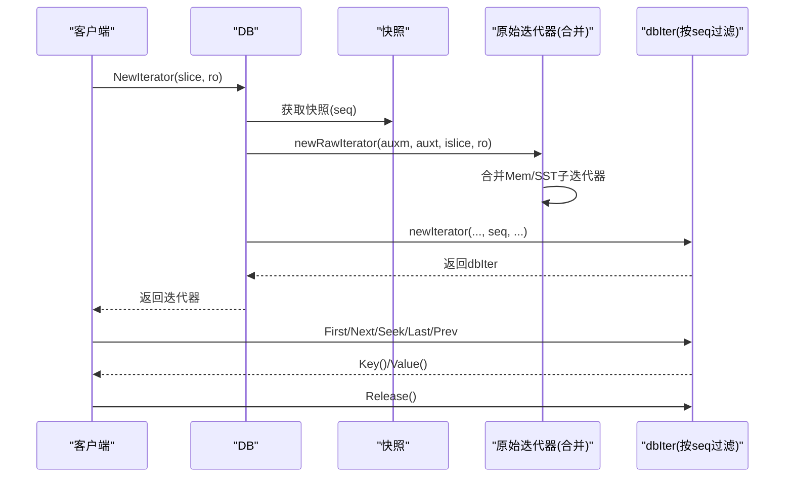
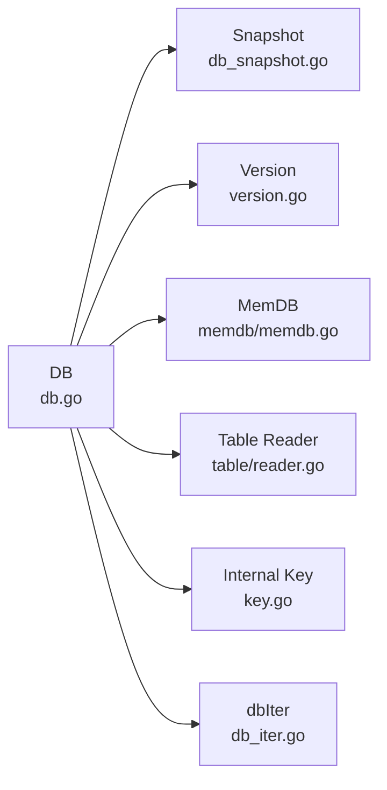

# 读取操作

<cite>
**本文引用的文件**
- [leveldb/db.go](file://leveldb/db.go)
- [leveldb/db_iter.go](file://leveldb/db_iter.go)
- [leveldb/db_snapshot.go](file://leveldb/db_snapshot.go)
- [leveldb/memdb/memdb.go](file://leveldb/memdb/memdb.go)
- [leveldb/table/reader.go](file://leveldb/table/reader.go)
- [leveldb/version.go](file://leveldb/version.go)
- [leveldb/key.go](file://leveldb/key.go)
- [leveldb/bench_test.go](file://leveldb/bench_test.go)
</cite>

## 目录
1. [简介](#简介)
2. [项目结构](#项目结构)
3. [核心组件](#核心组件)
4. [架构总览](#架构总览)
5. [详细组件分析](#详细组件分析)
6. [依赖关系分析](#依赖关系分析)
7. [性能考量](#性能考量)
8. [故障排查指南](#故障排查指南)
9. [结论](#结论)

## 简介
本章节聚焦 avccDB 的读取操作，系统性梳理 Get、Has、GetWithVersion、GetWithProof 与 NewIterator 的实现路径，阐明其与内存数据库（MemDB）、SSTable 和快照（Snapshot）之间的交互机制，覆盖版本控制、快照隔离、范围查询、迭代器创建与使用模式、线程安全设计，并给出时序图与状态转换图，帮助读者在高并发场景下理解读取性能与优化策略。

## 项目结构
围绕读取操作的关键模块如下：
- 数据库入口与读取接口：leveldb/db.go
- 快照与读选项：leveldb/db_snapshot.go
- 内存数据库（MemDB）：leveldb/memdb/memdb.go
- 表层读取与迭代器：leveldb/table/reader.go
- 版本管理与层级遍历：leveldb/version.go
- 内部键格式与版本解析：leveldb/key.go
- 迭代器封装与合并：leveldb/db_iter.go
- 并发读取基准测试：leveldb/bench_test.go

图表来源
- [leveldb/db.go](file://leveldb/db.go#L1092-L1230)
- [leveldb/db_snapshot.go](file://leveldb/db_snapshot.go#L97-L166)
- [leveldb/memdb/memdb.go](file://leveldb/memdb/memdb.go#L351-L407)
- [leveldb/version.go](file://leveldb/version.go#L142-L285)
- [leveldb/table/reader.go](file://leveldb/table/reader.go#L789-L800)
- [leveldb/db_iter.go](file://leveldb/db_iter.go#L31-L61)
- [leveldb/key.go](file://leveldb/key.go#L75-L132)

章节来源
- [leveldb/db.go](file://leveldb/db.go#L1092-L1230)
- [leveldb/db_iter.go](file://leveldb/db_iter.go#L31-L61)
- [leveldb/db_snapshot.go](file://leveldb/db_snapshot.go#L97-L166)
- [leveldb/memdb/memdb.go](file://leveldb/memdb/memdb.go#L351-L407)
- [leveldb/table/reader.go](file://leveldb/table/reader.go#L789-L800)
- [leveldb/version.go](file://leveldb/version.go#L142-L285)
- [leveldb/key.go](file://leveldb/key.go#L75-L132)

## 核心组件
- Get：返回指定键的最新版本值；内部通过快照捕获序列号，再按 MemDB -> SSTable 的顺序查找。
- Has：判断键是否存在；与 Get 类似，但仅返回存在性。
- GetWithVersion：返回指定版本的值；支持版本通配符（最新版本）。
- GetWithProof：返回值与 Merkle 证明；结合 MasterRoot 实现跨层证明增强。
- NewIterator：基于快照创建迭代器，支持范围切片与并发安全的快照一致性。

章节来源
- [leveldb/db.go](file://leveldb/db.go#L1092-L1146)
- [leveldb/db.go](file://leveldb/db.go#L1186-L1230)
- [leveldb/db.go](file://leveldb/db.go#L1112-L1146)
- [leveldb/db.go](file://leveldb/db.go#L835-L932)
- [leveldb/db_snapshot.go](file://leveldb/db_snapshot.go#L97-L166)

## 架构总览
读取流程从 DB 入口开始，统一通过快照捕获当前序列号，随后按优先级在 MemDB（含辅助 MemDB 与冻结 MemDB）与 SSTable 层中查找。版本解析与比较贯穿其中，确保返回满足版本约束的结果。迭代器在底层由版本管理生成多路合并迭代器，融合 MemDB 与 SSTable 的子迭代器。

图表来源
- [leveldb/db.go](file://leveldb/db.go#L1092-L1146)
- [leveldb/db.go](file://leveldb/db.go#L1186-L1230)
- [leveldb/db_iter.go](file://leveldb/db_iter.go#L31-L61)
- [leveldb/version.go](file://leveldb/version.go#L142-L285)
- [leveldb/memdb/memdb.go](file://leveldb/memdb/memdb.go#L351-L407)

## 详细组件分析

### Get 方法
- 功能：返回指定键的最新版本值；若不存在则返回未找到。
- 关键流程：
  - 使用快照捕获当前序列号，作为读取上下文。
  - 构造内部键（带版本与序列），优先检查辅助 MemDB 与有效/冻结 MemDB。
  - 若未命中 MemDB，则委托版本管理在 SSTable 中查找，按层级与重叠范围定位候选表，解析内部键以匹配用户键与版本，选择最大序列号或指定版本。
  - 若命中，返回值；否则返回未找到。
- 版本控制：内部键包含版本字段，查询时可匹配特定版本或通配最新版本。
- 错误处理：遇到非未找到错误直接返回；命中后可能触发表层压缩调度。

图表来源
- [leveldb/db.go](file://leveldb/db.go#L798-L833)
- [leveldb/key.go](file://leveldb/key.go#L75-L132)
- [leveldb/version.go](file://leveldb/version.go#L142-L285)

章节来源
- [leveldb/db.go](file://leveldb/db.go#L1092-L1107)
- [leveldb/db.go](file://leveldb/db.go#L798-L833)
- [leveldb/key.go](file://leveldb/key.go#L75-L132)
- [leveldb/version.go](file://leveldb/version.go#L142-L285)

### Has 方法
- 功能：判断键是否存在。
- 关键流程：与 Get 类似，但在版本查找阶段仅需确认存在性，不返回值。
- 性能：避免不必要的值拷贝，适合只关心存在性的场景。

章节来源
- [leveldb/db.go](file://leveldb/db.go#L1186-L1198)
- [leveldb/db.go](file://leveldb/db.go#L1056-L1090)
- [leveldb/version.go](file://leveldb/version.go#L142-L285)

### GetWithVersion 方法
- 功能：返回指定版本的值；版本为 0 表示最新版本。
- 关键流程：与 Get 类似，但内部键构造时携带目标版本；版本管理在解析内部键时严格匹配版本号或接受通配最新版本。
- 版本解析：内部键支持带版本字段的解析，查询时根据目标版本决定是否接受该条目。

章节来源
- [leveldb/db.go](file://leveldb/db.go#L1112-L1125)
- [leveldb/db.go](file://leveldb/db.go#L798-L833)
- [leveldb/key.go](file://leveldb/key.go#L119-L132)
- [leveldb/version.go](file://leveldb/version.go#L142-L285)

### GetWithProof 方法
- 功能：返回值与 Merkle 证明；结合 MasterRoot 对证明进行增强。
- 关键流程：
  - 优先检查 MemDB（若命中，直接生成简单证明）。
  - 否则委托版本管理在 SSTable 中查找，返回带证明的结果。
  - 将 SST 证明与 MasterRoot 组合，修正键与版本信息，形成最终证明。
- 证明增强：将底层 SST 证明与 MasterRoot 结合，提升跨层可信度。

章节来源
- [leveldb/db.go](file://leveldb/db.go#L835-L932)
- [leveldb/version.go](file://leveldb/version.go#L287-L429)

### NewIterator 方法
- 功能：基于快照创建迭代器，支持范围切片。
- 关键流程：
  - 获取快照序列号，构建内部键范围（起止均以序列号与类型标记）。
  - 生成原始迭代器：合并 MemDB（辅助/有效/冻结）与 SSTable 的子迭代器。
  - 包装为 dbIter：按序列号过滤，实现向前/向后遍历与采样。
- 范围查询：通过内部键范围切片，限制迭代器扫描区间。
- 并发与释放：迭代器持有版本引用，使用完成后必须释放；快照在迭代器创建后即可释放。

图表来源
- [leveldb/db.go](file://leveldb/db.go#L1200-L1230)
- [leveldb/db_iter.go](file://leveldb/db_iter.go#L31-L61)
- [leveldb/db_iter.go](file://leveldb/db_iter.go#L63-L91)
- [leveldb/db_iter.go](file://leveldb/db_iter.go#L186-L244)
- [leveldb/db_iter.go](file://leveldb/db_iter.go#L246-L304)

章节来源
- [leveldb/db.go](file://leveldb/db.go#L1200-L1230)
- [leveldb/db_iter.go](file://leveldb/db_iter.go#L31-L61)
- [leveldb/db_iter.go](file://leveldb/db_iter.go#L63-L91)
- [leveldb/db_iter.go](file://leveldb/db_iter.go#L186-L304)

### 快照与版本隔离
- 快照捕获：每次读取前通过 acquireSnapshot 获取当前序列号，保证读取期间的快照一致性。
- 版本释放：迭代器创建后即可释放快照，因为迭代器持有版本引用，确保读取过程不受后续写入影响。
- 最小序列：minSeq 提供未被快照占用的最小序列号，用于清理与可见性判断。

章节来源
- [leveldb/db_snapshot.go](file://leveldb/db_snapshot.go#L21-L72)
- [leveldb/db_snapshot.go](file://leveldb/db_snapshot.go#L74-L115)
- [leveldb/db.go](file://leveldb/db.go#L1221-L1230)

### 内部键与版本解析
- 内部键格式：用户键 + 版本（可选） + 序列号+类型，便于排序与版本匹配。
- 解析规则：先尝试带版本解析，再回退到普通内部键解析；比较用户键与版本/序列号，决定是否命中与优先级。

章节来源
- [leveldb/key.go](file://leveldb/key.go#L75-L132)
- [leveldb/version.go](file://leveldb/version.go#L142-L285)

### MemDB 与 SSTable 的交互
- MemDB：提供快速读取路径，内部键解析后按用户键与版本/序列号匹配；支持范围切片迭代。
- SSTable：版本管理遍历层级与索引，定位重叠表，使用表层迭代器查找匹配项；支持按版本/序列号过滤。

章节来源
- [leveldb/memdb/memdb.go](file://leveldb/memdb/memdb.go#L351-L407)
- [leveldb/version.go](file://leveldb/version.go#L142-L285)
- [leveldb/table/reader.go](file://leveldb/table/reader.go#L789-L800)

## 依赖关系分析
- DB 依赖快照、版本、MemDB 与 SSTable；版本管理负责层级遍历与重叠判定；迭代器封装负责按序列号过滤与采样。
- 内部键解析贯穿读取链路，确保版本与用户键一致性。
- 并发读取通过快照与只读锁保障一致性，迭代器释放与版本引用管理避免资源泄漏。

图表来源
- [leveldb/db.go](file://leveldb/db.go#L1092-L1230)
- [leveldb/db_snapshot.go](file://leveldb/db_snapshot.go#L97-L166)
- [leveldb/version.go](file://leveldb/version.go#L142-L285)
- [leveldb/memdb/memdb.go](file://leveldb/memdb/memdb.go#L351-L407)
- [leveldb/table/reader.go](file://leveldb/table/reader.go#L789-L800)
- [leveldb/key.go](file://leveldb/key.go#L75-L132)
- [leveldb/db_iter.go](file://leveldb/db_iter.go#L31-L61)

章节来源
- [leveldb/db.go](file://leveldb/db.go#L1092-L1230)
- [leveldb/db_iter.go](file://leveldb/db_iter.go#L31-L61)
- [leveldb/db_snapshot.go](file://leveldb/db_snapshot.go#L97-L166)
- [leveldb/memdb/memdb.go](file://leveldb/memdb/memdb.go#L351-L407)
- [leveldb/table/reader.go](file://leveldb/table/reader.go#L789-L800)
- [leveldb/version.go](file://leveldb/version.go#L142-L285)
- [leveldb/key.go](file://leveldb/key.go#L75-L132)

## 性能考量
- 并发读取：DB 实例对并发读取是安全的；迭代器与快照计数原子更新，避免竞态。
- 采样与压缩触发：迭代器在遍历时按采样率触发 seek 计数，达到阈值可能触发表层压缩，平衡读放大与写放大。
- 缓存与块复用：表层读取使用块缓存与缓冲池，减少 IO 与分配开销。
- 范围扫描：通过内部键范围切片与索引迭代器，减少无效扫描。
- 基准测试：并发读取基准覆盖正向/反向遍历，体现高并发下的稳定性。

章节来源
- [leveldb/db_iter.go](file://leveldb/db_iter.go#L124-L135)
- [leveldb/db_iter.go](file://leveldb/db_iter.go#L31-L61)
- [leveldb/table/reader.go](file://leveldb/table/reader.go#L624-L656)
- [leveldb/bench_test.go](file://leveldb/bench_test.go#L465-L507)

## 故障排查指南
- 未找到：Get/Has/GetWithVersion 返回未找到时，检查键是否存在、版本是否正确、快照是否过期。
- 内部键损坏：内部键解析失败会返回损坏错误，检查写入路径与序列号/类型编码。
- 迭代器释放：迭代器必须显式释放，避免悬挂引用导致资源泄漏；快照释放不影响已创建的迭代器。
- 读取延迟：关注压缩触发与缓存命中率；必要时调整读选项与缓存大小。
- 版本冲突：当同一用户键存在多个版本且查询未指定版本时，系统返回最大序列号对应的值；若需特定版本，请明确传入版本号。

章节来源
- [leveldb/key.go](file://leveldb/key.go#L17-L30)
- [leveldb/db_iter.go](file://leveldb/db_iter.go#L360-L393)
- [leveldb/db.go](file://leveldb/db.go#L1092-L1146)

## 结论
avccDB 的读取操作通过快照捕获一致的序列号上下文，结合 MemDB 与 SSTable 的分层查找，实现了高效、可追溯的读取能力。版本控制与内部键解析确保了多版本数据的正确性与可验证性；迭代器封装与采样机制在高并发场景下兼顾性能与稳定性。遵循本文的时序与状态图，可更好地理解读取路径、优化参数与排障策略。