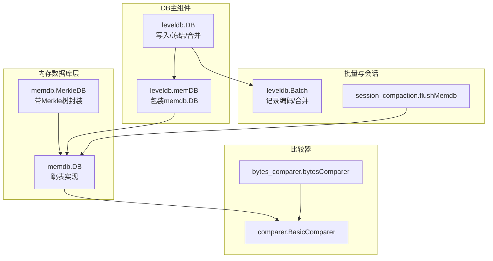
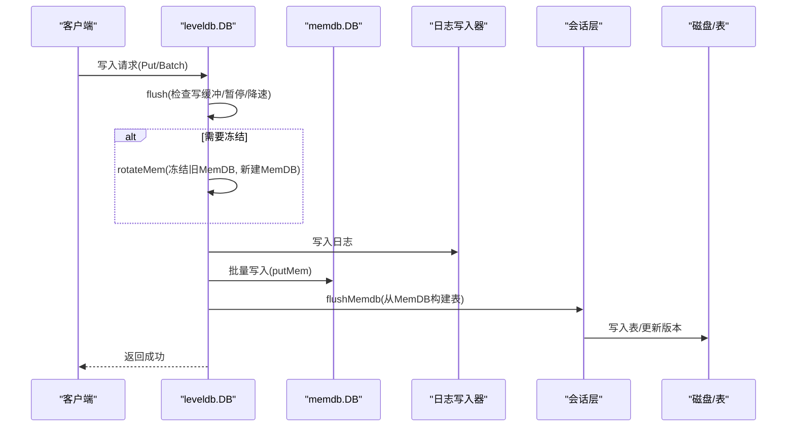
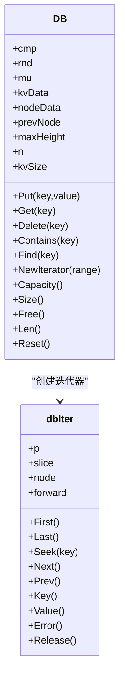
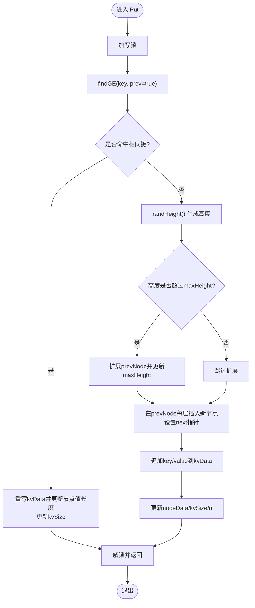
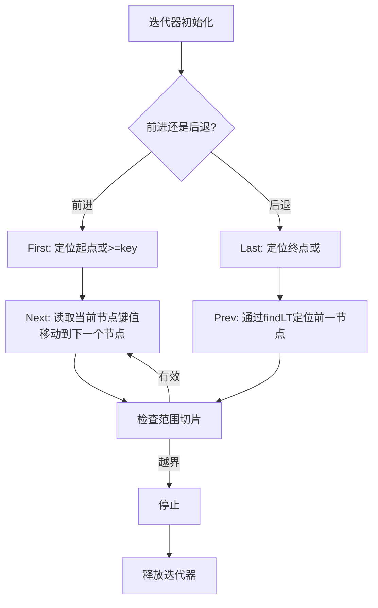
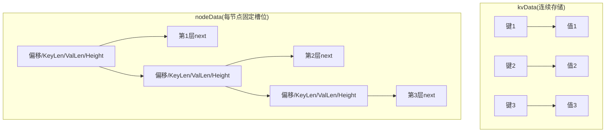
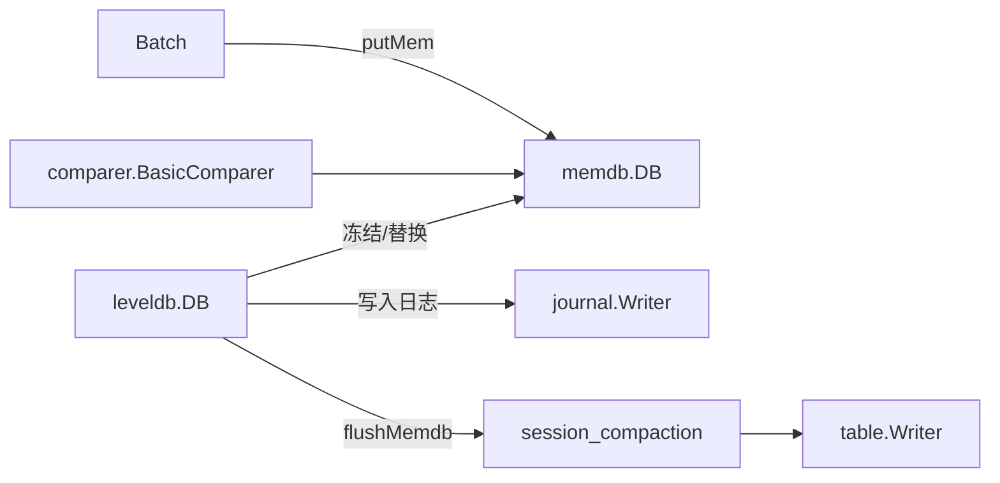

# MemDB组件

<cite>
**本文引用的文件列表**
- [memdb.go](file://leveldb/memdb/memdb.go)
- [memdb_merkle.go](file://leveldb/memdb/memdb_merkle.go)
- [comparer.go](file://leveldb/comparer/comparer.go)
- [bytes_comparer.go](file://leveldb/comparer/bytes_comparer.go)
- [db.go](file://leveldb/db.go)
- [db_write.go](file://leveldb/db_write.go)
- [db_state.go](file://leveldb/db_state.go)
- [batch.go](file://leveldb/batch.go)
- [session_compaction.go](file://leveldb/session_compaction.go)
- [memdb_test.go](file://leveldb/memdb/memdb_test.go)
</cite>

## 目录
1. [简介](#简介)
2. [项目结构](#项目结构)
3. [核心组件](#核心组件)
4. [架构总览](#架构总览)
5. [详细组件分析](#详细组件分析)
6. [依赖关系分析](#依赖关系分析)
7. [性能考量](#性能考量)
8. [故障排查指南](#故障排查指南)
9. [结论](#结论)
10. [附录](#附录)

## 简介
本文件面向avccDB的MemDB组件，系统性阐述其作为内存数据库的实现方式，重点围绕memdb.DB结构体的跳表（Skip List）数据结构设计与核心方法，包括Put、Get、Delete、Contains、Capacity等，并结合与DB组件的交互（写入缓冲与冻结机制），说明其在数据库写入流程中的关键作用。文档同时提供内存布局与跳表结构示意，帮助读者理解其如何高效支持有序遍历与快速查找。

## 项目结构
MemDB位于leveldb/memdb目录，核心文件包括：
- memdb.go：实现跳表内存数据库的核心逻辑与迭代器
- memdb_merkle.go：在DB基础上扩展Merke树支持
- comparer与bytes_comparer：定义键比较接口及默认字节序比较器
- db.go、db_write.go、db_state.go：DB主组件及其写入、状态管理逻辑
- batch.go：批量写入与内部记录编码
- session_compaction.go：会话层对MemDB的flush与落盘流程
- memdb_test.go：MemDB功能与读写测试

图表来源
- [memdb.go](file://leveldb/memdb/memdb.go#L180-L210)
- [memdb_merkle.go](file://leveldb/memdb/memdb_merkle.go#L1-L40)
- [comparer.go](file://leveldb/comparer/comparer.go#L1-L58)
- [bytes_comparer.go](file://leveldb/comparer/bytes_comparer.go#L1-L52)
- [db.go](file://leveldb/db.go#L33-L98)
- [db_state.go](file://leveldb/db_state.go#L23-L49)
- [batch.go](file://leveldb/batch.go#L63-L100)
- [session_compaction.go](file://leveldb/session_compaction.go#L31-L46)

章节来源
- [memdb.go](file://leveldb/memdb/memdb.go#L1-L120)
- [db.go](file://leveldb/db.go#L33-L98)

## 核心组件
- memdb.DB：内存跳表数据库，提供并发安全的Put/Get/Delete/Contains/Find/迭代器等能力；内部以kvData连续存储键值，nodeData按节点组织跳表指针。
- memdb.MerkleDB：在DB之上增加Merkle树支持，提供根哈希计算与证明生成。
- 比较器：通过comparer.BasicComparer接口抽象键比较，bytes_comparer提供默认字节序比较。
- DB主组件：负责写入合并、冻结MemDB、写入缓冲管理、与会话层协作flush到磁盘。

章节来源
- [memdb.go](file://leveldb/memdb/memdb.go#L180-L210)
- [memdb_merkle.go](file://leveldb/memdb/memdb_merkle.go#L1-L40)
- [comparer.go](file://leveldb/comparer/comparer.go#L1-L58)
- [bytes_comparer.go](file://leveldb/comparer/bytes_comparer.go#L1-L52)
- [db.go](file://leveldb/db.go#L33-L98)

## 架构总览
MemDB在DB写入流程中扮演“写入缓冲”的角色：新写入的键值先写入当前MemDB，当容量不足或触发阈值时，DB会冻结当前MemDB并创建新的MemDB，同时将旧MemDB内容通过会话层flush到磁盘。MemDB还提供高效的有序遍历能力，支持范围切片与前向/后向移动。

图表来源
- [db_write.go](file://leveldb/db_write.go#L66-L131)
- [db_write.go](file://leveldb/db_write.go#L270-L330)
- [db_state.go](file://leveldb/db_state.go#L120-L159)
- [session_compaction.go](file://leveldb/session_compaction.go#L31-L46)

## 详细组件分析

### memdb.DB结构体与跳表设计
- 结构体字段与含义
  - cmp：键比较器，用于比较键大小，决定跳表层级与查找方向
  - rnd：随机数源，用于生成节点高度
  - mu：读写锁，保护并发访问
  - kvData：连续字节数组，顺序存储所有键值对
  - nodeData：节点元数据数组，每个节点包含：
    - [0] KV偏移：kvData中该节点键值起始位置
    - [1] Key长度：键长度
    - [2] Value长度：值长度
    - [3] Height：节点高度
    - [4..Height] Next指针：各层下一个节点索引
  - prevNode[tMaxHeight]：查找过程中的前驱节点缓存
  - maxHeight：当前跳表最大高度
  - n：节点数量
  - kvSize：已写入键值总长度（删除不回收缓冲）
- 跳表特性
  - 随机高度：通过randHeight生成，期望分叉概率控制层级分布
  - 层级查找：从最高层开始，沿next指针向右或向下移动
  - 迭代器：dbIter基于nodeData链路顺序遍历，支持范围切片

图表来源
- [memdb.go](file://leveldb/memdb/memdb.go#L180-L210)
- [memdb.go](file://leveldb/memdb/memdb.go#L28-L72)

章节来源
- [memdb.go](file://leveldb/memdb/memdb.go#L180-L210)
- [memdb.go](file://leveldb/memdb/memdb.go#L28-L72)

### 核心方法实现原理

#### Put(key, value)
- 并发：使用互斥锁保护
- 查找：findGE(key, prev=true)返回目标节点或插入点，并缓存每层前驱
- 更新：若存在相同键，直接重写kvData并更新节点值长度与kvSize
- 插入：若不存在，生成随机高度，扩展maxHeight（必要时），在prevNode每层上插入新节点，更新kvData与nodeData，维护kvSize与n

图表来源
- [memdb.go](file://leveldb/memdb/memdb.go#L273-L315)
- [memdb.go](file://leveldb/memdb/memdb.go#L201-L208)
- [memdb.go](file://leveldb/memdb/memdb.go#L210-L236)

章节来源
- [memdb.go](file://leveldb/memdb/memdb.go#L273-L315)
- [memdb.go](file://leveldb/memdb/memdb.go#L201-L208)
- [memdb.go](file://leveldb/memdb/memdb.go#L210-L236)

#### Get(key)
- 并发：使用读锁
- 查找：findGE(key, false)定位节点
- 返回：若命中，从kvData中提取键值；否则返回未找到错误

章节来源
- [memdb.go](file://leveldb/memdb/memdb.go#L351-L366)
- [memdb.go](file://leveldb/memdb/memdb.go#L210-L236)

#### Delete(key)
- 并发：使用写锁
- 查找：findGE(key, true)获取前驱
- 删除：若存在，遍历每层prevNode[i]的next指针，跳过被删除节点，更新kvSize与n；不回收kvData缓冲

章节来源
- [memdb.go](file://leveldb/memdb/memdb.go#L317-L339)
- [memdb.go](file://leveldb/memdb/memdb.go#L210-L236)

#### Contains(key)
- 并发：使用读锁
- 判断：调用findGE仅判断是否存在

章节来源
- [memdb.go](file://leveldb/memdb/memdb.go#L341-L349)
- [memdb.go](file://leveldb/memdb/memdb.go#L210-L236)

#### Capacity/Size/Free/Len/Reset
- Capacity：返回kvData容量
- Size：返回kvSize（已写入键值总长，删除不回收缓冲）
- Free：返回kvData剩余可写空间
- Len：返回节点数量
- Reset：重置DB至初始状态，复用缓冲

章节来源
- [memdb.go](file://leveldb/memdb/memdb.go#L411-L459)

### 迭代器与有序遍历
- dbIter：持有DB引用与当前节点索引，支持First/Last/Seek/Next/Prev
- 范围切片：通过util.Range限制遍历区间，迭代器在fill中根据比较器裁剪越界项
- 前向/后向：Next/Prev基于nodeData[nNext]链路移动，Prev通过findLT定位前一个节点

图表来源
- [memdb.go](file://leveldb/memdb/memdb.go#L61-L171)
- [memdb.go](file://leveldb/memdb/memdb.go#L238-L271)

章节来源
- [memdb.go](file://leveldb/memdb/memdb.go#L61-L171)
- [memdb.go](file://leveldb/memdb/memdb.go#L238-L271)

### 内存布局与跳表结构示意
- 内存布局
  - kvData：连续存储所有键值对，节点键值在kvData中连续存放
  - nodeData：每个节点占用若干整型槽位，前四个槽位为KV偏移、Key长度、Value长度、Height，随后为各层next指针
- 跳表结构
  - 从maxHeight层开始向下搜索，遇到比目标键小的节点则向右移动，否则向下移动
  - 插入时按随机高度在prevNode每层上建立连接

图表来源
- [memdb.go](file://leveldb/memdb/memdb.go#L188-L199)
- [memdb.go](file://leveldb/memdb/memdb.go#L210-L236)

## 依赖关系分析
- 比较器依赖
  - DB依赖comparer.BasicComparer进行键比较
  - bytes_comparer提供默认实现
- DB组件交互
  - DB持有memPool与mem/frozenMem，负责冻结与替换MemDB
  - 写入路径通过flush/rotateMem协调写缓冲与冻结
  - 会话层通过flushMemdb将MemDB内容落盘
- 批量写入
  - Batch记录编码后逐条put到MemDB，支持版本化键

图表来源
- [db.go](file://leveldb/db.go#L33-L98)
- [db_state.go](file://leveldb/db_state.go#L120-L159)
- [db_write.go](file://leveldb/db_write.go#L270-L330)
- [session_compaction.go](file://leveldb/session_compaction.go#L31-L46)
- [batch.go](file://leveldb/batch.go#L63-L100)
- [comparer.go](file://leveldb/comparer/comparer.go#L1-L58)

章节来源
- [db.go](file://leveldb/db.go#L33-L98)
- [db_state.go](file://leveldb/db_state.go#L23-L49)
- [db_write.go](file://leveldb/db_write.go#L66-L131)
- [session_compaction.go](file://leveldb/session_compaction.go#L31-L46)
- [batch.go](file://leveldb/batch.go#L63-L100)
- [comparer.go](file://leveldb/comparer/comparer.go#L1-L58)

## 性能考量
- 时间复杂度
  - 查找/插入/删除：平均O(log n)，最坏O(n)
  - 迭代：O(k)，k为遍历项数
- 空间复杂度
  - O(n)节点元数据，kvData按追加方式增长
- 内存管理
  - kvData追加增长，删除不回收缓冲，kvSize统计已写入总量
  - Reset可复用缓冲，避免频繁分配
- 并发
  - 读多写少场景下，读写锁提升吞吐
  - 迭代器非并发安全，但可多迭代器并发使用
- 写入节流
  - flush根据L0表数量与写缓冲空闲空间决定是否降速/暂停/冻结

章节来源
- [memdb.go](file://leveldb/memdb/memdb.go#L411-L459)
- [db_write.go](file://leveldb/db_write.go#L66-L131)
- [db_state.go](file://leveldb/db_state.go#L74-L96)

## 故障排查指南
- 常见错误
  - 未找到键：Get/Find/Contains返回未找到错误
  - 迭代器已释放：dbIter在释放后继续使用会报错
- 排查要点
  - 确认比较器一致性：不同比较器会导致键排序不一致
  - 检查迭代器生命周期：使用完毕需Release
  - 观察写入延迟：当L0表过多或写入过快时，DB会自动降速/暂停
- 单元测试参考
  - MemDB读写与查找测试覆盖了基本行为验证

章节来源
- [memdb.go](file://leveldb/memdb/memdb.go#L20-L25)
- [memdb_test.go](file://leveldb/memdb/memdb_test.go#L1-L134)
- [db_write.go](file://leveldb/db_write.go#L66-L131)

## 结论
MemDB以跳表为核心，结合紧凑的kvData与nodeData布局，在保证有序遍历的同时实现了高效的查找与插入。其与DB组件紧密协作，承担写入缓冲与冻结机制的关键职责，配合会话层完成从内存到磁盘的落盘流程。通过合理的并发控制与内存管理策略，MemDB在高并发写入场景下仍能保持良好的性能与稳定性。

## 附录
- MerkleDB扩展：在DB基础上增加Merkle树支持，提供根哈希与证明生成能力，适合需要数据完整性校验的应用场景
- 版本化写入：DB支持带版本号的Put，Batch也支持版本化记录编码，便于区块链等场景下的历史版本管理

章节来源
- [memdb_merkle.go](file://leveldb/memdb/memdb_merkle.go#L1-L181)
- [batch.go](file://leveldb/batch.go#L98-L136)
- [db.go](file://leveldb/db.go#L33-L98)