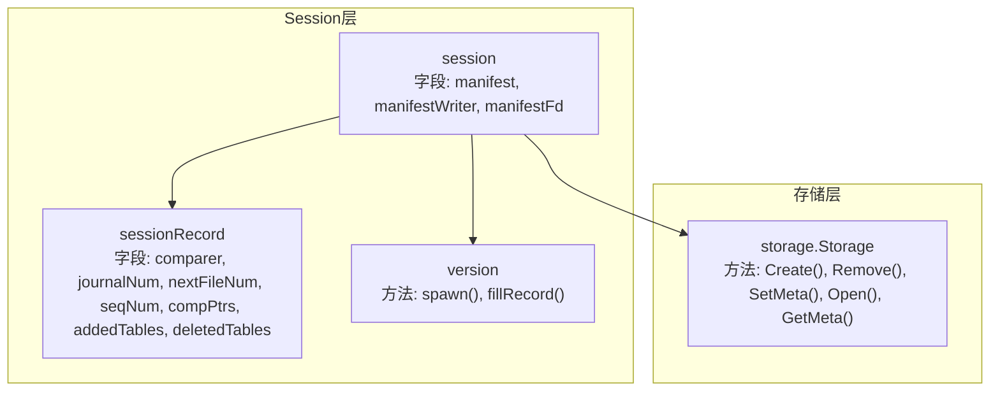
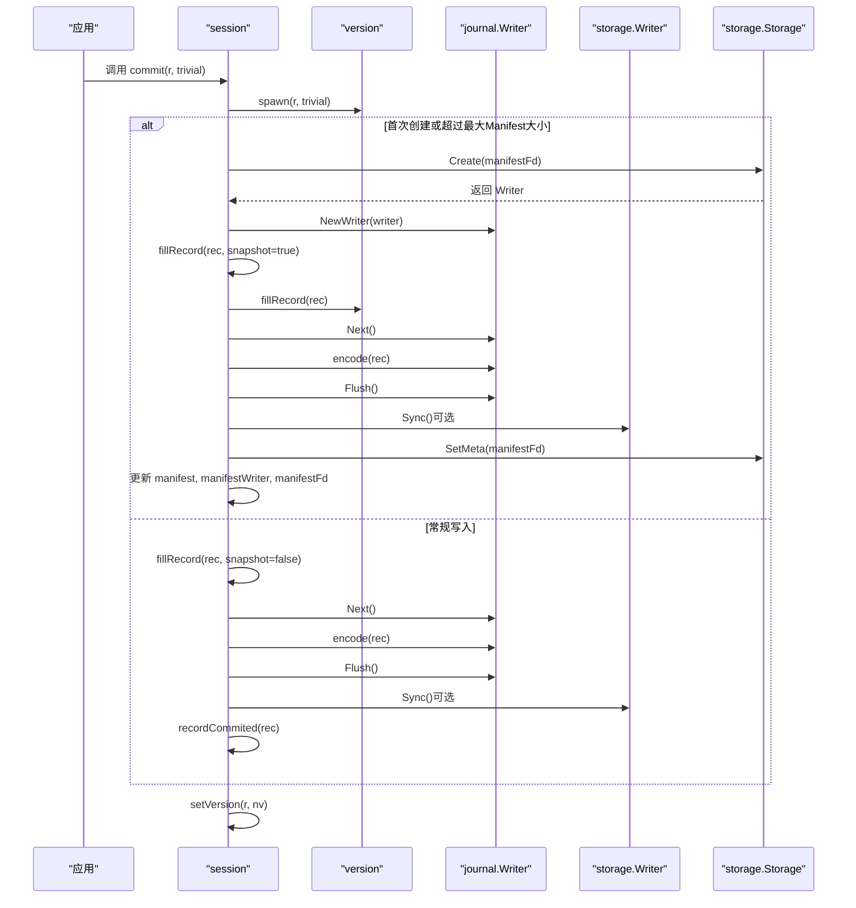
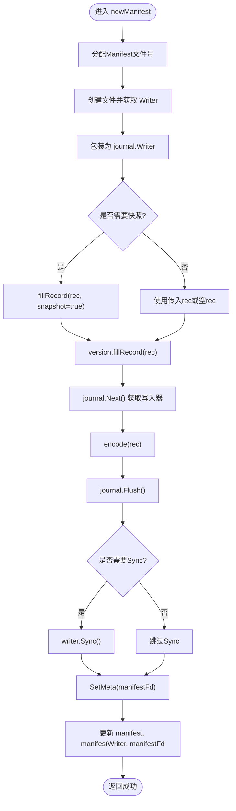
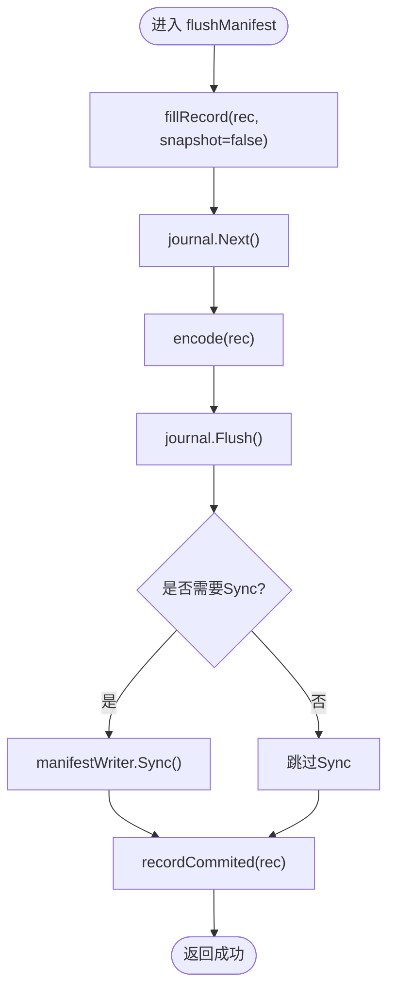
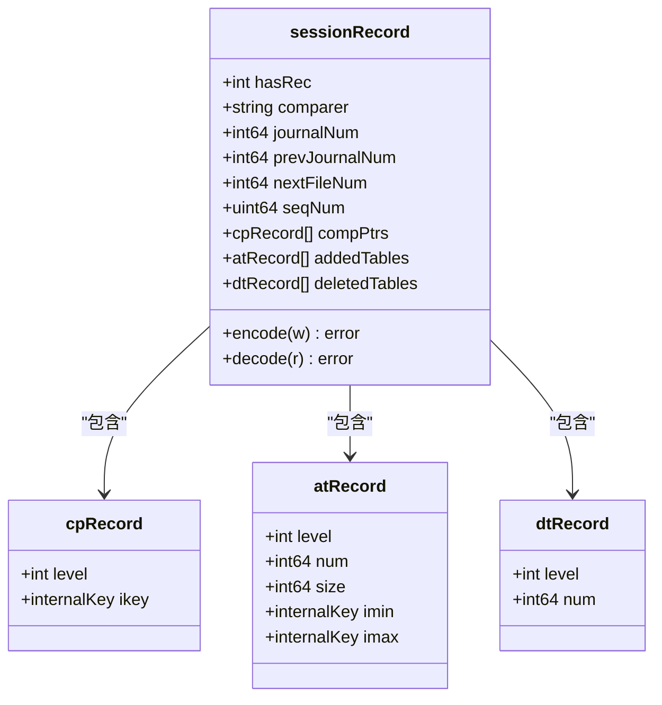
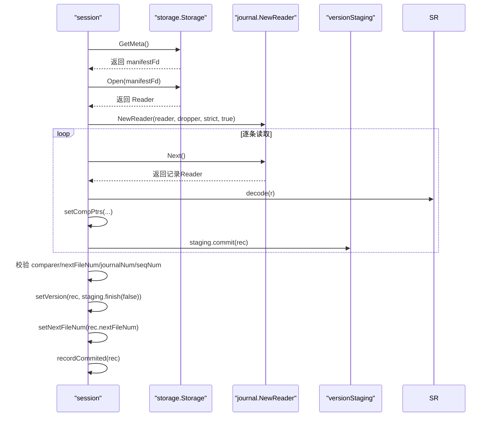
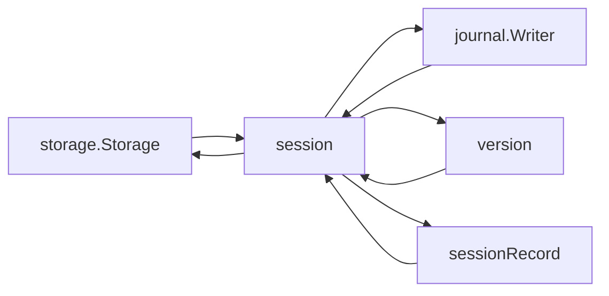

# Manifest管理

<cite>
**本文引用的文件**
- [session.go](file://leveldb/session.go)
- [session_util.go](file://leveldb/session_util.go)
- [session_record.go](file://leveldb/session_record.go)
- [version.go](file://leveldb/version.go)
- [storage.go](file://leveldb/storage/storage.go)
</cite>

## 目录
1. [简介](#简介)
2. [项目结构](#项目结构)
3. [核心组件](#核心组件)
4. [架构总览](#架构总览)
5. [详细组件分析](#详细组件分析)
6. [依赖关系分析](#依赖关系分析)
7. [性能考量](#性能考量)
8. [故障排查指南](#故障排查指南)
9. [结论](#结论)
10. [附录](#附录)

## 简介
本文件聚焦于avccDB的Session组件中Manifest（清单）管理机制，系统性阐述以下内容：
- Manifest、manifestWriter、manifestFd三个字段的实现与职责
- newManifest()与flushManifest()的工作流程：清单文件创建、记录写入、刷新与同步
- Manifest在数据库恢复中的关键作用，以及sessionRecord如何记录数据库元状态
- 提供Manifest写入流程图，展示从内存记录到磁盘持久化的完整过程
- 给出版本变更与数据库恢复场景下的代码示例路径，帮助定位实现细节

## 项目结构
Manifest管理涉及Session层与版本管理、存储抽象之间的协作：
- Session负责维护Manifest的生命周期与写入策略
- sessionRecord用于编码/解码Manifest中的元数据
- version负责生成快照并填充到sessionRecord中
- storage接口负责文件创建、删除、设置元文件等底层操作

图表来源
- [session.go](file://leveldb/session.go#L36-L68)
- [session_util.go](file://leveldb/session_util.go#L403-L491)
- [session_record.go](file://leveldb/session_record.go#L55-L132)
- [version.go](file://leveldb/version.go#L566-L583)
- [storage.go](file://leveldb/storage/storage.go#L140-L158)

章节来源
- [session.go](file://leveldb/session.go#L36-L68)
- [session_util.go](file://leveldb/session_util.go#L403-L491)
- [session_record.go](file://leveldb/session_record.go#L55-L132)
- [version.go](file://leveldb/version.go#L566-L583)
- [storage.go](file://leveldb/storage/storage.go#L140-L158)

## 核心组件
- Manifest相关字段
  - manifest：当前Manifest的journal.Writer，用于向Journal流写入记录
  - manifestWriter：当前Manifest对应的storage.Writer，用于最终Sync刷盘
  - manifestFd：当前Manifest文件的文件描述符（类型为Manifest）
- sessionRecord的作用
  - 记录数据库元状态：比较器名称、下一个文件号、日志文件号、序列号、各层级的压缩指针、新增/删除表文件等
  - 编码/解码：将内存中的元状态以可持久化格式写入或从Manifest读取
- 版本管理
  - version.fillRecord：将当前版本的表文件集合写入sessionRecord
  - version.spawn：基于当前版本与sessionRecord生成新版本

章节来源
- [session.go](file://leveldb/session.go#L36-L68)
- [session_record.go](file://leveldb/session_record.go#L55-L132)
- [version.go](file://leveldb/version.go#L566-L583)

## 架构总览
Manifest管理贯穿数据库创建、提交与恢复的关键路径：
- 创建数据库时，调用create()触发newManifest()创建首个Manifest并写入初始元数据
- 日常写入/合并后，commit()根据条件选择newManifest()或flushManifest()，并在成功后应用新版本
- 恢复数据库时，通过recover()读取Manifest并重建版本树与元状态

图表来源
- [session.go](file://leveldb/session.go#L210-L242)
- [session_util.go](file://leveldb/session_util.go#L403-L491)
- [version.go](file://leveldb/version.go#L566-L583)

## 详细组件分析

### 字段与职责：manifest、manifestWriter、manifestFd
- manifest：指向当前Manifest的journal.Writer，负责将编码后的记录写入Journal流
- manifestWriter：指向当前Manifest的storage.Writer，负责最终调用Sync确保落盘
- manifestFd：当前Manifest文件的文件描述符，用于SetMeta标记元文件，便于后续恢复

章节来源
- [session.go](file://leveldb/session.go#L36-L68)

### 方法工作流：newManifest()
newManifest()用于创建新的Manifest文件并写入初始元数据：
- 分配新的Manifest文件号，创建文件并包装为journal.Writer
- 若未传入rec则构造空记录；若未传入v则取当前版本
- fillRecord(rec, snapshot=true)填充比较器、下一个文件号、当前日志号、序列号、压缩指针等
- version.fillRecord(rec)将当前版本的表文件集合写入记录
- 写入journal：Next()获取写入器，encode(rec)，Flush()确保缓冲区写入
- 可选Sync()保证持久化
- SetMeta()将该Manifest标记为元文件
- 成功后更新manifest、manifestWriter、manifestFd；失败则清理临时文件并回退文件号

图表来源
- [session_util.go](file://leveldb/session_util.go#L403-L466)

章节来源
- [session_util.go](file://leveldb/session_util.go#L403-L466)

### 方法工作流：flushManifest()
flushManifest()用于向现有Manifest追加一条记录：
- fillRecord(rec, snapshot=false)仅填充本次变更所需的元数据
- journal.Next()获取写入器，encode(rec)，journal.Flush()确保缓冲区写入
- 可选Sync()保证持久化
- recordCommited(rec)更新会话内部状态（如日志号、序列号、压缩指针）

图表来源
- [session_util.go](file://leveldb/session_util.go#L468-L491)

章节来源
- [session_util.go](file://leveldb/session_util.go#L468-L491)

### 数据模型：sessionRecord
sessionRecord承载Manifest中的所有元数据字段，并提供编码/解码能力：
- 字段：比较器名称、日志文件号、前一个日志文件号、下一个文件号、序列号、压缩指针列表、新增表文件列表、删除表文件列表
- 编码：按字段顺序写入类型标识与值，支持变长整数与字节序列
- 解码：从流中读取类型标识，解析对应字段，错误时封装为“Manifest损坏”错误

图表来源
- [session_record.go](file://leveldb/session_record.go#L37-L132)
- [session_record.go](file://leveldb/session_record.go#L159-L323)

章节来源
- [session_record.go](file://leveldb/session_record.go#L37-L132)
- [session_record.go](file://leveldb/session_record.go#L159-L323)

### Manifest在数据库恢复中的作用
- 恢复入口：recover()通过storage.GetMeta()定位Manifest文件
- 读取与重建：使用journal.NewReader逐条读取记录，decode()解析为sessionRecord
- 校验与应用：对比较器、下一个文件号、日志文件号、序列号进行校验；将记录提交到versionStaging并完成版本切换
- 元状态恢复：recordCommited()更新会话内部状态（日志号、序列号、压缩指针）

图表来源
- [session.go](file://leveldb/session.go#L128-L208)
- [session_util.go](file://leveldb/session_util.go#L1-L35)

章节来源
- [session.go](file://leveldb/session.go#L128-L208)
- [session_util.go](file://leveldb/session_util.go#L1-L35)

### 版本变更与Manifest写入的关系
- commit()在每次写入/合并后调用，决定是新建Manifest还是追加记录
- 当manifest为空或超过最大Manifest大小阈值时，调用newManifest()创建新清单
- 否则调用flushManifest()追加记录
- 成功后通过setVersion()应用新版本，使文件引用与版本树保持一致

章节来源
- [session.go](file://leveldb/session.go#L210-L242)
- [session_util.go](file://leveldb/session_util.go#L403-L491)
- [version.go](file://leveldb/version.go#L566-L583)

## 依赖关系分析
- Session对storage的依赖：创建/删除/设置元文件、打开/读取Manifest
- Session对journal的依赖：封装Manifest为Journal流，提供Next()/Flush()/Size()等能力
- Session对version的依赖：生成新版本、填充记录
- Session对sessionRecord的依赖：编码/解码元数据

图表来源
- [session.go](file://leveldb/session.go#L210-L242)
- [session_util.go](file://leveldb/session_util.go#L403-L491)
- [session_record.go](file://leveldb/session_record.go#L159-L323)
- [version.go](file://leveldb/version.go#L566-L583)
- [storage.go](file://leveldb/storage/storage.go#L140-L158)

章节来源
- [session.go](file://leveldb/session.go#L210-L242)
- [session_util.go](file://leveldb/session_util.go#L403-L491)
- [session_record.go](file://leveldb/session_record.go#L159-L323)
- [version.go](file://leveldb/version.go#L566-L583)
- [storage.go](file://leveldb/storage/storage.go#L140-L158)

## 性能考量
- Journal缓冲与Flush：flushManifest()在每次写入后Flush，避免频繁落盘导致的延迟抖动
- 可选Sync：当配置NoSync=true时跳过Sync，提高吞吐但牺牲掉电一致性
- Manifest大小阈值：当manifest.Size()达到最大阈值时触发newManifest()，减少单个Manifest过大带来的读写压力
- 文件号分配：通过原子操作分配/重用文件号，避免并发冲突

章节来源
- [session_util.go](file://leveldb/session_util.go#L468-L491)
- [session.go](file://leveldb/session.go#L226-L234)

## 故障排查指南
- Manifest损坏错误：ErrManifestCorrupted用于标识字段缺失或不匹配，recover()在严格模式下直接报错
- 恢复失败排查：
  - 确认storage.GetMeta()返回的文件类型为Manifest且编号正确
  - 检查journal.NewReader的strict参数与dropper回调是否正确处理损坏项
  - 校验比较器名称、下一个文件号、日志文件号、序列号是否满足约束
- 写入失败排查：
  - 检查journal.Next()/encode()/Flush()链路是否成功
  - 若启用Sync，确认writer.Sync()未返回错误
  - 失败时newManifest()会清理临时文件并回退文件号，避免脏文件残留

章节来源
- [session.go](file://leveldb/session.go#L21-L35)
- [session.go](file://leveldb/session.go#L128-L208)
- [session_util.go](file://leveldb/session_util.go#L403-L466)

## 结论
Manifest是avccDB数据库元状态与版本演进的唯一真相来源。Session通过newManifest()与flushManifest()实现了对Manifest的可靠创建与增量写入，结合sessionRecord的编码/解码能力，确保了数据库在崩溃后能够准确恢复到一致状态。通过合理的Sync策略与大小阈值控制，系统在可靠性与性能之间取得平衡。

## 附录
- 示例路径（不展示具体代码内容，仅给出定位）：
  - 创建数据库并写入首个Manifest：[session.go](file://leveldb/session.go#L122-L127)
  - 追加记录到现有Manifest：[session_util.go](file://leveldb/session_util.go#L468-L491)
  - 新建Manifest并写入初始元数据：[session_util.go](file://leveldb/session_util.go#L403-L466)
  - 从Manifest恢复数据库：[session.go](file://leveldb/session.go#L128-L208)
  - 将当前版本表文件写入sessionRecord：[version.go](file://leveldb/version.go#L577-L583)
  - 设置/获取元文件（CURRENT）：[storage.go](file://leveldb/storage/storage.go#L150-L158)