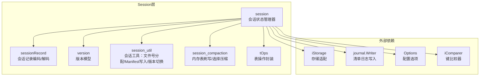
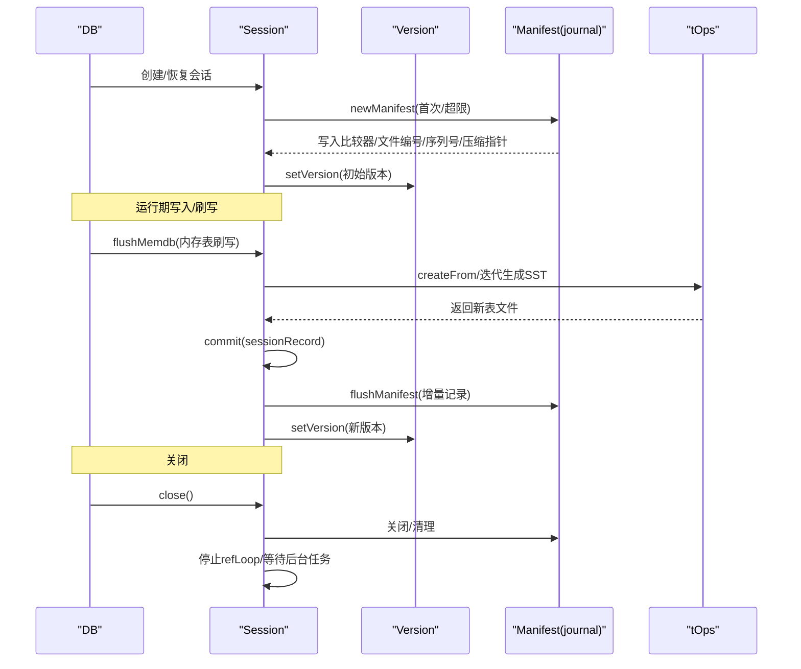
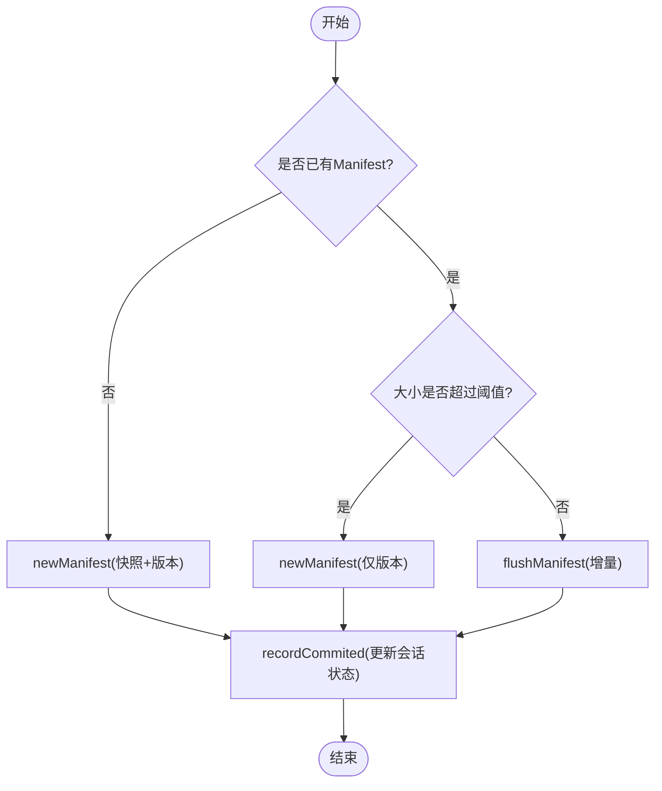
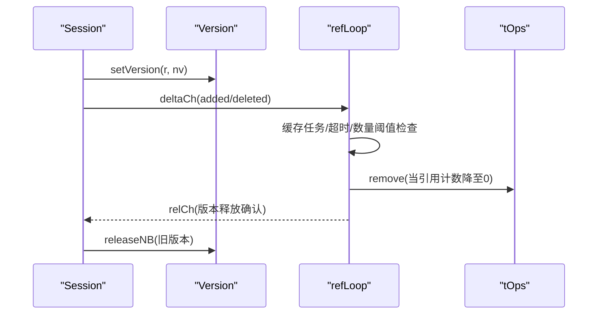
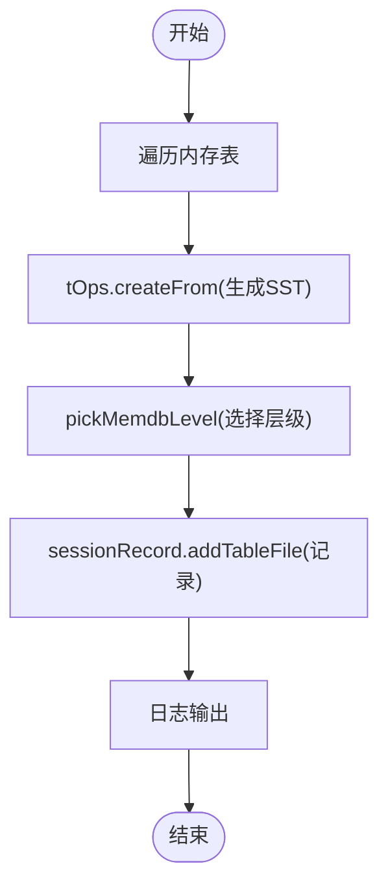
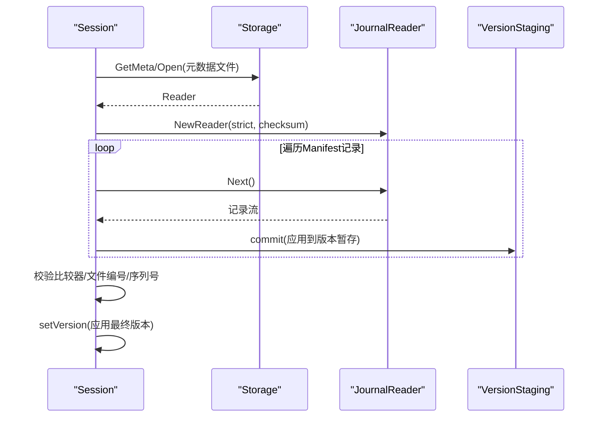
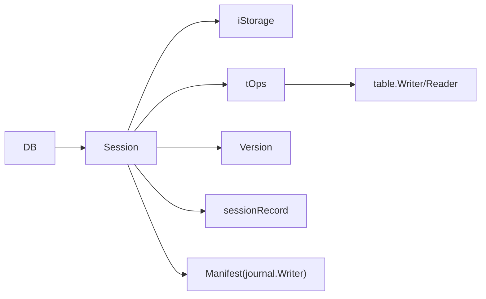

# Session组件

<cite>
**本文引用的文件**
- [session.go](file://leveldb/session.go)
- [session_util.go](file://leveldb/session_util.go)
- [session_compaction.go](file://leveldb/session_compaction.go)
- [session_record.go](file://leveldb/session_record.go)
- [version.go](file://leveldb/version.go)
- [table.go](file://leveldb/table.go)
- [db.go](file://leveldb/db.go)
</cite>

## 目录
1. [简介](#简介)
2. [项目结构](#项目结构)
3. [核心组件](#核心组件)
4. [架构总览](#架构总览)
5. [详细组件分析](#详细组件分析)
6. [依赖关系分析](#依赖关系分析)
7. [性能考量](#性能考量)
8. [故障排查指南](#故障排查指南)
9. [结论](#结论)

## 简介
本文件面向avccDB的Session组件，系统性阐述其作为数据库会话状态管理器的设计与实现。重点覆盖以下方面：
- 结构体字段语义：stNextFileNum（文件编号）、stor（存储接口）、o（配置选项）、icmp（比较器）、tops（表操作）、manifest（清单日志）以及版本管理相关字段
- 元数据与文件列表管理、版本控制与后台任务调度
- 核心方法：create、close、commit、flushMemdb 的实现流程与与Manifest交互机制
- 生命周期与事件处理流程：启动、运行、关闭阶段的职责划分与协作

## 项目结构
Session位于leveldb子模块中，围绕“会话状态”组织核心逻辑，通过与存储层、表操作层、版本管理层协同工作，完成数据库的持久化、版本演进与后台清理。

图表来源
- [session.go](file://leveldb/session.go#L36-L67)
- [session_util.go](file://leveldb/session_util.go#L360-L380)
- [session_compaction.go](file://leveldb/session_compaction.go#L30-L52)
- [version.go](file://leveldb/version.go#L26-L43)
- [table.go](file://leveldb/table.go#L348-L370)

章节来源
- [session.go](file://leveldb/session.go#L36-L67)
- [session_util.go](file://leveldb/session_util.go#L360-L380)
- [session_compaction.go](file://leveldb/session_compaction.go#L30-L52)
- [version.go](file://leveldb/version.go#L26-L43)
- [table.go](file://leveldb/table.go#L348-L370)

## 核心组件
- session：会话状态管理器，负责文件编号、日志/清单、版本切换、后台引用计数循环、Manifest写入与恢复等
- sessionRecord：会话记录，用于Manifest的编码/解码，承载比较器、文件编号、序列号、压缩指针、新增/删除表等元信息
- version：版本模型，维护层级表集合、压缩分数与指针、引用计数、版本生成与合并
- tOps：表操作封装，负责表的创建、迭代、查找、移除、缓存与同步策略
- session_util：会话工具集，包括文件号分配/回收、Manifest创建/刷新、版本切换、引用计数循环等
- session_compaction：会话级压缩辅助，包括内存表刷写到表、压缩选择与范围扩展

章节来源
- [session.go](file://leveldb/session.go#L36-L67)
- [session_record.go](file://leveldb/session_record.go#L55-L68)
- [version.go](file://leveldb/version.go#L26-L43)
- [table.go](file://leveldb/table.go#L348-L370)
- [session_util.go](file://leveldb/session_util.go#L360-L380)
- [session_compaction.go](file://leveldb/session_compaction.go#L30-L52)

## 架构总览
Session是数据库启动与运行期间的核心协调者，贯穿以下关键路径：
- 启动阶段：创建或恢复会话，初始化版本、Manifest，加载比较器与配置
- 运行阶段：接收写入/刷写请求，将内存表刷写为SST文件，更新版本，必要时触发压缩
- 关闭阶段：安全关闭Manifest与后台任务，释放资源

图表来源
- [session.go](file://leveldb/session.go#L122-L125)
- [session_util.go](file://leveldb/session_util.go#L403-L466)
- [session_util.go](file://leveldb/session_util.go#L468-L490)
- [session_util.go](file://leveldb/session_util.go#L266-L295)
- [session_compaction.go](file://leveldb/session_compaction.go#L30-L52)
- [version.go](file://leveldb/version.go#L566-L575)

## 详细组件分析

### Session结构体与字段语义
- stNextFileNum：当前未使用的文件编号，原子递增分配；用于SST/Journal/Manifest/临时文件命名
- stJournalNum/stPrevJournalNum：当前与前一Journal文件编号；stPrevJournalNum保留兼容性
- stTempFileNum：临时文件编号，用于重建/重命名过程
- stSeqNum：最近一次被压缩的序列号，用于写入顺序一致性
- stor/storLock：存储适配与锁，确保并发安全
- o：缓存后的Options，提供压缩、缓冲区、同步等配置
- icmp：内部键比较器，统一用户键比较与排序
- tops：表操作封装，负责表的创建、迭代、查找、移除与缓存
- manifest/manifestWriter/manifestFd：Manifest日志写入器与当前文件描述符
- stCompPtrs：各层级压缩指针，指示下一次压缩起点
- stVersion/ntVersionID/vmu：当前版本对象、下一个版本ID、版本互斥锁
- refCh/relCh/deltaCh/abandon/closeC/closeW：后台引用计数循环通道与关闭信号
- fileRefCh：测试用通道，导出当前文件引用统计

章节来源
- [session.go](file://leveldb/session.go#L36-L67)

### Manifest与会话记录
- sessionRecord：定义了Manifest记录的字段位掩码与编码/解码流程，包含比较器名称、文件编号、序列号、压缩指针、新增/删除表等
- newManifest：创建新的Manifest文件，写入快照状态（比较器、文件编号、序列号、压缩指针），并设置为当前Manifest
- flushManifest：向现有Manifest追加增量记录，支持可选同步

图表来源
- [session_util.go](file://leveldb/session_util.go#L403-L466)
- [session_util.go](file://leveldb/session_util.go#L468-L490)
- [session_util.go](file://leveldb/session_util.go#L383-L402)

章节来源
- [session_record.go](file://leveldb/session_record.go#L24-L35)
- [session_record.go](file://leveldb/session_record.go#L159-L196)
- [session_record.go](file://leveldb/session_record.go#L258-L323)
- [session_util.go](file://leveldb/session_util.go#L403-L466)
- [session_util.go](file://leveldb/session_util.go#L468-L490)
- [session_util.go](file://leveldb/session_util.go#L383-L402)

### 版本管理与后台引用计数循环
- version：维护层级表集合、压缩分数与指针、引用计数；提供spawn/newStaging/fillRecord等能力
- setVersion：切换当前版本，发送delta变更给refLoop，先持有新版本再释放旧版本，保证文件生命周期安全
- refLoop：严格按版本ID顺序处理引用/释放任务，支持delta批量优化与超时/数量阈值保护，避免阻塞

图表来源
- [version.go](file://leveldb/version.go#L566-L575)
- [session_util.go](file://leveldb/session_util.go#L266-L295)
- [session_util.go](file://leveldb/session_util.go#L70-L116)
- [session_util.go](file://leveldb/session_util.go#L116-L184)

章节来源
- [version.go](file://leveldb/version.go#L26-L43)
- [version.go](file://leveldb/version.go#L566-L575)
- [session_util.go](file://leveldb/session_util.go#L266-L295)
- [session_util.go](file://leveldb/session_util.go#L70-L116)
- [session_util.go](file://leveldb/session_util.go#L116-L184)

### 文件编号与分配/回收
- allocFileNum/reuseFileNum/markFileNum：原子递增分配、回收与标记最大使用编号，确保文件编号唯一且不回退
- newTemp：临时文件编号分配，用于重建/重命名过程

章节来源
- [session_util.go](file://leveldb/session_util.go#L318-L337)
- [session_util.go](file://leveldb/session_util.go#L321-L337)
- [session_util.go](file://leveldb/session_util.go#L307-L319)
- [session_util.go](file://leveldb/session_util.go#L38-L41)

### 内存表刷写到SST（flushMemdb）
- flushMemdb：从内存表迭代生成有序SST，选择落盘层级，记录到sessionRecord，并写入日志与Manifest
- pickMemdbLevel：根据键范围与层级约束选择落盘层级，避免压缩问题

图表来源
- [session_compaction.go](file://leveldb/session_compaction.go#L30-L52)
- [table.go](file://leveldb/table.go#L358-L370)

章节来源
- [session_compaction.go](file://leveldb/session_compaction.go#L30-L52)
- [table.go](file://leveldb/table.go#L358-L370)

### 会话创建与恢复
- create：创建新的Manifest文件，写入初始状态
- recover：打开元数据文件，逐条读取Manifest记录，应用到版本暂存，校验比较器与关键字段，最终设置当前版本与文件编号

图表来源
- [session.go](file://leveldb/session.go#L122-L125)
- [session.go](file://leveldb/session.go#L128-L208)
- [session_record.go](file://leveldb/session_record.go#L258-L323)

章节来源
- [session.go](file://leveldb/session.go#L122-L125)
- [session.go](file://leveldb/session.go#L128-L208)
- [session_record.go](file://leveldb/session_record.go#L258-L323)

### 关闭流程
- close：关闭tOps、Manifest、设置closing版本、关闭后台refLoop并等待退出

章节来源
- [session.go](file://leveldb/session.go#L99-L114)

## 依赖关系分析
- Session依赖存储层（iStorage）进行文件创建/打开/删除/重命名与元数据设置
- Session通过tOps访问表层能力，包括表创建、迭代、查找与移除
- Session与Version紧密耦合：setVersion负责版本切换与引用计数；Version提供spawn/newStaging/fillRecord等
- Session与Manifest交互：newManifest/flushManifest负责记录快照与增量写入
- Session与DB协作：DB在写入/刷写后调用Session的flushMemdb与commit，驱动版本演进

图表来源
- [db.go](file://leveldb/db.go#L100-L175)
- [session.go](file://leveldb/session.go#L36-L67)
- [session_util.go](file://leveldb/session_util.go#L403-L466)
- [version.go](file://leveldb/version.go#L566-L575)
- [table.go](file://leveldb/table.go#L348-L370)

章节来源
- [db.go](file://leveldb/db.go#L100-L175)
- [session.go](file://leveldb/session.go#L36-L67)
- [session_util.go](file://leveldb/session_util.go#L403-L466)
- [version.go](file://leveldb/version.go#L566-L575)
- [table.go](file://leveldb/table.go#L348-L370)

## 性能考量
- 引用计数循环采用delta批处理与超时/数量阈值，避免长时间阻塞与频繁全量引用计算
- Manifest写入支持阈值触发新建文件，减少单文件过大带来的读写压力
- 表操作层具备文件/块缓存与缓冲池，降低I/O开销
- 版本暂存与spawn机制，减少版本切换时的拷贝成本

[本节为通用指导，无需列出具体文件来源]

## 故障排查指南
- Manifest损坏：ErrManifestCorrupted错误包装，定位字段与原因；可通过Recover流程重建
- Journal损坏：journal.Reader在严格模式下会跳过或报错；必要时清理旧Journal并重新刷写
- 文件编号冲突：确保stNextFileNum正确分配与回收，避免重复使用
- 版本切换异常：检查setVersion前后引用计数与delta通道是否正常传递

章节来源
- [session.go](file://leveldb/session.go#L21-L35)
- [session.go](file://leveldb/session.go#L128-L208)
- [session_util.go](file://leveldb/session_util.go#L468-L490)

## 结论
Session组件以“会话状态管理器”的角色，串联起存储、表操作、版本与Manifest等核心模块，承担数据库启动/运行/关闭全过程中的状态协调与持久化职责。通过严格的版本切换、Manifest记录与后台引用计数循环，Session确保了元数据一致性与文件生命周期安全，同时兼顾性能与可维护性。