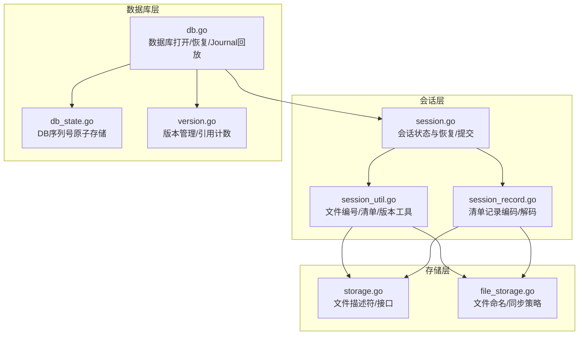
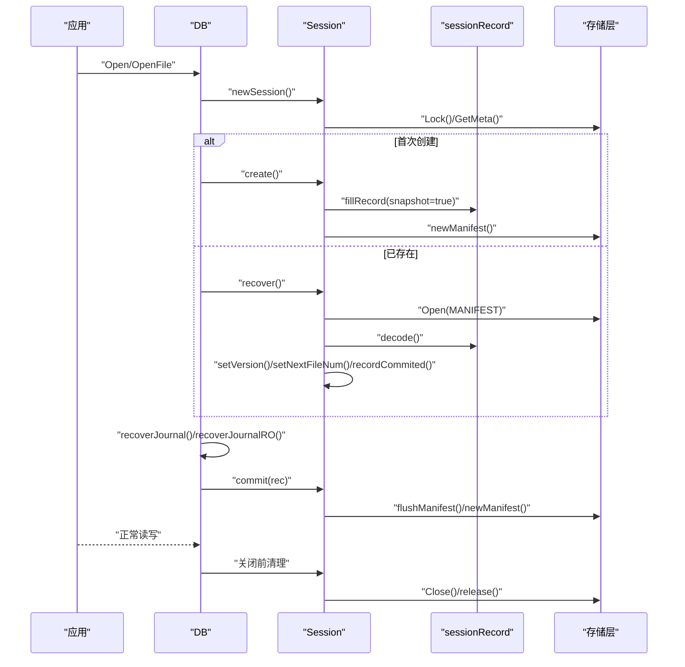
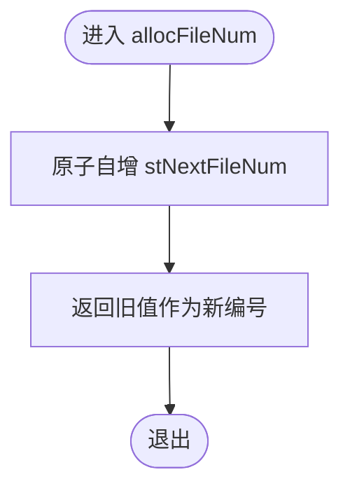
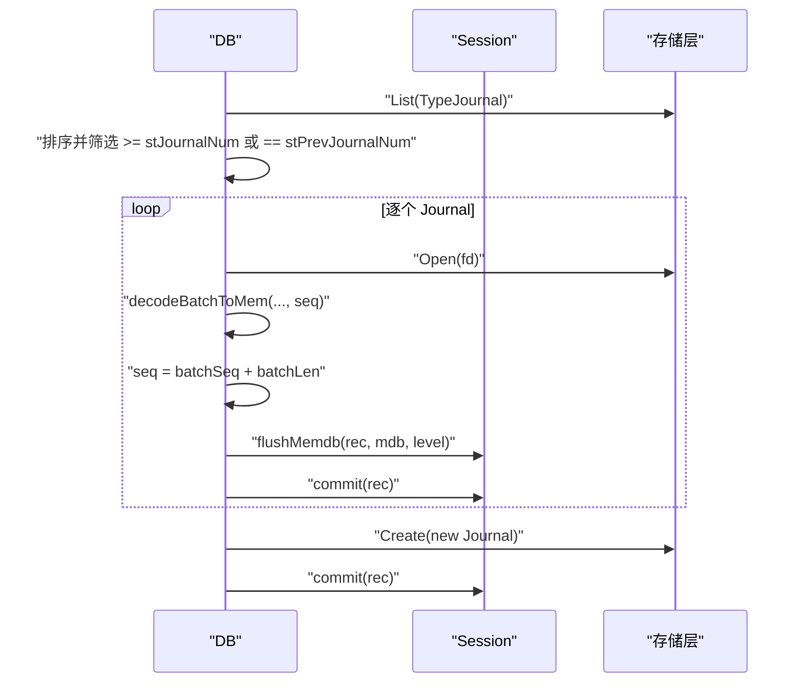
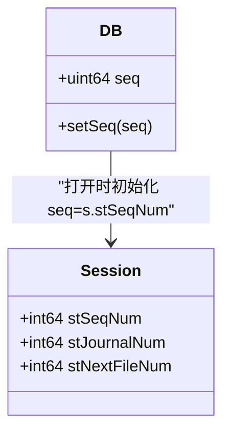
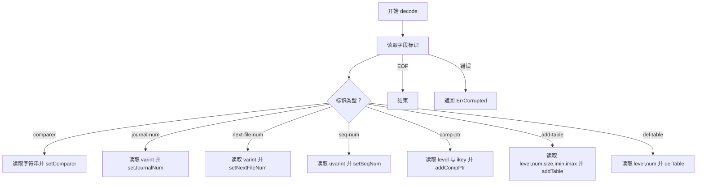
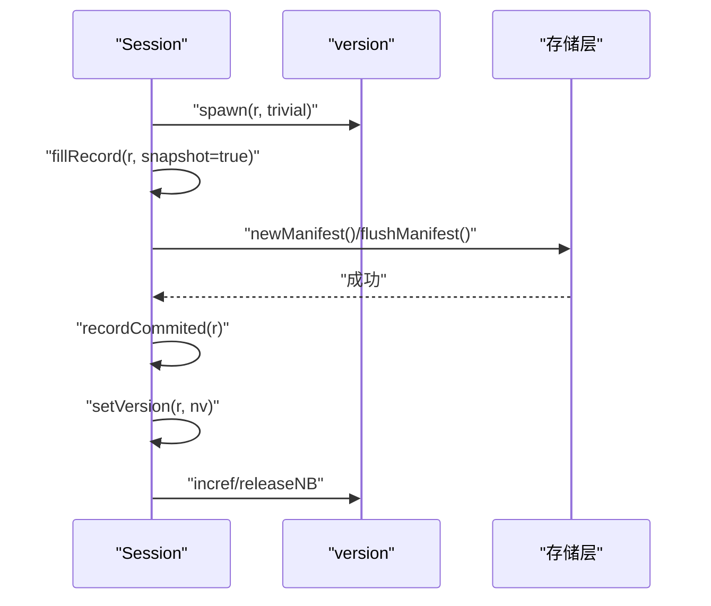
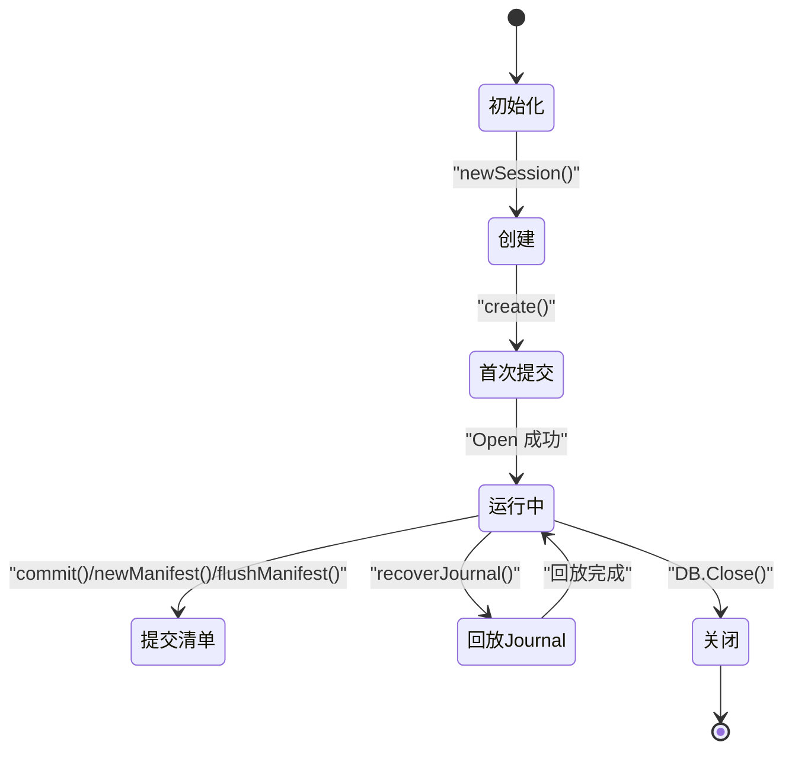
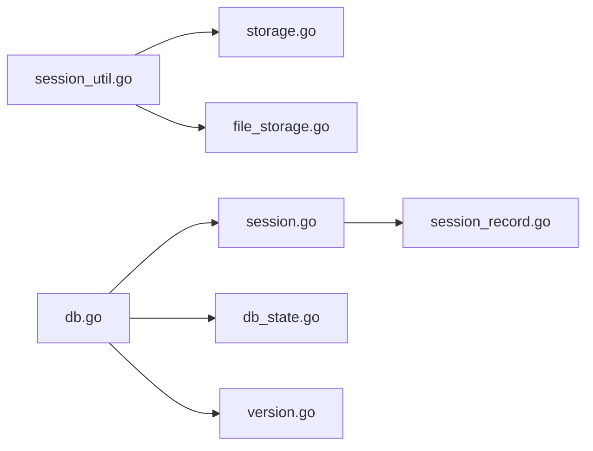

# 元数据管理

<cite>
**本文引用的文件**
- [session.go](file://leveldb/session.go)
- [session_util.go](file://leveldb/session_util.go)
- [session_record.go](file://leveldb/session_record.go)
- [db.go](file://leveldb/db.go)
- [db_state.go](file://leveldb/db_state.go)
- [version.go](file://leveldb/version.go)
- [storage.go](file://leveldb/storage/storage.go)
- [file_storage.go](file://leveldb/storage/file_storage.go)
</cite>

## 目录
1. [简介](#简介)
2. [项目结构](#项目结构)
3. [核心组件](#核心组件)
4. [架构总览](#架构总览)
5. [详细组件分析](#详细组件分析)
6. [依赖关系分析](#依赖关系分析)
7. [性能考量](#性能考量)
8. [故障排查指南](#故障排查指南)
9. [结论](#结论)
10. [附录](#附录)

## 简介
本文件围绕 avccDB 的 Session 组件，系统性阐述其元数据管理机制，重点聚焦于以下核心字段：
- stNextFileNum：当前未使用的文件编号（用于分配新文件名）
- stJournalNum：当前日志文件编号（外部同步）
- stSeqNum：最后已压缩的序列号（外部同步）

文档将从设计目标、实现细节、并发安全、生命周期与持久化策略等方面进行深入解析，并通过流程图与类图帮助读者理解元数据在数据库创建、运行与关闭过程中的流转与一致性保障。

## 项目结构
与元数据管理直接相关的核心模块如下：
- session.go：会话状态定义与恢复/提交流程
- session_util.go：文件编号分配、版本切换、清单写入等工具方法
- session_record.go：清单记录编码/解码，包含 next-file-num、journal-file-num、seq-num 等字段
- db.go：数据库打开/恢复流程，与 Journal 恢复、序列号维护密切相关
- db_state.go：DB 层对序列号的原子存储封装
- version.go：版本管理与引用计数，影响元数据的可见性与落盘时机
- storage.go / file_storage.go：存储抽象与文件命名、同步策略

图表来源
- [session.go](file://leveldb/session.go#L36-L115)
- [session_util.go](file://leveldb/session_util.go#L297-L466)
- [session_record.go](file://leveldb/session_record.go#L24-L68)
- [db.go](file://leveldb/db.go#L100-L175)
- [db_state.go](file://leveldb/db_state.go#L59-L96)
- [version.go](file://leveldb/version.go#L26-L90)
- [storage.go](file://leveldb/storage/storage.go#L100-L118)
- [file_storage.go](file://leveldb/storage/file_storage.go#L591-L604)

章节来源
- [session.go](file://leveldb/session.go#L36-L115)
- [session_util.go](file://leveldb/session_util.go#L297-L466)
- [session_record.go](file://leveldb/session_record.go#L24-L68)
- [db.go](file://leveldb/db.go#L100-L175)
- [db_state.go](file://leveldb/db_state.go#L59-L96)
- [version.go](file://leveldb/version.go#L26-L90)
- [storage.go](file://leveldb/storage/storage.go#L100-L118)
- [file_storage.go](file://leveldb/storage/file_storage.go#L591-L604)

## 核心组件
- stNextFileNum：64 位无符号整型，记录“下一个可用文件编号”。通过原子操作提供线程安全的读取与分配。
- stJournalNum：64 位有符号整型，记录当前日志文件编号；需要外部同步（例如在 Journal 回放或创建新 Journal 时）。
- stSeqNum：64 位无符号整型，记录“最后已压缩的序列号”；需要外部同步（例如在 Journal 回放或提交时）。
- sessionRecord：清单记录对象，负责将上述元数据编码到 MANIFEST 日志中，并在恢复时解码回内存。
- DB 层 seq 字段：与 stSeqNum 对应，DB 打开时初始化为 s.stSeqNum，后续写入路径通过 DB 层原子存储更新。

章节来源
- [session.go](file://leveldb/session.go#L36-L68)
- [session_record.go](file://leveldb/session_record.go#L55-L68)
- [db.go](file://leveldb/db.go#L100-L127)
- [db_state.go](file://leveldb/db_state.go#L59-L63)

## 架构总览
下图展示了元数据在数据库生命周期内的关键交互点：创建、运行、恢复与关闭。

图表来源
- [db.go](file://leveldb/db.go#L177-L215)
- [session.go](file://leveldb/session.go#L122-L208)
- [session_util.go](file://leveldb/session_util.go#L404-L466)
- [session_record.go](file://leveldb/session_record.go#L159-L196)

## 详细组件分析

### 文件编号分配与并发安全（stNextFileNum）
- 分配策略
  - allocFileNum：使用原子自增，返回旧值作为新文件编号，确保全局唯一且无竞争冲突。
  - nextFileNum：原子读取当前“下一个可用编号”，用于快照写入清单。
  - setNextFileNum：原子设置“下一个可用编号”，通常在恢复阶段由清单中的 next-file-num 更新。
  - markFileNum：将“下一个可用编号”提升至大于等于给定编号+1，避免回放过程中重用已存在的编号。
  - reuseFileNum：当创建失败需要回滚时，将“下一个可用编号”回退到给定编号+1，保证幂等性。
- 并发安全
  - stNextFileNum 使用原子变量，所有读写均通过原子操作完成，无需额外互斥锁。
  - 多处调用方（创建 MANIFEST、创建 Journal、创建 Table）均通过 allocFileNum 获取编号，避免竞态。

图表来源
- [session_util.go](file://leveldb/session_util.go#L321-L337)
- [session_util.go](file://leveldb/session_util.go#L297-L306)

章节来源
- [session_util.go](file://leveldb/session_util.go#L297-L337)

### 日志序列管理（stJournalNum 与 Journal 回放）
- 设计要点
  - stJournalNum 记录当前日志文件编号，需要外部同步以保证在回放期间不被其他线程修改。
  - Journal 回放时，仅回放到 stJournalNum 或 stPrevJournalNum 对应的日志文件，确保只回放“未过期”的日志。
  - 回放完成后，创建新的 Journal 并提交，更新清单中的 journal-file-num 与 seq-num。
- 关键流程
  - recoverJournal：列出并排序 Journal，按编号选择待回放集合；逐个回放，必要时刷新 MemDB 并提交；最后移除过期 Journal。
  - recoverJournalRO：只读模式下的 Journal 回放，不创建新 Journal。
  - DB 打开后，DB.seq 初始化为 s.stSeqNum，随后根据回放进度递增。

图表来源
- [db.go](file://leveldb/db.go#L499-L666)
- [db.go](file://leveldb/db.go#L668-L767)
- [session_util.go](file://leveldb/session_util.go#L404-L466)

章节来源
- [db.go](file://leveldb/db.go#L499-L666)
- [db.go](file://leveldb/db.go#L668-L767)

### 操作序列号跟踪（stSeqNum 与 DB.seq）
- 设计要点
  - stSeqNum 保存“最后已压缩的序列号”，在恢复时从清单读取并设置。
  - DB 打开时，DB.seq 初始化为 s.stSeqNum，后续写入路径通过 DB 层原子存储更新。
  - Journal 回放时，每批批量写入都会更新 DB.seq，确保后续写入不会覆盖已回放的序列范围。
- 原子更新
  - setSeq：通过原子存储更新 DB.seq，保证多协程写入时的一致性。

图表来源
- [db.go](file://leveldb/db.go#L100-L127)
- [db_state.go](file://leveldb/db_state.go#L59-L63)
- [session.go](file://leveldb/session.go#L36-L68)

章节来源
- [db.go](file://leveldb/db.go#L100-L127)
- [db_state.go](file://leveldb/db_state.go#L59-L63)
- [session.go](file://leveldb/session.go#L36-L68)

### 清单记录编码/解码（sessionRecord）
- 字段与编码
  - 包含 comparer、journal-file-num、next-file-num、seq-num、comp-ptr、add-table、del-table 等。
  - encode：按字段顺序写入变长整型标识与对应值。
  - decode：按标识读取并填充对应字段，缺失或格式错误时返回错误。
- 在恢复与提交中的作用
  - recover：读取 MANIFEST 中的记录，校验关键字段是否存在，然后设置版本、文件编号与序列号。
  - commit/newManifest/flushManifest：在写入清单前填充当前状态（next/journal/seq），并在成功后调用 recordCommited 同步到会话状态。

图表来源
- [session_record.go](file://leveldb/session_record.go#L159-L196)
- [session_record.go](file://leveldb/session_record.go#L198-L323)
- [session.go](file://leveldb/session.go#L184-L208)

章节来源
- [session_record.go](file://leveldb/session_record.go#L24-L68)
- [session_record.go](file://leveldb/session_record.go#L159-L196)
- [session_record.go](file://leveldb/session_record.go#L198-L323)
- [session.go](file://leveldb/session.go#L184-L208)

### 版本管理与元数据可见性（version）
- 版本切换
  - setVersion：在提交新版本时，先持有新版本，再释放旧版本，确保文件引用计数正确过渡。
  - 通过 refCh/relCh 与 deltaCh 实现版本任务的有序处理，避免文件提前回收。
- 与元数据的关系
  - 新版本 spawn 时会填充清单记录，确保清单中包含当前 stNextFileNum/stJournalNum/stSeqNum 等状态。
  - recordCommited 将清单中的变更同步到会话状态，使后续操作可见。

图表来源
- [session_util.go](file://leveldb/session_util.go#L266-L295)
- [session_util.go](file://leveldb/session_util.go#L359-L401)
- [session_util.go](file://leveldb/session_util.go#L404-L466)
- [version.go](file://leveldb/version.go#L52-L83)

章节来源
- [session_util.go](file://leveldb/session_util.go#L266-L295)
- [session_util.go](file://leveldb/session_util.go#L359-L401)
- [session_util.go](file://leveldb/session_util.go#L404-L466)
- [version.go](file://leveldb/version.go#L52-L83)

### 元数据生命周期图
- 创建阶段
  - newSession：初始化存储锁、选项与表操作器，创建初始版本。
  - create：创建首个 MANIFEST，写入当前 stNextFileNum/stJournalNum/stSeqNum 快照。
- 运行阶段
  - 写入：分配新 Journal 编号，写入 Journal，必要时刷新 MemDB 并提交。
  - 提交：根据条件创建或刷新 MANIFEST，写入最新元数据。
- 关闭阶段
  - 关闭所有后台协程，释放存储锁，关闭 MANIFEST/Journal/表文件。

图表来源
- [session.go](file://leveldb/session.go#L70-L121)
- [session.go](file://leveldb/session.go#L122-L208)
- [session_util.go](file://leveldb/session_util.go#L404-L466)
- [db.go](file://leveldb/db.go#L177-L215)

章节来源
- [session.go](file://leveldb/session.go#L70-L121)
- [session.go](file://leveldb/session.go#L122-L208)
- [session_util.go](file://leveldb/session_util.go#L404-L466)
- [db.go](file://leveldb/db.go#L177-L215)

## 依赖关系分析
- 会话层依赖
  - session.go 依赖 session_record.go 进行清单记录的读写。
  - session_util.go 依赖 storage 接口进行文件创建、删除、重命名与同步。
- 数据库层依赖
  - db.go 依赖 session 进行恢复与提交，依赖 db_state.go 进行序列号原子存储。
- 存储层依赖
  - file_storage.go 对 MANIFEST 文件执行目录同步，确保落盘可靠性。

图表来源
- [session.go](file://leveldb/session.go#L36-L115)
- [session_record.go](file://leveldb/session_record.go#L24-L68)
- [session_util.go](file://leveldb/session_util.go#L404-L466)
- [storage.go](file://leveldb/storage/storage.go#L100-L118)
- [file_storage.go](file://leveldb/storage/file_storage.go#L591-L604)
- [db.go](file://leveldb/db.go#L100-L175)
- [db_state.go](file://leveldb/db_state.go#L59-L96)
- [version.go](file://leveldb/version.go#L26-L90)

章节来源
- [session.go](file://leveldb/session.go#L36-L115)
- [session_record.go](file://leveldb/session_record.go#L24-L68)
- [session_util.go](file://leveldb/session_util.go#L404-L466)
- [storage.go](file://leveldb/storage/storage.go#L100-L118)
- [file_storage.go](file://leveldb/storage/file_storage.go#L591-L604)
- [db.go](file://leveldb/db.go#L100-L175)
- [db_state.go](file://leveldb/db_state.go#L59-L96)
- [version.go](file://leveldb/version.go#L26-L90)

## 性能考量
- 原子操作优先：stNextFileNum 采用原子自增，避免锁竞争，适合高并发场景。
- 清单大小控制：当 MANIFEST 超过阈值时触发新建，减少单个清单体积，降低恢复时间。
- 同步策略：存储层对 MANIFEST 写入后同步父目录，确保崩溃后元数据一致性。
- 版本引用计数：通过 refCh/relCh 与 deltaCh 优化文件引用处理，避免频繁全量扫描。

[本节为通用指导，无需列出具体文件来源]

## 故障排查指南
- 清单损坏
  - 现象：恢复时报错“manifest corrupted”，字段缺失或格式错误。
  - 排查：检查 MANIFEST 是否存在、字段是否完整（comparer、next-file-num、journal-file-num、seq-num）。
  - 参考：恢复阶段对关键字段的校验与错误包装。
- Journal 回放异常
  - 现象：回放过程中出现 ErrCorrupted，或回放后 seq 不一致。
  - 排查：确认 Journal 列表排序正确，stJournalNum/stPrevJournalNum 设置合理；检查严格模式配置。
  - 参考：回放流程与错误处理逻辑。
- 文件编号冲突
  - 现象：创建文件时编号重复或回放时重用已存在编号。
  - 排查：使用 markFileNum 提升“下一个可用编号”，或在失败时调用 reuseFileNum 回滚。
  - 参考：文件编号分配与回滚机制。

章节来源
- [session.go](file://leveldb/session.go#L184-L208)
- [db.go](file://leveldb/db.go#L499-L666)
- [session_util.go](file://leveldb/session_util.go#L297-L337)

## 结论
Session 组件通过原子化的 stNextFileNum、外部同步的 stJournalNum 与 stSeqNum，结合 sessionRecord 的可靠编码/解码与版本管理机制，实现了数据库元数据的强一致与可恢复性。在创建、运行与关闭各阶段，通过清单写入与 Journal 回放，确保文件编号、日志序列与操作序列号的正确性与持久化。并发安全方面，原子操作与外部同步相结合，既保证了性能也满足一致性要求。

[本节为总结性内容，无需列出具体文件来源]

## 附录

### 方法与字段一览（路径定位）
- 文件编号分配
  - allocFileNum：[session_util.go](file://leveldb/session_util.go#L321-L324)
  - nextFileNum：[session_util.go](file://leveldb/session_util.go#L297-L300)
  - setNextFileNum：[session_util.go](file://leveldb/session_util.go#L302-L305)
  - markFileNum：[session_util.go](file://leveldb/session_util.go#L307-L319)
  - reuseFileNum：[session_util.go](file://leveldb/session_util.go#L326-L337)
- 日志与序列号
  - stJournalNum：[session.go](file://leveldb/session.go#L36-L43)
  - stSeqNum：[session.go](file://leveldb/session.go#L36-L43)
  - DB.seq 初始化：[db.go](file://leveldb/db.go#L100-L127)
  - setSeq：[db_state.go](file://leveldb/db_state.go#L59-L63)
- 清单记录
  - encode/decode：[session_record.go](file://leveldb/session_record.go#L159-L196), [session_record.go](file://leveldb/session_record.go#L198-L323)
  - fillRecord：[session_util.go](file://leveldb/session_util.go#L359-L381)
  - recordCommited：[session_util.go](file://leveldb/session_util.go#L383-L401)
- 清单写入
  - newManifest：[session_util.go](file://leveldb/session_util.go#L404-L466)
  - flushManifest：[session_util.go](file://leveldb/session_util.go#L468-L491)
- 恢复与提交
  - recover：[session.go](file://leveldb/session.go#L128-L208)
  - commit：[session.go](file://leveldb/session.go#L210-L242)
- Journal 回放
  - recoverJournal/recoverJournalRO：[db.go](file://leveldb/db.go#L499-L767)