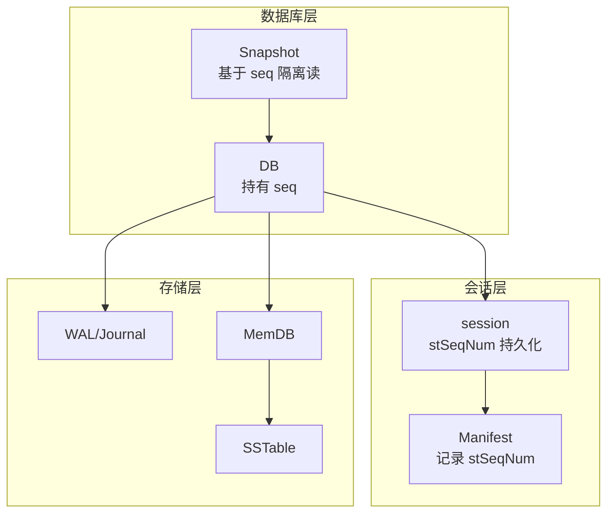
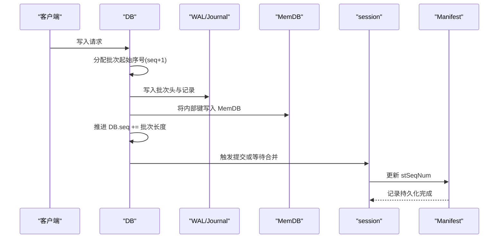
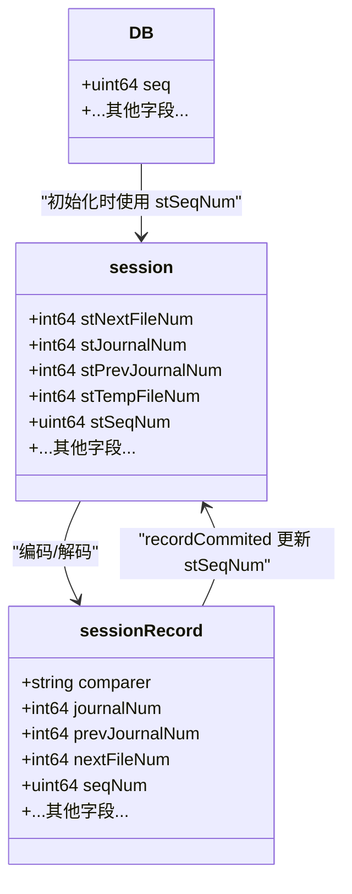
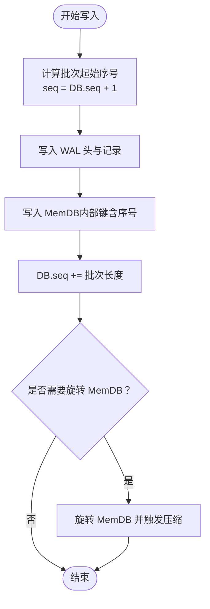
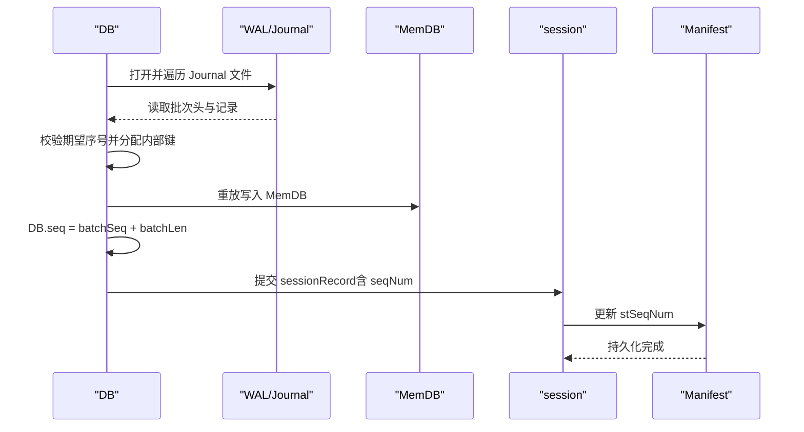
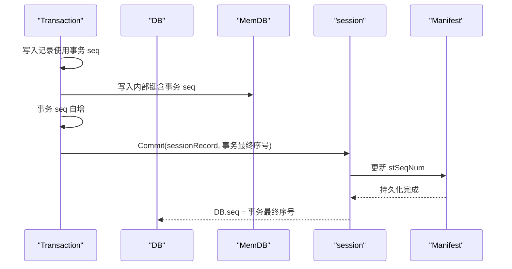
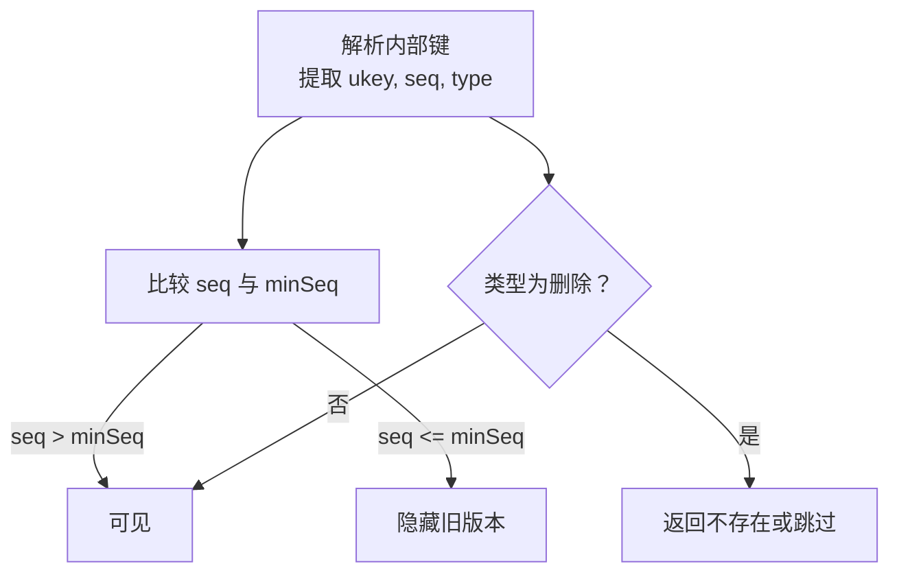
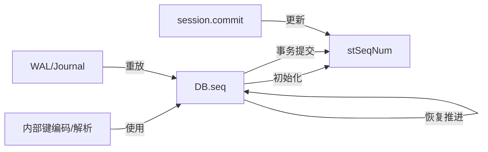

# 序列号管理

<cite>
**本文引用的文件**
- [leveldb/db.go](file://leveldb/db.go)
- [leveldb/session.go](file://leveldb/session.go)
- [leveldb/session_record.go](file://leveldb/session_record.go)
- [leveldb/session_util.go](file://leveldb/session_util.go)
- [leveldb/key.go](file://leveldb/key.go)
- [leveldb/db_write.go](file://leveldb/db_write.go)
- [leveldb/batch.go](file://leveldb/batch.go)
- [leveldb/db_transaction.go](file://leveldb/db_transaction.go)
- [leveldb/db_snapshot.go](file://leveldb/db_snapshot.go)
- [leveldb/manualtest/dbstress/key.go](file://manualtest/dbstress/key.go)
</cite>

## 目录
1. [简介](#简介)
2. [项目结构](#项目结构)
3. [核心组件](#核心组件)
4. [架构总览](#架构总览)
5. [详细组件分析](#详细组件分析)
6. [依赖关系分析](#依赖关系分析)
7. [性能考量](#性能考量)
8. [故障排查指南](#故障排查指南)
9. [结论](#结论)

## 简介
本文件聚焦于 avccDB 的序列号管理机制，系统性阐述 stSeqNum 元数据字段的设计与实现，说明其在数据库操作序列化、版本控制、WAL 写前日志与 MemTable 压缩过程中的递增机制，以及如何通过序列号实现 MVCC（多版本并发控制）。文档提供序列号管理流程图，覆盖写入、压缩与恢复阶段的序列号变化，并给出在事务处理中读取、更新与安全访问的实践路径。

## 项目结构
围绕序列号管理的关键模块分布如下：
- 数据库实例与序列号：DB 结构体持有当前序列号，用于写入、恢复与事务提交时的全局序号推进。
- 会话与持久化：session 记录 stSeqNum 并通过 manifest 持久化；commit 时更新 stSeqNum。
- 内部键编码：内部键包含序列号与类型，支持 MVCC 版本解析与排序。
- 写入与恢复：写入时分配连续序列号；恢复时从 WAL 重放并推进序列号；表重建时设置最大序列号。
- 快照与最小序列：快照基于序列号隔离读视图，minSeq 保障不可见旧版本。

图表来源
- [leveldb/db.go](file://leveldb/db.go#L33-L110)
- [leveldb/session.go](file://leveldb/session.go#L36-L66)
- [leveldb/session_util.go](file://leveldb/session_util.go#L359-L397)

章节来源
- [leveldb/db.go](file://leveldb/db.go#L33-L110)
- [leveldb/session.go](file://leveldb/session.go#L36-L66)
- [leveldb/session_util.go](file://leveldb/session_util.go#L359-L397)

## 核心组件
- stSeqNum：会话级“最后已压缩的序列号”，作为 manifest 的持久化字段，用于恢复时确定起点。
- DB.seq：数据库实例当前序列号，写入、恢复与事务提交均以此推进。
- 内部键编码：内部键末尾 8 字节包含序列号与类型，支持 MVCC 版本解析与排序。
- 写入流程：写入批量分配连续序列号，先写 WAL，再写 MemDB，最后推进 DB.seq。
- 恢复流程：按 Journal 文件顺序重放，逐批推进 DB.seq；表重建时扫描表内最大序列号并设置到 manifest。
- 事务流程：事务内部自增序列号，提交时将事务内的所有记录写入表并更新 manifest 的 stSeqNum。

章节来源
- [leveldb/session.go](file://leveldb/session.go#L36-L66)
- [leveldb/db.go](file://leveldb/db.go#L100-L110)
- [leveldb/key.go](file://leveldb/key.go#L75-L117)
- [leveldb/db_write.go](file://leveldb/db_write.go#L236-L266)
- [leveldb/batch.go](file://leveldb/batch.go#L339-L392)
- [leveldb/session_util.go](file://leveldb/session_util.go#L359-L397)
- [leveldb/db_transaction.go](file://leveldb/db_transaction.go#L118-L130)

## 架构总览
序列号贯穿以下关键路径：
- 写入：DB.seq + 1 分配批次起始序号，写入 WAL 后按批次长度推进 DB.seq，随后写 MemDB。
- 恢复：按 Journal 文件顺序重放，decodeBatchToMem 校验期望序号并推进 DB.seq；表重建时扫描表内最大序号并设置 manifest 的 stSeqNum。
- 提交：事务提交时将事务记录写入表，同时以事务的最终序号更新 manifest 的 stSeqNum。
- 读取：快照基于最小未被快照遮挡的序列号（minSeq）进行可见性判断；内部键解析时根据序列号与类型决定可见性。

图表来源
- [leveldb/db_write.go](file://leveldb/db_write.go#L236-L266)
- [leveldb/batch.go](file://leveldb/batch.go#L339-L392)
- [leveldb/session_util.go](file://leveldb/session_util.go#L359-L397)

## 详细组件分析

### stSeqNum 元数据字段设计与持久化
- 定义位置：session 结构体包含 stSeqNum 字段，表示“最后已压缩的序列号”。
- 持久化方式：通过 sessionRecord 编码/解码，写入 manifest；recordCommited 在提交后更新 stSeqNum。
- 读取时机：打开数据库时，DB.seq 初始化为 s.stSeqNum；恢复时也以 stSeqNum 为起点。

图表来源
- [leveldb/session.go](file://leveldb/session.go#L36-L66)
- [leveldb/session_record.go](file://leveldb/session_record.go#L55-L100)
- [leveldb/session_util.go](file://leveldb/session_util.go#L359-L397)
- [leveldb/db.go](file://leveldb/db.go#L100-L110)

章节来源
- [leveldb/session.go](file://leveldb/session.go#L36-L66)
- [leveldb/session_record.go](file://leveldb/session_record.go#L55-L100)
- [leveldb/session_util.go](file://leveldb/session_util.go#L359-L397)
- [leveldb/db.go](file://leveldb/db.go#L100-L110)

### 写入流程中的序列号递增
- 批次起始序号：每次写入从 DB.seq + 1 开始，确保全局单调递增。
- WAL 写入：写入批次头（含起始序号与记录数），随后逐条记录写入。
- MemDB 写入：将内部键写入 MemDB，内部键末尾 8 字节包含序列号与类型。
- 序列号推进：写入完成后，DB.seq 增加批次记录数量。
- 合并触发：当达到阈值时触发 MemTable 压缩，生成新的 SSTable 并更新 manifest。

图表来源
- [leveldb/db_write.go](file://leveldb/db_write.go#L236-L266)
- [leveldb/key.go](file://leveldb/key.go#L75-L117)

章节来源
- [leveldb/db_write.go](file://leveldb/db_write.go#L236-L266)
- [leveldb/key.go](file://leveldb/key.go#L75-L117)

### 恢复流程中的序列号推进
- Journal 重放：按文件编号升序打开并重放，decodeBatchToMem 校验期望序号，逐条将内部键写入 MemDB。
- 序列号推进：每批重放后，DB.seq = batchSeq + batchLen。
- 表重建：扫描 SSTable 内部键，提取最大序列号，设置到 sessionRecord 并提交至 manifest。
- 最终落盘：commit 更新 stSeqNum，确保后续启动从正确起点继续。

图表来源
- [leveldb/db.go](file://leveldb/db.go#L499-L666)
- [leveldb/batch.go](file://leveldb/batch.go#L339-L392)
- [leveldb/session_util.go](file://leveldb/session_util.go#L359-L397)

章节来源
- [leveldb/db.go](file://leveldb/db.go#L499-L666)
- [leveldb/batch.go](file://leveldb/batch.go#L339-L392)
- [leveldb/session_util.go](file://leveldb/session_util.go#L359-L397)

### 事务流程中的序列号管理
- 事务内部序号：事务内部以事务 seq 自增，写入 MemDB 时使用事务 seq。
- 提交阶段：将事务内的记录写入表（L0），并在提交时将事务的最终序号写入 manifest 的 stSeqNum。
- 并发安全：事务持有写锁，避免与其他写入竞争；提交成功后更新 DB.seq 并触发压缩。

图表来源
- [leveldb/db_transaction.go](file://leveldb/db_transaction.go#L118-L130)
- [leveldb/db_transaction.go](file://leveldb/db_transaction.go#L189-L251)
- [leveldb/session_util.go](file://leveldb/session_util.go#L359-L397)

章节来源
- [leveldb/db_transaction.go](file://leveldb/db_transaction.go#L118-L130)
- [leveldb/db_transaction.go](file://leveldb/db_transaction.go#L189-L251)
- [leveldb/session_util.go](file://leveldb/session_util.go#L359-L397)

### MVCC（多版本并发控制）与序列号
- 内部键格式：内部键末尾 8 字节包含序列号与类型，类型占低 8 位，序列号占高 56 位。
- 版本解析：parseInternalKey 解析出用户键、序列号与类型；parseInternalKeyWithVersion 支持带版本字段的键。
- 可见性规则：读取时根据快照最小序列号 minSeq 与内部键序列号比较，决定可见性；删除类型为 keyTypeDel。
- 迭代器与快照：快照基于元素序列号隔离读取，minSeq 返回最小未被快照遮挡的序列号。

图表来源
- [leveldb/key.go](file://leveldb/key.go#L106-L132)
- [leveldb/db_snapshot.go](file://leveldb/db_snapshot.go#L62-L72)
- [manualtest/dbstress/key.go](file://manualtest/dbstress/key.go#L36-L77)

章节来源
- [leveldb/key.go](file://leveldb/key.go#L106-L132)
- [leveldb/db_snapshot.go](file://leveldb/db_snapshot.go#L62-L72)
- [manualtest/dbstress/key.go](file://manualtest/dbstress/key.go#L36-L77)

### 并发环境下的安全访问模式
- 写入并发：DB 使用写锁与合并队列，避免多个写入同时修改同一内存区；写入过程中可能触发合并，但序列号推进在写入完成后进行。
- 事务并发：事务持有写锁，提交时通过 session.commit 更新 stSeqNum，避免与其他写入冲突。
- 快照并发：快照列表受互斥保护，minSeq 仅在持有互斥锁时读取，保证可见性判断的一致性。

章节来源
- [leveldb/db_write.go](file://leveldb/db_write.go#L295-L330)
- [leveldb/db_transaction.go](file://leveldb/db_transaction.go#L189-L251)
- [leveldb/db_snapshot.go](file://leveldb/db_snapshot.go#L27-L72)

## 依赖关系分析
- DB.seq 与 stSeqNum 的关系：DB.seq 初始化为 stSeqNum，写入与恢复都会推进 DB.seq；提交时通过 session.commit 更新 stSeqNum。
- 内部键与序列号：内部键编码将序列号与类型打包，读取时解析并参与可见性判断。
- WAL 与恢复：WAL 中记录包含批次头（起始序号与记录数），decodeBatchToMem 校验并推进 DB.seq。
- 事务与提交：事务提交时将事务最终序号写入 manifest 的 stSeqNum，随后 DB.seq 被设置为事务最终序号。

图表来源
- [leveldb/db.go](file://leveldb/db.go#L100-L110)
- [leveldb/db_write.go](file://leveldb/db_write.go#L236-L266)
- [leveldb/batch.go](file://leveldb/batch.go#L339-L392)
- [leveldb/session_util.go](file://leveldb/session_util.go#L359-L397)
- [leveldb/key.go](file://leveldb/key.go#L75-L117)

章节来源
- [leveldb/db.go](file://leveldb/db.go#L100-L110)
- [leveldb/db_write.go](file://leveldb/db_write.go#L236-L266)
- [leveldb/batch.go](file://leveldb/batch.go#L339-L392)
- [leveldb/session_util.go](file://leveldb/session_util.go#L359-L397)
- [leveldb/key.go](file://leveldb/key.go#L75-L117)

## 性能考量
- 序列号分配与推进：写入时仅做原子自增，开销极小。
- 批量写入合并：通过合并队列减少 WAL 与 MemDB 的写放大，间接降低序列号分配与推进的频率。
- 压缩触发：当 L0 表过多或写入过快时触发压缩，避免序列号推进过快导致可见性窗口过大。
- 快照维护：快照列表采用链表结构，minSeq 计算为 O(1)，对读取性能影响有限。

## 故障排查指南
- 恢复错误：若 Journal 重放失败，decodeBatchToMem 会校验期望序号，出现不一致时返回错误；检查 DB.seq 与 WAL 头是否匹配。
- Manifest 不一致：若 manifest 中 stSeqNum 与实际数据不一致，可能导致读取到旧版本；可通过恢复流程重新生成 manifest。
- 事务提交失败：事务提交时多次重试，若仍失败，检查 session.commit 是否成功以及 DB.seq 是否被正确设置。
- 快照异常：若快照读取到旧版本，检查 minSeq 是否正确，确认快照元素引用计数是否为 0。

章节来源
- [leveldb/batch.go](file://leveldb/batch.go#L339-L392)
- [leveldb/db_transaction.go](file://leveldb/db_transaction.go#L189-L251)
- [leveldb/db_snapshot.go](file://leveldb/db_snapshot.go#L62-L72)

## 结论
stSeqNum 作为会话级“最后已压缩的序列号”，与 DB.seq 协同工作，确保了 WAL 重放、表重建与事务提交的序列一致性。内部键编码将序列号与类型打包，结合快照与 minSeq 实现 MVCC 可见性控制。通过严格的持久化与提交流程，系统在并发环境下保持序列号的单调递增与一致性，为上层应用提供可靠的版本控制能力。