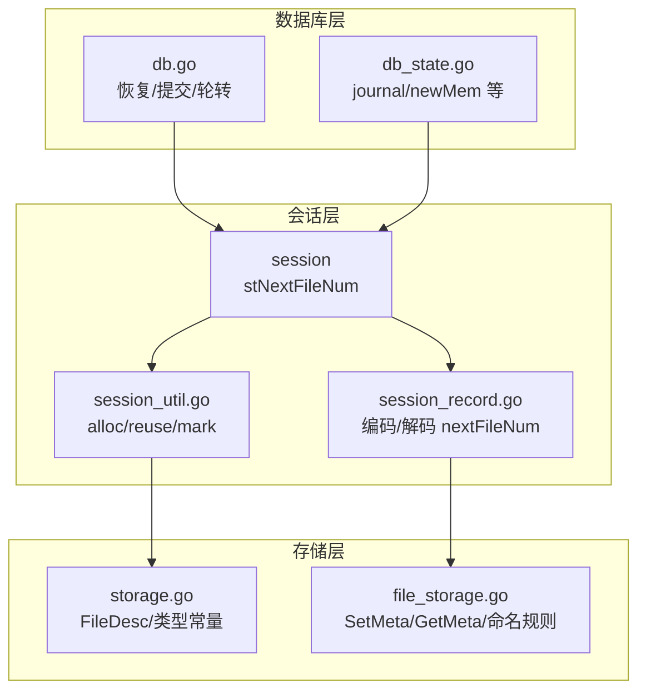
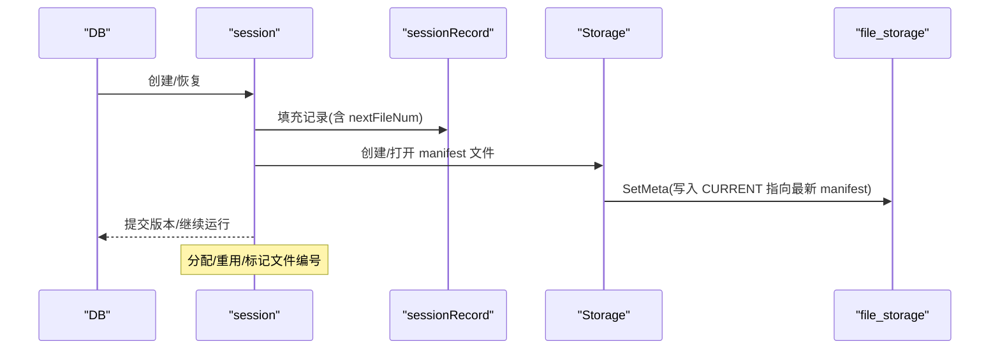
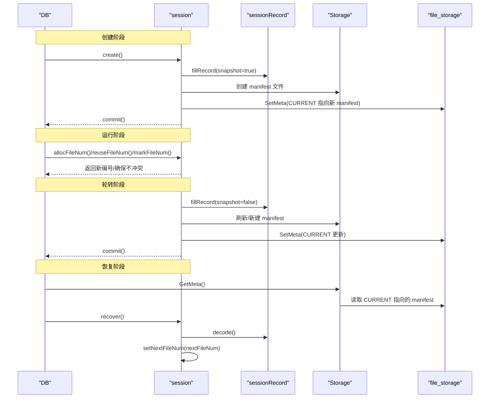
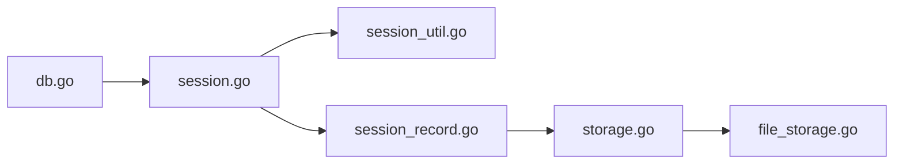

# 文件编号管理

<cite>
**本文引用的文件**
- [session.go](file://leveldb/session.go)
- [session_util.go](file://leveldb/session_util.go)
- [session_record.go](file://leveldb/session_record.go)
- [db.go](file://leveldb/db.go)
- [db_state.go](file://leveldb/db_state.go)
- [db_test.go](file://leveldb/db_test.go)
- [storage.go](file://leveldb/storage/storage.go)
- [file_storage.go](file://leveldb/storage/file_storage.go)
</cite>

## 目录
1. [简介](#简介)
2. [项目结构](#项目结构)
3. [核心组件](#核心组件)
4. [架构总览](#架构总览)
5. [详细组件分析](#详细组件分析)
6. [依赖关系分析](#依赖关系分析)
7. [性能考量](#性能考量)
8. [故障排查指南](#故障排查指南)
9. [结论](#结论)
10. [附录](#附录)

## 简介
本文件聚焦于 avccDB 的“文件编号管理”机制，围绕 stNextFileNum 元数据字段展开，系统性阐述其在数据库文件系统中的职责、分配策略、重用与持久化方式，并深入解析 allocFileNum、nextFileNum、setNextFileNum、markFileNum 等方法的实现细节与并发安全保障（原子操作与 CAS）。同时给出文件编号生命周期图，覆盖数据库创建、运行与文件轮转阶段的状态变化；并提供实际代码示例路径，展示分配流程、异常处理与故障恢复时的编号状态重建机制。

## 项目结构
与文件编号管理直接相关的核心模块位于 leveldb 包内：
- 会话层：维护 stNextFileNum 并提供分配/重用/标记接口
- 记录层：将 nextFileNum 写入/读取到 manifest 中，作为持久化依据
- 存储层：负责文件命名、打开/创建/删除/重命名等底层操作
- 数据库层：在恢复/写入/轮转过程中使用文件编号

图表来源
- [session.go](file://leveldb/session.go#L35-L68)
- [session_util.go](file://leveldb/session_util.go#L297-L361)
- [session_record.go](file://leveldb/session_record.go#L24-L35)
- [storage.go](file://leveldb/storage/storage.go#L114-L158)
- [file_storage.go](file://leveldb/storage/file_storage.go#L286-L308)
- [db.go](file://leveldb/db.go#L470-L530)
- [db_state.go](file://leveldb/db_state.go#L120-L159)

章节来源
- [session.go](file://leveldb/session.go#L35-L68)
- [session_util.go](file://leveldb/session_util.go#L297-L361)
- [session_record.go](file://leveldb/session_record.go#L24-L35)
- [storage.go](file://leveldb/storage/storage.go#L114-L158)
- [file_storage.go](file://leveldb/storage/file_storage.go#L286-L308)
- [db.go](file://leveldb/db.go#L470-L530)
- [db_state.go](file://leveldb/db_state.go#L120-L159)

## 核心组件
- stNextFileNum：会话级当前“未使用”的文件编号，所有新文件分配均从该值递增，确保全局唯一且单调递增。
- 分配接口：
  - allocFileNum：无条件递增并返回上一个值，作为新文件编号
  - reuseFileNum：将下一个可用编号回退到指定编号，用于回收已分配但未使用的编号
  - markFileNum：将下一个可用编号提升到“已使用编号+1”，防止后续分配冲突
  - nextFileNum/setNextFileNum：读取/设置当前未使用编号
- 持久化与恢复：
  - 新建/刷新 manifest 时，将当前 nextFileNum 写入记录
  - 恢复时从 manifest 读取 nextFileNum 并设置到会话，确保重启后编号不回退

章节来源
- [session.go](file://leveldb/session.go#L35-L68)
- [session_util.go](file://leveldb/session_util.go#L297-L361)
- [session_record.go](file://leveldb/session_record.go#L24-L35)
- [session_record.go](file://leveldb/session_record.go#L160-L196)
- [session_record.go](file://leveldb/session_record.go#L258-L324)
- [session.go](file://leveldb/session.go#L190-L208)

## 架构总览
文件编号管理贯穿数据库生命周期：
- 创建：创建首个 manifest，写入初始 nextFileNum
- 运行：分配新文件编号，必要时回退或提升以避免冲突
- 轮转：当 manifest 达到大小阈值或切换时，新建/刷新 manifest 并持久化 nextFileNum
- 恢复：从 manifest 读取 nextFileNum，重建编号状态

图表来源
- [session_util.go](file://leveldb/session_util.go#L404-L466)
- [session_record.go](file://leveldb/session_record.go#L160-L196)
- [file_storage.go](file://leveldb/storage/file_storage.go#L286-L308)
- [db.go](file://leveldb/db.go#L470-L530)

## 详细组件分析

### stNextFileNum 字段设计与作用
- 定位：会话对象中的一个 int64 字段，用于跟踪“当前未使用的文件编号”
- 语义：任何新文件的编号都来自该值的原子递增；若发生冲突或回收，会通过 mark/reuse 将其提升或回退
- 对齐：为保证原子操作对齐，声明为 64 位对齐字段

章节来源
- [session.go](file://leveldb/session.go#L35-L68)
- [db_test.go](file://leveldb/db_test.go#L560-L570)

### 分配、重用与标记方法的实现与并发安全
- allocFileNum
  - 使用原子加法将 stNextFileNum 增加 1，并返回旧值作为新编号
  - 优点：简单高效，天然无锁
  - 并发：多线程可同时调用，不会产生重复编号
  - 示例路径：[allocFileNum 实现](file://leveldb/session_util.go#L321-L324)

- reuseFileNum
  - 当某编号被分配但未使用时，将其回退到该编号，使后续分配能复用
  - 逻辑：若当前未使用编号正好是目标编号+1，则直接设置；否则保持不变
  - 并发：通过 CAS 循环保证只在期望值匹配时更新
  - 示例路径：[reuseFileNum 实现](file://leveldb/session_util.go#L326-L337)

- markFileNum
  - 将下一个未使用编号提升到“已使用编号+1”，防止后续分配与之冲突
  - 逻辑：比较当前未使用编号与“已使用编号+1”，取较大者作为新的未使用编号
  - 并发：CAS 循环，直到成功
  - 示例路径：[markFileNum 实现](file://leveldb/session_util.go#L307-L319)

- nextFileNum/setNextFileNum
  - nextFileNum：原子读取当前未使用编号
  - setNextFileNum：原子设置当前未使用编号
  - 示例路径：[nextFileNum/setNextFileNum 实现](file://leveldb/session_util.go#L297-L306)

- 并发安全要点
  - 所有方法均基于原子操作与 CAS，避免锁竞争
  - 在极端情况下（CAS 失败），循环重试直至成功
  - 与外部同步：部分字段（如 journal/seq）仍需外部互斥保护

章节来源
- [session_util.go](file://leveldb/session_util.go#L297-L361)

### 持久化与恢复机制
- 写入 manifest
  - 新建/刷新 manifest 前，调用 fillRecord 将当前 nextFileNum 写入 sessionRecord
  - 编码时按字段顺序写入 nextFileNum，确保磁盘格式稳定
  - 示例路径：
    - [fillRecord 写入 nextFileNum](file://leveldb/session_util.go#L361-L363)
    - [encode 写入 nextFileNum](file://leveldb/session_record.go#L160-L196)

- 设置元数据
  - manifest 写入完成后，调用 SetMeta 将 CURRENT 指向最新 manifest
  - 示例路径：[SetMeta](file://leveldb/storage/file_storage.go#L286-L308)

- 恢复时重建
  - 从存储层读取 CURRENT 指向的 manifest
  - 解码 sessionRecord，校验字段完整性（包含 nextFileNum）
  - 将 nextFileNum 设置到会话，确保重启后编号不回退
  - 示例路径：
    - [recover 校验 nextFileNum 并设置](file://leveldb/session.go#L190-L208)
    - [decode 读取 nextFileNum](file://leveldb/session_record.go#L258-L324)

- 文件命名与类型
  - 不同类型的文件（manifest/journal/table/temp）使用统一的命名规则，编号作为关键标识
  - 示例路径：[文件命名规则](file://leveldb/storage/storage.go#L114-L158)

章节来源
- [session_util.go](file://leveldb/session_util.go#L361-L363)
- [session_record.go](file://leveldb/session_record.go#L160-L196)
- [session_record.go](file://leveldb/session_record.go#L258-L324)
- [storage.go](file://leveldb/storage/storage.go#L114-L158)
- [file_storage.go](file://leveldb/storage/file_storage.go#L286-L308)
- [session.go](file://leveldb/session.go#L190-L208)

### 文件编号生命周期图
以下序列图展示了数据库从创建到运行再到轮转与恢复的关键节点，以及 stNextFileNum 的变化轨迹。

图表来源
- [session_util.go](file://leveldb/session_util.go#L404-L466)
- [session_record.go](file://leveldb/session_record.go#L160-L196)
- [session_record.go](file://leveldb/session_record.go#L258-L324)
- [storage.go](file://leveldb/storage/storage.go#L114-L158)
- [file_storage.go](file://leveldb/storage/file_storage.go#L286-L308)
- [session.go](file://leveldb/session.go#L190-L208)

### 关键调用链与使用场景
- 新建 journal
  - 分配编号并创建 journal 文件；失败时回退编号
  - 示例路径：
    - [分配/回退编号](file://leveldb/db_state.go#L120-L159)

- 恢复表/日志
  - 恢复阶段根据已存在的最高编号调用 markFileNum，避免后续分配冲突
  - 示例路径：
    - [恢复表时标记编号](file://leveldb/db.go#L470-L497)
    - [恢复日志时标记编号](file://leveldb/db.go#L520-L530)

- 新建 manifest
  - 新建/刷新 manifest 前填充 nextFileNum，写入后更新 CURRENT
  - 示例路径：
    - [newManifest 流程](file://leveldb/session_util.go#L404-L466)

章节来源
- [db_state.go](file://leveldb/db_state.go#L120-L159)
- [db.go](file://leveldb/db.go#L470-L530)
- [session_util.go](file://leveldb/session_util.go#L404-L466)

### 并发与一致性保障
- 原子操作与 CAS
  - allocFileNum 使用原子加法，天然无锁
  - reuseFileNum/markFileNum 使用 CAS 循环，确保只在期望值匹配时更新
- 外部同步
  - 部分字段（如 journal/seq）仍需外部互斥保护，避免与其他状态变更并发冲突
- 对齐要求
  - stNextFileNum 声明为 64 位对齐，确保原子操作正确性

章节来源
- [session_util.go](file://leveldb/session_util.go#L297-L361)
- [session.go](file://leveldb/session.go#L35-L68)
- [db_test.go](file://leveldb/db_test.go#L560-L570)

## 依赖关系分析
- session 依赖 storage 接口进行文件操作
- session_record 负责 manifest 的编码/解码，包含 nextFileNum 字段
- db 层在恢复/提交/轮转时与 session 协作，确保编号一致

图表来源
- [db.go](file://leveldb/db.go#L470-L530)
- [session.go](file://leveldb/session.go#L35-L68)
- [session_util.go](file://leveldb/session_util.go#L297-L361)
- [session_record.go](file://leveldb/session_record.go#L24-L35)
- [storage.go](file://leveldb/storage/storage.go#L114-L158)
- [file_storage.go](file://leveldb/storage/file_storage.go#L286-L308)

## 性能考量
- 原子操作开销极低，适合高并发下的文件编号分配
- CAS 循环在高竞争下可能增加重试次数，但能保证正确性
- manifest 轮转触发条件（大小阈值）影响 nextFileNum 的写入频率
- 建议：在批量分配场景中，尽量减少不必要的 mark/reuse 操作，降低 CAS 循环次数

## 故障排查指南
- 恢复失败（缺失 nextFileNum）
  - 现象：恢复时校验失败，提示 next-file-num 缺失
  - 处理：检查 manifest 是否完整，确认 SetMeta 是否成功
  - 参考路径：
    - [恢复校验 nextFileNum](file://leveldb/session.go#L190-L208)
    - [SetMeta](file://leveldb/storage/file_storage.go#L286-L308)

- 分配冲突或重复编号
  - 现象：并发分配导致编号重复或后续分配越界
  - 处理：确认 allocFileNum 使用正确；必要时使用 markFileNum 提升未使用编号
  - 参考路径：
    - [allocFileNum/markFileNum](file://leveldb/session_util.go#L297-L337)

- 新建 manifest 失败后的清理
  - 现象：新建 manifest 失败，需要回退编号并移除临时文件
  - 处理：确保 reuseFileNum 与 Remove 正确执行
  - 参考路径：
    - [newManifest 错误分支](file://leveldb/session_util.go#L422-L444)

- 文件命名与类型不匹配
  - 现象：文件名与类型不符导致读取错误
  - 处理：核对 storage 的命名规则与类型常量
  - 参考路径：
    - [文件命名规则](file://leveldb/storage/storage.go#L114-L158)

章节来源
- [session.go](file://leveldb/session.go#L190-L208)
- [session_util.go](file://leveldb/session_util.go#L422-L444)
- [storage.go](file://leveldb/storage/storage.go#L114-L158)
- [file_storage.go](file://leveldb/storage/file_storage.go#L286-L308)

## 结论
stNextFileNum 是 avccDB 文件编号体系的核心，通过原子操作与 CAS 保障了高并发下的正确性与性能。结合 manifest 的持久化与恢复流程，实现了从创建、运行到轮转与故障恢复的完整生命周期管理。实践中应遵循“先分配/再使用”的原则，并在失败时及时回退编号，确保编号空间的连续性与唯一性。

## 附录
- 实际代码示例路径（不含具体代码内容）
  - 分配新文件编号：[allocFileNum](file://leveldb/session_util.go#L321-L324)
  - 回退编号（复用）：[reuseFileNum](file://leveldb/session_util.go#L326-L337)
  - 标记已使用编号：[markFileNum](file://leveldb/session_util.go#L307-L319)
  - 读取/设置当前未使用编号：[nextFileNum/setNextFileNum](file://leveldb/session_util.go#L297-L306)
  - 新建 manifest 并写入 nextFileNum：[newManifest](file://leveldb/session_util.go#L404-L466)
  - 从 manifest 恢复 nextFileNum：[recover](file://leveldb/session.go#L190-L208)
  - 恢复表/日志时标记编号：[db.go 恢复路径](file://leveldb/db.go#L470-L530)
  - 文件命名规则：[storage.go](file://leveldb/storage/storage.go#L114-L158)