# 日志编号管理

<cite>
**本文引用的文件**
- [session_record.go](file://leveldb/session_record.go)
- [session.go](file://leveldb/session.go)
- [session_util.go](file://leveldb/session_util.go)
- [journal.go](file://leveldb/journal/journal.go)
- [db.go](file://leveldb/db.go)
- [db_state.go](file://leveldb/db_state.go)
- [storage.go](file://leveldb/storage/storage.go)
</cite>

## 目录
1. [简介](#简介)
2. [项目结构](#项目结构)
3. [核心组件](#核心组件)
4. [架构总览](#架构总览)
5. [详细组件分析](#详细组件分析)
6. [依赖关系分析](#依赖关系分析)
7. [性能考量](#性能考量)
8. [故障排查指南](#故障排查指南)
9. [结论](#结论)

## 简介
本文件围绕 avccDB 的日志编号管理机制展开，聚焦于 stJournalNum 元数据字段的设计与实现。该字段用于跟踪当前数据库使用的日志文件编号，并贯穿 WAL 轮转、Manifest 文件更新与数据库恢复流程。本文将解释其在以下方面的关键作用：
- 当前日志文件编号的跟踪与持久化
- 故障恢复时的识别与回放范围控制
- 与 Manifest 文件的协同工作（记录、编码、解码）
- 并发环境下的同步保证与状态转换

## 项目结构
与日志编号管理直接相关的模块分布如下：
- 会话层：负责会话状态维护、Manifest 写入与读取、日志编号提交
- 数据库层：负责 WAL 创建与轮转、序列号管理、恢复流程
- 日志层：提供 Journal Writer/Reader 的块级记录与校验能力
- 存储层：提供文件描述符类型与命名规范

```mermaid
graph TB
subgraph "会话层"
S["session.go<br/>stJournalNum/prevJournalNum/nextFileNum/seqNum"]
SR["session_record.go<br/>journalNum/prevJournalNum 编码/解码"]
SU["session_util.go<br/>newManifest/flushManifest/fillRecord/recordCommited"]
end
subgraph "数据库层"
DB["db.go<br/>recoverJournal/newMem/提交日志编号"]
DS["db_state.go<br/>newMem/冻结与丢弃日志文件"]
end
subgraph "日志层"
JW["journal/journal.go<br/>Writer/Reader 块级记录"]
end
subgraph "存储层"
ST["storage/storage.go<br/>文件类型/命名规范"]
end
DB --> S
DB --> DS
S --> SR
S --> SU
S --> JW
S --> ST
DB --> JW
DB --> ST
```

图表来源
- [session.go](file://leveldb/session.go#L36-L68)
- [session_record.go](file://leveldb/session_record.go#L24-L35)
- [session_util.go](file://leveldb/session_util.go#L359-L466)
- [db.go](file://leveldb/db.go#L499-L702)
- [db_state.go](file://leveldb/db_state.go#L120-L210)
- [journal.go](file://leveldb/journal/journal.go#L1-L120)
- [storage.go](file://leveldb/storage/storage.go#L114-L158)

章节来源
- [session.go](file://leveldb/session.go#L36-L68)
- [session_record.go](file://leveldb/session_record.go#L24-L35)
- [session_util.go](file://leveldb/session_util.go#L359-L466)
- [db.go](file://leveldb/db.go#L499-L702)
- [db_state.go](file://leveldb/db_state.go#L120-L210)
- [journal.go](file://leveldb/journal/journal.go#L1-L120)
- [storage.go](file://leveldb/storage/storage.go#L114-L158)

## 核心组件
- stJournalNum：会话层当前日志文件编号，外部同步
- stPrevJournalNum：上一个日志文件编号（兼容旧版本）
- sessionRecord.journalNum/prevJournalNum：Manifest 记录中的日志编号字段
- Journal Writer/Reader：WAL 块级记录与校验
- Manifest：持久化记录数据库状态（含日志编号、下一个文件编号、序列号等）

章节来源
- [session.go](file://leveldb/session.go#L36-L68)
- [session_record.go](file://leveldb/session_record.go#L55-L68)
- [journal.go](file://leveldb/journal/journal.go#L1-L120)

## 架构总览
日志编号管理的关键路径：
- WAL 轮转：数据库创建新日志文件，记录当前日志编号到 Manifest
- Manifest 更新：会话层在 newManifest/flushManifest 中编码并落盘
- 恢复流程：数据库根据 stJournalNum 与 stPrevJournalNum 决定回放哪些日志文件

图表来源
- [db.go](file://leveldb/db.go#L499-L702)
- [session_util.go](file://leveldb/session_util.go#L403-L466)
- [session.go](file://leveldb/session.go#L189-L208)

## 详细组件分析

### stJournalNum 字段设计与职责
- 定义位置：会话结构体中 stJournalNum 字段，注释明确“当前日志文件编号；需要外部同步”
- 职责：
  - 跟踪当前有效日志文件编号
  - 作为恢复阶段的回放起点判断依据之一
  - 与 prevJournalNum 协同，确保回放范围覆盖“当前日志”和“上一个日志”

章节来源
- [session.go](file://leveldb/session.go#L36-L68)

### Manifest 中的日志编号记录
- sessionRecord.journalNum/prevJournalNum 字段用于编码/解码
- 编码路径：encode() 中按记录类型写入 journalNum/prevJournalNum
- 解码路径：decode() 中解析对应字段并填充 sessionRecord
- 会话恢复时，recover() 会对 Manifest 进行逐条读取并解码，最终校验是否包含 journalNum 字段

章节来源
- [session_record.go](file://leveldb/session_record.go#L55-L68)
- [session_record.go](file://leveldb/session_record.go#L159-L196)
- [session_record.go](file://leveldb/session_record.go#L258-L323)
- [session.go](file://leveldb/session.go#L189-L208)

### WAL 轮转与日志编号更新
- 新建日志文件：db_state.go 的 newMem() 分配新日志文件编号并打开写入器
- 提交日志编号：db.go 在完成回放后，设置 sessionRecord 的 journalNum 为当前日志文件编号并提交
- 丢弃旧日志：db_state.go 的 dropFrozenMem() 删除已冻结的日志文件

图表来源
- [db_state.go](file://leveldb/db_state.go#L120-L210)
- [db.go](file://leveldb/db.go#L637-L666)
- [session_util.go](file://leveldb/session_util.go#L403-L466)

章节来源
- [db_state.go](file://leveldb/db_state.go#L120-L210)
- [db.go](file://leveldb/db.go#L637-L666)
- [session_util.go](file://leveldb/session_util.go#L403-L466)

### Manifest 文件更新与持久化
- newManifest：创建新的 Manifest 文件，填充当前状态（包含 journalNum），编码写入并同步
- flushManifest：在现有 Manifest 已存在且未超过大小阈值时，直接追加记录并刷新
- recordCommited：将已提交的 sessionRecord 中的 journalNum/prevJournalNum/seqNum 应用到会话状态

章节来源
- [session_util.go](file://leveldb/session_util.go#L403-L466)
- [session_util.go](file://leveldb/session_util.go#L468-L491)
- [session_util.go](file://leveldb/session_util.go#L383-L401)

### 数据库恢复流程中的日志编号
- 恢复入口：db.go 的 recoverJournal()/recoverJournalRO() 会列出所有日志文件并排序
- 回放范围：仅回放编号 >= stJournalNum 或编号 == stPrevJournalNum 的日志文件
- 最终提交：回放完成后，设置当前日志编号与序列号并提交

图表来源
- [db.go](file://leveldb/db.go#L499-L702)
- [session.go](file://leveldb/session.go#L189-L208)

章节来源
- [db.go](file://leveldb/db.go#L499-L702)
- [session.go](file://leveldb/session.go#L189-L208)

### 并发与同步保证
- 外部同步：stJournalNum/stSeqNum 需要外部同步（如写入锁、提交时的互斥）
- 原子性：nextFileNum 使用原子操作进行分配与更新，避免文件编号冲突
- 版本切换：setVersion() 通过 vmu 锁保护版本切换，deltaCh 传递表文件增删变更

章节来源
- [session.go](file://leveldb/session.go#L36-L68)
- [session_util.go](file://leveldb/session_util.go#L297-L337)
- [session_util.go](file://leveldb/session_util.go#L251-L296)

## 依赖关系分析
- DB 依赖 session 维护日志编号与 Manifest
- session 依赖 journal.Writer/Reader 实现 WAL 的块级记录
- session 依赖 storage 接口进行文件创建、删除与元信息设置
- session_record 负责 Manifest 中日志编号字段的编码/解码

图表来源
- [db.go](file://leveldb/db.go#L1-L200)
- [session.go](file://leveldb/session.go#L1-L120)
- [session_record.go](file://leveldb/session_record.go#L1-L120)
- [journal.go](file://leveldb/journal/journal.go#L1-L120)
- [storage.go](file://leveldb/storage/storage.go#L114-L158)

章节来源
- [db.go](file://leveldb/db.go#L1-L200)
- [session.go](file://leveldb/session.go#L1-L120)
- [session_record.go](file://leveldb/session_record.go#L1-L120)
- [journal.go](file://leveldb/journal/journal.go#L1-L120)
- [storage.go](file://leveldb/storage/storage.go#L114-L158)

## 性能考量
- Manifest 尺寸阈值：当 Manifest 超过最大尺寸时触发 newManifest，避免单文件过大影响读写
- WAL 块级记录：journal.Writer/Reader 以固定块大小组织记录，减少碎片与随机 IO
- 原子文件编号：使用原子操作分配文件编号，降低锁竞争
- 回放范围优化：通过 stJournalNum/stPrevJournalNum 精确限定回放范围，避免无效扫描

章节来源
- [session_util.go](file://leveldb/session_util.go#L403-L466)
- [journal.go](file://leveldb/journal/journal.go#L1-L120)
- [session_util.go](file://leveldb/session_util.go#L297-L337)
- [db.go](file://leveldb/db.go#L499-L702)

## 故障排查指南
- Manifest 缺失关键字段
  - 现象：恢复时返回“journal-file-num missing”等错误
  - 排查：确认 Manifest 是否完整写入，检查 newManifest/flushManifest 是否成功
- 日志文件回放范围不正确
  - 现象：部分日志未被回放或重复回放
  - 排查：核对 stJournalNum/stPrevJournalNum 的值，确认过滤逻辑
- WAL 校验失败
  - 现象：Journal Reader 报告块/记录损坏
  - 排查：检查 journal.Writer/Reader 的严格模式配置，必要时启用更严格的校验
- 文件命名与类型
  - 现象：文件类型不匹配导致无法识别
  - 排查：确认 storage.FileDesc 类型与编号命名规则

章节来源
- [session.go](file://leveldb/session.go#L189-L208)
- [journal.go](file://leveldb/journal/journal.go#L120-L220)
- [storage.go](file://leveldb/storage/storage.go#L114-L158)

## 结论
stJournalNum 是 avccDB 日志编号管理的核心元数据字段，贯穿 WAL 轮转、Manifest 更新与数据库恢复三个关键环节。通过与 prevJournalNum 的配合、Manifest 的编码/解码以及会话层的外部同步策略，系统实现了对当前日志文件编号的可靠跟踪与持久化。在并发环境下，原子操作与互斥保护共同确保了状态一致性与正确性。遵循本文所述流程与排错建议，可有效保障日志编号管理机制的稳定性与可靠性。