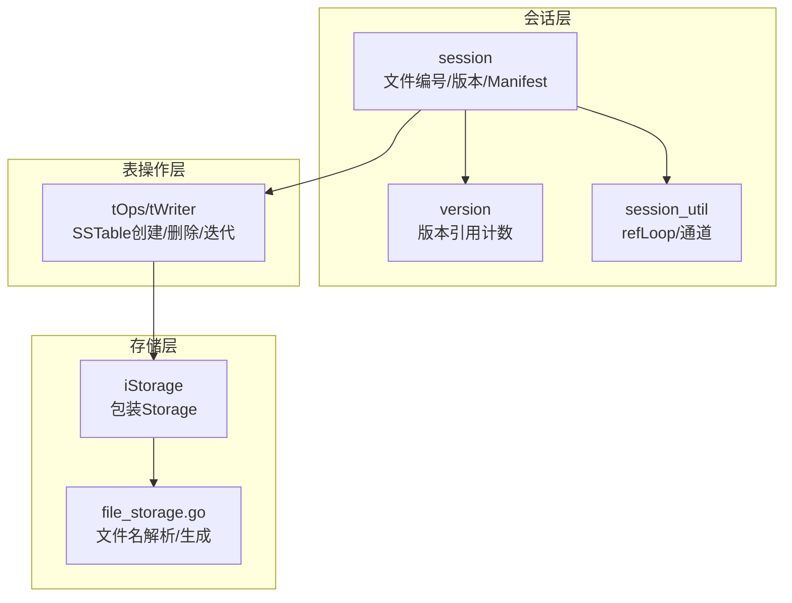
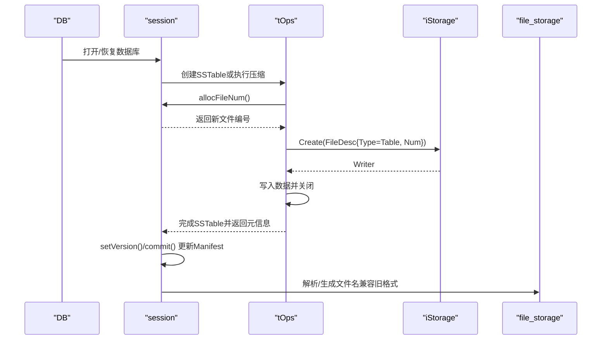
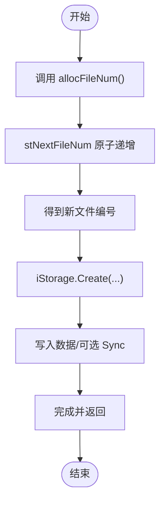
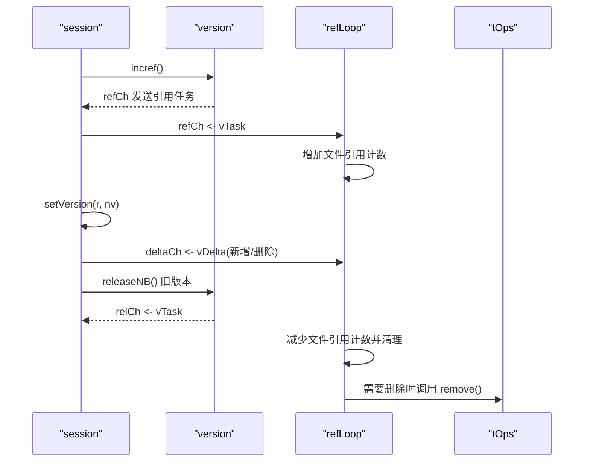
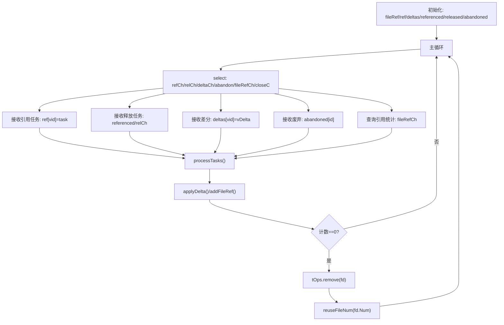
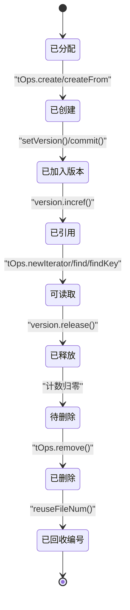
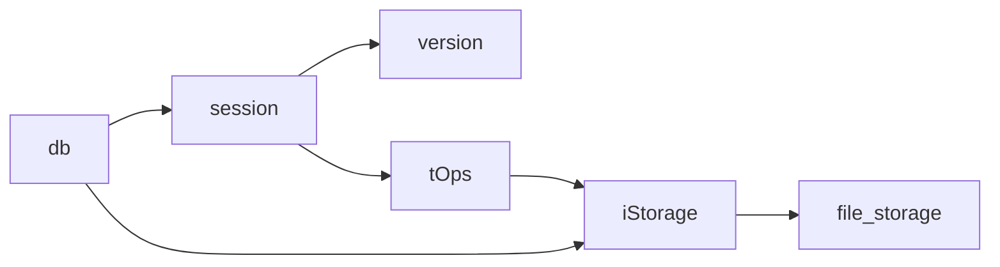

# 文件管理

<cite>
**本文引用的文件**
- [session.go](file://leveldb/session.go)
- [session_util.go](file://leveldb/session_util.go)
- [session_compaction.go](file://leveldb/session_compaction.go)
- [table.go](file://leveldb/table.go)
- [version.go](file://leveldb/version.go)
- [storage.go](file://leveldb/storage.go)
- [db.go](file://leveldb/db.go)
- [storage/file_storage.go](file://leveldb/storage/file_storage.go)
</cite>

## 目录
1. [简介](#简介)
2. [项目结构](#项目结构)
3. [核心组件](#核心组件)
4. [架构总览](#架构总览)
5. [详细组件分析](#详细组件分析)
6. [依赖关系分析](#依赖关系分析)
7. [性能考量](#性能考量)
8. [故障排查指南](#故障排查指南)
9. [结论](#结论)
10. [附录](#附录)

## 简介
本文件围绕 avccDB 的 Session 组件，系统性梳理其文件管理机制，重点覆盖：
- 文件编号分配（原子递增）、文件状态跟踪（版本变更）与文件引用计数（refCh、relCh 通道）的协作方式
- allocFileNum()、markFileNum()、reuseFileNum() 的实现细节与并发安全
- 文件引用计数循环 refLoop 的工作原理，以及与存储层（stor 字段）的交互
- 文件生命周期：从分配到释放的完整流程
- 在 SSTable 创建与压缩过程中的应用示例路径

## 项目结构
与文件管理直接相关的关键模块如下：
- session.go：会话状态、版本管理、Manifest 操作入口
- session_util.go：文件编号分配/回收、版本任务通道、引用计数循环
- session_compaction.go：基于版本选择压缩源、构建压缩任务
- table.go：SSTable 写入、打开、迭代、删除与文件编号分配
- version.go：版本对象、版本引用计数、版本切换
- storage.go：包装 Storage 接口以统计读写量
- db.go：数据库启动、恢复、清理与文件检查
- storage/file_storage.go：文件名解析与生成（兼容旧格式）

图表来源
- [session.go](file://leveldb/session.go#L36-L115)
- [session_util.go](file://leveldb/session_util.go#L70-L249)
- [table.go](file://leveldb/table.go#L348-L566)
- [storage.go](file://leveldb/storage.go#L8-L35)
- [storage/file_storage.go](file://leveldb/storage/file_storage.go#L636-L679)

章节来源
- [session.go](file://leveldb/session.go#L36-L115)
- [session_util.go](file://leveldb/session_util.go#L70-L249)
- [table.go](file://leveldb/table.go#L348-L566)
- [storage.go](file://leveldb/storage.go#L8-L35)
- [storage/file_storage.go](file://leveldb/storage/file_storage.go#L636-L679)

## 核心组件
- 文件编号分配器
  - 原子自增 stNextFileNum，提供 allocFileNum()、markFileNum()、reuseFileNum() 三类操作
- 版本引用计数
  - version 对象维护 ref 计数；通过 refCh/relCh/vDelta 实现延迟批量处理
- 引用计数循环 refLoop
  - 严格按版本号顺序处理引用/释放；支持 delta 缓存与超时强制转全量模式
- 存储层交互
  - iStorage 包装 Storage，统一创建/打开/删除接口，并记录读写统计
- SSTable 生命周期
  - 创建（tOps.create/createFrom）、迭代（open/newIterator）、删除（remove/drop）

章节来源
- [session_util.go](file://leveldb/session_util.go#L297-L337)
- [version.go](file://leveldb/version.go#L26-L90)
- [session_util.go](file://leveldb/session_util.go#L70-L249)
- [storage.go](file://leveldb/storage.go#L8-L35)
- [table.go](file://leveldb/table.go#L348-L566)

## 架构总览
下图展示了文件管理在系统中的位置与交互关系。

图表来源
- [db.go](file://leveldb/db.go#L100-L175)
- [session.go](file://leveldb/session.go#L210-L242)
- [table.go](file://leveldb/table.go#L358-L401)
- [storage.go](file://leveldb/storage.go#L14-L23)
- [storage/file_storage.go](file://leveldb/storage/file_storage.go#L636-L679)

## 详细组件分析

### 文件编号分配与回收
- allocFileNum()
  - 使用原子递增返回下一个可用文件编号，保证多线程安全
  - 路径参考：[session_util.go](file://leveldb/session_util.go#L321-L325)
- markFileNum(num)
  - 将内部“下一个编号”推进到 num+1，避免后续分配重复使用该编号
  - 路径参考：[session_util.go](file://leveldb/session_util.go#L308-L319)
- reuseFileNum(num)
  - 当某文件被丢弃或回滚时，尝试将 num 回放到可用池中，前提是当前 stNextFileNum 必须等于 num+1
  - 路径参考：[session_util.go](file://leveldb/session_util.go#L326-L337)
- 与存储层交互
  - 新建文件时通过 iStorage.Create 获取 Writer，随后写入数据并可选 Sync
  - 路径参考：[table.go](file://leveldb/table.go#L358-L401)，[storage.go](file://leveldb/storage.go#L14-L23)

图表来源
- [session_util.go](file://leveldb/session_util.go#L321-L325)
- [table.go](file://leveldb/table.go#L358-L401)
- [storage.go](file://leveldb/storage.go#L14-L23)

章节来源
- [session_util.go](file://leveldb/session_util.go#L297-L337)
- [table.go](file://leveldb/table.go#L358-L401)
- [storage.go](file://leveldb/storage.go#L14-L23)

### 文件状态跟踪（版本变更）
- 版本对象 version
  - 维护 ref 计数与 releaseNB()/release() 机制
  - 通过 refCh 发送引用请求，relCh 发送释放请求
  - 路径参考：[version.go](file://leveldb/version.go#L26-L90)
- 版本切换 setVersion()
  - 在提交新版本前先 incref 新版本，再 releaseNB() 旧版本
  - 同步向 deltaCh 发送新增/删除文件的 vDelta，用于引用计数循环批量处理
  - 路径参考：[session_util.go](file://leveldb/session_util.go#L266-L295)
- Manifest 更新
  - newManifest()/flushManifest() 将当前状态写入 Manifest，必要时设置元文件
  - 路径参考：[session.go](file://leveldb/session.go#L403-L491)

图表来源
- [version.go](file://leveldb/version.go#L52-L90)
- [session_util.go](file://leveldb/session_util.go#L266-L295)
- [session_util.go](file://leveldb/session_util.go#L70-L249)
- [table.go](file://leveldb/table.go#L511-L526)

章节来源
- [version.go](file://leveldb/version.go#L26-L90)
- [session_util.go](file://leveldb/session_util.go#L266-L295)
- [session.go](file://leveldb/session.go#L403-L491)

### 文件引用计数循环 refLoop
- 关键数据结构
  - fileRef：全局文件编号到引用计数映射
  - ref/referenced/released：按版本号缓存引用/已确认/待处理释放
  - deltas：版本变更的差分（added/deleted）
- 处理策略
  - 严格按版本号顺序处理；当缓存数量或时间超过阈值时，强制转换为全量引用/释放模式
  - 支持跳过废弃版本号（abandon），避免阻塞
  - 通过 fileRefCh 查询当前引用统计
- 删除时机
  - 当某文件计数降至 0 时，调用 tOps.remove()，由存储层移除文件并触发 reuseFileNum()

图表来源
- [session_util.go](file://leveldb/session_util.go#L70-L249)
- [table.go](file://leveldb/table.go#L511-L526)

章节来源
- [session_util.go](file://leveldb/session_util.go#L70-L249)
- [table.go](file://leveldb/table.go#L511-L526)

### 与存储层交互（stor 字段）
- iStorage 包装
  - Open/Create 返回带统计的 Reader/Writer，便于追踪读写量
  - 路径参考：[storage.go](file://leveldb/storage.go#L14-L35)
- 文件命名与兼容
  - 解析/生成文件名（含旧格式 .ldb/.sst），确保跨版本兼容
  - 路径参考：[storage/file_storage.go](file://leveldb/storage/file_storage.go#L636-L679)
- 数据库启动/恢复
  - 打开数据库时进行 Journal 恢复、表扫描与 Manifest 恢复；必要时标记已用文件编号
  - 路径参考：[db.go](file://leveldb/db.go#L295-L497)

章节来源
- [storage.go](file://leveldb/storage.go#L14-L35)
- [storage/file_storage.go](file://leveldb/storage/file_storage.go#L636-L679)
- [db.go](file://leveldb/db.go#L295-L497)

### 文件生命周期图
从分配到释放的完整流程如下：

图表来源
- [session_util.go](file://leveldb/session_util.go#L266-L295)
- [version.go](file://leveldb/version.go#L52-L90)
- [table.go](file://leveldb/table.go#L358-L401)
- [table.go](file://leveldb/table.go#L511-L526)
- [session_util.go](file://leveldb/session_util.go#L326-L337)

### 在 SSTable 创建与压缩中的应用
- SSTable 创建
  - 通过 tOps.create() 分配新编号并创建 Writer，写入后关闭并返回 tFile 元信息
  - 路径参考：[table.go](file://leveldb/table.go#L358-L401)
- 压缩与合并
  - 基于版本选择压缩源（level0 或非 level0），构建 compaction 并迭代源表
  - 路径参考：[session_compaction.go](file://leveldb/session_compaction.go#L56-L134)
- 版本提交
  - 将新增/删除的表文件记录到 sessionRecord，并通过 setVersion()/commit() 更新 Manifest
  - 路径参考：[session.go](file://leveldb/session.go#L210-L242)

章节来源
- [table.go](file://leveldb/table.go#L358-L401)
- [session_compaction.go](file://leveldb/session_compaction.go#L56-L134)
- [session.go](file://leveldb/session.go#L210-L242)

## 依赖关系分析
- 组件耦合
  - session 与 version：版本引用计数通过通道与版本对象解耦
  - session 与 tOps：SSTable 创建/删除/迭代均依赖 tOps，而 tOps 通过 session 的 allocFileNum()/reuseFileNum() 与编号系统交互
  - storage 层：iStorage 包装 Storage，统一文件操作接口
- 外部依赖
  - 文件命名兼容：file_storage 提供旧格式解析/生成
  - 数据库启动/恢复：db.go 调用 session.recover()/create() 与 stor.List/Open/Remove

图表来源
- [session.go](file://leveldb/session.go#L36-L115)
- [version.go](file://leveldb/version.go#L26-L90)
- [table.go](file://leveldb/table.go#L348-L566)
- [storage.go](file://leveldb/storage.go#L8-L35)
- [storage/file_storage.go](file://leveldb/storage/file_storage.go#L636-L679)
- [db.go](file://leveldb/db.go#L100-L175)

章节来源
- [session.go](file://leveldb/session.go#L36-L115)
- [version.go](file://leveldb/version.go#L26-L90)
- [table.go](file://leveldb/table.go#L348-L566)
- [storage.go](file://leveldb/storage.go#L8-L35)
- [storage/file_storage.go](file://leveldb/storage/file_storage.go#L636-L679)
- [db.go](file://leveldb/db.go#L100-L175)

## 性能考量
- 延迟批量处理
  - refLoop 通过 vDelta 与超时/数量阈值，减少频繁的全量引用/释放带来的开销
- 原子操作
  - 文件编号分配与回收均采用原子 CAS，降低锁竞争
- 缓存与重用
  - tOps.remove() 在删除后调用 reuseFileNum()，提升编号复用效率
- I/O 同步策略
  - 可配置 NoSync，平衡一致性与吞吐

[本节为通用指导，无需列出具体文件来源]

## 故障排查指南
- Manifest 不一致或损坏
  - newManifest()/flushManifest() 会在错误时回滚并回收编号，确保一致性
  - 路径参考：[session.go](file://leveldb/session.go#L403-L491)
- 版本引用异常
  - refLoop 中对重复引用/无效释放会 panic，便于快速定位问题
  - 路径参考：[session_util.go](file://leveldb/session_util.go#L189-L248)
- 文件未被删除
  - 若引用计数仍大于 0，不会触发删除；可通过 fileRefCh 查询当前引用统计核对
  - 路径参考：[session_util.go](file://leveldb/session_util.go#L237-L243)

章节来源
- [session.go](file://leveldb/session.go#L403-L491)
- [session_util.go](file://leveldb/session_util.go#L189-L243)

## 结论
avccDB 的文件管理通过“原子编号 + 版本引用计数 + 延迟批量处理”的组合，实现了高并发下的稳定与高效。allocFileNum()/markFileNum()/reuseFileNum() 提供了可靠的编号分配与回收；refLoop 以严格的版本顺序与差分机制保障文件生命周期的正确性；与存储层的 iStorage 包装则统一了文件操作并提供了可观测性。在 SSTable 创建与压缩场景中，这些机制协同工作，确保数据的一致性与持久化。

[本节为总结性内容，无需列出具体文件来源]

## 附录
- 关键实现路径索引
  - 文件编号分配与回收：[session_util.go](file://leveldb/session_util.go#L297-L337)
  - 版本引用计数与通道：[version.go](file://leveldb/version.go#L52-L90)，[session_util.go](file://leveldb/session_util.go#L266-L295)
  - 引用计数循环：[session_util.go](file://leveldb/session_util.go#L70-L249)
  - SSTable 创建与删除：[table.go](file://leveldb/table.go#L358-L401)，[table.go](file://leveldb/table.go#L511-L526)
  - 存储层包装与文件命名：[storage.go](file://leveldb/storage.go#L14-L35)，[storage/file_storage.go](file://leveldb/storage/file_storage.go#L636-L679)
  - Manifest 更新与数据库启动：[session.go](file://leveldb/session.go#L210-L242)，[db.go](file://leveldb/db.go#L100-L175)