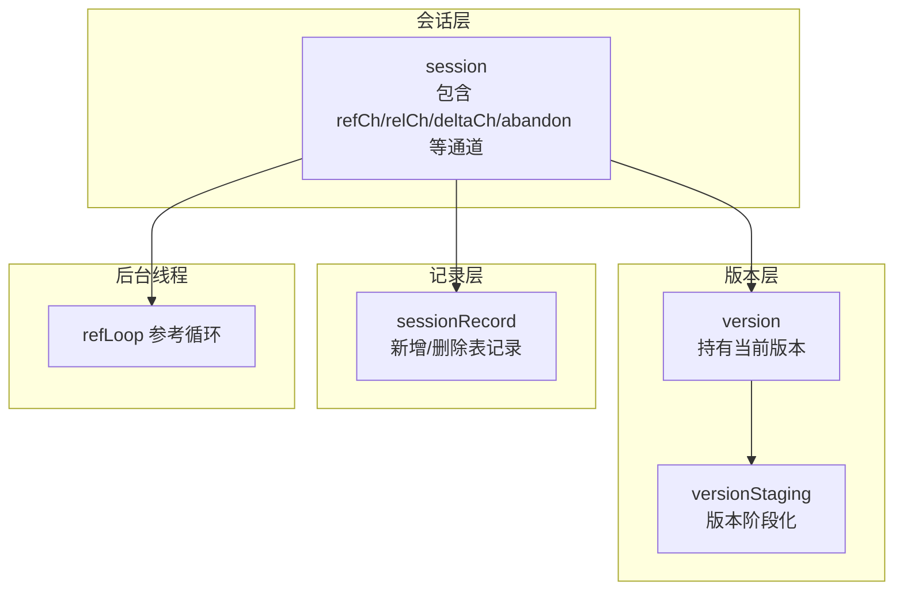
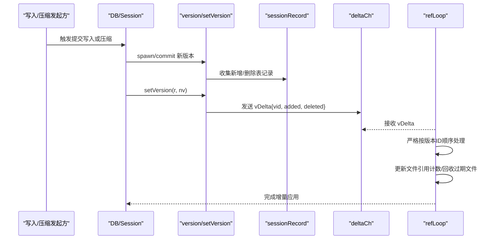
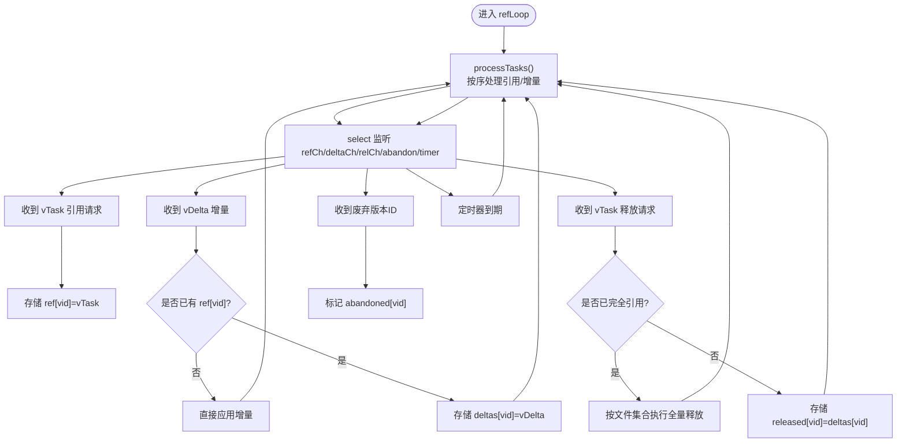
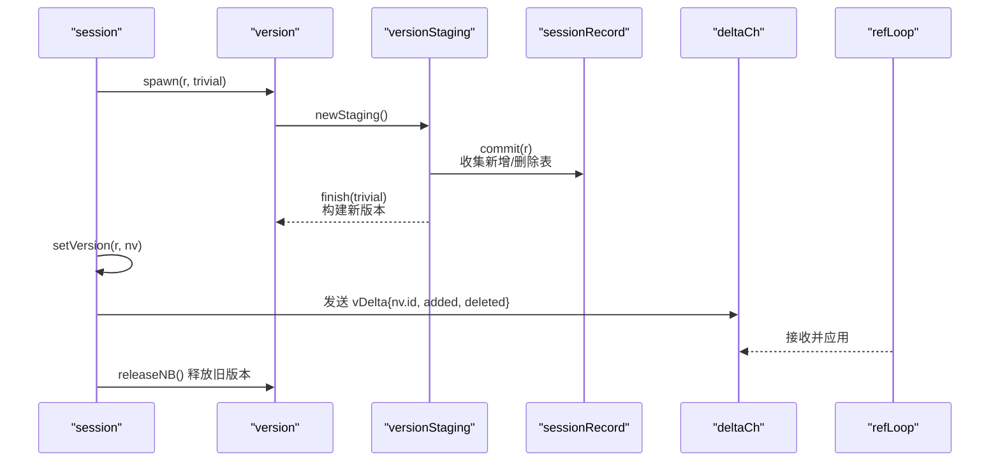
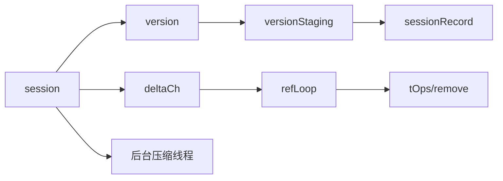

# 增量变更传播

<cite>
**本文引用的文件**
- [session.go](file://leveldb/session.go)
- [session_util.go](file://leveldb/session_util.go)
- [version.go](file://leveldb/version.go)
- [session_record.go](file://leveldb/session_record.go)
- [db_compaction.go](file://leveldb/db_compaction.go)
- [session_compaction.go](file://leveldb/session_compaction.go)
</cite>

## 目录
1. [引言](#引言)
2. [项目结构](#项目结构)
3. [核心组件](#核心组件)
4. [架构总览](#架构总览)
5. [详细组件分析](#详细组件分析)
6. [依赖关系分析](#依赖关系分析)
7. [性能考量](#性能考量)
8. [故障排查指南](#故障排查指南)
9. [结论](#结论)

## 引言
本文件围绕 avccDB 的增量变更传播机制展开，聚焦于 deltaCh 通道与 vDelta 结构体的设计与实现，系统阐述版本变更时如何以“增量”方式将新增/删除的 SSTable 文件信息传递给后台参考循环（refLoop），从而避免全量状态同步带来的开销。文档同时解释增量传播的封装格式、触发时机、处理流程与顺序性/完整性保障策略，并通过序列图与路径引用展示从版本提交到增量处理的完整链路。

## 项目结构
与增量传播直接相关的核心模块位于 leveldb 包内：
- 会话层：负责版本切换、增量消息发送与后台参考循环
- 版本层：负责版本构建、版本阶段化（staging）与文件集合的合并
- 记录层：负责 manifest 编解码，记录新增/删除的表文件
- 后台线程：负责后台压缩与错误处理

图表来源
- [session.go](file://leveldb/session.go#L36-L115)
- [session_util.go](file://leveldb/session_util.go#L55-L111)
- [version.go](file://leveldb/version.go#L566-L605)
- [session_record.go](file://leveldb/session_record.go#L55-L131)

章节来源
- [session.go](file://leveldb/session.go#L36-L115)
- [session_util.go](file://leveldb/session_util.go#L55-L111)
- [version.go](file://leveldb/version.go#L566-L605)
- [session_record.go](file://leveldb/session_record.go#L55-L131)

## 核心组件
- vDelta：描述“当前版本与其下一个版本之间”的文件变更增量，包含被新增与被删除的表文件编号列表
- deltaCh：会话层向后台参考循环发送 vDelta 的单向通道
- refLoop：后台参考循环，严格按版本 ID 顺序处理引用任务与增量，维护文件引用计数并安全回收过期文件
- version/setVersion：在版本切换时，基于 sessionRecord 中的新增/删除表记录构造 vDelta 并投递到 deltaCh
- versionStaging/commit：在版本阶段化中收集新增/删除表记录，用于后续生成增量

章节来源
- [session_util.go](file://leveldb/session_util.go#L55-L111)
- [session_util.go](file://leveldb/session_util.go#L199-L210)
- [session_util.go](file://leveldb/session_util.go#L266-L295)
- [version.go](file://leveldb/version.go#L702-L759)
- [session_record.go](file://leveldb/session_record.go#L109-L131)

## 架构总览
下图展示了从写入/压缩触发版本提交，到后台参考循环消费增量并更新文件引用计数的端到端流程。

图表来源
- [session.go](file://leveldb/session.go#L210-L242)
- [session_util.go](file://leveldb/session_util.go#L266-L295)
- [session_util.go](file://leveldb/session_util.go#L199-L210)
- [version.go](file://leveldb/version.go#L702-L759)
- [session_record.go](file://leveldb/session_record.go#L109-L131)

## 详细组件分析

### vDelta 结构体与 deltaCh 通道
- vDelta 字段
  - vid：目标版本 ID
  - added：该版本新增的表文件编号数组
  - deleted：该版本删除的表文件编号数组
- 通道
  - deltaCh：会话层内部通道，用于向 refLoop 投递增量
- 传播时机
  - 在 setVersion 成功应用新版本后，若存在新增/删除表记录，则构造 vDelta 并投递到 deltaCh
- 传播封装格式
  - 仅包含文件编号与操作类型，不携带文件元信息，降低消息体积与拷贝成本

章节来源
- [session_util.go](file://leveldb/session_util.go#L55-L61)
- [session_util.go](file://leveldb/session_util.go#L286-L290)
- [session_record.go](file://leveldb/session_record.go#L109-L131)

### 参考循环 refLoop 的处理流程
- 关键数据结构
  - ref：按版本 ID 存储“引用任务”（包含该版本的全部文件集合）
  - deltas：按版本 ID 存储“增量任务”
  - referenced：已完全引用但尚未释放的版本
  - released：已释放但等待增量应用的版本
  - fileRef：全局文件引用计数
  - abandoned：被放弃的版本 ID 集合
- 处理要点
  - 严格按版本 ID 顺序推进，确保引用/释放的顺序性
  - 若引用任务缓存过多或超时，转换为“全量引用/释放”模式，避免阻塞
  - 对于已过期的引用请求，直接应用对应增量，保证正确性
  - 通过定时器与阈值控制，平衡延迟与吞吐

图表来源
- [session_util.go](file://leveldb/session_util.go#L117-L184)
- [session_util.go](file://leveldb/session_util.go#L199-L248)

章节来源
- [session_util.go](file://leveldb/session_util.go#L70-L111)
- [session_util.go](file://leveldb/session_util.go#L117-L184)
- [session_util.go](file://leveldb/session_util.go#L199-L248)

### 版本提交与增量生成
- 版本阶段化
  - versionStaging.commit 将 sessionRecord 中的新增/删除表记录归并到 scratch，形成“变更集”
- 版本完成
  - versionStaging.finish 基于 base 版本与 scratch 构建新版本；对 trivial 场景采用二分插入优化
- 版本切换
  - setVersion 先对新版本进行引用，再向 deltaCh 投递 vDelta，最后释放旧版本
  - 若 commit 过程出错，通过 abandon 通知 refLoop 放弃该版本，避免阻塞

图表来源
- [version.go](file://leveldb/version.go#L566-L605)
- [version.go](file://leveldb/version.go#L702-L759)
- [version.go](file://leveldb/version.go#L784-L817)
- [session_util.go](file://leveldb/session_util.go#L266-L295)
- [session_record.go](file://leveldb/session_record.go#L109-L131)

章节来源
- [version.go](file://leveldb/version.go#L566-L605)
- [version.go](file://leveldb/version.go#L702-L759)
- [version.go](file://leveldb/version.go#L784-L817)
- [session_util.go](file://leveldb/session_util.go#L266-L295)
- [session_record.go](file://leveldb/session_record.go#L109-L131)

### 增量传播的优势与保障
- 相比全量状态同步的优势
  - 传输与处理的数据量更小：仅传输文件编号列表，而非整版文件集合
  - 降低内存与 CPU 开销：后台无需复制/比较全量文件集合
  - 更高的并发友好性：增量消息粒度细，便于与读取/迭代等长时操作协作
- 顺序性与完整性保障
  - 严格的版本 ID 顺序推进，避免“先释放后引用”导致的误删
  - 引用/释放任务缓存阈值与定时器保护，防止长时间阻塞
  - 对已过期引用请求直接应用增量，保证最终一致性

章节来源
- [session_util.go](file://leveldb/session_util.go#L117-L184)
- [session_util.go](file://leveldb/session_util.go#L199-L248)

### 代码示例路径（不含具体代码）
- vDelta 定义与字段
  - [vDelta 结构体定义](file://leveldb/session_util.go#L55-L61)
- 通过 deltaCh 发送增量
  - [setVersion 中发送 vDelta](file://leveldb/session_util.go#L286-L290)
- refLoop 接收并应用增量
  - [接收 deltaCh 并应用](file://leveldb/session_util.go#L199-L210)
  - [applyDelta 应用增量](file://leveldb/session_util.go#L101-L111)
- 版本阶段化与新增/删除记录
  - [versionStaging.commit 收集变更](file://leveldb/version.go#L716-L742)
  - [sessionRecord 新增/删除表记录](file://leveldb/session_record.go#L109-L131)

## 依赖关系分析
- 组件耦合
  - session 与 version：setVersion 在版本切换时产生增量
  - version 与 versionStaging：通过阶段化收集变更
  - session 与 refLoop：通过 deltaCh 单向通信
- 外部依赖
  - 后台压缩线程通过 DB 层触发 commit，间接影响增量传播
  - 文件操作由 tops 提供，refLoop 在应用增量时调用移除接口

图表来源
- [session.go](file://leveldb/session.go#L210-L242)
- [session_util.go](file://leveldb/session_util.go#L266-L295)
- [version.go](file://leveldb/version.go#L702-L759)
- [session_record.go](file://leveldb/session_record.go#L109-L131)

章节来源
- [session.go](file://leveldb/session.go#L210-L242)
- [session_util.go](file://leveldb/session_util.go#L266-L295)
- [version.go](file://leveldb/version.go#L702-L759)
- [session_record.go](file://leveldb/session_record.go#L109-L131)

## 性能考量
- 增量消息体积小，适合高频触发场景
- 引用/释放任务缓存阈值与定时器可调，兼顾延迟与吞吐
- trivial 场景下的二分插入优化减少排序成本
- 后台压缩线程的重试与退避策略避免频繁冲突

章节来源
- [session_util.go](file://leveldb/session_util.go#L45-L53)
- [version.go](file://leveldb/version.go#L784-L817)
- [db_compaction.go](file://leveldb/db_compaction.go#L147-L235)

## 故障排查指南
- 增量丢失或顺序错乱
  - 检查 refLoop 是否因定时器到期而转为“全量引用/释放”，确认版本 ID 顺序推进
  - 查看 abandoned 集合是否误标
- 文件提前被回收
  - 确认引用任务是否过期且已直接应用增量
  - 检查是否存在未释放的版本句柄导致引用计数异常
- 提交失败回滚
  - 观察 abandon 通道是否被使用，确认后续增量是否能正确补上

章节来源
- [session_util.go](file://leveldb/session_util.go#L117-L184)
- [session_util.go](file://leveldb/session_util.go#L199-L248)
- [session.go](file://leveldb/session.go#L218-L242)

## 结论
avccDB 通过 vDelta 与 deltaCh 实现了高效的增量变更传播：在版本切换时仅传递文件编号变更，后台 refLoop 严格按版本 ID 顺序处理，既保证了顺序性与完整性，又显著降低了全量同步的成本。结合缓存阈值、定时器与全量模式的自动切换，系统在高并发与长时操作场景下仍能保持稳定与高效。