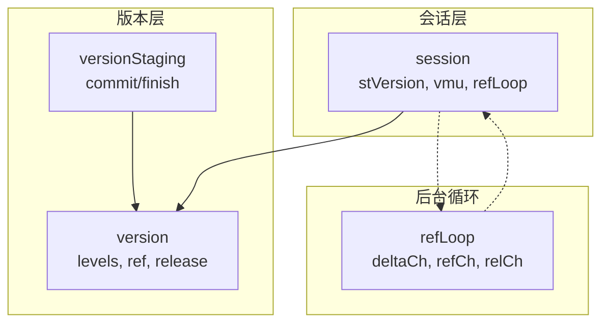
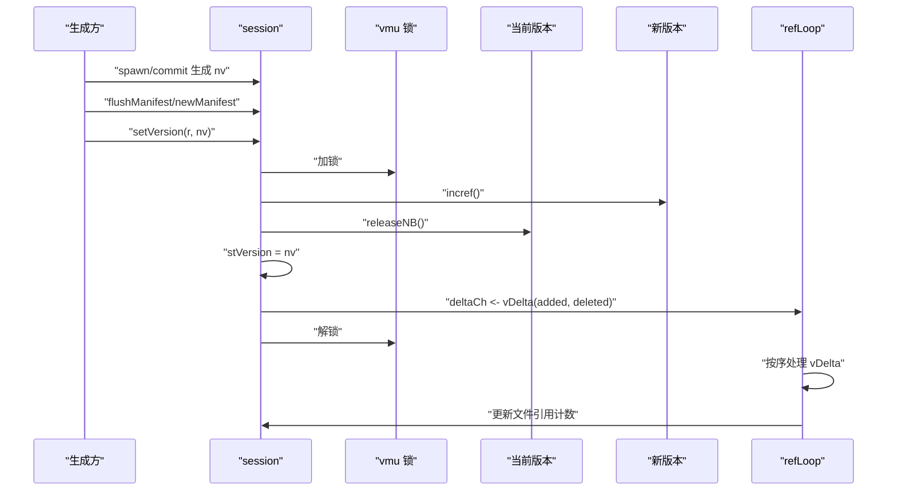
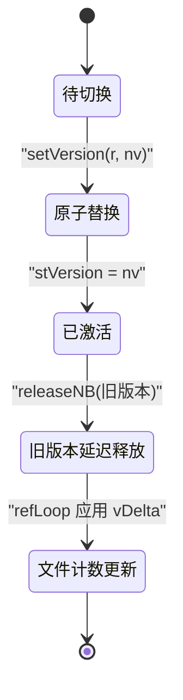
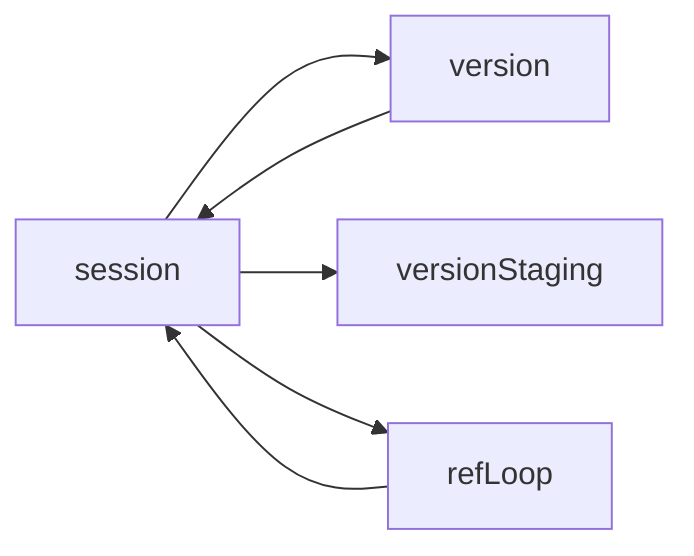

# 版本切换

<cite>
**本文引用的文件**
- [session.go](file://leveldb/session.go)
- [session_util.go](file://leveldb/session_util.go)
- [version.go](file://leveldb/version.go)
- [version_test.go](file://leveldb/version_test.go)
</cite>

## 目录
1. [简介](#简介)
2. [项目结构](#项目结构)
3. [核心组件](#核心组件)
4. [架构总览](#架构总览)
5. [详细组件分析](#详细组件分析)
6. [依赖关系分析](#依赖关系分析)
7. [性能考量](#性能考量)
8. [故障排查指南](#故障排查指南)
9. [结论](#结论)

## 简介
本文围绕 avccDB 的版本切换机制，聚焦于 setVersion 方法的实现与行为，系统阐述：
- 新版本生成后如何以原子方式替换当前版本（stVersion 字段）
- 版本切换过程中的锁机制（vmu 互斥锁）使用
- 旧版本的引用计数与释放处理
- 版本变更通知的传播机制（delta 通道）
- 并发环境下多个 goroutine 如何安全访问当前版本
- 版本切换对正在进行的读操作的影响
- 状态转换图：从“待切换”到“激活”的完整流程
- 关键代码路径示例（以文件路径标注代替具体代码）

## 项目结构
与版本切换直接相关的模块位于 leveldb 子目录中：
- session.go：会话层，维护当前版本 stVersion、版本号分配、并发控制（vmu）、后台引用循环 refLoop
- session_util.go：会话工具函数，包含 setVersion 原子替换、version() 获取当前版本、refLoop 实现等
- version.go：版本模型与版本阶段化构建（versionStaging）、版本引用计数与释放、版本任务（vTask）与增量（vDelta）等
- version_test.go：测试用例覆盖 setVersion 调用、并发读取、文件引用计数等

图表来源
- [session.go](file://leveldb/session.go#L55-L65)
- [session_util.go](file://leveldb/session_util.go#L70-L176)
- [version.go](file://leveldb/version.go#L26-L83)

章节来源
- [session.go](file://leveldb/session.go#L55-L65)
- [session_util.go](file://leveldb/session_util.go#L70-L176)
- [version.go](file://leveldb/version.go#L26-L83)

## 核心组件
- stVersion：当前生效版本指针，由 session 维护
- vmu：会话级互斥锁，保护 stVersion 的读写与引用计数
- version：版本对象，包含各层级表集合、引用计数 ref、释放标记 released
- versionStaging：版本阶段化构建器，commit 记录变更，finish 构建新版本
- refLoop：后台循环，消费 refCh/relCh/deltaCh，按严格顺序处理版本任务，维护文件引用计数
- vDelta/vTask：版本任务与增量信息，用于传播版本变更通知

章节来源
- [session.go](file://leveldb/session.go#L55-L65)
- [version.go](file://leveldb/version.go#L26-L83)
- [session_util.go](file://leveldb/session_util.go#L48-L69)

## 架构总览
版本切换是“生成新版本 -> 原子替换 -> 旧版本延迟释放”的过程。关键路径如下：
- 生成新版本：通过 versionStaging.commit/finish 构建 nv
- 写入日志/提交记录：commit 中 flushManifest/newManifest
- 原子替换：setVersion 在 vmu 保护下先对新版本 incref，再 release 当前版本，最后赋值 stVersion
- 通知传播：setVersion 将新增/删除的表文件号打包为 vDelta 发送到 deltaCh
- 后台处理：refLoop 按序消费 vDelta，更新文件引用计数；必要时将缓存的任务转为全量引用/释放

图表来源
- [session.go](file://leveldb/session.go#L210-L242)
- [session_util.go](file://leveldb/session_util.go#L266-L295)
- [session_util.go](file://leveldb/session_util.go#L70-L176)

章节来源
- [session.go](file://leveldb/session.go#L210-L242)
- [session_util.go](file://leveldb/session_util.go#L266-L295)
- [session_util.go](file://leveldb/session_util.go#L70-L176)

## 详细组件分析

### setVersion 方法：原子替换与锁机制
- 加锁保护：setVersion 使用 vmu 互斥锁，确保 stVersion 替换过程的原子性
- 新版本持有：在释放旧版本之前，先对新版本调用 incref，避免仍被使用的文件被提前释放
- 旧版本释放：调用 releaseNB 对旧版本进行非阻塞释放（内部会通过 refLoop 通道传播任务）
- 最终赋值：在 vmu 保护下将 stVersion 指向新版本
- 变更通知：若传入的 sessionRecord 非空，提取新增/删除的表文件号，封装为 vDelta 发送到 deltaCh

关键路径参考
- [setVersion 原子替换与通知](file://leveldb/session_util.go#L266-L295)

章节来源
- [session_util.go](file://leveldb/session_util.go#L266-L295)

### 版本引用与释放：版本生命周期
- 版本引用计数：version.incref/releaseNB/release 通过 session 的 refCh/relCh 与 refLoop 协作
- 延迟释放策略：refLoop 支持“增量模式”（deltaCh）与“全量模式”（refCh/relCh），避免长时间占用导致队列阻塞
- 文件引用计数：refLoop 维护表文件引用计数，当计数归零时触发删除

关键路径参考
- [版本引用计数与释放](file://leveldb/version.go#L52-L89)
- [版本释放器（带锁）](file://leveldb/version.go#L851-L865)
- [refLoop 处理流程](file://leveldb/session_util.go#L70-L176)

章节来源
- [version.go](file://leveldb/version.go#L52-L89)
- [version.go](file://leveldb/version.go#L851-L865)
- [session_util.go](file://leveldb/session_util.go#L70-L176)

### 版本阶段化构建：新版本生成
- versionStaging.commit：收集新增/删除的表文件，形成 tablesScratch
- versionStaging.finish：基于 base 版本与 scratch 构建新版本，排序与裁剪层级，计算压缩分数

关键路径参考
- [版本阶段化构建](file://leveldb/version.go#L707-L759)
- [finish 完成新版本构建](file://leveldb/version.go#L744-L849)

章节来源
- [version.go](file://leveldb/version.go#L707-L759)
- [version.go](file://leveldb/version.go#L744-L849)

### 并发安全与读操作影响
- 读侧安全：读取当前版本通过 session.version() 获取，内部对 stVersion.incref，返回后必须调用 version.release() 归还引用
- 写侧安全：setVersion 在 vmu 保护下执行，保证替换原子性
- 并发读写：读操作持有版本引用，即使发生版本切换，读取仍基于旧版本数据视图，不会受新版本替换影响

关键路径参考
- [获取当前版本（带引用）](file://leveldb/session_util.go#L251-L258)
- [读取完成后释放版本引用](file://leveldb/version.go#L851-L865)

章节来源
- [session_util.go](file://leveldb/session_util.go#L251-L258)
- [version.go](file://leveldb/version.go#L851-L865)

### 版本切换状态转换图
从“待切换”到“激活”的完整流程如下：
- 待切换：已生成新版本 nv，但尚未替换 stVersion
- 原子替换：setVersion 在 vmu 下先 incref(nv)，再 releaseNB(旧版本)，最后赋值 stVersion
- 通知传播：setVersion 将新增/删除的表文件号打包为 vDelta 发送至 deltaCh
- 后台处理：refLoop 按序应用 vDelta，更新文件引用计数；必要时将缓存任务转为全量引用/释放

图表来源
- [session_util.go](file://leveldb/session_util.go#L266-L295)
- [session_util.go](file://leveldb/session_util.go#L70-L176)

章节来源
- [session_util.go](file://leveldb/session_util.go#L266-L295)
- [session_util.go](file://leveldb/session_util.go#L70-L176)

### 关键代码路径示例（以文件路径标注代替具体代码）
- 新版本生成与提交
  - [spawn/commit/newManifest/flushManifest](file://leveldb/session.go#L210-L242)
  - [versionStaging.commit/finish](file://leveldb/version.go#L707-L849)
- 原子替换与通知
  - [setVersion 原子替换与发送 vDelta](file://leveldb/session_util.go#L266-L295)
- 引用计数与后台处理
  - [version.incref/releaseNB/release](file://leveldb/version.go#L52-L89)
  - [refLoop 处理 vDelta/refCh/relCh](file://leveldb/session_util.go#L70-L176)
- 读取当前版本
  - [session.version() 获取并增加引用](file://leveldb/session_util.go#L251-L258)

章节来源
- [session.go](file://leveldb/session.go#L210-L242)
- [version.go](file://leveldb/version.go#L707-L849)
- [session_util.go](file://leveldb/session_util.go#L266-L295)
- [version.go](file://leveldb/version.go#L52-L89)
- [session_util.go](file://leveldb/session_util.go#L70-L176)
- [session_util.go](file://leveldb/session_util.go#L251-L258)

## 依赖关系分析
- session 依赖 version：维护 stVersion，通过 vmu 保护；通过 versionStaging 生成新版本
- version 依赖 session：引用计数与释放通过 session 的 refCh/relCh/deltaCh 与 refLoop 协作
- refLoop 依赖 vDelta/vTask：严格按版本 ID 顺序处理引用/释放，维护文件引用计数

图表来源
- [session.go](file://leveldb/session.go#L55-L65)
- [version.go](file://leveldb/version.go#L26-L83)
- [session_util.go](file://leveldb/session_util.go#L70-L176)

章节来源
- [session.go](file://leveldb/session.go#L55-L65)
- [version.go](file://leveldb/version.go#L26-L83)
- [session_util.go](file://leveldb/session_util.go#L70-L176)

## 性能考量
- 原子替换成本低：仅一次 vmu 加锁/解锁与一次指针赋值
- 增量通知减少开销：通过 deltaCh 传递新增/删除文件号，避免全量扫描
- 后台批处理：refLoop 将多版本任务合并处理，降低频繁文件操作的代价
- 读写分离：读取通过版本引用，不阻塞写入替换；写入替换在 vmu 保护下快速完成

## 故障排查指南
- 版本未生效或读到旧数据
  - 检查是否正确调用 setVersion 且未被异常路径提前返回
  - 确认读取侧在使用完版本后调用了 release
  - 参考：[setVersion 原子替换](file://leveldb/session_util.go#L266-L295)、[读取后释放版本](file://leveldb/version.go#L851-L865)
- 文件被提前删除
  - 检查 refLoop 是否收到 vDelta 并正确应用
  - 确保 setVersion 正确发送了 vDelta
  - 参考：[refLoop 处理 vDelta](file://leveldb/session_util.go#L70-L176)
- 并发读写冲突
  - 确保所有读取通过 session.version() 获取并释放
  - 写入替换通过 setVersion 原子执行
  - 参考：[获取当前版本](file://leveldb/session_util.go#L251-L258)

章节来源
- [session_util.go](file://leveldb/session_util.go#L266-L295)
- [version.go](file://leveldb/version.go#L851-L865)
- [session_util.go](file://leveldb/session_util.go#L70-L176)
- [session_util.go](file://leveldb/session_util.go#L251-L258)

## 结论
avccDB 的版本切换通过“生成新版本 -> 原子替换 -> 延迟释放”的设计，在保证并发安全的同时，最小化了写入路径的开销。vmu 互斥锁确保 stVersion 替换的原子性，版本引用计数与 refLoop 的增量/全量处理机制共同保障了文件生命周期的安全与高效。读操作通过版本引用获得一致的数据视图，不受写入替换的影响。该机制为上层业务提供了稳定、可追溯的版本管理能力。